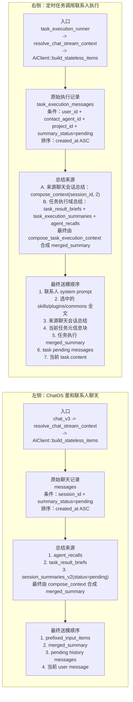
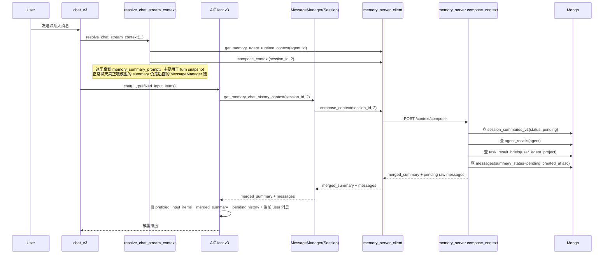
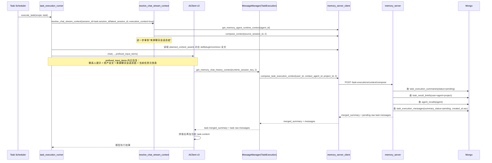

# ChatOS 联系人聊天与定时任务执行上下文链路说明

本文只聚焦两个问题：

1. 当用户在 ChatOS 里和联系人聊天时，聊天记录怎么取、总结怎么取。
2. 当定时任务调用联系人执行任务时，聊天记录怎么取、总结怎么取。

我按实际代码链路拆开说明，并把两条链分别画成时序图。

---

## 0. 两个流程并排对比图

这张图只看你最关心的 4 件事：

1. 从哪里进来
2. 原始聊天记录从哪里取
3. 总结从哪里取
4. 最后按什么结构送给模型

先直接看结论：

- 联系人聊天，原始记录来自 `messages`，主键基本是 `session_id`
- 定时任务执行，原始记录来自 `task_execution_messages`，主键基本是 `user_id + contact_agent_id + project_id`
- 联系人聊天只有一套主总结链
- 定时任务执行同时带两层总结：来源聊天总结 + 任务执行域总结

---

## 1. 联系人聊天：上下文怎么取

### 1.1 入口

主入口在：

- `/Users/lilei/project/my_project/chatos_rs/chat_app_server_rs/src/api/chat_v3.rs`
- `/Users/lilei/project/my_project/chatos_rs/chat_app_server_rs/src/api/chat_stream_common.rs`
- `/Users/lilei/project/my_project/chatos_rs/chat_app_server_rs/src/services/v3/ai_client/stateless_context.rs`
- `/Users/lilei/project/my_project/chatos_rs/chat_app_server_rs/src/services/message_manager_common.rs`
- `/Users/lilei/project/my_project/chatos_rs/memory_server/backend/src/services/context.rs`

### 1.2 真正送给模型的上下文组成

联系人聊天时，最终送给模型的上下文主要由 4 块组成：

1. `base_system_prompt`
2. 联系人相关的前置 system prompt
3. memory server 组装后的 `merged_summary`
4. 尚未被总结的原始消息 `pending messages`

其中第 3、4 块，就是你最关心的“总结怎么取、聊天记录怎么取”。

### 1.3 联系人聊天时，聊天记录怎么取

实际取数发生在：

- `/Users/lilei/project/my_project/chatos_rs/chat_app_server_rs/src/services/v3/ai_client/stateless_context.rs`
- `/Users/lilei/project/my_project/chatos_rs/chat_app_server_rs/src/services/message_manager_common.rs`
- `/Users/lilei/project/my_project/chatos_rs/memory_server/backend/src/services/context.rs`
- `/Users/lilei/project/my_project/chatos_rs/memory_server/backend/src/repositories/messages/read_ops.rs`

调用链：

1. `chat_v3::stream_chat_v3`
2. `AiServer::chat`
3. `AiClient::process_request`
4. `AiClient::build_stateless_items`
5. `message_manager.get_memory_chat_history_context(session_id, 2)`
6. `memory_server_client::compose_context(session_id, 2)`
7. `memory_server::compose_context`
8. `messages::list_pending_messages(session_id, pending_limit)`

这里最关键的取数条件是：

- 只取 `messages` 集合里 `summary_status = "pending"` 的消息
- 按 `created_at ASC` 升序返回
- `include_raw_messages = true`

对应代码：

- `/Users/lilei/project/my_project/chatos_rs/memory_server/backend/src/repositories/messages/read_ops.rs`

也就是说，联系人聊天时不会把整段全量历史重新塞给模型，而是：

- 较早的历史被压缩进 `merged_summary`
- 只把“还没被总结掉”的原始消息继续当作聊天记录塞进去

### 1.4 联系人聊天时，总结怎么取

总结的主入口：

- `/Users/lilei/project/my_project/chatos_rs/memory_server/backend/src/services/context.rs`

`compose_context` 会拼 3 类总结块：

1. 智能体记忆 `agent_memory_section`
2. 最近任务结果桥接摘要 `task_result_section`
3. 当前会话总结链 `summary_section`

注意拼接顺序是：

1. 智能体记忆
2. 任务结果桥接摘要
3. 会话总结

对应代码：

- `/Users/lilei/project/my_project/chatos_rs/memory_server/backend/src/services/context.rs`

#### 1.4.1 会话总结怎么选

`compose_context` 先查：

- `summaries::list_summaries(session_id, None, Some("pending"), summary_limit * 20, 0)`

对应条件：

- 只取 `session_summaries_v2`
- 只取 `status = "pending"` 的 summary
- 排序是 `level DESC, created_at ASC`

然后 `compose_summary_section` 再二次裁剪：

- 从所有 `level > 0` 的总结里，取最多 2 条“高层总结”
- 从所有 `level = 0` 的总结里，取最多 2 条“L0 总结”
- 最后按 `created_at ASC` 拼成文本

非常重要：

- 现在传进去的 `summary_limit` 并不直接决定最终塞给模型几条总结
- 它现在只是影响“先从库里抓多大窗口”
- 真正最后进模型的数量，是代码里写死的：
  - 高层最多 2 条
  - L0 最多 2 条

相关常量：

- `TOP_SUMMARY_COUNT = 2`
- `LEVEL0_SUMMARY_COUNT = 2`

#### 1.4.2 智能体记忆怎么选

`compose_agent_memory_section_from_agent` 会从 `agent_recalls` 里取：

- 最近 1 条
- 最高 level 的 1 条

如果两条重复，就去重。

相关常量：

- `DEFAULT_AGENT_MEMORY_LATEST_COUNT = 1`
- `DEFAULT_AGENT_MEMORY_TOP_LEVEL_COUNT = 1`

#### 1.4.3 任务结果桥接摘要怎么选

`compose_task_result_brief_section` 会从 `task_result_briefs` 里按当前：

- `user_id`
- `contact_agent_id`
- `project_id`

取最近最多 3 条任务结果桥接摘要。

相关常量：

- `DEFAULT_TASK_RESULT_BRIEF_COUNT = 3`

### 1.5 联系人聊天时，最终模型输入顺序

在 v3 路径里，最终顺序大致是：

1. `prefixed_input_items`
2. `merged_summary` 作为一个 system message
3. `pending history messages`
4. 本轮新的 user message

并且会跳过两类“只用于展示/系统内部”的历史消息：

- `metadata.type = session_summary`
- `metadata.type = task_execution_notice`

过滤代码：

- `/Users/lilei/project/my_project/chatos_rs/chat_app_server_rs/src/services/v3/ai_client/stateless_context.rs`

### 1.6 联系人聊天时序图

---

## 2. 定时任务执行：上下文怎么取

### 2.1 入口

主入口在：

- `/Users/lilei/project/my_project/chatos_rs/chat_app_server_rs/src/services/task_execution_runner.rs`
- `/Users/lilei/project/my_project/chatos_rs/chat_app_server_rs/src/services/message_manager_common.rs`
- `/Users/lilei/project/my_project/chatos_rs/chat_app_server_rs/src/services/memory_server_client/task_execution_ops.rs`
- `/Users/lilei/project/my_project/chatos_rs/memory_server/backend/src/services/context.rs`

### 2.2 定时任务执行时，模型实际收到哪些上下文

定时任务执行时，最终给模型的上下文，不只是“任务执行聊天记录 + 任务执行总结”，而是至少 5 块：

1. `base_system_prompt`
2. 联系人 system prompt
3. 本次任务明确选中的技能 / 插件 / commons 全文
4. 来源聊天会话总结
5. 任务执行域自己的 `merged_summary`
6. 任务执行域里尚未被总结的原始消息
7. 本次任务元信息块

真正最容易忽略的是第 4 和第 5 同时存在。

### 2.3 定时任务执行时，聊天记录怎么取

定时任务使用的是：

- `MessageManager::new_task_execution(...)`

这意味着它不会去查普通 session 的 `messages`，而是会走：

- `memory_server_client::compose_task_execution_context(user_id, contact_agent_id, project_id, 2)`

最终落到：

- `memory_server::compose_task_execution_context`
- `task_execution_messages::list_pending_messages(...)`

查询条件：

- 集合：`task_execution_messages`
- 条件：
  - `user_id = 当前用户`
  - `contact_agent_id = 当前联系人`
  - `project_id = 当前项目`
  - `summary_status = "pending"`
- 排序：`created_at ASC`

也就是说，定时任务执行时的“聊天记录”，取的是任务执行域自己的 pending 原始记录，不是普通会话消息表。

### 2.4 定时任务执行时，总结怎么取

定时任务有两套总结来源。

#### 2.4.1 第一套：来源聊天会话总结

在 `build_task_runtime` 里会先构造一个假的 `ChatStreamRequest`：

- `session_id = task.session_id 或 scope.latest_session_id`
- `execution_context = true`

然后调用：

- `resolve_chat_stream_context(...)`

而 `resolve_chat_stream_context` 内部仍然会做：

- `memory_server_client::compose_context(session_id, 2)`

这里拿到的是“来源会话”的 `memory_summary_prompt`。

随后在 `build_task_execution_prefixed_input_items` 里，这个 summary 会被直接写成 system item：

- `历史上下文总结：\n{summary}`

所以：

- 定时任务执行时，模型会先看到“这条任务最初来源于什么聊天上下文”

#### 2.4.2 第二套：任务执行域自己的总结

与此同时，任务执行自己的 `MessageManager(TaskExecution)` 又会在构建 stateless context 时调用：

- `compose_task_execution_context(user_id, contact_agent_id, project_id, 2)`

这个接口内部会拼 3 类内容：

1. 任务结果桥接摘要 `task_result_section`
2. 任务执行总结链 `summary_section`
3. 智能体记忆 `agent_memory_section`

注意顺序和普通聊天不一样：

1. 任务结果桥接摘要
2. 任务执行总结
3. 智能体记忆

#### 2.4.3 任务执行总结怎么选

`compose_task_execution_context` 先查：

- `task_execution_summaries::list_summaries(user_id, contact_agent_id, project_id, None, Some("pending"), summary_limit * 20, 0)`

然后仍然走同一个 `compose_summary_section`：

- 高层总结最多 2 条
- L0 总结最多 2 条

所以这里和普通聊天一样：

- `summary_limit` 当前只是抓取窗口，不是最终展示条数

#### 2.4.4 智能体记忆怎么选

和普通聊天相同：

- 最近 1 条
- 最高 level 1 条

#### 2.4.5 任务结果桥接摘要怎么选

和普通聊天相同，但它在任务执行场景里通常更关键，因为它就是前面任务的结果桥。

查询条件：

- `user_id`
- `contact_agent_id`
- `project_id`

限制：

- 最多 3 条

### 2.5 定时任务执行时，还有哪些额外 system context

除了“来源聊天总结”和“任务执行域总结”，任务执行还会额外带：

#### 2.5.1 任务元信息块

`build_task_execution_prefixed_input_items` 会追加：

- 当前处于后台任务执行阶段
- `task_id`
- 任务标题
- 任务状态
- 来源用户目标摘要
- 来源约束摘要
- 本次任务允许使用的内置 MCP
- 结果 contract

#### 2.5.2 选中的资产全文

`build_task_execution_asset_context` 会把任务规划阶段选中的：

- skills
- plugins
- commons

取全文，而不是只取简介，然后并入联系人 system prompt。

这部分来源于：

- `task.planned_context_assets`

并分别去 memory server 取：

- skill content
- plugin content + commands
- runtime common content

### 2.6 定时任务执行时，最终模型输入顺序

从实现上看，定时任务执行的最终上下文大致是：

1. 联系人 system prompt
2. 选中的技能 / 插件 / commons 全文
3. 来源聊天会话总结
4. 当前任务元信息块
5. 任务执行域 merged_summary
6. 任务执行域 pending 原始消息
7. 当前任务内容本身

### 2.7 定时任务执行时序图

---

## 3. 两条链最核心的差异

### 3.1 聊天记录来源不同

联系人聊天：

- `messages`
- 条件：`session_id + summary_status=pending`

定时任务执行：

- `task_execution_messages`
- 条件：`user_id + contact_agent_id + project_id + summary_status=pending`

### 3.2 总结来源不同

联系人聊天：

- 会话总结链 `session_summaries_v2`
- 智能体记忆 `agent_recalls`
- 任务结果桥接摘要 `task_result_briefs`

定时任务执行：

- 任务执行总结链 `task_execution_summaries`
- 智能体记忆 `agent_recalls`
- 任务结果桥接摘要 `task_result_briefs`
- 另外还会额外再带一份“来源聊天会话总结”

### 3.3 拼接顺序不同

联系人聊天：

1. 智能体记忆
2. 任务结果桥接摘要
3. 会话总结
4. pending 原始聊天记录

定时任务执行：

1. 联系人 prompt + 选中资产全文
2. 来源聊天会话总结
3. 当前任务元信息
4. 任务结果桥接摘要
5. 任务执行总结
6. 智能体记忆
7. pending 原始任务执行记录

---

## 4. 现在这个实现里，最值得注意的几个点

### 4.1 `summary_limit` 现在不是“最终塞几条”

目前无论聊天还是任务执行：

- API 层把 `summary_limit` 传给 memory server
- memory server 会先抓 `summary_limit * 20` 条 pending summary
- 但真正最后进模型的仍是固定：
  - 高层 2 条
  - L0 2 条

也就是说，现在 `summary_limit` 更像“候选抓取窗口”，不是最终输出上限。

### 4.2 定时任务执行会同时带两套 summary

这是当前最容易误读的地方：

- 一套是来源聊天会话的 summary
- 一套是任务执行域自己的 summary

这不是 bug，而是当前实现刻意叠加的结果。

### 4.3 原始消息只取 pending，不取全量

两条链都不是“把全部历史原样塞回去”。

它们的共同思路都是：

- 老历史 -> summary
- 新增未消费原文 -> pending messages

---

## 5. 关键代码位置

联系人聊天：

- `/Users/lilei/project/my_project/chatos_rs/chat_app_server_rs/src/api/chat_v3.rs`
- `/Users/lilei/project/my_project/chatos_rs/chat_app_server_rs/src/api/chat_stream_common.rs`
- `/Users/lilei/project/my_project/chatos_rs/chat_app_server_rs/src/services/v3/ai_client/stateless_context.rs`
- `/Users/lilei/project/my_project/chatos_rs/chat_app_server_rs/src/services/message_manager_common.rs`
- `/Users/lilei/project/my_project/chatos_rs/memory_server/backend/src/services/context.rs`
- `/Users/lilei/project/my_project/chatos_rs/memory_server/backend/src/repositories/messages/read_ops.rs`
- `/Users/lilei/project/my_project/chatos_rs/memory_server/backend/src/repositories/summaries/read_ops.rs`

定时任务执行：

- `/Users/lilei/project/my_project/chatos_rs/chat_app_server_rs/src/services/task_execution_runner.rs`
- `/Users/lilei/project/my_project/chatos_rs/chat_app_server_rs/src/services/message_manager_common.rs`
- `/Users/lilei/project/my_project/chatos_rs/chat_app_server_rs/src/services/memory_server_client/task_execution_ops.rs`
- `/Users/lilei/project/my_project/chatos_rs/memory_server/backend/src/services/context.rs`
- `/Users/lilei/project/my_project/chatos_rs/memory_server/backend/src/repositories/task_execution_messages.rs`
- `/Users/lilei/project/my_project/chatos_rs/memory_server/backend/src/repositories/task_execution_summaries.rs`
