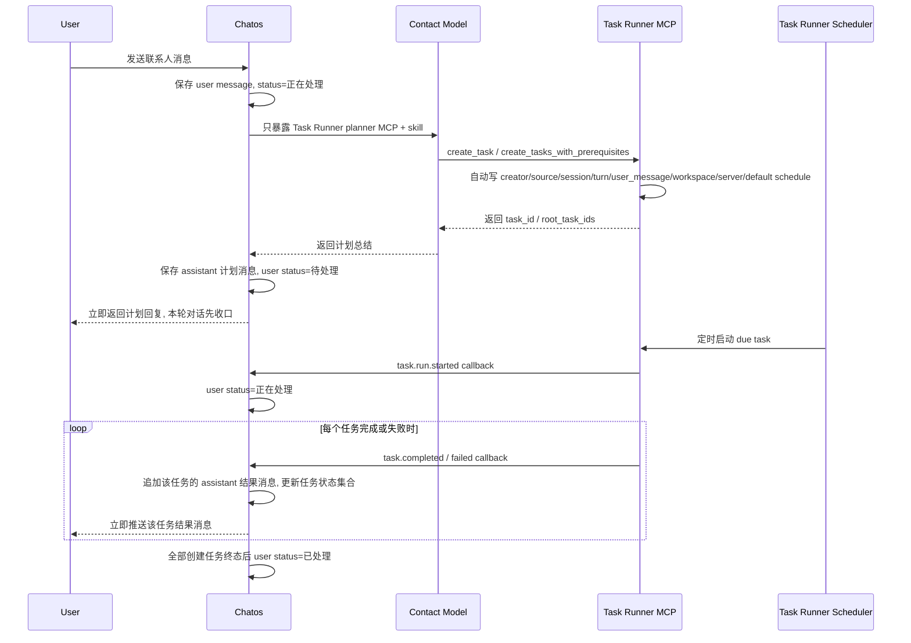

# Chatos 与 Task Runner 异步任务对话改造方案

## 1. 目标态

本次改造不是在旧实时工具流上做兼容补丁，而是把 Chatos 联系人对话一次性切换成新的异步任务模式：

- Chatos 对话侧不再直接暴露和调用任意 MCP；联系人对话只允许使用 Task Runner 提供的“异步任务规划”MCP 工具。
- 用户给联系人发消息后，Chatos 只负责让模型创建 Task Runner 任务，并让模型立即返回“已创建哪些任务、计划如何执行”的最终总结。
- 联系人模型不等待任务执行完成，不轮询任务状态，不主动触发执行。
- Task Runner 调度器负责按定时器启动已创建任务。
- Task Runner 在任务开始、任务完成时回调 Chatos；Chatos 根据透传的会话 ID、轮次 ID、用户消息 ID，把状态和最终结果补回原会话。
- 前端呈现为类似微信的人与人对话：一条用户消息有“待处理 / 正在处理 / 已处理”状态；后续任务结果作为普通 assistant 消息自然出现。

## 2. 当前代码事实

### Chatos 当前链路

- 入口在 `chat_app_server_rs/src/api/agent_chat.rs` 的 `/api/agent/chat/send`，后台调用 `run_chat_usecase`。
- `chat_app_server_rs/src/modules/conversation_runtime/chat_usecase.rs` 构建模型运行时和 bootstrap。
- `chat_app_server_rs/src/modules/conversation_runtime/runtime_context.rs` 当前会先按页面或会话选择加载普通 MCP，再额外挂 Task Runner MCP。
- `runtime_context.rs` 里已经会给 Task Runner MCP 透传：
  - `X-Chatos-Session-Id`
  - `X-Chatos-Turn-Id`
  - `X-Task-Runner-Workspace-Dir`
  - `X-Task-Runner-Remote-Server-Config`
- `chat_app_server_rs/src/modules/conversation_runtime/chat_runner.rs` 会构造实时 stream callbacks，并把工具调用过程通过 `chat.tool.*` 事件推给前端。
- `chat_app_server_rs/src/services/agent_runtime/ai_client/execution_loop.rs` 当前会执行工具调用循环，并默认持久化工具消息。
- 消息持久化走 `chat_app_server_rs/src/services/chatos_sessions.rs`，最终写入 memory engine 的 Chatos session message。
- `chat_app_server_rs/src/models/message.rs` 没有业务处理状态字段，但有 `metadata`；`MessageOut` 会原样返回 `metadata`。

### Chatos 前端当前链路

- `chat_app/src/lib/store/actions/sendMessage.ts` 当前发送前会创建本地 user message 和空的 assistant streaming draft。
- `chat_app/src/components/chatInterface/useChatStreamRealtimeBridge.ts` 依赖 `chat.*` 实时事件推进 streaming draft。
- `chat_app/src/lib/store/actions/sendMessage/streamEventHandler.ts` 会处理 `chat.tool.*`、thinking、chunk、complete。
- `chat_app/src/components/MessageItem.tsx` 和 `HistoryProcessSummary` 会把工具过程作为对话过程展示。

如果后端直接停止发送工具流但前端不改，当前前端可能出现空 assistant draft、loading 不收口、或需要通过 snapshot recovery 才能补消息。因此前端必须同步切到“消息事件/状态事件”模型。

### Task Runner 当前链路

- 调度器在 `task_runner_service/backend/src/scheduler.rs`，定时调用 `TaskService::list_due_scheduled_tasks`，然后调用 `RunService::start_run`。
- 执行完成在 `task_runner_service/backend/src/services.rs` 的 `RunService::execute_run_model_phase` 末尾落库。
- Task Runner task 已有：
  - `source_session_id`
  - `source_turn_id`
  - `process_log`
  - `prerequisite_task_ids`
  - `mcp_config`
  - creator 字段
- MCP server 在 `task_runner_service/backend/src/mcp_server.rs`。当前普通 agent 仍能看到很多工具，包括 `start_task_run`、`list_runs`、`get_run`、memory summary、prompt 等。
- 当前 `create_task` 默认状态是 `Draft`，默认 schedule 是 `Manual`；如果不改，AI 创建出来的任务不会被调度器自动执行。

## 3. 总体架构



## 4. Chatos 后端改造

### 4.1 新建异步任务对话运行路径

在 `chat_app_server_rs/src/modules/conversation_runtime` 下新增独立模块，例如：

- `task_runner_async_chat.rs`
- `task_runner_async_messages.rs`
- `task_runner_callbacks.rs`

`/api/agent/chat/send` 不再进入旧的 `run_bootstrapped_chat` 实时工具流路径。新的处理步骤：

1. 解析请求、会话、用户、联系人。
2. 生成或使用传入的 `turn_id`。
3. 持久化 user message，并写入正式 metadata：

```json
{
  "conversation_turn_id": "turn_xxx",
  "task_runner_async": {
    "mode": "planner",
    "status": "processing",
    "phase": "planning",
    "label": "正在处理",
    "created_task_ids": [],
    "root_task_ids": [],
    "source": "chatos"
  }
}
```

4. 如果联系人没有配置 Task Runner 账号密码，直接持久化一条 assistant 错误消息，并把 user message 标记为 `status=completed, phase=failed`；不再回退到普通聊天或其它 MCP。
5. 构造只包含 Task Runner planner MCP 的运行时。
6. 调模型，让模型调用 Task Runner MCP 创建任务。
7. 持久化 assistant 计划消息。
8. 将 user message 状态更新为：

```json
{
  "task_runner_async": {
    "status": "pending",
    "phase": "task_created",
    "label": "待处理",
    "created_task_ids": ["..."],
    "root_task_ids": ["..."],
    "planner_message_id": "..."
  }
}
```

9. 立即把计划 assistant message 返回给用户，并发送 `chat.message.updated` 和 `chat.message.created` realtime 事件给前端；这一轮联系人对话到这里就结束，不等待 Task Runner 调度和执行。

这里的 `Message.status` 仍保留给前端本地 streaming/error 状态使用；Task Runner 业务状态统一放在 `metadata.task_runner_async`，避免和现有前端 `MessageStatus = pending | streaming | completed | error` 语义冲突。

注意：如果前端仍使用 `/api/agent/chat/send` 的 command 异步方式，这个“返回给用户”不一定是原 HTTP 请求的同步 response body，而是 Chatos 后端持久化计划 assistant message 后，通过 `chat.message.created` 推给前端并 upsert 到消息列表。用户体验上它就是本轮模型回复。

### 4.2 不再构建普通 MCP bundle

改造 `chat_app_server_rs/src/modules/conversation_runtime/runtime_context.rs`：

- 删除联系人对话中 `load_mcp_servers_by_selection(...)` 的普通 MCP 注入。
- 删除联系人对话中 `contact_agent_skill_reader_server`、`contact_agent_command_reader_server`、`contact_agent_plugin_reader_server` 的工具注入。
- 仍允许读取联系人资料、system prompt、Task Runner skill，但这些只能进 prompt，不能变成 MCP 工具。
- 构造 Task Runner MCP server 时追加 header：

```text
Authorization: Bearer <task-runner-agent-token>
X-Task-Runner-Tool-Profile: chatos_async_planner
X-Chatos-Session-Id: <session_id>
X-Chatos-Turn-Id: <turn_id>
X-Chatos-User-Message-Id: <user_message_id>
X-Task-Runner-Workspace-Dir: <程序解析出的工作目录>
X-Task-Runner-Remote-Server-Config: <程序编码的远程服务器配置>
```

其中账号、密码、token、工作目录、服务器配置、callback 配置都只由程序透传，不进入 AI 可填写字段。

### 4.3 不再向前端发送工具过程事件

新的异步任务规划路径不使用 `build_chat_stream_callbacks(..., enable_tools=true)`。

具体要求：

- 不发送 `chat.tool.started`
- 不发送 `chat.tool.delta`
- 不发送 `chat.tool.completed`
- 不发送旧的 thinking/tool timeline 过程事件
- 不持久化 tool role message 到 Chatos 会话
- 只发送：
  - `chat.message.updated`
  - `chat.message.created`
  - `chat.turn.planned`
  - `chat.turn.failed`

`/api/agent/chat/send` 的联系人路径必须改成新的 planner runner，并且 planner runner 需要以“静默工具调用”方式执行 Task Runner MCP。旧的实时工具循环不能再被联系人主链路调用。

### 4.4 新增 Task Runner 回调接口

新增 API：

```http
POST /api/task-runner/callbacks/task-events
```

鉴权：

- 使用服务间 shared secret。
- Header：

```text
X-Task-Runner-Event-Id: <event_id>
X-Task-Runner-Signature: sha256=<hmac>
X-Task-Runner-Timestamp: <unix_ms>
```

请求体：

```json
{
  "event_id": "uuid",
  "event_type": "task.run.started",
  "task_id": "task-id",
  "run_id": "run-id",
  "source_session_id": "chatos-session-id",
  "source_turn_id": "turn-id",
  "source_user_message_id": "user-message-id",
  "status": "running",
  "title": "任务标题",
  "result_summary": null,
  "content": null,
  "process_log": null,
  "error_message": null,
  "started_at": "2026-06-10T10:00:00Z",
  "completed_at": null,
  "metadata": {
    "is_root_task": true,
    "creator_user_id": "task-runner-agent-user-id"
  }
}
```

完成事件：

```json
{
  "event_id": "uuid",
  "event_type": "task.completed",
  "task_id": "task-id",
  "run_id": "run-id",
  "source_session_id": "chatos-session-id",
  "source_turn_id": "turn-id",
  "source_user_message_id": "user-message-id",
  "status": "succeeded",
  "title": "任务标题",
  "result_summary": "简短结果摘要",
  "content": "完整任务输出或关键报告",
  "process_log": "内部执行过程摘要",
  "error_message": null,
  "completed_at": "2026-06-10T10:05:00Z",
  "metadata": {
    "is_root_task": true,
    "is_prerequisite_task": false
  }
}
```

响应：

```json
{
  "ok": true,
  "duplicate": false,
  "message_id": "created-assistant-message-id"
}
```

处理规则：

- `task.run.started`：更新原 user message 的 `task_runner_async.status=processing`、`phase=running`、`label=正在处理`，并把当前 task/run 写入 `running_task_ids/latest_run_ids`。
- `task.completed` / `task.failed` / `task.cancelled` / `task.blocked`：
  - 每收到一个任务的终态回调，就立即追加一条普通 assistant message 给用户；不等待同一批其它任务全部完成。
  - message metadata：

```json
{
  "conversation_turn_id": "turn-id",
  "task_runner_async_result": {
    "task_id": "...",
    "run_id": "...",
    "status": "succeeded",
    "source": "task_runner_service"
  }
}
```

  - 更新原 user message 的任务状态集合，例如 `completed_task_ids`、`failed_task_ids`、`blocked_task_ids`、`cancelled_task_ids`。
  - 如果还有已创建任务未进入终态，user message 保持 `status=processing` 或 `status=pending`；只有 `created_task_ids` 里的任务全部终态后，才把 user message 改为 `status=completed`、`label=已处理`。

幂等：

- Chatos 新增回调事件去重记录，至少按 `event_id` 去重。
- 如果同一 `event_id` 重放，直接返回 `duplicate=true`。
- 如果缺少 `source_session_id` 或 `source_turn_id`，返回 202 并记录 dead-letter，不写入对话。

### 4.5 Realtime 事件模型

新增 realtime payload，不再复用旧 `chat_stream` 表达消息新增：

```text
chat.message.created
chat.message.updated
```

payload：

```json
{
  "kind": "chat_message",
  "conversation_id": "...",
  "conversation_turn_id": "...",
  "message": { "...MessageOut": "..." }
}
```

前端收到后按 `message.id` upsert 到本地 messages。

新增 `chat.turn.planned` 作为“本轮规划完成”的信号，里面带 persisted user/assistant message，方便当前发送链路收口；它不是旧 stream 工具过程事件。

## 5. Chatos 前端改造

### 5.1 sendMessage 不再创建空 assistant streaming draft

改造 `chat_app/src/lib/store/actions/sendMessage.ts`：

- 发送用户消息后只创建本地 user message，metadata 初始：

```ts
task_runner_async: {
  status: 'processing',
  phase: 'planning',
  label: '正在处理'
}
```

- 不再创建空 assistant streaming draft。
- 不再要求本轮必须存在 `streamingMessageId` 才能处理服务端事件。
- `/api/agent/chat/send` 返回 accepted 后即可允许输入框继续发送；后端消息事件负责补计划回复。
- 如果要保证同一会话规划顺序，后端做 session planner queue，前端不靠 loading 锁死整会话。

### 5.2 新增消息 upsert realtime handler

新增或改造：

- `chat_app/src/lib/realtime/useConversationChatMessageRealtime.ts`
- `chat_app/src/components/chatInterface/useChatStreamRealtimeBridge.ts`

要求：

- 当前 `useChatStreamRealtimeBridge` 不再是联系人会话的主桥。
- 新桥订阅 `chat.message.created`、`chat.message.updated`。
- 根据 `message.id` upsert。
- 如果当前 session 正在打开，直接更新列表。
- 如果用户不在当前会话，只更新 session unread/last message 元数据，进入会话时再从 `/messages` 拉取。

### 5.3 消息状态展示

改造：

- `chat_app/src/types/chat.ts` 给 metadata 增加 `task_runner_async` 类型。
- `chat_app/src/components/messageItem/MessageHeader.tsx` 或 user bubble 右侧增加状态 pill。
- 状态只显示三种：
  - `pending` => 待处理
  - `processing` => 正在处理
  - `completed` => 已处理

内部 `phase` 可以更细：

- `planning`
- `task_created`
- `running`
- `completed`
- `failed`
- `blocked`
- `cancelled`

但 UI 不再展示一堆内部阶段。

### 5.4 移除联系人对话里的工具过程 UI

联系人会话不再展示：

- `HistoryProcessSummary`
- `ToolCallTimeline`
- `TurnProcessModal`
- `chat.tool.*` 实时过程

这些组件即使源码暂时存在，也不能再被联系人聊天主界面引用；联系人聊天主界面不再出现工具调用过程。

## 6. Task Runner 后端改造

### 6.1 MCP planner profile

改造 `task_runner_service/backend/src/mcp_server.rs`：

- 读取 `McpRequestContext.tool_profile`，来自 header `X-Task-Runner-Tool-Profile`。
- 当 profile 为 `chatos_async_planner` 时，只返回 planner 工具。
- 普通 agent 也不再默认看到执行/查询细节工具；对外 agent 工具面收窄。

建议 planner 工具：

- `create_task`
- `create_tasks_with_prerequisites`
- `list_mcp_builtin_catalog`
- `list_tasks`，只返回自己创建任务的精简摘要，用于引用已有任务作为前置任务

不再暴露给 Chatos 联系人 AI：

- `start_task_run`
- `batch_start_task_runs`
- `list_runs`
- `get_run`
- `list_run_events`
- `get_task_memory_context`
- `list_task_memory_records`
- `summarize_task_memory`
- `update_task`
- `delete_task`
- `batch_update_task_status`
- `batch_delete_tasks`
- ui prompt 相关工具
- model config 管理工具

### 6.2 create_task 自动设置调度和模型

AI 不应该填写执行方式、状态、模型、账号、callback、工作目录、服务器配置。

当请求来自 `chatos_async_planner` profile：

- `status = Ready`
- `schedule.mode = Once`
- `schedule.next_run_at = now`
- `default_model_config_id` 由 Task Runner 系统默认配置决定：
  - 优先 `TASK_RUNNER_DEFAULT_MODEL_CONFIG_ID`
  - 其次 agent 用户绑定的默认模型配置
  - 最后可选择第一个 enabled model config；如果没有，创建失败并返回明确配置错误
- `mcp_config.workspace_dir` 使用 `X-Task-Runner-Workspace-Dir`
- `mcp_config.default_remote_server_id` 使用程序透传的 remote server config 创建出的 server record
- `source_session_id` / `source_turn_id` / `source_user_message_id` 使用 header
- `callback_policy` 自动开启

`create_task` schema 对 AI 隐藏：

- `status`
- `schedule`
- `default_model_config_id`
- `mcp_config.workspace_dir`
- `mcp_config.default_remote_server_id`
- 任何账号、token、callback 字段

### 6.3 批量创建前置任务的调度规则

`create_tasks_with_prerequisites` 需要自动区分“根任务”和“前置任务”，但回调策略不是只通知根任务，而是每个任务终态都通知 Chatos：

- 同一批任务里，被其他任务通过 `prerequisite_refs` 引用的任务，是前置任务。
- 没有被其他任务引用的任务，是根任务。
- 根任务：
  - `status = Ready`
  - `schedule.mode = Once`
  - `schedule.next_run_at = now`
  - `callback_policy.notify_on_terminal = true`
- 前置任务：
  - `status = Ready`
  - `schedule.mode = Manual`
  - `callback_policy.notify_on_terminal = true`
  - 由根任务执行时的 `RunService::prepare_prerequisite_context` 递归启动

这样做的用户体验是：前置任务 A 完成就先发 A 的结果消息，前置任务 B 完成就发 B 的结果消息，根任务 C 最后完成时再发 C 的结果消息。C 执行时仍然会把 A/B 的结果和执行过程摘要加入全局 prompt。

如果一次创建多个互不依赖的根任务，则每个根任务完成后各自回调一条 assistant 结果消息。

### 6.4 新增 callback outbox

Task Runner 不要在执行完成后直接 `tokio::spawn` 一次 HTTP 请求就结束。需要新增 outbox，保证任务完成但回调失败时可以重试。

新增模型：

```rust
TaskCallbackEventRecord {
    id: String,
    event_id: String,
    event_type: String,
    task_id: String,
    run_id: Option<String>,
    source_session_id: Option<String>,
    source_turn_id: Option<String>,
    source_user_message_id: Option<String>,
    payload: Value,
    state: "pending" | "sending" | "succeeded" | "failed",
    attempt_count: i32,
    next_retry_at: Option<String>,
    last_error: Option<String>,
    created_at: String,
    updated_at: String,
}
```

新增配置：

```text
TASK_RUNNER_CHATOS_CALLBACK_URL=http://127.0.0.1:8088/api/task-runner/callbacks/task-events
TASK_RUNNER_CHATOS_CALLBACK_SECRET=...
TASK_RUNNER_CALLBACK_TIMEOUT_MS=10000
TASK_RUNNER_CALLBACK_MAX_ATTEMPTS=10
```

触发点：

- `RunService::execute_run_model_phase` 状态变 `Running` 后写 `task.run.started` outbox。
- 终态保存 run/task 后写 terminal outbox：
  - `task.completed`
  - `task.failed`
  - `task.cancelled`
  - `task.blocked`
- `finish_blocked_by_prerequisite` 和 `finish_cancelled_before_start` 也要写终态 outbox。

新增 callback dispatcher：

- 启动时类似 scheduler 一起 spawn。
- 轮询 pending / failed 且到达 `next_retry_at` 的事件。
- HMAC 签名后 POST 到 Chatos。
- 2xx 视为成功。
- 409 或 duplicate=true 视为成功。
- 其它错误指数退避。

### 6.5 Task Runner skill 改写

改造：

- `task_runner_service/TASK_RUNNER_AI_SKILL.zh-CN.md`
- `task_runner_service/TASK_RUNNER_AI_SKILL.en-US.md`
- `GET /api/skills/task-runner?lang=...`

新 skill 必须明确：

- 你的职责是把用户请求拆成 Task Runner 任务。
- 创建任务后立即给用户总结计划。
- 不要启动任务。
- 不要等待任务完成。
- 不要轮询运行状态。
- 不要查询 run 细节。
- 如果需要前置任务，同一批新建任务用 `create_tasks_with_prerequisites` 的 `client_ref` / `prerequisite_refs`。
- 只有需要任务执行时使用某类工具，才选择对应 `enabled_builtin_kinds`。
- 账号、token、工作目录、远程服务器、callback 都由系统透传，不要提及，也不要向用户索要。

## 7. 消息数据模型

### 7.1 用户消息 metadata

```json
{
  "conversation_turn_id": "turn_xxx",
  "task_runner_async": {
    "mode": "planner",
    "status": "pending",
    "phase": "task_created",
    "label": "待处理",
    "source": "chatos",
    "created_task_ids": ["task_1", "task_2"],
    "root_task_ids": ["task_2"],
    "latest_run_ids": [],
    "running_task_ids": [],
    "completed_task_ids": [],
    "failed_task_ids": [],
    "blocked_task_ids": [],
    "cancelled_task_ids": [],
    "planner_message_id": "assistant_plan_msg",
    "completed_result_message_ids": [],
    "last_event_id": "..."
  }
}
```

状态映射：

| 内部 status | UI 文案 | 说明 |
| --- | --- | --- |
| `pending` | 待处理 | 任务已创建，等待 Task Runner 调度 |
| `processing` | 正在处理 | Chatos 正在规划，或 Task Runner 正在运行 |
| `completed` | 已处理 | 收到终态回调，结果已写回 |

失败、取消、阻塞不新增第四个 UI 状态，放入 `phase` 和 error metadata：

```json
{
  "status": "completed",
  "phase": "failed",
  "label": "已处理",
  "error": "..."
}
```

### 7.2 计划 assistant 消息

```json
{
  "conversation_turn_id": "turn_xxx",
  "task_runner_async_plan": {
    "source_user_message_id": "user_msg",
    "created_task_ids": ["task_1", "task_2"],
    "root_task_ids": ["task_2"],
    "source": "chatos_planner"
  }
}
```

内容是模型自然语言总结，例如：

```text
我已经把这件事拆成 2 个任务，并设置了前置关系。先收集依赖信息，再执行最终处理任务。任务系统会自动执行，完成后我会把结果发回来。
```

### 7.3 结果 assistant 消息

```json
{
  "conversation_turn_id": "turn_xxx",
  "task_runner_async_result": {
    "source_user_message_id": "user_msg",
    "task_id": "task_2",
    "run_id": "run_1",
    "status": "succeeded",
    "source": "task_runner_service"
  }
}
```

内容直接来自 Task Runner result：

```text
任务「xxx」已完成。

结果：
...
```

如果失败：

```text
任务「xxx」执行失败。

原因：
...
```

## 8. 不会把现有发消息链路打崩的关键改法

这里不是靠旧 streaming 链路“凑合收口”，而是明确替换联系人会话发送协议。

必须同步改这些点：

1. 前端 `sendMessage.ts` 不再创建必须等待 complete 的空 assistant streaming draft。
2. 后端 `/api/agent/chat/send` accepted 后，由后台 planner job 通过 `chat.message.created/updated` 推消息。
3. 前端新增 message upsert realtime handler，不再要求 `sessionChatState[sessionId].isStreaming=true` 才处理消息事件。
4. 后端 planner 成功和失败都必须落一条 assistant 消息或更新 user message 状态，不能只发事件。
5. Task Runner 回调只依赖持久化的 `source_session_id/source_turn_id/source_user_message_id`，即使用户刷新页面或离线，结果仍能写入会话。
6. 当前旧 `chat.turn.completed` 的 recovery 可以删除或降级为非联系人内部调试路径；联系人主链路不能依赖 snapshot recovery。
7. `MessageOut.metadata` 已经原样返回，所以前端刷新页面后仍能恢复任务状态和结果关联。

## 9. 需要修改的文件清单

### Chatos 后端

- `chat_app_server_rs/src/api/agent_chat.rs`
  - `/api/agent/chat/send` 切到异步任务 planner。
- `chat_app_server_rs/src/api/mod.rs`
  - 注册 Task Runner callback router。
- `chat_app_server_rs/src/modules/conversation_runtime/runtime_context.rs`
  - 禁用普通 MCP、contact reader MCP。
  - 构建 planner-only Task Runner MCP。
  - 透传 `X-Chatos-User-Message-Id` 和 `X-Task-Runner-Tool-Profile`。
- `chat_app_server_rs/src/modules/conversation_runtime/chat_usecase.rs`
  - 联系人会话改走 async planner usecase。
- 新增 `chat_app_server_rs/src/modules/conversation_runtime/task_runner_async_chat.rs`
  - 保存用户消息、调用 planner、保存计划回复。
- 新增 `chat_app_server_rs/src/modules/conversation_runtime/task_runner_async_messages.rs`
  - metadata 构建、状态更新、message upsert。
- 新增 `chat_app_server_rs/src/api/task_runner_callbacks.rs`
  - 接收 Task Runner callback。
- `chat_app_server_rs/src/services/realtime/types.rs`
  - 新增 `ChatMessageRealtimePayload`。
- `chat_app_server_rs/src/services/realtime/hub.rs`
  - 新增 `publish_chat_message_created/updated`。
- `chat_app_server_rs/src/config.rs`
  - 新增 callback shared secret 配置，例如 `CHATOS_TASK_RUNNER_CALLBACK_SECRET`。

### Chatos 前端

- `chat_app/src/lib/store/actions/sendMessage.ts`
  - 移除联系人路径的 assistant streaming draft。
  - 发送后立即释放输入状态。
- `chat_app/src/lib/realtime/types.ts`
  - 新增 chat message realtime payload 类型。
- 新增 `chat_app/src/lib/realtime/useConversationChatMessageRealtime.ts`
  - 处理 `chat.message.created/updated`。
- `chat_app/src/components/chatInterface/useChatStreamRealtimeBridge.ts`
  - 联系人会话不再依赖旧 stream bridge。
- `chat_app/src/types/chat.ts`
  - 增加 `task_runner_async` metadata 类型。
- `chat_app/src/components/MessageItem.tsx`
  - user bubble 展示任务处理状态。
- `chat_app/src/components/messageItem/MessageHeader.tsx`
  - 如果状态放头部，这里渲染状态 pill。
- `chat_app/src/lib/domain/messages.ts`
  - normalize metadata 中的 task runner 状态。

### Task Runner 后端

- `task_runner_service/backend/src/models.rs`
  - `TaskRecord` 增加 `source_user_message_id`。
  - 增加 callback policy / callback outbox model。
- `task_runner_service/backend/src/mcp_server.rs`
  - 增加 `tool_profile`。
  - planner profile 下只暴露 planner tools。
  - create schema 隐藏系统字段。
- `task_runner_service/backend/src/services.rs`
  - planner profile create task 自动设置 Ready + Once + next_run_at。
  - 批量创建自动区分根任务和前置任务。
  - RunService 为每个任务写 started/terminal callback outbox。
- `task_runner_service/backend/src/store.rs`
  - 持久化新字段、新 outbox。
  - Mongo/SQLite/in-memory 都要加。
- `task_runner_service/backend/src/config.rs`
  - 增加 Chatos callback URL/secret/retry 配置。
- `task_runner_service/backend/src/scheduler.rs`
  - 保持任务调度；新增 callback dispatcher 或在 main 中单独 spawn。
- `task_runner_service/backend/src/main.rs`
  - 启动 callback dispatcher。
- `task_runner_service/TASK_RUNNER_AI_SKILL.zh-CN.md`
- `task_runner_service/TASK_RUNNER_AI_SKILL.en-US.md`
  - 改成异步任务规划指南。

## 10. 一次性迁移步骤

1. Task Runner 先改数据模型：
   - `source_user_message_id`
   - callback policy
   - callback outbox
2. Task Runner 改 MCP planner profile：
   - 收窄工具列表
   - 自动默认模型、调度、callback policy
3. Task Runner 改 RunService：
   - started/terminal 写 outbox
   - 每个任务终态都生成 callback event
   - callback dispatcher 投递 Chatos
4. Chatos 后端加 callback API：
   - 验签
   - 幂等
   - upsert result assistant message
   - 更新原 user message 状态
   - realtime 推送 message created/updated
5. Chatos 后端改 `/api/agent/chat/send`：
   - 走 async planner
   - 只构建 Task Runner planner MCP
   - 静默执行工具
   - 保存计划 assistant message
6. Chatos 前端改发送链路：
   - 不再创建空 assistant streaming draft
   - 展示 user message 状态
   - 处理 message created/updated realtime
7. 改 Task Runner skill：
   - 引导模型只建任务并返回计划总结
8. 删除或停用联系人会话旧工具过程入口：
   - 工具时间线
   - TurnProcessModal 入口
   - chat.tool.* 联系人路径处理

## 11. 验收标准

### 正常路径

1. 在 Chatos 联系人配置 Task Runner 账号密码。
2. 给联系人发送：“帮我完成 xxx”。
3. 前端立即出现用户消息，状态“正在处理”。
4. 模型调用 Task Runner planner MCP 创建任务。
5. 前端出现 assistant 计划总结。
6. 用户消息状态变“待处理”。
7. Task Runner 调度器启动任务后回调 Chatos。
8. 用户消息状态变“正在处理”。
9. 任意一个 Task Runner 任务执行完成后回调 Chatos。
10. Chatos 立即追加该任务的一条普通 assistant 结果消息。
11. 还有未终态任务时，用户消息仍显示待处理或正在处理；全部已创建任务终态后，用户消息状态变“已处理”。
12. 全程不显示工具调用过程。

### 前置任务路径

1. 模型用 `create_tasks_with_prerequisites` 创建 A、B、C，其中 C 依赖 A/B。
2. C 被调度器启动。
3. C 执行时自动先执行 A/B。
4. A 完成后 Chatos 立即追加 A 的结果消息。
5. B 完成后 Chatos 立即追加 B 的结果消息。
6. C 的 prompt 里包含 A/B 的结果和过程摘要。
7. C 完成后 Chatos 再追加 C 的结果消息。

### 离线/刷新路径

1. 用户发送消息后刷新页面。
2. 页面重新加载 messages 时能看到用户消息状态和计划回复。
3. Task Runner 后续每个任务完成回调后，对应结果消息都会持久化。
4. 再次进入会话能看到结果消息和“已处理”状态。

### 失败路径

1. Task Runner callback 重试不会重复追加消息。
2. planner 创建任务失败时，Chatos 写入 assistant 错误说明，并把用户消息设为“已处理”且 `phase=failed`。
3. 任意一个 Task Runner 任务执行失败时，Chatos 立即追加该任务的失败结果消息；如果还有其它任务未终态，用户消息继续保持待处理或正在处理。

## 12. 风险和处理

- 风险：Task Runner 创建任务没有默认模型导致调度执行失败。
  - 处理：planner profile 创建任务时强制补默认模型配置，没有默认模型直接创建失败。
- 风险：任务创建后仍是 manual/draft，不会被调度。
  - 处理：planner profile 自动设 `Ready + Once + next_run_at=now`。
- 风险：一个用户请求拆出多个任务后，用户收到多条结果消息时不知道对应关系。
  - 处理：每条结果消息标题必须带任务名、任务序号、是否前置任务/根任务，以及当前完成进度，例如 `任务 2/4 已完成`。
- 风险：旧前端 streaming draft 卡住。
  - 处理：联系人发送链路不再创建 streaming assistant draft，改用 message created/updated realtime。
- 风险：callback 到达时用户不在线。
  - 处理：先持久化消息，再推 realtime；离线用户下次打开从 messages 拉取。
- 风险：callback 重试导致重复结果。
  - 处理：Chatos 按 `event_id` 幂等，Task Runner outbox 按响应状态推进。
- 风险：多个消息并发规划导致上下文乱序。
  - 处理：Chatos 后端按 session 建 planner queue，同一 session 内顺序规划，不阻塞前端输入。

## 13. 最终删除/停用的旧行为

联系人会话最终不再使用以下行为：

- 页面勾选的普通 MCP 进入联系人模型。
- 联系人模型读取 Chatos skill/command/plugin 的 MCP reader 工具。
- 联系人模型直接执行 Chatos 内置工具。
- 联系人模型调用 Task Runner 的 `start_task_run`。
- 联系人模型轮询 `list_runs/get_run/list_run_events` 等运行详情。
- 前端展示工具调用实时过程。
- Chatos 通过轮询任务状态获得执行结果。

最终只保留：

- Chatos 程序获取 Task Runner skill 并注入 prompt。
- Chatos 程序透传 session/turn/user_message/workspace/server。
- 联系人模型通过 Task Runner planner MCP 创建任务。
- Task Runner 调度和回调驱动后续消息。
