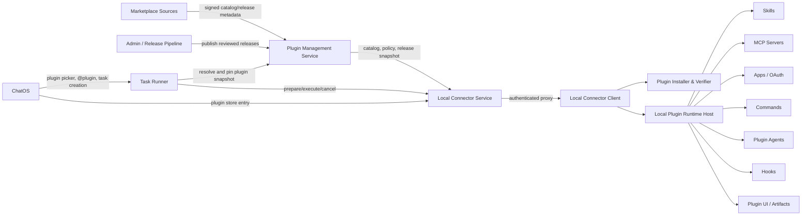
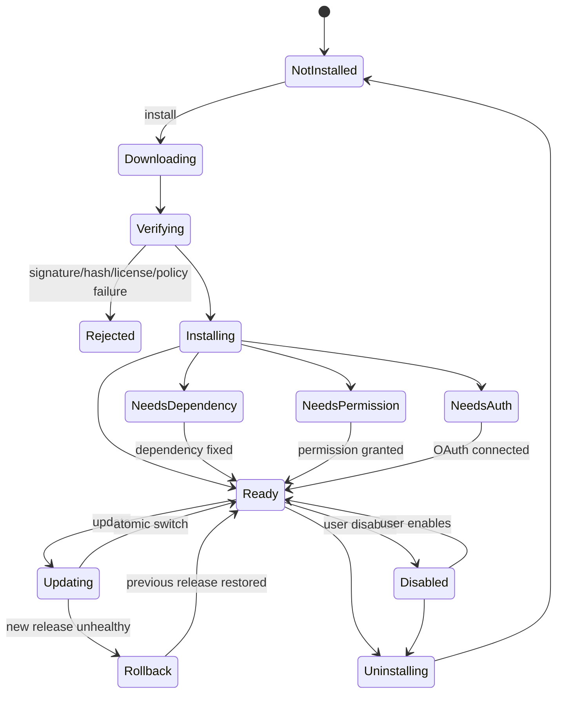

# Codex 插件体系 1:1 兼容实施方案

> 状态：待实施
> 创建日期：2026-07-21
> 适用范围：Plugin Management Service、Local Connector Client、Local Connector Service、Task Runner、ChatOS、统一 MCP Runtime
> 目标：在不复制或再分发受限专有实现的前提下，让 ChatOS 客户端在产品体验、插件模型、安装生命周期、运行时能力和安全边界上实现与 Codex 插件体系等价的 1:1 行为兼容。

## 1. 结论

仓库已经有 Plugin Management Service，而且它应继续作为这次建设的唯一插件控制面，不需要再创建新的“插件中心服务”。现有服务已经完成：

- MCP、Skill、Skill Package 的管理。
- 系统 Agent 和 Agent Capability Binding 管理。
- Local Connector Skill inventory、用户启用偏好和可用性解析。
- Task Runner/ChatOS/Local Connector 的能力快照和严格失败关闭链路。
- 统一 System MCP Catalog 和宿主 Provider/Adapter 架构。

但当前实现仍然是“独立 MCP + 独立 Skill + Skill Package”的资源管理模型，不是 Codex 的“Plugin 聚合模型”。Codex Plugin 可以同时携带：

- 插件元数据和市场展示信息。
- 一个或多个 Skills。
- stdio/HTTP MCP Servers。
- OAuth/Connected Apps。
- Commands。
- Agents。
- Hooks。
- 插件 UI/Workbench。
- Scripts、References、Assets、Schemas 和本机二进制。

因此本次不能继续通过单纯增加 Skill 条目完成。正确方向是：

1. 在现有 Plugin Management Service 中增加真正的 Plugin/Release/Installation 聚合模型。
2. 在 Local Connector 中建设签名插件安装器和多组件 Plugin Runtime Host。
3. 将现有 Skill、MCP、Agent 和权限能力作为 Plugin Component 接入，而不是推倒重写。
4. 将截图中的 13 个已安装 Codex 插件逐个补齐到功能等价。
5. 最后开放第三方市场插件安装，而不是一开始允许任意 Git/ZIP/command 执行。

本方案是新的总方案；现有文档的定位调整为：

- `docs/plans/PLUGIN_MANAGEMENT_SERVICE_IMPLEMENTATION_PLAN.zh-CN.md`：Plugin Management 初始控制面建设历史。
- `docs/plan/LOCAL_CONNECTOR_CODEX_SKILLS_PLUGIN_INTEGRATION_PLAN.zh-CN.md`：Skill Bundle 和 Local Connector 执行链子方案。
- `UNIFIED_MCP_ARCHITECTURE_IMPLEMENTATION_PLAN.md`：已经完成的统一 MCP 基础设施。
- `STRICT_PLUGIN_MANAGED_AGENT_CONFIGURATION_PLAN.zh-CN.md`：已经完成的系统 Agent 严格能力配置基础。
- 本文：Codex Plugin 1:1 兼容的唯一总实施计划。

## 2. “1:1 兼容”的定义

这里的 1:1 是可观察行为和产品能力兼容，不是复制 Codex 内部源码、专有二进制或私有协议。

### 2.1 必须达到的兼容层级

| 层级 | 1:1 目标 |
| --- | --- |
| 市场体验 | 搜索、已安装区、公开/个人、Featured、分类、详情、安装、启用、更新、卸载、错误修复 |
| Manifest | 能表达 Codex Plugin 中的 Skills、MCP、Apps、Commands、Agents、Hooks、UI 和 interface 元数据 |
| 生命周期 | catalog -> download -> verify -> install -> dependency/auth/permission -> enable -> activate -> update/rollback -> uninstall |
| Skill Runtime | 完整读取 `SKILL.md`、references、scripts、assets，并按触发规则向模型暴露 |
| MCP Runtime | stdio、HTTP、OAuth HTTP、工具发现、超时、取消、健康检查和插件版本快照 |
| App Runtime | Connected App/OAuth 连接、作用域、凭据状态、断开和重新授权 |
| Command Runtime | 插件命令发现、参数提示、执行上下文和权限限制 |
| Agent Runtime | 插件内 Agent Prompt、工具边界、任务委派和运行记录 |
| Hook Runtime | 受控的生命周期事件、匹配器、签名命令和超时/失败策略 |
| UI Runtime | 插件详情、Workbench、交互式 Artifact/Panel、严格 CSP 和消息桥 |
| 安全 | 发布者信任、Ed25519、哈希、SBOM、许可、沙箱、凭据隔离、审批、审计、回滚保护 |

### 2.2 不属于 1:1 的内容

- 不复制 OpenAI Proprietary、Figma Developer Terms 或其他受限许可内容。
- 不直接打包 Codex Computer Use、Chrome Host、Browser Runtime 或 Codex Security 的专有二进制。
- 不要求内部 RPC、数据库或进程结构与 Codex 相同。
- 不允许为追求“兼容”而绕过用户授权、系统权限、OAuth 或本机审批。
- 不允许未验签插件执行任意 shell、下载任意二进制或访问任意目录。

对于专有插件，验收标准是用户可见能力和安全语义等价，由 ChatOS 自主实现底层 Adapter。

## 3. 当前代码基线

### 3.1 已完成能力

| 领域 | 当前实现 |
| --- | --- |
| Plugin Management | 已有 `plugin_mcps`、`plugin_skills`、`plugin_skill_packages`、`plugin_agents`、bindings、checks、preferences 和 installations |
| System MCP | 19 个 System MCP 已进入统一 Catalog，执行后端由 Host Adapter/Resolver 解析 |
| System Agent | 12 个系统 Agent 已严格按 Plugin Management 能力快照运行 |
| Local Skills | 安装包内置 27 个 Skill Bundle，12 个 adapter-ready，15 个 fail closed |
| Skill Relay | prepare/execute/cancel 已完成，并固定 device/workspace/version/hash |
| 用户偏好 | Admin Skill 全局可见、用户默认关闭、启用后才进入 selectable catalog |
| Task Runner | 任务支持 `selected_skill_ids`，Run 固定 bundle snapshot，并路由到同一 Local Connector |
| 本机 MCP | 用户 stdio/HTTP MCP 配置只存本机，通过 Local Connector 执行 |
| 权限 | workspace、process、browser、network、Accessibility、Screen Recording、Office 等能力映射已经存在 |
| 沙箱 | Docker/native process 权限策略、审批、受管配置签名和回滚保护已经存在 |

### 3.2 与 Codex Plugin 模型的主要差距

| 差距 | 当前事实 | 目标 |
| --- | --- | --- |
| 没有 Plugin 聚合根 | 数据库只有 MCP、Skill、Skill Package | Plugin 统一拥有 release 和全部 component |
| Skill Package 语义错误 | 仍以 git/repository/cache/installed 表达包 | 改为不可变 Plugin Release |
| 无用户插件市场 | Local Connector 只有 Skill 卡片和启用开关 | 完整插件商店和详情页 |
| 无安装生命周期 | 用户安装入口明确禁用 | 本机下载、验签、安装、升级、回滚、卸载 |
| 无 Codex Manifest 兼容 | ChatOS Plugin Creator 只有 `plugin_id/skill_bundle_ids/mcp_resource_ids` | 解析和规范化 `.codex-plugin/plugin.json` 结构 |
| 无 Apps/OAuth | MCP 与 Skill 外没有 App 模型 | Connected Apps、OAuth scope、token state |
| 无 Hooks | 没有插件事件运行时 | 受控 Pre/Post Tool、Session、Run hooks |
| 无 Commands | ChatOS legacy 能读 Markdown commands，但未进入统一控制面 | Plugin Command component 和运行时 |
| 无 Plugin Agents | 只有系统 Agent，插件内 agents 未建模 | 插件 Agent component 和委派边界 |
| 无 Plugin UI | 没有 Workbench/App panel | 沙箱化 UI Runtime 和会话 Artifact |
| Bundle 不完整 | 当前内部 Bundle 主要只有 `skill.json` 和 `instructions.md` | 支持 references/scripts/assets/schemas/binaries |
| 签名不完整 | Skill 使用嵌入 hash；没有 release 签名链 | Ed25519 release/catalog signature、key rotation、rollback protection |
| 旧系统并存 | ChatOS 仍有 Git clone/cache/`memory_skill_plugins` | 迁移到统一 Plugin Management + Local Connector |

### 3.3 当前 13 个 Codex 已安装插件对照

当前机器安装的核心插件为：Documents、PDF、Spreadsheets、Presentations、Template Creator、Remotion、Figma、Computer Use、Visualize、Browser、Chrome、Codex Security、Game Studio。

| Plugin | 当前 ChatOS 状态 | 主要差距 |
| --- | --- | --- |
| Documents | 部分可用 | 只有基础 DOCX 创建/检查；缺编辑、样式、表格、图片、批注、修订、渲染验收 |
| PDF | 部分可用 | 只有检查和文本提取；缺 OCR、生成、编辑、页面渲染、视觉验收 |
| Spreadsheets | 部分可用 | 只有 CSV/单 Sheet XLSX；缺公式、样式、图表、多 Sheet、重算和 Google Sheets handoff |
| Presentations | 部分可用 | 只有文字 PPTX；缺布局、图片、图表、备注、动画、渲染验收 |
| Template Creator | 部分可用 | 只有复制和哈希；缺模板语义、占位符和内容实例化 |
| Remotion | Prompt-only | 缺完整 references、依赖检查、预览、渲染和产物验证 |
| Figma | 11 个目录项均 planned | 缺 OAuth、HTTP MCP、use/read/write/diagram/slides/motion/code-connect 全链路 |
| Computer Use | planned | 缺桌面观察、窗口/控件树、截图、输入操作、打断和恢复 |
| Visualize | 部分可用 | 只能写独立 HTML；缺会话内交互式 Artifact、地图、3D 和状态桥 |
| Browser | 部分可用 | 有 agent-browser + Chrome for Testing；缺真正 in-app browser 承载面和会话 UI |
| Chrome | 缺失 | 缺控制用户现有 Chrome 状态、标签、Cookie、登录态、扩展和站点授权 |
| Codex Security | 缺失 | 缺 13 个安全工作流、扫描合同、MCP、Workbench、SARIF 和工单连接器 |
| Game Studio | 缺失 | 缺 9 个游戏 Skill、2D/3D 架构、素材流水线和浏览器 Playtest |

截图中尚未安装但可见的 HyperFrame、Superpowers、CircleCI、Sentry、Build macOS Apps、Build Web Apps、Build Web Data Visualization、Test Android Apps 等，不应逐个硬编码到客户端；完成通用 Plugin Runtime 后，它们应作为普通 Plugin Release 接入。

## 4. 目标总体架构



职责必须保持清晰：

- Plugin Management：市场、Plugin/Release 元数据、可见性、策略、Agent Binding、版本和审计索引。
- Local Connector Service：认证、active device lease、控制面代理和 Relay 路由，不执行插件代码。
- Local Connector Client：下载、验签、安装、依赖检查、OAuth、权限、凭据和真实执行。
- Task Runner：插件选择、Run 快照、模型编排、组件装配和执行生命周期。
- ChatOS：插件市场入口、会话选择、状态展示、Artifact/UI 承载和用户交互。

## 5. Plugin 领域模型

### 5.1 稳定身份

插件唯一身份使用：

```text
plugin_key = <plugin_name>@<marketplace_id>
```

示例：

```text
figma@openai-api-curated
documents@openai-primary-runtime
chatos-security@chatos-official
```

不能只用 display name，也不能只用 bundle hash。版本身份为：

```text
release_key = <plugin_key>/<semver-or-release-version>
```

### 5.2 新增 MongoDB Collections

#### `plugin_marketplaces`

保存市场来源和信任策略：

```rust
pub struct PluginMarketplaceRecord {
    pub id: String,
    pub name: String,
    pub source_kind: String, // official_registry | admin_registry | local_directory
    pub catalog_url: Option<String>,
    pub enabled: bool,
    pub trust_level: String, // bundled | trusted | untrusted
    pub trusted_signing_keys: Vec<SigningKeyRef>,
    pub last_catalog_revision: Option<String>,
    pub last_synced_at: Option<String>,
}
```

首版只允许：

- `chatos-official`：ChatOS 自有签名发布。
- `chatos-bundled`：随客户端安装包内置。
- Admin 审核后的 trusted registry。

`local_directory` 只允许开发者模式，不得上报为 production trusted。

#### `plugin_catalog_entries`

保存插件市场展示和最新版本摘要：

```rust
pub struct PluginCatalogRecord {
    pub id: String,
    pub plugin_key: String,
    pub marketplace_id: String,
    pub name: String,
    pub display_name: String,
    pub description: String,
    pub publisher: PluginPublisher,
    pub interface: PluginInterfaceMetadata,
    pub keywords: Vec<String>,
    pub visibility: String,
    pub featured: bool,
    pub enabled: bool,
    pub latest_release_id: String,
    pub license: PluginLicenseMetadata,
    pub created_at: String,
    pub updated_at: String,
}
```

#### `plugin_releases`

Release 必须不可变：

```rust
pub struct PluginReleaseRecord {
    pub id: String,
    pub plugin_id: String,
    pub version: String,
    pub manifest_schema_version: u32,
    pub normalized_manifest: PluginManifest,
    pub artifact_ref: String,
    pub artifact_sha256: String,
    pub signature: PluginReleaseSignature,
    pub sbom_ref: Option<String>,
    pub supported_platforms: Vec<String>,
    pub components: Vec<PluginComponentDescriptor>,
    pub dependencies: PluginDependencySpec,
    pub permissions: Vec<PluginPermissionRequirement>,
    pub release_channel: String,
    pub published_at: String,
    pub revoked_at: Option<String>,
}
```

同一 `plugin_id + version` 的 manifest、artifact hash 或 signature 发生变化时直接拒绝，不能原地覆盖。

#### `plugin_installations`

安装状态属于用户当前设备：

```rust
pub struct PluginInstallationRecord {
    pub id: String,
    pub owner_user_id: String,
    pub device_id: String,
    pub plugin_id: String,
    pub release_id: String,
    pub version: String,
    pub artifact_sha256: String,
    pub platform: String,
    pub install_status: String,
    pub availability_status: String,
    pub dependency_status: String,
    pub permission_status: String,
    pub auth_status: String,
    pub component_statuses: Vec<PluginComponentStatus>,
    pub active: bool,
    pub previous_release_id: Option<String>,
    pub installed_at: String,
    pub last_checked_at: String,
    pub last_error: Option<String>,
}
```

唯一键：

```text
(owner_user_id, device_id, plugin_id)
```

必须区分：

- `installed`：文件和元数据已经安装。
- `enabled`：用户允许该插件参与运行。
- `available`：依赖、权限、OAuth 和组件健康检查全部满足。
- `active`：当前版本是该设备使用的原子激活版本。

#### `plugin_user_preferences`

```rust
pub struct UserPluginPreferenceRecord {
    pub owner_user_id: String,
    pub plugin_id: String,
    pub enabled: bool,
    pub auto_update: bool,
    pub release_channel: String,
    pub enabled_components: Vec<String>,
    pub updated_at: String,
}
```

#### `plugin_component_snapshots`

保存 Plugin Release 展开后的只读组件索引，用于能力解析，不保存本机密钥或本机绝对路径。

#### `plugin_oauth_connections`

云端只保存非敏感状态：provider、scope、connected、device、expires_at、account display。Access token、refresh token 和 client secret 必须留在 Local Connector Keychain/Credential Vault。

#### `plugin_audit_logs`

记录 publish、install、verify、enable、permission、OAuth、update、rollback、execute、cancel、uninstall 和 revoke。

### 5.3 复用现有资源集合

现有 `plugin_mcps`、`plugin_skills` 和 `plugin_agents` 不删除，但增加：

```text
plugin_id
release_id
component_key
managed_by_plugin
immutable_from_release
```

规则：

- 独立系统 MCP 仍可存在。
- Plugin 内的 MCP/Skill/Agent 由 Release 展开生成，管理员不能直接修改身份、runtime 或内容。
- 展示名称和 rollout policy 可覆盖；可执行内容只能通过新 Release 更新。
- `plugin_skill_packages` 在迁移后进入只读兼容，最终由 `plugin_releases` 取代。

## 6. Manifest 兼容设计

### 6.1 双格式入口、单一内部模型

支持读取：

```text
.codex-plugin/plugin.json
.chatos-plugin/plugin.json
```

两者都必须规范化为 SDK 中的 `PluginManifest`。不允许不同运行时分别解析原始 JSON。

建议新增：

```text
crates/chatos_plugin_management_sdk/src/plugin_manifest/
  mod.rs
  parser.rs
  validator.rs
  normalized.rs
  components.rs
  paths.rs
  tests.rs
```

### 6.2 PluginManifest 字段

```rust
pub struct PluginManifest {
    pub schema_version: u32,
    pub name: String,
    pub version: String,
    pub description: String,
    pub author: PluginAuthor,
    pub homepage: Option<String>,
    pub repository: Option<String>,
    pub license: Option<String>,
    pub keywords: Vec<String>,
    pub skills: Vec<PluginPathRef>,
    pub mcp_servers: Vec<PluginMcpServer>,
    pub apps: Vec<PluginApp>,
    pub commands: Vec<PluginCommand>,
    pub agents: Vec<PluginAgent>,
    pub hooks: Vec<PluginHook>,
    pub ui: Vec<PluginUiContribution>,
    pub interface: PluginInterfaceMetadata,
    pub dependencies: PluginDependencySpec,
    pub permissions: Vec<PluginPermissionRequirement>,
    pub bundled_content_variant: Option<String>,
}
```

### 6.3 Codex 字段映射

| Codex 字段/文件 | ChatOS 规范化目标 |
| --- | --- |
| `skills` | `PluginComponent::SkillCollection` |
| `mcpServers` / `.mcp.json` | `PluginComponent::McpServer` |
| `apps` / `.app.json` | `PluginComponent::ConnectedApp` |
| `commands/` | `PluginComponent::Command` |
| `agents/` | `PluginComponent::Agent` |
| `hooks.json` | `PluginComponent::HookSet` |
| `ui/*.html` | `PluginComponent::UiContribution` |
| `interface.displayName` | 市场展示名称 |
| `interface.category` | 市场分类 |
| `interface.capabilities` | 高层能力摘要，不能替代真实权限声明 |
| `interface.defaultPrompt` | 插件详情和会话建议提示 |
| `composerIcon/logo/logoDark` | 安全解析后的插件资产 |
| `brandColor` | UI 主题元数据 |
| `bundledContentVariant` | 运行时变体标签，必须映射到 ChatOS 支持的 adapter |

### 6.4 Bundle 目录

```text
<plugin-name>/<version>/
  .chatos-plugin/plugin.json
  .codex-plugin/plugin.json          # 可选兼容输入，不作为运行时权威源
  skills/
  mcp/
  apps/
  commands/
  agents/
  hooks.json
  ui/
  scripts/
  references/
  assets/
  schemas/
  binaries/<platform>/
  licenses/
  checksums.json
  sbom.spdx.json
  signature.ed25519
```

安装完成后生成规范化只读副本：

```text
<app-data>/plugins/<plugin-key>/<version>/
```

禁止运行时直接使用下载缓存、Git 工作树或 ZIP 临时目录。

## 7. Plugin Component Runtime

### 7.1 Skills

必须支持：

- 递归发现 `skills/*/SKILL.md`。
- 完整加载 Skill 主说明；按引用关系延迟加载 references/scripts/assets。
- Skill 名称、描述、触发规则、前置 Skill 和禁止条件。
- 每个 Skill 的权限、平台、依赖和可用性。
- Skill 指令大小限制、路径穿越校验和循环引用检测。
- Skill 选择后固定 plugin release、skill path 和 content hash。
- Prompt-only、native adapter、process、MCP bridge、composite 五种执行类型。

不能把整个插件所有文档无条件注入模型。模型只获得当前选择 Skill 所需的最小内容。

### 7.2 MCP Servers

复用 `chatos_mcp_runtime`，新增 Plugin MCP Adapter：

- stdio command 必须是插件签名覆盖的相对路径或审核 command ID。
- HTTP MCP 支持固定 URL、headers 模板、OAuth resource 和 connect timeout。
- 工具目录、schema、超时、取消、健康检查和 tool allow/block list。
- environment variable 只允许声明变量名；秘密值从本机 Credential Vault 注入。
- cwd 固定为插件目录或授权 workspace，不能逃逸。
- MCP 进程按 plugin/release/run 隔离并有进程树回收。

### 7.3 Connected Apps / OAuth

新增本机 OAuth Broker：

1. Plugin 声明 provider、authorization endpoint/resource、scope 和 callback type。
2. Local Connector 发起系统浏览器或内嵌安全授权页。
3. PKCE verifier、access token、refresh token 存入 Keychain。
4. 云端只接收 connection status 和非敏感 account summary。
5. Plugin Runtime 根据 exact plugin/release/component 请求 token handle，不获得原始跨插件凭据。
6. scope 扩大、账号切换或 token 失效必须重新授权。

Figma、GitHub、Linear、Atlassian、Google Workspace 等都复用这一层。

### 7.4 Commands

Command 需要包含：

- command name、description、argument hint。
- Markdown prompt 或受控 adapter entrypoint。
- 所属 plugin/release。
- 可用 Agent、工作区和权限范围。
- 是否需要用户确认。

ChatOS 输入框支持 `/command` 和插件详情页点击运行，但 Command 不能绕过 Task Runner/Local Connector 权限策略。

### 7.5 Plugin Agents

插件 Agent 不是新的常驻微服务，而是签名 Release 中的受控 Agent Profile：

- role/system prompt。
- 可使用的 Plugin Components 和 System MCP。
- model capability requirement。
- delegation policy。
- 最大迭代、超时和输出 contract。

Plugin Agent 必须通过 Plugin Management Capability Policy 解析，不能自行继承主 Agent 权限。

### 7.6 Hooks

首版支持白名单事件：

```text
SessionStart
BeforePluginPrepare
PreToolUse
PostToolUse
RunCompleted
RunFailed
PluginDisabled
```

Hook 约束：

- 只能运行签名 Release 中声明的命令/adapter。
- matcher 使用结构化字段，不执行任意表达式。
- 有独立 timeout、输出上限、失败策略和审计记录。
- 默认不能修改用户文件；写权限必须显式声明并经审批。
- Hook 失败不能静默改变工具结果。
- 禁止插件通过 Hook 修改自身签名目录。

### 7.7 Plugin UI / Workbench

新增沙箱化 UI Host：

- 本地静态 HTML/JS/CSS 必须由签名覆盖。
- 独立 origin、严格 CSP、禁止任意 Node/Electron 权限。
- 与宿主通过版本化 message bridge 通信。
- API 只暴露当前 plugin/release/component 被授权的操作。
- 支持详情面板、配置表单、扫描工作台、Artifact viewer 和交互式可视化。
- UI 关闭、插件禁用或版本更新时清理 session state。

Visualize、Codex Security Workbench、Figma Workbench 使用这一层。

## 8. 安装、更新和卸载生命周期

### 8.1 安装状态机



### 8.2 安装步骤

1. 获取 Plugin Catalog Entry 和目标 Release metadata。
2. 校验市场签名、发布者、撤销状态和客户端最低版本。
3. 下载到随机临时目录，限制总大小、单文件大小和文件数量。
4. 防止 ZIP Slip、symlink escape、硬链接、设备文件和 archive bomb。
5. 校验 `checksums.json`、artifact hash、Ed25519 signature 和 SBOM。
6. 解析/规范化 Manifest，并验证所有相对路径。
7. 检查平台、二进制架构、命令、Node/Python/Office/浏览器等依赖。
8. 安装到版本化只读目录。
9. 生成 component inventory。
10. 请求必要权限和 OAuth；未完成时保持 installed 但 unavailable。
11. 通过原子指针切换 active release。
12. 上报 installation/component status。

### 8.3 更新和回滚

- 先安装新版本，再运行 manifest/component/self-test。
- 新版本成功后原子切换，旧版本至少保留一个稳定版本。
- 正在运行的 Run 继续使用旧 snapshot，新 Run 使用新版本。
- Release 被撤销时禁止新 Run；正在运行的高风险插件按策略取消。
- 防止安装比 trusted minimum 更旧的 release。
- 自动更新默认只对 `chatos-bundled/chatos-official` 开启；第三方默认提示更新。

### 8.4 卸载

卸载前必须：

- 禁止创建新 plugin sessions。
- 取消或等待现有 sessions。
- 停止 MCP/Hook/Agent/UI 进程。
- 删除 OAuth token 和 plugin-scoped secrets，除非用户明确选择保留连接。
- 删除安装目录、缓存和临时文件。
- 保留非敏感审计记录和历史 Run snapshot metadata。

## 9. 客户端插件商店 1:1 体验

Local Connector 的 `Skills` 一级页面改为 `插件`，Skills 变为插件详情中的组件页签。

### 9.1 页面结构

- 顶部说明和搜索框。
- 已安装插件图标横排。
- `公开` / `个人` 页签。
- Featured。
- Productivity、Creativity、Developer Tools、Security、Automation 等分类。
- 分类折叠/展开和筛选。
- 插件卡片：logo、名称、publisher、短描述、状态和安装按钮。
- 卡片更多菜单：详情、更新、禁用、权限、重新检测、卸载。

### 9.2 插件详情

- long description、screenshots、default prompts。
- publisher、website、privacy、terms、license、repository。
- 当前版本、可更新版本、release channel。
- Skills/MCP/Apps/Commands/Agents/Hooks/UI component 列表。
- 权限、依赖、OAuth、支持平台。
- 最近错误和修复动作。
- 安装、启用、更新、回滚、卸载。

### 9.3 状态展示

禁止继续只显示“可用/不可用”。至少区分：

```text
未安装
下载中
校验中
已安装未启用
等待依赖
等待系统权限
等待账号连接
可用
部分组件不可用
需要更新
更新失败可回滚
已撤销
当前平台不支持
客户端离线
```

### 9.4 ChatOS 会话入口

- 输入框增加插件按钮和 `@plugin` 搜索。
- 展示已启用且 available 的插件，不展示纯 Admin 配置资源。
- 选择插件后展示插件 chip，并将 exact plugin ID 传给 Task Runner。
- `/command` 只展示当前可用 Plugin Commands。
- Plugin UI/Artifact 在消息区或右侧面板打开。
- Task/Run 卡片展示 plugin/version/device/component 摘要。

## 10. Task Runner 和 Agent Capability 改造

### 10.1 任务模型

新增：

```rust
pub struct SelectedPluginRef {
    pub plugin_id: String,
    pub selected_skill_ids: Vec<String>,
    pub selected_command_ids: Vec<String>,
}

pub struct TaskPluginConfig {
    pub selected_plugins: Vec<SelectedPluginRef>,
}

pub struct RunPluginSnapshot {
    pub plugin_id: String,
    pub release_id: String,
    pub version: String,
    pub artifact_sha256: String,
    pub device_id: String,
    pub workspace_id: Option<String>,
    pub component_snapshots: Vec<RunPluginComponentSnapshot>,
    pub permission_snapshot: Vec<String>,
    pub auth_connection_ids: Vec<String>,
}
```

现有 `selected_skill_ids` 保留兼容读取，但新写入统一生成 `selected_plugins`。迁移完成后删除独立 Skill 选择语义。

### 10.2 Capability Policy

增加：

```text
list_available_plugins
get_plugin_details
validate_plugin_selection
resolve_plugin_release
resolve_plugin_components
resolve_plugin_snapshot
```

Agent Binding 支持：

- 整个插件 optional/required/disabled。
- 指定组件 allowlist。
- 用户 preference。
- 当前设备 installation 和 component availability。
- workspace/project/runtime 条件。

### 10.3 Run 阶段

1. 解析 exact Plugin Release。
2. 验证用户启用、设备 active lease、workspace 和 OAuth。
3. 调用 Local Connector `plugin_prepare`。
4. 注入选中 Skills 的最小 prompt fragments。
5. 注册 Plugin MCP、native tools、commands 和 plugin agents。
6. 注册受控 Hooks。
7. 执行期间所有调用绑定 adapter session、plugin release 和 run ID。
8. UI/Artifact event 通过 ChatOS realtime channel 转发。
9. Run 完成、失败、取消或超时后统一 cleanup。

任何 required component prepare 失败都必须在模型运行前终止，不能自动删除插件后继续。

## 11. Local Connector Relay 协议

新增统一 Plugin Relay，而不是为每种组件继续增加互不关联的协议：

```text
plugin_inventory_status
plugin_inventory_status_ack
plugin_install_request
plugin_install_response
plugin_update_request
plugin_update_response
plugin_uninstall_request
plugin_uninstall_response
plugin_prepare_request
plugin_prepare_response
plugin_execute_request
plugin_execute_response
plugin_cancel_request
plugin_cancel_response
plugin_ui_event
plugin_oauth_status
```

`plugin_prepare_response` 返回：

- exact release snapshot。
- selected skills instruction fragments。
- tool descriptors 和 provider handles。
- commands、agents、hooks、UI contribution descriptors。
- dependency/permission/auth/component status。
- adapter session ID 和过期时间。

`plugin_execute_request` 只能调用 prepare 阶段公布的 operation，不能携带任意 command。

新增内部 scope：

```text
plugin.catalog.read
plugin.install.manage
plugin.execute
plugin.oauth.manage
plugin.audit.read
```

## 12. 安全和信任模型

### 12.1 发布信任

- Catalog index 签名。
- Release manifest 签名。
- Artifact SHA-256。
- 逐文件 checksums。
- Ed25519 key ID、publisher、marketplace 三者绑定。
- 支持密钥轮换、重叠信任期和撤销。
- trusted minimum version/issued_at 防回滚。
- Release metadata 和实际 bundle 双重校验。

可以复用 Local Connector 已经实现的受管配置签名、trusted keys、cache 防篡改和 rollback detection 基础组件，但必须抽成通用签名包，不能复制两套实现。

### 12.2 权限

权限按插件组件细分：

```text
workspace.read
workspace.write
process.spawn
process.observe
network.domain:<domain>
browser.in_app.control
browser.chrome.control
desktop.observe
desktop.control
screen.capture
clipboard.read
clipboard.write
office.excel.control
office.word.control
office.powerpoint.control
credential.use:<provider>
oauth.scope:<provider>:<scope>
docker.control
plugin.ui.host
plugin.hook.execute
```

Bundle 声明最大权限，Admin policy、用户授权、Task/Run 请求三者取交集。

### 12.3 凭据

- Access token、refresh token、API key、MCP header secret 只存 Keychain/Credential Vault。
- 插件只拿短期 handle，不读取其他插件 secret。
- UI 不直接读取 token。
- 日志和错误必须脱敏。
- 卸载/断开账号时安全删除。

### 12.4 进程和文件

- 所有 process 入口必须签名覆盖。
- 禁止 `sh -c`/`cmd /c` 作为通用入口；确有需要时使用审核脚本 ID。
- cwd 只能是插件目录或授权 workspace。
- MCP/Hook/Agent 子进程纳入进程树回收。
- 本地写入继续受 workspace 和 sandbox policy 约束。
- 插件目录只读，运行时可写数据进入独立 state/cache 目录。

### 12.5 UI

- 禁止 Electron `nodeIntegration`。
- contextIsolation 必须开启。
- 禁止任意远程导航、弹窗和文件协议。
- CSP、bridge method、payload size、origin 和 session 全部校验。

## 13. 13 个核心插件实施波次

### Wave A：现有 Artifact/Knowledge 插件补齐

#### Documents

目标能力：创建、编辑、重排、样式、表格、图片、批注、修订、render、visual QA、导出 DOCX/PDF。

实现建议：

- 本机 Python/Node artifact runtime 或 Rust 调度器。
- `python-docx`/LibreOffice/自有 XML patcher。
- 页面 PNG 渲染和版式回归。
- 所有编辑使用临时文件 + 原子替换。

#### PDF

目标能力：读取、生成、合并、拆分、旋转、注释、OCR、表格提取、页面渲染和视觉验收。

实现建议：Poppler、pypdf、pdfplumber、reportlab、OCR adapter。

#### Spreadsheets

目标能力：XLSX/XLS/CSV/TSV、公式、样式、多 Sheet、图表、分析、渲染、重算和 Google Sheets-ready 导出。

Excel Live Control 作为同一 Plugin 的独立 component，通过自有 Office Automation/Add-in 实现。

#### Presentations

目标能力：创建、编辑、布局、图片、图表、主题、备注、动画元数据、render 和 visual QA。

#### Template Creator

目标能力：从 DOCX/PPTX/XLSX 提取可复用模板、识别占位符、保留样式、生成模板 Skill、实例化并验证。

#### Remotion

目标能力：完整本机 Skill references、Node/Remotion/ffmpeg 依赖检查、preview、render、媒体检查和输出验证。

#### Visualize

目标能力：在会话中直接展示图表、地图、关系图、模拟器、3D、数据 explorer 和 UI preview；支持参数交互和结果回传。

### Wave B：Browser 与 Chrome

两个插件必须保持不同语义：

- Browser：ChatOS 内置浏览器，适合 localhost、本地页面、文件和前端测试；拥有独立浏览器 session。
- Chrome：连接用户现有 Chrome，使用真实标签、登录态、Cookie 和扩展；需要站点授权和可随时中断。

Browser 继续复用现有 agent-browser/BrowserTools，但增加 in-app tab UI、截图、下载、上传、console/network 和 session 生命周期。

Chrome 需要自有：

- 浏览器扩展。
- Native Messaging Host。
- tab claiming 和 session identity。
- 站点级授权/确认。
- 已登录内容敏感数据提示。
- 文件上传、截图和中断恢复。

不得复制 Codex Chrome Host 二进制或扩展。

### Wave C：Computer Use

优先 macOS，随后 Windows：

- 窗口/应用发现。
- Accessibility tree。
- 屏幕/窗口截图。
- 鼠标、键盘、滚动、拖拽。
- 多显示器坐标和缩放。
- 应用激活、全屏和窗口定位。
- 操作前后观察和失败恢复。
- 用户中断、敏感动作确认和动作日志。

macOS 使用自有签名 helper；Windows 使用 UI Automation。不能打包 Codex Computer Use app。

### Wave D：Figma

实现一个底层 Figma Plugin Runtime，11 个 Skills 共享：

- Figma OAuth/HTTP MCP。
- file/node/team scope。
- read design context。
- write/create nodes。
- FigJam、Slides、Motion。
- diagram generation。
- design-to-code/code-to-design。
- Code Connect。
- design system variables/components/variants。
- rate limit、幂等、冲突检测、用户确认和回滚信息。

必须遵守 Figma Developer Terms；不直接复制受限 helper，能依法使用的 MIT/公开接口单独审查。

### Wave E：Game Studio

Game Studio 为 MIT，可在许可审查后迁移思想并使用 ChatOS 原生 Bundle：

- game-studio routing。
- web-game foundations。
- Phaser 2D。
- Three.js。
- React Three Fiber。
- game UI frontend。
- sprite pipeline。
- web 3D asset pipeline。
- browser playtest。

复用 Image Generation、Browser、Visualize 和 workspace tools，不复制外部未授权素材。

### Wave F：Codex Security

Codex Security 为专有插件，必须自主重写：

- threat model。
- repository security scan。
- diff scan。
- finding discovery、validation、triage。
- attack path analysis。
- fix finding。
- hardening proposal。
- vulnerability writeup。
- deep multi-pass scan。
- finding tracking。
- SARIF/JSON 报告。
- Security Workbench UI。
- GitHub/Linear/Jira/Atlassian 连接。

扫描必须有稳定合同：scope、threat model、coverage、findings、validation、severity、evidence 和 final report，不能只返回自然语言总结。

## 14. 代码级改动清单

### 14.1 SDK

修改/新增：

```text
crates/chatos_plugin_management_sdk/src/lib.rs
crates/chatos_plugin_management_sdk/src/dto.rs
crates/chatos_plugin_management_sdk/src/client.rs
crates/chatos_plugin_management_sdk/src/plugin_manifest/*
crates/chatos_plugin_management_sdk/src/plugin_runtime/*
crates/chatos_plugin_management_sdk/src/plugin_signing/*
```

输出统一 Plugin、Release、Installation、Component、Permission、OAuth 和 Runtime DTO。

### 14.2 Plugin Management Backend

新增：

```text
plugin_management_service/backend/src/api/plugins.rs
plugin_management_service/backend/src/api/plugin_releases.rs
plugin_management_service/backend/src/api/plugin_installations.rs
plugin_management_service/backend/src/api/plugin_marketplaces.rs
plugin_management_service/backend/src/api/plugin_oauth.rs
plugin_management_service/backend/src/api/plugin_audit.rs
plugin_management_service/backend/src/store/plugins/*
plugin_management_service/backend/src/seed/plugins.rs
```

改造：

```text
models.rs
store.rs
store/indexes.rs
api.rs
api/capabilities.rs
api/resource_policy.rs
seed.rs
```

### 14.3 Plugin Management Frontend

Admin 控制台新增：

- Marketplaces。
- Plugin Catalog。
- Releases。
- Publisher/signing keys/revocation。
- Plugin components 和 Agent bindings。
- Installation/availability/audit 只读诊断。

现有 Skill Packages 页面迁移为 Releases 页面，禁止继续手工把 `installed=true` 当作真实安装。

### 14.4 Local Connector Client Core

新增：

```text
local_connector_client/core/src/plugins/
  mod.rs
  catalog.rs
  manifest.rs
  installer.rs
  verifier.rs
  inventory.rs
  lifecycle.rs
  runtime.rs
  sessions.rs
  permissions.rs
  dependencies.rs
  credentials.rs
  oauth.rs
  audit.rs
  ui_host.rs
  components/
    skills.rs
    mcp.rs
    apps.rs
    commands.rs
    agents.rs
    hooks.rs
    ui.rs
```

现有 `core/src/skills` 逐步下沉为 `plugins/components/skills`，保持兼容 facade，避免一次性破坏 Task Runner。

### 14.5 Local Connector Frontend

新增：

```text
local_connector_client/frontend/src/components/plugins/
  PluginMarketplacePanel.tsx
  InstalledPluginStrip.tsx
  PluginCategorySection.tsx
  PluginCard.tsx
  PluginDetailDrawer.tsx
  PluginInstallProgress.tsx
  PluginPermissionsPanel.tsx
  PluginConnectionsPanel.tsx
  PluginUpdatePanel.tsx
  PluginDiagnosticsPanel.tsx
```

原 `SkillSettingsPanel` 在过渡期作为详情页 Skills tab，最终不再是一级导航。

### 14.6 Local Connector Service

新增 Plugin catalog/install/update/uninstall/oauth/status proxy 和统一 Plugin Relay。继续复用 active device lease 和 internal caller auth。

### 14.7 Task Runner

修改：

```text
task_runner_service/backend/src/models/*
task_runner_service/backend/src/services/plugin_management_policy.rs
task_runner_service/backend/src/services/run_model_phase/setup/*
task_runner_service/backend/src/services/run_control/*
task_runner_service/backend/src/mcp_server/*
task_runner_service/frontend/src/pages/tasks/*
```

新增 Plugin snapshot、prepare/execute/cleanup、动态工具 schema 和 `list_available_plugins`。

### 14.8 ChatOS

修改：

```text
chatos/frontend/src/components/InputArea.tsx
chatos/frontend/src/components/inputArea/*
chatos/frontend/src/components/ToolCallRenderer*
chatos/frontend/src/lib/api/*
chatos/backend/src/services/plugin_management_capabilities.rs
chatos/backend/src/modules/conversation_runtime/*
```

新增 plugin picker、commands、artifact/workbench UI 和 run status 展示。

旧 `chatos_skills*` 模块只保留迁移读取，禁止继续作为生产插件安装器。

## 15. API 草案

### 15.1 Plugin Management 用户 API

```text
GET  /api/plugins/catalog
GET  /api/plugins/catalog/:plugin_id
GET  /api/plugins/installed?device_id=...
GET  /api/plugins/:plugin_id/releases
GET  /api/plugins/:plugin_id/updates?device_id=...
PUT  /api/plugins/:plugin_id/preference
GET  /api/plugins/:plugin_id/diagnostics?device_id=...
```

### 15.2 Admin API

```text
GET/POST/PATCH /api/admin/plugin-marketplaces
POST           /api/admin/plugin-marketplaces/:id/sync
GET/POST       /api/admin/plugins
GET/POST       /api/admin/plugins/:id/releases
POST           /api/admin/plugin-releases/:id/publish
POST           /api/admin/plugin-releases/:id/revoke
GET/PUT         /api/admin/plugins/:id/agent-bindings
GET             /api/admin/plugin-audit
```

### 15.3 Local Connector Service API

```text
GET  /api/plugin-management/plugins/catalog
GET  /api/plugin-management/plugins/installed
POST /api/plugin-management/plugins/:plugin_id/install
POST /api/plugin-management/plugins/:plugin_id/update
POST /api/plugin-management/plugins/:plugin_id/rollback
POST /api/plugin-management/plugins/:plugin_id/uninstall
PUT  /api/plugin-management/plugins/:plugin_id/preference
POST /api/plugin-management/plugins/:plugin_id/oauth/start
POST /api/plugin-management/plugins/:plugin_id/oauth/disconnect
PUT  /api/plugin-management/plugins/inventory
```

### 15.4 Local Client API

```text
GET  /api/local/plugins/catalog
GET  /api/local/plugins/installed
POST /api/local/plugins/:plugin_id/install
POST /api/local/plugins/:plugin_id/update
POST /api/local/plugins/:plugin_id/rollback
POST /api/local/plugins/:plugin_id/uninstall
PUT  /api/local/plugins/:plugin_id/preference
GET  /api/local/plugins/:plugin_id/diagnostics
POST /api/local/plugins/:plugin_id/oauth/start
POST /api/local/plugins/:plugin_id/oauth/disconnect
```

## 16. 迁移策略

### 16.1 现有 27 个内部 Skills

将它们归并为 Plugin Releases：

| Plugin | 现有 Skill |
| --- | --- |
| `documents` | documents |
| `pdf` | pdf |
| `spreadsheets` | spreadsheets、excel-live-control |
| `presentations` | presentations |
| `template-creator` | template-creator |
| `remotion` | remotion-best-practices |
| `figma` | 11 个 Figma Skills |
| `browser` | control-in-app-browser |
| `computer-use` | computer-use |
| `visualize` | visualize |
| `chatos-developer-kit` | openai-docs、plugin-creator、skill-creator、skill-installer、imagegen |

新增 `chrome`、`game-studio`、`chatos-security` Plugin。

迁移后 Skill ID 保持稳定，旧 Task/Run snapshot 仍可回放。

### 16.2 Plugin Management Skill Package

1. 停止创建新的 `git/inline_bundle` Skill Package。
2. 为现有记录生成 migration report。
3. 能映射到签名内部 Bundle 的转为 Plugin Release。
4. 不能验证来源的标记 `legacy_untrusted`，不可执行。
5. 前端页面切换为只读迁移视图，最后删除。

### 16.3 ChatOS Legacy Plugins

现有 Git clone/cache/`memory_skill_plugins` 处理：

1. 冻结写 API：`/api/skills/import-git`、`/api/skills/plugins/install`。
2. 导出 plugin source、manifest、skills、commands 和 agent references。
3. 由 Local Connector 开发者模式迁移扫描器重新解析。
4. 未签名内容只生成草稿，不自动安装或执行。
5. Agent 的 `plugin_sources/skill_ids` 映射到 Plugin Management component IDs。
6. 所有读取切换后删除 server-side Git/cache 执行链。

### 16.4 Task 数据

- 旧 `selected_skill_ids` 自动映射到所属 plugin。
- 新 Task 同时写 compatibility field 和 `selected_plugins`，直到所有客户端升级。
- Run snapshot 永久保存原 skill/bundle hash，不做破坏性回写。

## 17. 分阶段实施计划

### Phase 0：合同冻结与旧入口封锁

- [ ] 建立本方案为总计划。
- [ ] 冻结 Plugin Manifest v1、Plugin/Release/Installation DTO。
- [ ] 给 ChatOS legacy Git import/install 增加 feature flag 和弃用日志。
- [ ] 禁止 Plugin Management 新建 cloud executable Skill 类型。
- [ ] 建立 13 个核心插件 parity fixture 和验收矩阵。
- [ ] 完成所有许可分类和可再分发审查。

退出标准：新旧系统边界明确，后续代码不会继续扩大 legacy 写入面。

### Phase 1：Plugin 聚合控制面

- [ ] SDK 增加 Manifest、Plugin、Release、Installation、Component 模型。
- [ ] Plugin Management 新增 collections、indexes、store 和 API。
- [ ] 现有 MCP/Skill/Agent 增加 plugin component 归属字段。
- [ ] Runtime Capability Resolver 支持 plugin/component binding。
- [ ] Admin UI 增加 Marketplace、Plugin、Release 页面。
- [ ] 内置 27 Skills 生成第一批 Plugin Release seed。

退出标准：控制面可以表达一个同时包含 Skill、MCP、App、Hook 和 Agent 的不可变 Release。

### Phase 2：本机安装器和信任链

- [ ] Local Connector Plugin Installer/Verifier。
- [ ] Catalog/release signature、checksums、SBOM、key rotation、revocation。
- [ ] 安装状态机、原子激活、更新、回滚、卸载。
- [ ] dependency/permission/auth/component inventory。
- [ ] Keychain/Credential Vault 和 plugin-scoped secret handles。
- [ ] macOS/Windows 打包脚本加入 Plugin Bundle staging 和验证。

退出标准：可安全安装一个包含多个组件的测试插件，重启后状态一致，篡改和降级被拒绝。

### Phase 3：通用 Plugin Runtime Host

- [ ] Skill component loader。
- [ ] stdio/HTTP/OAuth MCP component。
- [ ] Connected Apps/OAuth Broker。
- [ ] Commands。
- [ ] Plugin Agents。
- [ ] Hooks。
- [ ] UI/Workbench Host。
- [ ] 统一 prepare/execute/cancel/session cleanup。

退出标准：测试插件的所有组件均能在同一 release snapshot 下运行，并共享一致权限和审计。

### Phase 4：Plugin Store 和 ChatOS 交互

- [ ] Local Connector 插件商店页面。
- [ ] 搜索、已安装、公开/个人、Featured、分类和详情。
- [ ] 安装进度、权限、OAuth、更新、回滚、卸载和诊断。
- [ ] ChatOS plugin picker、`@plugin`、`/command`。
- [ ] Plugin UI/Artifact 面板。
- [ ] 实时安装/运行状态事件。

退出标准：用户不需要进入 Admin 页面即可完成正常插件生命周期。

### Phase 5：Task Runner 和 Agent 运行链

- [ ] `selected_plugins` 和 RunPluginSnapshot。
- [ ] `list_available_plugins` 动态工具。
- [ ] Agent plugin/component binding。
- [ ] Plugin prepare、tool registration、hooks、agents、cleanup。
- [ ] Task Runner Web UI 插件选择和详情。
- [ ] ChatOS 创建任务、回调和展示完整贯通。

退出标准：插件从会话选择到 Task Run 本机执行形成 E2E，离线、版本错配或权限缺失全部 fail closed。

### Phase 6：Wave A Artifact 插件

- [ ] Documents 完整版。
- [ ] PDF 完整版。
- [ ] Spreadsheets + Excel Live Control。
- [ ] Presentations 完整版。
- [ ] Template Creator 完整版。
- [ ] Remotion 完整版。
- [ ] Visualize 会话 Artifact。

退出标准：每个插件通过真实文件的 create/edit/render/verify E2E，不再以“基础文件能打开”作为完成标准。

### Phase 7：Browser、Chrome、Computer Use

- [ ] Browser in-app UI 和完整工具面。
- [ ] ChatOS Chrome extension/native host。
- [ ] Chrome 站点授权、登录态和 tab/session 管理。
- [ ] macOS Computer Use。
- [ ] Windows Computer Use。
- [ ] 多显示器、打断、敏感操作确认和恢复测试。

退出标准：Browser 与 Chrome 语义清晰，Computer Use 可以稳定完成跨应用任务且用户能随时中断。

### Phase 8：Figma

- [ ] Figma OAuth 和 MCP。
- [ ] 底层 read/write/use runtime。
- [ ] 11 个 Skills 逐项开放。
- [ ] Figma Workbench、scope、rate limit、幂等和错误恢复。
- [ ] Code Connect、FigJam、Slides、Motion 和 design system E2E。

退出标准：11 个 Figma Skills 不再有 `planned`，每个均有真实调用和回归测试。

### Phase 9：Game Studio 和 Codex Security

- [ ] Game Studio 9 Skills。
- [ ] Sprite/3D asset pipeline。
- [ ] Browser playtest。
- [ ] ChatOS Security 13 workflows。
- [ ] Security MCP、Workbench、report schemas、SARIF。
- [ ] GitHub/Linear/Jira/Atlassian tracking connectors。

退出标准：两类插件均以独立 Plugin Release 发布，有结构化产物和端到端验收。

### Phase 10：第三方市场开放和旧链路删除

- [ ] trusted Admin marketplace。
- [ ] publisher onboarding、key rotation、revocation 和 review workflow。
- [ ] CircleCI/Sentry/Build Web 等通过通用 Plugin Runtime 接入。
- [ ] 删除 ChatOS legacy plugin install/cache。
- [ ] 删除 Plugin Management Skill Package 旧写接口。
- [ ] 删除 Task Runner 独立 Skill 选择新写入路径。
- [ ] 更新 README、部署、运维、用户和开发者文档。

退出标准：新增第三方插件不需要修改 ChatOS/Task Runner/Local Connector 主流程代码，只需发布合规 Plugin Release 和必要 Adapter。

## 18. 测试矩阵

### 18.1 Manifest 和控制面

- Codex 风格 manifest fixture 解析。
- ChatOS manifest round-trip。
- component path、重复 ID、循环引用和未知字段。
- immutable release 和版本冲突。
- marketplace/publisher/signing key 身份匹配。
- Agent binding 和用户 preference 叠加。

### 18.2 安装器

- 正常安装、断点失败、重试、原子切换。
- ZIP Slip、symlink、archive bomb、超大文件、设备文件。
- hash/signature/SBOM 篡改。
- revoked key/release。
- rollback attack。
- 依赖缺失、权限拒绝、OAuth 失败。
- 更新失败自动恢复旧版本。
- 卸载清理进程、文件、凭据和 UI session。

### 18.3 Runtime

- Skill 最小内容加载和引用。
- stdio/HTTP/OAuth MCP list/call/cancel。
- Plugin Command 参数和权限。
- Plugin Agent 不继承越权工具。
- Hook matcher、timeout、失败策略。
- UI CSP、origin、bridge 和 payload 限制。
- 跨 owner/device/workspace/plugin/release 调用全部拒绝。

### 18.4 E2E

- 商店安装 -> 权限/OAuth -> enable -> ChatOS 选择 -> Task 创建 -> Run -> Artifact/UI -> cleanup。
- 客户端离线后 installed 保留但 unavailable。
- Run 中更新插件不改变本次 snapshot。
- 新 Run 使用新 release，失败可回滚。
- 第二客户端无法接管当前用户 plugin session。
- 插件禁用后新 Run 不可选择，旧 Run 按 snapshot 和策略处理。

### 18.5 UI

- 与参考截图相同的信息层级和交互路径。
- 搜索、分类、公开/个人、已安装、Featured。
- 安装进度、错误恢复、权限、OAuth、更新和卸载。
- 浅色/深色、窗口缩放和响应式布局。
- 图标、publisher、版本和状态一致性。

### 18.6 核心插件

13 个核心插件每个必须有独立 fixture、smoke、failure、permission 和真实 E2E；不能只用 catalog/manifest 测试代替真实执行。

## 19. 发布和运维

- Plugin Catalog 和客户端 release 分开版本化。
- Bundled plugins 可随客户端发布，也可由签名 registry 更新。
- Plugin Runtime Host 有独立兼容版本，Manifest 声明 minimum host version。
- 服务端保留 release revoke 能力。
- 客户端提供 installation diagnostics export，默认脱敏。
- 指标至少包含安装成功率、验证失败、依赖失败、OAuth 失败、prepare/execute/cancel、回滚和 crash recovery。
- 不上传用户文件内容、屏幕内容、Chrome 页面内容、OAuth token 或 Plugin UI 私有数据。

## 20. 最终验收标准

1. Plugin Management 是 Plugin、Release、Component、Binding 和可用性策略的唯一控制面。
2. Local Connector 是所有本机插件安装、验签、凭据和执行的唯一宿主。
3. 客户端具有与 Codex 插件页等价的市场、已安装区、分类、详情和生命周期体验。
4. `.codex-plugin/plugin.json` 可被解析到统一 Manifest；不支持的字段给出明确错误，不能静默忽略安全语义。
5. 一个 Plugin 可以同时包含 Skills、MCP、Apps、Commands、Agents、Hooks 和 UI。
6. 安装、启用、available、active 四种状态严格分离。
7. 所有生产 Plugin Release 都经过 catalog signature、artifact hash、逐文件 checksum 和 Ed25519 验证。
8. 所有凭据留在本机 Keychain/Vault，云端不保存 token/secret。
9. Task Run 固定 plugin/release/component/device/workspace/permission/auth snapshot。
10. 离线、版本错配、签名失败、依赖缺失、权限拒绝或 OAuth 失效时没有云端 fallback。
11. ChatOS legacy Git/cache Plugin 链路被删除，Skill/MCP/Agent 不再存在第二套生产权威来源。
12. Documents、PDF、Spreadsheets、Presentations、Template Creator、Remotion、Figma、Computer Use、Visualize、Browser、Chrome、Codex Security、Game Studio 全部通过真实 E2E。
13. 截图中其他第三方插件可以通过标准 Plugin Release 接入，无需为每个插件修改主流程。
14. 受限专有内容和二进制没有进入 ChatOS 仓库或安装包。
15. macOS 和 Windows 安装包均通过 catalog、签名、权限、升级、回滚和卸载测试。

## 21. 实施原则

1. 先建设 Plugin 平台，再补插件；禁止继续用更多硬编码 Skill 模拟插件完整度。
2. 复用现有 Plugin Management、统一 MCP、Agent Capability、Local Connector Relay、沙箱和签名基础。
3. 所有迁移增量、幂等，不能要求人工清库。
4. 每个 Phase 完成后先通过局部合同测试和 E2E，再进入下一阶段。
5. `ready` 必须代表真实可执行和可验证，不能代表“目录已登记”或“Prompt 已存在”。
6. 任何安全边界不确定时失败关闭，不为了 UI 显示完整而伪造 available。
7. 第三方插件开放必须晚于签名安装器、凭据隔离、权限系统和卸载清理完成。
