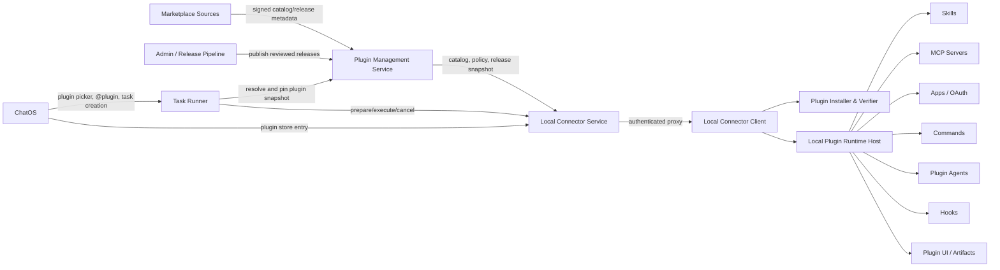
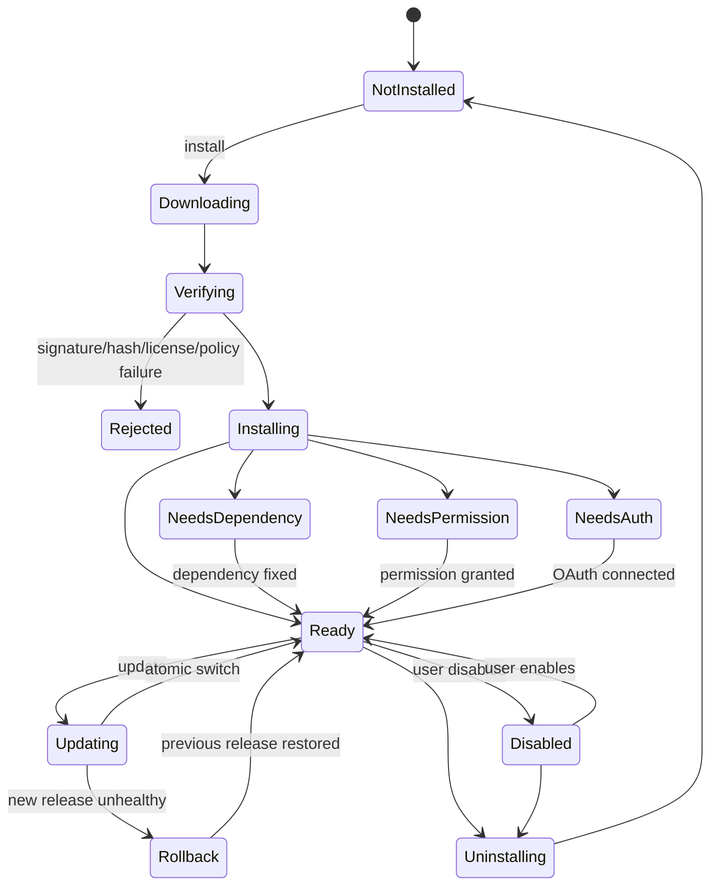

# Codex 插件体系 1:1 兼容实施方案

> 状态：实施中
> 创建日期：2026-07-21
> 最新增量（Local Connector Core 启动/设置保存 blocker 修复）：2026-07-28 用户实测发现桌面端“保存配置”和登录均失败，Local Connector Core 日志显示 `migration 19 was previously applied but is missing in the resolved migrations`，即旧 Core 二进制打开已升级 SQLite 数据库后启动即退出，导致 Electron IPC socket `core.sock` 不存在。已新增 Electron 本地 runtime settings fallback：Core 不可达时仍可从同一 `~/.chatos/local_connector/state.json` 读取/保存开发者模式和完整 CDP 风险开关，且只允许 loopback developer URL、保留无关本地状态、不保存登录 token 或绕过配对；Core 恢复后会读取同一 state。Core 新增只读 `--local-runtime-migration-versions` 参数，package verifier 会在同平台出包时对比 Core 内嵌 SQLite migrations 与 packaged `sqlite-migrations` 资源，防止 Core/资源版本错配包流出。验证通过 Electron 14 tests、Local Connector 前端 type-check、Core 编译和只读 migration 参数输出 1–22、Rustfmt、`git diff --check`；未启动服务、Mongo、浏览器或桌面控制，未占用端口，临时 `/tmp` Cargo target 与前端 symlink 已清理。
> 最新增量（Plugin 用户与运维文档）：2026-07-28 新增 `docs/plugins/plugin-operations-user-guide.zh-CN.md`，面向最终用户、管理员和本机运行时运维人员串联 Marketplace、安装、启用、Task/Run snapshot、OAuth/connected app、安装诊断、审计诊断、脱敏导出、服务端部署、Local Connector 边界、指标和常见故障定位；明确客户端不直连 MongoDB，MongoDB 仅属于后端服务持久化依赖。`plugin_management_service/README.md` 新增第三方发布手册和用户/运维手册入口，并补充安装诊断/脱敏导出说明。
> 最新增量（安装/OAuth 诊断与脱敏导出）：2026-07-28 Plugin Management 前端新增普通用户和管理员均可使用的“安装诊断”入口，复用当前用户隔离的 `GET /api/plugins/installed` 与 `GET /api/plugins/{plugin_id}/oauth`，按 device_id 只读展示安装状态、Release、平台、依赖/权限/OAuth requirement、组件可用性、最近检查时间和选中 Plugin 的 OAuth provider/scope/连接状态。页面不新增跨用户后端查询或写接口；详情弹窗仅显示当前接口返回的诊断 JSON。新增默认脱敏 JSON 导出，剥离 owner_user_id、device_id、OAuth account_display 和错误原文，只保留状态、版本、组件、provider/scope、时间、has_error/has_account_display 等排障字段，不导出 token、屏幕/浏览器内容、用户文件内容或 Plugin UI 私有数据。验证通过 Plugin Management 前端 type-check、production build、Rustfmt 和 `git diff --check`；未启动服务、Mongo、浏览器、Office 或桌面控制，未占用端口，临时 `node_modules` symlink 与 `dist` 已清理。
> 最新增量（Plugin audit 只读诊断）：2026-07-28 Plugin Management 前端新增 super admin “审计诊断”入口，接入既有 `GET /api/admin/plugin-audit`，可按 event、plugin_id、owner_user_id、device_id 查询 Marketplace、Catalog、Release、发布者审核、安装来源、OAuth 和偏好变更审计。表格展示事件、结果、Plugin/Release、用户、设备/组件和记录时间，详情弹窗只显示服务端已脱敏 JSON 投影；不新增写接口，不回显签名公钥、凭据、Hook stdout/stderr、工具 payload 或用户文件内容。
> 最新增量（第三方发布文档与示例）：2026-07-28 新增 `docs/plugins/third-party-plugin-publishing.zh-CN.md`，固化第三方发布者从 trusted Admin Marketplace、publisher review、Release signing、signed Catalog sync 到 Local Connector immutable runtime snapshot 的发布路径；明确 publisher identity/key、Catalog/Release key usage、凭据、component-scoped permissions、Plugin UI resource origin 与真实环境验收边界。新增 CircleCI、Sentry、Build Web 三个示例 Manifest，分别覆盖 HTTP MCP adapter、Command、Agent、Plugin UI 和权限拆分，并由 `chatos_plugin_management_sdk` 集成测试直接 parse，防止示例随 schema 演进失效。该批不连接外部 SaaS、不启动服务、不占用端口。
> 最新增量（Publisher onboarding/review）：2026-07-28 Plugin Management 新增 `plugin_publishers` 控制面、普通用户发布者申请页和 super admin 审核页。申请只允许 enabled/public/trusted `admin_registry` Marketplace，发布者需提交 publisher ID、名称、HTTPS 网站和 1-32 个 active Ed25519 release-only key，服务端强制 key publisher、usage、revocation 与申请身份一致；pending/approved/suspended 不可自行覆盖，rejected 可重新提交。管理员可 approve/reject/suspend/restore，拒绝和暂停必须有审核备注；approve 会把审核过的 Release key 通过 Marketplace snapshot CAS 合并进 trust root，并复用既有 key rotation/revocation progression 校验。手工 Admin Catalog Entry 和 Release 发布现在必须匹配 approved publisher identity 与 approved release key；外部 signed Catalog 同步和 bundled official Registry 不走人工审核入口。审计只记录 key IDs、决策和状态，不记录公钥内容。验证通过 Plugin Management backend 85 tests、lib Clippy `-D warnings`、前端 type-check/production build 和 Rustfmt；未启动服务、Mongo、浏览器或桌面应用，未占用端口。
> 最新增量（trusted Admin Marketplace 生命周期）：2026-07-28 Plugin Management 新增 `PATCH /api/admin/plugin-marketplaces/:marketplace_id` 与管理页编辑入口，super admin 可更新名称、HTTPS Catalog URL、enabled/trust 状态和 trust root，保留 Marketplace identity、owner/visibility/source、last revision/sync metadata。更新使用完整旧 snapshot 做 compare-and-replace，Catalog 同步或其他管理员并发修改时返回冲突；可信网络 Marketplace 至少保留一个未撤销 Catalog key。签名 key rotation/revocation 与自动 Catalog progression 复用同一失败关闭合同：非 revoked key 不可删除，既有 key 的 publisher/algorithm/public key/usages/valid_from 不可替换，valid_until 只允许缩短，revocation 不可撤销或改写；标准流程为添加 successor、撤销旧 key、后续再移除已撤销 key。审计仅记录 added/revoked/removed key IDs、trust/enabled 和 URL 是否变化，不记录公钥内容。验证通过 Plugin Management backend 82 tests、lib Clippy `-D warnings`、前端 type-check/production build、Rustfmt 和 `git diff --check`；未启动服务、Mongo 或浏览器，未占用端口，一次性 Rust target 已清理并释放约 3.1 GiB。
> 最新增量（删除 ChatOS legacy Plugin install/cache）：2026-07-28 已删除 ChatOS `/api/skills*` Git import/install/list/detail 路由、`chatos_skills*` Git clone/cache/manifest/discovery 服务、对应 feature flag，以及 Agent 管理页和 Agent Builder 对 legacy Plugin/standalone Skill catalog 的选择与读取。新建 Agent 拒绝非空 `plugin_sources` 和外部 `skill_ids`，更新未触碰历史字段时保持原值、显式清空可迁移；运行时只发布 Agent 自身 inline Skills，历史 Plugin/Command/外部 Skill 引用不再进入 prompt 或 MCP reader。`memory_skills`/`memory_skill_plugins` 不再由数据库启动流程创建或维护索引，旧 Mongo records 仅保留只读数据合同和查询供一次性迁移，不参与任何生产 API、Agent Builder 或运行时。Plugin Picker、Plugin Management immutable Release、Local Connector，以及 Browser/Computer Use/Documents/PDF 等现行插件能力不受影响。验证通过 MCP 149 tests、ChatOS backend 536 tests、ChatOS 前端 type-check/production build、定向 Vitest、MCP lib Clippy `-D warnings`、ChatOS lib Clippy `-D warnings`（仅命令行豁免两个未修改文件中的既有 lint）、Rustfmt 和 `git diff --check`；未启动服务、Mongo 或浏览器，未占用端口，一次性 Rust target 已清理并释放约 8.1 GiB。
> 最新增量（删除 Task Runner 独立 Skill 选择链）：2026-07-28 已删除 Task Runner 编辑器“本机 Skills”选择器、前端 `selectedSkillIds` 写入字段、Capability Catalog `selectable_skills`、Task Runner MCP `list_available_skills`、动态创建 schema 的顶层 `selected_skill_ids` 以及 REST/MCP 创建和更新入口中的独立 Skill 参数。Plugin Picker 成为用户选择能力的唯一新写入入口；`selected_plugins[].selected_skill_ids` 仍作为 Plugin 内组件选择保留。`TaskMcpConfig.selected_skill_ids` 仅用于历史任务反序列化、只读展示和系统 required Skill：新建任务携带非空旧字段会明确失败，更新其他配置会保留已有历史值但禁止修改，运行时不再接受 optional standalone Skill。验证通过 Task Runner 前端 type-check/production build、后端 298 tests、ChatOS provider Skill 系统上下文定向测试和 Task Runner lib Clippy `-D warnings`（只在命令行豁免未修改依赖中的既有 `manual_ignore_case_cmp` 与未修改 Task Runner 文件中的既有 `collapsible_if`）；未启动服务或占用端口，一次性 Rust target 已清理并释放约 6.9 GiB。
> 最新增量（移除旧 Skill 独立管理与写入口）：2026-07-28 Plugin Management 已从左侧导航和可达页面中移除“技能管理”“技能包”两个旧入口，并删除对应 React 页面、前端 Skill/Skill Package CRUD/check API client、仅供旧页面使用的类型与翻译。仓库消费者审计确认没有其他客户端调用 Plugin Management 旧写 API，后端 `/api/skills` 与 `/api/skill-packages` 因此只保留 list/detail 查询兼容，Skill 额外保留不修改 executable content 的诊断 check；create/update/delete Router、handler、payload 和无调用方 store mutation 已删除。Skill 仍作为 immutable Plugin Release 的组件索引和运行时兼容数据存在，不影响 Plugin Marketplace/Release、内部 seed、Agent capability 或 Local Connector bundle 加载。Plugin Management 前端 TypeScript type-check 与 Vite production build、后端 lib Clippy `-D warnings` 及 79 个 lib tests 均通过；验证未启动服务、未占用端口，一次性 Cargo target、临时 `node_modules` 符号链接与 `dist` 已清理。
> 最新增量（Presentations canonical bubble）：2026-07-28 新增 Presentations `1.32.0` 的 canonical `bubble`。图表级继续使用 1–50 个共享有限 numeric `x_values`，每个 series 的 `values` 作为同长度 Y values，并新增同长度、有限、严格正数且不超过 `1e12` 的必填 `bubble_sizes`；XML 固定使用 literal `xVal/yVal/bubbleSize` numLit caches，系列颜色使用 fill，拒绝 marker/smooth。每个 group 固定 exact `bubbleScale=100`、`showNegBubbles=0`、`sizeRepresents=area` 且无 `bubble3D`，主/次 Y 轴复用 scatter 的 visible bottom/left 与 hidden-top/right 双数值轴拓扑和完整 X/Y 轴格式合同。检查新增 raw bubble-group metadata 与 bubble-size preview；缺失/未知/非 canonical group metadata 只读降级，重复、错误 namespace 或超过 128 bytes 失败关闭；完整快照新增逐 series `bubble_sizes`，非 bubble 显式为 null，bubble 与 scatter/line 间安全替换继续只重写原 chart part。不可变 Release ID 为 `bundled-release-presentations-1-32-0`，发布时间 `2026-07-28T07:00:00Z`，artifact revision `presentations-1.32.0`，Catalog revision `2026-07-27.21`；Skill JSON/Instructions SHA-256 为 `657ca55e6c12150e5b95d8c435c689072aee1dc42c7ecc53afd81261c96d8a07`/`624eeed9c36ac72d740c2259d705105ae3ab1bcf45145e579a3f2991e33681f2`，Bundle hash 为 `393a2d4bab9b209a822e9eeef8ca1a56372747d2deb0e9f41b05318471dc296e`，Manifest/Artifact SHA-256 为 `85d204526b382e6a6d6a005b7713944de5d20d8f9f97ebb8d3a04c90db1777f4`/`03a4fdc98a9d7877214a3dd9f7e214e95b4943cdf3b9126298a11f38bc3c17ba`，macOS arm64/Windows x64 staged content SHA-256 均为 `036d37394759809862d339b40f586c140eecc1aed7ef401ca21ebe3e4da82192`，ready/all fingerprints 分别为 `51b5c8afc1534e3d77c92e1d4b2b1eb3ccfa364081d935a4f935abb9682b288f` 和 `412e255452cee4204512c3f595c60b052ad418050196afe248523f23c55de9fe`。
> 最新增量（Presentations scatter X-axis 完整格式合同）：2026-07-27 新增 Presentations `1.31.0` 的 canonical scatter X-axis bounds/log/ticks/units/number-format。`x_axis_minimum`/`x_axis_maximum` 必须覆盖全部共享 `x_values`，X 对数轴要求所有 X 值与显式边界严格为正，major/minor unit 保持正数、minor 小于 major 且不超过显式轴跨度；九种受限数字格式与 none/inside/outside/cross tick marks 沿用 Y-axis 合同。双 Y 轴 scatter 的 visible bottom X 与 hidden top X 使用完全相同的 scaling、bounds、log base、ticks、units 和 number format，检查同时报告 recognized/custom/raw bottom/hidden-top X metadata；两条 X 轴不一致或任意非 canonical XML 只读降级，完整快照新增全部八个 X-axis 字段。不可变 Release ID 为 `bundled-release-presentations-1-31-0`，发布时间 `2026-07-28T06:00:00Z`，artifact revision `presentations-1.31.0`，Catalog revision `2026-07-27.20`；Skill JSON/Instructions SHA-256 为 `3e6f65ebb70e85c199a9405df2cfb02292be624ae9bb77a75b7ce5ca7e921a6d`/`5128a16415b780bcdd9c96da351794039177559c45ebcbb3f937653fc3752774`，Bundle hash 为 `aff1765ed49c3787b8534b8562029ac45b90d0b4a6d894bd52519dce22e1d56a`，Manifest/Artifact SHA-256 为 `e293de9777ebfa6395037e75a8d30c7e412acdeae9cb3c9bf6521f520cd4174e`/`8fbb07f19dba6c974550d16cbdd400975702f28cb508b4f18b1b5872293bbff4`，macOS arm64/Windows x64 staged content SHA-256 均为 `6699193555cd9ea3bad1cd3fbf2993877672fafe6b29f085a4fa80b6d4bee85e`，ready/all fingerprints 分别为 `a57b1bb68f01536a8012831e8fc22e712b6b0458004226040e63b201e98ef271` 和 `f563b812d6a6d2d58e12e9d5d7ea75a8c0ff1eebbf78cdf509b1edf0cfbf136d`。
> 最新增量（Presentations canonical 雷达图）：2026-07-27 新增 Presentations `1.29.0` 的 standard 2D `radar`。创建、追加、检查、完整快照和安全替换统一使用 exact `<c:radarStyle val="standard"/>`，系列颜色使用 canonical line color，主轴沿用 visible bottom category + left value，双轴使用 hidden top category + visible right secondary value，并继续支持现有图例、value data labels、轴标题、边界、对数刻度、tick marks、units 和数字格式合同。检查新增逐 chart group raw `radar_styles`；缺失、未知或带额外属性的样式只允许有界只读，重复、错误 namespace 或超过 128 bytes 直接失败关闭。不可变 Release ID 为 `bundled-release-presentations-1-29-0`，发布时间 `2026-07-28T04:00:00Z`，artifact revision `presentations-1.29.0`，Catalog revision `2026-07-27.18`；Skill JSON/Instructions SHA-256 为 `12cd174f870a09cafc12144f89ae7b91d3a5e401b2748af6fca8beaa0d987bf6`/`9da50b2abde20201fe0c1dba484072d239a6176efa39f39567e80d149c9ad34f`，Bundle hash 为 `d62fb91c4f2b8944527373893cf8ebc4990c94e703761cbaa219ea500e2ddc91`，Manifest/Artifact SHA-256 为 `3dcfb4846ddbe5fcff20262c87717cdfc8bb80f973fff0376cd2164025e1b10b`/`00bb44f4eaa1fe9e61b93170de98200837cee6c1cdd8e2e9725922740f92b990`，macOS arm64/Windows x64 staged content SHA-256 均为 `8cdd8835f5caa15ef6692e453a2b5639ca9ddc5d960af6f759ffc095b142faa7`，ready/all fingerprints 分别为 `72af271d569ddedf98700da2303dd8d951ba04c9ff4c679f41a64fc3db1f7153` 和 `f097b69dc1ea25987ae6b6e73ddd2c53d8ff51789670b76c5432a3b05ed5d7df`。
> 最新增量（PDF 批注内容与作者更新）：2026-07-27 新增 PDF `1.22.0` 的 `update_pdf_annotation_text`，PDF native adapter 增至 24 个工具。更新必须绑定 exact source SHA-256、physical page、1–100 focused preview index、exact subtype 与 root/reply/group relation；只开放 Text、Highlight、Underline、StrikeOut、Squiggly，可设置或显式移除有界 Unicode contents/author，并支持 root/reply/group、direct/indirect annotation。缺失 mutation、set/remove overlap、semantic no-op、Link/FileAttachment/Widget/Popup、stale/mismatched snapshot、in-place/hard-link/symlink target 与 source drift 全部失败关闭；annotation identity、geometry、appearance、relationship、page membership 与总数保持不变，结果只返回 text 字符数/SHA-256 而不回显全文。不可变 Release ID 为 `bundled-release-pdf-1-22-0`，发布时间 `2026-07-27T23:00:00Z`，artifact revision `pdf-1.22.0`，Catalog revision `2026-07-27.13`；Skill JSON/Instructions SHA-256 为 `a1fea6e51d8739fe93bb727ef73b60543d51de67956f166b225b7caf9d20b261`/`10c314608c1e33240172d0a8b8c66d056ec88fda84f37b531f792ca2d9f98190`，Bundle hash 为 `0978f3fd440eb969551539fd9d0ba6fb449404efccd0d1aae30eea56847c8938`，Manifest/Artifact SHA-256 为 `014518034e5580c3a1932ac943a240ac03b96ea19b6ed7ca582d8c23e6838505`/`67bb9c93b2c79b2eb81ded62860602b1e3dced777f54c5d4eafc17d4d4bbc370`，macOS arm64/Windows x64 staged content SHA-256 均为 `eae94e3ac366bd1727c7152da4f46515f41a8070e5a887d368e255a5e2d26e6e`，ready/all fingerprints 分别为 `acff75f500612b4555c45e3725b4ca3aa57bad2ff54f615a32ca4d9b8fb91b8a` 和 `dd93020395d96fdbfa0c8c0a48cdaa3aa49aba35be98fdf7c7da64d517af28fd`。
> 最新增量（PDF 标准批注删除）：2026-07-27 新增 PDF `1.21.0` 的 `delete_pdf_annotation`，PDF native adapter 增至 23 个工具。删除必须绑定 exact source SHA-256、physical page、1–100 focused preview index、exact subtype 与 root/reply/group relation；只开放 Text、Highlight、Underline、StrikeOut、Squiggly、Link 和 FileAttachment。leaf reply/group member、direct annotation 与 unsafe Link 可安全移除且不执行/回显 action；仍被 reply/group/popup 或任意可达对象引用的 indirect annotation、Widget/Popup/未知 subtype、tagged-PDF StructParent、显式 Popup/Parent 关系、stale/mismatched snapshot、in-place/hard-link/symlink target 与 source drift 全部失败关闭。FileAttachment 的 Filespec/EmbeddedFile 只在不再可达时由 prune 清理。不可变 Release ID 为 `bundled-release-pdf-1-21-0`，发布时间 `2026-07-27T22:00:00Z`，artifact revision `pdf-1.21.0`，Catalog revision `2026-07-27.12`；Skill JSON/Instructions SHA-256 为 `06d60f9579772c603acecfef671e8acc62c3ec4fd3dd93da287084d63a2034c7`/`0ab7bee6532a5106cefbec6edb85a4c87b9571d21a9e84a7ea12c69602adfdb6`，Bundle hash 为 `8f3d331b5801cef989b4fe98b53e0cd0e4f0f858b103518732627f933a85bdd5`，Manifest/Artifact SHA-256 为 `587d19703aa6815cbe2b3812b41b9b112bf178ee1fdcda1bc5dea4ecb38346bf`/`f644dd7b6f91c096f448b4f4a0fa88893a8d8c4a44b2e174e8dc10c63c6dd486`，macOS arm64/Windows x64 staged content SHA-256 均为 `1b23987936dc337e50e1c86e0482109e427ed997a28057158602a9dbd1dcb736`，ready/all fingerprints 分别为 `02c32a10914115db9b88a142b80ca6e478c2082322e97812813b9cc6cfef97c9` 和 `5d4e98142ec93009797a6093a34bf6cd64c01ef716a2034c2bfdcd7c15bcb2cd`。
> 最新增量（PDF 标准 Link 批注）：2026-07-27 新增 PDF `1.20.0` 的 `add_pdf_link_annotation`，PDF native adapter 增至 22 个工具。工具以 exact source SHA-256 和 unrotated effective CropBox-relative Rect 添加标准 `/Link`，只创建 credential-free HTTPS `/URI` action 或 direct physical-page `/Fit` destination；HTTPS 结果与检查 metadata 只返回 origin、URL SHA-256、query/fragment presence，不回显完整 URL。`inspect_pdf.annotations` 新增 Link/safe/unsafe counts，并对 JavaScript、Launch、remote-file、additional action、action chain、mixed `/A`+`/Dest`、非 HTTPS、credentials 与 malformed target 失败关闭且不返回代码/target content；任何 source 已含 unsafe Link 时拒绝新增。stale source、rotated/out-of-bounds geometry、in-place/hard-link/symlink target 与 source drift 同样失败关闭。不可变 Release ID 为 `bundled-release-pdf-1-20-0`，发布时间 `2026-07-27T21:00:00Z`，artifact revision `pdf-1.20.0`，Catalog revision `2026-07-27.11`；Skill JSON/Instructions SHA-256 为 `533d8ec83219c26cba16500c2d3224c87584467b5abc929495f1fb4846783094`/`8ec31417fbcfe361dc0ef108edcb21570eead6bf313cfea140835acfc29aa60c`，Bundle hash 为 `b386438664f3042fde819799b383a0d90544b2f3299dae71716b80ffb6b81cae`，Manifest/Artifact SHA-256 为 `9cc85ada939c4c67d9e85fe2912fb071bb1093fbdcbcbbe85cfe45b4a11699b8`/`6f691c0ab081501865c627bd1f98b41896beea4ad163381d197c3b89f05cc20f`，macOS arm64/Windows x64 staged content SHA-256 均为 `80170c05edc851cebaef2f797b76a9b035e0ec6b8b3aa70859acadb4d323af64`，ready/all fingerprints 分别为 `9309096b0d2ad4b25e0bb53b4ebf7d3e8293ce47bbe6811d4de5b875c6933b78` 和 `a8b48f98585ce6ffd9ec4677abd13f1b0b4c8e253350d1eca41ce6506cd1f43d`。
> 最新增量（PDF Catalog EmbeddedFiles）：2026-07-27 新增 PDF `1.19.0` 的 `extract_pdf_embedded_file`，PDF native adapter 增至 21 个工具。`inspect_pdf.embedded_files` 现可有界遍历 Catalog `/Names/EmbeddedFiles` 的嵌套 Name Tree，要求每个节点恰有 `/Names` 或 `/Kids`、child node 与 Filespec 均为 indirect reference、PDF text-string key 全局严格升序且唯一、`/Limits` 有序，并拒绝 direct/malformed/repeated/cyclic node；每文件解码上限 10 MiB、遍历时即时累计总上限 100 MiB、最多 10,000 entries，preview 最多 100 项且只返回 name、filename、MIME、bytes、SHA-256 和 description，不返回 content。提取要求 exact source/attachment SHA-256 与 1–100 `embedded_file_index`，完整复验 Name Tree、Filespec/EmbeddedFile、扩展/MIME/Size/内容签名后，复用同扩展安全目标、source drift guard、临时文件、no-clobber/atomic replace 和写后 size/hash 校验。不可变 Release ID 为 `bundled-release-pdf-1-19-0`，发布时间 `2026-07-27T20:00:00Z`，artifact revision `pdf-1.19.0`，Catalog revision `2026-07-27.10`；Skill JSON/Instructions SHA-256 为 `b4767ad3113e32617b7487204cdf1d8bf994f0a642b10d06c5c28b8e401f8887`/`24fda7eb9380048f2dfdfec229440fd6107249d097beb89fe44cd6768e09afef`，Bundle hash 为 `d3c33a194e2c0e3b20a7936b781b8173429c2a42e93caed301b16989c64c9f7f`，Manifest/Artifact SHA-256 为 `32961458374f2ce7ae8250b9f7e25b5a041eabc63466750ac0ab50918de4d3f4`/`ad1cdc924430fc7e08619d38db83149dedeee10e9705151d6f6ed547b23c2bc6`，macOS arm64/Windows x64 staged content SHA-256 均为 `cf2a241b6dcee0daa886074862e5d39754a2bbcac55eaabbf70dfd170ab94af2`，ready/all fingerprints 分别为 `5db2f2d521ee1b7fdb05b09a310627b8baa4d58ff7a27c2372190da80ef95cdb` 和 `4f5ca3c98adb31237f7b8070d353350e1df079c50f067feb6e108c04a0c5d3c3`。
> 最新增量（PDF 标准文件附件提取）：2026-07-27 新增 PDF `1.18.0` 的 `extract_pdf_file_attachment`，PDF native adapter 增至 20 个工具。工具只接受 `inspect_pdf(annotation_page=N)` 返回的 exact source SHA-256、1–100 页内 `annotation_index` 与附件 SHA-256；目标必须是 indirect 标准 `/FileAttachment`，并复用同一 Filespec/EmbeddedFile 解析器验证 Unicode/portable filename、`/EF/F`/`/EF/UF`、MIME、`/Params/Size`、基础内容签名、Rect、`/P` 与 10 MiB 解码上限。输出只能写入授权 workspace 中扩展名与附件一致的安全普通文件，existing target 要求 `overwrite=true`；direct/non-attachment/malformed target、stale source/attachment hash、source/target overlap 或 hard link、symlink、unsafe/reserved filename、扩展漂移和伪装内容全部失败关闭。写入使用同目录临时文件，commit 前复验源 PDF，未覆盖场景使用 no-clobber 原子提交，覆盖场景使用原子 replace，提交后复验 regular file、size 和 SHA-256；结果永不回显附件 bytes。不可变 Release ID 为 `bundled-release-pdf-1-18-0`，发布时间 `2026-07-27T19:00:00Z`，artifact revision `pdf-1.18.0`，Catalog revision `2026-07-27.9`；Skill JSON/Instructions SHA-256 为 `74a4f6147e28c727bb188733632049f1dd2c85cb4307de156c41c17e9f60fe0a`/`ae3c58d29d4204a0d0e95e3bd291af9cc719b78946ec1cbaabf3bfc9aa8796ce`，Bundle hash 为 `8a677f1eb202a07569e5c49d5da000a35d8982c95bedc0eebef2f4e55f79f8b5`，Manifest/Artifact SHA-256 为 `9462ce96b5f2767f0e703546c5134786039e87acc1d28daa1aebbc7ed4c55c9e`/`8a19694e91555b855a493d1d0a75c4639f06d45c83da54ba2ce1102c366cbc34`，macOS arm64/Windows x64 staged content SHA-256 均为 `c604edc1057012a27fd1aa5157db55e7a4ab2fc7e1ed1644453bb2adb8c542f0`，ready/all fingerprints 分别为 `a1bd1af1c0a157737bbf5423f6a02217bd20de864781db0ef9986d60541ab35f` 和 `c6eddfe0b8d1f89ae800da7e04ad372af5e6506bc5f04201eab3ee8652a7d4b7`。
> 最近进度：2026-07-27 已完成 Phase 1 Plugin 聚合控制面、Phase 2 本机安装器/信任链、Phase 3 active immutable Release component loader 与精确快照绑定的 Plugin prepare/execute/cancel host，以及 Phase 5 Task/Run `selected_plugins`、Local Connector relay、Task Runner 动态注册和 ChatOS/Task Runner Plugin Picker。ChatOS `@plugin` 搜索/引用、Plugin Commands 与 Plugin Agents 已完成当前受控选择、不可变快照、权限收窄和逐轮审计闭环；ChatOS Run 详情已新增不执行第三方代码的原生 Plugin runtime/Hook 脱敏状态面板。Plugin UI 已完成 signed Manifest descriptor、静态 asset allowlist、固定 Host CSP/sandbox 合同、本机 active immutable Release loader、Task Runner 双重 snapshot 回验、`plugin_ui_ready` 安全事件、ChatOS 登录态 asset proxy、短期 Workbench asset session、独立资源 origin、opaque-origin iframe renderer 和严格 bridge；Artifact ownership、受控 list/read/download/create/update、本机 registry 跨重启恢复、真实签名多组件 fixture/Local Connector packaged-style runtime E2E，以及 ChatOS/Service/packaged Connector 单进程无端口 HTTP CRUD E2E 已接入。Plugin Hooks 已完成 macOS 当前主要生命周期闭环：HookSet schema/canonical hash、本机 signed command 回验、签名目录只读沙箱、独立 timeout/输出上限/failure policy，Task Runner `BeforePluginPrepare`、`SessionStart`、`PreToolUse`、`PostToolUse`、`RunCompleted`、`RunFailed` 调度，Plugin Management 权威 `enabled: true → false` 驱动的 `PluginDisabled`，以及每次独立人工批准的 workspace-write Hook；Linux Bubblewrap 隔离执行代码和失败关闭 readiness 已落地，但尚未完成真实 Linux 主机验收；Windows Hook/stdio 已接入零网络 capability AppContainer、签名 package staging/逐文件 SHA-256 复验、拒写 ACL、受限 stdio handle 继承和 Job Object 进程树回收，workspace-write 使用不暴露真实路径的私有镜像、`.git` 防护、并发冲突检测和成功后有界原子回写，均已通过 Windows GNU 目标交叉检查，但真实 Windows installed-app 验收仍未完成。工具参数、工具结果、Hook stdout/stderr 和用户文件内容均不进入 Hook 审计。Browser `1.8.0`、Chrome `1.4.0` 与 Computer Use `1.19.0` 已完成当前主要本机浏览器/桌面控制增量；Documents `1.22.0`、PDF `1.22.0`、Spreadsheets Plugin `1.8.0`（含文件型 Spreadsheets `1.4.0` 的有界 CSV/TSV 创建、检查和 SHA-256 绑定范围编辑，以及 Excel Live Control `1.4.0` 严格身份绑定的有界读取、逐次审批的常量/受限本地公式写入、七种固定数字格式写入和失败回滚尝试）、Presentations `1.32.0` 和 Template Creator `1.2.0` 已完成各自当前有界能力。下一项为显式隔离测试库上的真实 Mongo driver 执行验收、部署后在线 DNS/TLS/reverse-proxy 验收，Hooks 的真实 Windows installed-app 验收、Linux 真实主机验收，以及 Chrome macOS/Windows 真实 installed-Chrome 验收、Computer Use 更广泛的应用内容/窗口布局回滚、Presentations 更多图表/格式和 Template Creator 更完整结构编辑；Excel Live Control 的富样式/条件格式、对象、保存导出、完整工作簿事务回滚、视觉验证与 macOS/Windows 真实写入验收仍未完成。
> 最新增量：2026-07-26 Plugin Artifact 第一条真实只读链及重启恢复已贯通。Local Connector 只从 exact prepared Plugin native Documents/PDF/Spreadsheets/Presentations/Template Creator 成功结果中提取已确认的 workspace-relative 输出，逐级拒绝 symlink，绑定 owner/run/device/workspace/plugin/release/artifact/producer component/session/tool、MIME、size 与 SHA-256，并要求至少一个同 Plugin Run 的 signed UI MIME/capability grant。Task Runner 从模型结果中剥离注册元数据并写入 `plugin_artifact_ready` immutable event；ChatOS 使用独立 `plugin.artifact.read` scope 和只允许 `chatos-backend` 的 list/read/download relay，Workbench bridge 与 Host UI 已实现 `artifact.list/read/download`，下载固定安全 `Content-Disposition`。Local Connector registry 现在使用 Secure Storage 随机密钥 HMAC、0600 原子文件与 schema/TTL/snapshot/ownership 完整复验，在原 Host TTL 内可跨进程重启恢复；密钥丢失、文件篡改、symlink 或过期 grant 均失败关闭。该只读阶段当时尚未完成 Artifact create/update；后续写链见下条增量。独立资源 origin 与 packaged E2E 仍未完成，因此 Plugin UI/Artifact 总项继续未勾选。
> 最新增量（续）：2026-07-26 Plugin Artifact 写链、独立资源 origin 模式和真实签名多组件 Local Connector runtime E2E 已贯通。Workbench `artifact.create` 只接受 display name、signed MIME allowlist 和最多 160 KiB 的规范 Base64；Local Connector 为每次写入自动生成不透明工作区路径，并要求一次 exact、不可记忆的本机 Turn-scoped workspace-write 人工批准。`artifact.update` 只允许同一 UI component/session 创建的 mutable Artifact，并强制 previous SHA-256 乐观锁。ChatOS 使用独立、仅允许 `chatos-backend` 的 `plugin.artifact.write` scope，审批前后 Local Connector 都会复验 workspace identity、active immutable Release、Plugin enabled 状态和 UI grant；iframe 写响应只得到去除 owner/device/workspace/path 的安全投影。配置独立 parent/resource HTTPS origin 后，resource Host 只接受 Workbench GET/HEAD 命名空间，主业务 Host 不再能读取短期资源 URL，入口 CSP 只允许 exact parent origin，资源响应不开放 CORS。新的 Ed25519 fixture 已覆盖 signed Skill、exact embedded Documents native Adapter、Workbench UI、immutable/mutable Artifact、stale SHA、重启恢复及签名/文件篡改失败关闭；Local Connector Service websocket 也已补齐四种 Artifact response completion。完整 ChatOS HTTP handler → Service Router/ownership → websocket → packaged Connector 的单进程无端口 E2E 已完成；实际独立 DNS/TLS/reverse-proxy 与跨平台 installed-app 验收仍未完成，因此整体 Plugin 1:1 parity 继续保持未完成。
> 最新增量（再续）：2026-07-26 已新增真实 Mongo driver 验收入口。默认测试继续使用固定内存 ownership fixture；显式 ignored 测试只有在提供包含唯一 `{database}` 占位符的隔离 Mongo URL 模板时才创建随机数据库，随后复用同一完整 signed packaged Artifact HTTP CRUD runner、生产 `ConnectorStore::Mongo`、真实索引/device/workspace/session lease 查询与实际 Router/auth/relay/validator 链。测试在成功、初始化失败和 E2E panic 后都会尝试删除该随机数据库，不启动 Mongo、Service 或任何 listener，也不会复用或清理现有业务数据库。本机尚未提供隔离 Mongo，因此本阶段只完成入口编译和默认链回归，不能把真实 Mongo 执行误记为已通过。
> 最新增量（又续）：2026-07-26 已完成独立 Plugin UI 资源域名的生产部署合同。`plugin-ui.jgoool.com` HTTPS virtual host 只允许 `/api/plugin-ui/workbench/` GET/HEAD、无请求体并直接转发 ChatOS Backend，其余路径固定 404，同时显式隐藏全部 CORS headers且不继承 WebSocket proxy headers；HTTP 仅保留 ACME 与 HTTPS redirect。生产启动校验现强制 parent/resource 两个不同的 canonical HTTPS Origin，并修复 macOS Bash 3.2 不支持 Bash 4 小写转换的问题。新增离线/在线验收脚本：离线覆盖错误 Origin 失败关闭、静态隔离合同和真实 `nginx -t` 解析且不绑定端口；`--live` 可在部署后检查 DNS、证书信任和 parent/resource 公网 404 隔离。本机未进行公网 DNS/TLS 请求，因此在线验收仍未完成。
> 最新增量（PDF 表单）：2026-07-26 新增 PDF `1.10.0` 标准 AcroForm 安全检查与填写。`inspect_pdf` 现在返回最多 2,000 个字段的有界摘要和 200 项预览，包含完全限定名称、字段类型、精确当前值、只读/敏感状态、widget 数量与填写资格；密码和签名值不暴露。`fill_pdf_form_fields` 要求每个字段提交 exact `expected_value`，只开放 Unicode 文本字段和具有唯一非 `Off` appearance state 的复选框，强制 `/MaxLen`、单行/多行控制字符约束、distinct output 与 no-op 拒绝；XFA、已有签名字段或 catalog permission/signature transform、密码/file-select/rich-text、radio/choice、只读字段、重复名称、畸形 Parent/Kids、循环或不安全 widget appearance 全部失败关闭。文本更新移除陈旧 appearance 并设置 `/NeedAppearances true`，明确要求后续页面渲染与目视确认；复选框仅选择每个 widget 都具备的已验证 `Off`/唯一 on-state appearance stream。新增真实 AcroForm 构造、Unicode 文本/复选框写入、源文件不变、stale snapshot、类型错配、no-op、in-place、XFA 和签名字段拒绝回归。不可变 Release ID 为 `bundled-release-pdf-1-10-0`，发布时间 `2026-07-26T14:00:00Z`，artifact revision `pdf-1.10.0`，Bundle hash `7c0ab4a2a8fc12e94bf52d2458eec7cf0a2842835b765fc732b3735db8c601bd`，Manifest SHA-256 `259863adbeef116e6e3e7fd1c878ed3c6ff4eabd036e8a2ef2081ee53a0eb24a`，Artifact SHA-256 `85ee0df6b2f30e25886f8e07d22e18a57597029f27eda1caf2daf72800229f16`，macOS arm64/Windows x64 staged content SHA-256 均为 `2ca414824258c69ba06b520d1ff193766f16655e7766654651467199d028a8bb`。
> 最新增量（PDF 表单续）：2026-07-26 新增 PDF `1.11.0` 单选按钮和非编辑单选 choice 字段。`inspect_pdf.form.preview` 公开有界 exact option value/label、combo/list 类型、是否允许清空与 option 截断状态；未选择值统一为 JSON `null`。radio 要求每个 widget 的 `/AP/N` 都包含 stream-backed `Off` 和唯一非 `Off` state，字段 `/V` 与全部 widget `/AS` 必须一致，`NoToggleToOff` 会拒绝清空；choice 只接受最多 500 个、export value 唯一的字符串或 export/display pair `/Opt`，拒绝 editable/multi-select，并要求已有 `/V` 与可选 `/I` 精确一致。更新 radio 时只切换既有验证 appearance stream；更新 choice 时同步 `/V`/`/I`、移除陈旧 appearance 并设置 `/NeedAppearances true`。新增选中、清空、未知 option、错误类型、NoToggleToOff、multi-select、重复 radio state 与 choice `/V`/`/I` 漂移回归。不可变 Release ID 为 `bundled-release-pdf-1-11-0`，发布时间 `2026-07-26T15:00:00Z`，artifact revision `pdf-1.11.0`，Bundle hash `5c3607a91ecefd6778f30cbf9e2f2b59febc129f7fe6bf73d2e076499d4d74ad`，Manifest SHA-256 `1a06ce344c928123a34fdeabde981447ff35be06bb7f597979e78bcf23597439`，Artifact SHA-256 `7657ee92ea4fabd46839e5ddc67b0f77376751259d252a1c70a7219437c8c0aa`，macOS arm64/Windows x64 staged content SHA-256 均为 `ec855c5ba6068db0d952123b5a2ca99945c2072809cbace46ee51c646447d432`。
> 最新增量（PDF choice 完整形态）：2026-07-26 新增 PDF `1.12.0` 可编辑 combo 与多选 list 安全填写。editable choice 必须同时设置 combo 且不能 multi-select，可写入最多 16,384 字符的无控制字符 Unicode；值命中 `/Opt` 时同步单项 `/I`，自由值则移除 `/I`。multi-select 必须是非 combo list，检查结果统一返回 exact option order 的 JSON 字符串数组；已有 `/V` 与 `/I` 必须等长，索引唯一严格递增并逐项指向同一 export value，更新数组同样要求唯一且按 option 顺序，空数组安全移除 `/V`/`/I`。editable+multi、multi+combo、edit without combo、未知/重复/乱序选择、错误类型、控制字符和 stale multi `/V`/`/I` 全部失败关闭。所有 choice 更新仍移除陈旧 appearance、设置 `/NeedAppearances true` 并要求后续渲染目视检查。不可变 Release ID 为 `bundled-release-pdf-1-12-0`，发布时间 `2026-07-26T16:00:00Z`，artifact revision `pdf-1.12.0`，Bundle hash `6857151d9c804d37dc5557381f09415264d048071aa3901fa8e7d6bb0ba250ed`，Manifest SHA-256 `21d3fde79f678f2dd98566865328fba3b75a267a917d16224610dad719e85d0c`，Artifact SHA-256 `f36ed406b169aece35e7b02bc2939d306ff4eefaa67f48d7bfdf095b74cef93f`，macOS arm64/Windows x64 staged content SHA-256 均为 `6c2cab2a20c2346d51a290a543fb984c722c7837ad26e9e514e258ef485c4a1e`。
> 最新增量（图片生成 PDF）：2026-07-27 新增 PDF `1.13.0` 的 `create_pdf_from_images`。工具按输入顺序把 1–100 张 workspace-relative PNG/JPEG 各生成一页，支持原始图片尺寸、A4、Letter 页面以及 `contain`/`cover` 居中适配，透明 PNG alpha 通过 PDF soft mask 保留。每图限制 10 MiB、10,000 px 边长和 16 megapixels，合计限制 100 MiB 和 100 megapixels；输入和现有输出必须为 regular non-symlink file，source/target hard-link 重叠、路径逃逸、无效图片、危险覆盖和无可用页面区域均失败关闭。PDF 使用临时文件原子落盘，源图片不修改，生成后必须通过 `render_pdf_pages` 逐页视觉检查。不可变 Release ID 为 `bundled-release-pdf-1-13-0`，发布时间 `2026-07-27T11:00:00Z`，artifact revision `pdf-1.13.0`，Catalog revision `2026-07-27.3`；Bundle hash 为 `274a062ce9a5907fded3193759618c2b127e07e6046eec16995f48cc8598ae88`，Manifest SHA-256 为 `95b1fa09d9408fe3cdb351a40e14ad84cd1be6001ff968ae519856a0da0f23a9`，Artifact SHA-256 为 `d5216350b34771fc893a1064efb453c57b2ce209417b6902c4435d07dcdfce72`，macOS arm64/Windows x64 staged content SHA-256 均为 `ed1015412a03d8b48b5e4d862f512f2013f7b943a334ac10b68a01c94c64e47a`，ready/all fingerprints 分别为 `997f9d07a72ad17d2408d67c92cd28fd68ad465afbbe6746dc40db284dbb85c0` 和 `052c79450ae60346d008665d03fd4f39719e8318bee7a2770fae8c369eadc305`。
> 最新增量（PDF 页面图片持久导出）：2026-07-27 新增 PDF `1.14.0` 的 `export_pdf_pages_to_png`。工具复用安装包内 Manifest 校验的 Poppler，把最多 50 个连续物理页面以 96–300 DPI 导出到一个必须不存在的新 workspace 目录，文件名固定为安全 ASCII prefix 加真实物理页码。所有页面先在私有目录完整渲染，要求页码连续并验证 PNG signature、宽高、像素、单页 16 MiB、批次 100 MiB 与 SHA-256；源 PDF 在复制前后及输出提交前绑定同一 SHA-256。最终逐文件使用同目录临时文件原子提交，已有目录/文件/symlink 不覆盖，受控写失败或取消会删除本次新建目录。成功结果明确返回 `visual_review_status=not_performed` 与 `layout_verified=false`。不可变 Release ID 为 `bundled-release-pdf-1-14-0`，发布时间 `2026-07-27T12:00:00Z`，artifact revision `pdf-1.14.0`，Catalog revision `2026-07-27.4`；Bundle hash 为 `471a862bda30c723142d2ce5757bf805d25ff6a1ce1558fc668f3ceb9456c62f`，Manifest SHA-256 为 `8ffda24bcf91108a84a6d37df4222586b225dc912bb5d9c8f2c0e7a49bd5f430`，Artifact SHA-256 为 `ca3159642b849d52f3505de328d6cc8eca411aaf2acde4d8457fd3c50d8a7640`，macOS arm64/Windows x64 staged content SHA-256 均为 `1e0e6ed591b968a28addeaf5f43e6089bb8ef9e8f27801cc1f4f94a1d85b381f`，ready/all fingerprints 分别为 `3d047d20130c1e535733d2266774bd6f17e4fc3d5f36ce15487ef450cdb4d86a` 和 `2b30460b6886b9e9619994d4e5e2a989ced9046a8aa92a67bf557a9d78ca09b4`。
> 最新增量（PDF 标准 markup 批注）：2026-07-27 新增 PDF `1.15.0` 的 `add_pdf_markup_annotation` 与按需页面几何检查。`inspect_pdf(page_geometry=N)` 返回指定物理页的 effective CropBox 绝对边界、相对原点、宽高、effective rotation 和明确的左下角相对坐标合同；annotation 摘要新增 `markup_count`，并严格校验标准 Highlight/Underline/StrikeOut/Squiggly 的 `/Rect`、`/QuadPoints`、contents、author 和 opacity。写入工具接受 1–64 个唯一轴对齐矩形，强制非负坐标、最小 0.1 point 宽高、CropBox 完整包含和 effective rotation=0，以 TL/TR/BL/BR 顺序生成每组 QuadPoints，并写入精确 union Rect、Unicode contents/author、四种颜色、0.05–1 opacity、`/P` 与 print flag；既有 annotation 和源 PDF 保持不变，畸形 annotation、重复/越界矩形、原地目标和危险覆盖均失败关闭。不可变 Release ID 为 `bundled-release-pdf-1-15-0`，发布时间 `2026-07-27T16:00:00Z`，artifact revision `pdf-1.15.0`，Catalog revision `2026-07-27.6`；Skill JSON/Instructions SHA-256 为 `d5b6e765b2e86c56433426ec950df2d777960beffb1895133281f586e8fe5909`/`a7decb890c5f1e0db9d5b9f7cf76a7f83d7eb85f87fd406b1b3a691f41549af9`，Bundle hash 为 `c49924be3335cadefaf4da6bc0e446635f721fd6b97cc914857ed60da2bbb973`，Manifest/Artifact SHA-256 为 `0f7ef0973cd62b986a0dcd3bdfc89a1d919896b2244cf1c574d857d8a545fadf`/`163e7b7567c3ca49e9efeb6d9707aad68849e8cd021e499ea9c08fe91a170e13`，macOS arm64/Windows x64 staged content SHA-256 均为 `3eb68c32b35148d61445993e9dfa3db47a49d7aa449e4ba1281c88c6d087e695`，ready/all fingerprints 分别为 `ca99fc9536f79490f320975d8189ddd1ef7d8853d24e2ac17712eb13ad6ad715` 和 `eb95de2aeb594ea439819ea14f4431417b3c3a7647cc66f4ef56c30f083fa4a8`。
> 最新增量（PDF 标准批注回复）：2026-07-27 新增 PDF `1.16.0` 的 `add_pdf_annotation_reply`、源 PDF SHA-256 检查与按物理页聚焦的 annotation preview。写入只接受 `inspect_pdf(annotation_page=N)` 返回的 exact source SHA-256、页内 `annotation_index` 和同页 indirect Text/Highlight/Underline/StrikeOut/Squiggly 根批注；生成标准 `/Text` reply，写入 Unicode contents/author、父 Rect、`/IRT`、`/RT /R`、`/P`、Comment icon 和 print flag。direct target、Widget 等未知 subtype、reply-to-reply、stale source、索引超出 100 项聚焦预览、重复间接引用、畸形/循环/跨页关系、坏 Rect、原地目标和源漂移全部失败关闭。不可变 Release ID 为 `bundled-release-pdf-1-16-0`，发布时间 `2026-07-27T17:00:00Z`，artifact revision `pdf-1.16.0`，Catalog revision `2026-07-27.7`；Skill JSON/Instructions SHA-256 为 `52b6e41c69c9255e2969616eeeb209ec47884be20e604c84a5c17d92e391d449`/`b4b8ff9dd090bb70293a6006f00a00f3276ed2434bb708437ddef70fa8e2aaaa`，Bundle hash 为 `4233a78e8305bb2ead1539b8cd29fd1c931dded8d694b7bfc58e71eeb21a05eb`，Manifest/Artifact SHA-256 为 `d4542f5a73a103b16891a7ee1170e139aed4b63b3690ee7a2ea06b60c6b671e7`/`ced523a44e5d5a853468f9c1e3c75ae38c7ef8140a16f86fbc04615f4f2ef378`，macOS arm64/Windows x64 staged content SHA-256 均为 `7b4c737f8512ac7496e1f32d4b0f4c9ca97d0b66bcd79a9af5f81634082218a3`，ready/all fingerprints 分别为 `3c457e0bf15cd4699dd35b551306d8367c83ccfbbc22745e7543744878abd5e9` 和 `69798d4a0da8d1450927a762cbfeb282bc249d81e9ef9857face644b69199057`。
> 最新增量（PDF 标准文件附件批注）：2026-07-27 新增 PDF `1.17.0` 的 `add_pdf_file_attachment_annotation`，PDF native adapter 增至 19 个工具。工具要求 `inspect_pdf` 返回的 exact source SHA-256，把 1 byte–10 MiB 的普通非 symlink workspace 文件写入标准 indirect `/EmbeddedFile` → `/Filespec` → `/FileAttachment` 对象链；支持 PDF、UTF-8 TXT/Markdown/CSV、valid JSON、DOCX/XLSX/PPTX ZIP signature、PNG 与 JPEG，扩展名、推断 MIME 和基础内容签名必须一致。Unicode `/UF`、portable ASCII `/F`、`/EF/F` 与 `/EF/UF`、`/Params/Size`、可选 Unicode description/author、四种标准 icon、`/P`、print flag 和 unrotated CropBox-relative Rect 均受校验；源/附件重叠、hard-link target、unsafe/reserved filename、stale source、附件漂移、越界坐标和 malformed existing annotation 全部失败关闭。`inspect_pdf.annotations` 新增 `attachment_count`、`attachment_bytes` 及有界 filename/MIME/bytes/SHA-256/description/author/icon/Rect metadata，永不返回嵌入 bytes。不可变 Release ID 为 `bundled-release-pdf-1-17-0`，发布时间 `2026-07-27T18:00:00Z`，artifact revision `pdf-1.17.0`，Catalog revision `2026-07-27.8`；Skill JSON/Instructions SHA-256 为 `66bb9ab859e90be12b8a2b35ce0adcd1cdf794e35aad0ef0dcea93d81979fab5`/`2ef004081f0fb8c958715914700011ebacab6e21e398b4dbb733293f8a159ca0`，Bundle hash 为 `9e45eea60f83f7bededddf55a2132407f14bfc55cb745785f836a4b90cfb469e`，Manifest/Artifact SHA-256 为 `7acc880922387352bdd5218120b311c0503bf4c0f519755752b7c20b64b4b181`/`7f256b54c8c5b26e9ea5fa6a38f5300137fbabc80fef98e6e466d1162d724d28`，macOS arm64/Windows x64 staged content SHA-256 均为 `dd5f424bd22f041ba99f979892cec925a7bf75d471da695253b5e568d8120ab9`，ready/all fingerprints 分别为 `edf701f58f2de396830296b8975189c41eb0ed46f4c631fabbcf38735e2cc319` 和 `54ea8bef8490bb0cc9d8c70bb86686d0d25ec1cdf073237d0360d42a023981d2`。
> 最新增量（Windows Hook/stdio AppContainer）：2026-07-27 Windows 只读 Plugin Hook 与 stdio MCP 不再统一报 unsupported。Core 为每次启动生成私有 signed package index；Windows wrapper 只把 index 中最多 8,192 个签名文件复制到临时 AppContainer profile，逐文件拒绝 symlink/reparse ancestor、Windows 非法/设备路径、单文件超过 256 MiB、总计超过 512 MiB和 SHA-256 漂移。子进程使用空 capability 的 AppContainer，不授予网络能力；profile/LocalState/guard/sandbox/Plugin staging 均加入 exact AppContainer SID 的拒写/拒删除/拒 ACL 修改规则，只有独立 state/cache/tmp 保留写入。环境先清空，只恢复固定 SystemRoot/PATH、私有 HOME/TEMP/XDG 与显式批准的变量；`PROC_THREAD_ATTRIBUTE_HANDLE_LIST` 只继承 stdin/stdout/stderr。Job Object 强制关闭即杀进程树、最多 32 个进程并禁止 clipboard、desktop、global atoms、display/system settings 和跨进程 handle UI 能力。正常退出由 wrapper 删除 profile；timeout/crash 后 Core runtime 也按同一 sandbox ID best-effort 清理。Windows workspace-write 继续在 Hook loader 和 wrapper 双重失败关闭，未用普通 Job Object 冒充完整工作区隔离。验证通过：Sandbox MCP Server 46 tests、Local Connector Core 558 passed/15 ignored、Windows x64 GNU target 的 Sandbox wrapper 与 Local Connector Core `cargo check`、Windows Sandbox wrapper 本 crate Clippy `-D warnings`、macOS Sandbox all-target Clippy、`cargo check --workspace --all-targets`、Rustfmt 与 `git diff --check`。Rust 1.94 的 Core lib Clippy 仍被仓库既有 `manual_contains`、依赖 crate `manual_ignore_case_cmp` 等无关 lint 阻塞；本机没有执行真实 Windows AppContainer/ACL/network/process-tree smoke，因此不把真实 Windows installed-app 验收或 workspace-write 误记为完成。测试未启动项目服务、listener、Mongo、浏览器或 Office，也未占用固定或现有端口。
> 最新增量（Excel Live 有界只读范围）：2026-07-26 新增 Excel Live Control `1.2.0` 的 `excel_read_range`。工具只接受当前快照返回的 exact `workbook_id`/`worksheet_id` 和规范大写 A1 连续范围，最多读取 256 个单元格；返回有界 JSON scalar、显示文本、公式/error 状态，隐藏公式和外部工作簿/URL/file path 公式不返回原文。私有 full-name identity 只通过 stdin 进入 bridge，不进入进程参数或结果；macOS JXA/Windows PowerShell 都在读取前后复验 Excel process、workbook index/name/private identity、worksheet index/name 和精确 range geometry，Core 返回前再做一次完整 snapshot 复验。全程不调用 open/activate/select/calculate/save/export/write API。不可变 Skill/Plugin Release 分别为 `1.2.0`/`1.4.0`，Catalog revision `2026-07-26.5`，Excel Live Bundle hash `6b6afa61d864563b7d05c7ad1a45661147d3f2558b3122607c70ccbd86d0288c`，Plugin Manifest/Artifact SHA-256 为 `7c0af17b77a296291ef86441ff3eaaced24f0e154402d2ede2e741946f8fe39e`/`501b5f7a6938a91982644f93a66e143bffc63583159cdc8d7cabf0cc7f6c672c`，两平台 staged content SHA-256 均为 `c55ae9a7242748a8070150c9edbfbeb877eb8618aeba56216e7072c586ca71ba`。真实 macOS no-launch status smoke 前后 Excel 均保持关闭；运行中 Excel range read 与 Windows 实机仍需验收，因此不把 Spreadsheets/Excel Live 完整版勾选完成。
> 最新增量（Excel Live 安全范围写入）：2026-07-26 新增 Excel Live Control `1.3.0` 的 `excel_write_range`。写工具只在 signed bundled Plugin Runtime 具备本机逐次人工审批时发布；旧直连 Skill prepare/runtime 保持 4 个只读工具。`excel_read_range` 新增绑定 Excel process、opaque workbook/worksheet identity、严格 A1 geometry 与规范 cell state 的 `range_snapshot_id`。写入只接受与范围精确同形的 blank/bool/有限 number/安全 text/严格 allowlist 本地 formula 二维矩阵，拒绝 stale snapshot、read-only workbook、hidden/protected worksheet、merged/comment/array-formula cell、截断/隐藏/外链/不可恢复公式、公式注入文本与动态/外部公式。审批参数只含 opaque identity、范围、数量、字符数与内容 SHA-256，不含单元格原文或 private full-name；private identity 和完整 expected snapshot 继续只经 stdin。macOS JXA/Windows PowerShell bridge 写前复验全身份、可写状态、geometry 和逐格 expected state，写后逐格读回；部分失败时尝试恢复整个目标范围并再次验证，Core 随后再做完整 snapshot 和独立 range read，但明确不声称 workbook transaction，timeout/crash/concurrent edit/rollback mismatch 时要求人工检查，且不自动重试。全程不调用 launch/open/activate/select/save/export/explicit calculate API；Excel 自身可能按正常行为自动更新依赖公式。不可变 Skill/Plugin Release 分别为 `1.3.0`/`1.5.0`，Catalog revision `2026-07-26.6`。本增量未执行真实 Excel 写入；macOS/Windows installed-Excel 写验收、格式/对象、保存导出、完整事务与视觉验证仍未完成。
> 最新增量（Excel Live 固定数字格式）：2026-07-26 新增 Excel Live Control `1.4.0` 的 `excel_set_number_format`。工具只接受 `general`、`integer`、`decimal_2`、`percent_2`、`date`、`datetime`、`text` 七种固定预设，不接受任意 Excel format string；同样只在 signed bundled Plugin Runtime 具备本机逐次人工审批时发布。range snapshot 升级为同时绑定私有 bounded raw number-format identity，公开结果只返回 preset/custom/unavailable 分类，不泄露自定义格式中的 literal text。格式写入要求 fresh exact snapshot，bridge/Core 双重复验内容与格式：content write 必须保持原格式，format write 必须保持 value/formula state，显示文本允许因格式改变；部分失败时恢复并验证每个目标 cell 的原格式。截断/不可读取格式、截断内容、隐藏/外链公式、merged/comment/array-formula、read-only/hidden/protected target 均失败关闭。不可变 Skill/Plugin Release 分别为 `1.4.0`/`1.6.0`，Catalog revision `2026-07-26.7`；Skill JSON/Instructions SHA-256 为 `e244aa9d93487c2a10f6e7c4ff9203796953339454ac0a70bf190b62aad21910`/`5a859c999c32da451fd31d4d78f701934d5812fedcee13569a476d447e175b8f`，Bundle hash `0d7cf9d93a5166112d8c0d2a3d99b27d4a5d124e1eb11e3d3e7439b7c5061236`，Plugin Manifest/Artifact SHA-256 为 `e0679749aef8963983bd059d7c3d3f40b81d09a840c251e44920c3aa74e8c368`/`32a7ad9c77469fe545b823b58045ee8b477eff1dac6a2b8f8000f46ec53580dd`，两平台 staged content SHA-256 均为 `4c57390c8b4d5e85e285cbc1e1dd94c27d939d8beb1585b786d1333590822339`。本增量仍未执行真实 Excel 写入；富样式/条件格式、对象、保存导出、完整事务、视觉验证及 macOS/Windows installed-Excel 验收仍未完成。
> 最新增量（文件型 TSV）：2026-07-26 新增文件型 Spreadsheets `1.3.0` 的 `create_tsv`、`.tsv` 检查和 `update_tsv_range`。TSV 使用 UTF-8、明确的 tab 分隔与 RFC 4180 式双引号规则，创建固定 CRLF；检查返回尺寸、矩形状态、行尾/BOM 与 exact SHA-256。编辑要求 regular non-symlink 矩形源、fresh SHA-256、inclusive A1 起止范围、精确同形 values 和 distinct output，保留未修改 cell value、源行尾/BOM/末尾 record separator，并拒绝 stale、ragged、mixed line ending、ambiguous quote、越界、in-place/symlink/hard-link、oversize 与准备期间 source drift。CSV/TSV replacement string 延续公式注入防护。不可变文件 Skill/聚合 Plugin Release 分别为 `1.3.0`/`1.7.0`，Catalog revision `2026-07-26.8`；本增量没有启动 Excel、浏览器、项目服务、listener 或端口。整体 Plugin 1:1 parity 仍未完成。
> 最新增量（文件型 CSV 安全编辑）：2026-07-26 将 `create_csv` 收敛到与 TSV 相同的有界 scalar table、UTF-8、固定 CRLF、RFC 4180 式双引号和公式注入防护合同；`.csv` 检查现在严格支持 quoted multiline field，并返回矩形状态、行尾/BOM、cells 与 exact SHA-256；新增 `update_csv_range`，使用 fresh SHA-256、inclusive A1 rectangle、exact-shape values 和 distinct output，保留未修改 cell、源行尾/BOM/末尾 record separator，并拒绝 stale、ragged、mixed line ending、ambiguous quote、越界、in-place/symlink/hard-link、oversize 与 source drift。不可变文件 Skill/聚合 Plugin Release 分别为 `1.4.0`/`1.8.0`，Catalog revision `2026-07-26.9`；本增量没有启动 Excel、浏览器、项目服务、listener 或端口。整体 Plugin 1:1 parity 仍未完成。
> 最新增量（Windows workspace-write 镜像提交）：2026-07-27 Windows `workspaceWrite=true` Hook 不再修改真实工作区 ACL，也不把真实路径授予 AppContainer。wrapper 在 profile 内复制最多 65,536 个 entry、单文件 256 MiB、总计 2 GiB 的私有镜像，拒绝 symlink/reparse、Windows 非法/设备名、大小越界和 ASCII case-fold 路径冲突；存在的根 `.git` 只读复制，不存在时创建只读占位。进程创建新增 `ALL_APPLICATION_PACKAGES` opt-out，子进程只能依赖 exact AppContainer SID ACL，并通过 `CHATOS_WORKSPACE` 看到镜像路径。只有主进程退出码为 0 才扫描回写，最多提交 4,096 个 entry 和 512 MiB 新内容；提交前复验真实根 file ID、每个变更及未改变 ancestor identity/content，拒绝并发编辑、`.git` 变化、类型漂移和新增删除冲突。文件先在真实目标同目录以随机临时文件完整写入、sync、重算 SHA-256 并再次检查目标基线，再用 Windows replace/write-through 原子替换；目录创建和删除使用精确单 entry 操作，不递归删除。Hook timeout/crash/nonzero exit 不回写镜像。统一环境 parser 也新增保留 `CHATOS_PLUGIN_ROOT`、`CHATOS_WORKSPACE`、`APPDATA` 和 `LOCALAPPDATA`，防止 signed credential 环境覆盖 Host 隔离路径；此前误限为 macOS 的 Hook loader 平台 gate 同步开放已实现的 Linux/Windows 后端。平台无关镜像测试覆盖 create/modify/delete、file↔directory、`.git`、concurrent edit/new child 和 symlink，共同 Sandbox suite 51 tests 通过；Sandbox macOS all-target Clippy 和 Windows 本 crate Clippy `-D warnings`、Windows x64 GNU Sandbox/Core cross-check 通过。本机没有真实 Windows 内核，不能声称 AppContainer ACL、opt-out、镜像回写或 installed-app smoke 已实机通过。
> 最新增量（packaged Hook E2E）：2026-07-27 最终 packaged Local Connector Hook 链已新增真实 Ed25519 双 HookSet fixture，并通过单进程内存 Service relay channel 串起签名安装、Host prepare、dispatch、逐次 workspace-write 审批与 cancel；没有创建 TCP listener、没有启动 Service、Mongo、浏览器、Office 或桌面应用。E2E 固定唯一 `dispatch_hook_event` operation、HookSet/逐命令/snapshot SHA-256，验证只读 Hook 成功执行但 stdout/stderr 原文和用户内容不进入响应或 telemetry；workspace-write 第一次拒绝时失败关闭且不落盘，第二次 exact Turn approval 后只写注册工作区，根 `.git` sentinel 保持不变且禁止新增文件。取消后旧 session 返回 410；prepare 后篡改已安装 Hook source 时 dispatch 返回 409。定向 Hook runtime 4 tests、Rustfmt 与 `git diff --check` 通过；Core `--tests -D warnings` 仍只被仓库既有 `manual_contains`、test module 位置、default 初始化和锁跨 `await` 等无关 lint 阻塞。真实 Windows installed-app 与 Linux 主机执行验收仍未完成，因此 Phase 3 Hooks 与整体 Plugin 1:1 parity 继续保持未完成。
> 最新增量（ChatOS 运行链闭环）：2026-07-27 已完成 Phase 5 的 ChatOS 创建任务、终态回调和安全展示贯通。ChatOS 选择的 device/workspace/Plugin/Command/Agent 继续通过权威 headers 进入 Task Runner，终态 callback 复用已有持久化 outbox、重试和确定性消息 upsert。Task Runner 的 ChatOS Run detail 现在会在任何大小截断前移除 Command 参数原文，以 SHA-256/是否存在替代，并在超大快照中保留有界 Plugin/Release/component 审计摘要；`plugin_runtime`、`plugin_hook_blocked`、`plugin_ui_ready` 和 `plugin_artifact_ready` 列表事件改为后端白名单投影，Hook stdout/stderr、执行 hash、工具 payload、UI asset/path/CSP、Artifact owner/device/workspace/path/body 等不再进入原始诊断展示。单事件 exact `plugin_ui_ready` 仍只供 ChatOS Backend 内部鉴权后的 Workbench/Artifact relay 使用，不暴露给普通前端。Run 详情新增“外挂程式运行快照”卡片，直接显示固定设备、工作区、Release、组件、Skills/Commands/Agents 和 Command 参数 hash。定向 Rust 7 tests、Frontend 10 tests、TypeScript type-check、ESLint、Rustfmt 和 `git diff --check` 通过；Task Runner lib Clippy 仍被未修改依赖 `chatos_project_execution` 的既有 `manual_ignore_case_cmp` 阻塞。本批未启动服务、listener、Mongo、浏览器或桌面应用。Phase 5 仍因 Windows/Linux Hook 真实主机验收未完成而不能整体宣称完成，整体 Plugin 1:1 parity 也继续保持未完成。
> 适用范围：Plugin Management Service、Local Connector Client、Local Connector Service、Task Runner、ChatOS、统一 MCP Runtime
> 目标：在不复制或再分发受限专有实现的前提下，让 ChatOS 客户端在产品体验、插件模型、安装生命周期、运行时能力和安全边界上实现与 Codex 插件体系等价的 1:1 行为兼容。

## 1. 结论

仓库已经有 Plugin Management Service，而且它应继续作为这次建设的唯一插件控制面，不需要再创建新的“插件中心服务”。现有服务已经完成：

- MCP、Skill、Skill Package 的管理。
- 系统 Agent 和 Agent Capability Binding 管理。
- Local Connector Skill inventory、用户启用偏好和可用性解析。
- Task Runner/ChatOS/Local Connector 的能力快照和严格失败关闭链路。
- 统一 System MCP Catalog 和宿主 Provider/Adapter 架构。

但当前实现仍然是“独立 MCP + 独立 Skill + Skill Package”的资源管理模型，不是 Codex 的“Plugin 聚合模型”。Codex Plugin 可以同时携带：

- 插件元数据和市场展示信息。
- 一个或多个 Skills。
- stdio/HTTP MCP Servers。
- OAuth/Connected Apps。
- Commands。
- Agents。
- Hooks。
- 插件 UI/Workbench。
- Scripts、References、Assets、Schemas 和本机二进制。

因此本次不能继续通过单纯增加 Skill 条目完成。正确方向是：

1. 在现有 Plugin Management Service 中增加真正的 Plugin/Release/Installation 聚合模型。
2. 在 Local Connector 中建设签名插件安装器和多组件 Plugin Runtime Host。
3. 将现有 Skill、MCP、Agent 和权限能力作为 Plugin Component 接入，而不是推倒重写。
4. 将截图中的 13 个已安装 Codex 插件逐个补齐到功能等价。
5. 最后开放第三方市场插件安装，而不是一开始允许任意 Git/ZIP/command 执行。

本方案是新的总方案；现有文档的定位调整为：

- `docs/plans/PLUGIN_MANAGEMENT_SERVICE_IMPLEMENTATION_PLAN.zh-CN.md`：Plugin Management 初始控制面建设历史。
- `docs/plan/LOCAL_CONNECTOR_CODEX_SKILLS_PLUGIN_INTEGRATION_PLAN.zh-CN.md`：Skill Bundle 和 Local Connector 执行链子方案。
- `docs/plan/UNIFIED_MCP_ARCHITECTURE_IMPLEMENTATION_PLAN.md`：已经完成的统一 MCP 基础设施。
- `docs/plan/STRICT_PLUGIN_MANAGED_AGENT_CONFIGURATION_PLAN.zh-CN.md`：已经完成的系统 Agent 严格能力配置基础。
- 本文：Codex Plugin 1:1 兼容的唯一总实施计划。

## 2. “1:1 兼容”的定义

这里的 1:1 是可观察行为和产品能力兼容，不是复制 Codex 内部源码、专有二进制或私有协议。

### 2.1 必须达到的兼容层级

| 层级 | 1:1 目标 |
| --- | --- |
| 市场体验 | 搜索、已安装区、公开/个人、Featured、分类、详情、安装、启用、更新、卸载、错误修复 |
| Manifest | 能表达 Codex Plugin 中的 Skills、MCP、Apps、Commands、Agents、Hooks、UI 和 interface 元数据 |
| 生命周期 | catalog -> download -> verify -> install -> dependency/auth/permission -> enable -> activate -> update/rollback -> uninstall |
| Skill Runtime | 完整读取 `SKILL.md`、references、scripts、assets，并按触发规则向模型暴露 |
| MCP Runtime | stdio、HTTP、OAuth HTTP、工具发现、超时、取消、健康检查和插件版本快照 |
| App Runtime | Connected App/OAuth 连接、作用域、凭据状态、断开和重新授权 |
| Command Runtime | 插件命令发现、参数提示、执行上下文和权限限制 |
| Agent Runtime | 插件内 Agent Prompt、工具边界、任务委派和运行记录 |
| Hook Runtime | 受控的生命周期事件、匹配器、签名命令和超时/失败策略 |
| UI Runtime | 插件详情、Workbench、交互式 Artifact/Panel、严格 CSP 和消息桥 |
| 安全 | 发布者信任、Ed25519、哈希、SBOM、许可、沙箱、凭据隔离、审批、审计、回滚保护 |

### 2.2 不属于 1:1 的内容

- 不复制 OpenAI Proprietary、Figma Developer Terms 或其他受限许可内容。
- 不直接打包 Codex Computer Use、Chrome Host、Browser Runtime 或 Codex Security 的专有二进制。
- 不要求内部 RPC、数据库或进程结构与 Codex 相同。
- 不允许为追求“兼容”而绕过用户授权、系统权限、OAuth 或本机审批。
- 不允许未验签插件执行任意 shell、下载任意二进制或访问任意目录。

对于专有插件，验收标准是用户可见能力和安全语义等价，由 ChatOS 自主实现底层 Adapter。

## 3. 当前代码基线

### 3.1 已完成能力

| 领域 | 当前实现 |
| --- | --- |
| Plugin Management | 已有 `plugin_mcps`、`plugin_skills`、`plugin_skill_packages`、`plugin_agents`、bindings、checks、preferences 和 installations |
| System MCP | 19 个 System MCP 已进入统一 Catalog，执行后端由 Host Adapter/Resolver 解析 |
| System Agent | 12 个系统 Agent 已严格按 Plugin Management 能力快照运行 |
| Local Skills | 安装包内置 28 个 Skill Bundle，14 个 adapter-ready，14 个 fail closed |
| Skill Relay | prepare/execute/cancel 已完成，并固定 device/workspace/version/hash |
| 用户偏好 | Admin Skill 全局可见、用户默认关闭、启用后才进入 selectable catalog |
| Task Runner | 任务支持 `selected_skill_ids`，Run 固定 bundle snapshot，并路由到同一 Local Connector |
| 本机 MCP | 用户 stdio/HTTP MCP 配置只存本机，通过 Local Connector 执行 |
| 权限 | workspace、process、browser、network、Accessibility、Screen Recording、Office 等能力映射已经存在 |
| 沙箱 | Docker/native process 权限策略、审批、受管配置签名和回滚保护已经存在 |

### 3.2 与 Codex Plugin 模型的主要差距

| 差距 | 当前事实 | 目标 |
| --- | --- | --- |
| 没有 Plugin 聚合根 | 数据库只有 MCP、Skill、Skill Package | Plugin 统一拥有 release 和全部 component |
| Skill Package 语义错误 | 仍以 git/repository/cache/installed 表达包 | 改为不可变 Plugin Release |
| 无用户插件市场 | Local Connector 只有 Skill 卡片和启用开关 | 完整插件商店和详情页 |
| 无安装生命周期 | 用户安装入口明确禁用 | 本机下载、验签、安装、升级、回滚、卸载 |
| 无 Codex Manifest 兼容 | ChatOS Plugin Creator 只有 `plugin_id/skill_bundle_ids/mcp_resource_ids` | 解析和规范化 `.codex-plugin/plugin.json` 结构 |
| 无 Apps/OAuth | MCP 与 Skill 外没有 App 模型 | Connected Apps、OAuth scope、token state |
| 无 Hooks | 没有插件事件运行时 | 受控 Pre/Post Tool、Session、Run hooks |
| 无 Commands | ChatOS legacy 能读 Markdown commands，但未进入统一控制面 | Plugin Command component 和运行时 |
| 无 Plugin Agents | 只有系统 Agent，插件内 agents 未建模 | 插件 Agent component 和委派边界 |
| 无 Plugin UI | 没有 Workbench/App panel | 沙箱化 UI Runtime 和会话 Artifact |
| Bundle 不完整 | 当前内部 Bundle 主要只有 `skill.json` 和 `instructions.md` | 支持 references/scripts/assets/schemas/binaries |
| 签名不完整 | Skill 使用嵌入 hash；没有 release 签名链 | Ed25519 release/catalog signature、key rotation、rollback protection |
| 旧系统并存 | ChatOS 仍有 Git clone/cache/`memory_skill_plugins` | 迁移到统一 Plugin Management + Local Connector |

### 3.3 当前 13 个 Codex 已安装插件对照

当前机器安装的核心插件为：Documents、PDF、Spreadsheets、Presentations、Template Creator、Remotion、Figma、Computer Use、Visualize、Browser、Chrome、Codex Security、Game Studio。

| Plugin | 当前 ChatOS 状态 | 主要差距 |
| --- | --- | --- |
| Documents | 部分可用，本机结构化创建与保守编辑 | `1.21.0` 已覆盖 Unicode core title/author/subject/keywords 检查、更新、删除和缺失标准 metadata part 创建，结构化样式段落、表格、分页、追加、顶层段落数量与有界索引元数据检查、按直属顶层段落索引和完整 `expected_text` 在空段落或重复文本段落前后插入结构化 blocks、以全局唯一完整可见顶层段落为锚点在前后插入结构化 blocks、删除整个 eligible 段落、按直属顶层段落索引和完整 `expected_text` 精确删除空段落或重复文本段落、按源/参考段落的两个原始索引和两组完整 `expected_text` 在 before/after 安全移动这些段落，或把指定段落替换为 1–2000 个受限 paragraph/table/page-break blocks、相对另一个唯一 eligible 段落精确移动或用 1–2000 个受限 paragraph/table/page-break blocks 替换整个 eligible 段落，main document 单 text run 精确替换、同段落 2–16 个直接相邻且 `w:rPr` 字节一致 simple run 的全局唯一可见文本替换、按真实 relationship 与可选 part name 精确替换已引用 header/footer 单 `w:t` run、简单表格单元格按 table/row/column 与 expected text 精确替换、按 table/row 与完整 `expected_cells` 校验安全删除至少两行的简单顶层表格行、按参考 row before/after 克隆 row/cell/paragraph/run 格式并替换新行文本，或在同一简单顶层表格内按 source/reference 完整 cell 快照安全移动整行、有界 PNG/JPEG 嵌入、默认页眉/页脚、完整单 run 精确批注、保留 run 样式的标准 tracked replacement/deletion、简单文本修订 accept-all/reject-all、最多 100 项的有界 revision metadata 检查，以及按严格唯一 revision ID 选择性接受/拒绝；缺带跨文档 range markup 的段落移动/替换、跨表格行移动、merged/nested table 编辑、move/property/table-structure revision、任意跨格式/语义边界富文本编辑与修订、header/footer 结构创建删除与关系重写、PDF 导出、渲染和视觉验收 |
| PDF | 部分可用，本机生成、结构编辑、瞬时视觉 QA 与持久页面图片导出 | `1.21.0` 已覆盖 searchable ASCII 文本生成、图片生成 PDF、Unicode Document Info、标准 AcroForm 检查与精确快照填写、文本提取、合并/提取/重排/删除/旋转页面、动态页码、Unicode Text 便签、标准高亮/下划线/删除线/波浪线 markup、源 SHA-256 与页内索引绑定的标准 Text/markup 根批注回复、credential-free HTTPS 与文档内物理页 `/Fit` Link、不回显完整 URL 的安全检查，以及 exact subtype/relation 绑定的 Text/markup/Link/FileAttachment 批注删除与可达引用保护；同时覆盖标准 FileAttachment 对象链及双 SHA-256 原子提取、Catalog `/Names/EmbeddedFiles` 嵌套 Name Tree 检查/提取、精确 CropBox 页面几何、透明文本/图片盖章、经 Manifest 校验的 Poppler 瞬时页面渲染和最多 50 个物理页面的 96–300 DPI PNG 持久导出。仍缺经过许可校验的 Unicode 嵌入字体、富排版/表格、OCR、任意非标准附件关系与更多 Link destination/action/annotation subtype、密码工作流、密码学签名、自动视觉语义判断和任意页面内容编辑 |
| Spreadsheets | 部分可用，本机多工作表创建、保守范围编辑、页面渲染与 Excel Live 有界内容/数字格式读写 | 文件型 `1.2.0` 已覆盖 CSV、1–64 Sheet XLSX、typed cells、安全公式 allowlist、基础数字格式、列宽、冻结行、结构检查、distinct-output 范围更新、签名 LibreOffice/Poppler PDF 转换、连续页面瞬时 PNG 和逐页视觉 QA；Excel Live Control `1.4.0` 已能在不启动 Excel 的前提下检查运行状态、列出最多 32 个打开工作簿，以绑定当前 Excel 进程和私有 full-name identity 的不透明 workbook/worksheet ID 检查最多 64 个工作表，读取一个最多 256 cells 的规范 A1 范围，并在逐次人工审批、exact `range_snapshot_id`、写前逐格复验和写后双重读回下替换 blank/scalar/受限本地公式，或应用 General、整数、两位小数、两位百分比、日期、日期时间、文本七种固定数字格式；内容写必须保持原格式，格式写必须保持原值/公式，部分失败会尝试逐格恢复并复验，但不声称完整 workbook transaction。仍缺 XLS/TSV、富样式、图表/透视表、宏、ISO 日期转换、Google Sheets handoff，以及 live 字体/填充/边框/对齐/条件格式、对象、保存导出、完整事务回滚、视觉验证和 macOS/Windows 真实写入验收 |
| Presentations | 部分可用，本机多布局富媒体与简单矩形表格创建、保守编辑及页面渲染 | `1.32.0` 已覆盖六种原有 16:9 布局与正式 `table` layout、严格矩形 DrawingML 表格创建/追加及单元格/行列/格式保守编辑、editable text/bullets、PNG/JPEG、alt text、标准 speaker notes、真实 presentation-order 检查、distinct-output 追加、可见 slide/notes 的单 run 与同格式相邻 runs 精确替换、完整排列重排、可见位置删除，以及签名 LibreOffice/Poppler 连续 1–8 页 PNG、可选 PDF 和逐页视觉 QA 合同；标准 DrawingML chart 支持真实可见顺序只读检查，并以 literal caches 和内部唯一 chart part 创建/追加 2D clustered column、clustered horizontal bar、line、pie、area、doughnut、standard radar、lineMarker XY scatter 与 canonical bubble，支持 raw `barDir`/`radarStyle`/`scatterStyle` 与 bubble group metadata、右/左/上/下图例、none/value/percentage 数据标签、category/X/value/Y 轴标题、可选严格 `#RRGGBB` 系列 line/fill color、line/scatter series 的 none/circle/square/diamond/triangle marker、`2–72` size 与逐系列 smooth 开关，以及 column/bar/line/area/radar/scatter/bubble series 的 primary/secondary value-axis 分配、独立 secondary value-axis title、主/次 Y 值轴与 scatter/bubble X 轴不裁剪数据的显式 minimum/maximum、`2–1000` 对数刻度、正数 major/minor unit、none/inside/outside/cross major/minor tick mark 和九种受限 canonical number format。column/line/area/radar 双轴使用 primary bottom/left 与 hidden top/visible right；bar 使用 visible left/bottom 与 hidden right/visible top；scatter/bubble 使用 bottom/left X/Y valAx 与 hidden-top/right 次 Y valAx，bottom/hidden-top X 轴镜像相同格式以保持双 Y 系列对齐。只有无 chart relationships、公式、嵌入工作簿或外部数据，且由包含 chart type/direction/style、categories/x_values/bubble_sizes、全部 X/Y 格式、系列颜色、系列 marker、系列 smooth、轴归属、轴范围、对数刻度、轴单位、轴 tick marks 和轴数字格式字段的完整检查快照重建后与原 XML 字节完全一致的 ChatOS canonical chart 才可绑定 snapshot 与 SHA-256 安全替换类型、标题、categories/x_values、series、values/bubble_sizes、legend、data labels 和 axis titles。仍缺 merged/nested/复杂单元格、跨表复制与任意区域/边框级表格格式编辑、跨 shape/paragraph/格式边界富文本与跨 run notes 编辑、任意 Office/第三方或工作簿关联图表编辑、stock/surface/3D、tertiary axis、任意 display units/crossing behavior、任意 custom number format、任意复杂 chart styling/custom labels、chartEx/SmartArt、任意主题/母版导入和动画/转场 |
| Template Creator | 部分可用，本机语义占位符模板与 retained reference 视觉预览 | `1.2.0` 已覆盖 schema-v2 manifest、DOCX/PPTX/XLSX 单 text run/cell `{{NAME}}` 占位符声明、required/default/max-length 输入校验、hash/occurrence 双重检查、源文件不变与非递归实例化，以及对保留 DOCX/PDF/PPTX/XLSX reference 的签名 LibreOffice/Poppler 连续 1–8 页瞬时 PNG 预览和逐页视觉 QA；PDF/CSV 保持完整不可变复制兼容，CSV 明确不提供分页预览。缺自动占位符推断、跨 run 富文本合并、图片/图表/公式占位符、模板 Skill 生成和实例化产物的一步式 render handoff |
| Remotion | Prompt-only | 缺完整 references、依赖检查、预览、渲染和产物验证 |
| Figma | 11 个目录项均 planned | 缺 OAuth、HTTP MCP、use/read/write/diagram/slides/motion/code-connect 全链路 |
| Computer Use | 主要常用能力可用，macOS 签名隔离、macOS/Windows 观察、逐动作审批、高风险专用确认、结构化审计与动作后恢复 | `1.19.0` 已覆盖窗口/显示器观察、控件树、瞬时截图、鼠标/键盘/滚动/拖拽、隐私保护文本输入、应用激活、前台窗口几何与原生状态控制、exact frontmost-window 动作后验证，以及最多 8 个普通可见非最小化/非全屏或最大化窗口的 10 分钟不透明布局快照与一次性恢复。布局恢复只接受 snapshot ID/SHA-256，强制本机逐次审批与 `CONFIRM-XXXXXX`，绑定完整显示器、进程和 native window identity；任一审批前漂移整批不执行，部分失败只回滚本批已改变且仍保持目标几何的窗口。macOS 继续使用严格 codesign/相同 TeamIdentifier/直接父进程验证的一次性 helper 和无网络 stdio；Windows 使用 Win32/UI Automation 原生实现。仍缺通用应用内容、导航副作用、任意 fullscreen/maximized/minimized/tool window、焦点/z-order 和超过 8 个窗口的通用事务回滚 |
| Visualize | 部分可用 | 只能写独立 HTML；缺会话内交互式 Artifact、地图、3D 和状态桥 |
| Browser | 主要能力可用 | `1.8.0` 已有 agent-browser + Chrome for Testing、稳定 ID 多标签页控制与 ChatOS 标签栏、连续有界 CDP JPEG screencast 与 PDF preview 回退、Page/Console/Network/WebSocket 面板、工作区边界内受控上传/下载、脱敏 CDP request/response 详情、安全 HAR、有界只读 WebSocket 帧、受审批 session-scoped route interception，以及默认关闭并逐命令审批的完整 CDP 开发人员模式 |
| Chrome | 主要常用能力可用，macOS/Windows existing-session | `1.4.0` 已覆盖固定身份 MV3 扩展、macOS 用户级 manifest 与 Windows 当前用户 HKCU Native Messaging 注册、私有 bearer-authenticated loopback bridge、用户手势逐站点授权、显式标签连接、逐次审批的标签/结构快照/同源导航/短期目标点击/安全文本/原生单选/双轴滚动/back-forward/标签激活/10 MiB 工作区上传/同源 direct-link 安全下载交接/活动标签瞬时 JPEG/释放，以及 Core/扩展取消与迟到结果恢复；仍不申请 Cookie、历史读取、Chrome downloads、书签、debugger 或全站静默权限。缺 macOS/Windows 真实安装 playtest |
| Codex Security | 缺失 | 缺 13 个安全工作流、扫描合同、MCP、Workbench、SARIF 和工单连接器 |
| Game Studio | 缺失 | 缺 9 个游戏 Skill、2D/3D 架构、素材流水线和浏览器 Playtest |

截图中尚未安装但可见的 HyperFrame、Superpowers、CircleCI、Sentry、Build macOS Apps、Build Web Apps、Build Web Data Visualization、Test Android Apps 等，不应逐个硬编码到客户端；完成通用 Plugin Runtime 后，它们应作为普通 Plugin Release 接入。

## 4. 目标总体架构


```mermaid
flowchart LR
    M["Marketplace Sources"] -->|"signed catalog/release metadata"| P["Plugin Management Service"]
    A["Admin / Release Pipeline"] -->|"publish reviewed releases"| P
    P -->|"catalog, policy, release snapshot"| LCS["Local Connector Service"]
    LCS -->|"authenticated proxy"| LC["Local Connector Client"]
    LC --> I["Plugin Installer & Verifier"]
    LC --> R["Local Plugin Runtime Host"]
    R --> S["Skills"]
    R --> MCP["MCP Servers"]
    R --> APP["Apps / OAuth"]
    R --> CMD["Commands"]
    R --> AG["Plugin Agents"]
    R --> H["Hooks"]
    R --> UI["Plugin UI / Artifacts"]
    TR["Task Runner"] -->|"resolve and pin plugin snapshot"| P
    TR -->|"prepare/execute/cancel"| LCS
    C["ChatOS"] -->|"plugin picker, @plugin, task creation"| TR
    C -->|"plugin store entry"| LCS
```

职责必须保持清晰：

- Plugin Management：市场、Plugin/Release 元数据、可见性、策略、Agent Binding、版本和审计索引。
- Local Connector Service：认证、active device lease、控制面代理和 Relay 路由，不执行插件代码。
- Local Connector Client：下载、验签、安装、依赖检查、OAuth、权限、凭据和真实执行。
- Task Runner：插件选择、Run 快照、模型编排、组件装配和执行生命周期。
- ChatOS：插件市场入口、会话选择、状态展示、Artifact/UI 承载和用户交互。

## 5. Plugin 领域模型

### 5.1 稳定身份

插件唯一身份使用：

```text
plugin_key = <plugin_name>@<marketplace_id>
```

示例：

```text
figma@openai-api-curated
documents@openai-primary-runtime
chatos-security@chatos-official
```

不能只用 display name，也不能只用 bundle hash。版本身份为：

```text
release_key = <plugin_key>/<semver-or-release-version>
```

### 5.2 新增 MongoDB Collections

#### `plugin_marketplaces`

保存市场来源和信任策略：

```rust
pub struct PluginMarketplaceRecord {
    pub id: String,
    pub name: String,
    pub source_kind: String, // official_registry | admin_registry | local_directory
    pub catalog_url: Option<String>,
    pub enabled: bool,
    pub trust_level: String, // bundled | trusted | untrusted
    pub trusted_signing_keys: Vec<SigningKeyRef>,
    pub last_catalog_revision: Option<String>,
    pub last_synced_at: Option<String>,
}
```

首版只允许：

- `chatos-official`：ChatOS 自有签名发布。
- `chatos-bundled`：随客户端安装包内置。
- Admin 审核后的 trusted registry。

`local_directory` 只允许开发者模式，不得上报为 production trusted。

#### `plugin_catalog_entries`

保存插件市场展示和最新版本摘要：

```rust
pub struct PluginCatalogRecord {
    pub id: String,
    pub plugin_key: String,
    pub marketplace_id: String,
    pub name: String,
    pub display_name: String,
    pub description: String,
    pub publisher: PluginPublisher,
    pub interface: PluginInterfaceMetadata,
    pub keywords: Vec<String>,
    pub visibility: String,
    pub featured: bool,
    pub enabled: bool,
    pub latest_release_id: String,
    pub license: PluginLicenseMetadata,
    pub created_at: String,
    pub updated_at: String,
}
```

#### `plugin_releases`

Release 必须不可变：

```rust
pub struct PluginReleaseRecord {
    pub id: String,
    pub plugin_id: String,
    pub version: String,
    pub manifest_schema_version: u32,
    pub normalized_manifest: PluginManifest,
    pub artifact_ref: String,
    pub artifact_sha256: String,
    pub signature: PluginReleaseSignature,
    pub sbom_ref: Option<String>,
    pub supported_platforms: Vec<String>,
    pub components: Vec<PluginComponentDescriptor>,
    pub dependencies: PluginDependencySpec,
    pub permissions: Vec<PluginPermissionRequirement>,
    pub release_channel: String,
    pub published_at: String,
    pub revoked_at: Option<String>,
}
```

同一 `plugin_id + version` 的 manifest、artifact hash 或 signature 发生变化时直接拒绝，不能原地覆盖。

#### `plugin_installations`

安装状态属于用户当前设备：

```rust
pub struct PluginInstallationRecord {
    pub id: String,
    pub owner_user_id: String,
    pub device_id: String,
    pub plugin_id: String,
    pub release_id: String,
    pub version: String,
    pub artifact_sha256: String,
    pub platform: String,
    pub install_status: String,
    pub availability_status: String,
    pub dependency_status: String,
    pub permission_status: String,
    pub auth_status: String,
    pub component_statuses: Vec<PluginComponentStatus>,
    pub active: bool,
    pub previous_release_id: Option<String>,
    pub installed_at: String,
    pub last_checked_at: String,
    pub last_error: Option<String>,
}
```

唯一键：

```text
(owner_user_id, device_id, plugin_id)
```

必须区分：

- `installed`：文件和元数据已经安装。
- `enabled`：用户允许该插件参与运行。
- `available`：依赖、权限、OAuth 和组件健康检查全部满足。
- `active`：当前版本是该设备使用的原子激活版本。

#### `plugin_user_preferences`

```rust
pub struct UserPluginPreferenceRecord {
    pub owner_user_id: String,
    pub plugin_id: String,
    pub enabled: bool,
    pub auto_update: bool,
    pub release_channel: String,
    pub enabled_components: Vec<String>,
    pub updated_at: String,
}
```

#### `plugin_component_snapshots`

保存 Plugin Release 展开后的只读组件索引，用于能力解析，不保存本机密钥或本机绝对路径。

#### `plugin_oauth_connections`

云端只保存非敏感状态：provider、scope、connected、device、expires_at、account display。Access token、refresh token 和 client secret 必须留在 Local Connector Keychain/Credential Vault。

#### `plugin_audit_logs`

记录 publish、install、verify、enable、permission、OAuth、update、rollback、execute、cancel、uninstall 和 revoke。

### 5.3 复用现有资源集合

现有 `plugin_mcps`、`plugin_skills` 和 `plugin_agents` 不删除，但增加：

```text
plugin_id
release_id
component_key
managed_by_plugin
immutable_from_release
```

规则：

- 独立系统 MCP 仍可存在。
- Plugin 内的 MCP/Skill/Agent 由 Release 展开生成，管理员不能直接修改身份、runtime 或内容。
- 展示名称和 rollout policy 可覆盖；可执行内容只能通过新 Release 更新。
- `plugin_skill_packages` 在迁移后进入只读兼容，最终由 `plugin_releases` 取代。

## 6. Manifest 兼容设计

### 6.1 双格式入口、单一内部模型

支持读取：

```text
.codex-plugin/plugin.json
.chatos-plugin/plugin.json
```

两者都必须规范化为 SDK 中的 `PluginManifest`。不允许不同运行时分别解析原始 JSON。

建议新增：

```text
crates/chatos_plugin_management_sdk/src/plugin_manifest/
  mod.rs
  parser.rs
  validator.rs
  normalized.rs
  components.rs
  paths.rs
  tests.rs
```

### 6.2 PluginManifest 字段

```rust
pub struct PluginManifest {
    pub schema_version: u32,
    pub name: String,
    pub version: String,
    pub description: String,
    pub author: PluginAuthor,
    pub homepage: Option<String>,
    pub repository: Option<String>,
    pub license: Option<String>,
    pub keywords: Vec<String>,
    pub skills: Vec<PluginPathRef>,
    pub mcp_servers: Vec<PluginMcpServer>,
    pub apps: Vec<PluginApp>,
    pub commands: Vec<PluginCommand>,
    pub agents: Vec<PluginAgent>,
    pub hooks: Vec<PluginHook>,
    pub ui: Vec<PluginUiContribution>,
    pub interface: PluginInterfaceMetadata,
    pub dependencies: PluginDependencySpec,
    pub permissions: Vec<PluginPermissionRequirement>,
    pub bundled_content_variant: Option<String>,
}
```

### 6.3 Codex 字段映射

| Codex 字段/文件 | ChatOS 规范化目标 |
| --- | --- |
| `skills` | `PluginComponent::SkillCollection` |
| `mcpServers` / `.mcp.json` | `PluginComponent::McpServer` |
| `apps` / `.app.json` | `PluginComponent::ConnectedApp` |
| `commands/` | `PluginComponent::Command` |
| `agents/` | `PluginComponent::Agent` |
| `hooks.json` | `PluginComponent::HookSet` |
| `ui/*.html` | `PluginComponent::UiContribution` |
| `interface.displayName` | 市场展示名称 |
| `interface.category` | 市场分类 |
| `interface.capabilities` | 高层能力摘要，不能替代真实权限声明 |
| `interface.defaultPrompt` | 插件详情和会话建议提示 |
| `composerIcon/logo/logoDark` | 安全解析后的插件资产 |
| `brandColor` | UI 主题元数据 |
| `bundledContentVariant` | 运行时变体标签，必须映射到 ChatOS 支持的 adapter |

### 6.4 Bundle 目录

```text
<plugin-name>/<version>/
  .chatos-plugin/plugin.json
  .codex-plugin/plugin.json          # 可选兼容输入，不作为运行时权威源
  skills/
  mcp/
  apps/
  commands/
  agents/
  hooks.json
  ui/
  scripts/
  references/
  assets/
  schemas/
  binaries/<platform>/
  licenses/
  checksums.json
  sbom.spdx.json
  signature.ed25519
```

安装完成后生成规范化只读副本：

```text
<app-data>/plugins/<plugin-key>/<version>/
```

禁止运行时直接使用下载缓存、Git 工作树或 ZIP 临时目录。

## 7. Plugin Component Runtime

### 7.1 Skills

必须支持：

- 递归发现 `skills/*/SKILL.md`。
- 完整加载 Skill 主说明；按引用关系延迟加载 references/scripts/assets。
- Skill 名称、描述、触发规则、前置 Skill 和禁止条件。
- 每个 Skill 的权限、平台、依赖和可用性。
- Skill 指令大小限制、路径穿越校验和循环引用检测。
- Skill 选择后固定 plugin release、skill path 和 content hash。
- Prompt-only、native adapter、process、MCP bridge、composite 五种执行类型。

不能把整个插件所有文档无条件注入模型。模型只获得当前选择 Skill 所需的最小内容。

### 7.2 MCP Servers

复用 `chatos_mcp_runtime`，新增 Plugin MCP Adapter：

- stdio command 必须是插件签名覆盖的相对路径或审核 command ID。
- HTTP MCP 支持固定 URL、headers 模板、OAuth resource 和 connect timeout。
- 工具目录、schema、超时、取消、健康检查和 tool allow/block list。
- environment variable 只允许声明变量名；秘密值从本机 Credential Vault 注入。
- cwd 固定为插件目录或授权 workspace，不能逃逸。
- MCP 进程按 plugin/release/run 隔离并有进程树回收。

### 7.3 Connected Apps / OAuth

新增本机 OAuth Broker：

1. Plugin 声明 provider、authorization endpoint/resource、scope 和 callback type。
2. Local Connector 发起系统浏览器或内嵌安全授权页。
3. PKCE verifier、access token、refresh token 存入 Keychain。
4. 云端只接收 connection status 和非敏感 account summary。
5. Plugin Runtime 根据 exact plugin/release/component 请求 token handle，不获得原始跨插件凭据。
6. scope 扩大、账号切换或 token 失效必须重新授权。

Figma、GitHub、Linear、Atlassian、Google Workspace 等都复用这一层。

### 7.4 Commands

Command 需要包含：

- command name、description、argument hint。
- Markdown prompt 或受控 adapter entrypoint。
- 所属 plugin/release。
- 可用 Agent、工作区和权限范围。
- 是否需要用户确认。

ChatOS 输入框支持 `/command` 和插件详情页点击运行，但 Command 不能绕过 Task Runner/Local Connector 权限策略。

### 7.5 Plugin Agents

插件 Agent 不是新的常驻微服务，而是签名 Release 中的受控 Agent Profile：

- role/system prompt。
- 可使用的 Plugin Components 和 System MCP。
- model capability requirement。
- delegation policy。
- 最大迭代、超时和输出 contract。

Plugin Agent 必须通过 Plugin Management Capability Policy 解析，不能自行继承主 Agent 权限。

### 7.6 Hooks

首版支持白名单事件：

```text
SessionStart
BeforePluginPrepare
PreToolUse
PostToolUse
RunCompleted
RunFailed
PluginDisabled
```

Hook 约束：

- 只能运行签名 Release 中声明的命令/adapter。
- matcher 使用结构化字段，不执行任意表达式。
- 有独立 timeout、输出上限、失败策略和审计记录。
- 默认不能修改用户文件；写权限必须显式声明并经审批。
- Hook 失败不能静默改变工具结果。
- 禁止插件通过 Hook 修改自身签名目录。

### 7.7 Plugin UI / Workbench

新增沙箱化 UI Host：

- 本地静态 HTML/JS/CSS 必须由签名覆盖。
- 独立 origin、严格 CSP、禁止任意 Node/Electron 权限。
- 与宿主通过版本化 message bridge 通信。
- API 只暴露当前 plugin/release/component 被授权的操作。
- 支持详情面板、配置表单、扫描工作台、Artifact viewer 和交互式可视化。
- UI 关闭、插件禁用或版本更新时清理 session state。

Visualize、Codex Security Workbench、Figma Workbench 使用这一层。

## 8. 安装、更新和卸载生命周期

### 8.1 安装状态机


```mermaid
stateDiagram-v2
    [*] --> NotInstalled
    NotInstalled --> Downloading: install
    Downloading --> Verifying
    Verifying --> Rejected: signature/hash/license/policy failure
    Verifying --> Installing
    Installing --> NeedsDependency
    Installing --> NeedsPermission
    Installing --> NeedsAuth
    Installing --> Ready
    NeedsDependency --> Ready: dependency fixed
    NeedsPermission --> Ready: permission granted
    NeedsAuth --> Ready: OAuth connected
    Ready --> Disabled: user disables
    Disabled --> Ready: user enables
    Ready --> Updating: update
    Updating --> Ready: atomic switch
    Updating --> Rollback: new release unhealthy
    Rollback --> Ready: previous release restored
    Ready --> Uninstalling
    Disabled --> Uninstalling
    Uninstalling --> NotInstalled
```

### 8.2 安装步骤

1. 获取 Plugin Catalog Entry 和目标 Release metadata。
2. 校验市场签名、发布者、撤销状态和客户端最低版本。
3. 下载到随机临时目录，限制总大小、单文件大小和文件数量。
4. 防止 ZIP Slip、symlink escape、硬链接、设备文件和 archive bomb。
5. 校验 `checksums.json`、artifact hash、Ed25519 signature 和 SBOM。
6. 解析/规范化 Manifest，并验证所有相对路径。
7. 检查平台、二进制架构、命令、Node/Python/Office/浏览器等依赖。
8. 安装到版本化只读目录。
9. 生成 component inventory。
10. 请求必要权限和 OAuth；未完成时保持 installed 但 unavailable。
11. 通过原子指针切换 active release。
12. 上报 installation/component status。

### 8.3 更新和回滚

- 先安装新版本，再运行 manifest/component/self-test。
- 新版本成功后原子切换，旧版本至少保留一个稳定版本。
- 正在运行的 Run 继续使用旧 snapshot，新 Run 使用新版本。
- Release 被撤销时禁止新 Run；正在运行的高风险插件按策略取消。
- 防止安装比 trusted minimum 更旧的 release。
- 自动更新默认只对 `chatos-bundled/chatos-official` 开启；第三方默认提示更新。

### 8.4 卸载

卸载前必须：

- 禁止创建新 plugin sessions。
- 取消或等待现有 sessions。
- 停止 MCP/Hook/Agent/UI 进程。
- 删除 OAuth token 和 plugin-scoped secrets，除非用户明确选择保留连接。
- 删除安装目录、缓存和临时文件。
- 保留非敏感审计记录和历史 Run snapshot metadata。

## 9. 客户端插件商店 1:1 体验

Local Connector 的 `Skills` 一级页面改为 `插件`，Skills 变为插件详情中的组件页签。

### 9.1 页面结构

- 顶部说明和搜索框。
- 已安装插件图标横排。
- `公开` / `个人` 页签。
- Featured。
- Productivity、Creativity、Developer Tools、Security、Automation 等分类。
- 分类折叠/展开和筛选。
- 插件卡片：logo、名称、publisher、短描述、状态和安装按钮。
- 卡片更多菜单：详情、更新、禁用、权限、重新检测、卸载。

### 9.2 插件详情

- long description、screenshots、default prompts。
- publisher、website、privacy、terms、license、repository。
- 当前版本、可更新版本、release channel。
- Skills/MCP/Apps/Commands/Agents/Hooks/UI component 列表。
- 权限、依赖、OAuth、支持平台。
- 最近错误和修复动作。
- 安装、启用、更新、回滚、卸载。

### 9.3 状态展示

禁止继续只显示“可用/不可用”。至少区分：

```text
未安装
下载中
校验中
已安装未启用
等待依赖
等待系统权限
等待账号连接
可用
部分组件不可用
需要更新
更新失败可回滚
已撤销
当前平台不支持
客户端离线
```

### 9.4 ChatOS 会话入口

- 输入框增加插件按钮和 `@plugin` 搜索。
- 展示已启用且 available 的插件，不展示纯 Admin 配置资源。
- 选择插件后展示插件 chip，并将 exact plugin ID 传给 Task Runner。
- `/command` 只展示当前可用 Plugin Commands。
- Plugin UI/Artifact 在消息区或右侧面板打开。
- Task/Run 卡片展示 plugin/version/device/component 摘要。

## 10. Task Runner 和 Agent Capability 改造

### 10.1 任务模型

新增：

```rust
pub struct SelectedPluginRef {
    pub plugin_id: String,
    pub selected_skill_ids: Vec<String>,
    pub selected_command_ids: Vec<String>,
}

pub struct TaskPluginConfig {
    pub selected_plugins: Vec<SelectedPluginRef>,
}

pub struct RunPluginSnapshot {
    pub plugin_id: String,
    pub release_id: String,
    pub version: String,
    pub artifact_sha256: String,
    pub device_id: String,
    pub workspace_id: Option<String>,
    pub component_snapshots: Vec<RunPluginComponentSnapshot>,
    pub permission_snapshot: Vec<String>,
    pub auth_connection_ids: Vec<String>,
}
```

现有 `selected_skill_ids` 保留兼容读取，但新写入统一生成 `selected_plugins`。迁移完成后删除独立 Skill 选择语义。

### 10.2 Capability Policy

增加：

```text
list_available_plugins
get_plugin_details
validate_plugin_selection
resolve_plugin_release
resolve_plugin_components
resolve_plugin_snapshot
```

Agent Binding 支持：

- 整个插件 optional/required/disabled。
- 指定组件 allowlist。
- 用户 preference。
- 当前设备 installation 和 component availability。
- workspace/project/runtime 条件。

### 10.3 Run 阶段

1. 解析 exact Plugin Release。
2. 验证用户启用、设备 active lease、workspace 和 OAuth。
3. 调用 Local Connector `plugin_prepare`。
4. 注入选中 Skills 的最小 prompt fragments。
5. 注册 Plugin MCP、native tools、commands 和 plugin agents。
6. 注册受控 Hooks。
7. 执行期间所有调用绑定 adapter session、plugin release 和 run ID。
8. UI/Artifact event 通过 ChatOS realtime channel 转发。
9. Run 完成、失败、取消或超时后统一 cleanup。

任何 required component prepare 失败都必须在模型运行前终止，不能自动删除插件后继续。

## 11. Local Connector Relay 协议

新增统一 Plugin Relay，而不是为每种组件继续增加互不关联的协议：

```text
plugin_inventory_status
plugin_inventory_status_ack
plugin_install_request
plugin_install_response
plugin_update_request
plugin_update_response
plugin_uninstall_request
plugin_uninstall_response
plugin_prepare_request
plugin_prepare_response
plugin_execute_request
plugin_execute_response
plugin_cancel_request
plugin_cancel_response
plugin_ui_event
plugin_oauth_status
```

`plugin_prepare_response` 返回：

- exact release snapshot。
- selected skills instruction fragments。
- tool descriptors 和 provider handles。
- commands、agents、hooks、UI contribution descriptors。
- dependency/permission/auth/component status。
- adapter session ID 和过期时间。

`plugin_execute_request` 只能调用 prepare 阶段公布的 operation，不能携带任意 command。

新增内部 scope：

```text
plugin.catalog.read
plugin.install.manage
plugin.execute
plugin.oauth.manage
plugin.audit.read
```

## 12. 安全和信任模型

### 12.1 发布信任

- Catalog index 签名。
- Release manifest 签名。
- Artifact SHA-256。
- 逐文件 checksums。
- Ed25519 key ID、publisher、marketplace 三者绑定。
- 支持密钥轮换、重叠信任期和撤销。
- trusted minimum version/issued_at 防回滚。
- Release metadata 和实际 bundle 双重校验。

可以复用 Local Connector 已经实现的受管配置签名、trusted keys、cache 防篡改和 rollback detection 基础组件，但必须抽成通用签名包，不能复制两套实现。

### 12.2 权限

权限按插件组件细分：

```text
workspace.read
workspace.write
process.spawn
process.observe
network.domain:<domain>
browser.in_app.control
browser.chrome.control
desktop.observe
desktop.control
screen.capture
clipboard.read
clipboard.write
office.excel.control
office.word.control
office.powerpoint.control
credential.use:<provider>
oauth.scope:<provider>:<scope>
docker.control
plugin.ui.host
plugin.hook.execute
```

Bundle 声明最大权限，Admin policy、用户授权、Task/Run 请求三者取交集。

### 12.3 凭据

- Access token、refresh token、API key、MCP header secret 只存 Keychain/Credential Vault。
- 插件只拿短期 handle，不读取其他插件 secret。
- UI 不直接读取 token。
- 日志和错误必须脱敏。
- 卸载/断开账号时安全删除。

### 12.4 进程和文件

- 所有 process 入口必须签名覆盖。
- 禁止 `sh -c`/`cmd /c` 作为通用入口；确有需要时使用审核脚本 ID。
- cwd 只能是插件目录或授权 workspace。
- MCP/Hook/Agent 子进程纳入进程树回收。
- 本地写入继续受 workspace 和 sandbox policy 约束。
- 插件目录只读，运行时可写数据进入独立 state/cache 目录。

### 12.5 UI

- 禁止 Electron `nodeIntegration`。
- contextIsolation 必须开启。
- 禁止任意远程导航、弹窗和文件协议。
- CSP、bridge method、payload size、origin 和 session 全部校验。

## 13. 13 个核心插件实施波次

### Wave A：现有 Artifact/Knowledge 插件补齐

#### Documents

目标能力：创建、编辑、重排、样式、表格、图片、批注、修订、render、visual QA、导出 DOCX/PDF。

实现建议：

- 本机 Python/Node artifact runtime 或 Rust 调度器。
- `python-docx`/LibreOffice/自有 XML patcher。
- 页面 PNG 渲染和版式回归。
- 所有编辑使用临时文件 + 原子替换。

#### PDF

目标能力：读取、生成、合并、拆分、旋转、注释、OCR、表格提取、页面渲染和视觉验收。

实现建议：Poppler、pypdf、pdfplumber、reportlab、OCR adapter。

#### Spreadsheets

目标能力：XLSX/XLS/CSV/TSV、公式、样式、多 Sheet、图表、分析、渲染、重算和 Google Sheets-ready 导出。

Excel Live Control 作为同一 Plugin 的独立 component，通过自有 Office Automation/Add-in 实现。

#### Presentations

目标能力：创建、编辑、布局、图片、图表、主题、备注、动画元数据、render 和 visual QA。

#### Template Creator

目标能力：从 DOCX/PPTX/XLSX 提取可复用模板、识别占位符、保留样式、生成模板 Skill、实例化并验证。

#### Remotion

目标能力：完整本机 Skill references、Node/Remotion/ffmpeg 依赖检查、preview、render、媒体检查和输出验证。

#### Visualize

目标能力：在会话中直接展示图表、地图、关系图、模拟器、3D、数据 explorer 和 UI preview；支持参数交互和结果回传。

### Wave B：Browser 与 Chrome

两个插件必须保持不同语义：

- Browser：ChatOS 内置浏览器，适合 localhost、本地页面、文件和前端测试；拥有独立浏览器 session。
- Chrome：连接用户现有 Chrome，使用真实标签、登录态、Cookie 和扩展；需要站点授权和可随时中断。

Browser 继续复用现有 agent-browser/BrowserTools。当前已有 managed session UI、基础导航/元素操作和关闭生命周期，并提供固定 Page/Console/Network 页签；Console 复用只读控制台观察。`1.1.0` 封装 agent-browser 原生 upload/download，上传只接受工作区内普通非 symlink 文件，下载只写入已有工作区目录中的新文件且不覆盖。`1.2.0` 将 Network 从 Navigation/Resource Timing 升级为真实 CDP 请求日志与单请求详情：列表可按 URL、resource type、method、status 筛选并读取 request/response headers，单请求文本 Body 仅在显式 opt-in 后返回；query values、凭据类或未知 Header 值和常见 Body credential 字段强制脱敏，二进制/base64 Body 不返回。`1.3.0` 新增 session-scoped HAR start/stop：原始文件使用私有临时目录且在解析后立即删除，最多保留最近 1000 条和 64 MiB，发布为新的工作区 `.har` 文件并强制脱敏 query/Cookie/凭据与未知 Header 值；Body 默认省略，显式包含时沿用 64 KiB 文本上限和敏感字段清理。`1.4.0` 通过受认证 Local Connector API 提供不暴露 CDP/端口/WebSocket 的有界 PDF.js 实时视觉预览。`1.5.0` 新增稳定 ID 标签页列举、新建、切换和关闭，并把同一合同接入 ChatOS 原生标签栏；最后一个页面标签禁止关闭，列表最多返回 64 个 page tab，URL 与 URL-shaped title 均强制脱敏。`1.6.0` 已完成有界只读 WebSocket 帧观察；`1.7.0` 已完成受审批 route interception，以及截图所示默认关闭、首次风险确认并逐命令审批的完整 CDP 开发人员模式。`1.8.0` 新增持久化 `Page.startScreencast` JPEG 流，每帧及时 ACK、只保留最新帧，并通过帧序列和 650 ms 有界 long-poll 驱动 ChatOS 连续预览；失败时保留既有 PDF preview 回退，renderer 仍不接触 CDP endpoint。Browser 当前主项完成；Chrome existing-session extension/native host、站点授权、登录态敏感数据边界和常用标签操作已实现到 `1.4.0`，下一项为 macOS/Windows 真实 installed-Chrome 显式验收。

Chrome 需要自有：

- 浏览器扩展。
- Native Messaging Host。
- tab claiming 和 session identity。
- 站点级授权/确认。
- 已登录内容敏感数据提示。
- 文件上传、截图和中断恢复。

不得复制 Codex Chrome Host 二进制或扩展。

Chrome `1.0.0` 已先实现只读 existing-session 纵向：Local Connector 打包独立 `chatos_chrome_native_host`，通过 0600 rendezvous 文件和既有 bearer-authenticated loopback API 与 Core 建立反向 command bridge；Native Host 只接受固定扩展 origin。MV3 扩展不声明 Cookie、history、downloads、bookmarks、debugger、webRequest、`tabs` 或 `<all_urls>`，仅声明 `activeTab/nativeMessaging/scripting/storage` 和 HTTP(S) optional host permissions。用户必须在扩展 popup 中以 user gesture 授权当前 exact origin，并显式连接当前 tab；跨 origin 导航、tab 关闭、permission removal、Native Host disconnect 或 release 都会使访问失效。模型侧 `chrome_tabs`、`chrome_tab_snapshot`、`chrome_tab_release` 每次都经过 Local Connector 人工审批，`chrome_status` 不返回 URL/title/content/path/token。

Chrome `1.1.0` 已补齐首批常用可写 existing-session 能力：`chrome_tab_navigate` 只接受当前授权 exact origin 的 HTTP(S) URL；`chrome_tab_click`、`chrome_tab_type_text` 和 `chrome_tab_upload` 只接受最新 snapshot 生成的短期 `cr...` target，并绑定 exact tab/origin/snapshot/DOM path/role/type/accessible-name fingerprint。文本最多 2,000 字符且拒绝 password/secure/readonly/non-text 控件，审批与持久结果只保留字符数和 SHA-256；上传只读取工作区内 1 byte–10 MiB 普通非 symlink 文件，经 192 KiB Native Messaging chunk 和隔离世界 SHA-256 校验后写入 file input，不把绝对路径发给 Chrome。`chrome_tab_screenshot` 只截取 active connected tab 的 visible viewport，700 KiB JPEG 作为瞬时模型图片且不进入结构化历史；活动 tab 竞态会丢弃图片。Core bridge 新增 cancel frame、100 ms 取消轮询、60 秒迟到结果 tombstone 和扩展 AbortController；取消会释放 pending request、清理 upload buffer，但不会伪称能够回滚 Chrome 已接受的导航或点击。扩展精确版本升级为 `1.1.0`，旧扩展仍可读但所有可写命令失败关闭并提示升级。

Chrome `1.2.0` 新增四个逐次审批工具：`chrome_tab_select` 只操作最新 snapshot 中的原生 single-select，快照最多公开 20 个 enabled visible option label 和当前 label，不读取或返回 option value；执行要求 label 唯一、存在且未 disabled，multiple/custom combobox 均失败关闭。`chrome_tab_scroll` 每轴只接受 -2,000–2,000 integer pixel delta 且至少一个非零；`chrome_tab_history` 只接受 back/forward，触发后同时等待 Chrome API 完成和 tab update 事件，若历史项离开授权 origin 则自动 release claim；`chrome_tab_activate` 只在原窗口内激活标签，不强制把 Chrome window 抢到前台。四项动作后需要重新 snapshot。扩展版本升级为 exact `1.2.0`，权限集合保持不变；没有发布伪键盘工具，因为脚本 KeyboardEvent 永远 `isTrusted=false`，真实按键继续走独立 Computer Use 审批，也没有申请 `downloads` 权限。

Chrome `1.3.0` 新增逐次审批的 `chrome_tab_download` existing-session 安全交接。它只接受最新 snapshot 绑定且 `href` 未变化的 `<a>` target；扩展隔离世界只允许同源 HTTP(S)、同源 `blob:` 或编码长度受限的 `data:`，固定 credentialed GET，redirect 后重新校验 exact origin，流式读取硬上限 10 MiB，并以 192 KiB/最多 64 个 Native Messaging chunk 交给 Core。扩展与 Core 独立计算 SHA-256；Core 只写用户审批的 workspace-relative 新文件，父目录必须已存在且整条路径不得经过 symlink，目标不得存在，先写同目录 `.chatos-chrome-download-*.part`、flush/sync 后用 hard link create-new 提交，绝不覆盖。HTTP(S) 结果只返回 query value 已脱敏的最终 URL，`blob:`/`data:` 不返回 URL；失败或取消会 best-effort abort 并删除 staging。Manifest 仍不申请 `downloads`、Cookie、history、debugger、`tabs` 或 `<all_urls>`，也不扫描用户 Downloads。

### Wave C：Computer Use

当前已发布 Computer Use `1.19.0` macOS 签名隔离、macOS/Windows 观察、逐动作审批、高风险专用确认、结构化审计、动作后恢复、安全 contenteditable 文本输入、有界应用激活回滚、前台窗口几何/原生状态控制、exact frontmost-window 动作后验证，以及普通窗口不透明布局快照/恢复 Release。macOS 覆盖窗口清单、前台 Accessibility tree、多显示器枚举与瞬时 JPEG、显示器身份绑定左/右单击与左键双击、安全可中断拖拽、受限导航键、最多 256 个可见 Unicode 字符的隐私保护文本输入、有界横/纵向 scroll、已运行应用激活、精确前台窗口移动/缩放和可写 `AXFullScreen` 真全屏；Windows 对应支持精确前台 HWND 移动/缩放和明确不冒充真全屏的标准最大化/恢复。`1.19.0` 另能在本机 volatile store 中保存最多 8 个 ordinary visible normal windows 的 10 分钟 snapshot，并只通过 ID/SHA-256 一次性恢复；模型不能提供进程、原生窗口或坐标，恢复必须重新验证完整 display layout 和全部 process/native-window identity。成功窗口动作在 settle 后会复验 exact process/native-window identity 与 requested state；布局批处理中失败只对仍保持刚设置 target geometry 的已改窗口尝试恢复，不撤销应用内容。这些 macOS TCC 探测、观察、截图与输入/窗口动作全部执行在一次性 `chatos_computer_use_helper` 内，Core 在启动前验证 helper 为 executable regular non-symlink file、严格 codesign 且 TeamIdentifier 相同，helper 再独立解析直接父进程并验证 exact Core 文件名、严格签名和相同 TeamIdentifier。Core/helper 只使用单请求版本化长度前缀 stdio，限制 256 KiB 请求、4 MiB 响应和 64 KiB stderr，不启动服务或网络 listener；每个审批动作使用新建 0700 目录中的 cancel marker，超时/取消先通知 helper 将运行中取消映射到 release guard，等待最多 2 秒后才终止未响应进程。

`1.14.0` 将 macOS 文本目标校验从 JXA role 字符串推断替换为 helper 内的原生 Accessibility API：要求前台 application、正 PID、focused element 与 target 属于同一进程，enabled、focused 且具有有限非空 bounds。原生文本控件必须拥有可写 `AXValue` 或 `AXSelectedTextRange`；非原生富文本只允许 `AXWebArea`、`AXGroup`、`AXStaticText`，必须明确 `AXIsEditable=true` 且 `AXSelectedTextRange` 可写，focused descendant 只能通过标准 `AXEditableAncestor` 或 `AXHighestEditableAncestor` 解析。secure/password role 和 `AXContainsProtectedContent=true` 全部拒绝。helper 保留原 application、focused element 与 editable target 引用，输入前重新查询全部安全属性，再用 `CFEqual` 要求三者身份不变。Accessibility tree 会识别 `AXIsEditable` 与 editable ancestor，并在读取静态文本 value 前优先脱敏。

Windows 保留标准 `UIA_EditControlTypeId + writable ValuePattern` 原生输入，并只对 `Document`、`Pane`、`Custom` 非 Edit 目标开放 contenteditable；这些目标必须成功获取实时 `IUIAutomationTextEditPattern`，普通 `TextPattern` 不构成可写证据。原有 foreground PID、non-password、enabled、focusable、focused、onscreen/non-empty bounds 与 `CompareElements` 身份复核保持不变，执行前还会重新确认 target class。两端都不读取现有字段值、已选文本或剪贴板；结果分别只返回 `native_text_control|contenteditable` 或 `native_edit|contenteditable` 的 `target_class`，文本原文仍不进入持久化历史。其余 exact Release 权限快照、本机逐次审批、`CONFIRM-XXXXXX` 专用确认、动作后瞬时截图、禁止自动重放与成对 release recovery 合同不变。

`1.15.0` 为 `computer_activate_application` 新增执行窗口内取消恢复。激活前保存原前台应用身份；取消只在审批目标仍保持前台且原应用/目标应用身份都未漂移时尝试恢复，用户、系统或其他应用已经切换前台时记录 `foreground_changed_after_activation` 并绝不抢回焦点。macOS 在签名 helper 内重新按 PID/应用名验证两端身份；Windows 额外绑定精确前后 HWND、PID 与进程映像，并在本次激活曾恢复最小化目标时，于原前台窗口恢复成功后重新最小化目标。结构化结果限定 `scope=frontmost_application_activation_only`，明确不支持应用内容、导航副作用或任意窗口 geometry 回滚；无持久化 rollback token，也不能在动作结束后由模型静默调用。

macOS 完整基础纵向与 Windows 安全基础纵向已建立，后续共同补齐：

- 窗口/应用发现。
- Accessibility tree。
- 屏幕/窗口截图。
- 鼠标、键盘、滚动、拖拽。
- 多显示器坐标和缩放。
- 应用激活、前台窗口定位/尺寸、macOS 原生全屏和 Windows 标准最大化/恢复已完成。Windows HWND 没有跨应用统一的“真全屏”属性，因此不把 maximize 伪装为 fullscreen；应用内部内容全屏仍归应用专用语义，不发布宽泛快捷键模拟。
- 操作前观察、通用动作后瞬时观察/禁止自动重放恢复、应用激活执行窗口内取消回滚，以及最多 8 个 ordinary normal windows 的不透明布局一次性恢复已完成；仍缺应用内容、导航副作用、任意窗口类型/数量、焦点/z-order 和跨动作持久事务的通用回滚。
- 用户中断、结构化动作日志、一次性高风险专用确认和 macOS 独立 helper 已完成；更广泛的目标语义分级仍需继续增强。

macOS 已迁移到自有签名 helper；Windows 当前使用 Win32 window/monitor/GDI/SendInput 与 UI Automation 安全文本目标检查。两端均为 ChatOS 自有实现，不能也不会打包 Codex Computer Use app。

### Wave D：Figma

实现一个底层 Figma Plugin Runtime，11 个 Skills 共享：

- Figma OAuth/HTTP MCP。
- file/node/team scope。
- read design context。
- write/create nodes。
- FigJam、Slides、Motion。
- diagram generation。
- design-to-code/code-to-design。
- Code Connect。
- design system variables/components/variants。
- rate limit、幂等、冲突检测、用户确认和回滚信息。

必须遵守 Figma Developer Terms；不直接复制受限 helper，能依法使用的 MIT/公开接口单独审查。

### Wave E：Game Studio

Game Studio 为 MIT，可在许可审查后迁移思想并使用 ChatOS 原生 Bundle：

- game-studio routing。
- web-game foundations。
- Phaser 2D。
- Three.js。
- React Three Fiber。
- game UI frontend。
- sprite pipeline。
- web 3D asset pipeline。
- browser playtest。

复用 Image Generation、Browser、Visualize 和 workspace tools，不复制外部未授权素材。

### Wave F：Codex Security

Codex Security 为专有插件，必须自主重写：

- threat model。
- repository security scan。
- diff scan。
- finding discovery、validation、triage。
- attack path analysis。
- fix finding。
- hardening proposal。
- vulnerability writeup。
- deep multi-pass scan。
- finding tracking。
- SARIF/JSON 报告。
- Security Workbench UI。
- GitHub/Linear/Jira/Atlassian 连接。

扫描必须有稳定合同：scope、threat model、coverage、findings、validation、severity、evidence 和 final report，不能只返回自然语言总结。

## 14. 代码级改动清单

### 14.1 SDK

修改/新增：

```text
crates/chatos_plugin_management_sdk/src/lib.rs
crates/chatos_plugin_management_sdk/src/dto.rs
crates/chatos_plugin_management_sdk/src/client.rs
crates/chatos_plugin_management_sdk/src/plugin_manifest/*
crates/chatos_plugin_management_sdk/src/plugin_runtime/*
crates/chatos_plugin_management_sdk/src/plugin_signing/*
```

输出统一 Plugin、Release、Installation、Component、Permission、OAuth 和 Runtime DTO。

### 14.2 Plugin Management Backend

新增：

```text
plugin_management_service/backend/src/api/plugins.rs
plugin_management_service/backend/src/api/plugin_releases.rs
plugin_management_service/backend/src/api/plugin_installations.rs
plugin_management_service/backend/src/api/plugin_marketplaces.rs
plugin_management_service/backend/src/api/plugin_oauth.rs
plugin_management_service/backend/src/api/plugin_audit.rs
plugin_management_service/backend/src/store/plugins/*
plugin_management_service/backend/src/seed/plugins.rs
```

改造：

```text
models.rs
store.rs
store/indexes.rs
api.rs
api/capabilities.rs
api/resource_policy.rs
seed.rs
```

### 14.3 Plugin Management Frontend

Admin 控制台新增：

- Marketplaces。
- Plugin Catalog。
- Releases。
- Publisher/signing keys/revocation。
- Plugin components 和 Agent bindings。
- Installation/availability/audit 只读诊断。

现有 Skill Packages 页面迁移为 Releases 页面，禁止继续手工把 `installed=true` 当作真实安装。

### 14.4 Local Connector Client Core

新增：

```text
local_connector_client/core/src/plugins/
  mod.rs
  catalog.rs
  manifest.rs
  installer.rs
  verifier.rs
  inventory.rs
  lifecycle.rs
  runtime.rs
  sessions.rs
  permissions.rs
  dependencies.rs
  credentials.rs
  oauth.rs
  audit.rs
  ui_host.rs
  components/
    skills.rs
    mcp.rs
    apps.rs
    commands.rs
    agents.rs
    hooks.rs
    ui.rs
```

现有 `core/src/skills` 逐步下沉为 `plugins/components/skills`，保持兼容 facade，避免一次性破坏 Task Runner。

### 14.5 Local Connector Frontend

新增：

```text
local_connector_client/frontend/src/components/plugins/
  PluginMarketplacePanel.tsx
  InstalledPluginStrip.tsx
  PluginCategorySection.tsx
  PluginCard.tsx
  PluginDetailDrawer.tsx
  PluginInstallProgress.tsx
  PluginPermissionsPanel.tsx
  PluginConnectionsPanel.tsx
  PluginUpdatePanel.tsx
  PluginDiagnosticsPanel.tsx
```

原 `SkillSettingsPanel` 在过渡期作为详情页 Skills tab，最终不再是一级导航。

### 14.6 Local Connector Service

新增 Plugin catalog/install/update/uninstall/oauth/status proxy 和统一 Plugin Relay。继续复用 active device lease 和 internal caller auth。

### 14.7 Task Runner

修改：

```text
task_runner_service/backend/src/models/*
task_runner_service/backend/src/services/plugin_management_policy.rs
task_runner_service/backend/src/services/run_model_phase/setup/*
task_runner_service/backend/src/services/run_control/*
task_runner_service/backend/src/mcp_server/*
task_runner_service/frontend/src/pages/tasks/*
```

新增 Plugin snapshot、prepare/execute/cleanup、动态工具 schema 和 `list_available_plugins`。

### 14.8 ChatOS

修改：

```text
chatos/frontend/src/components/InputArea.tsx
chatos/frontend/src/components/inputArea/*
chatos/frontend/src/components/ToolCallRenderer*
chatos/frontend/src/lib/api/*
chatos/backend/src/services/plugin_management_capabilities.rs
chatos/backend/src/modules/conversation_runtime/*
```

新增 plugin picker、commands、artifact/workbench UI 和 run status 展示。

旧 `chatos_skills*` Git/install/cache 模块与 `/api/skills*` 路由已删除。仅 `memory_skills`/`memory_skill_plugins` 的只读数据合同和 repository 查询保留给一次性迁移工具；ChatOS 启动不再创建 collection 或维护其索引，生产 API、Agent Builder 和运行时均不读取这些 records。

## 15. API 草案

### 15.1 Plugin Management 用户 API

```text
GET  /api/plugins/catalog
GET  /api/plugins/catalog/:plugin_id
GET  /api/plugins/installed?device_id=...
GET  /api/plugins/:plugin_id/releases
GET  /api/plugins/:plugin_id/updates?device_id=...
PUT  /api/plugins/:plugin_id/preference
GET  /api/plugins/:plugin_id/diagnostics?device_id=...
```

### 15.2 Admin API

```text
GET/POST/PATCH /api/admin/plugin-marketplaces
POST           /api/admin/plugin-marketplaces/:id/sync
GET/POST       /api/admin/plugins
GET/POST       /api/admin/plugins/:id/releases
POST           /api/admin/plugin-releases/:id/publish
POST           /api/admin/plugin-releases/:id/revoke
GET/PUT         /api/admin/plugins/:id/agent-bindings
GET             /api/admin/plugin-audit
```

### 15.3 Local Connector Service API

```text
GET  /api/plugin-management/plugins/catalog
GET  /api/plugin-management/plugins/installed
POST /api/plugin-management/plugins/:plugin_id/install
POST /api/plugin-management/plugins/:plugin_id/update
POST /api/plugin-management/plugins/:plugin_id/rollback
POST /api/plugin-management/plugins/:plugin_id/uninstall
PUT  /api/plugin-management/plugins/:plugin_id/preference
POST /api/plugin-management/plugins/:plugin_id/oauth/start
POST /api/plugin-management/plugins/:plugin_id/oauth/disconnect
PUT  /api/plugin-management/plugins/inventory
```

### 15.4 Local Client API

```text
GET  /api/local/plugins/catalog
GET  /api/local/plugins/installed
POST /api/local/plugins/:plugin_id/install
POST /api/local/plugins/:plugin_id/update
POST /api/local/plugins/:plugin_id/rollback
POST /api/local/plugins/:plugin_id/uninstall
PUT  /api/local/plugins/:plugin_id/preference
GET  /api/local/plugins/:plugin_id/diagnostics
POST /api/local/plugins/:plugin_id/oauth/start
POST /api/local/plugins/:plugin_id/oauth/disconnect
```

## 16. 迁移策略

### 16.1 现有 27 个内部 Skills

将它们归并为 Plugin Releases：

| Plugin | 现有 Skill |
| --- | --- |
| `documents` | documents |
| `pdf` | pdf |
| `spreadsheets` | spreadsheets、excel-live-control |
| `presentations` | presentations |
| `template-creator` | template-creator |
| `remotion` | remotion-best-practices |
| `figma` | 11 个 Figma Skills |
| `browser` | control-in-app-browser |
| `computer-use` | computer-use |
| `visualize` | visualize |
| `chatos-developer-kit` | openai-docs、plugin-creator、skill-creator、skill-installer、imagegen |

新增 `chrome`、`game-studio`、`chatos-security` Plugin。

迁移后 Skill ID 保持稳定，旧 Task/Run snapshot 仍可回放。

### 16.2 Plugin Management Skill Package

1. 停止创建新的 `git/inline_bundle` Skill Package。
2. 为现有记录生成 migration report。
3. 能映射到签名内部 Bundle 的转为 Plugin Release。
4. 不能验证来源的标记 `legacy_untrusted`，不可执行。
5. 前端页面切换为只读迁移视图，最后删除。

### 16.3 ChatOS Legacy Plugins

现有 Git clone/cache/`memory_skill_plugins` 处理：

1. 冻结写 API：`/api/skills/import-git`、`/api/skills/plugins/install`。
2. 导出 plugin source、manifest、skills、commands 和 agent references。
3. 由 Local Connector 开发者模式迁移扫描器重新解析。
4. 未签名内容只生成草稿，不自动安装或执行。
5. Agent 的 `plugin_sources/skill_ids` 映射到 Plugin Management component IDs。
6. 所有读取切换后删除 server-side Git/cache 执行链。

### 16.4 Task 数据

- 旧 `selected_skill_ids` 自动映射到所属 plugin。
- 新 Task 同时写 compatibility field 和 `selected_plugins`，直到所有客户端升级。
- Run snapshot 永久保存原 skill/bundle hash，不做破坏性回写。

## 17. 分阶段实施计划

### Phase 0：合同冻结与旧入口封锁

- [x] 建立本方案为总计划。
- [x] 冻结 Plugin Manifest v1、Plugin/Release/Installation DTO。
- [x] 给 ChatOS legacy Git import/install 增加 feature flag 和弃用日志。
- [x] 禁止 Plugin Management 新建 cloud executable Skill 类型。
- [x] 建立 13 个核心插件 parity fixture 和验收矩阵。
- [ ] 完成所有许可分类和可再分发审查。

退出标准：新旧系统边界明确，后续代码不会继续扩大 legacy 写入面。

### Phase 1：Plugin 聚合控制面

- [x] SDK 增加 Manifest、Plugin、Release、Installation、Component 模型。
- [x] Plugin Management 新增 collections、indexes、store 和 API。
- [x] 现有 MCP/Skill/Agent 增加 plugin component 归属字段。
- [x] Runtime Capability Resolver 支持 plugin/component binding。
- [x] Admin UI 增加 Marketplace、Plugin、Release 页面。
- [x] 内置 27 Skills 生成第一批 Plugin Release seed。

2026-07-22 实现记录：

- `McpRecord`、`SkillRecord`、`SystemAgentRecord` 使用扁平化 `plugin_id`、`release_id`、`component_key`、`managed_by_plugin`、`immutable_from_release` 归属合同；旧数据缺失字段时兼容读取。
- Release 管理的 MCP/Skill/Agent 只能通过旧 API 覆盖展示、启用等 rollout 字段，禁止改写 identity、runtime/content/security，也禁止通过旧删除入口移除。
- Agent Binding 新增 `plugin`、`plugin_component` 和 `component_allowlist`，并提供 System Agent Plugin Binding 管理 API。
- Resolver 返回 exact Catalog/Release/Installation/Preference/Component 状态；缺少设备、偏好未启用、安装未 active、版本或 artifact hash 不匹配、Release 撤销、dependency/permission/auth 未满足、组件状态缺失时均失败关闭。
- Plugin、Release、Preference、Installation、Component allowlist 和组件状态全部进入 `policy_revision`。
- 新增 `chatos-bundled` Marketplace，以及 Documents、PDF、Spreadsheets、Presentations、Template Creator、Remotion、Figma、Browser、Computer Use、Visualize、ChatOS Developer Kit 共 11 个稳定 `1.0.0` Catalog/Release seed，完整覆盖当前 27 个内置 Skills；Figma 按实际 catalog 收录 12 个 Skill components。
- 每个 bundled Release 生成规范化 Manifest、稳定 artifact hash、组件 metadata 和 `PluginComponentSnapshot`，同一 Release 内容漂移时启动失败，不允许覆盖不可变版本。
- 许可审查未完成前统一使用 `LicenseRef-Pending-Redistribution-Review` 且 `redistributable=false`；Phase 1 seed 的 Ed25519 字段仅是 bundled placeholder metadata，真实密码学签名与轮换仍属于 Phase 2。
- 本阶段只建立 Release 与 Skill component snapshot 映射，不提前切换旧 Skill 的运行时权威或伪造设备 Installation，避免在 Local Connector Installer 完成前破坏现有可用链路。
- Plugin Management Admin UI 新增 Marketplace 列表/创建、Plugin Catalog 列表/创建、Release 列表/发布/详情/撤销页面，并可从 Plugin Catalog 直接跳转指定插件的 Release 管理页；中英文文案、严格 TypeScript 类型和生产构建均已验证。

退出标准：控制面可以表达一个同时包含 Skill、MCP、App、Hook 和 Agent 的不可变 Release。

### Phase 2：本机安装器和信任链

- [x] Local Connector Plugin Installer/Verifier。
- [x] Catalog/release signature、checksums、SBOM、key rotation、revocation。
- [x] 安装状态机、原子激活、更新、回滚、卸载。
- [x] dependency/permission/auth/component inventory。
- [x] Keychain/Credential Vault 和 plugin-scoped secret handles。
- [x] macOS/Windows 打包脚本加入 Plugin Bundle staging 和验证。

2026-07-22 第一批实现记录：

- SDK 冻结 `chatos.plugin.release.v1` canonical signing payload，签名覆盖 Plugin ID、版本、Marketplace、Publisher、Key ID、算法、签名时间、normalized Manifest SHA-256 和 Artifact SHA-256；使用 `ring::signature::ED25519` 做真实验签。
- Plugin Management Release 发布入口不再只检查 Base64 和 64 字节长度，而是复用 SDK 完整验证 identity、Manifest hash、key validity、key rotation/revocation 和 Ed25519 signature；全零 placeholder 会被拒绝。
- bundled Marketplace 改用确定性的编译时内容 attestation key 生成真实 Ed25519 签名；该 key 只允许证明 `bundled://` 编译时内容，网络下载不得继承 bundled trust scope。
- Local Connector 新增 `plugins/archive.rs`、`verifier.rs`、`installer.rs` 和 `state.rs`：网络 ZIP 只接受 enabled + trusted Marketplace、未撤销 Release 和 exact Catalog/Release/Manifest identity。
- ZIP 校验拒绝 Zip Slip、绝对路径、反斜杠路径、Windows 保留名、重复/大小写碰撞路径、symlink、device/special entry、setuid/setgid/sticky bit、超文件数、超单文件和超总展开大小；解压目标必须是全新 staging 目录。
- 包内必须使用 `.codex-plugin/checksums.json` 或 `.chatos-plugin/checksums.json` 覆盖除 checksum index 自身之外的所有常规文件；安装时同时验证整包 SHA-256、normalized Manifest、逐文件 SHA-256 和相对 SBOM 引用。
- 安装目录使用 `<app-data>/plugins/.staging/<transaction>/payload` 和 `<app-data>/plugins/installed/<plugin-name>--<plugin-id-hash>/<version>`；verified payload 通过同文件系统 rename 进入不可变版本目录，active/previous version 写入原子替换的 `state.json`。
- 更新必须严格高于当前 SemVer；回滚只能切到已验证的 previous version，并在切换前重新计算所有已安装文件 checksum；卸载先原子移动到 `.trash`，状态提交成功后才删除，状态失败时恢复。
- dependency、permission、Connected App auth component 和 component inventory 从包内 normalized Manifest 重新派生并持久化，不信任 Release 中可漂移的重复字段。
- 已完成有效安装、重启恢复、更新、拒绝降级、成功/失败回滚、卸载、artifact 篡改、Zip Slip、symlink、路径碰撞、缺失/错误 checksum 的定向测试。
- 第一批结束时 Catalog signature、Catalog rollback protection、完整 SBOM 格式校验、持久化事务 journal 和 Local API 状态查询尚未完成；这些缺口已在下述第二批实现中收口。

2026-07-22 第二批实现记录：

- SDK 新增 `PluginCatalogDocument`，Catalog 根签名覆盖 schema version、Marketplace、revision、signed issue time、完整 signing key set、Plugin Catalog records、Release records 和 revoked Release IDs；排序和去重后计算稳定 SHA-256。
- `verify_plugin_catalog_document` 只接受当前 trust root 中的 Catalog key；Catalog 可在根签名保护下发布轮换后的 Publisher Release keys，并逐个复验所有未撤销 Release 的 identity、Manifest hash、artifact hash 与 Ed25519 signature。
- `verify_plugin_catalog_update` 要求 revision 变化且 signed `issued_at` 严格前进，拒绝旧 Catalog 重放；key ID、Publisher、算法、公钥长度、有效期窗口和撤销时间全部失败关闭。
- active 网络 Release 必须声明包内相对 SBOM 路径；Local Connector 会校验 SBOM 也在逐文件 checksum index 中，并只接受 CycloneDX JSON 或 SPDX JSON，不接受未受 artifact hash 保护的外部 SBOM URL。
- Local Connector 新增原子替换的 `transactions.json`，持久化 install/update/rollback/uninstall 的 `verifying`、`installing`、`updating`、`rolling_back`、`uninstalling`、`installed`、`not_installed` 和 `rejected` 状态；同一 Plugin 同时只允许一个事务。
- 安装、回滚、卸载成功或失败都会进入有界 history；进程在文件 rename、registry commit 或 journal commit 任一阶段中断时，重启恢复会根据 registry、active version 和重新计算的文件 checksums 判定“已提交”或“回滚清理”。
- 崩溃恢复会删除未注册的 orphan immutable version、清理无主 `.staging`/`.trash`，恢复 registry 仍存在但目录已移入 trash 的未提交卸载；无法安全判定时保留 active journal 并失败关闭。
- `LocalRuntime` 持有共享 `PluginInstaller`，启动时自动执行恢复；新增 `GET /api/local/plugins` 返回 registry + active/history transactions，`POST /api/local/plugins/recover` 提供受桌面认证保护的显式恢复入口。
- 新增 Catalog key rotation、Catalog/Release 篡改、Catalog replay、SBOM 格式、事务 history、已提交安装恢复和 orphan 安装回滚测试。

2026-07-22 第三批实现记录：

- Local Connector 将设备私钥原有的安全存储抽取为共享 `secure_storage`：macOS 继续使用独立 service/account 的 Keychain generic password，秘密值只经 stdin 传给 `security`；Windows 继续使用当前用户 DPAPI；其他平台继续使用权限为 `0600` 的本地文件，并补齐统一 delete 能力。
- 新增 `PluginCredentialVault`，credential scope 固定包含 `owner_user_id`、`device_id`、`plugin_id`、`release_id`、`component_key` 和 `secret_name`；scope 使用带长度分隔的 SHA-256 派生安全存储 identity/path，明文不进入插件安装目录、`state.json`、`transactions.json`、credential metadata、API 响应或日志。
- Credential metadata 原子写入 `<app-data>/plugins/credentials.json`；macOS Plugin secret 使用独立 Keychain service，Windows 使用 DPAPI blob，底层位置不暴露给 Plugin。Local API 新增当前 active Release 下的 credential list/upsert/delete，写入前强制校验当前 user/device、active 安装、exact Release 和签名 inventory 中的 component。
- Plugin Runtime 可签发只存在于内存的随机 `psh_...` opaque handle；handle 绑定 exact scope、最长 15 分钟 TTL、可撤销，secret 更新、删除、Release 更新、回滚或 Plugin 卸载都会使旧 handle 失败关闭。解析结果使用 redacted `Debug` 并在 drop 时清零内存。
- Plugin 更新清理被替换 Release 的凭据，回滚清理被替换的当前 Release，卸载在移除文件和 registry 前清理整个 Plugin 的凭据；新增跨 Plugin/Release/Component/User/Device 隔离、TTL、撤销、明文泄漏和生命周期 purge 测试。
- 新增 11 个 bundled Plugin 的打包 catalog 和跨平台 `prepare-plugin-bundles.mjs`：从 27 个内部 Skill Bundle 确定性生成 `.chatos-plugin/plugin.json`、完整 file checksum index、SPDX SBOM 和顶层 `plugin-bundle-index.json`，同时复算与控制面 seed 一致的 normalized Manifest SHA-256、bundled artifact SHA-256 和 Skill bundle hash。
- Plugin Bundle staging 拒绝 catalog 路径逃逸、symlink/special file、超文件数、超单文件和 catalog/Skill 重复或缺失映射；按 `macos-arm64`、`macos-x64`、`windows-arm64`、`windows-x64` 过滤 platform assets。macOS `extraResources` 与 Windows manual package 均加入 `resources/plugin-bundles`，ZIP/DMG 前重新验证 index/checksums，Electron 启动 Core 时传入 `CHATOS_BUNDLED_PLUGINS_DIR`。
- Plugin Management 测试固定控制面 seed 与 packaged Plugin catalog 的 11/27 映射及全部 Manifest/artifact hashes；Node staging 测试覆盖成功生成、篡改拒绝和路径逃逸拒绝。

退出标准：可安全安装一个包含多个组件的测试插件，重启后状态一致，篡改和降级被拒绝。

### Phase 3：通用 Plugin Runtime Host

- [x] Skill component loader。
- [ ] stdio/HTTP/OAuth MCP component。
- [x] Connected Apps/OAuth Broker。
- [x] Commands（signed Markdown Task Run、显式参数、本机人工确认、目标 Agent/allowed tools 约束、ChatOS `/command` 发现/调用、逐轮审计和多轮历史回看）。
- [x] Plugin Agents（签名 Profile、immutable snapshot、本机回验、单选、base Agent/tool/iteration 约束、Task Runner/ChatOS 选择与逐轮审计）。
- [ ] Hooks。
- [ ] UI/Workbench Host。
- [ ] 统一 prepare/execute/cancel/session cleanup。

2026-07-22 第一批实现记录：

- Local Connector 新增 `PluginSkillLoader`，只从当前 active immutable Release 的 `SkillCollection` component 加载，entrypoint 必须位于 `skills/`；运行时以安装时 `package_file_sha256` 为文件白名单，并在每次读取时重新验证 SHA-256，安装目录被篡改时失败关闭。
- Loader 递归发现 `SKILL.md`，解析 `name`、`description`、`disable-model-invocation` frontmatter，并解析 Markdown link 和 inline-code 资源引用；资源只允许位于 `skills`、`references`、`scripts`、`assets`、`schemas`、`binaries`、`licenses`，跨 sibling Skill 和 Plugin 根引用可达，但路径逃逸、引用循环、未知文件、超文件数或超大小均被拒绝。
- Prepare 生成包含 instructions/resource hashes 的稳定 Skill snapshot；lazy resource 只能从该 snapshot 公布的资源中读取，active Release 更新、artifact hash 变化或文件内容变化都会使旧 snapshot 失效。
- 新增 `PluginRuntimeHost` 并接入 Local Connector relay 的 `plugin_prepare_request`、`plugin_execute_request` 和 `plugin_cancel_request`。Session 精确绑定 owner、device、workspace、Plugin、Release、artifact、component，具有稳定审计 hash、TTL 和显式清理；当前只发布 `load_skill_resource` 操作，尚不把后续 MCP、Command、Agent、Hook 和 UI 的统一 session cleanup 标记为完成。
- 定向 runtime 测试覆盖正常 instructions/lazy resources、循环、路径逃逸、篡改、资源限制、未知 component/Skill、Release 更新失效、身份/快照错配和未公布操作拒绝；Local Connector Core 全量为 264 passed、2 ignored，并通过 workspace all-target check 和 `-D warnings` Clippy。

2026-07-22 第二批实现记录：

- 新增 `PluginMcpAdapter`，运行时从 active installation 重新读取 checksums 覆盖的 `.chatos-plugin/plugin.json` 或 `.codex-plugin/plugin.json`，规范化后复算 Manifest SHA-256，并要求 component 同时存在于签名 inventory 和 Manifest 的同名 `McpServer` 中。
- stdio MCP Adapter 当前只接受 Plugin checksums 覆盖的相对可执行文件，cwd 固定为 Plugin 根或经规范化验证的安全子目录，prepare 必须携带 `process.spawn`；任意系统 command ID、未签名 command、symlink、非可执行文件、shell eval 风险参数和 env 注入均失败关闭。生产默认还会在 transport 启动前明确拒绝 stdio，直到 reviewed command registry、Credential Vault env 注入和 OS 级进程沙箱完成；测试 mock 只验证签名入口、权限、工具快照和 cancel 协议，不冒充真实隔离执行。
- HTTP MCP 支持固定 HTTPS URL，并为本机开发 MCP 支持无重定向的 loopback HTTP；prepare 必须携带与 URL host 精确匹配的 `network.domain:<host>`。本批时静态/秘密 headers 和 `oauth_resource` 仍失败关闭，后续批次继续接入 Credential/OAuth Broker。
- MCP prepare 通过共享 `chatos_mcp_runtime` 执行 `tools/list`，过滤无效、重复、allowlist 外和 blocklist 内工具，限制为最多 200 个/512 KiB，并生成 tool snapshot hash 和 component snapshot hash；execute 只允许调用 prepare 公布的 `mcp_tools_call` 与 tool name，调用前重新验证 active Release，arguments 必须为 JSON object。
- Plugin session 审计 hash 现同时覆盖 Skill/MCP snapshot 和 permission snapshot；显式 cancel 或 TTL 清理会使 stdio session 失效并回收进程。测试覆盖缺失权限、domain 错配、工具过滤、未公布工具拒绝、Release 更新失效、stdio cancel，以及真实 loopback HTTP 的 `tools/list`/`tools/call`。
- 本批完成后 SDK 为 32 unit + 1 integration，Local Connector Core 为 267 passed、2 ignored；SDK/Core `-D warnings` Clippy、workspace all-target check 均通过。`stdio/HTTP/OAuth MCP component` 保持未勾选，直到 `.mcp.json` config-file、Credential Vault header/env、OAuth token handle、健康检查和 stdio OS sandbox/process-tree isolation 全部完成。

2026-07-22 第三批实现记录：

- Plugin MCP 支持 checksums 覆盖的 `.mcp.json` config-file：文件必须是 1 MiB 内的非 symlink regular file，运行时重新验证 SHA-256，只允许顶层 `mcpServers`，最多 64 个 server，并复用 SDK 的同一 inline MCP 规范化和安全校验逻辑，不创建第二套原始配置解析语义。
- Config-file component 保留签名 inventory 中的 `mcp-config` 根身份，并在 prepare 中用 `server_key` 固定具体 server；多 server 文件缺少 `server_key`、未知 server、非 HTTP/stdio transport 或配置未知字段均失败关闭。MCP snapshot 和 audit hash 同时覆盖 component key 与 server key。
- HTTP headers 新增严格模板：只有 `accept`、`content-type`、`user-agent`、`mcp-protocol-version` 等明确非敏感 header 可使用 signed literal；Authorization 和其他 custom header 必须使用 `${credential:<secret_name>}`，控制字符、重复 header、Host/Content-Length/Connection 等 Host-owned header 和非法 secret name 均被拒绝。
- Credential template 必须同时具有签名 inventory 中适用于该 component 的 `credential.use`/`credential.use:<provider>` 权限，并出现在 prepare permission snapshot。Credential 继续按 owner/device/plugin/release/component/secret 精确隔离；prepare 固定 metadata snapshot hash，调用时签发 60 秒内存 handle、解析后立即撤销，临时字符串 drop 时清零，secret 从不进入 response、tool snapshot、session hash、日志或安装目录。
- Secret 缺失、权限缺失、credential metadata 轮换/删除、Release 更新或 scope 不匹配都会在发出 HTTP 请求前使旧 session 失败关闭。真实 loopback HTTP 测试验证 `.mcp.json` 的 `tools/list`/`tools/call` 和 Authorization 注入，且 secret 轮换后旧 session 不会继续访问 MCP server。
- 本批完成后 Local Connector Core 为 270 passed、2 ignored，Plugin Runtime 定向为 13 passed；Core lib `-D warnings` Clippy、workspace all-target check 和 `git diff --check` 通过。`stdio/HTTP/OAuth MCP component` 继续保持未勾选，剩余 stdio Credential Vault env、OS sandbox/process-tree isolation、OAuth token handle、健康检查和完整 cancel E2E。

2026-07-22 第四批实现记录：

- 新增本机 `PluginOAuthBroker` 和 checksummed Connected App manifest loader。App manifest 固定声明 schema version、provider、public client ID、authorization/token endpoint、resource、scopes、loopback callback 和受限 authorization params；只接受 HTTPS endpoint，测试 provider 可使用 loopback HTTP，未知字段、保留参数覆盖、非 Connected App component、Release 错配和不安全 callback 均失败关闭。
- Authorization start 在内存生成高熵 state 和 PKCE verifier，authorization URL 固定 `response_type=code`、S256 challenge、client/release/scopes/redirect；transaction 最长 10 分钟且 callback state 单次消费。Token exchange 使用独立无重定向 HTTP client、10 秒 connect/30 秒总超时和 1 MiB 流式响应上限，只接受 Bearer token，并验证 provider 返回的 scopes 未缩减 Plugin 所需 scope。
- Access token、refresh token 和 connection metadata seal 通过现有 Plugin Credential Vault 存入 user/device/plugin/release/Connected-App component 精确 scope；PKCE verifier 只存在于内存。`oauth-connections.json` 只保存非敏感 connection ID、provider/resource/scopes/expiry/account summary，权限限制为 `0600`，并用 Vault 中的 snapshot seal 检测本地 metadata 篡改。
- HTTP MCP 的 `oauth_resource` 会解析 exact active local connection，要求 signed inventory 和 prepare permission snapshot 同时包含每个 `oauth.scope:<provider>:<scope>`；prepare 固定 connection ID 和 OAuth snapshot hash，每次调用通过 60 秒 handle 临时解析 access token、立即撤销并注入 Bearer header。连接篡改、断开、过期、Release 更新、scope/permission 缺失或 resource 不唯一时均在发出 MCP 请求前失败关闭。
- Local API 新增 OAuth connection list、authorization start、callback complete 和 disconnect；所有响应只包含非敏感连接状态。真实 loopback provider 测试覆盖 PKCE 参数、authorization-code token exchange、Vault 持久化、metadata 明文泄漏检查、seal 篡改拒绝、OAuth MCP `tools/list`/`tools/call`、断开后旧 session 失效。
- 本批完成后 Local Connector Core 为 271 passed、2 ignored，Plugin Runtime 定向为 14 passed；Core lib `-D warnings` Clippy、workspace all-target check 和 `git diff --check` 通过。`Connected Apps/OAuth Broker` 与完整 MCP 项仍保持未勾选，剩余系统浏览器/桌面 callback UX、refresh token 自动续期、Plugin Management 状态同步、账号摘要，以及 stdio sandbox/env 和 MCP health/cancel E2E。

2026-07-22 第五批实现记录：

- OAuth access token 在过期前 5 分钟自动使用 public client 的 `grant_type=refresh_token` 续期；同一 connection 使用异步单飞锁去重并发 refresh，refresh response 必须继续是 Bearer、保留完全相同 scopes 且提供新的 expiry，支持 refresh token rotation。Token response 继续使用 1 MiB 流式上限，临时 access/refresh token 字符串在 drop 前清零。
- Connection 的“稳定授权身份 snapshot”和包含 expiry/status/account/updated_at 的完整 metadata seal 已拆分：正常 refresh 更新 metadata 与 seal，但不会误伤已 prepare 的同一授权 session；断开、重新授权、scope/Release/component/resource 变化和 metadata 篡改仍会使旧 session 失败关闭。Refresh 被拒绝、过期且无 refresh token 或持久化失败时会撤销 access/refresh token，并标记 `connected=false`、`needs_auth=true`，后续请求不再访问 provider。
- 抽取共享系统 URL opener，macOS 使用 `open --`、Windows 使用无 shell 的 `rundll32.exe url.dll,FileProtocolHandler`、Linux 使用 `xdg-open`，只接受无内嵌凭据的 HTTP(S) URL并设置 10 秒超时。Authorization start 默认打开系统浏览器；失败时仍返回经过 Manifest 校验的 URL供手动打开，不允许调用者提供任意 authorization URL。Redirect URI 由 Core 固定生成到 `127.0.0.1:<core-port>/api/local/plugins/oauth/callback`，调用者传入不同 URI 会被拒绝；Electron 桌面启动同时启用受 token 保护的 loopback TCP API，只有 state 保护的 callback 路由公开。
- OAuth callback 新增浏览器 GET query 支持，并从桌面 bearer middleware 中单独豁免；安全边界固定为 loopback listener、高熵 state、10 分钟 TTL 和单次消费。`access_denied`、provider error、code/error 冲突、未知或过期 state 均返回稳定错误语义；PKCE verifier 在成功、失败和过期清理时都会主动清零。
- SDK 新增 `PluginOAuthStatusSyncPayload` 与 `plugin.oauth.manage` 客户端。桌面 Local Connector 不持有服务间密钥，而是在已认证设备 WebSocket 的首次 heartbeat 和后续 15 秒 heartbeat 中发送 `plugin_oauth_status`；Local Connector Service 从 socket session 注入可信 owner/device、拒绝未知字段/secret 字段/重复 identity/超 256 项，再使用自身 service identity 同步 Plugin Management。主动断开会保留不含 token 的 disconnected tombstone，refresh 成功或失败状态也会在下一 heartbeat/reconnect 重放；载荷只包含 plugin/release/component/provider/scopes/connected/expires/account_display，不包含 token、PKCE verifier、Vault handle、resource、本机 connection ID 或客户端自报 owner/device。
- 本批完成后 SDK 为 32 unit + 1 integration，Plugin Management Backend 为 68 passed，Local Connector Service 为 23 passed，Local Connector Core 为 276 passed、2 ignored，Plugin Runtime 定向为 15 passed；SDK/Core/Local Connector Service/Plugin Management lib `-D warnings` Clippy、workspace all-target check 均通过。`Connected Apps/OAuth Broker` 标记完成；完整 MCP 项仍等待 stdio Credential Vault env、OS sandbox/process-tree isolation、MCP health/cancel E2E，provider account summary 获取也留在后续 App adapter 批次。

2026-07-22 第六批实现记录：

- 每个 prepared HTTP MCP transport 新增独立且可 clone 共享的 cancellation token；同一 adapter session 的 `plugin_cancel_request` 在从 session store 精确移除后会触发该 token。Cancellation 覆盖 Vault header 解析、OAuth access-token refresh/resolve 和实际 JSON-RPC HTTP request，而不只是在响应返回后丢弃结果。
- 新增真实 loopback HTTP cancel E2E：`tools/list` 正常完成并建立 session，`tools/call` 在服务端确认收到后保持挂起，测试并发发出 exact plugin/release/artifact/component/session cancel，验证 cancel 返回 `cancelled=true` 且执行 future 在 2 秒门限内以显式 cancelled error 结束。取消 token 按 transport/session 创建，不会跨 Plugin session 传播。
- 本批完成后 Local Connector Core 为 277 passed、2 ignored，Plugin Runtime 定向为 16 passed；Core lib `-D warnings` Clippy、workspace all-target check 和 `git diff --check` 通过。HTTP MCP 的 prepare 健康门仍由真实 `tools/list` 失败关闭，后续继续补周期 health telemetry；完整 MCP 项仍等待生产 stdio Credential Vault env、OS sandbox/process-tree isolation 和真实 stdio cancel/process cleanup E2E。

2026-07-22 第七批实现记录：

- SDK 对 stdio `env` 固定为最多 64 项的安全变量名映射，每个 value 必须精确为 `${credential:<secret_name>}`；literal、prefix/suffix、控制字符、非法 secret name，以及 `PATH/HOME/SHELL/TMP*`、`LD_*`、`DYLD_*`、`XDG_*`、`NODE_OPTIONS`、语言运行时注入变量和 Windows 系统变量均在 Manifest 规范化阶段失败关闭。
- Local Connector stdio Adapter 复用 HTTP header 的 Credential Vault 安全模型：prepare 要求 component 的 `credential.use:*` 权限并固定 owner/device/plugin/release/component/secret metadata snapshot；每次 list/call 只通过 60 秒短期 handle 临时解析 env，立即撤销 handle，拒绝 NUL，临时字符串和 resolved server drop 时清零。Secret 缺失、权限缺失、轮换或删除会在启动/复用进程前拒绝旧 session，response、MCP snapshot、session hash 和 Debug 不包含 secret。
- 共享 MCP Runtime 的 HTTP header/stdio env tools-list cache key 不再拼接明文值，而是只记录排序后的变量/header 名和 SHA-256；Plugin stdio session identity 固定为 server name 与 owner/device/adapter-session，不因 secret rotation 将明文 env 带入全局 session key，同时 tools-list cache 仍会随 secret value hash 变化而失效。
- 每个 prepared stdio transport 新增独立 cancellation token，覆盖 Vault env resolve 与实际 JSON-RPC stdio request。Unix 启动时为 MCP server 建立独立进程组，session timeout/error/cancel drop 时向整个进程组发送终止信号；真实签名脚本 E2E 验证 `tools/list` 收到 Vault env、挂起 `tools/call` 后 exact cancel 在 2 秒内返回 cancelled，并回收后台 `sleep` 后代进程。删除 secret 后 cancel 仍不需要重新解析凭据。
- 生产 `PluginMcpAdapter::new` 继续在启动 stdio transport 前明确拒绝执行；真实 stdio 开关只存在于测试构造器。现有 native sandbox agent 是 command broker，不是任意 MCP stdin/stdout 的透明 relay，因此在专用 Seatbelt/Bubblewrap MCP launcher、Windows Job Object、只读 Plugin root 和独立 state/cache 目录全部完成前，不把生产 stdio 或完整 MCP component 标记完成。
- 本批完成后 MCP Runtime 为 67 passed，SDK 为 33 unit + 1 integration，Local Connector Core 为 280 passed、2 ignored，Plugin Runtime 定向为 18 passed；三个 crate lib `-D warnings` Clippy 和 `git diff --check` 通过。完整 MCP 项仍等待生产 stdio OS sandbox/Windows Job Object 与周期 health telemetry。

2026-07-22 第八批实现记录：

- MCP prepare 的真实 `tools/list` 成功现在会初始化独立的 `PluginMcpHealthSnapshot`，包含 `healthy/degraded`、`checked_at`、`last_success_at` 和连续失败次数。Health 是 session runtime telemetry，不进入不可变 `PluginMcpSnapshot`、tool snapshot 或 session audit hash，时间变化不会破坏 exact Release snapshot。
- Prepare response 新增 `mcp_health`，并发布受同一 owner/device/workspace/plugin/release/artifact/component session identity 约束的 `mcp_health_check` operation。显式探测对 HTTP、stdio、Vault header/env 和 OAuth transport 使用同一 invoker 路径，但 response 不返回原始 provider、Vault、网络或 JSON-RPC 错误，避免凭据和内部网络信息经诊断面泄漏。
- 活跃 MCP session 的健康快照超过 60 秒后，下一次 tool call 会先执行单飞 `tools/list` 重探测；并发调用通过异步 probe lock 去重。探测后的已发布工具目录必须与 prepare 阶段的过滤后 tool snapshot hash 完全一致，连接失败、非法目录、工具缺失或 schema 漂移都只记录通用 degraded 状态并在实际工具调用前失败关闭；成功会清零连续失败计数。显式 health check 可用于诊断降级和恢复，普通 tool response 同时返回当前非敏感 health snapshot。
- 测试覆盖初始 healthy、HTTP mock 降级/恢复、tool schema 漂移、原始敏感错误不进入 response、过期健康状态在 tool call 前重探测并阻止调用、真实 config-file HTTP health，以及真实 Vault-backed stdio health/cancel/process-tree 回收。Health operation 不能绕过 active Release、credential/OAuth binding 或 permission snapshot 校验。
- 本批完成后 Local Connector Core 为 282 passed、2 ignored，Plugin Runtime 定向为 20 passed；MCP Runtime、SDK、Core 三个 crate lib `-D warnings` Clippy、workspace all-target check 和 `git diff --check` 通过。跨 transport health telemetry 已完成；完整 MCP 项现在只等待生产 stdio OS sandbox/Windows Job Object、只读 Plugin root 和独立 state/cache runtime。

2026-07-22 第九批实现记录：

- bundled Plugin staging 现在为每个 Skill 生成标准 frontmatter 的 `SKILL.md`，同时保留 `instructions.md` 和 `skill.json`；`PluginSkillLoader` 因此能从实际安装的 Release 发现 bundled Skill，而不再只有控制面目录项。
- Local Connector 新增 bundled native Skill binding snapshot。只有本机 registry 中来自 `chatos-bundled` Marketplace 的 active `SkillCollection`，且 Run component 声明 `runtime_kind=native_adapter`、`skill_id/bundle_id/bundle_hash/content_sha256` 与 embedded inventory 完全一致时，才允许绑定本机 Adapter。Loader 还会逐字节核对 checksums 覆盖的 `skill.json`、`instructions.md` 与客户端内嵌 Bundle；第三方 Marketplace 即使伪造 `internal_skill_*` 也只会失败关闭。
- Plugin prepare 现在保留真实 `permission_snapshot`，校验 native Skill 所需权限与 workspace，发布 `native_skill_tool_call`、工具定义、binding snapshot hash 和 tool snapshot hash，并将其纳入 session audit hash。Execute 只允许 prepare 已公布的工具；调用前重新验证 active Release、组件、Bundle 和文件内容，Release/Bundle/permission/tool 漂移均拒绝执行。
- `PluginRuntimeHost` 可安全持有共享 `LocalState`；正式 Local Runtime 和 sandbox relay 都传入同一 state。native 执行只在取得短期 state clone 后调用既有 `skills::native` Adapter，不跨阻塞桌面/文件操作持有异步锁。
- Task Runner 会把不可变 component `runtime_kind/metadata/content_sha256` 传给 Local Connector，逐字段验证 prepare 返回的 Plugin/Release/component/permission/native Bundle/audit snapshots，并为 native tools 创建 run-scoped `PluginRelayToolProvider`。因此从 Plugin Picker 选择 Computer Use、Documents、PDF 等 bundled native Skill 后，模型可通过同一 Plugin relay 工具链调用本机 Adapter，而不是只收到说明文字。
- 新增 bundled native prepare/execute E2E、第三方 Marketplace 伪造拒绝、permission/bundle/release 漂移失败关闭和 Task Runner native snapshot 验证测试。Node staging 4 tests、Plugin Runtime 23 passed/1 ignored、Local Connector Core 296 passed/3 ignored、Task Runner 247 passed，以及两个 crate 的 lib Clippy `-D warnings` 均通过；所有构建使用临时 `CARGO_TARGET_DIR`，未启动项目服务或占用固定端口。

退出标准：测试插件的所有组件均能在同一 release snapshot 下运行，并共享一致权限和审计。

### Phase 4：Plugin Store 和 ChatOS 交互

- [x] Local Connector 插件商店页面。
- [x] 搜索、已安装、公开/个人、Featured、分类和详情。
- [x] 安装进度、权限、OAuth、更新、回滚、卸载和诊断。
- [x] ChatOS 会话输入框 Plugin Picker、设备/工作区选择和已选插件 chip。
- [x] ChatOS `@plugin` 搜索与引用。
- [x] ChatOS `/command` 发现、精确选择、参数草稿、逐轮调用、审计历史和按轮 Runtime Context 回看。
- [ ] Plugin UI/Artifact 面板（已完成原生 runtime/Hook 脱敏状态面板、signed UI descriptor/asset 校验、不可变 prepare snapshot、`plugin_ui_ready` 安全事件、ChatOS 登录态只读 asset proxy、短期 Workbench session、独立资源 origin、opaque-origin iframe renderer、严格双向 bridge，以及 owner-scoped Artifact register/list/read/download/create/update、Host viewer/download UX、跨 Local Connector 重启 registry 持久化、真实签名多组件 Local Connector runtime E2E、ChatOS/Service/packaged Connector 单进程无端口 HTTP CRUD E2E、真实 Mongo driver 隔离验收入口、独立 DNS/TLS/reverse-proxy 生产配置/离线验收器和 macOS/Windows 最终资源目录静态验收器；真实 Mongo 执行、公网 DNS/TLS/reverse-proxy 在线验收、正式签名 macOS 产包与真实 Windows 产包执行尚未完成）。
- [x] 实时安装/运行状态事件。

2026-07-25 第一批实现记录：

- Local Connector 新增只读 Plugin Store Catalog 聚合层：编译时读取 bundled Catalog，强制校验 schema、Catalog revision、12 个 Plugin、28 个内置 Skill 的 exact-once 映射和稳定 Release 版本；随后与本机 immutable Plugin Registry、active/history transaction 合并，并把非 bundled 安装记录归入“个人”范围，避免前端自行伪造生命周期状态。
- Local API 新增 `/api/local/plugins/catalog`、`/{plugin_id}/rollback` 和 `DELETE /{plugin_id}`。回滚继续使用现有 checksum-verified 原子指针切换；卸载要求显式确认本地数据删除并复用现有凭据清理、事务日志和恢复机制。不存在的 Plugin、无回滚目标等生命周期冲突返回 409，不再伪装成成功操作。
- Local Connector 设置页的一级 `Skills` 已改为“外挂程式”：加入已安装横栏、公开/个人页签、Featured、分类筛选、搜索、Catalog/installed/update 指标、Plugin 卡片、详情抽屉、精确版本、组件、权限、账号连接、诊断和事务记录；原 `SkillSettingsPanel` 作为详情中的 scoped Skills 组件视图继续复用。
- Plugin 详情已接入真实本机 OAuth API：可读取当前 Release 的连接、按 Connected App 组件启动 PKCE 授权、刷新状态和断开连接；断开时继续删除本机 Access/Refresh Token。事务恢复、回滚和卸载均为真实按钮；第一批先保持安装禁用，避免在可信 bundled 安装链完成前提供绕过签名校验的本地安装捷径。
- 定向验证：Plugin Store Catalog 12 Plugin/28 Skill/Featured 单测、既有原子安装/更新/回滚/卸载测试、Local Connector Core lib Clippy `-D warnings`、Local Connector Frontend TypeScript type-check 和生产构建全部通过；未启动项目服务或占用监听端口，Rust 构建仍使用临时 `CARGO_TARGET_DIR`。

2026-07-25 第二批实现记录：

- Local Connector 新增 bundled Plugin 受控安装器，只接受桌面启动器注入的 `CHATOS_BUNDLED_PLUGINS_DIR`，Local API 只接收 embedded Catalog 中的 exact Plugin ID，不接受用户路径、URL、Marketplace 或 Manifest 参数。页面会先检测 packaged `plugin-bundle-index.json`，资源缺失时失败关闭并明确显示“安装资源不可用”。
- 安装前逐层校验 bundled index schema、Catalog revision、当前 OS/arch、12 个 Plugin 的唯一 identity、Plugin/Release/version/published-at/artifact revision/relative path、28 个 Skill 的 ID/bundle/version/hash；随后校验 normalized Manifest、SBOM、checksum index、递归 staged-content hash、semantic artifact hash，以及每个 `skill.json`、`instructions.md`、生成式 `SKILL.md` 与编译时 embedded inventory 的逐字节一致性。包内出现额外文件、缺失文件、symlink、special file、路径逃逸、大小超限或 TOCTOU copy 漂移均拒绝安装。
- verified bundled package 继续复用同一 Plugin transaction journal、isolated staging、sanitized file permissions、immutable version directory、atomic registry activation、previous version retention、credential purge、rollback 和 restart recovery；写入 Registry 的 Release ID、artifact/manifest hash、signature key ID、permission inventory 和 enriched native Skill component metadata 与 Plugin Management bundled seed/Task Runner snapshot 语义一致。
- Plugin Store 的 bundled 卡片和详情页现已提供真实“安装/更新”操作：首次安装写入本机 Registry；有新版本时先安装并验证新 Release，再保留旧版本为 rollback target。安装/更新失败显示 transaction error 且不激活不完整版本；未提供 packaged bundled 资源时仍不降级到任意本地目录安装。
- 验证新增：macOS arm64 staged bundle 下 12/12 Plugin exact identity 安装、Computer Use 安装/卸载、旧版本 -> 新版本 -> rollback、staged instructions tamper 拒绝并记录 Rejected transaction；Plugin 模块 41 passed/5 ignored，额外 4 个 staged bundled integration tests 全通过，Core lib Clippy `-D warnings`、Frontend type-check 和生产构建通过。全程未启动服务或占用监听端口。

2026-07-25 第三批实现记录：

- Plugin Management 新增仅供 Local Connector Service 使用的 exact install-source API。只发布公开、enabled、当前 stable、未撤销、license 已确认可再分发且完成 review 的 Plugin；Marketplace 必须是 enabled `official_registry/admin_registry`、`trusted`、具有 HTTPS `catalog_url` 和已同步 revision。`chatos-bundled`、`local_directory`、untrusted、private、未审查许可、旧 Release 和非 stable Release 均不进入网络安装目录。
- install source 固定返回 Marketplace/Catalog/Release 三元组；Plugin Management 在返回前重新验证 Plugin/Release/Marketplace identity、Manifest identity、SBOM reference、trusted key binding 和 Ed25519 Release signature。Local Connector Core 接收后再次执行同一签名和 identity 校验，远程 Catalog 与 bundled Catalog 合并时拒绝重复 Plugin ID、bundled ID 碰撞、安装记录 Marketplace 漂移和 artifact hash/signature 篡改。
- Local Connector Service 新增受登录保护的远程 Catalog 与 exact Release artifact 代理。客户端 API 仍只提交 Plugin ID，不接受 URL、路径、Manifest 或任意 Release 参数；服务端从 Plugin Management 重新解析当前 Release 后才读取签名 `artifact_ref`。下载固定禁止 redirect 和系统代理，要求无 credential/fragment 的 HTTPS URL，对 DNS 解析结果阻断 loopback/private/link-local/documentation/CGNAT/benchmark/multicast/reserved 地址，并设置 10 秒连接、5 分钟总超时和 256 MiB 流式上限。
- 桌面端对代理响应重新绑定 Plugin ID、Release ID 和 signed artifact SHA-256，使用随机本机临时文件流式下载并同步计算 SHA-256；hash 不一致、响应超限、身份 header 缺失或代理失败时不会进入安装器。通过后继续复用现有 ZIP 安全检查、Manifest/SBOM/checksum/signature verifier、transaction journal、immutable version、atomic activation、更新、回滚、卸载和 credential cleanup。临时 artifact 在成功或失败后自动删除。
- Plugin Store 现可同时显示 bundled 与可信网络 Catalog，逐 Plugin 标记实际安装来源和可用性；网络 Catalog 不可用时 bundled Store 保持可用并显示独立诊断，网络 Plugin 的安装/更新说明明确展示“认证代理下载 + 本机二次校验”，不再把所有来源误写为 bundled。
- 验证通过：SDK 33 unit + 1 integration、Plugin Management install-source 2 tests、Local Connector Service artifact URL/SSRF 2 tests、Core Catalog 3 tests、Core 既有 Plugin installer 7 tests、四个相关 crate lib Clippy `-D warnings`、Frontend TypeScript type-check 和生产构建。未启动项目服务或占用固定端口，Rust 构建只使用临时 `CARGO_TARGET_DIR`。
- 本批是可信网络安装的第一段：Catalog 暂由 Plugin Management 已同步控制面记录发布，尚未实现外部 signed Catalog 定时抓取/rotation/revocation 增量同步；个人 Marketplace ownership、下载阶段事务进度和自动更新仍属于后续批次，因此 Phase 4 生命周期总项继续保持未完成。

2026-07-25 第四批实现记录：

- Local API 新增 `/api/local/plugins/events` 游标长轮询。游标是完整 Local Plugin Registry + transaction journal 规范序列化后的 SHA-256；调用方首次无游标时立即获得 snapshot，后续只有状态变化才返回 `changed=true`，空闲请求最长挂起 25 秒，服务端上限 30 秒、检查间隔 200 ms。非法、超长或非小写 SHA-256 游标直接拒绝，客户端不能通过游标注入路径或 journal 内容。
- Plugin Store 已移除 active transaction 期间固定 1.5 秒轮询，改为始终只有一个顺序长轮询请求；install/update/rollback/uninstall/recovery 对 registry 或 journal 的每次持久化变化都会触发 Catalog 刷新。请求超时只续订游标，不刷新 UI；暂时性事件请求失败使用 1.5 秒退避，避免紧密重试。
- 事件通道复用现有受桌面 token 保护的 Local API/IPC，不新增 listener、固定端口、WebSocket 或 EventSource 授权绕过。页面卸载后停止续订；Electron bridge 暂不支持中途 abort 已发出的 IPC 请求，但最多只保留一个有界 25 秒读请求，不会并发堆积。
- 验证新增稳定 cursor、journal 变化 cursor、非法 cursor 拒绝 2 tests；Core check、四个相关 crate lib Clippy `-D warnings`、Frontend TypeScript type-check 和生产构建通过。未启动项目服务或占用固定端口。
- 当前事件只覆盖本机安装生命周期 snapshot；远程 artifact 下载发生在 transaction journal 建立前，Plugin Runtime prepare/execute/health 也尚未进入该通道。因此 Phase 4 “实时安装/运行状态事件”继续保持未完成，下一批需要把 downloading/progress 和 run-scoped runtime telemetry 纳入统一事件模型。

2026-07-25 第五批实现记录：

- 远程安装现在在发出 artifact 代理请求前先创建正式 Plugin transaction，状态固定为 `downloading`，并在 journal 中绑定 exact Plugin ID、Release ID、目标版本、operation、随机 transaction ID、后续 staging/final path 和 `.downloads/{transaction_id}.zip`。同一 Plugin 的并发安装/更新会被既有 active-transaction 约束拒绝，Store 长轮询可在网络下载期间立即显示“下载中”。
- 下载完成后 transaction 先原子转为 `verifying`，再进入既有 `installing/updating`、immutable storage 和 atomic activation；commit 入口重新核对 pending transaction、journal status、Plugin/Release identity、下载相对路径和实际 archive path，不能把已授权 transaction 换绑到其他文件或 Release。
- 代理、流、大小、身份 header、SHA-256、文件写入或同步任一步失败都会把 active transaction 结束为 `rejected` 并保留有界错误诊断；临时 ZIP 继续由 guard 删除。进程在 downloading 阶段退出时，restart recovery 会删除 journal 绑定的 `.downloads` 文件、结束为 Rejected，并清理未引用 download/staging/trash 工作目录，不留下磁盘孤儿。
- 验证新增 network `downloading -> verifying -> installing -> installed` 与失败拒绝/中断恢复 2 tests；Core Plugin/事件定向 11 tests 和 Core lib Clippy `-D warnings` 通过。未启动项目服务或占用固定端口。
- 安装生命周期现已进入实时 snapshot 事件，但仍只提供阶段状态，没有总字节/已下载字节百分比；Plugin Runtime prepare/execute/cancel/health 的 run-scoped telemetry 也尚未进入统一事件通道，因此 Phase 4 实时“安装/运行”总项继续保持未完成。

2026-07-25 第六批实现记录：

- Plugin Management 已实现可信外部 signed Catalog 的真实同步链：新增管理员 `POST /api/admin/plugin-marketplaces/:id/sync`、Admin UI 同步操作和默认每 15 分钟后台同步。后台任务只复用现有 Plugin Management 进程，不新增服务、listener 或端口；可通过环境变量关闭或调整 `60–86400` 秒周期、请求超时和 `256 KiB–12 MiB` Catalog 上限。
- Catalog 抓取固定要求无 credential/fragment 的 HTTPS URL，禁用 redirect、系统代理和非 HTTPS 请求；DNS 解析结果被固定到本次客户端并阻断 loopback/private/link-local/documentation/CGNAT/benchmark/multicast/reserved 地址，默认连接超时 10 秒、总请求超时 30 秒。响应按解压后的实际流式字节计数，超过限制或 JSON/schema 不合法时不进入控制面。
- `SigningKeyRef` 新增显式 `catalog`/`release` usage。首个网络 Marketplace 必须由 Admin 配置至少一个 `catalog` bootstrap root；同步后的 Catalog key set 必须显式声明 usage，Publisher Release key 不能签署下一版 Catalog。同步快照单独固化 Marketplace authority publisher，只接受同一 authority 的重叠轮换根密钥；非撤销 key 不能消失，key material/validity 不能扩展，撤销不能撤回。
- 同步继续复用 SDK canonical Catalog SHA-256、Ed25519 根签名和所有 active Release 的逐项签名复验，并把每个 Release component 的 exact descriptor + lower-case SHA-256 `component_snapshots` 纳入 Catalog 根签名和 exact-once 覆盖检查；同时新增 Manifest 派生 components/supported platforms、strict SemVer、稳定 channel、时间戳和 active stable pointer 一致性校验。Catalog revision 相同只接受完整文档逐字段不变；新 revision 必须 signed `issued_at` 严格前进。既有 Plugin identity、Release 内容、component content hash、Release 撤销、stable version 和 Catalog key set 全部要求单调，禁止删除不可变 Plugin/Release、组件 hash 替换、撤销回退、stable 降级和 revision 内容替换。
- MongoDB 新增每 Marketplace 单文档 verified Catalog snapshot 和 revision compare-and-swap。多实例并发同步只有一个 revision 能提交；安装源改为从该原子快照读取 exact Marketplace/Catalog/Release，并用快照 key set 再次验证 Release，不再依赖可能处于 materialized-view 刷新过程中的普通控制面记录。Catalog/Release/component snapshot materialized view 与 Marketplace 展示元数据在快照提交后更新，失败时下一次相同文档同步可幂等修复；Task Runner capability resolver 因此可以取得网络 Plugin 的签名 immutable component content hash，不会在安装后因缺少组件快照而失败关闭。
- 验证通过：SDK 34 unit + 1 integration、Plugin Management 76 tests、Local Connector Service Artifact SSRF 2 tests、Local Connector Core Plugin 47 passed/5 ignored、四个相关 crate lib Clippy `-D warnings`、Plugin Management Frontend type-check 和生产构建。未启动项目服务或占用监听端口，Rust 构建只使用临时 `CARGO_TARGET_DIR`。
- 外部 signed Catalog 的抓取、签名验证、authority key rotation/revocation、revision rollback protection 和控制面安装快照已经闭环；个人 Marketplace ownership/visibility/install authorization、下载字节进度和自动更新策略仍未完成，因此 Phase 4 生命周期总项继续保持未完成。

2026-07-25 第七批实现记录：

- Plugin Marketplace 与 Catalog 数据模型新增向后兼容的 `owner_user_id` 和 visibility scope。既有无字段 Marketplace 默认保持 public；普通用户新建 Marketplace 时服务端强制绑定 effective owner、private visibility、`admin_registry`、HTTPS Catalog、trusted trust level 和显式 `catalog` signing root，不能创建 public/official/local-directory Marketplace，也不能替其他用户指定 owner。
- 新增普通用户可用的 `/api/plugin-marketplaces` 列表/创建和 `/:marketplace_id/sync`；管理员旧路由继续兼容。普通用户只能看到 public 与本人 private Marketplace，只能同步本人 private Marketplace；Admin UI 的 Marketplace 页面现在对普通用户开放个人创建入口，并显示 public/private 与 owner scope，public 或他人的 Marketplace 不提供可写操作。
- signed Catalog 快照仍保留远端签名原文，但物化 Catalog 和安装响应会从控制面 Marketplace 派生 owner scope：private Marketplace 下的所有 Plugin 都强制改为 private 并绑定 Marketplace owner，远端文档不能通过伪造 visibility/owner 扩大可见范围。Catalog 列表、详情、Release 和 preference 读取同步支持 public + current-owner private 过滤。
- Local Connector Service 现在把 human user 的 effective owner ID 显式传给 Plugin Management install-source API；列表和 exact Release artifact 代理分别校验同一 owner。精确安装源解析对 private Marketplace 先做 owner 失败关闭，再读取 verified Catalog snapshot、license、stable pointer 和 Release signature；每次 exact resolve 记录 owner-scoped audit，不能只在 Catalog 列表阶段授权后绕过 artifact 二次校验。
- 验证通过：SDK 34 unit + 1 integration、Plugin Management 79 tests、Local Connector Service 27 tests、Local Connector Core Plugin 47 passed/5 ignored、Task Runner Plugin policy 13 tests、三个相关 crate lib Clippy `-D warnings`、Plugin Management Frontend type-check 和生产构建。未启动服务或占用监听端口，Rust 构建只使用临时 `CARGO_TARGET_DIR`。
- personal Marketplace ownership/visibility/install authorization 已闭环；下载总字节/已下载字节进度、自动更新策略和 run-scoped Plugin Runtime telemetry 仍未完成，因此 Phase 4 生命周期总项继续保持未完成。

2026-07-25 第八批实现记录：

- Local Plugin transaction journal 新增向后兼容的 `downloaded_bytes` 与 `total_bytes`。旧 schema v1 journal 无字段时按 `0/None` 读取；下载进度只能单调前进，已声明 total 不能漂移，downloaded 不能超过 total 或 archive size limit，异常进度不会写入 journal。
- 远程 artifact 流下载会读取代理 `Content-Length`，在每次持久化前继续执行 256 MiB 本机上限；进度使用最少 64 KiB 增量与 250 ms/1 s 时间门限节流，避免每个网络 chunk 都原子写盘。无 Content-Length 时仍显示已下载字节，并在完整流结束、文件 `sync_all` 成功后把实际长度固化为 final total。
- `install_downloaded_archive` 进入 verifying 前新增最终绑定：journal 中的 downloaded/total 必须同时精确等于实际 ZIP 文件长度，否则 transaction 失败关闭为 Rejected。Content-Length 漂移、进度倒退、total 替换、超限、持久化失败、文件同步失败或 SHA-256 不一致都不能进入安装器。
- 现有 `/api/local/plugins/events` 游标无需新增协议即可覆盖每次节流后的进度变化；Plugin Store 卡片和详情诊断现在展示真实 `KiB/MiB`、百分比和进度条，未知总大小时使用有界 indeterminate 状态。整个实现复用现有受桌面 token 保护的 Local API 和长轮询，不新增 listener、固定端口或后台下载服务。
- 验证通过：Local Connector Core Plugin 48 passed/5 ignored、Core lib Clippy `-D warnings`、Local Connector Frontend type-check 和生产构建。未启动服务或占用监听端口，Rust 构建只使用临时 `CARGO_TARGET_DIR`。
- 下载阶段现已具备真实字节进度；自动更新调度/策略、带宽与电源条件、失败退避，以及 run-scoped Plugin Runtime prepare/execute/cancel/health telemetry 仍未完成，因此 Phase 4 生命周期总项继续保持未完成。

2026-07-26 第九批实现记录：

- Plugin Management 的 exact install-source 合同新增向后兼容的 owner-scoped `preference`。列表与 exact Release 解析均从当前 effective owner 的 `UserPluginPreferenceRecord` 读取，并验证 preference owner/Plugin identity；Local Connector Service 在 Catalog 和 artifact 二次授权两条路径再次失败关闭，不能把其他 owner 的自动更新授权附加到当前会话。
- 新增 Local Connector 用户偏好写链：客户端只提交 Plugin ID、device ID 和有限的 enabled/auto-update/stable/component selection；Local Connector Service 继续校验 human user、设备 ownership 和 active lease，再通过内部签名请求绑定 effective owner 写入 Plugin Management。普通客户端不能自报 owner，也不能为未安装的 Plugin 开启自动更新；bundled Plugin 继续跟随客户端发布，不进入网络自动更新链。
- 本机新增独立、原子持久化的 `auto-updates.json`，记录 exact target Release、最近检查/尝试/成功、下次重试、连续失败和有界脱敏错误。状态文件设 schema/大小/时间戳/identity 校验，损坏时自动更新失败关闭但不破坏已安装 Registry；Plugin Store Catalog 会独立显示该诊断。
- 自动更新策略只接受：已登录、已安装、owner preference `enabled=true && auto_update=true`、preference/release channel 均为 `stable`、Marketplace identity 与本机安装一致、latest SemVer 严格高于 active version、且同一 Plugin 没有 active transaction。候选仍复用手动更新的 exact source、artifact proxy、真实下载进度、SHA-256/签名/Manifest/SBOM/checksum 校验、transaction journal、immutable install、rollback/recovery 和 credential cleanup，没有第二条旁路安装器。
- 后台检查复用 Local Connector Core 进程：启动后延迟 30 秒，随后每 15 分钟顺序执行，missed tick 使用 skip，且与“立即检查更新”共享互斥锁。失败退避为 15 分钟、30 分钟、1/2/4/8/16 小时，24 小时封顶；同一 Release 保留连续失败，新 Release ID 出现时清除旧退避并重新尝试，成功或已是最新版本时清除失败状态。
- Local API 新增 `POST /api/local/plugins/check-updates` 与 `PUT /api/local/plugins/:plugin_id/preference`；Plugin Store 新增“检查更新”、自动更新开关、stable-only 说明、最近检查/尝试、下次重试、连续失败和最近错误。长轮询 Catalog 刷新继续复用现有 Local API/IPC，不新增 listener 或端口。
- 验证通过：SDK 34 unit、Plugin Management 79 tests、Local Connector Service 27 tests、Local Connector Core Plugin 51 passed/5 ignored、四个相关 crate lib Clippy `-D warnings`、Local Connector Frontend type-check 和生产构建。未启动项目服务、浏览器或桌面应用，未占用监听端口，Rust 构建只使用临时 `CARGO_TARGET_DIR`。
- 当前已实现可靠可验证的 stable 自动更新与失败退避；跨平台计量网络/电池条件尚无可信统一信号，本批没有伪造支持。run-scoped Plugin Runtime prepare/execute/cancel/health telemetry、Commands/Agents/Hooks/通用 Plugin UI 和剩余核心插件真实 E2E 仍未完成，因此整体 Codex 1:1 parity 与 Phase 4 实时“安装/运行”总项继续保持未完成。

2026-07-26 第十批实现记录：

- Task Runner Plugin relay 现在把真实 `TaskRunRecord.id` 作为 `run_id` 自动注入 prepare、execute、health 和 cancel；Local Runtime 在 prepare 时将其固化进 adapter session 与 `session_audit_hash v2`，后续请求必须同时匹配 owner、device、workspace、run、Plugin、Release、artifact 和 component。跨 Run 复用 adapter session 会以 409 失败关闭，不能只凭 session ID 调用另一条任务的本机 Plugin。
- Local Runtime 新增内存态、有界的 `PluginRuntimeTelemetrySnapshot`：每个会话记录 run/session/Plugin/Release/component、ready/executing/degraded/failed/cancelled/expired、并发执行数、累计执行数、最近 operation/tool、MCP health、时间和有界错误；recent history 最多 200 条，terminal session 最多保留 200 条。TTL 清理会终止本机 action/MCP、从执行 store 移除，并产生 expired 遥测。
- prepare/execute/health/cancel 均记录 started 与终态事件和 duration；execute 只在 exact session identity 校验成功后更新会话，MCP health 会独立进入 health phase 并同步 healthy/degraded。遥测明确不保存 arguments、tool result、屏幕、文件内容、URL、OAuth/Token 或其他 secret；错误会压缩空白、限制 1 KiB，并对 URL 与常见 secret marker 做二次脱敏。
- 现有 `LocalPluginStatusSnapshot` 和 `/api/local/plugins/events` 游标已纳入 Runtime snapshot，因此安装 journal 与运行态共用同一受桌面 token 保护的长轮询通道，不新增 listener、固定端口或第二套推送协议。Plugin Catalog 同时携带 Runtime snapshot，Plugin 详情诊断现在展示 active/retained session、run ID、component、状态、执行计数、最近 operation/tool、MCP health、错误和最近 20 条事件。
- Task Runner 会同步追加统一 `plugin_runtime` Run event，payload 只包含非敏感 identity、phase/status、operation/tool name、health 和 duration；Run 时间线新增中英文“外挂程式运行状态”标签。prepare relay 本身失败时也能在 Run 事件中留下已脱敏诊断，不再只有 Local Connector 一侧可见。
- 验证通过：Local Connector Plugin Runtime 28 passed/1 ignored、Plugin event cursor 1 test、Task Runner Plugin relay 7 tests、两个 backend crate lib Clippy `-D warnings`、Local Connector/Task Runner Frontend type-check 和生产构建。全程未启动项目服务、浏览器或桌面应用，未占用监听端口，Rust 构建只使用临时 `CARGO_TARGET_DIR`。
- Phase 4“实时安装/运行状态事件”现已完成；跨平台计量网络/电池条件仍未宣称支持。Commands、Agents、Hooks、`@plugin`/`/command`、通用 Plugin UI/Artifact 面板、Excel Live Control 和剩余核心插件真实 E2E 仍未完成，因此整体 Codex 1:1 parity 继续保持未完成。

2026-07-26 第十一批实现记录：

- SDK 的 Command Manifest 从路径简写扩展为可选详细对象，支持稳定 `componentKey`、checksummed Markdown `source`、`description`、`argumentHint` 和 `requiresConfirmation`；metadata 与 entrypoint 进入 Release 的 immutable component descriptor。Command、Agent、Hook 和 UI descriptor 不再被错误视为默认 required，未实现的可选组件不会阻断同一 Plugin 的已支持组件。
- Task Runner 允许选择 available Command component，只有 `selected_command_ids` 中的 Command 才进入 Run snapshot；snapshot 固化 exact Plugin/Release/artifact/component、Command entrypoint、metadata、content SHA-256 和所需 permission。Command-only Plugin 现被识别为可运行；未知 Command、重复选择、缺失 immutable component 或 `requires_confirmation=true` 且没有确认 snapshot 时全部失败关闭。
- Local Connector 新增 `PluginCommandLoader`。Prepare 会重新读取 active installation 的已验证 Manifest，要求 Command 同时匹配 signed inventory 和逐文件 checksum；Markdown 必须是 256 KiB 内、非 symlink、UTF-8、无 NUL 的普通文件，文件 SHA-256 必须同时匹配安装包 checksum 与 Run component `content_sha256`。可选 YAML frontmatter 被有界剥离，空 prompt 或未闭合 frontmatter 被拒绝。
- Command prepare response 返回不含用户参数的 `PluginCommandSnapshot`，包含 immutable identity、source、metadata、content hash、snapshot hash 和 prompt；session audit hash 同时覆盖 Command snapshot。Task Runner 再次校验 exact identity/source/content hash、拒绝未确认 Command，并把签名 Markdown body 作为独立 system message 注入当前 Run；Command component 不注册任意工具，也不能借此绕过现有 Plugin permission、device/workspace/run session 边界。
- 修复 relay 回归：Local Host 对 Skill/MCP prepare 也会返回空 `commands` 数组，Task Runner 现在只在当前 immutable component kind 确为 Command 时要求恰好一个 Command snapshot，其他组件不会被空数组误判失败。
- 验证通过：SDK 全量 35 unit + 1 integration、Local Connector Command 相关 14 tests、Task Runner Plugin policy 15 tests、Plugin relay 8 tests；SDK all-target、Local Connector lib 和 Task Runner lib Clippy `-D warnings` 通过，`git diff --check` 通过。Local Connector `--all-targets` 仍有 14 个既有测试 lint（测试模块位置、测试 fixture default 重赋值和测试锁跨 await 等），本批未扩大范围修改这些无关基线。全程未启动项目服务、浏览器或桌面应用，未占用监听端口，Rust 构建只使用临时 `CARGO_TARGET_DIR`。
- Phase 3 Commands 仍保持未完全勾选：本批完成的是 Task 预先选择的 signed Markdown Command 第一条真实运行链；显式 Command arguments snapshot、人工确认记录、`/command` 发现/调用、目标 Agent/allowed tools、ChatOS 展示和多 Command 调用 UX 仍需后续实现。Agents、Hooks、通用 Plugin UI/Artifact 面板、Excel Live Control 和剩余真实 E2E 也仍未完成，因此整体 Codex 1:1 parity 继续保持未完成。

2026-07-26 第十二批实现记录：

- SDK 的 `TaskPluginConfig` 新增向后兼容 `PluginCommandInvocation`，按 exact Plugin ID + Command ID 保存可选参数；旧任务缺少字段时读取为空。Task Runner 对 invocation 数量设 64 项上限，参数按 UTF-8 实际字节限制为 16 KiB，拒绝 NUL、重复 invocation、未选择 Plugin 或未选择 Command 的孤立参数。
- Command 参数经过规范化后固化进 `RunPluginComponentSnapshot.runtime.arguments`，与 exact Plugin/Release/artifact/component/content hash 和 metadata 一起参与排队后的漂移比较。Local Connector 只返回 `arguments_present` 和 `arguments_sha256`，不在 prepare response、Runtime telemetry 或 Debug 输出中回显参数原文；Command session snapshot hash v2 同时覆盖参数 SHA-256。
- `requiresConfirmation` 不再信任任务或客户端提交的布尔值。Local Connector 在 prepare 阶段强制使用现有 `RequestApproval` 人工审批队列，禁用 whitelist、Auto Approval、Full Control 和 session approval 绕过；pending approval 显示本次 Plugin/Command/参数，持久化 history 只保留参数数量/哈希和结构化 Plugin/Command/argument hash audit。拒绝、超时、缺少本机 approval state 均失败关闭。
- 等待用户审批后，Local Connector 会重新加载 active installation、Manifest、signed inventory、逐文件 checksum、permission snapshot、Release/artifact 和参数 hash；任何更新、回滚、文件变化或参数漂移都会以 409 拒绝，批准不能授权审批期间发生变化的 Command。成功响应显式携带 `confirmation_approved=true`，Task Runner 同时回验 immutable `requires_confirmation` 与批准结果。
- Task Runner 对 Local response 继续校验 Command identity/source/content hash，并新增 description、argument hint、参数存在性、参数 SHA-256、确认要求和确认结果逐字段匹配；response 若包含原始 `arguments` 会直接拒绝。模型 system message 使用 Run snapshot 中的参数并明确分隔 signed prompt 与当前参数。
- capability catalog 为每个 Plugin 返回 available Command 的 display name、description、argument hint 和 confirmation requirement。Task Runner Web 的任务编辑器新增逐 Command 选择、参数输入、`/command` 标签和“需要本机确认”提示；编辑已有任务可恢复选择与参数，切换设备会清空旧 Command 状态，任务详情显示已选 Command，但不额外展示参数原文。
- 验证通过：SDK 35 unit + 1 integration、Local Connector Command 相关 14 tests、Task Runner Plugin policy 16 tests、Plugin relay 8 tests、MCP schema 28 tests；SDK all-target、Local Connector lib 和 Task Runner lib Clippy `-D warnings` 通过，Task Runner Frontend type-check 和生产构建通过。npm 只报告既有 2 个 high severity dependency audit 项，本批未执行破坏性 `npm audit fix`。全程未启动项目服务、浏览器或桌面应用，未占用监听端口，Rust 构建只使用临时 `CARGO_TARGET_DIR`。
- Phase 3 Commands 继续保持未完全勾选：Task Runner 预选 Command 的参数/确认/运行链已可用，但 ChatOS `/command` 发现与调用、Command 目标 Agent/allowed tools、一次会话中的显式多轮调用和完整 ChatOS 展示仍未完成。Agents、Hooks、通用 Plugin UI/Artifact 面板、Excel Live Control 和剩余真实 E2E 也仍未完成，因此整体 Codex 1:1 parity 继续保持未完成。

2026-07-26 第十三批实现记录：

- ChatOS Plugin catalog 类型已接入 Task Runner 返回的 Command metadata。输入框在桌面云会话中键入 `/` 会只从当前 online Local Connector device 的 available Plugin Commands 生成候选，支持 command/plugin metadata 搜索、键盘上下选择、Enter 确认、argument hint、description 和“需要本机确认”标记；Plugin Picker 同时支持逐 Command 勾选和独立参数输入。
- Command 选择会自动固定所属 Plugin，并生成 exact `plugin_id + command_id + arguments` invocation；斜线命令后的文本会持续同步为本次参数草稿，空消息也可用不含参数原文的 `/command` fallback 发起。已选 Command 以独立 chip 展示，移除 Plugin 会同步移除其 Command，切换设备、能力目录漂移或发送完成都会清空旧 invocation，避免下一轮误复用。
- ChatOS 请求链新增 `plugin_command_invocations`，贯通 InputArea、Store、Cloud command transport、ChatStreamRequest、Conversation Runtime 和 Task Runner MCP headers。普通请求日志不加入 Command 参数；发送前再次按 64 项、单项 16 KiB UTF-8、无 NUL 和 exact pair 去重规范化。
- ChatOS 后端把有效 invocation 合并进结构化 `X-Task-Runner-Selected-Plugins.selected_command_ids`，并将 invocation JSON 通过 URL-safe Base64 写入独立 `X-Task-Runner-Plugin-Command-Invocations`，从而安全支持中文和换行参数。无效或超界参数不会选择对应 Command；Plugin 选择本身仍保持用户 authoritative override。
- Task Runner Header parser 支持 Base64 与兼容 JSON 两种 invocation 编码，限制 decoded JSON 最多 256 KiB、64 项、单项参数 16 KiB，拒绝空 identity、NUL、重复 invocation 和非法编码；随后继续复用 Plugin policy 对“已选 Plugin/Command 与 invocation 必须 exact 对应”的失败关闭校验。用户 Header 中的完整 Plugin/Command 配置继续覆盖模型自报配置。
- 验证通过：ChatOS Frontend 10 个定向 tests、TypeScript type-check、改动文件 ESLint 和生产构建；ChatOS Task Runner header 7 tests；Task Runner MCP Header 5 tests及 authoritative override 1 test；ChatOS Backend 与 Task Runner Backend lib Clippy `-D warnings`；`git diff --check`。全程未启动项目服务、浏览器或桌面应用，未占用监听端口，Rust 构建只使用临时 `CARGO_TARGET_DIR`。
- Phase 3 Commands 仍保持未完全勾选：ChatOS 当前已具备单轮 `/command` 发现、参数草稿和调用，但 Command 目标 Agent/allowed tools、同一会话内可审计的显式多轮 Command 调用/历史展示仍待后续。Agents、Hooks、`@plugin`、通用 Plugin UI/Artifact 面板、Excel Live Control 和剩余真实 E2E 也仍未完成，因此整体 Codex 1:1 parity 继续保持未完成。

2026-07-26 第十四批实现记录：

- Command Manifest 详细对象新增可选 `targetAgent` 与 `allowedTools`。目标 Agent 当前只接受真实可执行的 `task_runner_plan_phase` / `task_runner_run_phase`；工具名要求为 canonical public name，最多 128 项、单项最多 256 bytes，只允许 ASCII 字母数字、`_` 和 `-`，空值、重复项、非法字符和未知字段继续失败关闭。规范化后的字段进入 Release signed component metadata、capability catalog 和 immutable Run component snapshot。
- Local Connector 的 `PluginCommandSnapshot` 新增目标 Agent 与工具列表，并改用共享 canonical `snapshot v3` SHA-256；哈希覆盖 exact Plugin/Release/component/source、description、argument hint、confirmation requirement、target Agent、allowed tools、content hash、prompt hash 和 arguments hash。等待人工确认后的重新加载继续逐字段比较完整 snapshot，因此审批期间 Manifest、目标 Agent 或工具边界发生变化会以 409 拒绝。
- Task Runner 对 Local prepare response 逐字段复验 `target_agent`、`allowed_tools` 和 exact snapshot SHA-256，不再只检查哈希格式。多个已选 Command 的非空目标 Agent 必须完全一致；目标 Agent 必须等于任务原本由 profile/execution flag 决定的 Agent，Command 不能把 plan task 升级为 run Agent，也不能切换到其他系统 Agent。空目标继续沿用当前任务 Agent。
- 多个 Command 的非空 `allowedTools` 按交集收窄，空列表表示不额外收窄。共享 MCP Executor 新增底层全局 allowlist：初始化完成后先要求每个 Manifest 声明的工具在当前任务/Plugin policy 已注册的真实 executor 中存在，再原子过滤模型可见 tools、tool metadata、legacy aliases、有效 builtin prompt 和直接执行解析；未允许工具在 execution 入口返回 tool-not-found，列表不能新增任务原本没有的工具。
- Codex gateway 的 HTTP/stdio MCP passthrough 同步生成每个 server 的原始 `allowed_tools`，没有任何允许工具的 server 不再透传；builtin function tools 继续只从过滤后的 available tools 生成，避免 gateway 路径绕过本地 executor allowlist。工具拼写错误、provider 不可用、不同 Command target Agent 冲突、Local response 漂移或 snapshot hash 不匹配都会在模型执行前失败关闭。
- 验证通过：SDK Manifest 16 tests、MCP Runtime 72 tests、Task Runner Command/Agent/relay/policy 10 个定向 tests、Local Connector signed Command 1 个定向 test；SDK、MCP Runtime、Task Runner Backend 与 Local Connector Core 四个 crate 的 lib Clippy `-D warnings` 通过。此前按磁盘约束移除的两个 frontend `node_modules` 未重新安装，因此本批没有重复声称 frontend type-check/build；新增 TypeScript 字段均为向后兼容 optional。全程未启动项目服务、浏览器或桌面应用，未占用固定或现有端口，Rust 构建只使用临时 `CARGO_TARGET_DIR`。
- Phase 3 Commands 继续保持未完全勾选：目标 Agent/allowed tools 的签名、快照、回验和真实执行约束已经完成；同一会话内可审计的显式多轮 Command 调用/历史展示仍待后续。Agents、Hooks、`@plugin`、通用 Plugin UI/Artifact 面板、Excel Live Control 和剩余真实 E2E 也仍未完成，因此整体 Codex 1:1 parity 继续保持未完成。

2026-07-26 第十五批实现记录：

- ChatOS 每轮 Runtime Snapshot 新增独立 `plugin_command_invocations` 审计结构，并将 snapshot schema version 提升为 2。审计来源是发送请求经过 selected Plugin、数量、UTF-8 参数大小、NUL 和 exact Plugin/Command 去重边界规范化后的 authoritative invocation，不依赖模型自报内容或后续可变 Plugin catalog。
- 每项审计只固化 `plugin_id`、`command_id`、`arguments_present` 和规范化参数的 lowercase SHA-256；Runtime Snapshot、用户消息 metadata、请求级元信息和前端历史组件都不保存或回显 Command 参数原文。重复 identity、空 identity 和非法 hash 在快照/显示层再次规范化。
- 同一份审计会在创建共享 AI runtime user record 前与既有附件、turn ID 和 requirement execution metadata 合并，因而每条持久化用户消息天然绑定该轮 Command 调用。running/completed/failed/cancelled 的后续快照同步继续复用同一 `ResolvedConversationRuntimeContext`，不会因状态重写丢失首次捕获的 invocation；旧 snapshot 缺少新增字段时按空列表兼容读取。
- ChatOS 普通消息气泡和左侧用户轮次历史新增 Plugin Command 审计 chips，显示 exact `plugin/command`、是否带参数和短 hash。输入区发送后仍按原有边界清空当前选择，历史消息保留自己的独立审计，因此同一会话连续多轮选择不同 Command 不会互相覆盖或误恢复上一轮参数。
- 左侧某轮存在 Command 审计时可直接点击该轮 chips，通过既有按 `turn_id` Runtime Context API 打开该轮快照；顶部会话级入口继续打开最新轮。Runtime Context Drawer 新增本轮 Plugin Command 审计区和结构化 request metadata，不再只能查看最新一轮或依赖目录当前状态猜测历史调用。
- 验证通过：ChatOS Backend 全量 507 tests、Turn Runtime Snapshot 定向 5 tests、用户消息审计 metadata 定向 1 test，以及 ChatOS Backend lib Clippy `-D warnings`、Rustfmt 和 `git diff --check`。前端缺少已清理的 `node_modules`，本批未重新安装依赖；使用全局 TypeScript 对 16 个相关文件完成语法转译检查，并直接执行审计规范化逻辑验证去重、lowercase hash 和不携带原始 `arguments`。未启动项目服务、浏览器或桌面应用，未占用固定或现有端口，Rust 构建只使用临时 `CARGO_TARGET_DIR`。
- Phase 3 Commands 现标记完成，但这不代表整体 Codex 1:1 parity 已完成。Plugin Agents、Hooks、`@plugin`、通用 Plugin UI/Artifact 面板、Excel Live Control、生产 stdio MCP 隔离收尾和剩余核心插件真实 E2E 仍待后续。

2026-07-26 第十六批实现记录：

- Plugin Agent Manifest 现在同时支持路径简写和详细对象；详细 metadata 固定包含 `description`、`base_agent`、`allowed_tools` 和 `max_iterations`。`base_agent` 只允许现有 `task_runner_plan_phase` / `task_runner_run_phase`，工具名复用 canonical public tool name 边界，迭代数默认 25、最大 100；规范化 metadata 进入 signed immutable component descriptor。
- SDK 新增 canonical Agent snapshot SHA-256，覆盖 Plugin/Release/component/source、description、base Agent、allowed tools、max iterations、文件 content hash 和 prompt hash。`SelectedPluginRef` 新增向后兼容的 `selected_agent_ids`；空列表继续省略序列化，旧 header、任务和 Run payload 保持兼容。
- Local Connector 新增 active immutable Release Agent loader：每次 prepare 重新读取 verified Manifest、signed inventory、package checksum 和 component content hash；source 必须是普通非 symlink 文件，限制 256 KiB、UTF-8、无 NUL，YAML frontmatter 最多 32 KiB 且必须闭合，空 prompt 失败关闭。prepare 返回 Agent snapshot，但 Debug/遥测不输出 prompt 原文，只记录 hash；session audit hash 升级覆盖 Agent snapshot。
- Task Runner capability catalog 和 Task/Run snapshot 已加入 Agent metadata。Agent 只能来自 available、active、immutable Release，一次任务全局最多选择一个，且 `base_agent` 必须与任务原本由 plan/run profile 决定的系统 Agent 精确一致；不兼容的 optional Agent 只从可选目录过滤，不能切换基础 Agent。Agent-only Plugin 也可进入目录。
- Task Runner relay 对 Local prepare response 重新计算并逐字段验证 canonical Agent snapshot；Agent prompt 作为独立 system message 注入，不授予额外权限。`allowed_tools` 与现有任务/Command MCP executor allowlist 做交集，声明不存在的工具失败关闭；`max_iterations` 与系统配置取较小值并真实进入共享 runtime。Agent 与 Command 同选时，Command `target_agent` 必须与 Agent `base_agent` 一致。
- Task Runner Web 和 ChatOS 均新增 Agent Profile 单选。ChatOS 选择 Agent 时自动选择所属 Plugin，移除 Plugin、切换设备/Plan 模式、清空或发送完成后同步清除 Agent；搜索覆盖 Agent identity/description/base Agent。Picker 展示 base Agent、allowed tools 和 max iterations，并按 Plan/Run 模式请求对应 capability catalog，避免 Plan 对话误选 Run Agent。
- ChatOS 新增精确 `plugin_agent_selection { plugin_id, agent_id }` 请求合同；前端、stream options、JSON transport、Conversation Runtime 和 Task Runner header 全链路透传。后端只接受属于当前 selected Plugin IDs 的非空有界选择，并写入对应 `SelectedPluginRef.selected_agent_ids`；Task Runner 继续以用户 Header 强制覆盖模型自报配置。
- Plugin Agent identity 同时进入持久化用户消息 metadata 和逐轮 Runtime Snapshot；snapshot schema version 提升为 3。普通消息、左侧历史轮次和 Runtime Context Drawer 显示 exact `plugin/@agent`，不保存或回显 Agent prompt 原文；旧消息和旧 snapshot 缺少字段时按未选择兼容读取。
- 验证通过：SDK 39 unit + 1 integration、Local Connector signed Agent prepare 1 个定向 test、Task Runner Agent policy/relay/runtime 6 个定向 tests、ChatOS header/snapshot/user metadata 3 个定向 tests，以及 SDK、Local Connector Core、Task Runner Backend、ChatOS Backend 四个 crate 联合 `cargo check` 和 lib Clippy `-D warnings`。ChatOS Frontend 27 个相关 TypeScript/TSX 文件语法转译通过；借用现有只读依赖做的定向 TypeScript 检查未发现改动文件诊断，但当前工作树仍无自己的 `node_modules`，因此没有声称完整 frontend type-check/build。`git diff --check` 通过。全程未启动项目服务、浏览器或桌面应用，未占用监听端口，Rust 构建只使用临时 `CARGO_TARGET_DIR`。
- Phase 3 Plugin Agents 现标记完成，但这不代表整体 Codex 1:1 parity 已完成。Hooks、`@plugin`、通用 Plugin UI/Artifact 面板、Excel Live Control、生产 stdio MCP 隔离收尾、更多核心插件能力和真实跨平台 E2E 仍待后续。

2026-07-26 第十七批第一阶段实现记录：

- SDK 新增 HookSet v1 真实 schema：首版七个事件使用封闭 enum；matcher 只有 `toolNames`、`toolKinds`、`agentKeys`、`componentKeys` 和 `outcomes` 结构化字段，`deny_unknown_fields` 拒绝表达式或未知语义。Hook ID、matcher identity、事件去重、signed command 路径、参数数量/大小、`100–30000 ms` timeout、`1–256 KiB` 输出上限和 `continue`/`fail_run` 失败策略均有严格边界。
- Plugin Manifest 的 `hooks` 现在同时接受路径简写和 `{componentKey, source}` 详细对象，继续生成 `HookSet/hook_set` immutable component descriptor。SDK 新增 normalized HookSet SHA-256 和 Plugin/Release/component/source/content/HookSet/逐 Hook command hash 全覆盖的 canonical snapshot hash。
- Local Connector 新增 active immutable Release Hook loader：prepare 重新读取 verified Manifest、signed inventory、Hook source checksum 和每个 command checksum；source 受 512 KiB/UTF-8/NUL 限制，command 只能位于 `scripts/` 或 `binaries/`、必须是普通 non-symlink 可执行文件且最大 16 MiB。dispatch 前再次完整 reload 并比较 snapshot，Release 更新、文件漂移或命令替换都会失败关闭。
- Hook 命令复用 Plugin stdio OS sandbox：Plugin 签名目录只读，写入仅允许独立 state/cache/tmp runtime 根；进程使用独立 process group，单 Hook timeout 会终止进程树。原始 stdin 只含有界、结构化 lifecycle context；stdout/stderr 被持续 drain 但不回传内容，只记录总字节数、完整 SHA-256、截断状态、退出码、timeout 和有界错误。声明 `workspaceWrite=true` 时当前 runtime 即使已有权限也会失败关闭，直到显式审批和 writable Hook sandbox 完成，避免伪造支持。
- Local Runtime Host 的 prepare response 新增 Hook snapshot 和唯一 `dispatch_hook_event` operation，session audit hash 覆盖 Hook snapshot。Task Runner Run snapshot 自动固定 available HookSet，无需用户逐 Hook 选择；relay 会重新 canonicalize HookSet、验证逐命令 hash 覆盖和重算 snapshot hash，不信任 Local response 中可漂移字段。
- Task Runner 先 prepare 全部 HookSet，再触发 `BeforePluginPrepare`，随后 prepare 其他组件并触发 `SessionStart`；模型结束后、session cancel 前触发 `RunCompleted` 或 `RunFailed`。`continue` 失败只进入 `plugin_runtime.hook_dispatch` 审计；`fail_run` 或 relay/identity/snapshot 失败会生成显式 `plugin_hook_blocked` 事件并将最终 Run 标为失败，不会静默修改工具调用结果。Hook 审计不保存命令输入或 stdout/stderr 原文。

2026-07-26 第十七批第二阶段实现记录：

- 共享 `chatos_mcp_runtime` 新增异步 Tool Lifecycle Hook 接口，所有 Task Runner MCP HTTP、stdio、builtin、Plugin MCP 和 native tool 调用现在统一生成 `PreToolUse` / `PostToolUse`。事件只携带 canonical public tool name、original name、server identity/type、arguments SHA-256、结果/错误 SHA-256 和成功/失败状态，不向 Hook 传递工具参数、工具结果、截图、文件内容或其他原始 payload。
- Task Runner 复用本次 Run 已 prepare 的 immutable Hook sessions，并把 Plugin relay server 精确映射回 component key；matcher 因而可以同时约束 Agent、tool name、tool kind、Plugin component 和 Post outcome。Pre 使用 arguments hash，Post 使用结果或底层错误 hash，Hook dispatch 继续经过 exact Plugin/Release/artifact/component/session/snapshot 回验。
- 存在 Tool Lifecycle Hook 时，同一模型工具批次强制顺序执行，避免 `fail_run` 发生时其他并行工具已经启动。`PreToolUse` 阻断不会调用底层 provider，并停止同批后续调用；`PostToolUse` 阻断会明确记录底层工具是否成功，不会把已经产生的结果静默改写为普通成功。
- MCP Runtime 新增结构化 fatal tool error，AI Runtime 会在 `fail_run` Hook 阻断后立即结束本次 Run，而不是把它当作可供模型重试的普通工具错误。Task Runner 同步追加脱敏、无原始 payload 的 `plugin_hook_blocked` Run event；随后正常进入 `RunFailed` Hook 和统一 session cancel/cleanup。
- 验证通过：MCP Runtime 75 unit tests、Task Runner Plugin relay 14 个定向 tests、AI Runtime fatal tool error 3 个定向 tests；SDK、MCP Runtime、AI Runtime、Local Connector Core、Task Runner Backend 和 ChatOS Backend 六个 crate 的 lib Clippy `-D warnings` 均通过。全程未启动项目服务、浏览器或桌面应用，未占用监听端口，Rust 构建只使用临时 `CARGO_TARGET_DIR`。
- Phase 3 Hooks 仍保持未勾选：`PluginDisabled` 留待下一阶段接入；workspace-write 人工审批、Windows/Linux 隔离执行和真实 packaged Local Connector E2E 仍未完成。整体 Codex 1:1 parity 继续保持未完成。

2026-07-26 第十七批第三阶段实现记录：

- SDK 新增 `UpdateUserPluginPreferenceResponse`，在原 preference 之外返回 `previous_enabled` 和权威 `disabled_transition`。Plugin Management 只将已持久化的 `enabled=true` 改为 `false` 识别为禁用跃迁；首次直接写入 false、重复 false 和启用写入都不会误触发，并把前态与跃迁写入 Plugin audit。面向普通用户的既有公共接口继续返回原 preference 合同，只有受服务身份保护的 Local Connector internal 链路返回跃迁元数据。
- Local Connector Service 透明转发权威响应；桌面 Local Connector 同时校验 Plugin identity、请求的 enabled 值和 `previous_enabled` / `disabled_transition` 关系，任何服务端漂移均失败关闭。仅 `disabled_transition=true` 时派发 `PluginDisabled`；重新启用时调用 `mark_plugin_enabled` 解除当前进程内的禁用锁，重复禁用不会重复运行 Hook。
- `PluginRuntimeHost` 在派发生命周期前先把 Plugin 加入本机 disabled set，使同一进程中的新 prepare 立即返回 409；随后原子移出该 Plugin 的全部活动 session，设置 native action cancellation flag、取消 MCP transport、撤销待审批项并清理 session approval。被取消的旧 adapter session 返回 410；重新启用后新 prepare 恢复。
- `PluginDisabled` 不复用已取消的 Run session，而是从 active immutable Release 重新加载 HookSet，复验 Manifest、inventory、package checksum、Hook source 和 signed command hash，再以独立 event ID 派发。即使 Hook 声明 `fail_run` 或执行失败，也只汇总到 report 和 `lifecycle/plugin_disabled` 脱敏遥测，不能回滚或阻止用户已经完成的禁用操作。
- 验证通过：四个相关 crate 联合 `cargo check`；SDK 43 个 unit tests、Plugin Management preference 跃迁 2 个定向 tests、Local Connector `PluginDisabled`/session cancel/禁用后拒绝 prepare/重新启用恢复 1 个定向 test；SDK、Plugin Management、Local Connector Service 和 Local Connector Core 四个 crate 的 lib Clippy `-D warnings` 通过。严格 `--all-targets` Clippy 仍被工作树中既有测试代码的 test-module 位置、default 初始化和锁跨 `await` 等无关 lint 阻断，因此未误记为通过。全程未启动项目服务、浏览器或桌面应用，未占用监听端口，Rust 构建只使用并在结束时清理临时 `CARGO_TARGET_DIR`。
- Phase 3 Hooks 仍保持未勾选：七个只读生命周期事件已经接入；剩余项为 workspace-write 人工审批、Windows/Linux Hook 隔离执行和真实 packaged Local Connector E2E。整体 Codex 1:1 parity 继续保持未完成。

2026-07-26 第十七批第四阶段实现记录：

- HookSet 的 `workspaceWrite=true` 现只在 macOS 开放，并且每次匹配调用都创建独立 `plugin_hook_workspace_write` 人工审批；Full Control 不能绕过，也不提供“本会话允许”。批准只覆盖 exact registered workspace，不会转化为 Plugin、session 或后续 Hook 的持久授权。
- 等待审批和启动执行前都会重新校验 Plugin runtime session、workspace ID、注册路径、目录类型与 inode identity；路径漂移、目录替换、session 取消或 Plugin 禁用均失败关闭。批准路径只通过本次子进程的 `CHATOS_WORKSPACE` 环境变量提供，Hook 输入、输出、工具 payload 和文件内容不进入审批或运行审计。
- macOS Hook 继续复用独立 Seatbelt/process-group wrapper：Plugin 签名目录只读，网络关闭，只有批准的工作区普通内容可写，工作区 `.git` 被显式拒绝。Windows/Linux 在专用隔离器完成前继续拒绝 workspace-write，不能退化为未隔离执行。
- 拒绝或取消审批会生成失败 execution record，并继续遵循 Hook 自身 `continue` / `fail_run` policy；它不会被错误提升为无条件 relay fatal error。`PluginDisabled` 不弹出新的 workspace-write 审批，缺少批准只记录 Hook 执行失败，用户禁用仍然完成。
- 为人工审批补齐 relay 时间预算：Local Connector Service 新增 `LOCAL_CONNECTOR_PLUGIN_HOOK_RELAY_REQUEST_TIMEOUT_MS`，默认 315 秒；Task Runner 新增 `TASK_RUNNER_PLUGIN_HOOK_RELAY_TIMEOUT_MS`，默认 330 秒。两端都只对 `execute + dispatch_hook_event` 使用延长窗口，普通 prepare、MCP 和其他 Plugin 请求继续使用既有短超时，并有边界测试固定该行为。
- 验证通过：五个相关 crate 联合 `cargo check`；SDK HookSet 2 个定向 tests；Local Connector Plugin Runtime 28 passed、1 ignored；Sandbox wrapper 3 个 tests，包括真实 macOS Seatbelt 对普通 workspace 写入、`.git` 拒写和 Plugin command 拒写的验证；Local Connector Service 与 Task Runner relay timeout 各 1 个定向 test。SDK、Local Connector Core、Local Connector Service、Task Runner 四个 crate 的 lib Clippy `-D warnings` 和 Sandbox MCP Server all-target Clippy `-D warnings` 均通过。Local Connector 前端 2 个相关文件通过 TypeScript 语法转译；工作树没有自己的 `node_modules`，因此不声称完整 frontend type-check/build。全程未启动项目服务、浏览器或桌面应用，未占用监听端口，Rust 构建只使用并在结束时清理临时 `CARGO_TARGET_DIR`。
- Phase 3 Hooks 仍保持未勾选：macOS workspace-write 人工审批已完成；剩余项为 Windows/Linux Hook 隔离执行和真实 packaged Local Connector E2E。整体 Codex 1:1 parity 继续保持未完成。

2026-07-26 第十七批第五阶段实现记录：

- Linux Plugin Hook/stdio runtime 现接入 Bubblewrap，而不是继续落入非 macOS 统一拒绝分支。Local Connector readiness 只有在 sandbox agent 可发现且 `bwrap` 是 root-owned、非 group/world-writable 的可信系统 executable 时才开放；缺失或不可信时继续失败关闭。
- Bubblewrap 使用 `--tmpfs /` 空根、独立 user/IPC/PID/UTS/cgroup/network namespace、`--cap-drop ALL`、`--die-with-parent` 和新 session。只读挂载最小 `/bin`、`/sbin`、`/usr`、`/etc`、`/lib`、`/lib64` 系统集合及 exact Plugin 根，不会以 `--ro-bind / /` 暴露宿主其他用户文件；state/cache/tmp 使用精确 writable bind。
- workspace-write 继续只绑定人工批准并复核过的 exact workspace。存在的根 `.git` 必须是非 symlink 普通文件或目录并覆盖为只读；不存在时用只读空 tmpfs mask 阻止 Hook 新建 `.git`。子进程环境先清空，再固定 Linux 系统 PATH、`/bin/sh`、私有 HOME/TMP/XDG 根和临时 `CHATOS_WORKSPACE`，仍不继承动态 loader、语言 runtime 或 shell startup 注入变量。
- 新增平台无关 Linux Bubblewrap 合同测试，即使在 macOS test build 中也会编译完整 Linux `tokio::Command` 与环境清理构造，验证空根、断网、Plugin 只读、runtime/workspace 精确 writable、已存在/不存在 `.git` 保护以及无宿主根只读泄露。Sandbox wrapper 当前 4 tests 全通过；Local Connector Core 与 Sandbox MCP Server 联合 `cargo check`、Core lib Clippy `-D warnings` 和 Sandbox all-target Clippy `-D warnings` 通过。
- 当前机器没有 Linux Rust target、Linux linker 或可信 `bwrap`，因此本阶段只记录实现与跨平台合同编译，不声称真实 Linux namespace 执行或 packaged Linux Local Connector E2E 已通过。测试未启动项目服务、浏览器或桌面应用，也未占用监听端口。
- Phase 3 Hooks 仍保持未勾选：剩余项为 Windows Hook 隔离执行、Linux 真实主机验收和 packaged Local Connector E2E。整体 Codex 1:1 parity 继续保持未完成。

2026-07-27 第十七批第六阶段实现记录：

- Windows 只读 Plugin Hook/stdio MCP 现接入独立 AppContainer，而不是继续落入 macOS/Linux 之外的统一拒绝分支。Local Connector 只在 packaged sandbox agent 可发现时开放；wrapper 每次创建由 runtime UUID 派生的临时 profile，使用 `PROC_THREAD_ATTRIBUTE_SECURITY_CAPABILITIES` 且 capability count 固定为 0，因此不会获得 `internetClient`、private network、broad filesystem 或其他网络 capability，任一步骤失败都拒绝启动 Plugin 命令。
- Core 为每次 stdio runtime 从 active installed Release 的 `package_file_sha256` 生成 0600 signed package index。Windows wrapper 不直接执行原安装目录，而是只复制 index 中的签名文件到 AppContainer profile；逐文件拒绝 symlink/reparse ancestor、Windows 非法字符、尾随点/空格、设备名、NUL、单文件超过 256 MiB、总计超过 512 MiB，并在落盘时重算 SHA-256。未列入 signed index 的文件不会进入 staged Plugin 根，command 必须出现在 index 中。
- AppContainer profile、LocalState、guard root、sandbox root 和 staged Plugin 的每个目录/文件都加入 exact AppContainer SID 的拒写、拒删除、拒改 owner/DACL ACE，同时显式保留 read/execute；独立 state/cache/tmp 及其内部 application-data 子目录继续使用 profile 原生可写 ACL。这样 Plugin 无法通过修改或替换已复验 command/resource 获得新的执行内容，也不会把原始用户 Plugin 安装目录暴露给子进程。
- Windows 子进程环境先清空，只恢复固定 SystemRoot/WINDIR、`System32` PATH、私有 HOME/TEMP/APPDATA/XDG 根、staged Plugin root 和 Host 显式列出的环境变量；控制型 PATH、loader、shell、profile 与语言 runtime 注入名称继续由统一 parser 拒绝。CreateProcess 只通过 `PROC_THREAD_ATTRIBUTE_HANDLE_LIST` 继承 stdin/stdout/stderr，命令行使用独立 UTF-16 quoting 合同并拒绝 NUL/32,767 单元溢出。
- 子进程先以 suspended 状态创建，再加入 Job Object 后恢复。Job 强制 `KILL_ON_JOB_CLOSE`、最多 32 个活动进程，并禁止 clipboard read/write、desktop、global atoms、display/system settings、ExitWindows 和跨进程 UI handle 能力；Core timeout 杀死 wrapper 时 job handle 关闭会回收完整子进程树。wrapper 正常退出删除 AppContainer profile，Core runtime Drop 也按同一 sandbox ID best-effort 删除，覆盖 wrapper crash/timeout 后的 profile 清理。
- `workspaceWrite=true` 继续只在 macOS 开放；Windows Hook loader 在 prepare 阶段拒绝 writable Hook，wrapper 也防御性拒绝任何 `--workspace-root`，没有用 Job Object 或普通 low-integrity token 冒充精确 workspace/`.git` 隔离。后续仍需设计可恢复且不永久改写用户工作区 ACL 的 Windows workspace-write 后端。
- 验证通过：Sandbox MCP Server 46 tests、Local Connector Core 558 passed/15 ignored、Windows x64 GNU target 的 Sandbox wrapper 与 Local Connector Core `cargo check`、Windows Sandbox wrapper 本 crate Clippy `-D warnings`、macOS Sandbox all-target Clippy、`cargo check --workspace --all-targets`、`cargo fmt --all -- --check` 和 `git diff --check`。Rust 1.94 的 Core lib Clippy 仍被仓库既有 `manual_contains`、依赖 crate `manual_ignore_case_cmp` 等无关 lint 阻塞；本机没有真实 Windows 内核，不能执行 AppContainer/ACL/network/process-tree smoke，因此不声称真实 Windows installed-app 验收通过。全程未启动项目服务、listener、Mongo、浏览器或桌面应用，也未占用固定或现有端口。
- Phase 3 Hooks 继续保持未勾选：Windows 只读隔离实现与交叉编译已完成，剩余项为 Windows workspace-write、真实 Windows installed-app smoke、Linux 真实主机验收和最终 packaged Local Connector E2E。整体 Codex 1:1 parity 继续保持未完成。

2026-07-27 第十七批第七阶段实现记录：

- Windows `workspaceWrite=true` Hook 改用 AppContainer profile 内的私有工作区镜像，真实批准路径不会加入 AppContainer ACL，也不会通过 child environment、stdin 或 Plugin 参数暴露。镜像最多 65,536 个 entry、单文件 256 MiB、总计 2 GiB；拒绝 symlink/reparse、非法/设备路径、ASCII case-fold 冲突和复制期间 file ID/content 漂移。
- 根 `.git` 存在时完整复制并逐对象设为只读，不存在时在镜像内创建只读占位；workspace 根拒绝删除 child，`.git` 自身拒绝 write/delete/owner/DACL 变更。进程创建新增 `PROC_THREAD_ATTRIBUTE_ALL_APPLICATION_PACKAGES_POLICY` opt-out，避免公共 `ALL APPLICATION PACKAGES` ACL 绕过 exact AppContainer SID 授权。
- 只有 Plugin 主进程退出码为 0 才进入提交。提交重新扫描镜像，最多接受 4,096 个变更 entry 与 512 MiB 新文件内容，复验真实 workspace 根 file ID、所有变更路径和未改变 ancestor identity/content；用户并发编辑、并发新增删除、`.git` 漂移、类型冲突、reparse 或输出漂移全部失败关闭。
- 文件回写先在目标同目录创建随机临时文件，完整 copy、sync、SHA-256 复验并再次检查目标基线后，再使用 Windows replace/write-through 原子替换。目录只使用单 entry `create_dir` / `remove_dir`，不会递归删除；timeout、wrapper crash 或 nonzero exit 不提交镜像。多文件提交不是文件系统事务，若进程在提交中被宿主强制终止，已经完成的单文件原子替换不会自动回滚，运行会按 Hook failure 处理并要求检查工作区。
- Host-controlled environment allowlist 新增保留 `CHATOS_PLUGIN_ROOT`、`CHATOS_WORKSPACE`、`APPDATA` 和 `LOCALAPPDATA`，防止 signed credential 名称覆盖隔离路径。Hook loader 原来只开放 macOS 的平台 gate 同步修正为 macOS/Linux/Windows，使已经实现的 Linux Bubblewrap workspace-write 后端真正可达。
- 平台无关镜像测试覆盖 create/modify/delete、file↔directory、存在/不存在 `.git`、concurrent file edit、新增 child 冲突和 source/output symlink 拒绝。Sandbox MCP Server 51 tests、Local Connector wrapper 定向 test、Sandbox macOS all-target Clippy `-D warnings`、Windows x64 GNU Sandbox check/本 crate Clippy 和 Local Connector Core lib cross-check 通过。Windows 依赖仍只报告仓库既有 HAR `unused_mut` warning；未修改该无关文件。
- 本机没有真实 Windows 内核，不能执行 AppContainer SID ACL、`ALL_APPLICATION_PACKAGES` opt-out、Job process tree、断网和镜像回写 smoke。该阶段完成后实现侧仍剩最终 packaged Local Connector E2E，验收侧仍有真实 Windows installed-app 与 Linux 主机测试；packaged E2E 已在下一阶段补齐，跨平台真实主机验收仍未完成。

2026-07-27 第十七批第八阶段实现记录：

- 新增真实 Ed25519 签名的 packaged Hook suite，包含独立只读 lifecycle HookSet 与 `workspaceWrite=true` HookSet；Manifest、Hook source、command 和逐文件 checksum 全部经过现有安装器与 active immutable Release 校验，不使用手工伪造的已安装目录。
- 新增单进程无端口 E2E：Local Connector Service `ConnectorRelay` 通过内存 channel 把真实 `plugin_prepare_request`、`plugin_execute_request` 和 `plugin_cancel_request` 交给 packaged Connector `PluginRuntimeHost`，再经真实 response completion 返回。测试不创建 listener，也不启动 Service、Mongo、浏览器、Office 或桌面应用。
- 只读链验证 prepare 只发布唯一 `dispatch_hook_event` operation，并固定 HookSet、逐命令与 snapshot SHA-256；dispatch 成功执行 macOS Seatbelt Hook，但响应和 runtime telemetry 只保留字节数/hash，不包含 Hook stdout/stderr 原文或用户内容。
- workspace-write 链对同一 prepared session 连续发起两次独立审批：第一次明确拒绝后 execution 失败关闭且工作区不变；第二次 exact Turn approval 后只在注册工作区创建目标文件，根 `.git/HEAD` sentinel 保持不变且 `.git` 下新增探针被沙箱拒绝。审批决策不提供 `AcceptForSession`。
- cancel 后旧 adapter session 再 dispatch 返回 410；另一个 prepare 后 session 在已安装 Hook source 被篡改时 dispatch 返回 409，证明 Host 在执行前重新验证 package checksum 与 prepared Hook snapshot。
- 新 E2E 和 3 个既有 Hook 定向回归共 4 tests 通过；Rustfmt 与 `git diff --check` 通过。Core `--tests -D warnings` 仍被仓库既有 `manual_contains`、test module 位置、default 初始化和锁跨 `await` 等无关 lint 阻塞，未修改这些无关项。Phase 3 Hooks 继续保持未勾选：实现侧最终 packaged E2E 已完成，验收侧仍有真实 Windows installed-app 与 Linux 主机测试；整体 Codex 1:1 parity 继续保持未完成。

2026-07-26 第十八批第一阶段实现记录：

- ChatOS composer 新增光标感知的 `@plugin` token 解析。只有行首或空白边界后的 `@` 才触发，查询字符限制为最多 128 个 Unicode 字母/数字及 `._-`；`mail@example.com` 等邮箱不会误触发。光标位于 token 中间时会识别并替换完整 token，不残留旧后缀。
- 首次出现 mention 时复用既有 Plugin Picker 加载在线设备、活动 workspace 和 Task Runner 权威 `selectable_plugins`，不从本地硬编码 Catalog 生成候选。搜索覆盖 canonical `plugin_key`、显示名、说明、版本和 signed component keys，最多显示 24 项。
- 选择候选会幂等加入 exact Plugin ID，不会因同一 Plugin 已选择而反向取消；正文替换为 canonical `@plugin_key` 并保留给模型阅读。真实执行授权仍来自既有 `selected_plugin_ids`、exact device/workspace、Task Runner policy 与 immutable Run snapshot；单独输入或伪造 mention 不会绕过 Plugin availability、签名、权限和本机 session 校验。
- suggestion UI 支持鼠标 hover/click、↑/↓ 循环、Enter/Tab 选择和 Escape 关闭，展示版本、说明和 signed component 数量。发送后继续由现有 composer reset 清除 Plugin/Command/Agent 选择；设备、Plan/Run 模式或可用目录变化仍会删除失效选择。
- 新增 `pluginMentions` 3 个 Vitest，并与既有 `pluginCommands` 测试合并验证为 2 files、7 tests 全通过；纯运行时断言额外覆盖解析、完整 token 替换、邮箱排除和目录过滤。10 个相关 TS/TSX 文件均通过语法转译，并借用主项目只读依赖树完成定向 TypeScript 检查，改动文件零诊断；当前工作树仍没有自己的 `node_modules`，因此不声称本工作树完整 production build。验证未启动服务、浏览器或桌面应用，也未占用监听端口。
- Phase 4 `@plugin` 单项现标记完成；通用 Plugin UI/Artifact 面板、Hooks 跨平台/packaged E2E、Excel Live Control 和其他剩余 parity 项继续保持未完成。

2026-07-26 第十八批第二阶段实现记录：

- ChatOS 的 Task Run 详情新增原生 `PluginRuntimeEventsCard`，从现有 `plugin_runtime` 与 `plugin_hook_blocked` Run events 展示最多最近 50 条 Plugin 运行记录；不新增 API、listener、端口或新的持久化 payload。
- 面板只显示 allowlist 投影：Plugin/Release/component/session identity、phase、status、operation、canonical tool name、health、duration 和最长 1 KiB 的既有脱敏错误。Hook 结果只聚合 event、blocking、execution/matched/failed/timed-out 数量，以及 workspace-write requested/approved/denied 数量，不显示命令输入、stdout/stderr、工具参数/结果、截图、用户文件内容或其他未知字段。
- 安全投影拆成无 React 依赖的纯 `pluginRuntimeEvents` 模块；即使事件 payload 额外携带 `stdout`、raw tool result、hash 或任意未知字段，投影结果也不会保留。UI 只渲染 React text node 与固定 class，不执行 Plugin HTML、iframe、脚本、Markdown、远程资源或自定义事件处理器。
- 新增 runtime/Hook allowlist 投影 Vitest，并与 `@plugin`、`/command` 回归合并为 3 files、8 tests 全通过。包含本阶段与 `@plugin` 的 16 个相关 TS/TSX 文件借用主项目只读依赖树完成定向 TypeScript 严格检查，改动文件零诊断；语法转译全部通过。当前工作树仍没有自己的 `node_modules`，因此不声称完整 production build。验证未启动服务、浏览器或桌面应用，也未占用监听端口。
- 本阶段完成的是 ChatOS 自有安全运行状态面板，不代表 Plugin 可提供自定义 UI。Phase 4 `Plugin UI/Artifact 面板` 总项继续未勾选，剩余 signed UI descriptor/asset 校验、隔离 Workbench host、消息协议、Artifact ownership/下载与 packaged E2E。

2026-07-26 第十八批第三阶段实现记录：

- SDK 的 `PluginUiContribution` 新增有界 `assets`、`bridgeCapabilities` 和 `artifactMimeTypes`；入口只能是 `./ui/*.html`，资源只能来自 `./ui/` 下的 JS/MJS/CSS/JSON/SVG/PNG/JPEG/WebP/GIF/WOFF/WOFF2，surface 只接受 detail/message/workbench/artifact viewer 四种固定值。未知 bridge method、可执行脚本资源、非法 MIME、重复入口/资源和路径逃逸均在 Manifest 规范化阶段失败关闭。
- immutable component descriptor 统一使用 `runtime_kind=sandboxed_ui`，并把 title、surface、资源路径、bridge capability 和 Artifact MIME type 全部写入 signed metadata。SDK 同时新增 bridge protocol v1、固定 256 KiB 消息预算、Artifact owner/descriptor 合同，以及覆盖 Plugin/Release/component/入口 hash/逐资源 hash/bridge/CSP/sandbox 的 canonical UI snapshot SHA-256。
- Local Connector 新增 `PluginUiLoader`：每次 prepare 都重新验证 active Release、签名 Manifest、installation inventory 和 package 全量 checksums；入口限制 1 MiB、单资源 8 MiB、总资源 32 MiB，逐文件要求普通 non-symlink、实际 SHA-256 与 signed package/Run snapshot 双重一致。HTML 必须是 UTF-8 且拒绝 NUL、`base`、嵌套 browsing context、object/embed、meta refresh 和 `javascript:` 等危险 primitive。
- UI prepare 只返回不含内容的描述符：Plugin/Release/component identity、入口/asset 路径、media type、大小、SHA-256、bridge protocol/capabilities、Artifact MIME allowlist、固定 `default-src 'none'` CSP、`sandbox="allow-scripts"` 和 snapshot hash；不回传 HTML、JS、CSS 或任何 Artifact 内容，也不发布 execute operation。UI session 已进入统一 session audit hash，并随 Run cancel、过期、Plugin disable 或 Release 变化清理。
- Task Runner 现在会为 Run phase 将 available UI contribution 固定进 `RunPluginComponentSnapshot`，把 `content_sha256` 与 signed runtime metadata 传给 Local Connector，再对 response 使用 deny-unknown-fields 结构、identity、entrypoint、资源路径/大小/hash、bridge、CSP/sandbox 和 canonical snapshot hash 全量复算。隔离 Workbench host 接入前，任何 UI prepare 若发布 operation 会被明确拒绝，UI 不进入模型 prompt、MCP provider 或第三方代码执行路径。
- 验证通过：三个相关 crate 联合 `cargo check` 与 lib Clippy `-D warnings`；SDK 全量 45 tests；Local Connector Plugin Runtime 40 passed、1 ignored；Task Runner Plugin policy 22 tests、Plugin relay 16 tests。ignored 项仍是需要预先构建 sandbox helper 的既有真实 Seatbelt stdio test。本阶段未启动项目服务、浏览器、Chrome 或桌面应用，未占用监听端口，Rust 构建只使用并在结束时清理临时 `CARGO_TARGET_DIR`。
- Phase 4 `Plugin UI/Artifact 面板` 总项继续未勾选：signed descriptor/asset 校验和 prepare snapshot 已完成；剩余隔离 Workbench renderer/origin、严格双向消息 bridge 的真实执行、Artifact ownership 持久化与受控读取/下载、ChatOS 面板交互和 packaged E2E。

2026-07-26 第十八批第四阶段实现记录：

- SDK 新增 `PluginUiAssetKind` 与 schema-closed `PluginUiAssetReadResponse`，返回值显式绑定 run/owner/plugin/release/artifact/component/adapter session、UI snapshot hash、入口或静态资源类型、exact relative path、media type、大小、SHA-256 和 Base64 body。该合同不进入通用 Plugin execute operation，也不向模型发布工具。
- Local Connector Runtime 新增专用 `plugin_ui_asset_request/response`。Host 先复用 exact prepared-session identity 回验，再要求调用方提交 prepared UI snapshot hash，并只接受入口或 prepare descriptor 中逐项列出的 asset 路径。读取时重新加载 active immutable Release，复验签名 Manifest、installation inventory、required permission snapshot、canonical UI snapshot 和 package checksum；入口仍受 1 MiB/HTML 安全检查，静态资源仍受单文件 8 MiB 限制。路径逐级拒绝 symlink 和非目录父节点，篡改文件、未声明路径、snapshot 漂移和 Release 切换全部失败关闭。
- Local Connector websocket 已加入专用消息分发、owner/device/workspace remote-control 校验和显式错误 response mapping。UI asset 读取可以在空 workspace 的 Run session 上工作，但仍必须与 prepare 时的 workspace identity 精确相同；它不会复用或开放 `plugin_execute_request`。
- Local Connector Service 新增 `POST /api/local-connectors/relay/{device_id}/plugins/ui/assets` 和独立 `plugin.ui.read` internal token scope。该路径只接受 `chatos-backend` caller；Task Runner token、通用 `plugin.execute` token、legacy service caller 和普通登录用户即使拥有设备也不能使用该 UI 读取 relay。响应仍是有界、结构化的 relay JSON，后续由 ChatOS 登录态 proxy 解码并设置固定安全响应头。
- 验证通过：SDK 全量 45 unit tests 与 1 个 parity fixture；Local Connector Plugin Runtime 42 passed、1 ignored，其中新增测试覆盖入口/JS 精确读取、未声明资源、snapshot 不匹配、安装文件篡改和 active Release 更新；Local Connector Service 全量 29 tests，覆盖 ChatOS caller/scope/path 绑定和 UI response relay。三个 crate 的 lib Clippy `-D warnings` 通过。ignored 项仍是需要预先构建 sandbox helper 的既有真实 Seatbelt stdio test。本阶段未启动项目服务、浏览器、Chrome 或桌面应用，未占用监听端口，Rust 构建只使用并在结束时清理临时 `CARGO_TARGET_DIR`。
- Phase 4 `Plugin UI/Artifact 面板` 总项继续未勾选：专用只读 asset Host/relay 已完成；下一段仍需 Task Runner `plugin_ui_ready` 安全事件、ChatOS 登录态 asset proxy、opaque-origin iframe Workbench、严格 `ready`/`host.context.read` bridge、Artifact ownership/下载和 packaged E2E。

2026-07-26 第十八批第五阶段实现记录：

- SDK 新增 schema-closed `PluginUiReadyEventPayload` 和固定 `PLUGIN_UI_READY_EVENT_VERSION_V1`。Host CSP 在既有 deny-by-default 资源策略上新增 `frame-ancestors 'self'` 与 `sandbox allow-scripts`；iframe sandbox 合同仍不包含 `allow-same-origin`、导航、表单、弹窗、下载或顶层页面控制能力。
- Task Runner 的 prepared UI session 现在保存已全量回验的强类型 `PluginUiSnapshot`。只有全部 Plugin component prepare 成功且 `SessionStart` Hook 未触发 blocking failure 后，才为每个 UI session 追加 `plugin_ui_ready`；事件只包含 exact run/device/workspace/plugin/release/artifact/component/adapter session identity 和 immutable descriptor，不包含 HTML、JS、CSS、工具参数/结果或 Artifact 内容。prepare 失败、Hook 阻断和 session cleanup 路径不会提前发布 ready。
- Task Runner 新增 ChatOS internal exact event endpoint `/internal/chatos/message-runs/{run_id}/events/{event_id}`。该读取继续要求 ChatOS internal caller/scope，并用 source session/user-message/turn 重新绑定 Run 所属消息；只返回 exact event ID，不依赖可能分页截断的 Run event list。
- ChatOS 新增受登录保护的 Plugin UI asset proxy `/api/messages/{message_id}/task-runner/runs/{run_id}/plugin-ui/{event_id}/assets/{*asset_path}`。每次读取先证明当前用户拥有消息来源和 Run/event，再重新解析 schema-closed ready payload、复算 canonical UI snapshot，验证 asset path/media type/size/SHA-256 allowlist，然后使用 60 秒、`chatos-backend` caller、`plugin.ui.read` scope 的内部 token 请求 Local Connector Service。Local Connector 返回值还会再次核对 owner 与 full session identity、Base64 上限、实际 body 大小和 checksum。
- 代理响应固定 `no-store`、`nosniff`、`no-referrer` 和关闭 camera/microphone/geolocation/display-capture/clipboard 的 Permissions Policy；HTML 入口额外设置 immutable Host CSP 与 Origin-Agent-Cluster。路径规范化拒绝空段、`.`/`..`、反斜杠、NUL、超长段和未允许扩展名，relay 不跟随 redirect，错误正文不会透传 Local Connector 内部细节。
- 验证通过：三个新增/变更 crate 联合 `cargo check`；SDK 全量 45 unit tests 与 1 个 parity fixture；Task Runner Plugin Runtime Relay 16 tests；ChatOS Plugin UI proxy 2 tests；Local Connector Plugin Runtime 32 passed、1 ignored。SDK、Task Runner、ChatOS、Local Connector Core、Local Connector Service 五个 crate 的 lib Clippy `-D warnings` 通过。ignored 项仍是需要预先构建 sandbox helper 的既有真实 Seatbelt stdio test。本阶段未启动项目服务、浏览器、Chrome 或桌面应用，未占用固定或现有端口，Rust 构建只使用独立临时 `CARGO_TARGET_DIR`。
- Phase 4 `Plugin UI/Artifact 面板` 总项继续未勾选：当前 asset proxy 仍要求显式登录请求头，不能直接作为 sandboxed iframe 的子资源授权机制。下一段需实现短期、单 owner/run/event/snapshot 绑定的 Workbench asset session/ticket、opaque-origin iframe renderer、严格 `ready`/`host.context.read` message bridge；Artifact ownership/受控读取下载、ChatOS 完整面板交互与 packaged E2E 也仍未完成。

2026-07-26 第十八批第六阶段实现记录：

- ChatOS backend 新增 5 分钟短期 Workbench session。签发前继续通过登录 Bearer 证明当前用户拥有 exact message/run/event，并复验 schema-closed `plugin_ui_ready` 与 canonical UI snapshot；session ID 和独立 host nonce 分别使用 OS-seeded thread RNG 生成 32 bytes/256-bit 随机值。进程最多 256 个活动 session、每 owner 最多 16 个，同 owner/message/run/event/component 的重新签发会替换旧 session，过期与显式关闭都会回收。
- iframe 资源入口固定为同源 `/api/plugin-ui/workbench/{session_id}/...`，因此现有 `frame-ancestors 'self'` 不需要扩大到任意 CORS origin。该公共 GET 路径不接受普通用户 identity 参数，只把不可猜的短期 session 当作受限 bearer；每次读取仍调用 Local Connector 专用 relay，并重新验证 owner、run/device/workspace/plugin/release/artifact/component/adapter session、UI snapshot、active Release、asset allowlist、实际大小与 SHA-256。relay 返回后还会再次确认 session 未被关闭或过期。
- Workbench session 签发响应固定 `no-store`/`nosniff`/`no-referrer`；随机 `pui_...` path 在 ChatOS request trace 中替换为 `[redacted]`。asset 响应继续使用 `no-store`、`no-referrer`、`Cross-Origin-Resource-Policy: same-origin`、Permissions Policy 与 immutable Host CSP。session URL 只放随机 asset credential，bridge nonce 位于 URL fragment，不发送给服务端或进入 referrer。
- SDK bridge v1 新增固定 ready/request/response message type、128-byte request ID 上限和 dotted capability method 名称；request/response 显式绑定 host session nonce。ChatOS renderer 只创建 `sandbox="allow-scripts"`、无 `allow-same-origin`/form/popup/download/navigation 权限的 iframe，并要求消息同时满足 exact iframe `WindowProxy`、`origin === "null"`、protocol version、adapter session、host nonce、closed schema 和 256 KiB payload 上限。request ID 在单 session 内去重并限制最近 256 个。
- 当前 Host 只实现 Manifest 已声明的 `host.context.read`。返回值只投影 run/plugin/release/component/title/surface；即使 session 响应被扩展了 raw secret、prompt 或未知 context 字段，前端安全投影也不会把它们转发给 Plugin。未声明 method 返回 `method_not_allowed`，Artifact method 当前返回 `method_not_implemented`，不会伪造 Artifact 可用性。
- ChatOS Run 详情新增 `PluginUiWorkbenchCard`，最多展示最近 16 个已验证 ready descriptor，由用户显式打开/关闭；10 秒未完成 ready 握手会失败提示，5 分钟到期自动卸载 iframe。React Strict Mode 的 effect replay 通过同 session deferred-revoke cancellation 兼容，真实关闭/替换/卸载仍会调用受登录保护的 revoke endpoint。
- 验证通过：SDK 全量 46 unit tests 与 1 个 parity fixture；ChatOS Plugin UI/trace 5 tests；Frontend Plugin UI 安全投影/bridge 5 tests；相关 frontend 文件借用主项目只读依赖完成定向 TypeScript strict check 与 ESLint。SDK、Task Runner、ChatOS、Local Connector Core、Local Connector Service 五个 crate 的 lib Clippy `-D warnings` 和 workspace Rustfmt check 通过。本阶段未启动项目服务、浏览器、Chrome 或桌面应用，未占用固定或现有端口；工作树未安装 frontend dependencies，Rust 构建只使用独立临时 `CARGO_TARGET_DIR`。
- Phase 4 `Plugin UI/Artifact 面板` 总项继续未勾选：opaque-origin renderer 与只读 host context bridge 已完成，但尚无 Artifact ownership 持久化、list/read/download/create/update bridge、Artifact viewer/下载 UX、真实签名 Plugin UI fixture 的 packaged E2E，也未完成独立资源 origin 对通用同源静态资源命名空间的进一步收窄。

2026-07-26 第十八批第七阶段实现记录：

- SDK 扩展 schema-closed Plugin Artifact 合同：owner 现在显式绑定 owner user、Run、device、workspace、Plugin、Release、Plugin package artifact SHA-256、producer component 和 producer adapter session；descriptor 固定 workspace-relative path、display name、MIME、size、SHA-256、created-at、producer tool、downloadable/mutable。新增 `PluginArtifactUiAccess`、list/read request/response、inline/download mode、64 MiB 文件上限、160 KiB inline 上限和 `plugin_artifact_ready` event v1。
- Local Connector 只在 exact prepared native Plugin Skill 调用成功后检查 `target_path`/`pdf_target_path`，并且只接受结果 payload 中实际回显的规范 workspace-relative path。注册范围限制为 Documents、PDF、Spreadsheets、Presentations 与 Template Creator；每个文件重新要求 workspace 内普通文件、逐级 non-symlink、支持的固定扩展名/MIME、64 MiB 内、实际 size 与 SHA-256。若同 owner/run/device/workspace/plugin/release 下没有 signed UI Artifact capability 与 MIME allowlist，文件不会进入 Plugin Artifact registry。
- UI prepare 会保存只读 Artifact grant 到独立 run-scoped store。Task/Run 的通用 Plugin cancel 仍会终止 native/MCP/approval session，但不会立刻销毁已签发 UI 的只读 grant；UI asset 与 Artifact 访问可在原 2 小时 Host TTL 内继续重新验证 active immutable Release、signed Manifest、permission snapshot 和 canonical UI snapshot。Plugin 文件被替换、size/hash/MIME 漂移、Release 切换、UI snapshot 漂移或权限失效时读取失败关闭。
- Local Connector websocket 新增专用 `plugin_artifact_list_request` 与 `plugin_artifact_read_request`；Local Connector Service 新增 `/plugins/artifacts/list|read` relay 和独立 `plugin.artifact.read` internal scope。该 scope 只允许 `chatos-backend`，不能复用 Task Runner `plugin.execute`、Plugin UI asset `plugin.ui.read`、普通用户或其他 service caller token。
- Task Runner 的 Plugin tool provider 会先从 native tool result 删除 `_plugin_artifacts`，再逐字段验证 owner/run/device/workspace/plugin/release/package/component/session/tool、Artifact ID、relative path、MIME、size、hash、时间与 immutable flags；只有通过后才写入独立 `plugin_artifact_ready` Run event。Artifact 注册元数据不会进入模型上下文，普通 Run sandbox output 也不会被错误地归属给任意 Plugin UI。
- ChatOS backend 新增 owner-checked Workbench Artifact list/inline-read API与 5 分钟 session bearer 绑定的 public download API。每次请求重新证明 message/run/event/session owner，提交 exact UI access identity，复验 Local Connector response 的 full owner、producer、MIME allowlist、path、size、SHA-256 与 Base64 body；下载固定 `no-store`、`nosniff`、`no-referrer`、same-origin resource policy 和安全 `Content-Disposition`，不复用 attachment signed URL ownership。
- Workbench bridge 现在真实实现 Manifest 已声明的 `artifact.list`、`artifact.read` 和 `artifact.download`。request payload 对 list 保持 exact empty object，对 read/download 只接受 `pa_` Artifact ID；Host 仍要求 exact iframe WindowProxy、opaque origin、protocol/session/nonce、capability allowlist、request 去重和 256 KiB request budget。Run 详情 Host UI 同时提供 Artifact 列表、文本/CSV/JSON 有界预览和受控下载；`artifact.create/update` 继续明确返回未实现，不通过单个 postMessage 伪造大文件写入。
- 验证通过：五个相关 Rust crate 联合 lib `cargo check`；SDK Artifact/bridge 3 tests；Local Connector Artifact store 2 tests（注册/list/read、篡改和 symlink）；ChatOS Plugin UI/Artifact 5 tests；Frontend Workbench 6 tests、完整 strict TypeScript check 与定向 ESLint。验证未启动服务、浏览器、Chrome 或桌面应用，未监听或占用任何端口；Rust 只使用 `/tmp/chatos-codex-594d-target`，frontend dependencies 只为本阶段验证临时安装并将在交付前清理。
- Phase 4 `Plugin UI/Artifact 面板` 总项继续未勾选：当前 Artifact registry 是 Local Connector 进程内 run-scoped store，虽然 Task Runner 已持久化 immutable ready event，但 Local Connector 重启后尚不能恢复 artifact ID -> local path 的可信注册关系；`artifact.create/update`、独立资源 origin、真实签名多组件 Plugin fixture、packaged Local Connector/ChatOS E2E 和跨平台 installed-app 验收仍待后续。

2026-07-26 第十八批第八阶段实现记录：

- Local Connector Plugin Artifact registry 已从纯进程内状态升级为可恢复的有界持久化状态。生产 Host 在绑定 connector state path 时启用 `plugins/artifact-registry-v1.json`；UI grant 与 Artifact descriptor 一起保存，仍固定最多 1024 项，并只保留原 2 小时 Host TTL 内至少有一个匹配 active UI grant 的 Artifact。
- registry 不是可任意编辑的普通 JSON：每个 connector state path 使用 Secure Storage 中独立的 256-bit 随机密钥，文件 envelope 固定 schema v1 和 HMAC-SHA256；密钥不存在但 registry 已存在、MAC 不匹配、未知字段、超 8 MiB、目标/目录 symlink、非普通文件或非法权限状态都会 fail closed。写入通过同目录临时文件、`fsync`、Unix `0600` 和原子替换完成，不把 Artifact 内容复制进 registry。
- 重启加载会重新验证 grant owner/device/workspace/run/plugin/release/package/component/session、permission snapshot、固定 CSP/sandbox/bridge protocol、UI asset 上限、canonical UI snapshot SHA-256；Artifact 重新验证 opaque ID、producer ownership、workspace-relative normal components、display name、扩展名/MIME、64 MiB 上限、SHA-256、时间与 immutable flags。真正 list/read/download 时仍继续执行 active immutable Release/UI loader 检查及工作区普通文件、逐级 non-symlink、size/MIME/content hash 复验。
- 过期 grant 在恢复时被删除，同时清除没有任何 active UI grant 的 Artifact；Plugin disable 的现有即时拒绝保持不变。持久化失败会回滚本次内存 mutation，不发布无法恢复的 Artifact ready metadata。
- 新增 3 个持久化专项测试，覆盖同一 Secure Storage key 下跨 Store 重建恢复、磁盘 JSON 合法但 HMAC 被破坏时整库拒绝，以及过期 grant 不恢复；连同既有注册/read/hash/symlink 测试共 5 项通过。Local Connector Core 生产 `cargo check --lib` 与 Clippy `-D warnings` 通过。本阶段仍未启动任何服务、浏览器、Chrome 或桌面应用，也未监听或占用端口。
- Phase 4 `Plugin UI/Artifact 面板` 总项继续未勾选：可信 registry 跨 Local Connector 重启恢复已完成；`artifact.create/update`、独立资源 origin、真实签名多组件 Plugin fixture、packaged Local Connector/ChatOS E2E 和跨平台 installed-app 验收仍待后续。

2026-07-26 第十八批第九阶段实现记录：

- SDK 新增 schema-closed `PluginArtifactCreateRequest`、`PluginArtifactUpdateRequest` 和 `PluginArtifactWriteResponse`。单次写入固定最多 160 KiB；create 只接受 exact `display_name/media_type/body_base64`，update 只接受 exact `artifact_id/expected_sha256/body_base64`，未知字段失败关闭。
- Local Connector Artifact Store 为 create 生成 `chatos-plugin-artifacts/<identity-hash>/<pa_id>/<display_name>` 不透明工作区路径，并使用 exclusive create/原子 replace；新 Artifact 固定 `mutable=true`。update 只接受同一 UI component/adapter session 创建的 mutable Artifact，并同时复验 registry SHA-256、磁盘普通 non-symlink 文件、size/MIME/content hash 与调用方 `expected_sha256`，stale SHA 或 Native immutable Artifact 都返回冲突且不覆盖文件。mutable descriptor 与 UI grant 继续进入 HMAC registry，可在原 TTL 内跨进程重启恢复。
- 每次 create/update 都通过 Local Connector `approve_interactive` 发起一次本机批准，不允许 session remember，只接受 exact Turn-scoped workspace-write grant。审批历史隐藏请求 arguments，持久化审计只保留 Plugin/component/workspace、body size 和 SHA-256，不保存 Artifact body。批准前后重新验证 workspace root/trust fingerprint、Plugin enabled 状态、active immutable Release、signed UI snapshot 和 exact UI grant；任何漂移失败关闭。
- Local Connector Service 新增 create/update relay，并使用独立 `plugin.artifact.write` internal scope；read scope 不能写、write scope 不能读，且两者都只允许 `chatos-backend`。写 relay 使用既有 315 秒交互式窗口；ChatOS 客户端请求也保证至少 315 秒 timeout，不扩大普通 list/read 请求时间。
- ChatOS backend 新增 Workbench POST/PUT Artifact API、规范 Base64/160 KiB 限制、Manifest capability gate、owner/session/snapshot 绑定及 write response checksum/metadata/operation 复验。immutable Native Artifact 继续允许同 Plugin Run 的受控读取；mutable Artifact 只接受 exact UI component/session、`artifact.create|artifact.update` producer 和 160 KiB 上限。
- Workbench bridge 真实实现 `artifact.create/update`：前端只接受 exact payload、规范 Base64、opaque Artifact ID 和 lowercase expected SHA-256；成功后刷新 Artifact list。回给 Plugin iframe 的结果只包含 operation 和安全 Artifact 投影，不包含 owner user、device、workspace、workspace-relative path 或 Local Connector 内部 identity；人工批准只由本机 Local Connector 承担，不在 Web Host 重复弹出伪批准。
- 验证通过：四个 Rust crate 联合 `cargo check --lib`；Artifact 定向测试覆盖 SDK closed schema、Local Connector create/update、stale SHA、Native immutable update 拒绝、HMAC registry 重启恢复、Local Connector Service read/write scope 隔离和 ChatOS owner/capability/body/write-response 校验；四个 crate 的 lib Clippy `-D warnings` 通过。ChatOS frontend 完整 strict TypeScript、Workbench 7 tests 和定向 ESLint 通过。全程未启动服务、浏览器、Chrome 或桌面应用，未占用任何项目端口；Rust 与 npm 临时产物在交付前精确清理。
- Phase 4 `Plugin UI/Artifact 面板` 总项继续未勾选：Artifact create/update 已完成，但独立资源 origin、真实签名多组件 Plugin fixture、packaged Local Connector/ChatOS E2E 和跨平台 installed-app 验收仍待后续；整体 Codex Plugin 1:1 parity 继续保持未完成。

2026-07-26 第十八批第十阶段实现记录：

- ChatOS backend 新增成对配置 `CHATOS_PLUGIN_UI_PARENT_ORIGIN` 与 `CHATOS_PLUGIN_UI_RESOURCE_ORIGIN`。两项必须同时存在且不同，只接受无 credentials/path/query/fragment 的规范 HTTP(S) origin；production 配置只允许 HTTPS。未配置时保留既有同源兼容模式，供本机开发和旧部署渐进迁移；production packaged 验收必须显式开启独立 origin，不能把兼容模式误记为最终生产形态。
- Workbench session 在独立模式下返回 resource origin 上的 absolute iframe URL，短期随机 `pui_` credential 和 fragment-only host nonce 合同保持不变。前端只接受 exact session path 的相对 URL，或 HTTPS/loopback-HTTP absolute URL；拒绝 credentials、query、非 TLS 公网 origin、session path 漂移和多 fragment。
- 根路由增加 resource Host namespace gate：配置后的 resource Host 只允许 `/api/plugin-ui/workbench/` 下的 GET/HEAD，不能访问 sessions、messages、health 或其他 ChatOS API；同一短期 Workbench path 从主业务 Host 请求时也固定返回 404。反向代理必须保留 public Host，不接受可被客户端伪造的 forwarded-host 作为授权依据。
- resource origin 响应会移除全局 CORS layer 可能附加的 allow-origin/credentials/method/header/max-age/expose headers，继续保留 `Cross-Origin-Resource-Policy: same-origin`、`no-store`、`nosniff` 和 `no-referrer`。Plugin iframe 仍是 `sandbox="allow-scripts"` 的 opaque origin，且 `connect-src 'none'`、form/navigation/frame/object/worker/media 等能力继续关闭。
- signed immutable UI snapshot 仍固定原始 Host CSP，不把部署域名写入 Plugin Release。ChatOS 只在最终入口响应层将唯一 `frame-ancestors 'self'` 收窄替换为配置的 exact parent origin；其他 CSP directive、snapshot hash、active Release、asset allowlist 和 content checksum 不变。parent origin 中的空白、引号或分号都会失败关闭，避免响应头注入或 directive 扩大。
- 部署示例已加入两项 origin 环境变量；完整 DNS/TLS/reverse-proxy 与 packaged installed-app E2E 仍留在后续验收。本阶段 Rust `cargo check --lib`、ChatOS Backend lib Clippy `-D warnings` 和 10 个 Plugin UI 定向测试已通过，覆盖 production origin normalization、Host/path/method namespace、CORS header removal、absolute iframe URL、exact parent CSP 和既有 Artifact/opaque-origin 回归；Frontend 完整 strict TypeScript、Workbench 7 tests、定向 ESLint 与 `git diff --check` 也均通过。
- Phase 4 `Plugin UI/Artifact 面板` 总项继续未勾选：独立资源 origin runtime 已完成，但真实签名多组件 Plugin fixture、packaged Local Connector/ChatOS E2E、实际 DNS/TLS/reverse-proxy 和跨平台 installed-app 验收仍待后续；整体 Codex Plugin 1:1 parity 继续保持未完成。

2026-07-26 第十八批第十一阶段实现记录：

- Local Connector 测试签名器新增显式 `chatos-bundled` Marketplace 身份，并生成一份真实 Ed25519 签名的多组件 Release fixture。归档同时包含普通 prompt Skill、与当前客户端内嵌 inventory 字节级一致的 Documents `SKILL.md` / `instructions.md` / `skill.json`、sandboxed Artifact Workbench 入口与静态资源；UI 固定声明 `host.context.read`、Artifact list/read/download/create/update、JSON/PDF/DOCX MIME allowlist，以及只面向对应组件的 exact permissions。
- fixture 不直接写本机 Plugin registry，也不注入伪造 prepare response；安装仍完整经过 Marketplace/Catalog/Release identity、trusted signing key、Release signature、archive SHA-256、normalized Manifest、SBOM、逐文件 checksum、路径和普通文件校验。Release signature 被改写或签名后的 ZIP 被替换时，安装分别在签名校验和 artifact SHA-256 校验处失败关闭。
- 新增 packaged-style Local Connector runtime E2E：先安装签名 Release并准备普通 Skill immutable session，再准备 UI snapshot、读取 signed UI asset、以 exact embedded Documents native Adapter 创建 DOCX，并由同 Run 的 UI grant 注册、list 和 download immutable Native Artifact。测试随后验证 Native Artifact 不可更新、UI create 生成 Host 路径的 mutable JSON Artifact、stale SHA-256 update 冲突、exact previous SHA-256 update 成功。
- E2E 使用与生产 registry 同一 HMAC envelope/原子文件持久化代码和测试 Secure Storage key 重建 `PluginRuntimeHost`；新 Host 不依赖旧进程内 session map即可恢复未过期 UI grant、immutable Native Artifact 与 mutable UI Artifact，并继续复验 active Release、signed UI snapshot、工作区普通文件、MIME、size 和 content hash。恢复后的 Artifact 文件或安装后的 UI asset 被篡改时 read/asset relay 均返回冲突。
- 集成测试同时发现并修复审批展示缺口：`plugin_artifact_write` 现在和 Computer Use、workspace-write Hook 一样被标记为 single-use-only，pending approval 不再提供 `AcceptForSession`；Host 原有 Turn-scope 二次校验继续保留，因而 UI 选项和执行约束都不允许记忆 Artifact 写授权。
- 验证通过：真实签名多组件 Release/Artifact E2E 与签名/归档篡改 2 tests、Artifact Store 注册/读写/重启恢复/HMAC 篡改/过期/symlink 6 tests、Local Connector Core 生产 `cargo check --lib` 与 lib Clippy `-D warnings`，以及相关 Rustfmt check 和 `git diff --check`。测试只在临时目录生成 ZIP、DOCX、JSON 和 HMAC registry，不启动 Local Connector Service、ChatOS、浏览器或桌面应用，也不监听或占用任何端口。
- Phase 4 `Plugin UI/Artifact 面板` 总项继续未勾选：真实签名多组件 fixture 与 Local Connector packaged-style runtime E2E 已完成；仍缺跨 Local Connector Service/ChatOS HTTP relay 的 packaged E2E、实际独立 DNS/TLS/reverse-proxy 验收，以及 macOS/Windows installed-app 验收。整体 Codex Plugin 1:1 parity 继续保持未完成。

2026-07-26 第十八批第十二阶段实现记录：

- 跨服务检查发现 Local Connector Service 的 HTTP Artifact list/read/create/update 路由和 scope 已存在，但 websocket 入站响应 allowlist 只接受普通 Plugin 与 UI asset response，遗漏四种 `plugin_artifact_*_response`。真实 Connector 即使完成 Artifact 操作，Service 也会把回包视为未知消息，导致 pending HTTP relay 最终超时。
- `ConnectorRelay::handle_inbound_text` 现显式接受 `plugin_artifact_list_response`、`plugin_artifact_read_response`、`plugin_artifact_create_response` 与 `plugin_artifact_update_response`，继续复用 request ID 对应的单次 pending channel；不放宽其他任意 websocket message type，也不改变 owner/device session 绑定、超时、read/write scope 或 HTTP status/body 投影。
- 既有无端口 relay test 已扩展为依次 dispatch 四种 Artifact request，检查 outbound message type，并模拟 Local Connector 对应 response 完成 pending request；四条链均确认 status/body 原样回到调用方。测试只使用 Tokio channel/oneshot，不监听 TCP 端口。
- 验证通过：Local Connector Service Plugin/Plugin UI/四种 Artifact response relay 1 个纵向测试、ChatOS Plugin UI/Artifact read/write scope/caller/path 隔离 1 个定向测试、Service 生产 `cargo check --lib` 与 lib Clippy `-D warnings`，以及 Rustfmt/`git diff --check`。跨 Local Connector Service 的 websocket 回包断点已修复；完整 ChatOS HTTP handler → signed service token → Local Connector Service Router/DB workspace ownership → websocket → packaged Local Connector → 返回校验的单进程 E2E 仍待专用测试 harness，不能把本阶段误记为完整跨服务 packaged 验收。

2026-07-26 第十八批第十三阶段实现记录：

- Local Connector Service 新增生产共享的强类型 `PluginArtifactRelayAction` 和统一 `plugin_artifact_relay_request` 构造器。list/read/create/update 的 websocket message type、request path、POST method、空转发 headers、owner/device/workspace identity 与随机 request ID 现在由同一处生成，HTTP handlers 不再各自拼装字符串；`RelayRequest` 同时支持反序列化，测试 harness 可以直接消费生产 websocket envelope，不需要复制一份伪 DTO。
- 真实签名多组件 packaged Plugin E2E 已把 immutable Native DOCX Artifact 的 list/download 从直接调用 `PluginRuntimeHost` 改为经过 Local Connector Service 的真实 `ConnectorRelay`。测试注册 owner/device-bound 内存 session，Service 序列化 outbound websocket request，packaged Local Connector 反序列化并交给真实 Artifact Host，随后将真实 `plugin_artifact_*_response` 送回 Service pending channel；请求 method/path/header/workspace/device/owner 全部逐项校验。
- ChatOS Artifact relay 客户端抽出无网络的签名请求准备边界，统一生成 URL、percent-encoded device path、workspace query identity、owner header identity、signed internal service token 和 action-specific timeout。新增测试直接验证 read token 只能用于 `plugin.artifact.read`、write token 只能用于 `plugin.artifact.write`，并确认普通 read 最低 300 ms、交互式 update 最低 315 秒，避免测试依赖全局 Config 或真实 HTTP listener。
- 验证通过：Local Connector Service relay 定向测试、真实签名多组件 packaged Artifact Workbench E2E、ChatOS signed Artifact relay request 测试各 1 项；三个 crate 的生产 `cargo check --lib` 和 lib Clippy `-D warnings` 均通过。所有链路只使用 Tokio mpsc/oneshot 和临时文件，没有启动 ChatOS、Local Connector Service、MongoDB、浏览器或桌面应用，也没有监听或占用任何端口。
- 本阶段把 packaged Local Connector 真正接入了 Service websocket relay，并固定了 ChatOS signed request 合同，但仍不能误记为完整 HTTP 跨服务验收：Local Connector Service Router/auth middleware、MongoDB-backed device/workspace ownership/active lease，以及 ChatOS Handler 最终 response validation 尚未在同一个单进程 harness 中串联；实际独立 DNS/TLS/reverse-proxy 和 macOS/Windows installed-app 验收也仍待完成。整体 Codex Plugin 1:1 parity 继续保持未完成。

2026-07-26 第十八批第十四阶段实现记录：

- Local Connector Service 将 Artifact relay 所需状态从完整 `AppState` 抽成 `PluginArtifactRelayState`。生产 `FromRef<AppState>` 仍克隆真实 `ConnectorStore`、`ConnectorRelay` 与读写 timeout；实际 handler 继续按 device lookup -> owner/revoked -> active lease -> workspace lookup -> owner/device attachment/disabled 的顺序失败关闭。仅 `test-support` feature 可注入固定内存 device/workspace/lease 记录，不创建 Mongo client，也不改变生产 Store 实现。
- 四条 Artifact route 已统一由同一个泛型 Router 构造器注册；生产 Router 与测试 Router 使用完全相同的 path 和 handler。认证中间件的最小 `AuthState` 只持有 Config 与 user-service HTTP client，生产从 `AppState` 克隆；无端口测试 Router 因而可以运行真实 `require_auth`、signed internal token path/scope/caller 校验和 `CurrentUser` extension 注入，而不需要启动完整 Service 或伪造已认证用户。
- ChatOS `test-support` 暴露同一生产请求准备器与 list/read/write 返回校验器。E2E 不再手拼 token：ChatOS 生成 exact device URL、workspace query identity、owner header identity、read/write scoped service token 和 timeout；Service HTTP response 回来后，再由 ChatOS 真实 validator 复验 access、owner/device/workspace/run/plugin/release/package/component/session/UI snapshot、operation、MIME、size 和 body SHA-256。
- 真实 Ed25519 签名多组件 packaged Plugin E2E 现已形成完整单进程无端口 CRUD 链：ChatOS request preparation -> Service Router/auth/ownership -> HTTP Artifact handler -> `ConnectorRelay` mpsc/oneshot websocket envelope -> packaged `PluginRuntimeHost` -> 本机 Artifact approval/store -> Service HTTP response -> ChatOS response validation。覆盖 immutable DOCX list/download、immutable update 冲突、mutable JSON create、stale SHA update 冲突、exact SHA update 成功，并继续执行 HMAC registry 重启恢复和 Artifact/UI 文件篡改失败关闭。
- 失败关闭覆盖 read token 调 create 路由返回 401、未知 workspace 返回 404；独立边界测试覆盖跨 owner device、revoked device、inactive lease、workspace-device 脱离和 disabled workspace。任何认证/ownership 失败都发生在 Connector dispatch 前。
- 验证通过：完整 signed packaged Artifact HTTP CRUD E2E 1 项、Service ownership/lease/status 边界 1 项、ChatOS signed request scope/path/timeout 1 项；Service 与 ChatOS 的生产/`test-support` 双构建、Local Connector Core 生产构建，以及三个 crate 的 lib Clippy `-D warnings` 均通过。测试只使用 Tower `oneshot`、Tokio channel、临时 ZIP/DOCX/JSON/HMAC 文件和内存 Secure Storage，没有监听 TCP、启动 MongoDB、Service、浏览器或桌面应用，也没有占用任何端口。
- 本阶段完成了此前缺失的单进程 ChatOS/Service/packaged Connector HTTP 合同 E2E，但不能替代真实 Mongo driver integration、独立 DNS/TLS/reverse-proxy 或 macOS/Windows installed-app 验收。Phase 4 总项与整体 Codex Plugin 1:1 parity 继续保持未完成。

2026-07-26 第十八批第十五阶段实现记录：

- Local Connector Service 的 `test-support` 新增真实 Store Router 构造器。它与固定 ownership fixture 继续复用同一个生产 Artifact route 注册器、实际 `require_auth` 中间件和 `PluginArtifactRelayState::Store(ConnectorStore)` 分支；测试代码不复制 handler、ownership 或 lease 逻辑。
- 真实签名多组件 packaged Artifact HTTP CRUD E2E 已抽成同一个可复用 runner。默认回归仍走固定内存 device/workspace/lease fixture；新增显式 ignored 的 Mongo 变体在运行时改用真实 `ConnectorStore::connect`、Mongo 索引创建、device/workspace 文档和 active session lease，然后执行相同的 ChatOS request preparation、Service Router/auth/ownership、websocket envelope、packaged Connector Artifact Host、审批/store、Service response 与 ChatOS validator 链。
- Mongo 验收只接受 `CHATOS_PLUGIN_ARTIFACT_TEST_MONGODB_URL_TEMPLATE`，且必须恰好包含一个 `{database}` 占位符并最终把它解析为默认数据库名。每次生成 `chatos_plugin_artifact_it_<uuid>` 随机数据库；不允许直接指向固定业务库。测试在正常完成、E2E panic 和初始化中途失败后都会尝试 drop 该随机数据库，避免遗留测试数据。
- 验证通过：默认完整 signed packaged Artifact HTTP CRUD E2E 1 项；真实 Mongo 变体成功编译并由测试框架列出为 ignored；Service `test-support` lib Clippy `-D warnings`、Local Connector Core 生产 lib Clippy `-D warnings`、Rustfmt check 和 `git diff --check` 均通过。Client 全 tests Clippy 仍被仓库既有 `items_after_test_module`、`field_reassign_with_default` 等 14 个无关警告阻断，本批没有新增对应告警。
- 本机没有显式提供隔离 Mongo URL，因此本阶段未连接、启动或占用 MongoDB/Service/浏览器/桌面应用及任何端口，也不声称真实 Mongo driver 执行已经通过。下一步仍需在专用隔离测试库上显式运行该 ignored E2E，之后完成真实独立 DNS/TLS/reverse-proxy 和 macOS/Windows installed-app 验收。Phase 4 总项与整体 Codex Plugin 1:1 parity 继续保持未完成。

2026-07-26 第十八批第十六阶段实现记录：

- 生产 Nginx 新增独立 `plugin-ui.jgoool.com` resource virtual host。HTTPS 只允许 `/api/plugin-ui/workbench/` 命名空间，`limit_except GET` 同时保留 GET/HEAD、拒绝其他方法；不转发请求体，不开放 WebSocket upgrade，只保留真实 Host 与标准转发身份，并显式隐藏六类 CORS response headers。唯一 upstream 是 ChatOS Backend `127.0.0.1:3997`；根路径、普通 ChatOS API、登录、会话与健康检查全部命中 catch-all 404。
- HTTP 配置只为该资源域名保留 ACME challenge 和 308 HTTPS redirect；HTTPS 总 redirect host list 同步加入资源域名。主业务 `app.jgoool.com` 继续走 Frontend，resource Host 不经过 SPA，避免两个安全命名空间在代理层混流。
- Docker 生产启动校验新增 parent/resource Origin 合同：两项必须成对存在、不同、使用 lowercase canonical HTTPS authority、无 credentials/path/query/fragment/whitespace、无默认 `:443`、端口范围有效。显式 `validate-plugin-ui-origin` 动作即使在本机环境也强制要求完整双 Origin，且在 `ensure_docker_ready` 前退出，不需要 Docker。实现同时移除已有 `${value,,}` Bash 4 语法，改为 macOS Bash 3.2 可执行的大小写处理。
- 新增 `docker/verify-plugin-ui-origin.sh`。默认离线模式会验证合法配置，并对缺失 resource、HTTP、相同 Origin、path、超限 port、uppercase authority 和默认 HTTPS port 执行负向失败关闭；随后检查 resource server 只有两个 location、唯一 proxy upstream、不继承通用 WebSocket headers，并使用临时自签名证书对 HTTP/HTTPS 两份生产配置执行真实 `nginx -t`。临时目录在成功或失败时均精确删除，`nginx -t` 不绑定 80/443。
- 验收器的 `--live` 模式会显式检查 parent/resource DNS、TLS certificate trust、主 Host Workbench path 404、resource root 404 和无效 resource session 404。配套文档记录 DNS、SAN、路由、CORS、Host 与 installed-app E2E 边界；Docker env 示例也已补齐生产双 Origin 说明。
- 验证通过：`bash -n`、有效/无效 Origin 合同、两份 Nginx 生产配置真实 `nginx -t`、静态 route/upstream/CORS/WebSocket 隔离检查和 `git diff --check`。全程未启动 Docker、Nginx worker、ChatOS、MongoDB、浏览器或桌面应用，没有监听或占用任何端口，也没有生成 Rust/npm target。
- 本阶段完成的是可部署配置与离线验收，不等同于公网 DNS 记录、受信任证书和实际 reverse-proxy 已发布。部署后仍需显式运行 `docker/verify-plugin-ui-origin.sh --live`，并继续完成真实 Mongo 与 macOS/Windows installed-app E2E。Phase 4 总项和整体 Codex Plugin 1:1 parity 继续保持未完成。

2026-07-26 第十八批第十七阶段实现记录：

- 新增跨平台 `local_connector_client/verify-installed-package.mjs`，直接验证最终 macOS `.app/Contents/Resources` 或 Windows unpacked app `resources`，不依赖 staging 目录，也不启动 Electron、Core、Chrome、LibreOffice、项目服务或监听端口。资源根必须是普通 non-symlink 目录；全树拒绝特殊文件、大小写路径冲突、断链或逃逸 symlink，并以 300000 files/8 GiB 上限防止异常发布树失控。关键二进制与 manifest 引用路径逐组件禁止 symlink。
- 验收器按目标平台解析 Mach-O/PE architecture。macOS Core、Chrome Native Host、Computer Use helper、Sandbox MCP、agent-browser 和 Chrome for Testing 必须与 arm64/x64 目标一致；Windows Core/Native Host/Sandbox 必须与目标一致，Windows ARM64 仅对当前上游只发布 x64 的 agent-browser 与 Chrome for Testing 显式允许系统 x64 emulation。关键 executable、Browser runtime 与报告均记录 SHA-256，但不输出本机资源绝对路径。
- Chrome extension 必须保持 Manifest V3、固定 public key、精确 `activeTab/nativeMessaging/scripting/storage` 权限、仅用户授予的 HTTP/HTTPS optional hosts，并禁止 eager host permissions、content scripts、externally connectable 与 cookies/history/downloads/bookmarks/debugger 等高权限；最终扩展文件列表和逐文件 hash 必须与 release source 完全一致。
- Document runtime 的 `runtime.json` 必须精确匹配目标平台；LibreOffice soffice、Poppler pdftoppm、Poppler library path 和 Noto Sans SC font 只接受固定安全相对路径，所有声明 SHA-256 与最终文件重新计算值必须一致。最终 Skill catalog 必须与 release source 相同且恰好 28 项；28 个 active Skill manifest/instructions 逐文件比对 source，12 个 Plugin Bundle 继续调用生产 `prepare-plugin-bundles.mjs --verify-only` 复验 manifest、SBOM、checksums、artifact/staged hashes、catalog revision 和 platform index。
- Electron runtime 的最终可验副本必须与 source `core-runtime.cjs` hash 完全一致，并保留 `process.resourcesPath`、bundled tools/documents/skills/plugins、Chrome Host/extension、agent-browser/Chrome executable 以及 packaged macOS `CHATOS_COMPUTER_USE_HELPER_REQUIRE_SIGNED=1` 绑定。macOS electron-builder 仅将该 CJS 通过 `asarUnpack` 暴露给验收，不关闭 ASAR。正式 `CHATOS_MAC_SIGN=1` 包还执行 `/usr/bin/codesign --verify --strict --deep`，逐个复验 ChatOS app/Core/Native Host/Computer Use helper/Sandbox，并要求唯一非空 TeamIdentifier。
- macOS 打包在 DMG 接受前验证最终 `.app` 并写出 `*.dmg.verification.json`；Windows 在 ZIP 压缩前验证最终 `resources` 并写出 `*.zip.verification.json`。Standalone verifier 同时提供 existing unpacked package 的 verify-only 入口。合成 macOS arm64/Windows x64/Windows arm64 最终资源目录及打包接入共 7 tests 通过，覆盖三种目标成功、Windows ARM64 的 host/browser architecture 分离、关键 executable symlink 替换、Document font hash 篡改、architecture 错配，以及 macOS/Windows 都在接受归档前执行最终资源验收；Node syntax、macOS Bash syntax、electron-builder YAML 合同和 `git diff --check` 通过。测试只在系统临时目录生成小型 Mach-O/PE header、Plugin Bundles 和 runtime fixture，未生成 Rust/npm target，未启动应用、浏览器、Office、服务或占用端口。
- 本阶段交付的是可执行的跨平台静态发布门禁和合成回归，不等同于已经在真实 Windows builder 上产出 ZIP，也不等同于已用 Developer ID 完成真实 macOS 签名/公证/安装/TCC/installed-Chrome playtest。真实 Mongo 和公网 origin `--live` 也仍未执行；Phase 4 总项和整体 Codex Plugin 1:1 parity 继续保持未完成。

退出标准：用户不需要进入 Admin 页面即可完成正常插件生命周期。

### Phase 5：Task Runner 和 Agent 运行链

- [x] `selected_plugins` 和 RunPluginSnapshot。
- [x] `list_available_plugins` 动态工具。
- [x] Agent plugin/component binding。
- [x] Skill/MCP/native Plugin prepare、动态 tool registration 和 cleanup。
- [x] Task 预选 signed Markdown Command 参数快照、本机人工确认、immutable response validation、target Agent/tool allowlist enforcement 和 system prompt injection。
- [x] Plugin agents 和对应生命周期 cleanup。
- [ ] Plugin hooks 和对应生命周期 cleanup（已完成 prepare/session/tool/run/disable 事件、macOS workspace-write 逐次人工审批、Linux Bubblewrap、Windows AppContainer/镜像 workspace-write 实现及最终真实签名 packaged Connector 无端口 E2E；仅剩 Windows/Linux 真实主机验收）。
- [x] Task Runner Web UI 插件选择和详情。
- [x] ChatOS 创建任务、回调和展示完整贯通。

2026-07-27 ChatOS 运行链闭环记录：

- ChatOS 对话请求中的 `plugin_device_id`、`plugin_workspace_id`、`selected_plugin_ids`、`plugin_command_invocations` 和 `plugin_agent_selection` 经 Conversation Runtime 规范化后进入 `X-Task-Runner-Plugin-*` headers；Task Runner MCP 继续以用户选择权威覆盖模型参数。定向合同测试固定了设备、工作区、Plugin、Command 参数和 Agent 选择的编码、去重与解码结果。
- Task Runner 的 terminal callback 已确认覆盖 succeeded/failed/cancelled/blocked，使用持久化 outbox、重试状态和 run-scoped deterministic ChatOS callback message ID；ChatOS 收到回调后更新原 user message 的任务集合/整体状态，并可通过 `last_run_id` 打开对应 Run 详情。定向 callback tests 固定了终态映射和同一 Run 的幂等消息身份。
- ChatOS Run detail 的 `input_snapshot` 在截断前先移除 `plugin_config.command_invocations[].arguments` 和 immutable component runtime 中的 `arguments`，替换为 `arguments_present` 与 exact SHA-256。即使原快照超过 256 KiB，响应仍单独保留最多 50 个 Plugin、每 Plugin 最多 128 个 component 的有界审计摘要，不会因为整体 preview 截断而丢失 Plugin 选择展示。
- Run 事件列表对 `plugin_runtime`、`plugin_hook_blocked`、`plugin_ui_ready` 和 `plugin_artifact_ready` 使用后端白名单投影：Runtime 只保留 identity/phase/status/operation/tool/health/duration/有界错误和 Hook 计数所需布尔字段；UI 只保留 Workbench 卡片需要的 immutable identity、title/surface/protocol/capabilities/MIME；Artifact 只保留安全文件摘要和不含 owner user/device/workspace/path 的生产者 identity。未来 Local Connector/Task Runner 增加字段时不会自动进入 ChatOS 原始诊断面板。
- `plugin_ui_ready` 的 exact 单事件读取路径保持独立，仅接受 ChatOS internal auth，并继续供 Backend 复验 device/workspace、完整 UI snapshot/assets 与 Artifact ownership 后签发短期 Workbench session；普通前端运行详情只得到安全投影，不影响现有 UI/Artifact 执行链。
- ChatOS Run 详情新增原生“外挂程式运行快照”卡片，展示固定 device/workspace、Plugin Release/version、component keys、selected Skills/Commands/Agents 与 Command 参数 SHA-256；解析器即使收到旧记录中的原始 `arguments` 字段，也只推导“有参数”布尔值，不把原文保存到视图模型。
- 验证通过：Task Runner ChatOS Plugin projection 3 tests、Task Runner header decode 1 test、ChatOS header encode 1 test、Task Runner terminal callback 1 test、ChatOS deterministic callback 1 test；Frontend Plugin snapshot/runtime/UI 10 tests、TypeScript type-check、改动文件 ESLint、Rustfmt 和 `git diff --check`。Task Runner lib Clippy `-D warnings` 仍被未修改依赖 `crates/chatos_project_execution/src/lib.rs` 的既有 `manual_ignore_case_cmp` 阻塞。本批测试不创建 listener，不启动项目服务、Mongo、浏览器、Office 或桌面应用。

2026-07-22 第一批实现记录：

- Task 模型新增 `TaskPluginConfig`，保存 exact `device_id`、可选 `workspace_id` 和 `selected_plugins`；Create/Update REST 合同、Task Runner MCP `create_task`/批量创建 schema 与 Agent 参数均可传 Plugin 选择，旧任务通过 serde default 兼容读取。
- Run 排队时从 Plugin Management capability snapshot 固定 `plugin/release/version/artifact/device/workspace/component content hash/permission/auth connection`；Worker 执行前重新解析并与已排队快照逐字段比较，任何更新、回滚、设备切换、权限/OAuth 或组件漂移都在模型启动前失败关闭。
- Plugin Management capability response 携带 immutable `plugin_component_snapshots` 和已连接的非敏感 OAuth connection IDs；缺失或与 resolved component 不一致时 Plugin 不再标记 available。
- Local Connector Service 新增受 `plugin.execute` scope 保护的 `/plugins/prepare|execute|cancel` relay，并接受对应 Plugin response type；路由继续复用 owner、active device lease 和 workspace 校验，不执行插件代码。
- Task Runner 新增 Plugin relay client：使用 service token 调用 exact device，prepare Skill instructions 和 MCP tool snapshot；MCP tools 以 run-scoped builtin provider 动态注册，所有 execute 绑定 adapter session 和 immutable identity，运行完成/失败/取消/超时后统一发送 cancel。
- `list_available_plugins(device_id)` 已进入 Task Runner MCP；REST capability catalog 支持 `device_id` 并返回 Plugin ID、Release、artifact、device 和 component 摘要。
- Browser Plugin 选择会校验并自动注入 available 的 `BrowserTools` builtin dependency，形成“Plugin 选择 -> Run snapshot -> Local prepare -> Browser tools”后端纵向链；Phase 7 已在该 session 事件合同上补出 screenshot-driven managed session 面板，真正的 CDP tab embedding 仍未完成。
- Task Runner Web 新增 Local Connector 在线设备/工作区选择、按 exact device 动态加载 available Plugin Release、Browser workspace 校验、插件版本/component 摘要，以及 Task 详情和 Run 不可变快照展示；设备发现由 Task Runner 使用当前用户 token 只读聚合 Local Connector Service，不暴露设备公钥等无关字段。
- BrowserTools 每次调用新增非敏感 `browser_session` 元数据（session ID、managed/CDP 模式、active/error 状态和 started/updated 事件），ChatOS Browser 工具详情卡已展示该状态；Task Runner 会从 tool result 提取独立 `browser_session` Run event，运行时间线可实时展示，为后续 in-app tab 绑定建立稳定事件合同。
- ChatOS 桌面端的云会话输入框新增 Plugin Picker：在线设备和 active workspace 来自 Local Connector，插件目录由 ChatOS 后端代理 Task Runner `capabilities/catalog`，因此选择语义与最终 Task 校验一致；Browser 被选择时发送前强制要求 workspace，发送后清空插件 chip 防止误复用。
- ChatOS `plugin_device_id`、`plugin_workspace_id`、`selected_plugin_ids` 已贯通聊天请求、Conversation Runtime 和 Task Runner MCP headers。Task Runner 对 header JSON 设置 16 KiB/50 项上限并标准化去重，在 `create_task`、`create_tasks_with_prerequisites` 和项目执行任务路径中以用户选择强制覆盖模型参数，防止 AI 更换设备、工作区或 Plugin。
- 定向验证：Task Runner all-target check；Plugin policy 13 tests；Task Runner MCP schema 27 tests；Local Connector Service 25 tests；Plugin Management capability 5 tests；三个改动 crate 的 lib Clippy `-D warnings`。Task Runner all-target Clippy 被未修改文件 `sandbox_runtime/workspace.rs` 的既有 `items_after_test_module` 阻塞，非本批引入。

退出标准：插件从会话选择到 Task Run 本机执行形成 E2E，离线、版本错配或权限缺失全部 fail closed。

### Phase 6：Wave A Artifact 插件

- [x] Documents `1.1.0` 结构化创建、安全追加和单 text run 精确替换。
- [x] Documents `1.2.0` 有界 PNG/JPEG 嵌入、默认页眉/页脚创建及检查。
- [x] Documents `1.3.0` 完整单 text run 精确批注创建与追加。
- [x] Documents `1.4.0` 保留 run 样式的标准 tracked replacement/deletion。
- [x] Documents `1.5.0` 简单文本修订 accept-all/reject-all。
- [x] Documents `1.6.0` 有界 revision ID 检查及选择性 accept/reject。
- [x] Documents `1.7.0` 简单表格单元格 exact address/expected text 替换与格式保留。
- [x] Documents `1.8.0` 已引用 header/footer part 的 relationship-verified 单 `w:t` run 精确替换。
- [x] Documents `1.9.0` 同段落 2–16 个直接相邻同格式 simple run 的全局唯一可见文本替换。
- [x] Documents `1.10.0` Unicode core title/author/subject/keywords 检查、保守更新及缺失标准 metadata part 创建。
- [x] Documents `1.11.0` 以全局唯一完整可见顶层段落为锚点，在前后插入结构化段落、表格或分页。
- [x] Documents `1.12.0` 按全局唯一完整可见顶层段落锚点删除整个 eligible 段落。
- [x] Documents `1.13.0` 在两个全局唯一完整可见顶层段落之间执行 exact before/after 移动，并对 range markup 失败关闭。
- [x] Documents `1.14.0` 按全局唯一完整可见顶层段落锚点，用 1–2000 个受限结构化 paragraph/table/page-break blocks 替换整个 eligible 段落。
- [x] Documents `1.15.0` 按 table/row 索引和完整 `expected_cells` 校验删除简单顶层表格行，并拒绝删除唯一一行。
- [x] Documents `1.16.0` 按参考 table/row 与完整 `expected_cells` 校验，在 before/after 克隆简单顶层表格行格式并写入新单元格文本。
- [x] Documents `1.17.0` 按 source/reference row 与两组完整 cell 快照校验，在同一简单顶层表格内 before/after 移动整行并保留原始 XML/格式。
- [x] Documents `1.18.0` 按直属顶层段落索引与完整 `expected_text` 校验，精确删除空段落或重复文本段落，并公开有界顶层段落索引元数据。
- [x] Documents `1.19.0` 按直属顶层段落索引与完整 `expected_text` 校验，在空段落或重复文本段落前后插入受限结构化 blocks，并公开准确的 indexed insertion eligibility。
- [x] Documents `1.20.0` 按直属顶层段落索引与完整 `expected_text` 校验，把空段落或重复文本段落替换为 1–2000 个受限结构化 blocks，并公开准确的 indexed replacement eligibility。
- [x] Documents `1.21.0` 按源段落与参考段落的两个原始直属顶层索引和两组完整 `expected_text` 校验，在 before/after 安全移动空段落或重复文本段落，并公开准确的 indexed movement eligibility。
- [x] Documents `1.22.0` 签名 LibreOffice/Poppler 本机页面渲染、可选 distinct-output PDF 导出、瞬时 PNG model input 和逐页视觉 QA 合同。
- [ ] Documents 完整版。
- [x] PDF `1.1.0` 本机有界合并、按页提取和按页旋转。
- [x] PDF `1.2.0` searchable ASCII 文本生成、自动换行分页、元数据和页码。
- [x] PDF `1.3.0` 全页/选择页有界透明 ASCII 文本盖章。
- [x] PDF `1.4.0` 全页/选择页有界 PNG/JPEG 图片盖章与透明 PNG soft mask。
- [x] PDF `1.5.0` 精确页序重排、页面删除、继承属性物化和复杂引用失败关闭。
- [x] PDF `1.6.0` 基于真实物理页位置、可选起始编号和选择页的动态页码盖章。
- [x] PDF `1.7.0` 标准 Unicode Text 便签批注、有界批注检查和已有 Annots 保留。
- [x] PDF `1.8.0` Unicode Document Info 检查、title/author/subject/keywords 更新与显式删除。
- [x] PDF `1.9.0` 签名 Poppler runtime 本机页面渲染、瞬时 PNG model input 和逐页视觉 QA 合同。
- [x] PDF `1.10.0` 标准 AcroForm 有界检查、exact current-value 绑定的 Unicode 文本/复选框填写和失败关闭 appearance 合同。
- [x] PDF `1.11.0` 具备 exact option 快照、`/V`/`/I`/`/AS` 一致性校验的单选按钮与非编辑单选 choice 字段填写。
- [x] PDF `1.12.0` 可编辑 combo 与 exact-order 多选 list 的 Unicode 填写、`/V`/`/I` 双向一致性和失败关闭更新。
- [x] PDF `1.13.0` 将 1–100 张有界 PNG/JPEG 按输入顺序生成 image/A4/Letter 多页 PDF，支持 contain/cover、透明 PNG soft mask 与源/目标 hard-link 防护。
- [x] PDF `1.14.0` 使用签名 Poppler 将最多 50 个连续物理页面持久导出为新目录 PNG，包含源 SHA-256 复验、严格 PNG 限制、逐文件原子提交与受控失败回滚。
- [x] PDF `1.15.0` 按精确 effective CropBox 页面几何添加标准 Highlight/Underline/StrikeOut/Squiggly markup，支持 Unicode contents/author、颜色、opacity、1–64 个有界矩形和失败关闭既有 annotation 校验。
- [x] PDF `1.16.0` 以 exact source SHA-256、物理页和页内 annotation index 绑定 indirect Text/markup 根批注，添加 Unicode 标准 reply，并对 direct/嵌套/跨页/循环/畸形关系失败关闭。
- [x] PDF `1.17.0` 将有界 workspace 文件写入标准 indirect EmbeddedFile/Filespec/FileAttachment 对象链，提供 Unicode 文件名、MIME/签名校验、源与附件双漂移保护和不返回附件 bytes 的有界检查元数据。
- [x] PDF `1.18.0` 以 exact source/attachment SHA-256、物理页和聚焦页内 annotation index 绑定 indirect FileAttachment，复用完整 Filespec/EmbeddedFile 校验并原子提取到安全同扩展 workspace 文件，提交后复验 size/hash 且不回显附件 bytes。
- [x] PDF `1.19.0` 有界遍历 Catalog `/Names/EmbeddedFiles` 嵌套 Name Tree，验证严格有序唯一 text keys、indirect child/Filespec/EmbeddedFile、Limits、MIME/Size/内容签名与即时 aggregate limit，并以 exact source/attachment SHA-256 和 preview index 原子提取到安全同扩展 workspace 文件。
- [x] PDF `1.20.0` 以 exact source SHA-256 和 unrotated CropBox-relative Rect 创建 credential-free HTTPS 或 direct physical-page `/Fit` 标准 Link，并对完整 URL、JavaScript/Launch/remote/additional/chained actions 与 unsafe existing Links 脱敏失败关闭。
- [x] PDF `1.21.0` 以 exact source/page/index/subtype/relation 删除标准 Text/markup/Link/FileAttachment，允许 leaf/direct/unsafe-Link 清理，并对可达引用、Widget/Popup、tagged structure、stale snapshot 与危险目标失败关闭。
- [x] PDF `1.22.0` 以 exact source/page/index/subtype/relation 设置或移除标准 Text/markup 的 Unicode contents/author，支持 root/reply/group 与 direct/indirect annotation，并拒绝缺失 mutation、overlap、no-op、unsupported subtype 和危险目标。
- [ ] PDF 完整版。
- [x] Spreadsheets `1.1.0` 多工作表创建、typed cells、安全公式 allowlist、基础数字格式/列宽/冻结行、结构检查和 distinct-output 范围更新。
- [x] Spreadsheets `1.2.0` 签名 LibreOffice/Poppler 本机页面渲染、可选 distinct-output PDF 导出、瞬时 PNG model input 和逐页视觉 QA 合同。
- [x] Spreadsheets `1.3.0` 有界 UTF-8 TSV 创建、严格检查和 exact SHA-256 绑定的 distinct-output 矩形范围替换。
- [x] Spreadsheets `1.4.0` 有界 RFC 4180 风格 CSV 创建、quoted multiline 严格检查和 exact SHA-256 绑定的 distinct-output 矩形范围替换。
- [x] Excel Live Control `1.1.0` 已运行 Excel 的 no-launch 状态、打开工作簿 opaque identity 和工作表可见性/保护/active 元数据只读发现。
- [x] Excel Live Control `1.2.0` exact workbook/worksheet opaque identity、最多 256 cells 的规范 A1 范围值/显示文本/公式/error 有界只读读取、隐藏与外部引用公式脱敏和读取前后身份复验。
- [x] Excel Live Control `1.3.0` 逐次审批、精确范围快照绑定的 blank/scalar/受限本地公式写入、双重读回与失败回滚尝试。
- [x] Excel Live Control `1.4.0` 私有数字格式 identity 快照、七种固定数字格式写入、内容/格式交叉保持验证与失败回滚尝试。
- [ ] Spreadsheets 完整版与 Excel Live Control。
- [x] Presentations `1.1.0` 六种 16:9 布局、editable bullets、PNG/JPEG 图片、speaker notes 和增强检查。
- [x] Presentations `1.2.0` distinct-output 已有 deck 保守追加、现有 package parts 保留和 relationship/content-type 安全更新。
- [x] Presentations `1.3.0` 选择页单 DrawingML text run 精确替换、run 样式保留和 replacement limit。
- [x] Presentations `1.4.0` 真实 presentation-order 检查与完整精确排列的 slide 重排。
- [x] Presentations `1.5.0` 按真实可见位置删除 slide、同步清理 relationships/content types/owned notes parts。
- [x] Presentations `1.6.0` 按真实可见位置精确替换 uniquely-owned speaker notes 的单 DrawingML text run。
- [x] Presentations `1.7.0` 签名 LibreOffice/Poppler 本机页面渲染、可选 distinct-output PDF 导出、瞬时 PNG model input 和逐页视觉 QA 合同。
- [x] Presentations `1.8.0` 同段落 2–16 个直接相邻同格式 simple DrawingML run 的全局唯一可见文本替换。
- [x] Presentations `1.9.0` 简单矩形 DrawingML 表格检查与按真实 slide/table/row/column + expected text 的单元格精确替换。
- [x] Presentations `1.10.0` `table` layout、受限严格矩形表格创建/追加与生成后检查/单元格替换互操作。
- [x] Presentations `1.11.0` 按完整有序行快照校验的安全表格行插入/删除、总行高保持与独立行编辑资格。
- [x] Presentations `1.12.0` 按完整有序列快照校验的安全表格列插入/删除、总列宽保持与独立列编辑资格。
- [x] Presentations `1.13.0` 按 source/reference 双完整快照校验的同表整行/整列 before/after 安全移动，并原样保留 row/grid-column/cell XML、格式与总高宽。
- [x] Presentations `1.14.0` 按目标/参考完整文本与 cell XML SHA-256 双快照校验，在同一简单表格内复制完整单元格格式并严格保留目标文本。
- [x] Presentations `1.15.0` 按真实可见 slide order 只读检查内部唯一引用的标准 DrawingML chart，返回类型、标题、系列公式/有界缓存预览、chart XML SHA-256 与不透明嵌入工作簿元数据，并对 external/shared/chartEx/非标准或超限结构失败关闭。
- [x] Presentations `1.16.0` 为创建/追加新增自包含 `chart` layout，支持 bounded clustered column、line、pie literal-cache 图表和内部唯一 chart part，不生成嵌入工作簿、公式、外部关系或可执行内容。
- [x] Presentations `1.17.0` 新增仅针对无关系、无公式/工作簿且字节级匹配 ChatOS canonical XML 的标准图表安全替换，绑定完整检查快照和 chart XML SHA-256。
- [x] Presentations `1.18.0` 将 canonical 创建、追加、检查和安全替换扩展到标准 2D area 与固定 50% hole 的 doughnut，并对 part-to-whole 输入失败关闭。
- [x] Presentations `1.19.0` 为五类 canonical 图表补齐四向图例与 value labels，为 pie/doughnut 增加 percentage labels，为 column/line/area 增加 category/value 轴标题，并把全部格式字段纳入检查快照和安全替换合同。
- [x] Presentations `1.20.0` 为 column/line/area canonical 图表新增按 series 分配 primary/secondary value axis、隐藏 top category axis、可见 right value axis 和独立 secondary value-axis title，并把双轴 group/axis 拓扑与每个 series 的轴归属纳入检查、完整快照和安全替换合同。
- [x] Presentations `1.21.0` 为 column/line/area canonical 图表新增主/次值轴显式 minimum/maximum 与九种受限 canonical number format，并把边界不裁剪校验、recognized/custom 检查状态、精确 format code、`sourceLinked` 和全部六个字段纳入完整快照及安全替换合同。
- [x] Presentations `1.22.0` 为 column/line/area canonical 图表新增主/次值轴显式 major/minor unit，并把有限正数、`1e12` 上限、minor 小于 major、单位不超过显式轴跨度、raw unit 检查状态和全部四个字段纳入完整快照及安全替换合同。
- [x] Presentations `1.23.0` 为 column/line/area canonical 图表新增主/次值轴 `2–1000` 对数刻度，并把对应轴数据与显式边界严格为正、raw log-base 检查状态和全部两个字段纳入完整快照及安全替换合同。
- [x] Presentations `1.24.0` 为 column/line/area canonical 图表新增主/次值轴 none/inside/outside/cross major/minor tick mark，并把 raw OOXML value、recognized/custom 状态和全部四个字段纳入完整快照及安全替换合同。
- [x] Presentations `1.25.0` 为五类 canonical 图表新增可选严格 `#RRGGBB` 系列颜色，line 使用 exact line color、其余类型使用 exact fill color，并把 recognized/custom/raw value、完整快照和安全替换资格纳入同一合同。
- [x] Presentations `1.26.0` 为 line series 新增 none/circle/square/diamond/triangle canonical marker 与 `2–72` size，并把默认值、recognized/custom/raw OOXML、完整快照、类型切换清理和安全替换资格纳入同一合同。
- [x] Presentations `1.27.0` 为 line series 新增 boolean canonical smooth 开关，并把默认 false、recognized/custom/raw OOXML、完整快照、逐系列 true/false、类型切换清理和安全替换资格纳入同一合同。
- [x] Presentations `1.28.0` 新增 2D clustered horizontal bar，按方向旋转主/次 category/value axis 拓扑，并把 raw `barDir`、column/bar 完整快照消歧、创建/追加和安全类型替换纳入同一合同。
- [x] Presentations `1.29.0` 新增 standard 2D radar，使用 exact `radarStyle=standard`、line color 与 category/value 主次轴拓扑，并把 raw `radarStyle`、完整快照、创建/追加和安全类型替换纳入同一合同。
- [x] Presentations `1.30.0` 新增 canonical XY scatter，使用 shared numeric `x_values`、literal `xVal/yVal`、exact `scatterStyle=lineMarker`、line color/marker/smooth 与 X/Y 双数值轴拓扑，并把 raw `scatterStyle`、X/Y preview、完整快照、创建/追加和安全类型替换纳入同一合同。
- [x] Presentations `1.31.0` 为 canonical scatter 新增完整 X-axis bounds/log/ticks/units/number-format 合同，强制所有 X values/bounds 的包含性和正数约束，并让 visible bottom/hidden top X axes 镜像完全相同格式；recognized/custom/raw X metadata、八个完整快照字段与字节级安全替换同步纳入合同。
- [x] Presentations `1.32.0` 新增 canonical bubble 创建、追加、检查、完整快照与安全替换；每个 series 强制同长度严格正数 `bubble_sizes`，group 固定 `bubbleScale=100`、`showNegBubbles=0`、`sizeRepresents=area` 且无 `bubble3D`，复用 scatter 的双数值轴和完整 X/Y 格式合同，并对 raw group metadata、非 canonical 只读降级及错误 namespace/重复/超长属性失败关闭。
- [ ] Presentations 完整版。
- [x] Template Creator `1.1.0` schema-v2 语义占位符、DOCX/PPTX/XLSX 有界实例化和 legacy schema-v1 兼容。
- [x] Template Creator `1.2.0` retained DOCX/PDF/PPTX/XLSX reference 的统一签名 LibreOffice/Poppler 瞬时页面预览和逐页视觉 QA 合同。
- [ ] Template Creator 完整版。
- [ ] Remotion 完整版。
- [ ] Visualize 会话 Artifact。

2026-07-22 Documents `1.1.0` 结构化创建与保守编辑实现记录：

- Documents native adapter 从 2 个工具扩展为 5 个：保留 `inspect_docx`、`create_docx`，新增 `create_structured_docx`、`append_docx_content`、`replace_docx_text`。结构化 block 只允许样式段落、表格和分页；段落样式固定为 normal/title/subtitle/heading1–3/quote，alignment 固定为 left/center/right/justify，表格最多 63 列、合计 50000 cells，文档文本最多 1000000 字符。
- 新建结构化 DOCX 携带基础 `styles.xml`、标题层级、run 字号/粗体/斜体、对齐、quote 缩进、表格边框/header shading 和分页。`inspect_docx` 新增 headings、page breaks、tracked insertions/deletions、media file 数量和 comments presence，但不会声称已编辑这些高级结构。
- `append_docx_content` 只把新 block 插入最终 `w:sectPr` 之前；`replace_docx_text` 只替换单个 `<w:t>` text run 内的 exact match，并返回 `replacement_limit_reached`，不跨多个 run 猜测。两种编辑均强制不同于源文件的目标路径，默认拒绝覆盖；除 `word/document.xml` 外的安全 ZIP entry 使用 raw compressed copy 保留。
- DOCX rewrite 会拒绝不安全路径、symlink、重复 entry、超过 10000 entries、超过 100 MiB 展开/输出大小，并使用同目录临时文件完成后落盘；源文件不会原地修改。所有操作均为本机 Rust 实现，不启动 Word、LibreOffice 或外部进程。
- 新增不可变 Documents Skill/Plugin Release `1.1.0`，旧 `1.0.0` Bundle 保留。Catalog revision 为 `2026-07-22.10`；Release ID 为 `bundled-release-documents-1-1-0`；Bundle hash 为 `3100ccdfcfdbc42d53bc734f06e60c52e2a583985bb4c3be02f0a0bbba262734`；Manifest SHA-256 为 `8cc32120d06c14cab7a1096085efbcddf8b99a26e2e948753618680250ec2672`；Artifact SHA-256 为 `eb7acc873666dcf7bf82cdb3b13847e00bb11e5bb4cf58439327d44021a0744b`。
- 验证通过：PDF/Office artifact 定向 6 tests、Local Connector Core 315 passed/3 ignored、Plugin Bundle staging 4 tests；包含结构化样式/表格/分页、追加、替换、source immutability、禁止原地修改、跨 run 失败关闭和 ZIP entry preservation。测试未启动 Office、服务或固定端口。

2026-07-23 Documents `1.2.0` 图片与默认页眉/页脚实现记录：

- Documents native adapter 从 5 个工具扩展为 7 个，新增 `insert_docx_image` 和 `add_docx_header_footer`；`inspect_docx` 同步增加 header/footer part 数量及有界文本预览。旧 `1.0.0`、`1.1.0` Bundle 保留，已有结构化创建、追加和精确替换合同不变。
- `insert_docx_image` 只接受 workspace 内 `.png/.jpg/.jpeg`，文件最多 10 MiB，边长最多 20000 px、总计最多 40 MP；PNG 必须具有有界完整 chunk 结构和终止 IEND，JPEG 必须具有 SOI/EOI 与受支持 SOF frame。图片保持纵横比并被限制在 6.5 x 9 英寸页面区域内，支持 0.25–8 英寸请求宽度、固定 alignment 和最多 1024 字符的 XML 安全 alt text；OOXML media、relationship、content type 和 drawing property ID 均使用无冲突名称。
- `add_docx_header_footer` 可向最终 section 添加默认文字页眉、页脚或两者，每项最多 100000 字符/500 段，支持固定 alignment。若文档已含对应 `w:headerReference` 或 `w:footerReference` 会失败关闭，不替换、不合并复杂多节 header/footer，也不会声称支持浮动图片或任意布局。
- DOCX package rewrite 扩展为有界多 entry replace/add，但仍逐项拒绝 ZIP 路径逃逸、symlink、重复 entry、超过 10000 entries 和 100 MiB 展开/输出；未修改 entry 继续 raw compressed copy，目标必须与源文件不同并通过同目录临时文件落盘。源 DOCX 和源图片均不会被修改，全部为本机 Rust 实现，不启动 Word、LibreOffice、外部进程或网络请求。
- 新增不可变 Documents Skill/Plugin Release `1.2.0`。Catalog revision 为 `2026-07-23.1`；Release ID 为 `bundled-release-documents-1-2-0`；Bundle hash 为 `291854b7effef456695a2c0944a315cc261dcdd882cb839d93a976604004518b`；Manifest SHA-256 为 `546c617a5dfb61bf5553fafa8b5db9a3a3271891100cd8839f0d4f3ee34513a4`；Artifact SHA-256 为 `7065b4cb722cdca14b6b91be16d7739016aec6f8b9c283c36d3e52b9269aeaa4`。
- 验证通过：PDF/Office artifact 定向 8 tests、Local Connector Core 317 passed/3 ignored、Plugin Management 70 tests、Plugin Bundle staging 4 tests、Local Connector/Plugin Management lib Clippy `-D warnings` 和 workspace all-target check。完整 Core 首次运行遇到既有 stdio process-tree 测试的瞬时空 PID，单测立即重跑和完整套件重跑均通过。全目标 Clippy 仍被未修改测试模块中的既有 `items_after_test_module` 等 lint 阻塞；测试未启动 Office、项目服务或固定端口。

2026-07-23 Documents `1.3.0` 精确批注实现记录：

- Documents native adapter 从 7 个工具扩展为 8 个，新增 `add_docx_comment`；`inspect_docx` 从 comments presence 扩展为 comment 数量和有界批注文本预览。旧 `1.0.0`–`1.2.0` Bundle 保留，已有结构化内容、图片和页眉/页脚合同不变。
- 批注 selection 必须是一个 eligible `<w:r>` 中唯一 `<w:t>` 的完整解码文本，最多 4096 字符；不允许子串、跨 run 猜测、活动批注范围内嵌套，也拒绝同时携带 drawing/object/field/instruction/tab/break 的复合 run。comment 最多 20000 字符/200 段，author 最多 128 字符、initials 最多 16 字符，所有文本拒绝 XML 不兼容控制字符。
- 首次批注会创建标准 `word/comments.xml`、comments relationship 和 content type override；后续批注只接受且追加到恰好一个标准 comments part/relationship/content type，异常、自定义或悬空组合全部失败关闭。comment ID 会在 document/comments 已用 ID 中选择 0–1000000 范围内的未占用值，并写入 `commentRangeStart`、`commentRangeEnd` 和 `commentReference`。
- 批注继续复用有界多 entry DOCX package rewrite：目标必须不同于源文件，默认拒绝覆盖，未修改 ZIP entry 使用 raw compressed copy，并拒绝路径逃逸、symlink、重复 entry、超过 10000 entries 和 100 MiB 展开/输出。实现不启动 Word、LibreOffice、外部进程或网络请求。
- 渲染能力本批继续失败关闭：当前仓库没有随 Local Connector 签名打包的 Poppler/LibreOffice runtime；开发机 PATH 中偶然存在的 `pdftoppm`/`soffice` 不作为 ready Plugin 依赖。后续必须先完成 bundled-tools 版本固定、哈希、许可、平台包、超时/取消和临时输出合同，再开放 DOCX/PDF render 与 visual QA。
- 新增不可变 Documents Skill/Plugin Release `1.3.0`。Catalog revision 为 `2026-07-23.2`；Release ID 为 `bundled-release-documents-1-3-0`；Bundle hash 为 `1e3f6c67c74b139788f667fede3bda5cce737b6956b03cd2c149609f9705bffe`；Manifest SHA-256 为 `9910ca401904b84fc489589d9fceae7f3f773e3446c86d8d50d82181dd63effc`；Artifact SHA-256 为 `90974b11054194e2ef1699fbfc73b68f901af15c74d18e7ac5eee7a45da58ad9`。
- 验证通过：PDF/Office artifact 定向 10 tests、Local Connector Core 319 passed/3 ignored、Plugin Management 70 tests、Plugin Bundle staging 4 tests、Local Connector/Plugin Management lib Clippy `-D warnings` 和 workspace all-target check；覆盖首次批注、已有标准 comments part 追加、ID 递增、source immutability、禁止原地修改、子串/跨 run 失败关闭和 Release/hash 稳定性。测试未启动 Office、项目服务或固定端口。

2026-07-23 Documents `1.4.0` 修订替换与删除实现记录：

- Documents native adapter 从 8 个工具扩展为 9 个，新增 `replace_docx_text_tracked`。selection 必须是一个 eligible `<w:r>` 中唯一 `<w:t>` 的完整解码文本，replacement 最多 4096 字符；非空 replacement 写入标准 `w:del` + `w:ins`，空 replacement 只写入 tracked deletion。原 run 的 `w:rPr` 会分别保留在删除和插入分支中，revision author/date 进入标准 OOXML 属性。
- 修订创作拒绝 no-op、子串、跨 run 猜测、活动批注范围、已有 `w:ins`/`w:del`/move revision 内嵌套，以及携带 drawing/object/field/instruction/tab/break 等复杂内容的 run。revision ID 在 document 已用 ID 中选择有界未占用值；替换使用两个 ID，纯删除使用一个 ID。
- 编辑继续复用有界 DOCX package rewrite：目标必须不同于源文件，默认拒绝覆盖，未修改 ZIP entry 使用 raw compressed copy，并拒绝路径逃逸、symlink、重复 entry、超过 10000 entries 和 100 MiB 展开/输出。实现不启动 Word、LibreOffice、外部进程、网络请求或固定端口；修订接受/拒绝、跨 run 富文本修订和 render/visual QA 继续失败关闭。
- 新增不可变 Documents Skill/Plugin Release `1.4.0`，旧 `1.0.0`–`1.3.0` Bundle 全部保留。Catalog revision 为 `2026-07-23.3`；Release ID 为 `bundled-release-documents-1-4-0`；发布时间为 `2026-07-23T08:00:00Z`；Bundle hash 为 `bbd93a195f7e66b38857e8ae0fbe2bdc557ebda7bff2a841788903b5537af146`；Manifest SHA-256 为 `baa839c2c03580c9c780b16b915aab0a5c31265b690e60e694b9fd17164a5b18`；Artifact SHA-256 为 `8b0214e638d642ef2fc91d03541dff76b2b3a86a0e5e8a32824f8319fd44c276`；ready/all fingerprints 分别为 `d519aae679cd6299962ff1db08c9ce02ea8862d929df32613626b64f801eeb95` 和 `0058e30bd77921afef76dc8877ae9990703ac55a4d43f3613fd686f2ed751c6b`。
- 验证通过：PDF/Office artifact 定向 12 tests、Documents prepare/tool catalog（9 tools）、Local Connector Core 321 passed/3 ignored、Plugin Management 70 tests、Plugin Bundle staging 4 tests、Local Connector/Plugin Management lib Clippy `-D warnings` 和 workspace all-target check；覆盖 tracked replacement、tracked deletion、run 样式保留、source immutability、禁止原地修改、no-op/子串/跨 run/已有修订嵌套/活动批注范围/复杂 run 失败关闭，以及 Release/hash/fingerprint 稳定性。验证期间同时修正两个 process-tree 测试只等待 PID 文件存在、未等待内容写完的竞态；两项分别连续 10 次通过，完整 Core 随后通过。

2026-07-23 Documents `1.5.0` 简单修订接受/拒绝实现记录：

- Documents native adapter 从 9 个工具扩展为 10 个，新增 `resolve_docx_tracked_changes`，action 固定为 `accept` 或 `reject`。工具一次解析 document body 内全部受支持的简单文本 `w:ins`/`w:del`：accept 会展开 insertion 并删除 deletion，reject 会删除 insertion 并把 deletion 内的 `w:delText` 恢复为 `w:t`，原有 `w:rPr` 样式和未修改 package entry 保留。
- 解析前要求至少一个且最多 10000 个 revision wrapper、opening/closing 数量一致、每项具有 0–1000000 范围内的单一数值 `w:id`，并至少包含一个格式正确的简单 text run。move revision、run/paragraph/section/table property change、table structure change、custom XML revision range、嵌套或 self-closing revision、活动或交叉批注范围、field/drawing/object/note/bookmark/permission 等复杂内容全部失败关闭，不做猜测性 OOXML 改写。
- 解析仍强制不同于源文件的 `.docx` 目标，默认拒绝覆盖并通过同目录临时文件落盘；ZIP 路径、symlink、重复 entry、10000 entry、100 MiB 展开/输出和 16 MiB XML 边界保持不变。实现不启动 Word、LibreOffice、外部进程、网络请求或固定端口。当前只提供简单文本 accept-all/reject-all，选择性 revision ID、move/property/table-structure revision 与跨 run 富文本修订仍未开放。
- 新增不可变 Documents Skill/Plugin Release `1.5.0`，旧 `1.0.0`–`1.4.0` Bundle 全部保留。Catalog revision 为 `2026-07-23.4`；Release ID 为 `bundled-release-documents-1-5-0`；发布时间为 `2026-07-23T09:00:00Z`；Bundle hash 为 `174dbac835d0264f42949ba4d3047d914a4fbc2af199995b593698a7fdb593a0`；Manifest SHA-256 为 `fdc6324cfa350e09584af8fa008119bce6021ac678d93ef297ce7832d9ec6848`；Artifact SHA-256 为 `5a81a787b7ec6c6d4700ef9626a5e4cbda2a7bf4fb2c8e43d657bea4f4b720b3`；ready/all fingerprints 分别为 `953a15e9d8a0eaf3a4028a8e7625c27f24b719d29bf3e3614bf8763304f69d63` 和 `ad06d4715dcf74ae27f4f27e20efccaf0b1d6b658e23ca2f3dbd63c59b0778f9`。
- 验证通过：PDF/Office artifact 定向 14 tests、Local Connector Skill catalog/prepare 定向 9 tests（Documents 10 tools）、Local Connector Core 323 passed/3 ignored、Plugin Management 70 tests、Plugin Bundle staging 4 tests、Local Connector/Plugin Management lib Clippy `-D warnings` 和 workspace all-target check；覆盖 accept/reject 文本语义、`w:delText` 恢复、run 样式保留、source immutability、禁止原地修改、无修订/非法 action/move-property-table revision/嵌套/批注交叉/复杂内容失败关闭，以及 Release/hash/fingerprint 稳定性。测试未启动 Office、项目服务或固定端口。

2026-07-23 Documents `1.6.0` 选择性修订检查与接受/拒绝实现记录：

- `inspect_docx` 新增最多 100 项的简单 `w:ins`/`w:del` 修订 metadata，返回有界数值 `revision_id`、类型、author/date、最多 256 字符文本预览和截断状态。严格解析失败不会让只读检查整体失败，而是关闭选择性处理并返回 warning；文档中存在重复 revision ID 时仍展示有界 metadata，但 `selective_revision_resolution_available=false`。
- `resolve_docx_tracked_changes` 新增可选 `revision_ids`。省略时保持 `1.5.0` 的 accept-all/reject-all；传入时要求 1–1000 项、每项位于 0–1000000、唯一且严格递增，只处理精确命中的简单修订，并将未选择 wrapper 原样保留。缺失 ID 或同一请求 ID 在文档中出现多次时失败关闭，返回 resolution scope、requested/resolved ID、total/remaining revision counts 和按类型统计。
- 选择性处理不会放宽文档安全边界：move/property/table-structure/custom XML revision、嵌套或 malformed wrapper、跨批注范围、field/drawing/object/note/bookmark/permission 等复杂内容仍会让整个操作失败，不因未选中而绕过。输出继续要求不同 `.docx` 目标、默认拒绝覆盖、临时文件落盘，不启动 Word、LibreOffice、外部进程、网络请求或固定端口。
- 新增不可变 Documents Skill/Plugin Release `1.6.0`，旧 `1.0.0`–`1.5.0` Bundle 全部保留。Catalog revision 为 `2026-07-23.11`；Release ID 为 `bundled-release-documents-1-6-0`；发布时间为 `2026-07-23T17:00:00Z`；Bundle hash 为 `696755f0a67cbaeef02b12e97ed1247a8d2855996440de675b630ee123f3f390`；Manifest SHA-256 为 `bca71ca8368c372ac21e81e603c5ef0d4d2002bb7477babd904665f81fb7c7b0`；Artifact SHA-256 为 `fabca1ef19985b3c3a68ea2a8bacb0e654187486bfbaa9da20918b3a5ed38616`；staged content SHA-256 为 `4d3231a9c94cff0d69d4f50155eb0086b3c04678435ae920e4aad246851eb492`；ready/all fingerprints 分别为 `bc4320e00ba14b118d60aaaab08202c5532429de47664cec257bf0e3c21a47b6` 和 `0a70bd15f60c9183c7f30e9feead18ad103c8947d075519d0eb7954c3eb0f01b`。
- 验证通过：PDF/Office artifact 定向 18 tests、Local Connector Core 331 passed/3 ignored、Plugin Management 70 tests、Plugin Bundle staging 4 tests、Local Connector/Plugin Management lib Clippy `-D warnings` 和 `cargo check --workspace --all-targets`。覆盖 metadata inspect、严格 ID 参数边界、两阶段 selective accept/reject、未选修订保留、source immutability、缺失/重复 ID、unsupported/nested/comment-crossing revision 全局失败关闭，以及 Release/hash/fingerprint/staged tampering 稳定性。测试未启动 Office、项目服务或固定端口。`cargo clippy --all-targets -D warnings` 仍会命中本次范围外既有 test-module ordering、default-field reassignment 和 await-holding-lock lint；本次改动涉及的 lib Clippy 已通过。

2026-07-24 Documents `1.7.0` 简单表格单元格精确替换实现记录：

- Documents native adapter 从 10 个工具增至 11 个，新增 `replace_docx_table_cell_text`。调用方必须提供 1-based top-level table、row、physical cell index，以及所选单元格完整 decoded `expected_text`；只有 exact address 与 exact text 同时命中才会替换，replacement 与 expected 相同的 no-op 在写文件前失败。
- 目标单元格必须严格为一个 `w:tc`、一个段落、一个 run 和一个 `w:t`；实现只替换 text payload，保留既有 `tcPr`、`pPr`、`rPr`、表格边框/底纹和未修改 ZIP entry。XML scanner 使用完整标签名和有界 nesting/range 解析，避免把 `<w:ins>` 与 `<w:insideH>` 等前缀相似标签混淆；comments/CDATA/DTD、自闭合或不平衡结构全部失败关闭。
- merged/vMerge/hMerge、nested table、多 paragraph/run/text、revision/property/table-structure change、comment range、structured content/custom XML、field、drawing/object、hyperlink、bookmark、tab/break/note reference 等复杂内容不会被猜测性改写。输出继续要求不同 `.docx` target、默认拒绝覆盖、同目录临时文件落盘和 100 MiB/10000 ZIP entry/16 MiB XML 上限；源 DOCX bytes 保持不变，不启动 Word、LibreOffice、外部进程、网络请求或固定端口。
- 新增不可变 Documents Skill/Plugin Release `1.7.0`，旧 `1.0.0`–`1.6.0` Bundle/Release 全部保留。Catalog revision 为 `2026-07-23.27`；Release ID 为 `bundled-release-documents-1-7-0`；发布时间为 `2026-07-24T09:00:00Z`；Bundle hash 为 `25ba1cccf164b26ae7f299f0814150a8722ac8e22124a9a921d75b4f4345b24c`；Manifest SHA-256 为 `43425e4eeea6a3f7b6dbb0908e902089140bd2bfb61214e0c0213bb97184a95c`；Artifact SHA-256 为 `a3119701dd811885e751932e08692c5370dab7eb0a68c52d8b4e9efecb0ae9f6`；staged content SHA-256 为 `1e6d88a096e94b106ad60fba2fdfa728f6274ccc6ac0b25f769be6f973ffccf9`；ready/all fingerprints 分别为 `ba7c9ccf3354e398974cab6f2a278e68db616e9fdfbccf40a0711a99f2b38b5d` 和 `267e59cf5f199d68297526ef7c7d36a3ca6e1e622c60c0ac64764d8c96ad191c`。
- 验证通过：PDF/Office/Spreadsheet artifact 36 tests、Local Connector Skill catalog/prepare 14 tests（Documents 11 tools）、Local Connector Core 377 passed/3 ignored、Plugin Management 70 tests、Task Runner 249 tests、Node Plugin/Chrome 6 tests、macOS arm64 12 Plugin Bundles verify、Local Connector/Plugin Management lib Clippy `-D warnings` 和 `cargo check --workspace --all-targets`。覆盖第二个 top-level table 的 row 2/cell 2 exact replacement、`&` XML 转义、完整 XML 除 text payload 外保持一致、source immutability、expected mismatch/no-op/越界/merged cell/原地修改失败关闭，以及 Release/hash/fingerprint/staged tampering 稳定性；测试未启动 Office、项目服务、真实 Chrome 或固定端口。

2026-07-24 Documents `1.8.0` 已引用页眉页脚精确替换实现记录：

- Documents native adapter 从 11 个工具增至 12 个，新增 `replace_docx_header_footer_text`；`inspect_docx` 同步返回精确 `header_parts` 和 `footer_parts` package names。调用方可省略 `part_names` 搜索全部已引用 header/footer，或使用 inspect 返回值限定 1–128 个严格唯一 part；`find`/`replacement` 各最多 4096 字符，`max_replacements` 为 1–10000，未命中不生成输出，源文件保持只读。
- 工具先解析 `word/document.xml` 中标准 empty `w:headerReference`/`w:footerReference` 及 `r:id`，再解析 `word/_rels/document.xml.rels`。relationship ID 必须唯一；selected reference 必须恰好映射内部 header/footer type；target 必须是不能逃逸 `word/` package root 的安全相对路径；part 必须真实存在并具有唯一且精确的 header/footer content-type override。同一 ID/part 被同时解释为 header 和 footer、external/unknown TargetMode、duplicate/missing relationship、missing part、escaping target 或 content-type mismatch 全部失败关闭。
- 替换只发生在选中 part 内单个 `w:t` 的 exact text，复用 XML 实体解码/编码和全局 replacement limit，不跨 run 或 package part 猜测。只把实际命中的 header/footer XML 放入 replacement map；`word/document.xml`、document relationships、content types、未选 footer/header、main body、styles/media/comments 和其他 ZIP entries 全部 raw compressed copy。E2E 验证 `&` 转义、run properties 保留、selected/matched part 报告、源 bytes 不变，以及 document/relationships/content-types/footer 字节级不变。
- 新增不可变 Documents Skill/Plugin Release `1.8.0`，旧 `1.0.0`–`1.7.0` Bundle/Release 全部保留。Catalog revision 为 `2026-07-23.32`；Release ID 为 `bundled-release-documents-1-8-0`；发布时间为 `2026-07-24T14:00:00Z`；Bundle hash 为 `392669155ef9c7c876da17dfc57ea1f3b6a29acf524760b77a0b55e4e757031b`；Manifest SHA-256 为 `ffc4aec574035be49451ed3c1fa55f8f7b19679a701b5733d5d96628f29acdb9`；Artifact SHA-256 为 `22041724844be239053ab9730195987f2c4209bcdd6f2d06d02b39712593493f`；staged content SHA-256 为 `fa74ea7ce90e27a95dd529c3035f1e8f3a1f120278690951bf16c93adb4dd88f`；ready/all fingerprints 分别为 `faf533a5dd6209300bd7705517d381e3d229c4548e239ebb4ae1ea22e5c914f7` 和 `57767b8c5f0dbe988f00ece9dc3fc22a6ae211b9ea88474f72b1ca3105eccec5`。
- 验证通过：Artifact/Office XML 52 tests、Local Connector Skill catalog/prepare 14 tests（Documents 12 tools）、Plugin Management seed 22 tests、Node Plugin Bundle 4 tests、macOS arm64 12 Plugin Bundles staging/verify、Local Connector Core 389 passed/3 ignored、Plugin Management 70 tests、Task Runner 249 tests；Local Connector/Plugin Management lib Clippy `-D warnings`、`cargo check --workspace --all-targets` 和 `git diff --check` 均通过。全部 Rust 构建仅使用独立 `/tmp/chatos-codex-594d-target`，测试未启动 Word、Office、LibreOffice、浏览器、项目服务或固定端口。

2026-07-24 Documents `1.9.0` 相邻同格式跨 run 精确替换实现记录：

- Documents native adapter 从 12 个工具增至 13 个，新增 `replace_docx_text_across_runs`。调用方提供最多 4096 字符的 `selection` 与 `replacement`；selection 必须在全篇可见段落文本中严格唯一，且实际跨越同一段落内 2–16 个直接相邻 simple `w:r`。每个 run 必须恰好包含一个标准 `w:t`，所有触及 run 的 `w:rPr` 必须字节级一致。
- 实现保留原 run、run properties 和 ZIP 结构，只把 selection 前缀加 replacement 写入首 run，清空被完整覆盖的中间 run，并在末 run 保留 selection 后缀；XML entity 会解码匹配后重新安全编码，首尾空白需要时自动补 `xml:space="preserve"`。输出继续强制 distinct workspace `.docx`、默认拒绝覆盖、源文件 bytes 不变。
- hyperlink、field、comment、revision、bookmark、drawing/object、tab/break、footnote/endnote、structured document tag、smart tag、custom XML、数学对象、wrapper、不同格式、非相邻 markup、单 run 命中、重复命中、超过 16 个 run、no-op、XML 非法控制字符、comments/CDATA/DTD 和原地修改全部失败关闭；工具不启动 Word、LibreOffice、外部进程、网络请求或固定端口。
- 新增不可变 Documents Skill/Plugin Release `1.9.0`，旧 `1.0.0`–`1.8.0` Bundle/Release 全部保留。Catalog revision 为 `2026-07-23.36`；Release ID 为 `bundled-release-documents-1-9-0`；发布时间为 `2026-07-24T18:00:00Z`；artifact revision 为 `documents-1.9.0`；Bundle hash 为 `7496b1585b5d7a9cb1a80bf0fd89cf879a4b7fed370e4cde84c99710ade2e129`；Manifest SHA-256 为 `fe9c5fa61107680e54253abbeb3176e68b4333cae50306f361695ee4e9f5cb3b`；Artifact SHA-256 为 `a01e5346cfb575df0df2ba3259aa7bd1b96f299c279d0103220056e7807bead7`；staged content SHA-256 为 `8a48da889f7fabd4c32f9810cb92f3e60d3161db7c3cf5d52748497214cacbac`；ready/all fingerprints 分别为 `d8252cb3554a6ac924de903fd973a72f05028e883d6705ac93b26776bb793b55` 和 `8258db424f2a9ed34ab5f7a6c16aa18e3c890078d7579290e2ff99f095f8e245`。
- 验证通过：Artifact/Office XML 52 tests（跨 run 定向 7 tests）、Local Connector Skill catalog/prepare 14 tests（Documents 13 tools）、Plugin Management seed 22 tests、Node Plugin Bundle 4 tests、macOS arm64 12 Plugin Bundles staging/verify、Local Connector Core 397 passed/3 ignored、Plugin Management 70 tests、Task Runner 249 tests；Local Connector/Plugin Management lib Clippy `-D warnings`、`cargo check --workspace --all-targets` 和 `git diff --check` 均通过。全部 Rust 构建仅使用独立 `/tmp/chatos-codex-594d-target`，测试未启动 Word、Office、LibreOffice、浏览器、项目服务或固定端口。

2026-07-24 Documents `1.10.0` Unicode core properties 实现记录：

- Documents native adapter 从 13 个工具增至 14 个，新增 `update_docx_metadata`；`inspect_docx` 同步返回标准 core `title`、`author`、`subject`、`keywords` 与 metadata part presence。四个字段分别映射 `dc:title`、`dc:creator`、`dc:subject`、`cp:keywords`，支持 Unicode、XML entity 安全编码、显式删除和 distinct-output。
- 对已有 `docProps/core.xml`，工具要求 root package 中恰好一个内部 standard core-properties relationship，target 精确为 `docProps/core.xml`，且 `[Content_Types].xml` 中恰好一个标准 override；只改请求字段，保留 `lastModifiedBy`、created/modified 等无关 core properties、root relationships、content types、main document 和全部其他 ZIP entries。对完全缺失 core metadata 的有效 DOCX，工具会在同一输出事务中同时新增标准 core part、root relationship 和 content-type override。
- 空请求、no-op、同字段同时 set/remove、未知或重复 remove field、超长或 XML 非法文本、重复/带属性/nested managed property、comments/CDATA/DTD、duplicate/external/nonstandard relationship、错误/重复 content type、仅存在 part/relationship/content type 的残缺 package 状态，以及原地修改全部失败关闭。源 DOCX bytes 保持不变；实现不启动 Word、LibreOffice、外部进程、网络请求或固定端口。
- 新增不可变 Documents Skill/Plugin Release `1.10.0`，旧 `1.0.0`–`1.9.0` Bundle/Release 全部保留。Catalog revision 为 `2026-07-23.37`；Release ID 为 `bundled-release-documents-1-10-0`；发布时间为 `2026-07-24T19:00:00Z`；artifact revision 为 `documents-1.10.0`；Bundle hash 为 `bb036daed765f6a0ce5126a3f2208f5dd20267b43deb7d1b6b366e729f78c8e7`；Manifest SHA-256 为 `f2934bf9a1433257e60ca25aa4af6915ef4145a5e451c1e3929abb864c86e732`；Artifact SHA-256 为 `0792ab61fe4eb2e1fe1b0760d36e38beca164da8acfca00324bdb898d3fc34fa`；staged content SHA-256 为 `9eca1805c7970a90d05f49a6cc5d518210c6507b80937ac3dd856940b2c4b2dd`；ready/all fingerprints 分别为 `ed0f2f97258772a475cbc8add06f5d87b9de08db497a7374f898b19c1b73a084` 和 `7dfdac8499444942f700124a766d368c0aed4590fe85b6c189ba1a74476c7f25`。
- 验证通过：Artifact/Office XML 54 tests（DOCX metadata 定向 2 tests）、Local Connector Skill catalog/prepare 14 tests（Documents 14 tools）、Plugin Management seed 22 tests、Node Plugin Bundle 4 tests、macOS arm64 12 Plugin Bundles staging/verify、Local Connector Core 399 passed/3 ignored、Plugin Management 70 tests、Task Runner 249 tests；Local Connector/Plugin Management lib Clippy `-D warnings`、`cargo check --workspace --all-targets` 和 `git diff --check` 均通过。全部 Rust 构建仅使用独立 `/tmp/chatos-codex-594d-target`，测试未启动 Word、Office、LibreOffice、浏览器、项目服务或固定端口。

2026-07-24 Documents `1.11.0` 顶层段落锚点结构插入实现记录：

- Documents native adapter 从 14 个工具增至 15 个，新增 `insert_docx_content_at_paragraph`。调用方提供 1–4096 字符的 `anchor_text`、`before`/`after` 位置和既有有界 paragraph/table/page-break blocks；anchor 必须等于一个全篇唯一、`w:body` 直属顶层段落的完整可见文本，允许该文本由多个 direct simple `w:r` 拆分承载。输出会把 blocks 放在整个 anchor 段落之前或之后，不进入段落、run 或表格单元格内部，anchor 本身保持不变。
- 实现只重写 `word/document.xml`，并保留源 DOCX、未选中段落、root relationships、content types 和其他 ZIP entries。插入 blocks 沿用结构化创建/追加的样式、对齐、表格列数、总单元格数、文本和 block 数量边界；输出继续要求不同的 workspace `.docx` 目标、默认拒绝覆盖，并通过同目录临时文件落盘。
- 缺失、重复或仅子串命中的 anchor，表格或任意 wrapper 内段落，paragraph-level `w:sectPr`，hyperlink、field、comment、revision、bookmark、drawing/object、tab/break、content control/custom XML/math 等复杂结构，非 direct simple text runs，comments/CDATA/DTD、malformed XML、非法 position、XML 控制字符和原地修改全部失败关闭。实现不启动 Word、LibreOffice、外部进程、网络请求或固定端口。
- 新增不可变 Documents Skill/Plugin Release `1.11.0`，旧 `1.0.0`–`1.10.0` Bundle/Release 全部保留。Catalog revision 为 `2026-07-23.38`；Release ID 为 `bundled-release-documents-1-11-0`；发布时间为 `2026-07-24T20:00:00Z`；artifact revision 为 `documents-1.11.0`；Bundle hash 为 `94ea546cbde513235134755677c8b150a1be9028087cac58c0145eebfdb31aed`；Manifest SHA-256 为 `da607770e4d995a6abbfeab19285d8a239f470fdc9de40706684fb5dd84e25e2`；Artifact SHA-256 为 `26902699563090cb1408b8b0fbaf753d820567077f472891395b88cbf0ae590f`；staged content SHA-256 为 `05cecafb830445e211967737b59c9f9c3be39a908a2c92b8a68b76126fa167e2`；ready/all fingerprints 分别为 `3950a34ecff78f0ee1acf329e0c85d4a7385178b0c244e0889c3e8fd4bc4c67e` 和 `f78945e79000ff6a8f75c5a01b73a58f43baffc95cbab03bf3f2ce1b6d569cd8`。
- 验证通过：Artifact/Office XML 56 tests（段落锚点插入定向 2 tests）、Local Connector Skill catalog/prepare 14 tests（Documents 15 tools）、Plugin Management seed 22 tests、Node Plugin Bundle 4 tests、macOS arm64 12 Plugin Bundles staging/verify、Local Connector Core 401 passed/3 ignored、Plugin Management 70 tests、Task Runner 249 tests；Local Connector/Plugin Management lib Clippy `-D warnings`、`cargo check --workspace --all-targets` 和 `git diff --check` 均通过。全部 Rust 构建仅使用独立 `/tmp/chatos-codex-594d-target`，测试未启动 Word、Office、LibreOffice、浏览器、项目服务或固定端口。

2026-07-24 Documents `1.12.0` 顶层段落安全删除实现记录：

- Documents native adapter 从 15 个工具增至 16 个，新增 `delete_docx_paragraph`。调用方提供 1–4096 字符的 `anchor_text`，它必须等于一个全篇唯一、`w:body` 直属顶层段落的完整可见文本；允许完整文本由多个 direct simple `w:r` 拆分承载。工具删除整个 `<w:p>`，包括该段落的 paragraph/run properties，同时保留前后所有 block、最终 body-level `w:sectPr` 和其他 package 内容。
- 删除与 `1.11.0` 插入共用同一个严格 paragraph locator，避免两个结构编辑工具产生不同锚点语义。实现只重写 `word/document.xml`，保留源 DOCX bytes、root relationships、content types、未选择段落和全部其他 ZIP entries；输出继续要求不同的 workspace `.docx` 目标、默认拒绝覆盖，并通过同目录临时文件落盘。
- 缺失、重复或仅子串命中的 anchor，空 anchor，表格或任意 wrapper 内段落，paragraph-level `w:sectPr`，hyperlink、field、comment、revision、bookmark、drawing/object、tab/break、content control/custom XML/math 等复杂结构，非 direct simple text runs，comments/CDATA/DTD、unclosed/malformed XML、XML 控制字符和原地修改全部失败关闭。空段落无法用本版非空文本 anchor 选择；实现不启动 Word、LibreOffice、外部进程、网络请求或固定端口。
- 新增不可变 Documents Skill/Plugin Release `1.12.0`，旧 `1.0.0`–`1.11.0` Bundle/Release 全部保留。Catalog revision 为 `2026-07-23.39`；Release ID 为 `bundled-release-documents-1-12-0`；发布时间为 `2026-07-24T21:00:00Z`；artifact revision 为 `documents-1.12.0`；Bundle hash 为 `6f624dc9c9cc4762cb033c1fac70343195c686b27cc79025dc7e9721c2525f1e`；Manifest SHA-256 为 `b7f6b88d9a5344f8ef44d22796c70c6da841382eaca0aeba7fa629f0a2f91a24`；Artifact SHA-256 为 `3a7fd3e083021a98167b8cb02bbc240d318d3694e02590ebd07b049a56b46f05`；staged content SHA-256 为 `34ce93e3997d8f1657c0344c2dc9d22ecb6f55b3e018b5064f309e9e983faa11`；ready/all fingerprints 分别为 `5ce95a8bafdacef1f956a5820e707ea6a1ea084ef1de4151deae153c7a2bfbac` 和 `c83b4fa61eeb6d2c95b6b2505b0eb2270fd4fe466696c7bccf61ccdc9cf5d557`。
- 验证通过：Artifact/Office XML 58 tests（段落删除定向 2 tests、段落锚点联合定向 4 tests）、Local Connector Skill catalog/prepare 14 tests（Documents 16 tools）、Plugin Management seed 22 tests、Node Plugin Bundle 4 tests、macOS arm64 12 Plugin Bundles staging/verify、Local Connector Core 403 passed/3 ignored、Plugin Management 70 tests、Task Runner 249 tests；Local Connector/Plugin Management lib Clippy `-D warnings`、`cargo check --workspace --all-targets` 和 `git diff --check` 均通过。全部 Rust 构建仅使用独立 `/tmp/chatos-codex-594d-target`，测试未启动 Word、Office、LibreOffice、浏览器、项目服务或固定端口。

2026-07-24 Documents `1.13.0` 顶层段落精确移动实现记录：

- Documents native adapter 从 16 个工具增至 17 个，新增 `move_docx_paragraph`。调用方以 `anchor_text` 选择要移动的全局唯一 eligible 顶层段落，以 `reference_text` 选择另一个全局唯一 eligible 顶层段落，并指定 `before` 或 `after`。两段完整可见文本均允许跨多个 direct simple `w:r`；工具返回原始 one-based anchor/reference paragraph 位置。
- 实现先从 `word/document.xml` 精确切出整个 anchor `<w:p>`，删除后根据索引位移重新定位 reference，再按请求位置插回原 paragraph XML；paragraph/run properties、可见文本、前后/intervening blocks、最终 body-level `w:sectPr` 和全部其他 ZIP entries 保持不变。向前与向后移动均有字节级期望 XML 测试，源 DOCX bytes 不变。
- 相同 source/reference、紧邻且已处于请求位置的语义 no-op、缺失或重复完整文本、substring、nested/wrapper/table 段落、section-property 段落、复杂 run、非法 position、控制字符、malformed XML 和原地修改全部失败关闭。为避免移动后悄然改变跨段语义，只要 document XML 中存在 comment/commentReference、bookmark、permission、proofing、move range 或 custom-XML revision range markup，本版移动就整体拒绝；插入和删除合同不因此放宽。
- 新增不可变 Documents Skill/Plugin Release `1.13.0`，旧 `1.0.0`–`1.12.0` Bundle/Release 全部保留。Catalog revision 为 `2026-07-23.40`；Release ID 为 `bundled-release-documents-1-13-0`；发布时间为 `2026-07-24T22:00:00Z`；artifact revision 为 `documents-1.13.0`；Bundle hash 为 `b276e544429fde8bb84dc3fa1aa6aa06adc17c44cf2d96febaf20920c4d6b400`；Manifest SHA-256 为 `d275f3cc53dfa647939a998ed1430ca3d876116b4c01275f81c415fb18362b79`；Artifact SHA-256 为 `ea91b4eeeb1a7ef483eabd4eea468eed31ba4d56cd1b99ea8efafd85019d817a`；staged content SHA-256 为 `053cadd627fc20a365afcc6dddecaea36604454189516c259f2a24c80dfbb4e9`；ready/all fingerprints 分别为 `a8161116a58850c1aa029292ea1da876b90601b7f9dfdee8d314a7a809460233` 和 `b918cb4be53afa1d1fd853b9714b5d9e5081f15376167b33915791ce9c5e8a22`。
- 验证通过：Artifact/Office XML 60 tests（段落移动定向 2 tests、段落锚点联合定向 6 tests）、Local Connector Skill catalog/prepare 14 tests（Documents 17 tools）、Plugin Management seed 22 tests、Node Plugin Bundle 4 tests、macOS arm64 12 Plugin Bundles staging/verify、Local Connector Core 405 passed/3 ignored、Plugin Management 70 tests、Task Runner 249 tests；Local Connector/Plugin Management lib Clippy `-D warnings`、`cargo check --workspace --all-targets` 和 `git diff --check` 均通过。全部 Rust 构建仅使用独立 `/tmp/chatos-codex-594d-target`，测试未启动 Word、Office、LibreOffice、浏览器、项目服务或固定端口。

2026-07-24 Documents `1.14.0` 顶层段落结构化替换实现记录：

- Documents native adapter 从 17 个工具增至 18 个，新增 `replace_docx_paragraph_with_content`。调用方以 1–4096 字符 `anchor_text` 选择全篇唯一、`w:body` 直属的 eligible 顶层段落，并提供 1–2000 个既有有界 paragraph/table/page-break blocks；锚点完整可见文本可跨多个 direct simple `w:r`。工具删除整个旧 `<w:p>` 及其 paragraph/run 样式，在原位置用结构化创建合同生成的新 blocks 精确替换。
- 实现复用插入、删除和移动的严格 paragraph locator，只重写 `word/document.xml`；源 DOCX bytes、前后 blocks、最终 body-level `w:sectPr`、root relationships、content types 和全部其他 ZIP entries 保持不变。新 blocks 使用请求中显式的结构化样式，不继承被删除段落的隐式格式；输出继续要求不同的 workspace `.docx` 目标、默认拒绝覆盖，并通过同目录临时文件落盘。
- 缺失、重复或仅子串命中的 anchor，表格或任意 nested/wrapper 段落，paragraph-level `w:sectPr`，hyperlink、field、comment、revision、bookmark、drawing/object、tab/break、content control/custom XML/math 等复杂结构，malformed XML、XML 控制字符、原地修改、字节级 no-op，以及 document XML 中任意 comment/bookmark/permission/proofing/move/custom-XML revision range markup 全部失败关闭。实现不启动 Word、LibreOffice、外部进程、网络请求或固定端口。
- 新增不可变 Documents Skill/Plugin Release `1.14.0`，旧 `1.0.0`–`1.13.0` Bundle/Release 全部保留。Catalog revision 为 `2026-07-23.41`；Release ID 为 `bundled-release-documents-1-14-0`；发布时间为 `2026-07-24T23:00:00Z`；artifact revision 为 `documents-1.14.0`；Bundle hash 为 `90da9ae214c84f3d057ea506b56d5cdf7957fa9fcc90adf665e462c02feef90f`；Manifest SHA-256 为 `83ed651c0942a64d0b1737689a83d0b45cccff30a6615ca9a7a55b93f5c2abe4`；Artifact SHA-256 为 `f08e3b5431be0d37705f7ddf47c42dd6118730fb9ade770142cc29c06b7fb7a3`；staged content SHA-256 为 `09fefcf5ac4048fce1feddbdaa3bd57b90ef234bfe21969342bb86fcfca3e192`；ready/all fingerprints 分别为 `496b43db3479fa2522caba228817547c010994eb21d83a190680eaebdcf89c81` 和 `5b9ecdd806fc9afbf9b99b6209a0fff1a029f892fe4a8e3fa077711f8a0924fb`。
- 验证通过：Artifact/Office XML 62 tests（段落结构化替换定向 2 tests、段落锚点联合定向 8 tests）、Local Connector Skill catalog/prepare 14 tests（Documents 18 tools）、Plugin Management seed 22 tests、Node Plugin Bundle 4 tests、macOS arm64 12 Plugin Bundles staging/verify、Local Connector Core 407 passed/3 ignored、Plugin Management 70 tests、Task Runner 249 tests；Local Connector/Plugin Management lib Clippy `-D warnings`、`cargo check --workspace --all-targets` 和 `git diff --check` 均通过。全部 Rust 构建仅使用独立 `/tmp/chatos-codex-594d-target`，测试未启动 Word、Office、LibreOffice、浏览器、项目服务或固定端口。

2026-07-24 Documents `1.15.0` 简单顶层表格行安全删除实现记录：

- Documents native adapter 从 18 个工具增至 19 个，新增 `delete_docx_table_row`。调用方提供 one-based direct top-level `table`/`row` 索引和 1–63 项完整 `expected_cells`；每项必须精确等于目标物理单元格中唯一 paragraph/run/text element 的解码文本。全部 cell 数量与文本一致后，工具删除整个 `<w:tr>`，包括其 row/cell/paragraph/run properties。
- 工具只接受 `w:body` 直属表格、`w:tbl` 直属行和 `w:tr` 直属物理单元格，并要求目标表至少保留一行。实现只重写 `word/document.xml`；其他表格、行、blocks、最终 body-level `w:sectPr`、root relationships、content types、styles 和全部其他 ZIP entries 保持不变。输出继续要求不同的 workspace `.docx` 目标、默认拒绝覆盖，并通过同目录临时文件落盘。
- 空或超限 `expected_cells`、数量/文本不匹配、越界索引、唯一一行、非 direct table/row/cell、merged/nested table、多 paragraph/run/text cell、修订或 structured-content markup、comment/bookmark/permission/proofing/move/custom-XML revision range、comments/CDATA/DTD、malformed XML、XML 控制字符和原地修改全部失败关闭。实现不启动 Word、LibreOffice、外部进程、网络请求或固定端口。
- 新增不可变 Documents Skill/Plugin Release `1.15.0`，旧 `1.0.0`–`1.14.0` Bundle/Release 全部保留。Catalog revision 为 `2026-07-23.42`；Release ID 为 `bundled-release-documents-1-15-0`；发布时间为 `2026-07-25T00:00:00Z`；artifact revision 为 `documents-1.15.0`；Bundle hash 为 `d513b357f9327688bd9284843b385876be8e210d219df864e2776af3d03af7b1`；Manifest SHA-256 为 `8b2336806acd56926c4adaa9b7ecb642cf43db3a1ef7584116968d0d1cea26a0`；Artifact SHA-256 为 `0fd29ffaf3afc90553c10587d18b3f8d36e4d93ec650e0416fe58978f26ee41e`；staged content SHA-256 为 `f600ed39a442ef118ab2a7cad4f4d5a351dbc309891388b0617c55698722f4fd`；ready/all fingerprints 分别为 `12c468b6b018ea9dd099c2efbc014f88664c18810600972e0d97e6b992fb5dea` 和 `9913516891082e63d16603f9bd8190e79755de025dbef8d9713390534e069947`。
- 验证通过：Artifact/Office XML 64 tests（表格行删除定向 2 tests）、Local Connector Skill catalog/prepare 14 tests（Documents 19 tools）、Plugin Management seed 22 tests、Node Plugin Bundle 4 tests、macOS arm64 12 Plugin Bundles staging/verify、Local Connector Core 409 passed/3 ignored、Plugin Management 70 tests、Task Runner 249 tests；Local Connector/Plugin Management lib Clippy `-D warnings`、`cargo check --workspace --all-targets` 和 `git diff --check` 均通过。全部 Rust 构建仅使用独立 `/tmp/chatos-codex-594d-target`，测试未启动 Word、Office、LibreOffice、浏览器、项目服务或固定端口。

2026-07-24 Documents `1.16.0` 简单顶层表格行安全插入实现记录：

- Documents native adapter 从 19 个工具增至 20 个，新增 `insert_docx_table_row`。调用方提供 one-based direct top-level `table`/`reference_row`、`before`/`after`、完整 `expected_cells` 和 1–63 项新 `cells`；参考行与新行物理 cell 数必须一致，expected 数量和文本必须精确命中后才会生成输出。
- 工具克隆参考 `<w:tr>` 的 row/cell/paragraph/run properties，只替换每个 simple cell 的唯一标准 `<w:t>` 文本，并按新文本修正 `xml:space`；克隆后剥离 `w14:paraId`、`w14:textId`、`w16cid:durableId`，避免复制文档内部身份。repeating header、merged/nested table、非 direct table/row/cell、多 paragraph/run/text、revision/structured content/range markup、malformed XML、非标准 text opening、超过 2000 行、非法 position、expected mismatch、cell count mismatch、空 cells 和原地修改全部在写文件前失败关闭。
- 新增不可变 Documents Skill/Plugin Release `1.16.0`，旧 `1.0.0`–`1.15.0` Bundle/Release 全部保留。Catalog revision 为 `2026-07-23.43`；Release ID 为 `bundled-release-documents-1-16-0`；发布时间为 `2026-07-25T01:00:00Z`；artifact revision 为 `documents-1.16.0`；Bundle hash 为 `7e75a1a08c627867ab6715da1f5dbd406d7915695c68062728a341997312e406`；Manifest SHA-256 为 `abe28909349dbd902e039b55e97690b0fa7471da2040a82cf039e38c369568f1`；Artifact SHA-256 为 `db1490a82d7e85c7036f9371437f501177812257a819c9f8c993ca60a1ce99ec`；staged content SHA-256 为 `09fa879f7ada54a2a959f6ae1101c51fea62f76a1c048e28bb0086bf9e80c67c`；ready/all fingerprints 分别为 `c8dd2afcd6bedf10ef9a3c0ad965a698a4a3f363323616bf8b85edb7cbca5454` 和 `6727dba1e1c61720c9f9ae6f8d5f1c88152549d982484ad40b96d6870dc7bdd9`。
- 验证通过：Artifact/Office XML 66 tests（表格行插入定向 2 tests）、Local Connector Skill catalog/prepare 14 tests（Documents 20 tools）、Plugin Management seed 22 tests、Node Plugin Bundle 4 tests、macOS arm64 12 Plugin Bundles staging/verify、Local Connector Core 411 passed/3 ignored、Plugin Management 70 tests、Task Runner 249 tests；Local Connector/Plugin Management lib Clippy `-D warnings`、`cargo check --workspace --all-targets` 和 `git diff --check` 均通过。全部 Rust 构建仅使用独立 `/tmp/chatos-codex-594d-target`，测试未启动 Word、Office、LibreOffice、浏览器、项目服务或固定端口。

2026-07-24 Documents `1.17.0` 简单顶层表格行安全移动实现记录：

- Documents native adapter 从 20 个工具增至 21 个，新增 `move_docx_table_row`。调用方以 one-based original table order 提供 direct top-level `table`、待移动 `row`、`reference_row`、`before`/`after`，以及 source `expected_cells` 和 `reference_expected_cells` 两组完整物理 cell 快照；任一索引、数量或文本不匹配均不会生成输出。
- 工具只在同一简单顶层表格内移动完整 `<w:tr>`，不克隆、不重写 row/cell/paragraph/run properties 或 text，移动行 XML 和所有格式 byte-for-byte 保留。same-row、已满足的相邻位置、repeating header 参与、merged/nested table、非 direct table/row/cell、多 paragraph/run/text、revision/structured content/range markup、malformed XML、非法 position 和原地修改全部在写文件前失败关闭。
- 新增不可变 Documents Skill/Plugin Release `1.17.0`，旧 `1.0.0`–`1.16.0` Bundle/Release 全部保留。Catalog revision 为 `2026-07-23.44`；Release ID 为 `bundled-release-documents-1-17-0`；发布时间为 `2026-07-25T02:00:00Z`；artifact revision 为 `documents-1.17.0`；Bundle hash 为 `29e9bc907be03d31f654bb1ba7d2069c968e1deb8bfcf9ef622b42c9bb60bd27`；Manifest SHA-256 为 `da0c70e36522483a8fdaa831a0a194ec149aa34a0c8330ba1c94f9fe66911500`；Artifact SHA-256 为 `635849e30c042c1a653b5c95e3cf4b28992b31741bfc465e58532256c555609b`；staged content SHA-256 为 `9317c462e56bc4c0e690ef176077b0251a3f83ac5342d5ba702df3e1111608be`；ready/all fingerprints 分别为 `846ef36e3c677c44d39c1a540c5164224544ac47191e6365c783b6b6496f8807` 和 `d878d474bbc36ab9ba1b9779dfd9ed0ead98915e169059317e5b87099b3c2ac6`。
- 验证通过：Artifact/Office XML 68 tests（表格行移动定向 2 tests）、Local Connector Skill catalog/prepare 14 tests（Documents 21 tools）、Plugin Management seed 22 tests、Node Plugin Bundle 4 tests、macOS arm64 12 Plugin Bundles staging/verify、Local Connector Core 413 passed/3 ignored、Plugin Management 70 tests、Task Runner 249 tests；Local Connector/Plugin Management lib Clippy `-D warnings`、`cargo check --workspace --all-targets` 和 `git diff --check` 均通过。全部 Rust 构建仅使用独立 `/tmp/chatos-codex-594d-target`，测试未启动 Word、Office、LibreOffice、浏览器、项目服务或固定端口。

2026-07-24 Documents `1.18.0` 顶层段落索引与空/重复段落安全删除实现记录：

- Documents native adapter 从 21 个工具增至 22 个，新增 `delete_docx_paragraph_at_index`。调用方先通过 `inspect_docx` 获取 `top_level_paragraph_count` 与 `top_level_paragraphs`，再提供 one-based 直属 `w:body` 顶层 `paragraph` 索引和完整 `expected_text`；空段落使用空字符串，重复文本段落由索引精确区分，表格或 wrapper 内段落不进入该索引。
- `inspect_docx` 为每个有界顶层段落返回 `index`、`text`、`text_truncated`、`empty` 和 `eligible_for_index_deletion`。删除支持 `<w:p/>`、带 `w:pPr` 的空段落，以及文本跨 direct simple runs 的非空段落；写入前必须完整匹配 expected text，并继续保证源文件、其他顶层 blocks、表格内容、section properties 和所有无关 ZIP entries 不变。
- 越界或零索引、expected mismatch、超过 4096 字符或 XML 不兼容文本、section-property paragraph、hyperlink、field、revision、bookmark、drawing、wrapper、复杂 run/content、全局 document range markup、comments/CDATA/DTD、malformed XML 和原地修改全部失败关闭。工具不启动 Word、Office、LibreOffice、浏览器、项目服务、网络请求或固定端口。
- 新增不可变 Documents Skill/Plugin Release `1.18.0`，旧 `1.0.0`–`1.17.0` Bundle/Release 全部保留。Catalog revision 为 `2026-07-23.45`；Release ID 为 `bundled-release-documents-1-18-0`；发布时间为 `2026-07-25T03:00:00Z`；artifact revision 为 `documents-1.18.0`；Bundle hash 为 `ca3c71de8f6328ec8dbe44ca710ae685b722fdb9e609be581a570a5723dbfc0d`；Manifest SHA-256 为 `5bc515d62ab8fb31952c7018d4bc8b7adf7e978db6987cb18d21e7d0dc3c7904`；Artifact SHA-256 为 `2b890511d38a82ace4c4ed2d679415b0381f9f3103056eaf8a402422b22657a2`；staged content SHA-256 为 `ae2b1c155ef5639b9d4ee4d360f2ecbdbe6ef0a6db3374b44bc6662eea23453e`；ready/all fingerprints 分别为 `8de81c08b37d74c033444c1a8e605f2a89e7ea3953ddd99ef4704c50a917424f` 和 `897eded979cf4b586334747924062c5dacee4db44da923e903afc430180f033b`。
- 验证通过：Artifact/Office XML 70 tests（索引段落删除定向 2 tests）、Local Connector Skill catalog/prepare 14 tests（Documents 22 tools）、Plugin Management seed 22 tests、Node Plugin Bundle 4 tests、macOS arm64 12 Plugin Bundles staging/verify、Local Connector Core 415 passed/3 ignored、Plugin Management 70 tests、Task Runner 249 tests；Local Connector/Plugin Management lib Clippy `-D warnings`、`cargo check --workspace --all-targets` 和 `git diff --check` 均通过。全部 Rust 构建仅使用独立 `/tmp/chatos-codex-594d-target`，测试未启动 Word、Office、LibreOffice、浏览器、项目服务或固定端口。

2026-07-24 Documents `1.19.0` 顶层段落索引安全插入实现记录：

- Documents native adapter 从 22 个工具增至 23 个，新增 `insert_docx_content_at_paragraph_index`。调用方先通过 `inspect_docx` 获取 one-based 直属 `w:body` 顶层段落索引，再提供 `paragraph`、完整 `expected_text`、`before`/`after` 和 1–2000 个受限 paragraph/table/page-break blocks；空段落使用空字符串，重复文本段落由索引精确区分，表格或 wrapper 内段落不进入索引。
- 工具支持 `<w:p/>`、仅含 `w:pPr` 的空段落和文本跨 direct simple runs 的非空段落，插入时完整保留 anchor paragraph、其他顶层 blocks、表格内容、最终 body-level section properties 和所有无关 ZIP entries。结果返回插入 block 统计、原始/更新后的顶层段落数量和 anchor 索引；`inspect_docx` 新增 `eligible_for_index_insertion`，并在文档任意位置存在 range markup 时同时把 indexed insertion/deletion eligibility 置为 false。
- 越界或零索引、expected mismatch、超过 4096 字符或 XML 不兼容文本、非法 position、空或超限 blocks、section-property paragraph、hyperlink、field、revision、bookmark、drawing、wrapper、复杂 run/content、全局 document range markup、comments/CDATA/DTD、malformed XML、输出超限和原地修改全部失败关闭。工具不启动 Word、Office、LibreOffice、浏览器、项目服务、网络请求或固定端口。
- 新增不可变 Documents Skill/Plugin Release `1.19.0`，旧 `1.0.0`–`1.18.0` Bundle/Release 全部保留。Catalog revision 为 `2026-07-23.46`；Release ID 为 `bundled-release-documents-1-19-0`；发布时间为 `2026-07-25T04:00:00Z`；artifact revision 为 `documents-1.19.0`；Bundle hash 为 `ef62b0596862d1dcaf0919db02ae483e3ca22fbbd70b0360bde0fb10ebf4c6e2`；Manifest SHA-256 为 `32381cbefbc0d889834d12f1f2790921046430d6668803987e3dcb2c077d4e13`；Artifact SHA-256 为 `4a6f65b21e90254da5333dc3e4e3e61d32059390e05f7ace7c6a7c8d3428b902`；staged content SHA-256 为 `7df6bd3515f57423752b63ad3f13a69a5d922f94e8ed8edc046e16e45403fe16`；ready/all fingerprints 分别为 `2fa2ee0a338c2fda47f5bb2e2d7aa6d972ff12be3368074e93947fd8a9f3d080` 和 `170e7ce5e11210bb25710d97c73b1546910ec8579608a5c0806af119ff91c1b1`。
- 验证通过：Artifact/Office XML 72 tests（索引段落插入定向 2 tests）、Local Connector Skill catalog/prepare 14 tests（Documents 23 tools）、Plugin Management seed 22 tests、Node Plugin Bundle 4 tests、macOS arm64 12 Plugin Bundles staging/verify、Local Connector Core 417 passed/3 ignored、Plugin Management 70 tests、Task Runner 249 tests；Local Connector/Plugin Management lib Clippy `-D warnings`、`cargo check --workspace --all-targets` 和 `git diff --check` 均通过。全部 Rust 构建仅使用独立 `/tmp/chatos-codex-594d-target`，测试未启动 Word、Office、LibreOffice、浏览器、项目服务或固定端口。

2026-07-24 Documents `1.20.0` 顶层段落索引安全结构化替换实现记录：

- Documents native adapter 从 23 个工具增至 24 个，新增 `replace_docx_paragraph_at_index_with_content`。调用方先通过 `inspect_docx` 获取 one-based 直属 `w:body` 顶层段落索引，再提供 `paragraph`、完整 `expected_text` 和 1–2000 个受限 paragraph/table/page-break blocks；空段落使用空字符串，重复文本段落由索引精确区分，表格或 wrapper 内段落不进入索引。
- 工具支持 `<w:p/>`、仅含 `w:pPr` 的空段落和文本跨 direct simple runs 的非空段落。替换时仅移除被选段落及其格式，保留所有无关顶层 blocks、表格内容、最终 body-level section properties、源文件和其他 ZIP entries；结果返回替换 block 统计、段落索引、expected 字符数以及替换前后的顶层段落数量。`inspect_docx` 新增 `eligible_for_index_replacement`，并在文档任意位置存在 range markup 时把 indexed insertion/deletion/replacement eligibility 全部置为 false。
- 越界或零索引、expected mismatch、超过 4096 字符或 XML 不兼容文本、空或超限 blocks、section-property paragraph、hyperlink、field、revision、bookmark、drawing、wrapper、复杂 run/content、全局 document range markup、comments/CDATA/DTD、malformed XML、byte-identical no-op、输出超限和原地修改全部失败关闭。工具不启动 Word、Office、LibreOffice、浏览器、项目服务、网络请求或固定端口。
- 新增不可变 Documents Skill/Plugin Release `1.20.0`，旧 `1.0.0`–`1.19.0` Bundle/Release 全部保留。Catalog revision 为 `2026-07-23.47`；Release ID 为 `bundled-release-documents-1-20-0`；发布时间为 `2026-07-25T05:00:00Z`；artifact revision 为 `documents-1.20.0`；Bundle hash 为 `39138cd474b31f1143523da3e773a8412c77c7d16e940d88a19a10dc399faa69`；Manifest SHA-256 为 `679acb04368b524c73bd5003bb156587a215501cce0a6e6abedf4fdc7c6b853b`；Artifact SHA-256 为 `7a6f30ea638dc8772669b1d2c2ecc8837a978c2c1231a62dbd1404e6d4ea2c8f`；staged content SHA-256 为 `e87ad8c4c76915d50c9b97f8e9dc248b7c8d2104017b3bfea72b1c208b37cea5`；ready/all fingerprints 分别为 `d309dc60fb5cc007d03b9caf72401e233c84ab007a442796f9f947f858ab0a6f` 和 `beca7fba70e38bebfa5763229e7dc565a0488c0cbff379abd5c909ec2ee15b93`。
- 验证通过：Artifact/Office XML 74 tests（索引段落结构化替换定向 2 tests）、Local Connector Skill catalog/prepare 14 tests（Documents 24 tools）、Plugin Management seed 22 tests、Node Plugin Bundle 4 tests、macOS arm64 12 Plugin Bundles staging/verify、Local Connector Core 419 passed/3 ignored、Plugin Management 70 tests、Task Runner 249 tests；Local Connector/Plugin Management lib Clippy `-D warnings`、`cargo check --workspace --all-targets`、JSON syntax 和 `git diff --check` 均通过。全部 Rust 构建仅使用独立 `/tmp/chatos-codex-594d-target`，测试未启动 Word、Office、LibreOffice、浏览器、项目服务或固定端口。

2026-07-24 Documents `1.21.0` 顶层段落双索引安全移动实现记录：

- Documents native adapter 从 24 个工具增至 25 个，新增 `move_docx_paragraph_at_index`。调用方先通过 `inspect_docx` 获取 one-based 直属 `w:body` 顶层段落索引，再提供源 `paragraph`/`expected_text`、参考 `reference_paragraph`/`reference_expected_text` 和 `before`/`after`；两个索引都以移动前的同一次原始 inspect 顺序为准，空段落使用空字符串，重复文本段落由索引精确区分，表格或 wrapper 内段落不进入索引。
- 工具支持 `<w:p/>`、仅含 `w:pPr` 的空段落和文本跨 direct simple runs 的非空段落，移动时原样保留源段落 XML/格式，同时保留所有无关顶层 blocks、表格内容、最终 body-level section properties、源文件和其他 ZIP entries。结果返回源/参考索引、目标 position、两组 expected 字符数和顶层段落数量；`inspect_docx` 新增 `eligible_for_index_movement`，并在文档任意位置存在 range markup 时把 indexed insertion/deletion/movement/replacement eligibility 全部置为 false。
- 源或参考索引越界/为零、任一 expected mismatch、同一段落、已处于所请求相邻位置的 byte-identical no-op、超过 4096 字符或 XML 不兼容文本、section-property paragraph、hyperlink、field、revision、bookmark、drawing、wrapper、复杂 run/content、全局 document range markup、comments/CDATA/DTD、malformed XML、输出超限和原地修改全部失败关闭。工具不启动 Word、Office、LibreOffice、浏览器、项目服务、网络请求或固定端口。
- 新增不可变 Documents Skill/Plugin Release `1.21.0`，旧 `1.0.0`–`1.20.0` Bundle/Release 全部保留。Catalog revision 为 `2026-07-23.48`；Release ID 为 `bundled-release-documents-1-21-0`；发布时间为 `2026-07-25T06:00:00Z`；artifact revision 为 `documents-1.21.0`；Bundle hash 为 `adefcb94a267322875f1fd81a3aa95683f46f41eb0b5ccda2eb26e843ed1ef8f`；Manifest SHA-256 为 `d3280567c074567f696173248e9ed4bb556cc12cbe6f3f2c09bd79b18af7ba7b`；Artifact SHA-256 为 `c5e7ea8bb4be4089ee161ef43811ab222e05c932b7a3fcdb0e19548840931473`；staged content SHA-256 为 `a90bcb322aa2df72da42de4d07a2b997aa5b7689ede9d68cff53c7d639f394b1`；ready/all fingerprints 分别为 `3c53a3cc1c7eb0596a494dbce8cb2360d6a35fb18bb77225e088d83a712ea532` 和 `0b63e3dc493df8b7b22ee34948da969231680a3e24107b7893167e5fbda0d8b0`。
- 验证通过：Artifact/Office XML 76 tests（索引段落移动定向 2 tests）、Local Connector Skill catalog/prepare 14 tests（Documents 25 tools）、Plugin Management seed 22 tests、Node Plugin Bundle 4 tests、macOS arm64 12 Plugin Bundles staging/verify、Local Connector Core 421 passed/3 ignored、Plugin Management 70 tests、Task Runner 249 tests；`cargo fmt --all -- --check`、Local Connector/Plugin Management lib Clippy `-D warnings`、`cargo check --workspace --all-targets`、JSON syntax 和 `git diff --check` 均通过。全部 Rust 构建仅使用独立 `/tmp/chatos-codex-594d-target`，测试未启动 Word、Office、LibreOffice、浏览器、项目服务或固定端口。

2026-07-25 Documents `1.22.0` 本机 DOCX 页面渲染与视觉 QA 实现记录：

- Documents native adapter 从 25 个工具增至 26 个，新增 `render_docx_pages`。工具只接受 workspace 内普通非 symlink `.docx`，先做现有结构与 ZIP 安全校验，再通过安装包内 LibreOffice 转换为 PDF、使用 Poppler `pdftoppm` 将指定页面栅格化为 PNG。单次只允许连续 1–8 页、96–160 DPI、15–180 秒总超时；DOCX/PDF/PNG 页数、单页尺寸/像素/字节和总 PNG 字节均有硬上限。可选 `pdf_target_path` 只在 PDF 加载、未加密、页数和大小校验通过后原子写入不同的 workspace `.pdf`，源 DOCX 永远不修改。
- Renderer 不搜索 ambient `PATH`，只执行 `CHATOS_DOCUMENT_RUNTIME_DIR/runtime.json` 明确声明且逐文件 SHA-256 校验通过的 `soffice`、`pdftoppm` 和字体；runtime root、manifest、每个路径分量、可执行文件、字体目录和字体文件均拒绝 symlink、路径逃逸、平台漂移、未知字段、非法哈希和超限内容。LibreOffice 使用私有 HOME、临时目录、UserInstallation profile 和 fontconfig；macOS/Windows 打包脚本共同固定 Noto Sans SC 字体与 OFL，字体 SHA-256 为 `450625c8d46ab3df97b7904ded955ec2746d17ec76740cb1e91d1ba63a0f89af`，runtime revision 为 `libreoffice-poppler-2026-07-25.1`。Windows manifest 明确使用 UTF-8 无 BOM 写入，避免 Windows PowerShell 5.1 的 BOM 兼容问题。
- 页面 PNG 只放入瞬时 `_model_input`，持久化结构化结果只保留页码、宽高、字节数和 SHA-256；成功结果始终返回 `visual_review_status=pending_model_review` 与 `layout_verified=false`，禁止把转换成功伪装成模型已经完成视觉检查。Plugin 非交互 native 执行迁入 `spawn_blocking`，显式 Plugin/Task cancel 和总超时都会终止 owned LibreOffice/Poppler 进程树；macOS 使用独立 process group，Windows 使用 `CREATE_NEW_PROCESS_GROUP`、`CREATE_NO_WINDOW` 与 `taskkill /T /F` 失败关闭。错误稳定归类为 `documents_render/*` runtime、manifest、source、timeout、cancel、conversion、PDF、rasterization、page-range 和 output-limit 分类。
- 简单 `create_docx` 与结构化创建统一写入 `styles.xml` 和 styles relationship/content type；document defaults、Title、Subtitle、Heading 1–3 与 Quote 都继承可打包的 Noto Sans SC 字体合同，避免 headless LibreOffice 在中文标题或正文中漏绘。Electron Core 固定把当前平台 bundled tools 下的 `documents-runtime` 注入 `CHATOS_DOCUMENT_RUNTIME_DIR`；macOS/Windows 客户端打包流程在构建安装包前生成相同 manifest 合同，不打开或控制用户的 Word 应用。
- 新增不可变 Documents Skill/Plugin Release `1.22.0`，旧 `1.0.0`–`1.21.0` Bundle/Release 全部保留。Catalog revision 为 `2026-07-25.1`；Release ID 为 `bundled-release-documents-1-22-0`；发布时间为 `2026-07-25T16:00:00Z`；artifact revision 为 `documents-1.22.0`；Bundle hash 为 `c52035d10e378ef850ef56818e15ea90c6711285f04f166656c934566671bd7e`；Manifest SHA-256 为 `015bd4c3905bea73663a5eeb95d16128d78a6b2142c8fd65a842727722559c81`；Artifact SHA-256 为 `d79ce7d8f251c5cbbcec5eb28ed63b4db5c71905496fab330473d82ba586adba`；macOS arm64/Windows x64 staged content SHA-256 均为 `01f40ab5f3960e3383e60852693c22e40bcbce1985526740ac7c683b730a92ac`；ready/all fingerprints 分别为 `6deb610847e44c5e1a3528184e1569274fec10009b573bfd1ec8f52f2fbb2c41` 和 `3009e0a9182a6263824a36f0348fc69f69f96e69e4d4f491d1849a44efd8fbc5`。
- 验证通过：DOCX renderer 4 个自动回归测试与 1 个真实 packaged-runtime smoke；真实 LibreOffice/Poppler 将包含中英文 Title 和正文的 DOCX 渲染为 1 页 PNG，逐页目视确认无缺字、裁切或重叠；Local Connector Core 438 passed/4 ignored、Plugin Management 70 tests、Task Runner 249 tests、Node Local Connector/Bundle/runtime source-contract 19 tests，以及 macOS arm64/Windows x64 各 12 个 staged Plugin Bundle `--verify-only`。Local Connector、Plugin Management、Task Runner lib Clippy `-D warnings`、`cargo check --workspace --all-targets`、`cargo fmt --all -- --check`、macOS package/runtime `bash -n`、Electron CJS/Node syntax、bundled JSON syntax 和 `git diff --check` 均通过。Windows runtime 打包和进程树行为由 source-contract 覆盖；当前 macOS host 没有 PowerShell/真实 Windows target，因此不声称真实 Windows 构建或桌面渲染已通过。全部 Rust 构建只使用 `/tmp/chatos-codex-594d-target`；验证未打开 Word、未控制桌面或 Chrome、未启动项目服务，也未占用固定或现有端口。

2026-07-22 PDF `1.1.0` 结构编辑实现记录：

- Local Connector PDF native adapter 从 2 个工具扩展为 5 个：保留 `inspect_pdf`、`extract_pdf_text`，新增 `merge_pdfs`、`extract_pdf_pages`、`rotate_pdf_pages`；全部使用内置 Rust `lopdf`，不启动外部进程、不访问网络。
- 合并限制 2–20 个 workspace PDF、合计最多 200 MiB/5000 页；页面继承的 `Resources/MediaBox/CropBox/Rotate` 在重建 page tree 前物化，避免不同源 PDF 的页面属性因重新挂载而丢失。
- 按页提取和旋转要求页码唯一且升序，旋转角度只允许顺时针 90/180/270 度。所有编辑拒绝加密 PDF，强制使用不同于源文件的 `.pdf` 目标，默认拒绝覆盖，并在 100 MiB 输出上限内通过同目录临时文件完成后再落盘。
- 新增不可变 PDF Skill/Plugin Release `1.1.0`，旧 `1.0.0` Bundle 保留。Catalog revision 为 `2026-07-22.9`；Release ID 为 `bundled-release-pdf-1-1-0`；Bundle hash 为 `b26751158e706db083aea631fdf91cd6d7bd09ba6169e33d357ab7d5b428c274`；Manifest SHA-256 为 `23d54da2f957d487000cf3c3ea2a1d64abb5926169f9f13272474e41adb7076f`；Artifact SHA-256 为 `6725eee9ca7e9987d8e2aab4ad05aa743869f7c00f146fe35260b67a9f5f4e3f`。
- 验证通过：PDF/Office artifact 定向 4 tests、Local Connector Core 313 passed/3 ignored、Plugin Management 70 tests、Plugin Bundle staging 4 tests；包含源文件不变、页码边界、禁止原地修改、继承页面属性物化、Release/hash 稳定性和 staged file tampering 回归。测试未启动服务或占用固定端口。

2026-07-23 PDF `1.2.0` 本机文本生成实现记录：

- Local Connector PDF native adapter 从 5 个工具扩展为 6 个，新增 `create_text_pdf`。工具支持 A4/Letter、8–24 pt 正文字号、12–36 pt 标题字号、1–2 倍行距、24–144 pt 页边距、标题、1–2000 个段落、author/subject 元数据和可选 `Page N of M` 页码；使用 Helvetica 标准宽度进行有界逐字符换行并自动分页。
- 单段最多 100000 字符、合计最多 500000 字符、生成最多 500 页，输出仍受 100 MiB 上限保护并通过同目录临时文件落盘；已存在目标默认拒绝覆盖。文本只允许 printable ASCII 以及会被标准化的 tab/CR/LF，任何中文或其他 Unicode 字符都会在写文件前明确失败，避免依赖环境字体或生成缺字方框。Unicode 后续必须通过经过许可与 embedding permission 校验的签名内置字体实现。
- PDF 使用标准 Type1 Helvetica、WinAnsiEncoding、共享 page resources、明确 MediaBox、Catalog/Pages/Info 结构和可搜索 text operations；全部由 Rust `lopdf` 在本机生成，不启动外部进程、不访问网络、不占固定端口。当前没有签名打包的 Poppler runtime，因此本批只做结构加载、页数、元数据和文本回读验证，不调用环境 PATH 中偶然存在的 `pdftoppm`，render/visual QA 继续失败关闭。
- 新增不可变 PDF Skill/Plugin Release `1.2.0`，旧 `1.0.0`–`1.1.0` Bundle 保留。Catalog revision 为 `2026-07-23.5`；Release ID 为 `bundled-release-pdf-1-2-0`；发布时间为 `2026-07-23T11:00:00Z`；Bundle hash 为 `6f7aa2d10e346445d5d0c29cc739e7bcba7ec9ff9f33e60a992a95e2e88c298a`；Manifest SHA-256 为 `49ae2bc489676bcb48093a7309d92fc83df738cb6c28d1349c3b8b75a759b7c1`；Artifact SHA-256 为 `f8a771d1e2f6c1e39cba4d2a3ee6051ca8eede1c73da329872b8cfc935e8b14d`；ready/all fingerprints 分别为 `fde3dc0fa6d63f1d6f2fd60fe1898b74bf6e3bec18fa0101ae5ae10171e705b5` 和 `6c02aed1b438ec26c3c38788ddbd5401a78a8336504c23394c65ae1570b2e4d5`。
- 验证通过：PDF/Office artifact 定向 16 tests、Local Connector Skill catalog/prepare 定向 9 tests（PDF 6 tools）、Local Connector Core 325 passed/3 ignored、Plugin Management 70 tests、Plugin Bundle staging 4 tests、Local Connector/Plugin Management lib Clippy `-D warnings` 和 workspace all-target check；覆盖多页生成、自动换行、Letter MediaBox、标题、metadata、页码、searchable text 回读、Unicode/非法布局/空段落数组/未授权覆盖失败关闭，以及 Release/hash/fingerprint 稳定性。测试未启动项目服务或固定端口。

2026-07-23 PDF `1.3.0` 有界文本盖章实现记录：

- Local Connector PDF native adapter 从 6 个工具扩展为 7 个，新增 `stamp_pdf_text`。工具可对全部页面或 1–5000 范围内严格递增唯一的选择页追加单行 printable ASCII 文本，位置限 top/bottom 的 left/center/right 与页面 center，字体 8–72 pt、margin 12–144 pt、rotation -45/0/45、opacity 0.05–1、grayscale 0–1。
- 每个目标页会复制并物化 inherited Resources，选择不冲突的有界 Font/ExtGState resource name，共享嵌入标准 Helvetica 与透明 graphics state，并把新 content stream 追加到现有 Contents 后方；现有资源、内容流和未选页面保持不变。CropBox/MediaBox 必须是四个有限数值且宽高不超过 20000 pt，旋转后的文本包围盒必须能放入 margin，否则写文件前失败关闭。
- 编辑继续拒绝加密 PDF、Unicode/多行/空白 stamp、非法参数、乱序或越界页码、原地修改和未授权覆盖；输出使用同目录临时文件、100 MiB 上限，不启动外部进程、网络请求或固定端口。没有签名 Poppler runtime，因此本批验证结构、资源、页数、可搜索 stamp 文本和 source immutability，render/visual QA 继续关闭。
- 新增不可变 PDF Skill/Plugin Release `1.3.0`，旧 `1.0.0`–`1.2.0` Bundle 全部保留。Catalog revision 为 `2026-07-23.12`；Release ID 为 `bundled-release-pdf-1-3-0`；发布时间为 `2026-07-23T18:00:00Z`；Bundle hash 为 `9cff3dac11d8bdc8288bafc2a8b4f20853de9bc9abe12e4b3891bf317af3f5ef`；Manifest SHA-256 为 `469a45a8c49bae93f04727ed1af7d0131ba8d6b0b6e65cc08fd2029e3fe2c966`；Artifact SHA-256 为 `0179b9d4029de365b69e6af1e17eadb5750951290ee1eb8460f809733c706aa8`；staged content SHA-256 为 `bd52b4893db25d943d3eca66194d1e8fe57d787d3e76acb90bdc2a80876545f2`；ready/all fingerprints 分别为 `892e7de9bf2e7908381b7f47870cf6f1bfedf25b7f434b46056f31fd03b9a599` 和 `069f3fc0c89c88bd910bc6e63880da8806f5c490fd486c289050a740e75f09b4`。
- 验证通过：PDF/Office artifact 定向 20 tests、Local Connector Core 333 passed/3 ignored、Plugin Management 70 tests、Plugin Bundle staging 4 tests、Local Connector/Plugin Management lib Clippy `-D warnings` 和 `cargo check --workspace --all-targets`。覆盖选择页盖章、继承资源物化、Font/ExtGState/Contents 保留、searchable stamp 回读、source immutability、Unicode/多行/乱序页/原地修改失败关闭，以及 Release/hash/fingerprint/staged tampering 稳定性。测试未启动 PDF renderer、项目服务或固定端口。

2026-07-24 PDF `1.4.0` 有界图片盖章实现记录：

- PDF native adapter 从 7 个工具增至 8 个，新增 `stamp_pdf_image`。工具接受 1 byte–10 MiB 的 workspace PNG/JPG/JPEG 普通非 symlink 文件，可覆盖全部页面或 1–5000 范围内严格递增唯一的选择页；位置固定七种 anchor，宽度 12–1000 pt 且保持纵横比，margin 12–144 pt，rotation 仅 -90/-45/0/45/90，opacity 0.05–1。
- PNG parser 固定验证 signature、IHDR/IEND 顺序、每个 chunk CRC、标准 compression/filter、8-bit non-interlaced grayscale/RGB/grayscale-alpha/RGBA、10000 px 单边、16 MP 和 64 MiB 解码上限；实现全部五种 PNG row filter 的有界反滤波。透明 PNG 会把 color 与 alpha 拆分、分别重新 zlib 压缩，并把 alpha 作为 PDF grayscale `/SMask`，不丢失签名图或印章透明边缘。Indexed/异常 critical chunk/CRC 错误/解压尺寸不符全部失败关闭。
- JPEG parser 验证 SOI/EOI、segment length、8-bit SOF、完整 component table、后续 SOS、尺寸和 grayscale/RGB component；CMYK 等其他 component 失败关闭。JPEG 原始 DCT bytes 作为 `/DCTDecode` Image XObject，PNG 则作为 `/FlateDecode` Image XObject；同一图片对象可由多个选择页共享。
- 每个目标页先物化 inherited Resources，选择不冲突的有界 XObject/ExtGState resource name，以 isolated `q/gs/cm/Do/Q` content stream 追加图片；旋转后包围盒必须放入 CropBox/MediaBox 与 margin。已有 Resources、Contents 和未选页面保持不变，源 PDF 与源图片 bytes 均不变；结果只返回路径、格式、尺寸、SHA-256 和布局 metadata，不返回原始图片。
- 编辑继续拒绝加密 PDF、乱序/越界页码、非法位置/尺寸/旋转/opacity、图片 symlink、原地修改和未授权覆盖；目标使用既有同目录临时文件与 100 MiB 输出上限，不启动外部进程、网络请求、PDF renderer 或固定端口。
- 新增不可变 PDF Skill/Plugin Release `1.4.0`，旧 `1.0.0`–`1.3.0` Bundle/Release 全部保留。Catalog revision 为 `2026-07-23.25`；Release ID 为 `bundled-release-pdf-1-4-0`；发布时间为 `2026-07-24T07:00:00Z`；Bundle hash 为 `a97c80735ce84f02a5ec2b65086317b898ffab8076e71ab52bf0985a92b31037`；Manifest SHA-256 为 `671ee15b6bb7804efd8584e8f504ea0b041e68c353a3a788da5391bcbb1d0ac1`；Artifact SHA-256 为 `107fd48f756b22f6a80ac6090fd2af59ceae152289fb084b3131a0a95747dc38`；staged content SHA-256 为 `2351b6a9c5a32418d1b7b86cb2a2aa850329c8209f066ce25413cf01f5763f83`；ready/all fingerprints 分别为 `a86a48ca04a532be92eb852fbb3995d310446c184a45d1f93bf709fc4c0d0546` 和 `7ad4ca278f7a03b988b49f08f13c7fd0a4d6473104f5c59d734148f497b9b711`。
- 验证通过：PDF 图片盖章定向测试覆盖透明 PNG、JPEG、source immutability、非法图片、乱序页、图片 symlink 和原地修改失败关闭；Local Connector Core 373 passed/3 ignored、Plugin Management 70 tests、Task Runner 249 tests、Node Plugin/Chrome 6 tests、macOS arm64 12 Plugin Bundles verify、Local Connector/Plugin Management lib Clippy `-D warnings` 和 `cargo check --workspace --all-targets`。全部 Rust 构建仅使用独立 `/tmp/chatos-codex-594d-target`，测试未启动 PDF renderer、项目服务、真实 Chrome 或固定端口。

2026-07-24 PDF `1.5.0` 精确页序重排与页面删除实现记录：

- PDF native adapter 从 8 个工具增至 9 个，新增 `arrange_pdf_pages`。调用方提供 1–5000 个唯一的一基 source page number，输出页序严格等于请求顺序；未选择页面会从输出 page tree 删除，同一工具同时覆盖 reorder 和 delete。与源顺序完全相同且未删除页面的 no-op 会显式失败，不生成无意义副本。
- 实现先验证 Catalog `/Pages`、根 `/Count`、遍历页数、Page dictionary 类型与 page object 唯一性，再为选中页面物化 inherited Resources/MediaBox/CropBox/Rotate，把页面统一重挂到现有根 Pages dictionary 并按请求重建 `/Kids` 与 `/Count`；旧中间 Pages 节点和未选页面在保存时由 object graph pruning 移除。输出返回 source/output page count、最终页序、删除页列表和 reordered 状态，源 PDF bytes 保持不变。
- 为避免重排或删除后产生悬空、索引错位或语义不明的引用，本批拒绝包含 AcroForm、Dests、Names、OpenAction、Outlines、PageLabels、StructTreeRoot、Threads、Catalog AA 或任意 page Annots 的 PDF；重复/越界/空页序、异常 page tree、加密 PDF、原地修改和未授权覆盖同样失败关闭。实现不启动外部进程、网络请求、PDF renderer 或固定端口。
- 新增不可变 PDF Skill/Plugin Release `1.5.0`，旧 `1.0.0`–`1.4.0` Bundle/Release 全部保留。Catalog revision 为 `2026-07-23.26`；Release ID 为 `bundled-release-pdf-1-5-0`；发布时间为 `2026-07-24T08:00:00Z`；Bundle hash 为 `5ef7ff944781d56776852210b6e3129191f738cf808ee1d8787097795b9f9de6`；Manifest SHA-256 为 `f36b3a7d7f3198d45cbfef7c4eb2b13292d2da2622bf96b117111388b1bb5f21`；Artifact SHA-256 为 `649ecc1caf19fece7bde7a5c37e73a079b017fb574fa60a6a0aface392728399`；staged content SHA-256 为 `0f59aa17bae91dc02a860961282f884f03047fe2572c8200a032d977de36e615`；ready/all fingerprints 分别为 `09f6933e1d78dddc3a11deb93438f0625c1bc5bbaaa127fc7040441fa0dddc51` 和 `d3a17b00e890b89cba0200926a0fd6c3f109569913741f69508098c76095e04b`。
- 验证通过：PDF/Office artifact 34 tests、Local Connector Core 375 passed/3 ignored、Plugin Management 70 tests、Task Runner 249 tests、Node Plugin/Chrome 6 tests、macOS arm64 12 Plugin Bundles verify、Local Connector/Plugin Management lib Clippy `-D warnings` 和 `cargo check --workspace --all-targets`。覆盖 `[4,2,1]` 精确页序、页面删除、继承 MediaBox 物化、统一 Parent/Count、source immutability、重复/越界/no-op/复杂 PageLabels/原地修改失败关闭，以及 Release/hash/fingerprint/staged tampering 稳定性；测试未启动 PDF renderer、项目服务、真实 Chrome 或固定端口。

2026-07-24 PDF `1.6.0` 动态页码盖章实现记录：

- PDF native adapter 从 9 个工具增至 10 个，新增 `stamp_pdf_page_numbers`。工具可为全部页面或 1–5000 范围内严格递增唯一的选择页生成 `number`、`page_number`、`page_number_of_total` 三种标签；`start_number` 为 1–1000000，表示真实物理第 1 页的显示编号，因此选择 `[2,4]` 且起始编号为 5 时会得到 `Page 6 of 8` 与 `Page 8 of 8`，不会把选择子集错误重编号为连续两页。
- 页码只开放 top/bottom 的 left/center/right 六个安全 anchor、8–24 pt Helvetica、12–144 pt margin、0.05–1 opacity 与 0–1 grayscale；不开放任意模板、中心位置或旋转。实现把 `stamp_pdf_text` 的页面资源物化、无冲突 Font/ExtGState 分配、页面盒校验和 isolated content stream 追加抽为共享 `apply_pdf_text_stamps`，既复用既有保守写入路径，也保持原文本盖章回归合同不变；未选择页面、既有 Resources/Contents 与源 PDF bytes 均保持不变。
- 工具在写文件前验证格式、起始编号与物理末页编号均不超过 1000000、选择页顺序/唯一性/边界、位置、字体、margin、透明度、灰度、页面盒与标签放置；加密 PDF、非法或溢出编号、乱序/越界页、非法位置、原地修改和未授权覆盖全部失败关闭。输出仍使用同目录临时文件和 100 MiB 上限，不启动外部进程、网络请求、PDF renderer 或固定端口。
- 新增不可变 PDF Skill/Plugin Release `1.6.0`，旧 `1.0.0`–`1.5.0` Bundle/Release 全部保留。Catalog revision 为 `2026-07-23.33`；Release ID 为 `bundled-release-pdf-1-6-0`；发布时间为 `2026-07-24T15:00:00Z`；artifact revision 为 `pdf-1.6.0`；Bundle hash 为 `f8eaeb98e8771b0db2681b21dc9ee7dc55d223d35f3e1d141df0e08e50385c22`；Manifest SHA-256 为 `fdd12b89b8a96b8906d594fe92f778ce405e00ab31a662c40041c5c72d46eef7`；Artifact SHA-256 为 `b970bcce11c3e2682f5b2b1f0bc072581d419a50147ae88935345800388793f1`；staged content SHA-256 为 `574702d04231e5fead4d8fe4ca8c73fa2492a5d69a6d04828e75905e06268c35`；ready/all fingerprints 分别为 `30881da7089100283821ab83d7065ace5e07ec0edc27cccf0ea8528ef418e6bf` 和 `771d681f8034d9988dbde57ec39317f63d17b3eda5aa8230f253cae0a731cd2d`。
- 验证通过：Artifact/Office XML 54 tests、Local Connector Skill catalog/prepare 14 tests（PDF 10 tools）、Plugin Management seed 22 tests、Node Plugin Bundle 4 tests、macOS arm64 12 Plugin Bundles staging/verify、Local Connector Core 391 passed/3 ignored、Plugin Management 70 tests、Task Runner 249 tests；Local Connector/Plugin Management lib Clippy `-D warnings` 和 `cargo check --workspace --all-targets` 均通过。覆盖物理页位置编号、选择页偏移、三种格式、资源物化、source immutability、格式/编号溢出/乱序页/非法位置/原地修改失败关闭，以及 Release/hash/fingerprint/staged tampering 稳定性；全部 Rust 构建仅使用独立 `/tmp/chatos-codex-594d-target`，测试未启动 PDF renderer、Office、浏览器、项目服务或固定端口。

2026-07-24 PDF `1.7.0` 标准 Unicode Text 便签批注实现记录：

- PDF native adapter 从 10 个工具增至 11 个，新增 `add_pdf_text_annotation`。工具可向一个真实物理页追加一个标准 `/Annot` + `/Text` 便签批注；`Contents` 与可选 `T` author 使用 PDF text string 编码，因此支持中文等 Unicode 以及有界换行，不依赖环境字体。开放 note/comment/help/key/paragraph/insert/new-paragraph 七种标准 icon、yellow/blue/green/red 四色、open/closed 状态、12–72 pt icon size、12–144 pt margin 和 page-box 四角 anchor。
- `inspect_pdf` 新增有界 `annotations` 摘要：最多检查 10000 个 annotation entries，返回总数、Text 数、subtype 计数，并预览最多 100 项的 page/subtype/Contents/author/icon/open。加密 PDF 继续只报告 encrypted 状态而不尝试解释受保护批注；异常 Annots 类型、reference cycle、非 dictionary annotation、错误 Type/Subtype 或无法解码的 text string 显式失败，不吞掉结构错误。
- 写入前解析目标页 inherited CropBox/MediaBox，要求有限且不超过 20000 pt；根据 margin 与 size 计算严格位于 page box 内的 Rect。已有 direct 或 indirect Annots array 会先解析为有界副本，原有 entries 原序保留，再追加新的 indirect annotation；annotation 同步写入 Type/Subtype/Rect/Contents/Name/Open/F/C/P，未修改页面、现有 annotation objects、页面内容流、资源和源 PDF bytes 均保持不变。当前 named-corner 合同只接受 effective Rotate=0 的页面，避免旋转页把逻辑角错误解释为视觉角。
- 工具继续拒绝加密 PDF、越界或非整数页码、空白/超长文本、不安全 control character、非法 author/position/icon/color/size/margin/open、旋转页、malformed Annots、原地修改和未授权覆盖；目标使用同目录临时文件、默认不覆盖和 100 MiB 上限，不启动外部进程、网络请求、PDF renderer、浏览器或固定端口。
- 新增不可变 PDF Skill/Plugin Release `1.7.0`，旧 `1.0.0`–`1.6.0` Bundle/Release 全部保留。Catalog revision 为 `2026-07-23.34`；Release ID 为 `bundled-release-pdf-1-7-0`；发布时间为 `2026-07-24T16:00:00Z`；artifact revision 为 `pdf-1.7.0`；Bundle hash 为 `4b29e191c0c0194414c290eb4ee3e455dc41380dd3d30f51648813ec0af63519`；Manifest SHA-256 为 `14d46494a89ea5780ebf3bb5620a2d0c85a0cb85310eadb09d15e4e3d79caa28`；Artifact SHA-256 为 `8926057caf68ac8c51ff388aa837a1df75318a66af137f262302758fff75c7bb`；staged content SHA-256 为 `dbd4f2896c8e6db86600be319970f897169855bf7298bac7b0e6d1089bcd70d3`；ready/all fingerprints 分别为 `4085cf9ffe2d3eaa2f4f52fb152f658612fae122e6ee00660adf034db1665977` 和 `960424155f19cfb8dfb281fb6e77e266f702bbdbfa7f154bd8b6e64f9d6b0467`。
- 验证通过：Artifact/Office XML 56 tests、Local Connector Skill catalog/prepare 14 tests（PDF 11 tools）、Plugin Management seed 22 tests、Node Plugin Bundle 4 tests、macOS arm64 12 Plugin Bundles staging/verify、Local Connector Core 393 passed/3 ignored、Plugin Management 70 tests、Task Runner 249 tests；Local Connector/Plugin Management lib Clippy `-D warnings` 和 `cargo check --workspace --all-targets` 均通过。覆盖 Unicode Contents/author round-trip、已有 indirect Annots 保留、Type/Subtype/P/F/C/Open/Rect、批注摘要、source immutability、非法页/控制字符/author/位置/icon/color/尺寸/旋转页/malformed Annots/原地修改失败关闭，以及 Release/hash/fingerprint/staged tampering 稳定性；全部 Rust 构建仅使用独立 `/tmp/chatos-codex-594d-target`，测试未启动 PDF renderer、Office、浏览器、项目服务或固定端口。

2026-07-24 PDF `1.8.0` Unicode Document Info 检查与保守更新实现记录：

- PDF native adapter 从 11 个工具增至 12 个，新增 `update_pdf_metadata`；`inspect_pdf` 同步返回标准 Document Info 摘要。检查可解码 Title、Author、Subject、Keywords、Creator、Producer、CreationDate 和 ModDate PDF text string，每个预览最多 4096 字符，单值最多接受 100000 字符，并报告 present/truncated fields 与未识别 Info entry 数量；加密 PDF 不尝试解释受保护 metadata。
- 更新只开放 title、author、subject 和 keywords，分别限制 1000/256/1000/2000 字符；Unicode 使用标准 PDF text string 的 PDFDocEncoding 或 UTF-16BE 表示，不依赖字体。字段删除必须通过严格唯一的 `remove_fields` 显式声明，同一字段不能同时 set/remove；没有操作或所有请求都与现有语义相同会作为 no-op 失败，不生成无意义副本。
- 实现解析并克隆 direct/indirect trailer Info dictionary，保留 Creator、Producer、CreationDate、ModDate、自定义 keys 和所有未请求字段；修改后写入新的 indirect Info object，全部字段删除且无其他 entry 时移除 trailer Info。原 Info object、页面树、内容流、批注、资源与源 PDF bytes 均不修改，旧对象只在 distinct-output 保存时由 object graph pruning 清理。
- 工具继续拒绝加密 PDF、非 dictionary/cyclic Info、非 text-string 标准字段、空白/超长/控制字符 metadata、非法类型、重复/未知 remove field、set/remove 冲突、原地修改和未授权覆盖；目标使用同目录临时文件、默认不覆盖和 100 MiB 上限，不启动外部进程、网络请求、PDF renderer、Office、浏览器或固定端口。
- 新增不可变 PDF Skill/Plugin Release `1.8.0`，旧 `1.0.0`–`1.7.0` Bundle/Release 全部保留。Catalog revision 为 `2026-07-23.35`；Release ID 为 `bundled-release-pdf-1-8-0`；发布时间为 `2026-07-24T17:00:00Z`；artifact revision 为 `pdf-1.8.0`；Bundle hash 为 `bd2fa892c824038f1ac7fb9cace49a6b3d1e67b6b697bc1274cb820aaf462f4e`；Manifest SHA-256 为 `5cb94d993dbaffd46cf05caacaa24e7485634aed88e7482ec062f1a1911abe25`；Artifact SHA-256 为 `15455d9fba961aef9b7403210d3a0d2db002428eff6353256cae570802ce58a3`；staged content SHA-256 为 `e54696e7610468786cdc056eafb8f344dfda240e3871397c15b1826e1aa5fbaf`；ready/all fingerprints 分别为 `2f49ee3a2856064d4913da2aa6404451dec563c08586e5dbd6e024c35a99c839` 和 `5638867d4729572fe130fef5b4a8c276581375d53a3e8c2717c7c3ad5cdd1b25`。
- 验证通过：Artifact/Office XML 58 tests、Local Connector Skill catalog/prepare 14 tests（PDF 12 tools）、Plugin Management seed 22 tests、Node Plugin Bundle 4 tests、macOS arm64 12 Plugin Bundles staging/verify、Local Connector Core 395 passed/3 ignored、Plugin Management 70 tests、Task Runner 249 tests；Local Connector/Plugin Management lib Clippy `-D warnings` 和 `cargo check --workspace --all-targets` 均通过。覆盖既有 create-text metadata 检查、Unicode title/author/keywords round-trip、subject 删除、Creator/Producer/custom field 保留、source immutability、missing operation/set-remove overlap/no-op/control character/非法类型/empty-duplicate-unknown remove/malformed Info/原地修改失败关闭，以及 Release/hash/fingerprint/staged tampering 稳定性；全部 Rust 构建仅使用独立 `/tmp/chatos-codex-594d-target`，测试未启动 PDF renderer、Office、浏览器、项目服务或固定端口。

2026-07-25 PDF `1.9.0` 本机页面渲染与视觉 QA 实现记录：

- PDF native adapter 从 12 个工具增至 13 个，新增 `render_pdf_pages`。工具只接受 workspace 内普通非 symlink `.pdf`，拒绝加密文档，并在私有目录内复制 source 快照后再调用 packaged Poppler `pdftoppm`；原 PDF 始终保持不变。单次只允许连续 1–8 页、96–160 DPI 和 15–180 秒总超时，PDF 限制 100 MiB/500 页，PNG 页尺寸、像素、单页字节和总字节均有硬上限。
- Renderer 复用 Documents `1.22.0` 的签名运行时：不搜索 ambient `PATH`，必须通过 `CHATOS_DOCUMENT_RUNTIME_DIR/runtime.json` 的平台、路径、非 symlink、未知字段、SHA-256、字体和 Poppler library 目录校验。子进程使用私有 HOME/TMP 和受限环境；显式 Plugin/Task cancel 或总超时会终止 owned process tree，并以稳定 `pdf_render/*` source/runtime/manifest/cancel/timeout/rasterization/page/output 错误分类失败关闭。
- 页面 PNG 只进入瞬时 `_model_input`，持久化结构只包含页码、宽高、字节数与 SHA-256。每次成功都固定返回 `visual_review_status=pending_model_review` 与 `layout_verified=false`，只有模型真正逐页检查后才能对排版给出判断，不把栅格化成功伪装为视觉验收通过。
- 新增不可变 PDF Skill/Plugin Release `1.9.0`，旧 `1.0.0`–`1.8.0` Bundle/Release 全部保留。Catalog revision 为 `2026-07-25.2`；Release ID 为 `bundled-release-pdf-1-9-0`；发布时间为 `2026-07-25T17:00:00Z`；artifact revision 为 `pdf-1.9.0`；Bundle hash 为 `f387766f7fe6f39550ec65e65a0f9f3729252b79a672c0692c3b88f764dd8e52`；Manifest SHA-256 为 `651502d7cdd2ac2283fe99e1f4ee364682ee8d3d25a4a462fb97fd0df48de114`；Artifact SHA-256 为 `035085fba86246c7853de1e964a2f9e02a160e1815d4cc74c9322d1e00f0aa4d`；macOS arm64/Windows x64 staged content SHA-256 均为 `e68b0e1143f87621eabef1bd025fa0774d783e7b807fb8ae6f3fdb775d8890dc`；ready/all fingerprints 分别为 `09d2d032879b9b73966e29a5645a514427e4a27e1ab5d8853df7beb50f484d4c` 和 `59d512963705b379fff5f770d6ae9d582656fe2809c29615a0e0e2901f4a0d79`。
- 验证通过：DOCX/PDF renderer 模块 5 个自动回归测试，以及 1 个真实 packaged-runtime PDF smoke；真实 Poppler 将 A4 测试 PDF 渲染为 992×1404 PNG，逐页目视确认标题、正文和页脚无裁切、重叠、乱码或黑块。Local Connector Core 439 passed/5 ignored、Plugin Management 70 tests、Task Runner 249 tests、Node Local Connector 8 tests，macOS arm64/Windows x64 各 12 个 staged Plugin Bundle `--verify-only`；Local Connector、Plugin Management、Task Runner lib Clippy `-D warnings`、`cargo check --workspace --all-targets`、`cargo fmt --all -- --check`、Electron/Chrome/Node syntax、97 个 bundled JSON syntax、macOS package/runtime `bash -n` 均通过。当前 macOS host 没有 PowerShell，不声称真实 Windows 脚本执行或桌面渲染已通过；测试未启动项目服务、未占用固定或现有端口，也未打开 Word、Chrome 或控制真实桌面。

2026-07-27 PDF `1.14.0` 持久页面 PNG 导出实现记录：

- PDF native adapter 从 15 个工具增至 16 个，新增 `export_pdf_pages_to_png`。工具只接受 workspace 内普通非 symlink `.pdf`，把最多 50 个连续物理页面按 96–300 DPI 导出到一个必须不存在的新目录；默认从第 1 页起最多导出 50 页、150 DPI，文件名固定为 1–64 字符安全 ASCII prefix 加真实物理页码，已有目录、文件或 symlink 均不覆盖。
- 所有页面先由安装包内 Manifest 校验的 Poppler 在私有目录完整渲染，要求输出页码精确连续，并验证 PNG signature、有限非零宽高、10,000 px 边长、40 megapixels、单页 16 MiB、批次 100 MiB 与 SHA-256。源 PDF 在复制前、私有副本生成后和输出提交前绑定同一 SHA-256；加密、空文件、超过 100 MiB、超过 500 页、越界页段、非法 prefix、runtime/manifest 漂移、超时和取消全部失败关闭。
- 最终先独占创建新目标目录，再为每页使用同目录临时文件、flush/sync、`persist_noclobber` 和落盘 SHA-256 复验逐文件原子提交；受控写失败或取消会删除本次新建目录。成功结果只返回持久文件的 workspace-relative path、页码、宽高、字节数与 SHA-256，不返回 `_model_input`，并固定声明 `visual_review_status=not_performed`、`layout_verified=false`，避免把栅格化成功伪装为视觉验收。
- 新增不可变 PDF Skill/Plugin Release `1.14.0`，旧 `1.0.0`–`1.13.0` Bundle/Release 全部保留。Catalog revision 为 `2026-07-27.4`；Release ID 为 `bundled-release-pdf-1-14-0`；发布时间为 `2026-07-27T12:00:00Z`；artifact revision 为 `pdf-1.14.0`；Bundle hash 为 `471a862bda30c723142d2ce5757bf805d25ff6a1ce1558fc668f3ceb9456c62f`；Manifest SHA-256 为 `8ffda24bcf91108a84a6d37df4222586b225dc912bb5d9c8f2c0e7a49bd5f430`；Artifact SHA-256 为 `ca3159642b849d52f3505de328d6cc8eca411aaf2acde4d8457fd3c50d8a7640`；macOS arm64/Windows x64 staged content SHA-256 均为 `1e0e6ed591b968a28addeaf5f43e6089bb8ef9e8f27801cc1f4f94a1d85b381f`；ready/all fingerprints 分别为 `3d047d20130c1e535733d2266774bd6f17e4fc3d5f36ce15487ef450cdb4d86a` 和 `2b30460b6886b9e9619994d4e5e2a989ced9046a8aa92a67bf557a9d78ca09b4`。
- 验证通过：页面导出 3 个直接自动回归、1 个真实 packaged-runtime smoke、Local Connector Core 558 passed/15 ignored、Plugin Management 80 tests、Node Plugin Bundle 4 tests、staged install/tamper/update/rollback 4 tests，以及 macOS arm64/Windows x64 staging + verify-only；真实 Poppler 将 A4 测试 PDF 导出为 1240×1755 PNG，逐页目视确认标题、两行正文和页脚清晰且无裁切、重叠、乱码或黑块。`cargo check --workspace --all-targets`、Local Connector/Plugin Management lib Clippy、Windows x64 GNU target `cargo check`、`cargo fmt --all -- --check`、130 个 bundled JSON syntax、Node/runtime script syntax 和 `git diff --check` 均通过。Rust 1.94 的 all-target Clippy 仍被仓库既有 test-module 排序、test fixture 初始化和 await-lock 等无关告警阻塞，不将其误报为本批回归；Windows 仅完成交叉检查和 staged bundle 校验，不声称真实 Windows Poppler/桌面执行通过。全部 Rust 构建使用独立 `/tmp/chatos-codex-594d-target`，测试未启动项目服务、listener、Mongo、浏览器或 Office，也未占用固定或现有端口。

2026-07-27 PDF `1.15.0` 标准 markup 批注与精确页面几何实现记录：

- PDF native adapter 从 16 个工具增至 17 个，新增 `add_pdf_markup_annotation`；`inspect_pdf` 新增可选 `page_geometry`，按物理一基页码返回 effective CropBox 的绝对 bounds、相对原点、宽高、effective rotation 和 `crop_box_relative_lower_left_points` 坐标合同。Annotation inspection 新增 `markup_count`，并在预览中公开标准 markup 的 subtype、Rect、quadrilateral count、Unicode contents/author 和 opacity。
- Markup 写入只接受 Highlight、Underline、StrikeOut、Squiggly 四种标准 subtype，以及 1–64 个输入顺序稳定、互不重复的轴对齐矩形。每个矩形使用 CropBox 左下角相对 PDF points，`x`/`y` 必须非负、宽高至少 0.1 points，且完整位于有效页面范围内；effective rotation 非零、矩形越界/重复、未知字段、非有限数字和畸形既有 markup geometry 全部失败关闭。
- 每个矩形按 top-left、top-right、bottom-left、bottom-right 写入 `/QuadPoints`，annotation `/Rect` 为全部 quadrilateral 的精确 union；同时写入 `/Type /Annot`、标准 subtype、`/P`、print flag、四种固定 RGB 颜色和 0.05–1 opacity。Unicode contents/author 使用标准 PDF text string；既有 direct/indirect annotation 数组经完整检查后保留，输出必须 distinct，源 PDF 字节保持不变。
- 新增不可变 PDF Skill/Plugin Release `1.15.0`，旧 `1.0.0`–`1.14.0` Bundle/Release 全部保留。Catalog revision 为 `2026-07-27.6`；Release ID 为 `bundled-release-pdf-1-15-0`；发布时间为 `2026-07-27T16:00:00Z`；artifact revision 为 `pdf-1.15.0`；Skill JSON/Instructions SHA-256 为 `d5b6e765b2e86c56433426ec950df2d777960beffb1895133281f586e8fe5909`/`a7decb890c5f1e0db9d5b9f7cf76a7f83d7eb85f87fd406b1b3a691f41549af9`；Bundle hash 为 `c49924be3335cadefaf4da6bc0e446635f721fd6b97cc914857ed60da2bbb973`；Manifest/Artifact SHA-256 为 `0f7ef0973cd62b986a0dcd3bdfc89a1d919896b2244cf1c574d857d8a545fadf`/`163e7b7567c3ca49e9efeb6d9707aad68849e8cd021e499ea9c08fe91a170e13`；macOS arm64/Windows x64 staged content SHA-256 均为 `3eb68c32b35148d61445993e9dfa3db47a49d7aa449e4ba1281c88c6d087e695`；ready/all fingerprints 分别为 `ca99fc9536f79490f320975d8189ddd1ef7d8853d24e2ac17712eb13ad6ad715` 和 `eb95de2aeb594ea439819ea14f4431417b3c3a7647cc66f4ef56c30f083fa4a8`。
- 验证通过：PDF markup/geometry 定向 `2/2`、PDF Skill 17-tool catalog `1/1`、Local Connector Core `561 passed/15 ignored`（另显式过滤 1 个依赖安装包旁 native sandbox agent 的无关 Hook 环境 E2E）、Plugin Management `80/80`、Node Plugin Bundle `4/4`、staged Plugin 安装/卸载/完整身份/篡改/升级回滚 `4/4`，以及 macOS arm64/Windows x64 各 12 个 Bundle stage+verify。`cargo check --workspace --all-targets`、Local Connector/Plugin Management lib Clippy `-D warnings`（Local Connector 仅豁免仓库既有 `manual_ignore_case_cmp`/`manual_contains`）、`cargo fmt --all -- --check`、132 个 bundled JSON parse、Node syntax 和 `git diff --check` 均通过。测试未启动项目服务、listener、Mongo、浏览器、Office 或 PDF viewer，也未占用固定或现有端口；当前不声称真实 macOS/Windows PDF viewer 对四种 markup 外观的跨平台视觉验收完成。

2026-07-27 PDF `1.16.0` 标准批注回复与精确检查快照实现记录：

- PDF native adapter 从 17 个工具增至 18 个，新增 `add_pdf_annotation_reply`。`inspect_pdf` 现在返回源文件 SHA-256，并可通过 `annotation_page` 让最多 100 项 preview 聚焦到一个物理页；每项使用页内一基 `annotation_index`。Annotation summary 新增 `reply_count`、`group_count`、`preview_page`、`preview_candidates`，reply/group preview 返回 `reply_to_annotation_index`、`relation_type` 和 `is_reply`，同时拒绝重复 indirect annotation reference、自引用、未知 `/RT`、跨页 `/IRT` 与关系循环。
- Reply 写入必须提交 `inspect_pdf` 返回的 exact `expected_source_sha256`、物理页和聚焦 preview 中的索引；目标必须是同页 indirect 根 `/Text`、`/Highlight`、`/Underline`、`/StrikeOut` 或 `/Squiggly` annotation。输出追加标准 indirect `/Text` annotation，精确克隆并验证 parent `/Rect`，写入 Unicode `/Contents`、可选 `/T`、`/Name /Comment`、`/Open false`、`/F 4`、`/P`、`/IRT` 和 `/RT /R`，返回 parent/reply 页内索引、字符数与 contents SHA-256，不回显完整 reply 内容。
- direct annotation、Widget 等不支持 subtype、reply/group member 目标、错误 `/P`、缺失或反向 Rect、索引不存在或超过 100、stale source SHA-256、写前源文件漂移、重复 indirect reference、畸形/循环/跨页 `/IRT`、全局 10,000 annotation 上限、原地 target 和危险覆盖全部失败关闭。写入前完整检查已有 annotation，source 和 target 必须 distinct，源 PDF 字节保持不变。
- 新增不可变 PDF Skill/Plugin Release `1.16.0`，旧 `1.0.0`–`1.15.0` Bundle/Release 全部保留。Catalog revision 为 `2026-07-27.7`；Release ID 为 `bundled-release-pdf-1-16-0`；发布时间为 `2026-07-27T17:00:00Z`；artifact revision 为 `pdf-1.16.0`；Skill JSON/Instructions SHA-256 为 `52b6e41c69c9255e2969616eeeb209ec47884be20e604c84a5c17d92e391d449`/`b4b8ff9dd090bb70293a6006f00a00f3276ed2434bb708437ddef70fa8e2aaaa`；Bundle hash 为 `4233a78e8305bb2ead1539b8cd29fd1c931dded8d694b7bfc58e71eeb21a05eb`；Manifest/Artifact SHA-256 为 `d4542f5a73a103b16891a7ee1170e139aed4b63b3690ee7a2ea06b60c6b671e7`/`ced523a44e5d5a853468f9c1e3c75ae38c7ef8140a16f86fbc04615f4f2ef378`；macOS arm64/Windows x64 staged content SHA-256 均为 `7b4c737f8512ac7496e1f32d4b0f4c9ca97d0b66bcd79a9af5f81634082218a3`；ready/all fingerprints 分别为 `3c457e0bf15cd4699dd35b551306d8367c83ccfbbc22745e7543744878abd5e9` 和 `69798d4a0da8d1450927a762cbfeb282bc249d81e9ef9857face644b69199057`。
- 验证通过：PDF reply 定向 `2/2`（成功 round-trip 与 stale/direct/unsupported/nested/orphan/cyclic/cross-page/malformed/in-place fail-closed）、PDF Skill 18-tool catalog、Local Connector Core 单线程 `564 passed/15 ignored`、Plugin Management `80/80`、Node Plugin Bundle `4/4`、staged Plugin 安装/完整身份/篡改/升级回滚 `4/4`，以及 macOS arm64/Windows x64 各 12 个 Bundle stage+verify。额外通过 `cargo check --workspace --all-targets`、Local Connector/Plugin Management lib Clippy `-D warnings`（Local Connector 仅豁免仓库既有 `manual_ignore_case_cmp`/`manual_contains`）、Rustfmt、133 个 bundled JSON parse、Node syntax、旧 `1.15.0` Skill/Instructions immutable hash 和 `git diff --check`。当前 rustup 仅安装 macOS arm64 target，因此本批未重复 Windows Rust target 交叉编译，也不声称真实 Windows/PDF viewer 视觉验收；测试未启动项目服务、listener、Mongo、浏览器、Office 或 PDF viewer，未占用固定或现有端口。全部 Rust 构建只使用 `/tmp/chatos-codex-594d-target`，收尾时删除。

2026-07-27 PDF `1.17.0` 标准文件附件批注与有界附件检查实现记录：

- PDF native adapter 从 18 个工具增至 19 个，新增 `add_pdf_file_attachment_annotation`。`inspect_pdf.annotations` 新增 `attachment_count` 与 `attachment_bytes`，并对聚焦 preview 返回 bounded filename、portable filename、MIME、decoded bytes、SHA-256、description、annotation contents、author、icon 和 Rect；不返回 embedded content。检查要求 annotation `/FS` 为 indirect Filespec、`/EF/F` 与 `/EF/UF` 指向同一 indirect EmbeddedFile stream、`/F`/`/UF` 使用同一支持扩展、stream `/Type /EmbeddedFile`、`/Subtype` MIME 与扩展一致、`/Params/Size` 与有界解码字节一致，并验证 `/P`、Rect、icon、基础文件签名和每文件 10 MiB/总计 100 MiB inspection 上限。
- 写入要求 `inspect_pdf` 返回的 exact source SHA-256、物理页、CropBox-relative `x`/`y` 和 distinct target。附件必须是 1 byte–10 MiB 的 workspace regular non-symlink file，支持 PDF、UTF-8 TXT/Markdown/CSV、valid JSON、DOCX/XLSX/PPTX ZIP signature、PNG、JPG/JPEG；拒绝 unsafe/reserved basename 和扩展/内容不匹配。输出写入 indirect EmbeddedFile、indirect Filespec 和 indirect FileAttachment annotation，包含 Unicode `/UF`、portable ASCII `/F`、`/EF/F`/`/EF/UF`、`/Params/Size`、可选 Unicode `/Desc`/`/Contents`/`/T`、Graph/PushPin/Paperclip/Tag icon、`/F 4`、`/P` 与完全包含在 unrotated effective CropBox 内的 12–72 point square Rect。
- 源 PDF 与附件在读后及输出 commit 前都绑定 SHA-256；附件还会重新验证 regular non-symlink identity。source/attachment 同文件或 hard link、target 与 source/attachment 同路径或 hard link、stale source、附件漂移、页面不存在/旋转、越界坐标、全局 10,000 annotation 上限、malformed existing annotation、危险覆盖和 in-place output 全部失败关闭。源 PDF 与附件字节保持不变，结果只回传 attachment hash/size/type 等元数据。
- 新增不可变 PDF Skill/Plugin Release `1.17.0`，旧 `1.0.0`–`1.16.0` Bundle/Release 全部保留。Catalog revision 为 `2026-07-27.8`；Release ID 为 `bundled-release-pdf-1-17-0`；发布时间为 `2026-07-27T18:00:00Z`；artifact revision 为 `pdf-1.17.0`；Skill JSON/Instructions SHA-256 为 `66bb9ab859e90be12b8a2b35ce0adcd1cdf794e35aad0ef0dcea93d81979fab5`/`2ef004081f0fb8c958715914700011ebacab6e21e398b4dbb733293f8a159ca0`；Bundle hash 为 `9e45eea60f83f7bededddf55a2132407f14bfc55cb745785f836a4b90cfb469e`；Manifest/Artifact SHA-256 为 `7acc880922387352bdd5218120b311c0503bf4c0f519755752b7c20b64b4b181`/`7f256b54c8c5b26e9ea5fa6a38f5300137fbabc80fef98e6e466d1162d724d28`；macOS arm64/Windows x64 staged content SHA-256 均为 `dd5f424bd22f041ba99f979892cec925a7bf75d471da695253b5e568d8120ab9`；ready/all fingerprints 分别为 `edf701f58f2de396830296b8975189c41eb0ed46f4c631fabbcf38735e2cc319` 和 `54ea8bef8490bb0cc9d8c70bb86686d0d25ec1cdf073237d0360d42a023981d2`。
- 验证通过：PDF FileAttachment 定向 `2/2`（标准对象链/Unicode round-trip/inspection metadata/source immutability，以及 stale/unsafe extension/content mismatch/out-of-bounds/missing coordinate/source overlap/target hard link/symlink/malformed Filespec fail-closed）、PDF Skill 19-tool catalog、Local Connector Core 单线程 `565 passed/15 ignored/1 filtered`（显式过滤依赖安装包旁 native sandbox agent 的无关 packaged Hook 环境 E2E）、Plugin Management `80/80`、Node Plugin Bundle `4/4`、staged Plugin 安装/卸载/完整身份/篡改/升级回滚 `4/4`，以及 macOS arm64/Windows x64 各 12 个 Bundle stage+verify。额外通过 `cargo check --workspace --all-targets`、Local Connector/Plugin Management lib Clippy `-D warnings`（Local Connector 仅豁免仓库既有 `manual_ignore_case_cmp`/`manual_contains`）、Rustfmt、134 个 bundled JSON parse、Node syntax、旧 PDF `1.16.0` Skill/Instructions immutable hash 和 `git diff --check`。测试未启动项目服务、listener、Mongo、浏览器、Office 或 PDF viewer，未占用固定或现有端口；当前不声称真实 macOS/Windows PDF viewer 的附件 icon/交互视觉验收。Rust 构建只使用 `/tmp/chatos-codex-594d-target`，峰值约 10 GiB，已完整删除并恢复约 76 GiB 可用空间。

2026-07-27 PDF `1.18.0` 标准文件附件精确提取实现记录：

- PDF native adapter 从 19 个工具增至 20 个，新增 `extract_pdf_file_attachment`。工具必须提交 `inspect_pdf(annotation_page=N)` 返回的 exact source SHA-256、1–100 页内 `annotation_index` 和 attachment SHA-256；选中对象必须是 indirect `/FileAttachment`，direct annotation、Text/markup/Widget 等其他 subtype 与不存在索引失败关闭。
- 检查与提取共用 `InspectedPdfFileAttachment` 解析结果，统一验证 `/P`、有效 Rect、indirect `/FS`、`/Type /Filespec`、Unicode `/UF`、ASCII portable `/F`、同扩展、`/EF/F` 与 `/EF/UF` 同一 indirect stream、`/Type /EmbeddedFile`、MIME `/Subtype`、10 MiB 有界解码、基础内容签名与 `/Params/Size`。检查仍只返回 filename/MIME/bytes/SHA-256 等有界 metadata，提取结果同样不返回 content。
- 输出必须位于授权 workspace，basename 必须安全且非 Windows reserved name，扩展名必须与 inspected attachment 精确一致。existing target 仅允许 regular non-symlink file 且要求 `overwrite=true`；source/target 同路径或 hard link、target symlink/目录/特殊文件和路径逃逸拒绝。附件先写入同目录临时文件并核对 size/SHA-256，commit 前重新检查源 PDF SHA-256；新文件使用 `persist_noclobber`，覆盖使用原子 replace，commit 后再次核对 regular-file identity、size 与 SHA-256，失败时删除不可信输出。
- 新增成功 round-trip/Unicode filename/overwrite 回归，以及 stale source、stale attachment、非附件 subtype、缺失索引、错误扩展、reserved name、source overlap、existing target、hard-link target、symlink target 和 direct annotation 失败关闭测试。源 PDF 字节在成功和失败路径均保持不变。
- 新增不可变 PDF Skill/Plugin Release `1.18.0`，旧 `1.0.0`–`1.17.0` Bundle/Release 全部保留。Catalog revision 为 `2026-07-27.9`；Release ID 为 `bundled-release-pdf-1-18-0`；发布时间为 `2026-07-27T19:00:00Z`；artifact revision 为 `pdf-1.18.0`；Skill JSON/Instructions SHA-256 为 `74a4f6147e28c727bb188733632049f1dd2c85cb4307de156c41c17e9f60fe0a`/`ae3c58d29d4204a0d0e95e3bd291af9cc719b78946ec1cbaabf3bfc9aa8796ce`；Bundle hash 为 `8a677f1eb202a07569e5c49d5da000a35d8982c95bedc0eebef2f4e55f79f8b5`；Manifest/Artifact SHA-256 为 `9462ce96b5f2767f0e703546c5134786039e87acc1d28daa1aebbc7ed4c55c9e`/`8a19694e91555b855a493d1d0a75c4639f06d45c83da54ba2ce1102c366cbc34`；macOS arm64/Windows x64 staged content SHA-256 均为 `c604edc1057012a27fd1aa5157db55e7a4ab2fc7e1ed1644453bb2adb8c542f0`；ready/all fingerprints 分别为 `a1bd1af1c0a157737bbf5423f6a02217bd20de864781db0ef9986d60541ab35f` 和 `c6eddfe0b8d1f89ae800da7e04ad372af5e6506bc5f04201eab3ee8652a7d4b7`。
- 验证通过：PDF FileAttachment 定向 `4/4`（标准写入/检查、精确提取/Unicode round-trip/atomic overwrite，以及 stale source/attachment、非附件 subtype、缺失索引、错误扩展、reserved name、source overlap、existing target、hard-link、symlink、direct annotation、malformed Filespec fail-closed）、Local Connector Artifact `143 passed/6 ignored`、Skill catalog/prepare `15/15`、PDF Skill 20-tool catalog、Plugin Management `80/80`、Node Plugin Bundle `4/4`、staged Plugin 安装/卸载/完整身份/篡改/升级回滚 `4/4`，以及 macOS arm64/Windows x64 各 12 个 Bundle stage+verify。额外通过 `cargo check --workspace --all-targets`、Local Connector/Plugin Management lib Clippy `-D warnings`（Local Connector 仅豁免仓库既有 `manual_ignore_case_cmp`/`manual_contains`）、Rustfmt、135 个 bundled JSON parse、Node syntax、旧 PDF `1.17.0` Skill/Instructions immutable hash 和 `git diff --check`。为避免占用任何端口，本批没有运行会绑定 loopback listener 的网络型测试；也未启动项目服务、Mongo、浏览器、Office 或 PDF viewer。Rust 构建只使用 `/tmp/chatos-codex-594d-target`，收尾时完整删除。

2026-07-27 PDF `1.19.0` Catalog EmbeddedFiles Name Tree 检查与精确提取实现记录：

- PDF native adapter 从 20 个工具增至 21 个，新增 `extract_pdf_embedded_file`；`inspect_pdf` 新增独立 `embedded_files` 摘要，返回 count、aggregate decoded bytes、最多 100 项 preview 和截断状态。preview 为每项提供稳定的一基 `embedded_file_index`、解码 Name Tree name、Unicode/portable filename、MIME、bytes、SHA-256 和 description，不返回 embedded content；encrypted PDF 保持该字段为 `null`。
- Catalog `/Names/EmbeddedFiles` 遍历支持 direct 或 indirect root dictionary，但所有 `/Kids` 必须指向 indirect child node，所有 entry value 必须指向 indirect `/Filespec`。每个 node 必须恰有 `/Names` 或 `/Kids`，`/Names` 必须是非空偶数 pair array；全树 raw PDF text-string keys 必须严格升序且唯一，`/Limits` 必须是两个有序 text strings。遍历限制为 32 levels、10,000 nodes 和 10,000 entries，并用 visited identity 拒绝 repeated/cyclic node。共享 Filespec/EmbeddedFile 检查继续强制 `/Type`、Unicode `/UF`、ASCII `/F`、同扩展、`/EF/F` 与 `/EF/UF` 同一 indirect stream、MIME、`/Params/Size`、基础内容签名与每文件 10 MiB；每解析一项立即 checked-add aggregate bytes，超过 100 MiB 即停止，避免事后汇总造成内存放大。
- 提取要求 exact source SHA-256、1–100 preview index、exact attachment SHA-256 和 distinct same-extension workspace target；完整 Name Tree 必须重新通过检查后才选择对应 entry。stale source/attachment、missing/out-of-preview index、odd/direct/both Names+Kids/repeated/cyclic/duplicate/unordered/malformed Limits、unsafe/reserved name、扩展漂移、existing target 未批准覆盖、source/target path 或 hard-link overlap、symlink/特殊文件与路径逃逸全部失败关闭。成功路径复用同目录临时文件、写前 size/hash、自提交前 source recheck、no-clobber 或 atomic replace 和提交后 regular-file/size/hash 复验；源 PDF 保持不变且结果不回显 bytes。
- 新增不可变 PDF Skill/Plugin Release `1.19.0`，旧 `1.0.0`–`1.18.0` Bundle/Release 全部保留。Catalog revision 为 `2026-07-27.10`；Release ID 为 `bundled-release-pdf-1-19-0`；发布时间为 `2026-07-27T20:00:00Z`；artifact revision 为 `pdf-1.19.0`；Skill JSON/Instructions SHA-256 为 `b4767ad3113e32617b7487204cdf1d8bf994f0a642b10d06c5c28b8e401f8887`/`24fda7eb9380048f2dfdfec229440fd6107249d097beb89fe44cd6768e09afef`；Bundle hash 为 `d3c33a194e2c0e3b20a7936b781b8173429c2a42e93caed301b16989c64c9f7f`；Manifest/Artifact SHA-256 为 `32961458374f2ce7ae8250b9f7e25b5a041eabc63466750ac0ab50918de4d3f4`/`ad1cdc924430fc7e08619d38db83149dedeee10e9705151d6f6ed547b23c2bc6`；macOS arm64/Windows x64 staged content SHA-256 均为 `cf2a241b6dcee0daa886074862e5d39754a2bbcac55eaabbf70dfd170ab94af2`；ready/all fingerprints 分别为 `5db2f2d521ee1b7fdb05b09a310627b8baa4d58ff7a27c2372190da80ef95cdb` 和 `4f5ca3c98adb31237f7b8070d353350e1df079c50f067feb6e108c04a0c5d3c3`。
- 验证通过：PDF EmbeddedFiles 定向 `3/3`（nested Name Tree/Unicode filename/inspection/精确提取/atomic overwrite，以及 stale source/attachment、missing/out-of-preview index、wrong extension、reserved name、source overlap、existing/hard-link/symlink target、odd/direct/both/repeated/cyclic/duplicate/unordered keys 与 malformed Limits fail-closed）、Local Connector Artifact `121/121`、Skill catalog/prepare `15/15`、PDF Skill 21-tool catalog、Plugin Management `80/80`、Node Plugin Bundle `4/4`、staged Plugin 安装/卸载/完整身份/篡改/升级回滚 `4/4`，macOS arm64/Windows x64 各 12 个 Bundle stage+verify，以及 `cargo check --workspace --all-targets`。Local Connector/Plugin Management lib Clippy `-D warnings` 通过（Local Connector 仅豁免仓库既有 `manual_ignore_case_cmp`/`manual_contains`）；Rustfmt、136 个 bundled JSON parse、Node syntax、旧 PDF `1.18.0` Skill/Instructions immutable hash 与 `git diff --check` 均通过。为避免占用任何端口，本批显式未运行已知会绑定 `127.0.0.1:0` 的网络型测试；没有启动项目服务、Mongo、浏览器、Office 或 PDF viewer，也不声称真实 macOS/Windows PDF viewer 的 EmbeddedFiles 交互验收。全部 Rust 构建只使用 `/tmp/chatos-codex-594d-target`，收尾时完整删除。

2026-07-27 PDF `1.20.0` 标准 Link 批注实现记录：

- PDF native adapter 从 21 个工具增至 22 个，新增 `add_pdf_link_annotation`；`inspect_pdf.annotations` 新增 `link_count`、`safe_link_count` 与 `unsafe_link_count`，并在有界 preview 中提供脱敏 Link metadata。安全 HTTPS 只返回 origin、完整 URL 的 SHA-256 与 query/fragment presence，直接内部跳转只返回 physical destination page 和 `Fit` mode；完整 URL、query secret、JavaScript/Launch/remote-file target、additional action 和 chained action content 均不返回。
- 写入要求 `inspect_pdf` 返回的 exact source SHA-256、existing unrotated physical page 与 CropBox-relative lower-left `x/y/width/height`。HTTPS destination 必须 trimmed、使用 `https`、包含 host 且不含 username/password；内部 destination 只写入 exact `[page-reference /Fit]`。生成 annotation 固定包含 positive bounded `/Rect`、zero border、`/H /I`、print flag、`/P` 与恰好一个 `/A` 或 `/Dest`，可选 Unicode description/author。
- 既有 Link 检查只把 credential-free HTTPS URI action 和 exact direct/GoTo physical-page `/Fit` destination 视为安全；named destination、参数化或畸形内部 destination、HTTP/credentials、未知 action、JavaScript、Launch、GoToR、additional action、action chain 与 mixed `/A`+`/Dest` 均标为 unsafe/unsupported。新增 Link 前若源 PDF 含任何 unsafe Link 则整次失败关闭。stale source、source drift、rotated/out-of-bounds geometry、错误 destination 参数、原地目标、source/target hard link、target symlink/特殊文件与未批准覆盖同样拒绝；成功和失败路径均保持 source bytes 不变。
- 新增不可变 PDF Skill/Plugin Release `1.20.0`，旧 `1.0.0`–`1.19.0` Bundle/Release 全部保留。Catalog revision 为 `2026-07-27.11`；Release ID 为 `bundled-release-pdf-1-20-0`；发布时间为 `2026-07-27T21:00:00Z`；artifact revision 为 `pdf-1.20.0`；Skill JSON/Instructions SHA-256 为 `533d8ec83219c26cba16500c2d3224c87584467b5abc929495f1fb4846783094`/`8ec31417fbcfe361dc0ef108edcb21570eead6bf313cfea140835acfc29aa60c`；Bundle hash 为 `b386438664f3042fde819799b383a0d90544b2f3299dae71716b80ffb6b81cae`；Manifest/Artifact SHA-256 为 `9cc85ada939c4c67d9e85fe2912fb071bb1093fbdcbcbbe85cfe45b4a11699b8`/`6f691c0ab081501865c627bd1f98b41896beea4ad163381d197c3b89f05cc20f`；macOS arm64/Windows x64 staged content SHA-256 均为 `80170c05edc851cebaef2f797b76a9b035e0ec6b8b3aa70859acadb4d323af64`；ready/all fingerprints 分别为 `9309096b0d2ad4b25e0bb53b4ebf7d3e8293ce47bbe6811d4de5b875c6933b78` 和 `a8b48f98585ce6ffd9ec4677abd13f1b0b4c8e253350d1eca41ce6506cd1f43d`。
- 验证通过：PDF Link 定向 `2/2`（HTTPS/query/fragment 脱敏、direct `/Fit`、source preservation，以及 stale SHA、HTTP、credentials、JavaScript URL、missing/mixed/unknown destination、out-of-bounds Rect、in-place/hard-link/symlink target、JavaScript/Launch/GoToR/additional/chained/mixed action、named/parameterized destination 与 unsafe-source fail-closed）、Local Connector Artifact `123/123`、Skill catalog/prepare `15/15`、PDF Skill 22-tool catalog、Plugin Management `80/80`、Node Plugin Bundle `4/4`、staged Plugin 安装/卸载/完整身份/篡改/升级回滚 `4/4`，以及 macOS arm64/Windows x64 各 12 个 Bundle stage+verify。额外通过 `cargo check --workspace --all-targets`、Local Connector/Plugin Management lib Clippy `-D warnings`（Local Connector 仅豁免仓库既有 `manual_ignore_case_cmp`/`manual_contains`）、Rustfmt、137 个 bundled JSON parse、Node syntax、旧 PDF `1.19.0` Skill/Instructions immutable hash 与 `git diff --check`。为避免占用任何端口，本批显式未运行已知会绑定 `127.0.0.1:0` 的网络型测试；没有启动项目服务、Mongo、浏览器、Office 或 PDF viewer，也不声称真实 macOS/Windows PDF viewer 点击交互验收。全部 Rust 构建只使用 `/tmp/chatos-codex-594d-target`，收尾时完整删除。

2026-07-27 PDF `1.21.0` exact-snapshot 标准批注删除实现记录：

- PDF native adapter 从 22 个工具增至 23 个，新增 `delete_pdf_annotation`。工具必须提交 `inspect_pdf(annotation_page=N)` 返回的 exact source SHA-256、physical page、1–100 page-local preview index、exact subtype 和 exact `root|reply|group` relation；只支持 Text、Highlight、Underline、StrikeOut、Squiggly、Link 与 FileAttachment，避免把 Widget、Popup 或未知 annotation subtype 当成普通页面批注删除。
- 删除前完整运行现有 10,000 annotation 有界检查，继续验证 duplicate indirect references、reply/group same-page identity 与 cycle、markup geometry、Link action safety metadata 和 FileAttachment object chain。unsafe Link 可以作为删除目标，但删除路径不执行 action，也不读取或返回 JavaScript/Launch/remote/additional/chained target content。direct annotation 和无下游引用的 indirect leaf reply/group member 可删除；删除后重新检查全 PDF annotation 总数必须恰好减少 1。
- indirect 目标从 physical page `/Annots` 移除后先执行可达对象 prune；若目标仍因 reply/group member、Popup、任意 Catalog/structure/custom reachable object 等引用而存活，整次失败且不写输出。显式 `/Popup`/`/Parent`、`/StructParent`/`/StructParents` 直接拒绝；FileAttachment 的 Filespec/EmbeddedFile 只在不被 Catalog EmbeddedFiles 或其他对象共享时清理。stale SHA、subtype/relation mismatch、missing/out-of-preview index、in-place、hard-link、symlink、未批准覆盖和 source drift 全部失败关闭，source 与中间输入字节保持不变。
- 新增不可变 PDF Skill/Plugin Release `1.21.0`，旧 `1.0.0`–`1.20.0` Bundle/Release 全部保留。Catalog revision 为 `2026-07-27.12`；Release ID 为 `bundled-release-pdf-1-21-0`；发布时间为 `2026-07-27T22:00:00Z`；artifact revision 为 `pdf-1.21.0`；Skill JSON/Instructions SHA-256 为 `06d60f9579772c603acecfef671e8acc62c3ec4fd3dd93da287084d63a2034c7`/`0ab7bee6532a5106cefbec6edb85a4c87b9571d21a9e84a7ea12c69602adfdb6`；Bundle hash 为 `8f3d331b5801cef989b4fe98b53e0cd0e4f0f858b103518732627f933a85bdd5`；Manifest/Artifact SHA-256 为 `587d19703aa6815cbe2b3812b41b9b112bf178ee1fdcda1bc5dea4ecb38346bf`/`f644dd7b6f91c096f448b4f4a0fa88893a8d8c4a44b2e174e8dc10c63c6dd486`；macOS arm64/Windows x64 staged content SHA-256 均为 `1b23987936dc337e50e1c86e0482109e427ed997a28057158602a9dbd1dcb736`；ready/all fingerprints 分别为 `02c32a10914115db9b88a142b80ca6e478c2082322e97812813b9cc6cfef97c9` 和 `5d4e98142ec93009797a6093a34bf6cd64c01ef716a2034c2bfdcd7c15bcb2cd`。
- 验证通过：PDF annotation deletion 定向 `2/2`（leaf reply、unsafe Link、direct Text、FileAttachment object-chain prune、source preservation，以及 stale SHA、missing index、subtype/relation mismatch、referenced root、Widget、StructParent、Popup、in-place/hard-link/symlink fail-closed）、Local Connector Artifact `125/125`、Skill catalog/prepare `15/15`、PDF Skill 23-tool catalog、Plugin Management `80/80`、Node Plugin Bundle `4/4`、staged Plugin 安装/卸载/完整身份/篡改/升级回滚 `4/4`，以及 macOS arm64/Windows x64 各 12 个 Bundle stage+verify。额外通过 `cargo check --workspace --all-targets`、Local Connector/Plugin Management lib Clippy `-D warnings`（Local Connector 仅豁免仓库既有 `manual_ignore_case_cmp`/`manual_contains`）、Rustfmt、138 个 bundled JSON parse、Node syntax、旧 PDF `1.20.0` Skill/Instructions immutable hash 与 `git diff --check`。为避免占用任何端口，本批显式未运行已知会绑定 `127.0.0.1:0` 的网络型测试；没有启动项目服务、Mongo、浏览器、Office 或 PDF viewer，也不声称真实 macOS/Windows PDF viewer 批注删除交互验收。全部 Rust 构建只使用 `/tmp/chatos-codex-594d-target`，收尾时完整删除。

2026-07-27 PDF `1.22.0` exact-snapshot 批注内容与作者更新实现记录：

- PDF native adapter 从 23 个工具增至 24 个，新增 `update_pdf_annotation_text`。工具必须提交 `inspect_pdf(annotation_page=N)` 返回的 exact source SHA-256、physical page、1–100 page-local preview index、exact subtype 和 exact `root|reply|group` relation；只支持 Text、Highlight、Underline、StrikeOut 与 Squiggly，避免把 Link、FileAttachment、Widget、Popup 或未知 subtype 当成普通评论内容改写。
- 调用方可设置 1–4096 字符 Unicode contents、1–256 字符 Unicode author，或通过 `remove_fields` 显式删除 text/author；text 允许有界换行与 tab，author 保持单行。missing mutation、同字段 set/remove overlap、semantic no-op、空白、超限和非法控制字符全部失败关闭。更新支持 root/reply/group、indirect object 和 direct page annotation，并保留 object identity、`/IRT`/`/RT`、`/Rect`/`/QuadPoints`、appearance、`/P`、page membership 与全 PDF annotation count。
- 成功结果不回显完整 contents，只返回最终字符数与 SHA-256；author 可作为普通有界 metadata 返回。更新前完整运行现有 10,000 annotation 检查，更新后再次检查总数与聚焦页结构；stale source、subtype/relation mismatch、missing/out-of-preview index、in-place、hard-link、symlink、未批准覆盖和 source drift 全部失败关闭，source 与每个中间输入字节保持不变。
- 新增不可变 PDF Skill/Plugin Release `1.22.0`，旧 `1.0.0`–`1.21.0` Bundle/Release 全部保留。Catalog revision 为 `2026-07-27.13`；Release ID 为 `bundled-release-pdf-1-22-0`；发布时间为 `2026-07-27T23:00:00Z`；artifact revision 为 `pdf-1.22.0`；Skill JSON/Instructions SHA-256 为 `a1fea6e51d8739fe93bb727ef73b60543d51de67956f166b225b7caf9d20b261`/`10c314608c1e33240172d0a8b8c66d056ec88fda84f37b531f792ca2d9f98190`；Bundle hash 为 `0978f3fd440eb969551539fd9d0ba6fb449404efccd0d1aae30eea56847c8938`；Manifest/Artifact SHA-256 为 `014518034e5580c3a1932ac943a240ac03b96ea19b6ed7ca582d8c23e6838505`/`67bb9c93b2c79b2eb81ded62860602b1e3dced777f54c5d4eafc17d4d4bbc370`；macOS arm64/Windows x64 staged content SHA-256 均为 `eae94e3ac366bd1727c7152da4f46515f41a8070e5a887d368e255a5e2d26e6e`；ready/all fingerprints 分别为 `acff75f500612b4555c45e3725b4ca3aa57bad2ff54f615a32ca4d9b8fb91b8a` 和 `dd93020395d96fdbfa0c8c0a48cdaa3aa49aba35be98fdf7c7da64d517af28fd`。
- 验证通过：PDF annotation text/author update 定向 `2/2`（Highlight、reply Text、direct Text、Unicode set/remove、non-echoed hash、source/intermediate preservation，以及 stale SHA、missing index、subtype/relation mismatch、Link、missing mutation、overlap、no-op、invalid text/remove fields、in-place/hard-link/symlink fail-closed）、Local Connector Artifact `127/127`、Skill catalog/prepare `15/15`、PDF Skill 24-tool catalog、Plugin Management `80/80`、Node Plugin Bundle `4/4`、staged Plugin 安装/卸载/完整身份/篡改/升级回滚 `4/4`，以及 macOS arm64/Windows x64 各 12 个 Bundle stage+verify。额外通过 `cargo check --workspace --all-targets`、Local Connector/Plugin Management lib Clippy `-D warnings`（Local Connector 仅豁免仓库既有 `manual_ignore_case_cmp`/`manual_contains`）、Rustfmt、139 个 bundled JSON parse、Node syntax、旧 PDF `1.21.0` Skill/Instructions immutable hash 与 `git diff --check`。为避免占用任何端口，本批显式未运行已知会绑定 `127.0.0.1:0` 的网络型测试；没有启动项目服务、Mongo、浏览器、Office 或 PDF viewer，也不声称真实 macOS/Windows PDF viewer 批注内容更新交互验收。全部 Rust 构建只使用 `/tmp/chatos-codex-594d-target`，收尾时完整删除。

2026-07-23 Spreadsheets `1.1.0` 多工作表创建与保守范围编辑实现记录：

- Spreadsheets native adapter 从 3 个工具扩展为 4 个。`create_xlsx` 保留 legacy 单 Sheet `rows` 合同，同时新增 1–64 个 `worksheets` 的工作簿创建；每个 Sheet 支持 typed string/number/boolean/null cells、最多 1000 冻结行、最多 256 个显式 A–XFD 列宽，以及 `integer/decimal_2/percent_2/date/datetime` 内置数字格式。非 general 格式只接受数字、空值或数字 cached result，date/datetime 明确使用 Excel serial number，不伪造 ISO 日期转换。
- 公式单元格支持可选 cached value，并在创建或更新公式后写入 full recalculation-on-open metadata。公式最长 4096 bytes，只允许 `ABS/AND/AVERAGE/COUNT/COUNTA/IF/MAX/MIN/NOT/OR/ROUND/SUM`、A1/绝对 A1 引用、布尔值和内部 Sheet 引用；外部 workbook 语法、字符串 literal、dynamic link/network function、任意 named range 和其他字符失败关闭，避免借既有 defined name 绕过 allowlist。CSV string cell 的 `=,+,-,@` 或 tab/newline 前缀会加 apostrophe，JSON numeric cell 不变，避免 spreadsheet formula injection。
- 新增 `update_xlsx_range`：要求 exact Sheet name、A1 top-left 和非空矩形二维值，源与目标必须不同，默认拒绝覆盖。实现验证普通非 symlink target、最多 10000 ZIP entries、100 MiB compressed/expanded artifact、16 MiB XML、100000 requested cells 和 Excel 1048576 x 16384 边界；使用同目录临时文件重写，未修改 ZIP entry raw-copy，未命中 cell/Sheet 保持不变。更新若命中 merged cells、shared/array/data-table formulas、prefixed SpreadsheetML namespace 或不安全 relationship/path 会整体失败，不做猜测性改写。
- `inspect_spreadsheet` 的 XLSX 结果新增逐 Sheet rows/columns/cells/formula count、冻结行、自定义列宽数量和 recalculation-on-open 状态；生成和编辑测试同时验证 unrelated Sheet XML 不变、source SHA-256 不变、缺失行/单元格有序插入、公式与 style round-trip、危险公式/原地编辑/合并与 shared formula 交叉失败关闭。当前仍不提供 XLS/TSV、富样式、图表/透视表、宏、外部链接、渲染/visual QA、Google Sheets handoff 或 Excel Live Control。
- 新增不可变 Spreadsheets Skill `1.1.0` 和 Spreadsheets Plugin Release `1.1.0`，旧 `1.0.0` Bundle/Release 保留；同 Plugin 内 planned Excel Live Control `1.0.0` component 未伪装为 ready。Catalog revision 为 `2026-07-23.14`；Release ID 为 `bundled-release-spreadsheets-1-1-0`；发布时间为 `2026-07-23T20:00:00Z`；Spreadsheets Bundle hash 为 `62691d1d6329c39d2e0f761bba95278dce6e3388521aa88ff087156d6ec53cd2`；Manifest SHA-256 为 `736ad29f9197924c266b7f0751b52c2893875eae9615e1c9e62970dfdec5f675`；Artifact SHA-256 为 `bf7a00c49e17dd3478ec16711053d45fe0be8cdba008a2304b35f8f2e1cccfc2`；staged content SHA-256 为 `784d5646f228f2fc7d5dfcd0dac33fc8816894b3976b8358f6bcb2648d6d8762`；ready/all fingerprints 分别为 `9997a1a9a32e15483ee57930eb75fd1b58b4286f36437a653fb6258bd6c0d5d3` 和 `375dee0dd2d55869eae8c61e52b936c3e0b5814fd1d9a8d4d035ebd4771384a3`。
- 验证通过：PDF/Office/Spreadsheet artifact 定向 25 tests、Local Connector Skill catalog/prepare 定向 11 tests、Local Connector Core 340 passed/3 ignored、Plugin Management 70 tests、Plugin Bundle staging/verify 4 tests、Local Connector/Plugin Management lib Clippy `-D warnings` 和 `cargo check --workspace --all-targets`。全部 Rust 构建仅使用独立 `/tmp/chatos-codex-594d-target`，测试未启动 Excel、LibreOffice、项目服务或固定端口。

2026-07-25 Spreadsheets `1.2.0` 本机页面渲染与视觉 QA 实现记录：

- Spreadsheets native adapter 从 4 个工具增至 5 个，新增 `render_spreadsheet_pages`。工具只接受 workspace 内普通非 symlink `.xlsx`，转换前拒绝 VBA/macros、ActiveX、OLE/embedded packages、external links/connections/model/web extensions、除 hyperlink 外的外部 relationships，以及 `WEBSERVICE`、RTD、DDE、EXEC、CALL、REGISTER.ID、IMAGE、HTTP/FTP/file URL 等动态链接、网络或执行公式；源工作簿在转换前后均核对 SHA-256，任何变化都失败关闭。
- Renderer 复用 Documents `1.22.0`/PDF `1.9.0` 的签名打包运行时，不搜索 ambient `PATH`。LibreOffice 以 `--safe-mode`、私有 HOME/TMP/profile/fontconfig 和 `pdf:calc_pdf_Export` 运行，再由 Poppler 栅格化；单次只允许按全部工作表组成的 combined PDF page order 渲染连续 1–8 页、96–160 DPI 和 15–180 秒总超时。显式 Plugin/Task cancel 或超时会终止 owned process tree，并以稳定 `spreadsheets_render/*` source/runtime/manifest/conversion/cancel/timeout/page/output 错误分类失败关闭。
- 页面 PNG 只进入瞬时 `_model_input`，持久化结果只保留页码、宽高、字节数与 SHA-256；每次成功固定返回 `visual_review_status=pending_model_review` 与 `layout_verified=false`，不把转换成功伪装为模型已完成视觉验收。可选 PDF 只在完整验证后以不同输出路径发布，拒绝原地修改和未授权覆盖。
- 新增不可变 Spreadsheets Skill/Plugin Release `1.2.0`，旧 `1.0.0`–`1.1.0` Bundle/Release 全部保留，同 Plugin 内 Excel Live Control `1.0.0` component 继续保持 planned。Catalog revision 为 `2026-07-25.3`；Release ID 为 `bundled-release-spreadsheets-1-2-0`；发布时间为 `2026-07-25T18:00:00Z`；artifact revision 为 `spreadsheets-1.2.0`；Bundle hash 为 `3ee6b5a2c4473a0b70612697db8e35185f434662b9967d2ff8022ecf7d869246`；Manifest SHA-256 为 `49fb54ac19c27c6ec9b796995073c3267167e593a78e12f82a99cb972be4e525`；Artifact SHA-256 为 `9b30496a2e4b50e846377235cec69870e1dc5b26e05637a13181810b4850b690`；macOS arm64/Windows x64 staged content SHA-256 均为 `ec91cc04d05c2f9b339188ce9df7b95bdc866bb1b71fee3a3047048e1a637a9c`；ready/all fingerprints 分别为 `7e401a7443b73760a859f9b500797dc08624ea03cbab3373a51304926a44765c` 和 `edc750fcf1c7b6eef08f5de941b7b18c7b2e91866d5a47e2387998b58cb420f1`。
- 验证通过：Spreadsheet 安全检查 4 tests、fake spreadsheet runtime render 1 test、Local Connector Core 441 passed/6 ignored、Plugin Management 70 tests、Task Runner 249 tests、Node Plugin Bundle 8 tests，以及 macOS arm64/Windows x64 两平台 Plugin Bundle staging/verify-only；Local Connector、Plugin Management、Task Runner lib Clippy `-D warnings`、`cargo check --workspace --all-targets`、`cargo fmt --all -- --check`、Electron/Chrome/Node syntax、bundled JSON syntax、macOS package/runtime `bash -n` 和 `git diff --check` 均通过。真实 packaged-runtime smoke 将含 `Summary`/`Details` 两张工作表的 XLSX 转换为 2 页 A4 PDF 和两张 993×1404 PNG，逐页目视确认表头、数字、百分比、列间距清晰且无裁切、重叠、乱码或错误值；按 Spreadsheets 技能再以 bundled artifact-tool 检查 `Summary!A1:D4`、`Details!A1:C4`，公式错误扫描为 0，并对两张 sheet preview 完成第二轮视觉检查。当前 macOS host 没有 PowerShell，不声称真实 Windows PowerShell 执行或 Excel 桌面渲染已通过；全部 Rust 构建仅使用独立 `/tmp/chatos-codex-594d-target`，测试未启动项目服务、未占用固定或现有端口，也未打开 Excel、Word、Chrome 或控制真实桌面。

2026-07-26 Excel Live Control `1.1.0` 只读 no-launch 发现基础实现记录：

- 新增跨平台原生 `excel-live-control` Adapter 和 3 个工具：`excel_live_status`、`excel_list_open_workbooks`、`excel_inspect_workbook`。macOS 只调用固定 `/usr/bin/osascript -l JavaScript`，Windows 只调用 Windows PowerShell 的 `Marshal.GetActiveObject('Excel.Application')`；两端都只连接已经运行的 Excel，不调用 open/create/activate/close/save API。
- Adapter 最多返回 32 个打开工作簿和每个工作簿 64 个 worksheet；工作簿列表只公开名称、one-based index、saved/read-only/active、sheet count 和不透明 `workbook_id`。ID 由当前 Excel process identity、工作簿位置、名称和只在本机使用的 private full-name identity source 计算，绝对路径不进入结果；Excel 重启、工作簿关闭或 identity 漂移后旧 ID 失败关闭。
- `excel_inspect_workbook` 只公开 exact workbook 下 worksheet 的名称、one-based index、visible/hidden/very-hidden、protection 和 active 状态，不读取 cell value/formula/comment、chart/table/pivot、VBA 或工作簿 bytes，也不执行写入、格式、保存、导出或回滚。bridge 统一限制 8 秒和 512 KiB；畸形 schema、控制字符、重复/多 active identity、超限与 truncation 不一致全部失败关闭。
- 新增不可变 Excel Live Control Skill `1.1.0`，并将包含文件型 Spreadsheets `1.2.0` 与 Excel Live Control `1.1.0` 两个 component 的 Spreadsheets Plugin Release 提升为 `1.3.0`。Catalog revision 为 `2026-07-26.4`；Release ID 为 `bundled-release-spreadsheets-1-3-0`；发布时间为 `2026-07-26T17:00:00Z`；artifact revision 为 `spreadsheets-1.3.0`；Excel Live Bundle hash 为 `0764d7f0f6b6119e75b6ee2b179c0ed1074ecc7fa4ec3257f6c64902b1dd652d`；Skill JSON SHA-256 为 `f20052abd56f0ff952779c4cf4137199b5529fc88fae04d9bd2a26827f77845a`；Instructions SHA-256 为 `6f1b299b44bf475f9b41690ad4f82e4bf68865b2b5881ce65804e2d40f8e7ddb`；Plugin Manifest SHA-256 为 `fac92f4d8dbf5a2a17223de9c6da4eb5a56497ab6f9b95ba7dbe064dd37a66f4`；Artifact SHA-256 为 `43222b7a73c4ced939c6c7284860dfe51b4da8e38b3a92c903b68510f919f5e8`；macOS arm64/Windows x64 staged content SHA-256 均为 `cfae3f339d34b0d301fdbbbace95c2ee3499ae13e36402f7e1c4218f82de2eeb`；ready/all fingerprints 分别为 `777826b4dd80c501ceb8601422ad5b58a68e738f49dc02812c0cf6b1964c734a` 和 `fa8b109cb993e5f7b9ac9110e3afaf8b34d6705c85d8137ea3be51e25460dc3f`。
- 本机真实 macOS no-launch smoke 在 Excel 关闭时调用 packaged JXA status bridge，返回安全状态后再次确认 Excel 进程仍未启动。该 smoke 不打开工作簿、不触发单元格读取、不启动服务或 listener，也不占用端口。Windows PowerShell/Excel 实机、运行中 Excel 多工作簿与 macOS Automation 授权场景仍需真实主机验收；本版本不等同于完整 Excel Live Control。

2026-07-26 Excel Live Control `1.2.0` 有界单元格与公式只读实现记录：

- 新增 `excel_read_range`，要求 `excel_list_open_workbooks` 当前快照的 exact `workbook_id`、`excel_inspect_workbook` 返回的 exact `worksheet_id`，以及单个规范大写 A1 连续范围。Rust 自主解析 column/row、拒绝 `$`、sheet qualifier、union、whole-row/whole-column、反向范围、Excel grid 越界和超过 256 cells 的请求，不把模型提供的范围直接拼接进脚本源码。
- macOS 固定 `/usr/bin/osascript -l JavaScript`，Windows 固定系统 Windows PowerShell 与 `Marshal.GetActiveObject`。private full-name identity 只作为有界 JSON 经 stdin 传入，不进入命令行参数或工具结果；bridge 在读取前后精确复验 Excel process identity、workbook one-based index/name/private full name、worksheet one-based index/name 与 range first row/column/row count/column count/cell count，Core 在返回前再读取一次完整 snapshot 并复验同一 opaque workbook/worksheet identity。
- 每个 cell 只返回 address、JSON null/bool/number/string scalar、显示文本、formula/error/blank/value 状态和明确 truncation/redaction metadata；每个字符串字段最多 128 字符。受保护隐藏公式不返回；包含外部 workbook bracket reference、HTTP/file URL、UNC 或 drive path 的公式不返回原文。comments、charts、tables、pivots、VBA、objects、external links、workbook bytes 与绝对路径仍不读取或公开。
- 所有脚本均不调用 open/create/activate/select/goto/calculate/close/save/export/write API；单次 bridge 继续受 8 秒、512 KiB 限制。bridge 响应 schema/identity/geometry/cell order/scalar 类型、formula/status/truncation metadata 任一不一致都失败关闭。Windows stdin/stdout 显式固定 UTF-8，避免非 ASCII workbook/sheet 名称和私有 identity 在管道中漂移。
- 新增不可变 Excel Live Control Skill `1.2.0`，旧 `1.0.0`–`1.1.0` Bundle 全部保留；Spreadsheets Plugin Release 提升为 `1.4.0`。Catalog revision 为 `2026-07-26.5`；Release ID 为 `bundled-release-spreadsheets-1-4-0`；发布时间为 `2026-07-26T18:00:00Z`；artifact revision 为 `spreadsheets-1.4.0`；Skill JSON/Instructions SHA-256 为 `af189344c7a5022bfaff53d53f743b5a5b9f638e054a236028a0cf8cf0229e95`/`c06571febd37a1656740fec794c62ae3281dec071280d5c97c6bedcc82dc7f20`；Excel Live Bundle hash 为 `6b6afa61d864563b7d05c7ad1a45661147d3f2558b3122607c70ccbd86d0288c`；Plugin Manifest/Artifact SHA-256 为 `7c0af17b77a296291ef86441ff3eaaced24f0e154402d2ede2e741946f8fe39e`/`501b5f7a6938a91982644f93a66e143bffc63583159cdc8d7cabf0cc7f6c672c`；macOS arm64/Windows x64 staged content SHA-256 均为 `c55ae9a7242748a8070150c9edbfbeb877eb8618aeba56216e7072c586ca71ba`；ready/all fingerprints 为 `fcec11e167927bf34c7d85a1ce5a355158f6d21da5b301ef1c56f71dbc9c7286`/`caf285f36d63235cb3d00127e2b3ce100ab9840678b0f0f76ef0b79e10408ef7`。
- 验证通过：Excel Live 定向 12 passed/1 ignored、Local Connector Core 535 passed/14 ignored、Plugin Management 80 tests、Node Plugin Bundle 8 tests、macOS staged Plugin 安装/篡改/回滚 4 tests、macOS arm64/Windows x64 各 12 个 staged Bundle verify、workspace `cargo check --all-targets`、3 段 Excel JXA `osacompile` 只编译验证、`cargo fmt --check` 和 `git diff --check`。真实 macOS no-launch status bridge smoke 前后 Excel 进程均保持关闭。标准全仓 `cargo clippy -D warnings` 当前被本增量之外既有的 `manual_ignore_case_cmp`/`manual_contains` 两条 lint 阻断；仅豁免这两条既有 lint 后 Local Connector Core 无新增 warning。运行中 Excel range read、Automation 授权与 Windows PowerShell/Excel 实机仍需验收；未启动项目服务、浏览器、Office、listener 或固定端口。

2026-07-26 Excel Live Control `1.3.0` 精确快照绑定的安全范围写入实现记录：

- `excel_read_range` 结果新增 `range_snapshot_id`，哈希绑定当前 platform/Excel process、opaque workbook/worksheet identity、canonical A1 geometry 和规范化逐格 state。新增 `excel_write_range` 只在 signed bundled Plugin Runtime 配置 interactive approval 时发布；legacy Local Connector Skill prepare/runtime 和缺少 approval state 的 Plugin prepare 都继续只发布 4 个只读工具，crafted direct execute 不能绕过 allowed tool snapshot。
- 写请求要求 exact `workbook_id`、`worksheet_id`、原 read range、`range_snapshot_id` 与同形 typed matrix；支持 explicit blank、bool、绝对值不超过 `1e15` 的 finite number、最多 128 字符且无公式触发前缀的 text，以及最多 128 字符的 safe local formula。公式只开放 `ABS/AND/AVERAGE/COUNT/COUNTA/IF/MAX/MIN/NOT/OR/ROUND/SUM`、A1/worksheet reference、boolean 和数值表达式；string/named range/structured reference/external workbook/URL/UNC/drive/DDE/macro/dynamic-data/non-allowlisted function 全部在 bridge 前失败关闭。
- 人工审批绑定 workbook/worksheet opaque IDs、range、expected snapshot、cell/blank/value/formula count、text character count 和 canonical write payload SHA-256；不把 cell text/formula 或 private full-name 放入审批参数。Host 审批后再次按原始参数生成并比对 exact approval args；Excel write 进入进程内全局 single-flight lock，等待期间取消则在 mutation 前退出。
- Core 写前重新获取完整 Excel snapshot 和 exact range，拒绝 stale ID/snapshot、read-only workbook、hidden/very-hidden/protected worksheet、截断 scalar/display/formula、隐藏/外链公式、unsupported scalar 和不能通过同一 formula allowlist 精确恢复的现有公式。private full-name、完整 expected cells 和 desired cells 只以有界 JSON 经 stdin 进入固定 macOS JXA/Windows PowerShell bridge，不进入 command line。
- 两个平台 bridge 再次复验 Excel process、workbook index/name/private identity/read-only、worksheet index/name/visibility/protection、range first row/column/row count/column count/cell count 和逐格 expected state，并拒绝 merged、detectably commented 与 array-formula cell。写后逐格读回 exact value/formula state；失败后尝试把整个目标范围恢复为 pre-write snapshot 并再次逐格验证。Core 只在 bridge `written`、完整 snapshot identity 再验证和第二次独立 range read 都匹配 approved desired cells 时返回成功。
- 不把回滚描述为事务：它只覆盖目标 cells 的 value/formula，不能撤销 Excel 自身对其他依赖公式的正常自动更新。bridge timeout/process crash/malformed or oversized result/unexpected diagnostics/concurrent user edit/rollback mismatch 都返回“mutation/rollback 未证明”，要求人工检查且禁止自动 retry。read/write bridge 分别限制 8/20 秒和 512 KiB；代码不调用 launch/open/activate/select/save/export/explicit calculate 或 calculation-mode API，也不写 formatting/name/sheet state/chart/table/pivot/comment/VBA/link/object/workbook bytes。
- 新增不可变 Excel Live Control Skill `1.3.0`，旧 `1.0.0`–`1.2.0` Bundle 全部保留；Spreadsheets Plugin Release 提升为 `1.5.0`。Catalog revision 为 `2026-07-26.6`；Release ID 为 `bundled-release-spreadsheets-1-5-0`；发布时间为 `2026-07-26T19:00:00Z`；artifact revision 为 `spreadsheets-1.5.0`；Skill JSON/Instructions SHA-256 为 `a36ae2bf3f717573865e6a82fc41672d74922144f86a1880c61b160a1d677d4d`/`af525aae62c5f46bd4114fb9f7e5895484fc6baf97b2761fd67b02965fce2bf3`；Excel Live Bundle hash 为 `357fb4945b904d5ef6c460fed3a861f232668143908d94815692f703833a0f0d`；Plugin Manifest/Artifact SHA-256 为 `d7e75d7deb650c02ff7796edbe13d77cc996fe30250a7f503d1be46a986e6d2c`/`e26fc3fcc9cb95925c67b67eeb2cf8b9bd1be11295b08d89790fb5003cae9ed7`；macOS arm64/Windows x64 staged content SHA-256 均为 `115cd4c484ab0aa94edd2aed0ef4a77e3c4cdb5be8a3ff4802f12f91c00e8799`；ready/all fingerprints 为 `841d1f625eff8cdc1bbe52dda0b6102494651917e2972a7fa0bb6789b8d66654`/`530795e0bf61dfb2f47bc647b310f2e1c5cfa35b8e390c3603e76e17a7ce7b66`。
- 本增量只执行 Rust pure validation/approval/snapshot/write-result/rollback tests、JXA syntax compilation 和两平台 staged bundle verification，不对用户工作簿做真实写入。macOS/Windows installed-Excel write、运行中并发编辑、Automation/UI permission、Windows PowerShell runtime、公式自动重算差异和 rollback failure recovery 仍需真实隔离工作簿验收；格式、对象、save/export、完整 workbook transaction 和视觉验证继续未完成。
- 验证通过：Excel Live 定向 15 passed/1 ignored、Local Connector Core 539 passed/14 ignored、Plugin Management 80/80、Node Plugin Bundle 4/4、macOS staged Plugin 安装/篡改/升级回滚 4/4、macOS arm64/Windows x64 各 12 个 Bundle stage+verify、4 段 Excel JXA `osacompile`、真实 macOS no-launch status smoke（Excel 前后均关闭）、`cargo check --workspace --all-targets`、Local Connector Core lib Clippy `-D warnings`（仅豁免既有非本增量 lint）、`cargo fmt --check`、bundled JSON parse 和 `git diff --check`。当前 Rust 1.94 的标准 all-targets Clippy 仍被本增量之外既有 `iter_overeager_cloned`、`items_after_test_module`、`field_reassign_with_default`、`cloned_ref_to_slice_refs`、`await_holding_lock` 等 lint 阻断；本轮未启动项目服务、浏览器、Office、listener 或固定端口。

2026-07-26 Excel Live Control `1.4.0` 精确快照绑定的固定数字格式实现记录：

- `excel_read_range` 的私有 normalized cell state 新增 bounded raw number-format identity、truncation/unavailable 标记，并把 snapshot domain 提升为 `v2`；公开工具结果只给出 preset/custom/available/exact 分类，任意自定义格式中的 literal text 在返回前被剥离。格式 identity 继续只随完整 expected snapshot 经 stdin 进入 bridge，不进入命令行、审批参数或公开结果。
- 新增 `excel_set_number_format`，只在 signed bundled Plugin Runtime 具备逐次人工审批时与 `excel_write_range` 一起发布；legacy Skill 和无审批 Plugin 仍保持 4 个只读工具。请求必须提供 exact workbook/worksheet opaque ID、canonical A1 range、fresh `range_snapshot_id` 和 `general/integer/decimal_2/percent_2/date/datetime/text` 之一；Core 映射到固定 `General`、`0`、`0.00`、`0.00%`、`yyyy-mm-dd`、`yyyy-mm-dd hh:mm`、`@`，拒绝任意自定义格式串。
- content write 与 format write 共用进程级 single-flight mutation lock、20 秒 bridge timeout、精确身份/geometry/state 复验和回滚状态合同。content write 现在额外验证每个目标 cell 的 number format 完全不变；format write 验证 value/formula/status 完全不变，只允许 displayed text 按目标格式变化。bridge 后 Core 再复验完整 Excel snapshot 并做第二次独立 range read。
- macOS JXA/Windows PowerShell bridge 在每个 cell 上读取、比较、设置并读回 number format；format mutation 失败后恢复全部原始 bounded raw format 并逐格匹配完整 prior snapshot。格式 identity 不可读取、超过 128 字符或含控制字符，以及截断 value/display/formula、隐藏/外链公式、merged/comment/array-formula、read-only/hidden/protected target 全部失败关闭。timeout/crash/malformed result/concurrent edit/rollback mismatch 仍不允许自动 retry。
- 本能力只覆盖七种数字格式，不修改字体、填充、边框、对齐、行列尺寸、条件格式、名称、表格、图表、pivot、对象或 workbook bytes；不调用 launch/open/activate/select/save/export/explicit calculate/calculation-mode API，也不声称 workbook transaction 或视觉验收。
- 新增不可变 Excel Live Control Skill `1.4.0`，旧 `1.0.0`–`1.3.0` Bundle 全部保留；Spreadsheets Plugin Release 提升为 `1.6.0`。Catalog revision 为 `2026-07-26.7`；Release ID 为 `bundled-release-spreadsheets-1-6-0`；发布时间为 `2026-07-26T20:00:00Z`；artifact revision 为 `spreadsheets-1.6.0`；Skill JSON/Instructions SHA-256 为 `e244aa9d93487c2a10f6e7c4ff9203796953339454ac0a70bf190b62aad21910`/`5a859c999c32da451fd31d4d78f701934d5812fedcee13569a476d447e175b8f`；Excel Live Bundle hash 为 `0d7cf9d93a5166112d8c0d2a3d99b27d4a5d124e1eb11e3d3e7439b7c5061236`；Plugin Manifest/Artifact SHA-256 为 `e0679749aef8963983bd059d7c3d3f40b81d09a840c251e44920c3aa74e8c368`/`32a7ad9c77469fe545b823b58045ee8b477eff1dac6a2b8f8000f46ec53580dd`；macOS arm64/Windows x64 staged content SHA-256 均为 `4c57390c8b4d5e85e285cbc1e1dd94c27d939d8beb1585b786d1333590822339`；ready/all fingerprints 为 `f38eed03d5373870fa520f15643e7a57332e0cc01d2766abfb763014a7cf4b70`/`7a70c58ef4e27602ce728b55ca04a0c57e484d13be153f7f7c793a812f931d19`。
- 本增量不对用户工作簿执行真实格式写入。macOS/Windows installed-Excel format write、运行中并发编辑、Automation/UI permission、Windows PowerShell runtime、locale number-format round trip 和 rollback failure recovery 仍需真实隔离工作簿验收；富样式/条件格式、对象、save/export、完整 workbook transaction 和视觉验证继续未完成。
- 验证通过：Excel Live 定向 18 passed/1 ignored、Local Connector Core 541 passed/14 ignored、Plugin Management 80/80、Node Plugin Bundle 4/4、macOS staged Plugin 安装/篡改/升级回滚 4/4，以及 macOS arm64/Windows x64 各 12 个 Bundle stage+verify；4 段 Excel JXA 已通过 `osacompile`，真实 macOS no-launch status smoke 前后 Excel 均保持关闭；`cargo check --workspace --all-targets`、Local Connector Core lib Clippy `-D warnings`（仅豁免既有 `manual_ignore_case_cmp`/`manual_contains`）、`cargo fmt --check`、bundled JSON parse 和 `git diff --check` 均通过。本轮未启动项目服务、浏览器、Office、listener 或固定端口。

2026-07-26 文件型 Spreadsheets `1.3.0` 有界 TSV 创建、检查和范围编辑实现记录：

- 新增 `create_tsv`。输入只接受 null/boolean/number/string 二维矩阵，限制 10,000 行、每行 16,384 列、总计 100,000 cells、每 cell 32,767 Unicode scalar 和 100 MiB；生成 UTF-8、固定 CRLF record separator。字段包含 tab、双引号、CR 或 LF 时使用双引号包围，内部双引号写成 `""`，不存在隐式 backslash dialect。
- `inspect_spreadsheet` 新增 `.tsv`。只读取工作区 regular non-symlink UTF-8 文件，严格解析 quoted multiline field，拒绝 bare CR、mixed LF/CRLF、引号中止和 closing quote 后尾随字符；返回 rows、maximum columns、cells、rectangular、bytes、UTF-8 BOM、record-ending/terminal separator 以及完整 source SHA-256。
- 新增 `update_tsv_range`。请求绑定 `inspect_spreadsheet` 返回的 lowercase `expected_sha256`、inclusive `start_cell/end_cell` 和 exact-shape `values`；只允许在既有 rectangular bounds 内替换，源文件永不原地修改。输出保留原 LF/CRLF、optional BOM、terminal record separator 和全部未修改 cell value；replacement string 延续 `= + - @`/leading whitespace-control 公式注入防护，numeric negative 不改写。
- 编辑拒绝 stale SHA、空/ragged table、wrong geometry、越界、source/target 同路径、symlink source/target、hard-link target、非 regular target、oversize 与准备输出期间 source drift。输出使用同目录临时文件、sync 和最后持久化；源 SHA 在失败路径和成功路径测试中保持不变。
- 新增不可变 Spreadsheets Skill `1.3.0`，旧 `1.0.0`–`1.2.0` Bundle 全部保留；包含文件型 Spreadsheets `1.3.0` 与 Excel Live Control `1.4.0` 的聚合 Spreadsheets Plugin Release 提升为 `1.7.0`。Catalog revision 为 `2026-07-26.8`；Release ID 为 `bundled-release-spreadsheets-1-7-0`；发布时间为 `2026-07-26T21:00:00Z`；artifact revision 为 `spreadsheets-1.7.0`；Skill JSON/Instructions SHA-256 为 `47bcbca84463e445337767e95e277a7753b2b52c90f83960e02c5cfc10a0516e`/`6e5c3efc4067f49365e13f460a82e0c4b36e67b7b7b4cfabb011c0466a442121`；文件 Skill Bundle hash 为 `51fc388c53e508e78552b5f6edaaa113ca6062e28a4b611f28cbc04784a490df`；Plugin Manifest/Artifact SHA-256 为 `e93fb9fcb17825d35c91fa6cea9c60e0909e0522f9864833d60899d6d3c23ef4`/`e1cb820d6bf62be962bb2c6eab0b880ade17024486d2d8671a67301478485111`；macOS arm64/Windows x64 staged content SHA-256 均为 `4eb960852ff9d0622a44352c127e07a8cf527cccef55099efe2f030201540b44`；ready/all fingerprints 为 `2c33a8b15ba87e181403d8cc4328210835a2521e0a3056b26e0ff593becabfcd`/`85161d5822c35a1679d8b946b4a7788fb3d85926e2ca10213cb7b85a86282f6b`。
- 验证通过：TSV 定向 3/3、Local Connector Core `544 passed/14 ignored`、Plugin Management `80/80`、Node Plugin Bundle `4/4`、staged Plugin 安装/卸载/全量身份/篡改/升级回滚 `4/4`，macOS arm64/Windows x64 各 12 个 Bundle stage+verify、`cargo check --workspace --all-targets`、Local Connector Core lib Clippy `-D warnings`（仅豁免既有 `manual_ignore_case_cmp`/`manual_contains`）、`cargo fmt --check`、bundled JSON parse 和 `git diff --check`。
- 本增量没有启动或控制 Excel/浏览器/项目服务，没有 listener、Mongo 或固定端口。TSV 是结构/数据型文本表，不提供字体、填充、边框、条件格式、图表或页面视觉验证；Excel Live 的富样式、对象、保存/导出、完整事务与真实 macOS/Windows 写入验收仍未完成，整体 Plugin 1:1 parity 继续保持未完成。

2026-07-26 文件型 Spreadsheets `1.4.0` 有界 CSV 创建、检查和范围编辑实现记录：

- `create_csv` 不再使用宽松的逐行字符串拼接，改为与 TSV 共用有界 scalar table 输入合同：只接受 null/boolean/number/string，限制 10,000 行、每行 1–16,384 cells、总计 100,000 cells、每 cell 32,767 Unicode scalar 和 100 MiB，并固定生成 UTF-8 CRLF。字段包含 comma、双引号、CR 或 LF 时按 RFC 4180 风格加双引号，内部双引号写成 `""`。
- `.csv` 检查改用完整状态机解析而不是按物理行估算。quoted multiline field、escaped quote、optional UTF-8 BOM、LF/CRLF 与 terminal record separator 均被精确保留和报告；bare CR、mixed record ending、unquoted quote、unterminated quote 和 closing quote 后尾随字符失败关闭。
- 新增 `update_csv_range`，请求必须绑定检查返回的 lowercase `expected_sha256`、inclusive `start_cell/end_cell`、exact-shape non-empty `values` 和 distinct `.csv` output；只允许在既有 rectangular bounds 内替换。输出保留全部未修改 cell、原 LF/CRLF、optional BOM 与 terminal separator，replacement string 延续公式注入防护，numeric negative 不改写。
- CSV 与 TSV 现共用同一组 delimiter-parameterized parser、serializer、bounded UTF-8 reader、distinct-path/hard-link 校验、atomic temporary output 和 source-drift 复验逻辑。测试覆盖 comma/quote escaping、quoted multiline、formula injection、fresh/stale SHA、wrong geometry、ragged source、source immutability、in-place、source/target symlink、hard-link target 和 oversize 拒绝。
- 新增不可变 Spreadsheets Skill `1.4.0`，旧 `1.0.0`–`1.3.0` Bundle 全部保留；包含文件型 Spreadsheets `1.4.0` 与 Excel Live Control `1.4.0` 的聚合 Spreadsheets Plugin Release 提升为 `1.8.0`。Catalog revision 为 `2026-07-26.9`；Release ID 为 `bundled-release-spreadsheets-1-8-0`；发布时间为 `2026-07-26T22:00:00Z`；artifact revision 为 `spreadsheets-1.8.0`；Skill JSON/Instructions SHA-256 为 `a275245541f61739c4dc7b5ec1345aa942f57d5d20dae487244ac22e35cf807e`/`3bbd1ff831ce7271fbb6a98e010460546a0cd584548235a6ea605b5281465ca5`；文件 Skill Bundle hash 为 `0e82722f664192571a7c6698b18f554f031359d11b13915a61f258bb6d9b20e1`；Plugin Manifest/Artifact SHA-256 为 `9113ea6f862664f14d8aae70f3231895874231e2c96954c77ceed15886fafd13`/`04e33f9521146e5ae2a72e1f44baeea42117e051b0223f2e69f9e1fa4e374538`；macOS arm64/Windows x64 staged content SHA-256 均为 `8c1ba4d2490b174a4fc23f30ba213e88463337b46cf0bf2c05c4756d525c1f94`；ready/all fingerprints 为 `e77e59dc908731b8e248575d872ddabedde72c3368e9c752cde35ae20df1cb5a`/`708f0c3a0f07340e0e5a0045e5ecb9c990d0375188ccd510d7195c1b72871816`。
- 验证通过：CSV 定向 4/4、Local Connector Core `548 passed/14 ignored`、Plugin Management `80/80`、Node Plugin Bundle `4/4`、staged Plugin 安装/卸载/全量身份/篡改/升级回滚 `4/4`，macOS arm64/Windows x64 各 12 个 Bundle stage+verify、`cargo check --workspace --all-targets`、Local Connector Core lib Clippy `-D warnings`（仅豁免既有 `manual_ignore_case_cmp`/`manual_contains`）、`cargo fmt --check`、bundled JSON parse 和 `git diff --check`。
- 本增量没有启动或控制 Excel/浏览器/项目服务，没有 listener、Mongo 或固定端口。CSV/TSV 是结构/数据型文本表，不提供字体、填充、边框、条件格式、图表或页面视觉验证；Excel Live 的富样式、对象、保存/导出、完整事务与真实 macOS/Windows 写入验收仍未完成，整体 Plugin 1:1 parity 继续保持未完成。

2026-07-27 Computer Use `1.16.0` 前台窗口瞬时截图实现记录：

- Computer Use 新增第 6 个只读工具 `computer_capture_frontmost_window`；含逐次审批控制的完整工具集由 11 增至 12。工具不接受模型提供的 PID、窗口 ID、几何、路径或截图选项，只从当前交互桌面的实时前台状态解析目标；结果图片仅进入瞬时 `_model_input`，持久化结构只保留 platform、application、PID、短期 window identity、完整/实际 capture geometry、MIME、bytes、SHA-256 和 `persisted=false`。
- macOS 在既有签名 one-shot `chatos_computer_use_helper` 内通过固定 JXA 读取 frontmost process、第一当前窗口、`AXWindowNumber`、title、position 和 size，再调用固定 `/usr/sbin/screencapture -x -l <window-id> -t jpg` 写入私有临时目录。截图后重新读取并比较 application、PID、window number、position 和 size；前台或几何漂移、不可见/最小化、无窗口/无窗口编号、TCC、超时、空文件、非 JPEG/PNG 或超过 2 MiB 全部失败关闭，不返回像素。
- Windows 读取 `GetForegroundWindow`、PID、process image identity、visibility/minimized state 和 `GetWindowRect`，将完整窗口矩形与当前 virtual desktop 相交，只对可见区域执行有界 GDI `BitBlt`/PNG encode；raw pixels 继续限制 128 MiB、最终图片限制 2 MiB。编码后重新解析并比较 exact HWND、PID、process image、full window rect 和 clipped capture rect；窗口切换、显示器布局/几何漂移、完全离屏或身份变化均失败关闭。
- 新增不可变 Computer Use Skill/Plugin Release `1.16.0`，旧 `1.0.0`–`1.15.0` Bundle/Release 全部保留。Catalog revision 为 `2026-07-27.0`；Release ID 为 `bundled-release-computer-use-1-16-0`；发布时间为 `2026-07-27T04:00:00Z`；artifact revision 为 `computer-use-1.16.0`；Skill JSON/Instructions SHA-256 为 `6f7347d3e2b926419ebc9c808eb29bce770b8e109a17c6f313a6d585135c18d0`/`d0c7ed3446e7b7071c296e8c75080582fad75feaab7d17e471622ba0e9c617e4`；Skill Bundle hash 为 `c6b4900cee927413b1c52cd4af0beaeb8e66462089ca2a6899ff2e4f1b3a8e10`；Plugin Manifest/Artifact SHA-256 为 `7f60164e794fd818495feb3fa97a0007299c2b4c984d5d4f18a1b4c91f3f9072`/`f99ea220572590739032f7b00c45c679f40e9c2f27b8d0b6cd9c3a7b48f5393f`；macOS arm64/Windows x64 staged content SHA-256 均为 `04eb754aa989400887e74c5be74b84756e03d39480ab900041cf723f0e379810`；ready/all fingerprints 为 `ab968cf0c4e0138cec865d72c442fd5de3e7308ea03bcacbc2482b900e91d201`/`af84dd2d7b52c5d9b92017070e90dea73151717c4c4d83173e9ece18576ef50c`。
- 验证通过：Computer Use 定向 `22/22`、Local Connector Core `549 passed/14 ignored`、Plugin Management `80/80`、Node Plugin Bundle `4/4`、staged Plugin 安装/卸载/全量身份/篡改/升级回滚 `4/4`、macOS arm64/Windows x64 各 12 个 Bundle stage+verify、7 段 Computer Use JXA `osacompile`、macOS host `cargo check --workspace --all-targets`、Windows x64 GNU 交叉 `cargo check -p local_connector_client_core`、Local Connector Core lib Clippy `-D warnings`（仅豁免既有 `manual_ignore_case_cmp`/`manual_contains`）、`cargo fmt --check`、bundled JSON parse 和 `git diff --check`。Windows GNU 检查使用临时 Rust target 与本机 MinGW，成功后 target 自动卸载；MSVC 检查仍因本机缺少 Windows SDK C 头文件在第三方 `ring` build script 处停止，因此不声称 Windows MSVC 安装包或实机截图已通过。
- 本增量未真实截取用户当前桌面，未启动或控制浏览器、Office、项目服务、listener、Mongo 或固定端口；macOS Screen Recording/Accessibility 权限下的真实窗口截图，以及 Windows 多显示器、缩放、部分离屏、UAC/受保护内容和前台漂移场景仍需对应真实主机验收。整体 Plugin 1:1 parity 继续保持未完成。

2026-07-27 Computer Use `1.17.0` 前台窗口几何与原生状态安全控制实现记录：

- 新增跨平台 `computer_set_frontmost_window_bounds`。模型只提供有界整数 `x/y/width/height`，不能提供 PID、应用名、窗口 ID、原始几何、capability 或显示器身份；审批前由本机解析当前 frontmost/foreground window，并固定 platform、process identity、native window identity、原始 position/size、fullscreen/maximized state、position/size/fullscreen writability 与完整 active display layout。目标 rectangle 必须在单个活动显示器上至少保留 `64 x 64` desktop units；审批后显示器 identity/geometry、前台窗口 identity/state/capability/original geometry 任一漂移都在 mutation 前失败关闭。
- macOS 在签名 one-shot helper 内使用固定 System Events Accessibility JXA 读取和设置 `AXPosition`/`AXSize`，只允许 visible、non-minimized、non-fullscreen 且 position/size attributes 都明确 settable 的第一当前前台窗口。执行后重新读取 exact process、`AXWindowNumber`、position、size 和 state；应用 clamp、provider 拒绝、前台切换或 readback mismatch 均不声称成功，并仅在 exact approved window 仍 frontmost 时尝试恢复审批前 geometry。
- 新增 macOS-only `computer_set_frontmost_window_fullscreen`，只设置 exact frontmost AX window 上存在且明确 writable 的 `AXFullScreen`；不点击绿色按钮、不发送快捷键，也不把 maximize 冒充 fullscreen。状态转换使用短时有界 readback polling，执行失败或执行窗口内取消时只在同一 window identity 仍保持前台且仍处于刚批准目标 state 时恢复原 full-screen state。
- 新增 Windows-only `computer_set_frontmost_window_maximized`，明确语义为标准 `ShowWindow(SW_MAXIMIZE/SW_RESTORE)` 而非真全屏。Windows bounds 使用 `SetWindowPos` 且带 `SWP_NOACTIVATE|SWP_NOZORDER|SWP_NOOWNERZORDER`，绑定 exact foreground HWND、PID/process image、`GetWindowRect` 与 `IsZoomed`。执行后重新读回 exact HWND/process/state/geometry；恢复 normal state 时同时验证审批前 normal geometry。
- 窗口动作在 mutation 内部和共用 160 ms post-action observation 阶段都持有一次性 rollback guard。取消恢复只有在 exact approved window 仍 foreground 且仍保持本动作刚设置的 target geometry/state 时才会执行；用户、系统或应用已再次移动、缩放、切换前台或改变 state 时记录 bounded reason 并绝不覆盖。部分失败/取消结果保留 `success=false`、`action_already_executed=true`、`automatic_replay_safe=false` 与 window geometry/state recovery metadata；无持久 rollback token，不回滚应用内容。
- 新增不可变 Computer Use Skill/Plugin Release `1.17.0`，旧 `1.0.0`–`1.16.0` Bundle/Release 全部保留。Catalog revision 为 `2026-07-27.1`；Release ID 为 `bundled-release-computer-use-1-17-0`；发布时间为 `2026-07-27T08:00:00Z`；artifact revision 为 `computer-use-1.17.0`；Skill JSON/Instructions SHA-256 为 `b39cbbcc6846c6b5c057fd19d507afd62d3b6207cc3e9cf9daf3307e16b2a4ce`/`3983b1c7f75974cce918cc7e0ecad5aa800f80e480e4c56b19eef0711a655b46`；Skill Bundle hash 为 `ee414f9cc8feb68e63ad7d30651f21583a767c7f500f2c1e0aef27f44c60d6d5`；Plugin Manifest/Artifact SHA-256 为 `0891578b06580d2d03fcad04d64ee123fdcdde0d5aee3d29856f42f2d8a02a6d`/`694611d23329a25d86f616fbe003fa75978d6202b13f869414794c8194598344`；macOS arm64/Windows x64 staged content SHA-256 均为 `61bff7dfb3c39843ecf13936daedca3c8825c4278839f97802a19ce21c2d5d52`；ready/all fingerprints 为 `295d621473d2ead62dad8221cbcc6a377c56adef0b3f8d9b47761dab343773d9`/`cdd4c00a190c2ada08a51980f55d197c0ea9e7ca86af58351e0e7934202aaf7f`。
- 验证通过：Computer Use 定向 `24/24`、Local Connector Core `551 passed/14 ignored`、Plugin Management `80/80`、Node Plugin Bundle `4/4`、staged Plugin 安装/卸载/全量身份/篡改/升级回滚 `4/4`、macOS arm64/Windows x64 各 12 个 Bundle stage+verify、12 段 Computer Use JXA `osacompile`、macOS host `cargo check --workspace --all-targets`、Windows x64 GNU 交叉 `cargo check -p local_connector_client_core`、Local Connector Core lib Clippy `-D warnings`（仅豁免既有 `manual_ignore_case_cmp`/`manual_contains`）、`cargo fmt --check`、bundled JSON parse 和 `git diff --check`。
- 本增量没有启动或控制浏览器、Office、Mongo、项目服务、listener 或固定端口，也没有真实移动/缩放/全屏用户当前窗口。macOS Accessibility 下的真实跨应用 window state transition，以及 Windows 多显示器、per-monitor DPI、UAC/integrity、tool window、borderless app 与 shell foreground policy 仍需对应真实主机验收；Windows 没有统一 HWND 真全屏属性，因此应用内部内容全屏仍未作为宽泛 Computer Use 工具发布。整体 Plugin 1:1 parity 继续保持未完成。

2026-07-27 Computer Use `1.18.0` exact frontmost-window 动作后验证实现记录：

- `computer_set_frontmost_window_bounds`、macOS `computer_set_frontmost_window_fullscreen` 与 Windows `computer_set_frontmost_window_maximized` 的 160 ms 动作后观察不再固定截取 main display。成功结果先重新解析当前前台窗口，要求 exact platform/application/PID/native window identity 与刚设置的 geometry/fullscreen/maximized state 仍匹配，再调用既有前台窗口截图链，并在截图后再次复验同一 target state；窗口移到副显示器时直接观察目标窗口本身。
- 动态窗口标题仍不参与身份判断，也不进入审批持久化参数。前台窗口截图继续在 macOS 签名 one-shot helper 内完成，复用 `AXWindowNumber`/进程/几何前后复验；Windows 继续绑定 exact foreground HWND/PID/process image/full-and-clipped rectangle。像素只进入瞬时 `_model_input`，结构化历史保留 `capture_scope=frontmost_window`、受限 identity/geometry、MIME、bytes、SHA-256 与 `persisted=false`。
- 如果窗口动作返回 `success=false` 且 target state 未保留，观察只要求 exact approved window identity 仍为当前前台目标，允许截取恢复后或当前状态用于人工判断，但绝不声称 requested state 成功。窗口身份、成功路径 target state、截图身份/几何、权限或 capture 任一漂移只产生有界观察失败；既有 `action_already_executed=true`、`automatic_replay_safe=false`、执行中取消一次性回滚和禁止自动重放合同保持不变。
- 新增不可变 Computer Use Skill/Plugin Release `1.18.0`，旧 `1.0.0`–`1.17.0` Bundle/Release 全部保留。Catalog revision 为 `2026-07-27.2`；Release ID 为 `bundled-release-computer-use-1-18-0`；发布时间为 `2026-07-27T10:00:00Z`；artifact revision 为 `computer-use-1.18.0`；Skill JSON/Instructions SHA-256 为 `7316d2435a600665f9bb9fd5b0456e225656f360c749ce60d084ea3c4e599684`/`a7a9c48b69e782e9af0c73328107994f6cf967db2e2a534aaf48831ef1b380a5`；Skill Bundle hash 为 `f7e4a9b2b368c393190c5241b8caa0de00307481f35f0043f975d19644a88e8f`；Plugin Manifest/Artifact SHA-256 为 `6724841c4dd7bd6414ce6f3569498b94fe4911fdb58d8e6823b96a0ce7bc1e6f`/`6fdbcc01d202cbab8427e0c6a741d83d089c2096f6ed78fed85361d4ec24f192`；macOS arm64/Windows x64 staged content SHA-256 均为 `f5f4cc57c60b755df6eaab50f3bc53d7421d25228730d6e0fbc993d2039fec0e`；ready/all fingerprints 为 `daa920d0166074e8b4edbd2880b666cfa2f393479dfc7d5dd211b4375a89acdc`/`ac82e4554d7b8eb45141b1edfc56f247d539b109e079507754cf3aeb37dfabd9`。
- 验证通过：Computer Use 定向 `32/32`、Local Connector Core `552 passed/14 ignored`、Plugin Management `80/80`、Node Plugin Bundle `4/4`、staged Plugin 安装/卸载/全量身份/篡改/升级回滚 `4/4`，macOS arm64/Windows x64 各 12 个 Bundle stage+verify、12 段 Computer Use JXA `osacompile`、macOS host `cargo check --workspace --all-targets`、Windows x64 GNU 交叉 `cargo check -p local_connector_client_core`、Local Connector Core lib Clippy `-D warnings`（仅豁免既有 `manual_ignore_case_cmp`/`manual_contains`）、`cargo fmt --check`、bundled JSON parse 和 `git diff --check`。
- 本增量没有启动或控制浏览器、Office、Mongo、项目服务、listener 或固定端口，也没有真实移动、缩放、全屏、最大化或截取用户当前窗口。macOS Accessibility/Screen Recording 下的真实跨应用窗口动作后截图，以及 Windows 多显示器/per-monitor DPI/UAC/integrity/tool window/borderless app 场景仍需对应真实主机验收；整体 Plugin 1:1 parity 继续保持未完成。

2026-07-27 Computer Use `1.19.0` 普通窗口不透明布局快照与一次性恢复实现记录：

- 新增第 7 个只读工具 `computer_capture_window_layout`。它只捕获当前交互桌面上最多 8 个 ordinary visible top-level windows：macOS 仅接受带稳定 PID/application/bundle identity、native `AXWindowNumber`、`AXStandardWindow`、writable `AXPosition`/`AXSize` 且非 minimized/fullscreen 的窗口；Windows 仅接受带标题、稳定 PID/process-image SHA-256、exact HWND、正 geometry 且非 minimized/maximized 的 visible top-level window。完整 active display layout 在窗口枚举前后必须一致。
- snapshot 只在 Local Connector Core 的 bounded volatile store 中保留 10 分钟，最多同时保留 8 项。模型与普通结果只得到 canonical UUID `snapshot_id`、lowercase `snapshot_sha256`、窗口/排除数量、应用汇总、expiry 和 `persisted=false`；process identity、native window ID、display guards 与坐标不返回模型、不写工作区，也不会进入持久 approval arguments。超时、进程重启或容量淘汰后必须重新捕获。
- 新增 `computer_restore_window_layout`，请求只接受 exact snapshot ID/SHA-256，拒绝 PID、应用名、HWND/AX ID、display identity、坐标或任何额外字段。每次恢复都走 Plugin Computer Use 本机审批，并新增后端强制的 `multi_window_layout_restore` 一次性 `CONFIRM-XXXXXX`；审批审计只显示 snapshot identity、窗口数量和应用汇总，私有 guard 参数继续只经审批执行链与 macOS helper stdio 传输。
- 审批前和执行前均重新验证完整 display layout；执行时再逐窗口验证 exact platform/process/native-window identity、visible/non-minimized/normal state、writable geometry capability。任一 preflight drift 时整批 mutation 为零。macOS 继续在严格签名、相同 TeamIdentifier、直接父进程校验的一次性 helper 内用固定 JXA 按 native window number 设置 AX size/position；Windows 用 `SetWindowPos(SWP_NOACTIVATE|SWP_NOZORDER|SWP_NOOWNERZORDER)`，不改变 focus 或 z-order。
- 每个窗口写后立即 readback，全部完成后再经过有界 settle 复验完整 target layout。批处理中 provider/platform failure、readback mismatch、窗口漂移或执行窗口内取消，只会按逆序恢复本批已成功改动且 exact identity 仍匹配、当前 geometry 仍等于刚设置 target 的窗口；用户/应用已再次移动的窗口跳过并要求人工检查。setter 可能部分生效但无法证明 target geometry 的当前窗口不被盲目覆盖。
- 结构化结果始终保留 `automatic_replay_safe=false`、`application_content_rollback=false` 和 bounded recovery counts；snapshot 在批准执行时一次性消费，不暴露持久 rollback token。该能力不恢复 fullscreen/maximized/minimized/tool/borderless window、focus、z-order、spaces、应用内容、导航、文本、文档编辑或超过 8 个窗口，不声称 desktop transaction 或任意窗口布局通用回滚。
- 新增不可变 Computer Use Skill/Plugin Release `1.19.0`，旧 `1.0.0`–`1.18.0` Bundle/Release 全部保留。Catalog revision 提升为 `2026-07-27.5`；Release ID 为 `bundled-release-computer-use-1-19-0`；发布时间为 `2026-07-27T15:00:00Z`；artifact revision 为 `computer-use-1.19.0`；Skill JSON/Instructions SHA-256 为 `049837ca7e5d960723eba224ff909692e2e549918df622832261b09c23dde6cb`/`55715e27cc33d273cec5d33c87374fa97c972cf8c8a3787bc135f18c3c7d0a3a`；Skill Bundle hash 为 `5b8bffe9cdbd5bd04dd4136a3a79960c226775f30b34a2441e342eb9c972aac7`；Plugin Manifest/Artifact SHA-256 为 `83f6795819b96b059314bcd0f9bcc5d89e25486638bab46c769737b8009b0b69`/`54be7bfffc94c54a501674b360648ac8f627b6243bddc9e25492c43b6a124e6f`；macOS arm64/Windows x64 staged content SHA-256 均为 `67cfb98c1c88805f9a991aedadf8de1ee3a8acb2fcf33c1c1f776279cdabd487`；ready/all-28 fingerprints 为 `f7f06221f534a3973bffc12d516c4494e72cffb0b8e9d7b1ffd44560c3f179e1`/`d87becf1cc59efc0dae803e69e087a8e4f9d8483b7a9afd908b7c20685a8e2e7`。
- 验证通过：Computer Use 定向 `33/33`、Local Connector Core `559 passed/15 ignored`（另显式过滤 1 个依赖安装包旁 native sandbox agent 的无关环境 E2E）、Plugin Management `80/80`、Node Plugin Bundle `4/4`、macOS arm64/Windows x64 Bundle stage+verify、16 段 Computer Use JXA `osacompile`、Windows x64 GNU `cargo check --lib`、Local Connector Core lib Clippy `-D warnings`（仅豁免仓库既有 `manual_ignore_case_cmp`/`manual_contains`）、`cargo fmt --check`、Node syntax、bundled JSON parse 和 `git diff --check`。
- 本增量不启动或控制用户桌面、浏览器、Office、Mongo、项目服务、listener 或固定端口，也不真实移动任何当前窗口。macOS 多应用 AX window enumeration/restore、Windows 多显示器/per-monitor DPI/UAC/integrity、同时用户移动、provider clamp、helper timeout/kill 和 partial rollback 仍需隔离主机实测；Windows 已完成 x64 GNU 目标交叉检查，但不声称 installed-app 实机验收。整体 Plugin 1:1 parity 继续保持未完成。

2026-07-23 Presentations `1.1.0` 多布局、图片与演讲者备注实现记录：

- `create_pptx` 从单一 title/body 文字页升级为六种 editable 16:9 layout：`title_body`、`title_only`、`section`、`two_column`、`image_right` 和 `image_full`。普通行写为 DrawingML text paragraph，以 `- ` 或 `* ` 开头的行写为 editable bullet paragraph；two-column 明确使用左右文本，图片布局缺图时失败关闭，不静默退化到其他布局。
- 新增 workspace-local PNG/JPEG 嵌入，每张最多 10 MiB、20000 px 单边、40 megapixels，合计最多 50 MiB；`contain` 按原始纵横比居中缩放，`cover` 写入有界 centered `a:srcRect` crop。图片进入 `ppt/media` 并通过 slide-local relationship 引用，alt text 写入 picture description；源图片只读且测试验证生成前后 bytes 完全一致。
- 可选 `notes` 现在生成标准 `notesMaster/notesSlide` package parts、content type、presentation/slide/notes relationships 和 editable body placeholder，不把 notes 混入可见 slide。文本总量最多 500000 字符，每字段最多 100000 字符/2000 行；XML control character 在写文件前失败。
- `inspect_pptx` 新增 slide size/widescreen、按数值排序的 slide files、逐页 title/text preview、internal image relationship、media count、speaker notes preview 和 truncation metadata。检查先验证 10000 ZIP entries、100 MiB expanded boundary、unsafe/duplicate entry 和 relationship target package escape；缺少 referenced notes part 会整体失败。
- 生成使用同目录临时文件、默认拒绝覆盖、拒绝 symlink/non-file target，并限制 compressed/expanded artifact 为 100 MiB。当前仍不编辑已有 deck，不提供 tables/charts/SmartArt、任意 theme/master import、animation/transition、PDF/PNG render 或 visual QA，也不启动 PowerPoint、Keynote、LibreOffice 或云服务。
- 新增不可变 Presentations Skill/Plugin Release `1.1.0`，旧 `1.0.0` Bundle/Release 保留。Catalog revision 为 `2026-07-23.15`；Release ID 为 `bundled-release-presentations-1-1-0`；发布时间为 `2026-07-23T21:00:00Z`；Bundle hash 为 `26d9dd21d421602e5b60d2988c738c504e2f20d657ec46d76361b4f7644896b5`；Manifest SHA-256 为 `f3ed212e2dad5f6d548b3406e936a87cf1f73cd73c42732035ed4033a2581c0d`；Artifact SHA-256 为 `d80798efbae314b542eb7da86607e6996a3360cd6771638183b9e3d3b522c0f0`；staged content SHA-256 为 `3af7b60459b67e076adcc495c0608e4c1600cc9d95a6b7a1e75157d0d793d966`；ready/all fingerprints 分别为 `b2998d006f089d8ea250ce7339f2aca380276f59a4b9d810c8b66d4d865b0920` 和 `36c5af042ddbca49c25a25c72c3c9be3d31b87c93dafa29d8185fade2febbcf9`。
- 验证通过：Presentations 定向 2 tests、PDF/Office artifact 定向 28 tests、Local Connector Skill catalog/prepare 定向 12 tests、Local Connector Core 344 passed/3 ignored、Plugin Management 70 tests、Plugin Bundle staging/verify 4 tests、Local Connector/Plugin Management lib Clippy `-D warnings`、`cargo check --workspace --all-targets` 和 `git diff --check`。全部 Rust 构建仅使用独立 `/tmp/chatos-codex-594d-target`，测试未启动 PowerPoint、Keynote、LibreOffice、项目服务或固定端口。

2026-07-23 Presentations `1.2.0` 已有 deck 保守追加实现记录：

- Presentations native adapter 从 2 个工具扩展为 3 个，新增 `append_pptx_slides`。工具要求 workspace 内既有 `.pptx` 源路径和不同的 `.pptx` 目标路径，继续复用六种 editable layout、项目符号、PNG/JPEG contain/cover、alt text 与 speaker notes 输入合同；源文件始终只读，目标默认拒绝覆盖。
- 追加前严格解析 `ppt/presentation.xml`、presentation relationships、最后一个现有 slide 的 relationships 和 `[Content_Types].xml`。可见 slide list 必须与 package 内 slide parts 一一对应，每个 slide relationship 必须为内部 relationship；最后一页必须具有且仅具有一个内部 slideLayout relationship。缺失、重复、external、package escape、orphaned slide 或混合 namespace metadata 均在写文件前失败关闭。
- 新 slide 继承最后一页的现有 slide layout relationship，同时追加新的唯一 slide part、relationship、`p:sldId`、content-type override 和可选唯一 media part；既有 slide/theme/master/media/metadata 等未修改 ZIP entry 使用 raw compressed copy 保留，不会重建或猜测用户主题。追加 notes 只在源 deck 已有且仅有一个内部 notes master 时允许，并生成新的标准 notesSlide；无 notes master 的 deck 会明确失败，不替换或伪造 master。
- 合并后最多 200 页；仍执行每张图片 10 MiB/20000 px/40 MP、合计 50 MiB、每次文本 500000 字符、ZIP 10000 entries、compressed/expanded 100 MiB 和 XML 16 MiB 上限。写入使用目标同目录临时文件，拒绝 source/target symlink、原地编辑、重复新增 entry 和已有 content-type 冲突；异常时不发布部分目标。
- 当前追加仅增加新页，不替换、删除或重排现有内容，不导入任意 theme/master，也不支持 table/chart/SmartArt、animation/transition、render 或 visual QA；测试未启动 PowerPoint、Keynote、LibreOffice、项目服务或固定端口。
- 新增不可变 Presentations Skill/Plugin Release `1.2.0`，旧 `1.0.0`–`1.1.0` Bundle/Release 保留。Catalog revision 为 `2026-07-23.16`；Release ID 为 `bundled-release-presentations-1-2-0`；发布时间为 `2026-07-23T22:00:00Z`；Bundle hash 为 `5a820838db2842932321509c49c021ff70ace85c0ede1ecef4f4a9f382fd5ee9`；Manifest SHA-256 为 `54edd5eaf11204ab691f89f317942caa7a35463dc117c054917147bad53864f8`；Artifact SHA-256 为 `ef29487629e3746d1c4d964d9a9a71f6ce994073f8cef0cc245be78b28b873be`；staged content SHA-256 为 `ca35d48e8c67e44136a8189a293cf66bee637c2e01aa6cd6bbef8af0be47ad9d`；ready/all fingerprints 分别为 `cea8a581f96742ba0d40c30a4887a38f2edfedebb25694cc1fed6f7cabcfb402` 和 `81df37ba2ee40742863d12ab95d6eb4024644c28d9d66b84d6e3ad28798228c7`。
- 验证通过：PPTX 定向 4 tests、PDF/Office artifact 定向 26 tests、Local Connector Skill catalog/prepare 定向 12 tests、Local Connector Core 346 passed/3 ignored、Plugin Management 70 tests、Plugin Bundle staging/verify 4 tests、Local Connector/Plugin Management lib Clippy `-D warnings`、`cargo check --workspace --all-targets` 和 `git diff --check`。全部 Rust 构建仅使用独立 `/tmp/chatos-codex-594d-target`。

2026-07-23 Presentations `1.3.0` 精确可见文本替换实现记录：

- Presentations native adapter 从 3 个工具扩展为 4 个，新增 `replace_pptx_text`。调用方提供 workspace 内源 `.pptx`、distinct-output 目标、非空 `find`、`replacement`、可选一基 presentation-order `slide_numbers` 和 1–10000 的 `max_replacements`；源 deck 始终只读，默认拒绝覆盖目标。
- 替换只发生在标准 `a:t` DrawingML 可见文本元素内部。实现完整聚合该单 run 内的 text、XML predefined entity 和 numeric character reference，精确匹配后用 XML 安全文本重新写入；绝不跨多个 runs、shapes、slides、notes、fields 或 extension XML 猜测。周围 `a:rPr` run formatting、shape、relationship 与未命中 slide XML 保持不变。
- `slide_numbers` 先通过 presentation slide list 与内部 slide relationships 解析到真实 package parts，拒绝缺失、重复、external、逃逸和越界页码。无单 run 命中时不生成目标；命中超过 `max_replacements` 时只执行有界数量并返回 `replacement_limit_reached=true`，同时报告实际 matched slides 和 replacement count。
- `find` 最多 10000 字符，replacement 最多 100000 字符，最多修改 10000 处；源/目标 symlink、原地编辑、10000-entry/100 MiB package 上限和 16 MiB XML part 上限继续失败关闭。ZIP rewrite 仅重压被修改 slide parts，其他 entry 使用 raw compressed copy，源文件测试前后 bytes 完全一致。
- 当前不替换跨 run 富文本、speaker notes、field、chart/table/SmartArt/embedded object 文本，也不删除/重排 slides，不执行 render/visual QA，不启动 PowerPoint、Keynote、LibreOffice、项目服务或固定端口。
- 新增不可变 Presentations Skill/Plugin Release `1.3.0`，旧 `1.0.0`–`1.2.0` Bundle/Release 保留。Catalog revision 为 `2026-07-23.17`；Release ID 为 `bundled-release-presentations-1-3-0`；发布时间为 `2026-07-23T23:00:00Z`；Bundle hash 为 `7659bd757bc60e9f92121c826b0e413cdabdf3bac2c063e68511a0548e94099d`；Manifest SHA-256 为 `485bca35b9fbc755d524ef946181c1d3c49464a6ebd423bc764632b7cd951f00`；Artifact SHA-256 为 `cadd2adf5567f5242d99f78c76bf3ac391b7e5a625cf2a4ad44fc13a7bf48b6e`；staged content SHA-256 为 `e1ea381be8237025cfbe0a80943729d8d91117c78de2984d6cdfa2cd9310c28c`；ready/all fingerprints 分别为 `14ef538cc3d1ed1aba5ee8d99d5745945dceac69280e9fc80fc340882521525a` 和 `e6ae04a05192873d0c2a80615cf0a9829ee467a5e8d7b6af97611aa6f175d876`。
- 验证通过：Presentations/PPTX 定向 7 tests、PDF/Office artifact 定向 28 tests、Local Connector Skill catalog/prepare 定向 12 tests、Local Connector Core 349 passed/3 ignored、Plugin Management 70 tests、Plugin Bundle staging/verify 4 tests、Local Connector/Plugin Management lib Clippy `-D warnings`、`cargo check --workspace --all-targets` 和 `git diff --check`。全部 Rust 构建仅使用独立 `/tmp/chatos-codex-594d-target`。

2026-07-24 Presentations `1.4.0` 完整排列重排实现记录：

- Presentations native adapter 从 4 个工具扩展为 5 个，新增 `reorder_pptx_slides`。调用方必须提供当前一基可见位置的完整 `slide_order` 排列：长度必须与现有 slide 数完全相等，每个位置恰好出现一次；缺页、重复、越界、部分排列和保持原顺序的 no-op 均在写文件前失败。本版本只开放重排，不用“省略位置”隐式删除 slide。
- `inspect_pptx` 改为严格解析 `ppt/presentation.xml` 和 presentation relationships，并按真实可见 presentation order 返回 `slide_files` 与逐页 metadata，不再按 `slideN.xml` 文件名排序。检查同时要求每个 package slide part 被一个内部 relationship 精确引用，missing、duplicate、external、escaping 或 orphaned slide part 会整体失败关闭。
- 重排只重写 `ppt/presentation.xml` 的标准 `p:sldIdLst` 顺序，原有数值 slide ID、relationship ID 和关系目标保持绑定。slide XML、slide relationships、speaker notes、media、masters、layouts、themes、content types 及所有其他 package entries 使用 raw compressed copy 保留；测试验证源 deck、各 slide XML、presentation relationships 与 notes XML 完全不变。
- 为避免丢失未知扩展语义，重排只接受唯一且非空的 slide list、唯一 numeric/relationship IDs，以及无 extension/mixed content 的 empty slide-ID elements。复杂 slide-list content、混合 namespace、source/target symlink、原地编辑、10000-entry/100 MiB package 上限和 16 MiB XML part 上限继续失败关闭；输出仍通过目标同目录临时文件原子落盘并默认拒绝覆盖。
- 新增不可变 Presentations Skill/Plugin Release `1.4.0`，旧 `1.0.0`–`1.3.0` Bundle/Release 全部保留。Catalog revision 为 `2026-07-23.29`；Release ID 为 `bundled-release-presentations-1-4-0`；发布时间为 `2026-07-24T11:00:00Z`；Bundle hash 为 `69290e8dc822158caa241e866b961135c8fd039d3bd0b19bd732a8ba2487a55a`；Manifest SHA-256 为 `ee43b2e0eadb8a85ab4d92b30daea553b593eb6a40dc9f8a4d04b2a593648fcd`；Artifact SHA-256 为 `fa0c30015dc501c0d9885e01ae53eb0733de4d93c12bc0200b10fb9bd2c5e397`；staged content SHA-256 为 `b38162851d08268d2180c00ea7a7344ca0d108fd62af0221b6463e56fc5503ef`；ready/all fingerprints 分别为 `339bfabda242b926699204fbbef05d6013a260ea7e1735f9f3b0fc4c82a9947c` 和 `bba3ab15c87188e115b88faab4a838ec32e2845b6be8d9dfb9af2e359fc93350`。
- 验证通过：PDF/Office/Spreadsheet Artifact 38 tests、Local Connector Skill catalog/prepare 14 tests、Plugin Management seed 22 tests、Node Plugin/Chrome 6 tests、macOS arm64 12 Plugin Bundles staging/verify、Local Connector Core 380 passed/3 ignored、Plugin Management 70 tests、Task Runner 249 tests；Local Connector/Plugin Management lib Clippy `-D warnings` 和 `cargo check --workspace --all-targets` 均通过。测试未启动 PowerPoint、Keynote、LibreOffice、项目服务或固定端口。

2026-07-24 Presentations `1.5.0` 安全幻灯片删除实现记录：

- Presentations native adapter 从 5 个工具扩展为 6 个，新增 `delete_pptx_slides`。`slide_numbers` 按当前真实可见 presentation order 解释并在执行前规范为严格唯一位置；空选择、重复、越界、删除全部 slide 和原地修改均失败关闭，输出至少保留一页且保持未删除页的原有相对顺序。
- 每个被删除位置会移除对应 slide part、存在时的 slide relationship part、presentation relationship 和 content-type override。若 slide 具有标准内部 notesSlide，工具要求 notes part 唯一归属于该 slide、notes relationship part 存在且恰好反向引用 owning slide，然后同步移除 notes part、notes relationships 与 notes content-type override。共享 notes、owner mismatch、external/重复关系或缺失 part 不会被猜测性处理。
- 删除前要求 visible slide list 与全部 package slide parts 一一对应，且 presentation 中全部 `/slide` relationships 与 slide list ID 集合完全相等。custom shows、presentation sections、slide-list extension/mixed content、额外 slide relationships、missing/duplicate/external/escaping/orphaned slide metadata 全部失败关闭，避免删除后遗留跨页语义引用。
- PPTX package rewrite 新增显式 removal set：同一 entry 不得同时 replace/add/remove，所有待删除 entry 必须真实存在；被保留的 slide XML、notes、media、masters、layouts、themes、charts 和其他 entries 继续 raw compressed copy。工具不会猜测删除可能共享的 media/chart/embedded-object parts；集成测试先重排再删除，验证按可见位置命中正确 slide、保留页 XML 与源 deck bytes 不变。
- 新增不可变 Presentations Skill/Plugin Release `1.5.0`，旧 `1.0.0`–`1.4.0` Bundle/Release 全部保留。Catalog revision 为 `2026-07-23.30`；Release ID 为 `bundled-release-presentations-1-5-0`；发布时间为 `2026-07-24T12:00:00Z`；Bundle hash 为 `25542a2c13198ad130fd61e48580d0436615479b11fc5994a69411f4c08eb5ca`；Manifest SHA-256 为 `aa23ae9fe7479da515666c5ee913325808f3ce2128d217a38dfd368a9ceb4ef9`；Artifact SHA-256 为 `1de8ca16f79730438a3c9634822489b7a4d1fd4c602bb9c904b6765d803f1bfb`；staged content SHA-256 为 `0f4bc2e3a06a9a1e6b972874c41f0ecec1558277fbd413bcbc484bdf7918d758`；ready/all fingerprints 分别为 `8e19a918d91004ada9cd1fab804159677547cea9368a9233dbac3a8385b939e9` 和 `35a92cf3feaac2b86867e62948277736e60a137ed72478fee137678315e7cf5d`。
- 验证通过：PDF/Office/Spreadsheet Artifact 40 tests、Presentations XML 定向 3 tests、Local Connector Skill catalog/prepare 14 tests、Plugin Management seed 22 tests、Node Plugin/Chrome 6 tests、macOS arm64 12 Plugin Bundles staging/verify、Local Connector Core 383 passed/3 ignored、Plugin Management 70 tests、Task Runner 249 tests；Local Connector/Plugin Management lib Clippy `-D warnings` 和 `cargo check --workspace --all-targets` 均通过。测试未启动 PowerPoint、Keynote、LibreOffice、项目服务或固定端口。

2026-07-24 Presentations `1.6.0` 演讲者备注精确替换实现记录：

- Presentations native adapter 从 6 个工具扩展为 7 个，新增 `replace_pptx_notes_text`。调用方提供 workspace 内源 `.pptx`、distinct-output 目标、非空 `find`、`replacement`、可选一基真实可见 presentation-order `slide_numbers` 和 1–10000 的 `max_replacements`；源 deck 始终只读，默认拒绝覆盖目标，未命中时不生成输出。
- speaker notes discovery 抽为删除和替换共用的只读 ownership helper，并在写文件前扫描完整 visible deck：每页最多一个内部 notesSlide relationship；被引用 notes part 与其 relationship part 必须存在；notes part 不得被多个 slide 共享；notes relationships 必须恰好包含一个内部 owning-slide back-reference，且解析后的 owner 必须与当前 slide 一致。external/重复 notes relationship、shared notes、missing part、owner mismatch 或 escaping target 全部失败关闭。
- 替换只发生在选中 visible position 所拥有 notesSlide XML 的单个标准 `a:t` DrawingML text run 内，复用实体安全解码和精确 `replacen` 上限；不跨 run、shape、slide 或 notes page 猜测，不自动创建 notes，不改 visible slide XML、notes relationships、content types 或其他 package parts。E2E 先重排再按 visible position 替换，验证只命中正确 notes part、未选 notes 与全部 slide XML 完全不变、run properties 保留、源 deck bytes 不变。
- 新增不可变 Presentations Skill/Plugin Release `1.6.0`，旧 `1.0.0`–`1.5.0` Bundle/Release 全部保留。Catalog revision 为 `2026-07-23.31`；Release ID 为 `bundled-release-presentations-1-6-0`；发布时间为 `2026-07-24T13:00:00Z`；Bundle hash 为 `e00f7b054d874fe2e195b48833a5c70707fe8fc83c26061a4908f583a1f3fd45`；Manifest SHA-256 为 `26c9c519d6a6aa5a83f8e5ffafb6c0f259835d3c147984dddc7567cdf8a9ccc6`；Artifact SHA-256 为 `8008eab0e4c15be746cf8584fac481aeb4f8883e87b19efdeb3297f0def52fb7`；staged content SHA-256 为 `3765b2d5e5ddf5dd18aea78253c5c07562a0dc866eac64c6c84cb9039b8fc308`；ready/all fingerprints 分别为 `2984d8702d194199f5db8f63713aa591396f31029bf5b55500d678499fd3c21f` 和 `d6d5c2ec4d21e35aeabab1c9e54cd1376320f12243a3cfb511b17c8419898ae0`。
- 验证通过：Artifact/Presentation XML 48 tests、Local Connector Skill catalog/prepare 14 tests、Plugin Management seed 22 tests、Node Plugin Bundle 4 tests、macOS arm64 12 Plugin Bundles staging/verify、Local Connector Core 385 passed/3 ignored、Plugin Management 70 tests、Task Runner 249 tests；Local Connector/Plugin Management lib Clippy `-D warnings`、`cargo check --workspace --all-targets` 和 `git diff --check` 均通过。全部 Rust 构建仅使用独立 `/tmp/chatos-codex-594d-target`，测试未启动 PowerPoint、Keynote、LibreOffice、浏览器、项目服务或固定端口。

2026-07-25 Presentations `1.7.0` 本机页面渲染与视觉 QA 实现记录：

- Presentations native adapter 从 7 个工具扩展为 8 个，新增 `render_presentation_pages`。调用方提供 workspace 内普通非 symlink `.pptx`、一基真实可见 presentation-order 的连续 `first_slide`/`last_slide`、96–160 DPI、15–180 秒总超时和可选 distinct-output `pdf_target_path`；每次最多把连续 1–8 张 slide 渲染为瞬时 PNG，省略 `last_slide` 时从起始位置最多渲染八张。
- 转换前执行专用 PPTX render 安全校验，拒绝 VBA/macros、ActiveX、controls、OLE/embedded packages、external links/data、web extensions、custom UI、attached templates、缺失内部 relationship target，以及除 inert hyperlink 外的所有 external relationship。LibreOffice 固定使用 `pdf:impress_pdf_Export`、safe mode、私有 HOME/TMP/user profile/fontconfig，Poppler 与 LibreOffice 均只能来自平台、路径和 SHA-256 已通过 packaged `runtime.json` 验证的打包运行时，不搜索 ambient `PATH`。
- PDF 页数必须与完整真实可见 slide 数严格相等，页码始终按 presentation order 解释而不是按 `slideN.xml` 文件名推断。PNG 只进入瞬时 `_model_input`，持久结果只保留 slide number、宽高、字节数和 SHA-256；每次成功仍固定返回 `visual_review_status=pending_model_review` 与 `layout_verified=false`，转换成功不会被伪装成已完成视觉验收。可选 PDF 只在转换与页数验证完成后发布到不同 workspace 路径，源 PPTX 在转换前后执行 SHA-256 不变检查。
- 转换、rasterization、页范围、输出大小、页数、运行时 manifest、取消与超时失败统一使用稳定 `presentations_render/*` 错误命名空间。显式 Plugin/Task cancellation 或超时会终止本次拥有的 LibreOffice/Poppler 进程树；所有私有 snapshot、profile、fontconfig、转换中间文件和 PNG 均为一次性临时数据。
- 新增不可变 Presentations Skill/Plugin Release `1.7.0`，旧 `1.0.0`–`1.6.0` Bundle/Release 全部保留。Catalog revision 为 `2026-07-25.4`；Release ID 为 `bundled-release-presentations-1-7-0`；发布时间为 `2026-07-25T19:00:00Z`；artifact revision 为 `presentations-1.7.0`；Bundle hash 为 `503e5d4a34bf5c12e0288ff2062fa70cc37e5560cdd798fea8cbff320248b9da`；Manifest SHA-256 为 `0c31d39699451df623a168e8d5b527bfececbd40860e7156cc4621f6026a13dd`；Artifact SHA-256 为 `4ffe574f33618ef3c8f0e3500843efc9a9392c59055f5a71d767e69d9b1eb6c2`；macOS arm64/Windows x64 staged content SHA-256 均为 `d7ab5ad49a236f9b0a343eda04a8dd5e14d15aed58c27bb551902041411af917`；ready/all fingerprints 分别为 `935a7476ed8837d083ae62f8097089ad3786071161288ad94082bf8d9be652da` 和 `aefe20ffb4be18251ed250e0ccfdb1775a9d764f574acddd95eb62bd1f2e2767`。
- 验证通过：PPTX render 安全检查 3 tests、fake presentation runtime render 1 test、Local Connector Core 445 passed/7 ignored、Plugin Management 70 tests、Task Runner 249 tests、Node Plugin Bundle 8 tests，以及 macOS arm64/Windows x64 两平台各 12 个 Plugin Bundle staging/verify-only；Local Connector、Plugin Management、Task Runner lib Clippy `-D warnings`、`cargo check --workspace --all-targets`、`cargo fmt --all -- --check`、Electron/Chrome/Node syntax、bundled JSON syntax、macOS package/runtime `bash -n` 和 `git diff --check` 均通过。真实 packaged-runtime smoke 使用标题、项目符号、双栏和 section 布局的 3 张 slide 转换为 3 页 PDF 与三张 1601×900 PNG，逐页目视确认无裁切、重叠、乱码或异常换行；按 Presentations 技能再以 bundled artifact-tool 导入并检查全部 slide、textbox、notes、layout，未发现 overlap/overflow 警告，并对三张 1280×720 preview 完成第二轮逐页视觉检查。当前 macOS host 没有 PowerShell，不声称真实 Windows PowerShell 执行或 PowerPoint/Keynote 桌面渲染已通过；全部 Rust 构建仅使用独立 `/tmp/chatos-codex-594d-target`，测试未启动项目服务、未占用固定或现有端口，也未打开 PowerPoint、Keynote、Excel、Word、Chrome 或控制真实桌面。

2026-07-25 Presentations `1.8.0` 相邻同格式跨 run 可见文本替换实现记录：

- Presentations native adapter 从 8 个工具扩展为 9 个，新增 `replace_pptx_text_across_runs`。调用方提供最多 10000 字符的 `selection`、最多 100000 字符的 `replacement`、distinct-output `.pptx` 和可选 `slide_numbers`；slide position 始终按真实可见 presentation order 解析。selection 必须在所选 slides 的可见段落文本中全局严格唯一，并实际跨越同一 `a:p` 内 2–16 个直接相邻 simple `a:r`。
- 每个触及 run 必须使用标准 `<a:r>`，只有一个直接标准 `<a:t>`，其前方只能是零个或一个 `a:rPr`；全部触及 run 的 `a:rPr` XML 必须字节级一致，run 之间只能有空白。替换值写入第一个触及 run，保留 selection 前缀和末 run 后缀，完全消费的后续 run 只清空 `a:t` 文本，不删除或重排 run，不重写 run properties、shape、relationships、media、notes 或任何无关 package part。
- 缺失或重复 selection、仅命中单 run、跨 shape/paragraph、超过 16 runs、格式不一致、field、line break、hyperlink、extension、nested/wrapped/非标准 run/text、comments/CDATA/DTD、malformed XML、超限文本、XML control character、unsafe ZIP、symlink、原地修改和未授权覆盖全部在落盘前失败关闭。源 PPTX 始终保持不变；输出继续通过同目录临时文件原子发布。
- 新增不可变 Presentations Skill/Plugin Release `1.8.0`，旧 `1.0.0`–`1.7.0` Bundle/Release 全部保留。Catalog revision 为 `2026-07-25.6`；Release ID 为 `bundled-release-presentations-1-8-0`；发布时间为 `2026-07-25T21:00:00Z`；artifact revision 为 `presentations-1.8.0`；Bundle hash 为 `7f92e15762a51cb15e82964a057fcbf0e096ca695bb1901ef543fefd969b20ad`；Manifest SHA-256 为 `7787a3ac6eea8bb52ebbec1054c30866f630f5fef29e4444f8a79160abb40ec3`；Artifact SHA-256 为 `782e3e14fbe88a6cbb32cd1152656173da7fa0d335d352241e0ebcfb75561595`；macOS arm64/Windows x64 staged content SHA-256 均为 `8b19f2896ec51c13505e2f643ad0fa4e1888c8d0a9b0d525de61e9035bc6f9f0`；ready/all fingerprints 分别为 `1bd4b2284462434bd5d98002a81a719661fc40a0cc6bd5d71d6cc19f9bbcba1a` 和 `e94b92677d057da0a9a15b6437166f17b73e24feb52c7e32b1ccd46f8527c99a`。
- 验证通过：同格式 3-run 部分/完整 selection、实体与空 run 写回、格式保留、真实可见 slide order、source immutability，以及重复、不同格式、field、break、hyperlink 和单-run fallback 失败关闭；Local Connector Core 449 passed/8 ignored、Plugin Management 70 passed、Task Runner 249 passed、Node Plugin Bundle 4 passed，macOS arm64/Windows x64 两平台各 12 个 Plugin Bundle staging/verify-only。Local Connector、Plugin Management、Task Runner lib Clippy `-D warnings`、`cargo check --workspace --all-targets`、`cargo fmt --all -- --check`、bundled JSON syntax 和 `git diff --check` 全部通过。真实 packaged-runtime smoke 把 3-run `Quarterly Review` 替换为 `Annual Summary` 后，将 2 张 slide 转成 2 页 PDF 与两张 1601×900 PNG；逐页原尺寸目视确认无裁切、重叠、乱码或异常换行，`slides_test.py` 亦报告无 overflow。全部 Rust 构建仅使用独立 `/tmp/chatos-codex-594d-target`；测试未启动项目服务、未占用固定或现有端口，也未打开 PowerPoint、Keynote、Excel、Word、Chrome 或控制真实桌面。

2026-07-25 Presentations `1.9.0` 简单表格检查与单元格精确替换实现记录：

- Presentations native adapter 从 9 个工具扩展为 11 个，新增 `inspect_pptx_table` 与 `replace_pptx_table_cell_text`；`inspect_pptx` 同时增加 deck/slide 表格数量和每表 rows/columns/cells、预览截断与可编辑资格摘要。所有 slide position 继续按 `ppt/presentation.xml` 的真实可见顺序解析，table number 按所选 slide 中标准 `<a:tbl>` 的文档顺序解释。
- 可编辑表格必须是标准 table URI 下的 direct `<a:tbl>`，且恰有一个 `a:tblPr`、一个 `a:tblGrid`、1–500 个 direct rows、1–64 个 grid columns、最多 10000 cells；每行物理 cell 数必须与 grid 严格一致。每个 cell 必须为无属性 `<a:tc>`，只含一个 direct `a:txBody` 与可选 `a:tcPr`，text body 只能有至多一个 `bodyPr`/`lstStyle` 和恰好一个 paragraph，paragraph 只能有至多一个 `pPr`/`endParaRPr` 和恰好一个 simple direct `a:r`/`a:t`。
- 调用方提供一基 slide/table/row/column 与最多 10000 字符的完整 `expected_text`；写入前再次解析原 slide 并精确比较快照，只替换目标 `a:t` payload，保留 `xml:space` 语义、table/row/cell/text-body/paragraph/run properties、几何、style、relationships、media、notes 与所有其他 ZIP entries。merged/attributed/nested/non-rectangular table、多段落或多 run cell、field/break/hyperlink/extension、comments/CDATA/DTD/PI、malformed XML、过期快照、越界、no-op、unsafe ZIP、symlink、原地修改和未授权覆盖全部失败关闭；源 PPTX 始终保持不变。
- 新增不可变 Presentations Skill/Plugin Release `1.9.0`，旧 `1.0.0`–`1.8.0` Bundle/Release 全部保留。Catalog revision 为 `2026-07-25.7`；Release ID 为 `bundled-release-presentations-1-9-0`；发布时间为 `2026-07-25T22:00:00Z`；artifact revision 为 `presentations-1.9.0`；Bundle hash 为 `04010481987cf1e50801e51cb72d3a546f1ed137d47a029107ee56e675f61870`；Manifest SHA-256 为 `a4c839d21513f696d19d20ea584260ffac3295cf8a8706537b9e3b4315f6d755`；Artifact SHA-256 为 `5b2ecbf75f2ad65a25b1b1ffcc560cffad0918dc4b21fbef125bf15479941f15`；macOS arm64/Windows x64 staged content SHA-256 均为 `e4d61fb5f64a7f02375004a679353f99c89e3b05782cbd01949279dfac978993`；ready/all fingerprints 分别为 `e411f4b781a0e7ce26d126c240c09c8904909cec2f1e149caaa424ea9d75cad6` 和 `bd5564271b681c8dfc28acd312b088fe91a0993bdbcaefa71b814c67d70d479c`。
- 验证通过：真实可见 slide reorder 后的 2×2 table inspect、cell address、完整 expected text、格式/其他 cell 保留、source immutability，以及 stale expected text、merged/attributed cell 和原地修改失败关闭；Local Connector Core 451 passed/8 ignored、Plugin Management 70 passed、Task Runner 249 passed、Node Plugin Bundle 4 passed，macOS arm64/Windows x64 两平台各 12 个 Bundle staging + verify-only。Local Connector、Plugin Management、Task Runner lib Clippy `-D warnings`、`cargo check --workspace --all-targets`、`cargo fmt --all -- --check`、bundled JSON syntax 和 `git diff --check` 全部通过。当前环境没有可复用的 packaged document runtime，因此本增量未重复执行真实 LibreOffice/Poppler table render smoke，也不把 XML round-trip 当作视觉验收；既有 `1.7.0` renderer 与 `1.8.0` 真实 packaged-runtime smoke 保持不变。全部 Rust 构建仅使用独立 `/tmp/chatos-codex-594d-target`；测试未启动项目服务、未占用固定或现有端口，也未打开 PowerPoint、Keynote、Excel、Word、Chrome 或控制真实桌面。

2026-07-25 Presentations `1.10.0` 简单矩形表格创建与追加实现记录：

- `create_pptx` 与 `append_pptx_slides` 新增正式 `table` layout，原有 11 个工具保持稳定。每个 table slide 必须提供 `table.cells`，只允许 1–50 行、1–20 列、最多 1000 cells 的严格矩形二维字符串；单格最多 10000 字符、整表最多 100000 字符，`header_row` 默认为 true。table slide 禁止 body、left/right body 和 image，其他 layout 禁止 table；缺失、错误类型、非矩形、越界、超量、非字符串、未知 table 属性和 XML control characters 均在创建任何输出前失败关闭。
- 生成器使用标准 DrawingML table URI、direct `<a:tbl>`、canonical `a:tblPr`/`a:tblGrid`/direct rows、无属性 `a:tc`、单 `a:txBody`/单 paragraph/单 simple `a:r`/单标准 `a:t`。标题与表格使用固定有界 frame，列宽和行高均分且最后一项吸收整数余数；按表规模选择有界字号，首行可加粗，并保留 Unicode、`xml:space`、XML escaping 和空字符串。生成表格经 `1.9.0` parser 重新检查后固定为 `eligible_for_cell_replacement=true`，无需特殊兼容路径即可继续精确改单元格。
- 新增创建、追加和失败关闭测试：覆盖 Unicode、`&`/`<`/`>` escaping、空单元格、header on/off、source immutability、生成后 inspect 与 exact cell replacement，以及缺表、table/body 混用、非 table layout 传表、ragged matrix、51 行和整表超量文本无输出拒绝。旧 PPTX 创建/追加/重排/删除/文本/备注/表格替换回归保持通过。
- 新增不可变 Presentations Skill/Plugin Release `1.10.0`，旧 `1.0.0`–`1.9.0` Bundle/Release 全部保留。Catalog revision 为 `2026-07-25.8`；Release ID 为 `bundled-release-presentations-1-10-0`；发布时间为 `2026-07-25T23:00:00Z`；artifact revision 为 `presentations-1.10.0`；Bundle hash 为 `123bb5ef49b9145d6daf084a2459f26867f00597e3ee7ad0f4b4acea39eae06d`；Manifest SHA-256 为 `483aaabdde8b988a12b012c3451b8a2c7a75ca456e4f8510808d32ba7b1cd841`；Artifact SHA-256 为 `37f771dd2a59b5d81cae3f20fc64d9aa98e548e1e4c5a5368c80cc5680b9831e`；macOS arm64/Windows x64 staged content SHA-256 均为 `6152534188e990bf5801b250c775d612364fc669f440af8439282282b416a05a`；ready/all fingerprints 分别为 `1c9f43c9569fc64997018be66f65656eb2ead5ef786bed30ac0c8eb4dfaa7e8e` 和 `eb053609f86e46140ce2c22ee87bba87cf18c77176bd239f8314f0682a681719`。
- 验证通过：新增 table layout 3 tests、全部 PPTX 19 tests、Local Connector Core 454 passed/8 ignored、Plugin Management 70 passed、Task Runner 249 passed、Node Plugin Bundle 4 passed，macOS arm64/Windows x64 两平台各 12 个 Bundle staging + verify-only；三库 lib Clippy `-D warnings`、`cargo check --workspace --all-targets`、`cargo fmt --all -- --check`、bundled JSON syntax 和 `git diff --check` 通过。当前环境仍没有可复用的 packaged document runtime，因此本增量未执行真实 LibreOffice/Poppler table render smoke，也不把 XML round-trip 当作视觉验收；既有 renderer 合同保持不变。全部 Rust 构建仅使用独立 `/tmp/chatos-codex-594d-target`；测试未启动项目服务、未占用任何端口，也未打开 PowerPoint、Keynote、Excel、Word、Chrome 或控制真实桌面。

2026-07-25 Presentations `1.11.0` 简单表格行结构编辑实现记录：

- Presentations native adapter 从 11 个工具扩展为 13 个，新增 `delete_pptx_table_row` 与 `insert_pptx_table_row`；`inspect_pptx_table` 同时新增 `eligible_for_row_editing` 和 `row_editing_unsupported_reason`。工具继续按 `ppt/presentation.xml` 的真实可见 slide order、所选 slide 内的 table 文档顺序和一基物理 row index 定位，不以 ZIP 文件名或猜测的逻辑表格位置寻址。
- 两个行工具都要求调用方提供所选行全部物理单元格的完整、有序 `expected_cells` 快照；长度必须与 `a:tblGrid` 列数一致，写入前重新解析原 slide 并逐格精确比较。带 merged/nested/non-rectangular/复杂 cell 的表格、过期或错误长度快照、越界、symlink、unsafe ZIP、原地修改和未授权覆盖全部在落盘前失败关闭，源 PPTX 始终不变。
- 行结构编辑比单元格替换采用更窄合同：每个 direct row 必须是只有一个正整数 `h` 属性的 canonical `<a:tr h="...">`，不接受额外属性或非标准前缀/URI。带额外 row 属性的表格仍可保持 `eligible_for_cell_replacement=true`，但 `eligible_for_row_editing=false` 会返回明确原因，避免重写未知结构。
- `delete_pptx_table_row` 拒绝删除唯一一行；删除后把完整行高转移给下一行，删除末行时转移给上一行，并检查整数溢出和 slide 高度上限。`insert_pptx_table_row` 按 `reference_row` 的 `before`/`after` 位置克隆整行 cell、text-body、paragraph、run 与 run-properties 格式，仅替换各标准 `a:t` 文本；参考行高度拆为 retained/inserted 两部分，过短行、超过 500 rows/10000 cells、cell 数不匹配或整表文本超过 100000 字符均拒绝。
- 插入或删除后会再次通过 simple rectangular table parser 与 canonical row parser，要求行列数、物理 cells、每格 single paragraph/simple run、row height 和 XML size 全部仍符合合同；table frame、`a:tblGrid`、总行高、geometry、style、relationships、media、notes 与所有其他 package entries 保持不变。生成于 `1.10.0` table layout 的 canonical 表格可直接进入两项结构编辑。
- 新增不可变 Presentations Skill/Plugin Release `1.11.0`，旧 `1.0.0`–`1.10.0` Bundle/Release 全部保留。Catalog revision 为 `2026-07-25.9`；Release ID 为 `bundled-release-presentations-1-11-0`；发布时间为 `2026-07-26T00:00:00Z`；artifact revision 为 `presentations-1.11.0`；Bundle hash 为 `a67062c3c1e9ceb69cd087d227a658dabd90b20cfb431bb7f720110a53184cde`；Manifest SHA-256 为 `f8531ca82d3e5243d48c85d371b57e5014f3519d1e2f38e497d694a62a8316d8`；Artifact SHA-256 为 `ab506c600b35231cd5fc3b76fa0b2c657849bd4e7d2094984385bd78fcbc9e39`；macOS arm64/Windows x64 staged content SHA-256 均为 `b405babc9bfcc6384ab09c30a658fcf6bd14f992744d4bd0cb54004c3eeb30d0`；ready/all fingerprints 分别为 `62d9d66c0e206c503cf3f79a69b12744c17819706837691c72b75fb590d4cd85` 和 `661a475db7958577472d4d835f0868c7a907ae767ae17f3ebcca42c84826e5bc`。
- 验证通过：全部 PPTX 21 tests、Local Connector Core 456 passed/8 ignored、Plugin Management 70 passed、Task Runner 249 passed、Node Plugin Bundle 4 passed，以及 macOS arm64/Windows x64 两平台各 12 个 Bundle staging + verify-only；三库 lib Clippy `-D warnings`、`cargo check --workspace --all-targets`、`cargo fmt --all -- --check`、bundled JSON syntax 和 `git diff --check` 通过。当前环境没有可复用的 packaged document runtime，因此本增量未执行真实 LibreOffice/Poppler row-edit render smoke，也不把 XML round-trip 当作视觉验收；既有 renderer 合同保持不变。全部 Rust 构建仅使用独立 `/tmp/chatos-codex-594d-target`；测试未启动项目服务、未占用任何端口，也未打开 PowerPoint、Keynote、Excel、Word、Chrome 或控制真实桌面。

2026-07-25 Presentations `1.12.0` 简单表格列结构编辑实现记录：

- Presentations native adapter 从 13 个工具扩展为 15 个，新增 `delete_pptx_table_column` 与 `insert_pptx_table_column`；`inspect_pptx_table` 同时新增 `eligible_for_column_editing` 和 `column_editing_unsupported_reason`。工具继续按 `ppt/presentation.xml` 的真实可见 slide order、所选 slide 内的 table 文档顺序和一基物理 column index 定位，不以 ZIP 文件名或猜测的逻辑表格位置寻址。
- 两个列工具都要求调用方提供所选列全部物理单元格的完整、有序 `expected_cells` 快照；长度必须与物理 row 数一致，写入前重新解析原 slide 并逐格精确比较。带 merged/nested/non-rectangular/复杂 cell 的表格、过期或错误长度快照、越界、symlink、unsafe ZIP、原地修改和未授权覆盖全部在落盘前失败关闭，源 PPTX 始终不变。
- 列结构编辑采用独立的窄合同：每个 grid column 必须精确为只有一个正整数 `w` 属性的 canonical `<a:gridCol w="..."/>`，不接受额外属性、非标准 opening 或总 grid width 超过 slide width。带额外 grid-column 属性的表格仍可保持 `eligible_for_cell_replacement=true`，并可在 row structure 合同时独立保持 `eligible_for_row_editing=true`，但 `eligible_for_column_editing=false` 会返回明确原因，避免重写未知列结构。
- `delete_pptx_table_column` 拒绝删除唯一一列；删除后同时移除目标 `a:gridCol` 与每行对应 cell，把完整列宽转移给下一列，删除末列时转移给上一列，并检查整数溢出和 slide width 上限。`insert_pptx_table_column` 按 `reference_column` 的 `before`/`after` 位置，在每行克隆参考 cell、text-body、paragraph、run 与 run-properties 格式，仅替换各标准 `a:t` 文本；参考列宽拆为 retained/inserted 两部分，过短列、超过 64 columns/10000 cells、cell 数不匹配或整表文本超过 100000 字符均拒绝。
- 插入或删除后会再次通过 simple rectangular table parser 与 canonical column parser，要求行列数、物理 cells、每格 single paragraph/simple run、grid width 和 XML size 全部仍符合合同；table frame、总列宽、row opening/height、geometry、style、relationships、media、notes 与所有其他 package entries 保持不变。生成于 `1.10.0` table layout 的 canonical 表格可直接进入两项列结构编辑。
- 新增不可变 Presentations Skill/Plugin Release `1.12.0`，旧 `1.0.0`–`1.11.0` Bundle/Release 全部保留。Catalog revision 为 `2026-07-25.10`；Release ID 为 `bundled-release-presentations-1-12-0`；发布时间为 `2026-07-26T01:00:00Z`；artifact revision 为 `presentations-1.12.0`；Bundle hash 为 `5cdf3501ca79a2ca710a50d140bf87e012699f6cf7367e712837501b7fcf090d`；Manifest SHA-256 为 `1756315b51b2310e1b7d7d2e03f493e7c50d4d308997156d7c428ce2481d8c59`；Artifact SHA-256 为 `317cf2e4bb6979d8a61af060afa435a652e34f3466a06b8574d5a3c6ba460aee`；macOS arm64/Windows x64 staged content SHA-256 均为 `6647beba272a73c4894f7efa9fb0aeb5fb53c0c42b7a4f8dc0a9edf08da9bb6f`；ready/all fingerprints 分别为 `f2e59158ca229eb0472711a98454d858df3258f64c84c22b1f5fec7326f29241` 和 `a4f0d4c5da41bb09bf57a8052baf832608f7ff4e1711283535f9b1e29d0fb667`。
- 验证通过：全部 PPTX 23 tests、Local Connector Core 458 passed/8 ignored、Plugin Management 70 passed、Task Runner 249 passed、Node Plugin Bundle 4 passed，以及 macOS arm64/Windows x64 两平台各 12 个 Bundle staging + verify-only；三库 lib Clippy `-D warnings`、`cargo check --workspace --all-targets`、`cargo fmt --all -- --check`、104 个 bundled JSON syntax、旧 `1.11.0` Bundle immutable hash 和 `git diff --check` 通过。当前环境没有可复用的 packaged document runtime，因此本增量未执行真实 LibreOffice/Poppler column-edit render smoke，也不把 XML round-trip 当作视觉验收；既有 renderer 合同保持不变。当前 macOS host 没有 PowerShell，不声称真实 Windows PowerShell 或 PowerPoint/Keynote 实机通过。全部 Rust 构建仅使用独立 `/tmp/chatos-codex-594d-target`；测试未启动项目服务、未占用任何端口，也未打开 PowerPoint、Keynote、Excel、Word、Chrome 或控制真实桌面。

2026-07-25 Presentations `1.13.0` 简单表格行列安全移动实现记录：

- Presentations native adapter 从 15 个工具扩展为 17 个，新增 `move_pptx_table_row` 与 `move_pptx_table_column`。两个工具继续按 `ppt/presentation.xml` 的真实可见 slide order、所选 slide 内的 table 文档顺序，以及操作前的一基物理 row/column 顺序定位；调用方必须同时提供源项和参考项的原始索引、两组完整有序 cell 文本快照与明确的 `before`/`after` 位置。
- 行移动要求 `expected_cells` 和 `reference_expected_cells` 的长度都等于物理列数；列移动要求两组快照长度都等于物理行数。写入前会重新解析同一张 slide 的同一张表并逐格精确比较两组快照；源/参考相同、索引越界、快照过期、错误长度、移动后仍处于请求相邻位置的 no-op、symlink、unsafe ZIP、原地修改和未授权覆盖全部失败关闭，源 PPTX 始终不变。
- `move_pptx_table_row` 原样抽取并重插完整 canonical `<a:tr h="...">...</a:tr>`，因此行高、cells、text body、paragraph、run 与所有已允许格式随行移动；`move_pptx_table_column` 原样移动对应 canonical `<a:gridCol w="..."/>`，并在每一个 canonical row 中同步原样移动对应 `<a:tc>`。源索引位于参考项前后时，目标位置会按“先移除源项、再相对参考项插入”精确换算，避免 off-by-one。
- 两项移动只开放给现有 simple rectangular table parser 接受且对应结构编辑维度为 canonical 的表格。带额外 row/grid-column 属性、merged/nested/non-rectangular/复杂 cell、超出既有限额或结构漂移的表格不会被猜测重写；移动后再次验证行列数、完整物理 cells、simple text、canonical row/grid column、XML size、总行高与总列宽。
- table frame、总行高、总列宽、geometry、style、relationships、media、notes 与所有其他 package entries 保持不变；移动后的单元格仍可直接使用 `replace_pptx_table_cell_text` 按新位置和精确 expected text 编辑。测试覆盖真实可见 slide order、不同 row heights/grid widths 随内容移动、精确 XML/格式保留、source immutability、移动后单元格替换互操作，以及 stale source/reference snapshot、same-item、adjacent no-op、in-place 和 attributed row/grid-column 失败关闭。
- 新增不可变 Presentations Skill/Plugin Release `1.13.0`，旧 `1.0.0`–`1.12.0` Bundle/Release 全部保留。Catalog revision 为 `2026-07-25.11`；Release ID 为 `bundled-release-presentations-1-13-0`；发布时间为 `2026-07-26T02:00:00Z`；artifact revision 为 `presentations-1.13.0`；Bundle hash 为 `7646e70c1318767ac4e04dff2a56c40960efc480660f894a964ad806381da6e5`；Manifest SHA-256 为 `c668d9a8d7381173b766d37d4a4259365749b8026bc0eb51c5b2171a7db4b466`；Artifact SHA-256 为 `9508d9937a5138f3f3ed55ed3bdd5a559c7276fa4c96cbcbd28b8883edd534a4`；macOS arm64/Windows x64 staged content SHA-256 均为 `ba81e911c61b2c7b3e21ff90e43464ec08b3e548a46053383727afae27da5d43`；ready/all fingerprints 分别为 `ae9402b54d8fc58d6ca3551cc0efe8755996fcbaebaa22fc47fcba883f77dfcf` 和 `c7099d79d60a6c3314be89e929e49c4d6828f6299185fcb824171cbd6c149dbc`。
- 验证通过：两项定向移动测试、Local Connector Core 460 passed/8 ignored、Plugin Management 70 passed、Task Runner 249 passed、Node Plugin Bundle 4 passed，以及 macOS arm64/Windows x64 两平台各 12 个 Bundle staging + verify-only；Local Connector、Plugin Management、Task Runner 三库 lib Clippy `-D warnings`、`cargo check --workspace --all-targets`、`cargo fmt --all -- --check`、105 个 bundled JSON syntax、旧 `1.12.0` Bundle immutable hash 和 `git diff --check` 全部通过。当前环境没有可复用的 packaged document runtime，因此本增量不声称真实 LibreOffice/Poppler 移动后视觉 smoke；当前 macOS host 没有 PowerShell，也不声称真实 Windows PowerShell 或 PowerPoint/Keynote 实机通过。全部 Rust 构建仅使用独立 `/tmp/chatos-codex-594d-target`；测试未启动项目服务、未占用任何端口，也未打开 PowerPoint、Keynote、Excel、Word、Chrome 或控制真实桌面。

2026-07-25 Presentations `1.14.0` 简单表格单元格完整格式安全复制实现记录：

- Presentations native adapter 从 17 个工具扩展为 18 个，新增 `copy_pptx_table_cell_format`；`inspect_pptx_table` 的每个物理单元格新增完整 `<a:tc>` XML 的 `cell_xml_sha256` 和独立的 `eligible_for_cell_format_copy`。工具继续按 `ppt/presentation.xml` 的真实可见 slide order、所选 slide 内 table 文档顺序与一基物理 row/column 位置定位，不以 ZIP 文件名或猜测的逻辑位置寻址。
- 调用方必须同时提供目标与参考单元格的完整 `expected_text`/`reference_expected_text`，以及来自检查结果的完整 `expected_cell_xml_sha256`/`reference_expected_cell_xml_sha256`。写入前会重新解析原 slide、重新计算两个完整 cell XML 哈希并逐项精确比较；任一文本或 hash 过期、位置越界、目标与参考相同、格式已经相同的 no-op、symlink、unsafe ZIP、原地修改和未授权覆盖全部失败关闭，源 PPTX 始终不变。
- 格式复制采用窄而完整的 cell XML 合同：克隆参考 `<a:tc>`，然后只把其中标准 simple `<a:t>` 文本恢复为目标文本。由此参考单元格的 `<a:tcPr>`、fill、边距、垂直对齐、`<a:txBody>`、`<a:bodyPr>`、paragraph、run 与 run properties 等已允许格式整体复制，而目标可见文本严格不变、参考文本绝不复制；目标或参考包含额外属性、复杂 paragraph/run、field、break、hyperlink、merged/nested/non-rectangular 结构时不会被猜测重写。
- 写入后再次通过 simple rectangular table parser，要求目标文本、行列数、物理 cell 数、完整 simple text、table bounds 和 XML size 仍符合合同；除目标 `<a:tc>` 外，table frame、其他 cells、row/grid-column、geometry、style、relationships、media、notes 和所有其他 package entries 保持不变。测试覆盖真实可见 slide order、目标文本保留、参考格式完整复制、其他 package parts/source immutability，以及 stale target/reference text/hash、same-cell、format no-op、attributed cell 和 in-place 失败关闭。
- 新增不可变 Presentations Skill/Plugin Release `1.14.0`，旧 `1.0.0`–`1.13.0` Bundle/Release 全部保留。Catalog revision 为 `2026-07-25.12`；Release ID 为 `bundled-release-presentations-1-14-0`；发布时间为 `2026-07-26T03:00:00Z`；artifact revision 为 `presentations-1.14.0`；Bundle hash 为 `c469663034ace103db555611eb8331ee8feb85c5fd0a51040c08e4cb1520d249`；Manifest SHA-256 为 `fcf6d0ef617a60ce90e0dfe4d16c7386bea6bb91b1f62c9833444a24b09e9cdd`；Artifact SHA-256 为 `773963c8bf0211764ace7ac6968cbef29442dc5297e82dab9e95d6d493fa311b`；macOS arm64/Windows x64 staged content SHA-256 均为 `f1120fe3a8e0d637fd5c59160030b6bb51873404306d7b9ed85488ada5f2051d`；ready/all fingerprints 分别为 `f7181a7cdaf92bdb91ffc94c00aaebdee52fff863f52809117c9a5009d958c31` 和 `497c42adcff8cdf0502a20bec51f69e36564f3d44b18f125753405826f6e0514`。
- 验证通过：两项 cell-format-copy 定向测试、全部 PPTX 27 tests、Local Connector Core 462 passed/8 ignored、Plugin Management 70 passed、Task Runner 249 passed、Node Plugin Bundle 4 passed，以及 macOS arm64/Windows x64 两平台各 12 个 Bundle staging + verify-only；Local Connector、Plugin Management、Task Runner 三库 lib Clippy `-D warnings`、`cargo check --workspace --all-targets`、`cargo fmt --all -- --check`、106 个 bundled JSON syntax、旧 `1.13.0` Bundle immutable hash 和 `git diff --check` 全部通过。当前环境没有可复用的 packaged document runtime，因此本增量不声称真实 LibreOffice/Poppler 格式复制后视觉 smoke；当前 macOS host 没有 PowerShell，也不声称真实 Windows PowerShell 或 PowerPoint/Keynote 实机通过。全部 Rust 构建仅使用独立 `/tmp/chatos-codex-594d-target`；测试未启动项目服务、未占用任何端口，也未打开 PowerPoint、Keynote、Excel、Word、Chrome 或控制真实桌面。

2026-07-25 Presentations `1.15.0` 标准 DrawingML 图表安全检查实现记录：

- Presentations native adapter 从 18 个工具扩展为 19 个，新增只读 `inspect_pptx_charts`。工具按 `ppt/presentation.xml` 的真实可见 slide order 枚举 slide，再按 slide relationship 中的标准 chart 引用定位，不以 ZIP 文件名猜测用户可见顺序。
- 只接受内部、唯一引用且规范落在 `ppt/charts/chartN.xml` 的标准 DrawingML chart part；relationship type、`[Content_Types].xml` override 和 part path 必须全部匹配。external relationship、shared/missing/unreferenced chart part、chartEx、重复/危险 ZIP entry、路径穿越、非标准 URI/content type 和结构漂移全部失败关闭。
- 结果返回 slide/chart 一基位置、chart part、chart type、标题或标题公式、系列名称/名称公式、category/value/bubble-size 公式和缓存的有界预览、cache point count，以及完整 chart XML 的 SHA-256。series 数、cache point 数、文本、公式和 XML 大小均有硬上限，不接受无界内容。
- 对 chart 关联的嵌入工作簿只返回 part path、relationship/content type、字节数和 SHA-256；工作簿始终作为不透明 package bytes 处理，绝不打开、解析、计算公式、执行宏或交给 Office/LibreOffice。未实现 chart 创建、编辑、chartEx 或 SmartArt，也不把 XML round-trip 当作图表视觉验收。
- 新增不可变 Presentations Skill/Plugin Release `1.15.0`，旧 `1.0.0`–`1.14.0` Bundle/Release 全部保留。Catalog revision 为 `2026-07-25.13`；Release ID 为 `bundled-release-presentations-1-15-0`；发布时间为 `2026-07-26T04:00:00Z`；artifact revision 为 `presentations-1.15.0`；Skill JSON SHA-256 为 `8cbf251b35895bab53cb59d8e9d76dcd8278c0dec2e2cc054da5bae24994f25b`；Instructions SHA-256 为 `0c5415abdd1630f20c0065ae1f49812184ab155a7f588c0712df13c255c9bd73`；Bundle hash 为 `99f551d04d37da09d02015f45e45f9eb488b3e0103c9f0d16def3d23c32e7264`；Manifest SHA-256 为 `3d9286d3576b2be4f43876944f06bd1f031ed78f8852ec516db55816a8a1210a`；Artifact SHA-256 为 `5d5bc554321ab21ae23776e23632ea58658e2c2a02f0a125c00610c7d09a40ab`；macOS arm64/Windows x64 staged content SHA-256 均为 `372fc55f01338059af98ce12796a9f015ea0b982a4f57916e8d33803f2e5c780`；ready/all fingerprints 分别为 `ccf677699e604222ea6b2cfb1b044cf2c76aca30a3943120d085fa564ca70f6e` 和 `78fd1e8c201b591183f5a54662fec5386d8ca5fee7c75db46b5298455c777885`。
- 验证通过：2 项 chart inspection 定向测试、全部 PPTX 29 tests、Local Connector Core 464 passed/8 ignored、Plugin Management 70 passed、Task Runner 249 passed、Node Plugin Bundle 4 passed，以及 macOS arm64/Windows x64 staging + verify-only；Local Connector、Plugin Management、Task Runner 三库 Clippy `-D warnings`、`cargo check --workspace --all-targets`、`cargo fmt --all -- --check`、107 个 bundled JSON syntax、旧 `1.14.0` Bundle immutable hash 和 `git diff --check` 全部通过。当前环境没有可复用的 packaged document runtime，因此不声称真实 chart render/visual smoke；当前 macOS host 没有 PowerShell，也不声称真实 Windows PowerShell 或 PowerPoint/Keynote 实机通过。全部 Rust 构建仅使用独立 `/tmp/chatos-codex-594d-target`；测试未启动项目服务、未占用任何端口，也未打开 PowerPoint、Keynote、Excel、Word、Chrome 或控制真实桌面。

2026-07-25 Presentations `1.16.0` 自包含标准 DrawingML 图表创建与追加实现记录：

- Presentations native adapter 维持 19 个工具，为既有 `create_pptx` 与 `append_pptx_slides` 增加 `chart` layout。每张 chart slide 包含独立可编辑 slide title 和一个标准 DrawingML graphic frame；支持 2D clustered `column`、标准 2D `line` 与标准 2D `pie`，可选 chart title 和 legend。
- 输入限制为 1–50 个非空 categories、1–10 个唯一命名 series、每个 series 与 categories 等长的有限数字数组，数值绝对值不超过 `1000000000000`。Pie 只允许一个 series、全部值非负且至少一个值为正；空白名称、重复 series、长度漂移、非数字/超限数字、pie 负值或全零值、chart 与 body/image/table 混用，以及非 chart layout 携带 chart 均在创建输出前失败关闭。
- 生成 chart 使用标准 `c:chartSpace`、plot、series、axes、直接 series name、`c:strLit` category cache 与 `c:numLit` value cache。每个 slide 通过一个内部标准 `/chart` relationship 唯一引用一个规范 `ppt/charts/chartN.xml`，并写入一个精确 chart content-type override；创建多 chart deck 和追加 chart slide 都使用连续或新的无冲突标准 part 编号。
- 生成和追加路径绝不创建 `ppt/embeddings/`、嵌入 Excel 工作簿、`c:f` formula、`c:externalData`、外部 relationship、宏、ActiveX、OLE、SmartArt 或任何可执行内容。每个生成 chart XML 在落盘前先通过 `inspect_standard_pptx_chart_xml`，完整输出再通过 `inspect_pptx_charts` 的 visible-order、唯一 ownership、relationship/content-type、cache 和 SHA-256 合同；append 保持源文件不变并原样保留所有既有 package entries。
- 当前只创建 bounded self-contained column/line/pie，不编辑既有 chart，不支持 scatter/bubble/area/radar/doughnut/stock/surface/3D、data labels/axis title/secondary axis、chartEx 或 SmartArt，也不把 XML round-trip 当作 PowerPoint/LibreOffice 图表视觉验收。后续既有 chart 编辑必须处理 embedded-workbook 与 cache 一致性，不能只改缓存伪造数据同步。
- 新增不可变 Presentations Skill/Plugin Release `1.16.0`，旧 `1.0.0`–`1.15.0` Bundle/Release 全部保留。Catalog revision 为 `2026-07-25.14`；Release ID 为 `bundled-release-presentations-1-16-0`；发布时间为 `2026-07-26T05:00:00Z`；artifact revision 为 `presentations-1.16.0`；Skill JSON SHA-256 为 `fdb54656552c08ed185e33306ccd4eca60d6ff101a37b5400a9853d24e84cf92`；Instructions SHA-256 为 `3304eae3cf9f31517b6298236ee48021b327462cca5bc7895492c2443fc9ea4f`；Bundle hash 为 `fcd7d7fe47141c8b939f060ff5bdb1295de3193307530b69ecc712bd65ca1a42`；Manifest SHA-256 为 `21cfaa3f2dad687e13001e133e508af266fff2d916f0968c0660fbfef69e0b22`；Artifact SHA-256 为 `6c0f62eb3515d68decbc76f6651b865d6536b624873ad41bf7af0d1fbde14905`；macOS arm64/Windows x64 staged content SHA-256 均为 `31f9a058cdc016031fdfa942fe9d4aed27e5ffd53dd24b93b6614389101b9cb0`；ready/all fingerprints 分别为 `a358fd181b23e44dc5d79223fb2fb63e4f85b23bc16121273a7b070d00018ab0` 和 `61f2765daec15a9fa2cf9d352e963eff8b3634ce30b251cf9915f0c8bab5195b`。
- 验证通过：4 项 chart 定向测试（含 2 项新增创建/追加与失败关闭）、全部 PPTX 31 tests、Local Connector Core 466 passed/8 ignored、Plugin Management 70 passed、Task Runner 249 passed、Node Plugin Bundle 4 passed，以及 macOS arm64/Windows x64 两平台各 12 个 Bundle staging + verify-only；三库 Clippy `-D warnings`、`cargo check --workspace --all-targets`、`cargo fmt --all -- --check`、108 个 bundled JSON syntax、旧 `1.15.0` Bundle immutable hash 和 `git diff --check` 全部通过。当前环境没有可复用的 packaged document runtime，因此本增量不声称真实 chart render/visual smoke；当前 macOS host 没有 PowerShell，也不声称真实 Windows PowerShell 或 PowerPoint/Keynote 实机通过。全部 Rust 构建仅使用独立 `/tmp/chatos-codex-594d-target`；测试未启动项目服务、未占用任何端口，也未打开 PowerPoint、Keynote、Excel、Word、Chrome 或控制真实桌面。

2026-07-25 Presentations `1.17.0` canonical 自包含标准图表安全替换实现记录：

- Presentations native adapter 从 19 个工具扩展为 20 个，新增 `replace_pptx_chart`。`inspect_pptx_charts` 继续按 `ppt/presentation.xml` 的真实可见 slide order 和 slide 内 chart 文档顺序定位，同时新增 `show_legend`、`eligible_for_self_contained_chart_replacement`、完整 `self_contained_edit_snapshot` 与独立不支持原因。
- 编辑资格不使用宽松 allowlist 猜测 Office chart。检查器必须从完整 literal title/category/series/value/legend 数据重建现有 `PresentationChart`，复用 `presentation_chart_xml`，并要求重建结果与原 `chartN.xml` 字节完全一致；此外 chart relationship count 必须为 0，连空的 chart `.rels` part 也拒绝。这样只开放既有 ChatOS canonical 2D clustered column、标准 line 与标准 pie 合同，公式、`strRef`/`numRef`、`externalData`、embedded workbook、external/shared/chartEx、额外格式或任何非 canonical XML 均保持只读。
- 调用必须提供一基真实可见 `slide_number`、slide 内一基 `chart_number`、同一检查结果返回的 lowercase `expected_chart_xml_sha256` 和完整 `expected_self_contained_edit_snapshot`，以及新的 replacement chart object。写入前重新执行全 deck visible-order、唯一 ownership、标准 content type、全部 chart part reachability、relationship、XML、hash 与 snapshot 验证；stale hash、修改/缺字段 snapshot、越界地址、no-op、原地目标、symlink、unsafe/duplicate ZIP 和未授权覆盖全部失败关闭。
- 替换允许在同一 bounded canonical 合同内修改 chart type、chart title、1–50 categories、1–10 个唯一 series、逐 category 对齐的有限 values 和 legend；pie 继续要求单 series、非负且至少一个正值。工具只用生成器重写原 `ppt/charts/chartN.xml`，不改 slide XML/graphic frame、relationship ID、chart part name、content type 或任何其他 package entry；源 PPTX 保持字节不变，新 chart 可立即再次检查并继续安全替换。
- 新增不可变 Presentations Skill/Plugin Release `1.17.0`，旧 `1.0.0`–`1.16.0` Bundle/Release 全部保留。Catalog revision 为 `2026-07-25.15`；Release ID 为 `bundled-release-presentations-1-17-0`；发布时间为 `2026-07-26T06:00:00Z`；artifact revision 为 `presentations-1.17.0`；Skill JSON SHA-256 为 `6ec37634aed7bb3011c024468bd2a68b80fdc99fcb0feec2cfe0447c38cc6020`；Instructions SHA-256 为 `8f6027b8597fdb126149959b40083e23ee55cfbd1d28a242e376923fd6c9b92d`；Bundle hash 为 `03ffc6cafddc4fe04e463f2fba2d8a675e6448e9504fda5aa742e03ab9d39309`；Manifest SHA-256 为 `22e2cb191e2e87ba8adf61402ec08791eacda2d53e1be51aaf9527e8b65130d8`；Artifact SHA-256 为 `039c878489ac5c11ef6a3d58fd360ccbabd75e00f09d8a111e961507989cafc3`；macOS arm64/Windows x64 staged content SHA-256 均为 `1c5f3ed5b33ec30a5f07c2e6a50de26254d8688ffdfdbd4f9ddfb5eae0455d79`；ready/all fingerprints 分别为 `b5f7ee649359d409955bfaf7720f53e70615276e801d1dd28d1ab62c29b2357a` 和 `bcd35d4d75c51106863077ca5910cd8f3dcdac91bf2a41046bcd770e7e65184c`。
- 验证通过：6 项 `pptx_chart` 定向测试（包含 canonical replace 成功、slide/relationship/content type/source immutability、stale hash/snapshot、no-op/in-place、embedded-workbook 与非 canonical XML 失败关闭）、全部 PPTX 33 tests、Local Connector Core 468 passed/8 ignored、Plugin Management 70 passed、Task Runner 249 passed、Node Plugin Bundle 4 passed，以及 macOS arm64/Windows x64 两平台各 12 个 Bundle staging + verify-only；三库 Clippy `-D warnings`、`cargo check --workspace --all-targets`、`cargo fmt --all -- --check`、109 个 bundled JSON syntax、旧 `1.16.0` Bundle immutable hash `fcd7d7fe47141c8b939f060ff5bdb1295de3193307530b69ecc712bd65ca1a42` 和 `git diff --check` 全部通过。当前环境没有可复用的 packaged document runtime，因此本增量不声称真实 chart render/visual smoke；当前 macOS host 没有 PowerShell，也不声称真实 Windows PowerShell 或 PowerPoint/Keynote 实机通过。全部 Rust 构建仅使用独立 `/tmp/chatos-codex-594d-target`，并已在收尾时删除；测试未启动项目服务、未占用任何端口，也未打开 PowerPoint、Keynote、Excel、Word、Chrome 或控制真实桌面。

2026-07-25 Presentations `1.18.0` area/doughnut canonical 自包含标准图表实现记录：

- Presentations native adapter 维持 20 个工具；`create_pptx`、`append_pptx_slides`、`inspect_pptx_charts`、canonical edit snapshot 和 `replace_pptx_chart` 的同一生成/检查合同新增标准 2D `area` 与 `doughnut`。既有 column/line/pie 行为和 `1.17.0` immutable bundle 保持不变。
- Area 使用 `c:areaChart`、`grouping=standard`、literal category/value caches、标准 category/value axes 和 `crossBetween=midCat`；允许 1–10 个唯一命名 series、1–50 categories 和绝对值不超过 `1000000000000` 的 signed finite values。Doughnut 使用 `c:doughnutChart` 和固定 `holeSize=50`，与 pie 共用 exactly-one-series、全值非负且至少一个值为正的 part-to-whole 校验；多 series、负值和全零值均在输出前失败关闭。
- 生成的 area/doughnut chart 继续不创建 chart relationships part、嵌入工作簿、公式、`strRef`/`numRef`、`externalData` 或外部关系，并在落盘前通过标准 chart XML 检查。创建/追加后检查可直接返回 `eligible_for_self_contained_chart_replacement=true` 和完整 snapshot；area → doughnut → area 双向替换测试确认只重写原 chart part，slide graphic frame、relationship ID、part name、content type、源文件和其他 package entries 均保持不变。
- 新增不可变 Presentations Skill/Plugin Release `1.18.0`，旧 `1.0.0`–`1.17.0` Bundle/Release 全部保留。Catalog revision 为 `2026-07-25.16`；Release ID 为 `bundled-release-presentations-1-18-0`；发布时间为 `2026-07-26T07:00:00Z`；artifact revision 为 `presentations-1.18.0`；Skill JSON SHA-256 为 `214e19b1649d074e27480759e6d531cc704fe18890a536a2a517796aa6838da1`；Instructions SHA-256 为 `522eaeaa6ba8c8df936785850c16acbf88436ad68527ef0d42eecb2f20b7afa3`；Bundle hash 为 `c1b37f2bca9e459261d1dfc07eb7f6ea8315a19289a05d3a7dfe7901b1ee4c7e`；Manifest SHA-256 为 `afea4295e43f1bc094c3c73c9d1f0737be3a4df373134d9203d332eca7c075a1`；Artifact SHA-256 为 `6531d135e755e2be04d9b5115a7203142aedac5f6dc4f1061500aea11f2f1066`；macOS arm64/Windows x64 staged content SHA-256 均为 `07def1e8b0503c19e01c04b0ccfbbda7404e81e780e92dd5e2aa9cd89d9262cf`；ready/all fingerprints 分别为 `0b7f2e0e35ab266f873a6181ee33e45b79853056f0e790f6c6927984f92496ae` 和 `73b3d6943bc43cabc6d40c722ff296dc3687fbbcea6dbbf87ae9a5f400ea079f`。
- 验证通过：6 项 `pptx_chart` 定向测试、全部 PPTX 33 tests、Local Connector Core 468 passed/8 ignored、Plugin Management 70 passed、Task Runner 249 passed、Node Plugin Bundle 4 passed，以及 macOS arm64/Windows x64 两平台各 12 个 Bundle staging + verify-only；Local Connector、Plugin Management、Task Runner 三库生产 lib Clippy `-D warnings`、`cargo check --workspace --all-targets`、`cargo fmt --all -- --check`、110 个 bundled JSON syntax、旧 `1.17.0` Bundle immutable hash `03ffc6cafddc4fe04e463f2fba2d8a675e6448e9504fda5aa742e03ab9d39309` 和 `git diff --check` 全部通过。额外 `clippy --all-targets` 仍会被当前 dirty 工作树中与本增量无关的既有 test-module ordering/测试写法 lint 拦住，因此未擅自改动这些用户代码。当前环境没有可复用的 packaged document runtime，因此本增量不声称真实 chart render/visual smoke；当前 macOS host 没有 PowerShell，也不声称真实 Windows PowerShell 或 PowerPoint/Keynote 实机通过。全部 Rust 构建仅使用独立 `/tmp/chatos-codex-594d-target`，并在收尾时删除；测试未启动项目服务、未占用任何端口，也未打开 PowerPoint、Keynote、Excel、Word、Chrome 或控制真实桌面。

2026-07-25 Presentations `1.19.0` canonical 图表图例、数据标签与轴标题实现记录：

- Presentations native adapter 维持 20 个工具；`PresentationChart`、创建/追加 schema、标准检查器、完整 `self_contained_edit_snapshot` 和 `replace_pptx_chart` 同步新增 `legend_position`、`data_labels`、`category_axis_title` 与 `value_axis_title`。既有默认输入继续生成与 `1.18.0` 相同的 chart XML；旧 `1.0.0`–`1.18.0` immutable Bundle/Release 全部保留。
- `legend_position` 仅允许 `right`、`left`、`top`、`bottom` 并映射到 canonical `c:legendPos`；`show_legend=false` 时必须保持 `right`，避免多个输入产生同一隐藏图例 XML 和歧义 snapshot。`data_labels` 仅允许 `none`、`value`、`percentage`：value 为五类图表生成 canonical `c:dLbls`，percentage 只允许 pie/doughnut，column/line/area 在输出前失败关闭。
- Column/line/area 可分别设置最多 1000 字符的 literal rich-text `category_axis_title` 与 `value_axis_title`；pie/doughnut 拒绝轴标题。检查器返回两个标题、formula 字段和 truncation 标志，并拒绝 formula-backed、截断或非 canonical/custom 数据标签组合；只有包含完整格式字段的 snapshot 可经生成器字节级重建并获得安全替换资格。
- 创建/追加测试覆盖 top/left/bottom 图例、value/percentage labels 和两个 axis titles；area → doughnut → area 替换测试确认类型切换时图例、数据标签和轴标题随 replacement 精确更新，并继续只重写原 chart part。slide graphic frame、relationship ID、part name、content type、源文件和全部无关 package entries 均保持不变；area percentage、pie axis title、隐藏 left legend、stale/noncanonical snapshot 均在持久化前失败关闭。
- 新增不可变 Presentations Skill/Plugin Release `1.19.0`。Catalog revision 为 `2026-07-25.17`；Release ID 为 `bundled-release-presentations-1-19-0`；发布时间为 `2026-07-26T08:00:00Z`；artifact revision 为 `presentations-1.19.0`；Skill JSON SHA-256 为 `0750e88d4659eca40b6af89021e746ea0cfd5e950bbc66937843968aa53167d4`；Instructions SHA-256 为 `14c73768c5626f6e0e5a4d130bf1aa2d5391910f99a33f7d5927876bc1b64ade`；Bundle hash 为 `7d33c40cb62bcd81b1f8b5ed6feb85f434fb94f2afe355aa0beee03c1abe4578`；Manifest SHA-256 为 `f74d276f37c3fe1913e2385bf90f387aee961087d61017d0b1558fe8291ba66f`；Artifact SHA-256 为 `ee1da7cbefa01486613c6295d7b70865f3e3c614ff92a47b1e5ec4b26881fa78`；macOS arm64/Windows x64 staged content SHA-256 均为 `aa6cea2ff1484314bfac92b8cad7d11ad2684350fdd4d0243b92c71f31030750`；ready/all fingerprints 分别为 `0c1826f167b399ebe26dc0579d227c4d65719ce554446d794d21d6f5117206f3` 和 `229b77268a70564b8234ee4e935268ada20128adcc510c7cd024816d83a3b6c3`。
- 验证通过：6 项 `pptx_chart` 定向测试、全部 PPTX 33 tests、Local Connector Core 468 passed/8 ignored、Plugin Management 70 passed、Task Runner 249 passed、Node Plugin Bundle 4 passed，以及 macOS arm64/Windows x64 两平台各 12 个 Bundle staging + verify-only；Local Connector、Plugin Management、Task Runner 三库生产 lib Clippy `-D warnings`、`cargo check --workspace --all-targets`、`cargo fmt --all -- --check`、111 个 bundled JSON syntax、旧 `1.18.0` Bundle immutable hash `c1b37f2bca9e459261d1dfc07eb7f6ea8315a19289a05d3a7dfe7901b1ee4c7e` 和 `git diff --check` 全部通过。额外 `clippy --all-targets` 仍会被当前 dirty 工作树中与本增量无关的既有 test-module ordering/测试写法 lint 拦住，因此未擅自改动这些用户代码。当前环境没有可复用的 packaged document runtime，因此本增量不声称真实 chart render/visual smoke；当前 macOS host 没有 PowerShell，也不声称真实 Windows PowerShell 或 PowerPoint/Keynote 实机通过。全部 Rust 构建仅使用独立 `/tmp/chatos-codex-594d-target`，并在收尾时删除；测试未启动项目服务、未占用任何端口，也未打开 PowerPoint、Keynote、Excel、Word、Chrome 或控制真实桌面。

2026-07-25 Presentations `1.20.0` canonical 图表 secondary value axis 实现记录：

- Presentations native adapter 维持 20 个工具；`PresentationChartSeries`、创建/追加 schema、标准检查器、完整 `self_contained_edit_snapshot` 和 `replace_pptx_chart` 同步新增 `value_axis=primary|secondary`，图表对象新增 `secondary_value_axis_title`。未提供字段的既有输入默认使用 primary axis；旧 `1.0.0`–`1.19.0` immutable Bundle/Release 全部保留。
- Secondary axis 仅允许 column/line/area，且一个双轴图表必须同时至少包含一个 primary series 和一个 secondary series。Pie/doughnut 继续要求恰好一个 primary series；全部 series 都为 secondary、无 secondary series 却提供次轴标题、未知 `value_axis` 和 pie/doughnut secondary series 均在输出持久化前失败关闭。
- Canonical DrawingML 将 primary series 写入 bottom category axis `45756800` 与 left value axis `45710656` 对应的第一个 chart group；secondary series 写入同类型第二个 chart group，并绑定隐藏 top category axis `45756801` 与可见 right value axis `45710657`。`secondary_value_axis_title` 使用独立 literal rich-text title；不支持 third axis、任意 axis scaling/number format 或 mixed-type combination chart。
- `inspect_pptx_charts` 新增 `chart_group_count`、`axis_count`、每个 series 的 `chart_group`/`value_axis`、`secondary_axis_series`、`secondary_value_axis_title` 及对应 formula/truncation diagnostics。完整 canonical snapshot 纳入每个 series 的轴归属和次轴标题；只有重建后 chart XML 字节完全一致的无关系自包含图表继续获得替换资格。
- 创建和追加测试覆盖双轴 column/line/area；area → doughnut → area 替换测试确认 secondary group/axes/title 可被精确移除和恢复，并继续只重写原 chart part。slide graphic frame、relationship ID、part name、content type、源文件和全部无关 package entries 均保持不变；非法轴组合、stale/noncanonical snapshot 和 formula/truncated axis title 均失败关闭。
- 新增不可变 Presentations Skill/Plugin Release `1.20.0`。Catalog revision 为 `2026-07-25.18`；Release ID 为 `bundled-release-presentations-1-20-0`；发布时间为 `2026-07-26T09:00:00Z`；artifact revision 为 `presentations-1.20.0`；Skill JSON SHA-256 为 `145d387dd1c3f753b44d79d85533b3ad351d79865e2dbf8331bb15b81b65a140`；Instructions SHA-256 为 `444005d0538ad82416ac42ee91c0061fdd26e819a7d2716db411390806d64eb2`；Bundle hash 为 `19cc29632880aef42db88e9cc6578e8232724728fc3a74661c4b3c2842f1ccc8`；Manifest SHA-256 为 `17f6b54b9fca0fb775e02aff95c7863626c11e329116fbb75948eb0b77104555`；Artifact SHA-256 为 `c1225094e348dcabdbab0b17c657e9d5a454e2b18a7c90e63720bcdeb49e4de6`；macOS arm64/Windows x64 staged content SHA-256 均为 `98a5d745878d034f472092c46c065ce8912a707a5eca46299bc099a214717843`；ready/all fingerprints 分别为 `24f4912156a23e8dbac97acd9412470122ba231bf69802f1faeaebda3be56aa5` 和 `c30926b6648ef7858c1f73f434164914e33c8d0e190130831e74492f93d6575d`。
- 验证通过：6 项 `pptx_chart` 定向测试、全部 PPTX 33 tests、Local Connector Core 468 passed/8 ignored、Plugin Management 70 passed、Task Runner 249 passed、Node Plugin Bundle 4 passed，以及 macOS arm64/Windows x64 两平台各 12 个 Bundle staging + verify-only；Local Connector、Plugin Management、Task Runner 三库生产 lib Clippy `-D warnings`、`cargo check --workspace --all-targets`、`cargo fmt --all -- --check`、112 个 bundled JSON syntax、旧 `1.19.0` Bundle immutable hash `7d33c40cb62bcd81b1f8b5ed6feb85f434fb94f2afe355aa0beee03c1abe4578` 和 `git diff --check` 全部通过。当前环境没有可复用的 packaged document runtime，因此本增量不声称真实 chart render/visual smoke；当前 macOS host 没有 PowerShell，也不声称真实 Windows PowerShell 或 PowerPoint/Keynote 实机通过。全部 Rust 构建仅使用独立 `/tmp/chatos-codex-594d-target`，并在收尾时删除；测试未启动项目服务、未占用任何端口，也未打开 PowerPoint、Keynote、Excel、Word、Chrome 或控制真实桌面。

2026-07-25 Presentations `1.21.0` canonical 图表 value-axis 范围与数字格式实现记录：

- Presentations native adapter 维持 20 个工具；`PresentationChart`、创建/追加 schema、标准检查器、完整 `self_contained_edit_snapshot` 和 `replace_pptx_chart` 同步新增 `value_axis_minimum`、`value_axis_maximum`、`value_axis_number_format`、`secondary_value_axis_minimum`、`secondary_value_axis_maximum` 与 `secondary_value_axis_number_format`。未提供范围时继续自动缩放，未提供格式时默认 `general`；旧 `1.0.0`–`1.20.0` immutable Bundle/Release 全部保留。
- 显式边界只允许有限数值且绝对值不超过 `1e12`；同一轴同时提供 minimum/maximum 时必须满足 minimum 小于 maximum。每个边界还必须包含分配到对应主轴或次轴的全部 series values，拒绝任何会裁掉数据的输入。次轴范围和非默认格式要求实际存在 secondary series；pie/doughnut 只接受默认 `null` 边界和 `general` 格式。
- 数字格式严格限制为 `general`、`integer`、`decimal_1`、`decimal_2`、`thousands`、`thousands_2`、`percentage`、`percentage_1` 与 `scientific`，分别生成确定的 `General`、`0`、`0.0`、`0.00`、`#,##0`、`#,##0.00`、`0%`、`0.0%` 和 `0.00E+00`。Canonical DrawingML 在每个 value axis 的 `c:scaling` 中按需写入 `c:min`/`c:max`，并总是写入精确 `c:numFmt`；`general` 使用 `sourceLinked=1`，其他格式使用 `sourceLinked=0`。
- `inspect_pptx_charts` 返回主/次 value axis 的原始 minimum/maximum、recognized canonical 名称或 `custom` 状态、精确 format code 和 `sourceLinked`。任意 Office/第三方 custom `c:numFmt` 仍可安全只读检查，但因为无法按受限合同重建而不会获得 `self_contained_edit_snapshot` 或替换资格；缺失/异常 scaling、格式元数据、formula、截断标题和其他非 canonical 结构继续失败关闭。
- 创建/追加测试覆盖双轴 column/line/area 的不同范围与格式；area → doughnut → area 替换测试确认主/次轴范围和格式可被精确移除及恢复，并继续只重写原 chart part。slide graphic frame、relationship ID、part name、content type、源文件和全部无关 package entries 均保持不变；裁剪数据、minimum 不小于 maximum、缺 secondary series 的次轴设置、未知格式、pie/doughnut 轴设置以及 arbitrary custom OOXML `numFmt` 替换均在持久化前失败关闭。
- 新增不可变 Presentations Skill/Plugin Release `1.21.0`。Catalog revision 为 `2026-07-25.19`；Release ID 为 `bundled-release-presentations-1-21-0`；发布时间为 `2026-07-26T10:00:00Z`；artifact revision 为 `presentations-1.21.0`；Skill JSON SHA-256 为 `f1808d995b0d4b93fbbf6a626fb135d97cd074cb3bc6b84bb869920f607a322d`；Instructions SHA-256 为 `7be76c2480127b3384a902def27a7b8604dd7e4d575af0a7cdbdce9738a7c697`；Bundle hash 为 `53b06244dd8cf5f675905afe3be1f36da076b73489887e3db0fa737038294063`；Manifest SHA-256 为 `78414f06e3c7246285e28da160c71963e3380d43ce8f8a99f5370ba274d35f01`；Artifact SHA-256 为 `1fda62c37664087e150994c2c7064154eaa7014e3c21297027670618fb42f749`；macOS arm64/Windows x64 staged content SHA-256 均为 `1acfd6ad28967e822c7393fcfd000d6b0262887e3405d0e5dfd97ee553c44679`；ready/all fingerprints 分别为 `93443341c113e68f62ea1ffdf1606af00fda85c61cf7092b7cbbb237a3b55f9c` 和 `42b89bc91ddea8d5ec14057e9a18fdf79516c87c39e2d0d091102be6bec98e5d`。
- 验证通过：6 项 `pptx_chart` 定向测试、全部 PPTX 33 tests、Local Connector Core 468 passed/8 ignored、Plugin Management 70 passed、Task Runner 249 passed、Node Plugin Bundle 4 passed，以及 macOS arm64/Windows x64 两平台各 12 个 Bundle staging + verify-only；Local Connector、Plugin Management、Task Runner 三库生产 lib Clippy `-D warnings`、`cargo check --workspace --all-targets`、`cargo fmt --all -- --check`、113 个 bundled JSON syntax、旧 `1.20.0` Bundle immutable hash `19cc29632880aef42db88e9cc6578e8232724728fc3a74661c4b3c2842f1ccc8` 和 `git diff --check` 全部通过。当前环境没有可复用的 packaged document runtime，因此本增量不声称真实 chart render/visual smoke；当前 macOS host 没有 PowerShell，也不声称真实 Windows PowerShell 或 PowerPoint/Keynote 实机通过。全部 Rust 构建仅使用独立 `/tmp/chatos-codex-594d-target`，并在收尾时删除；测试未启动项目服务、未占用任何端口，也未打开 PowerPoint、Keynote、Excel、Word、Chrome 或控制真实桌面。

2026-07-25 Presentations `1.22.0` canonical 图表 value-axis major/minor unit 实现记录：

- Presentations native adapter 维持 20 个工具；`PresentationChart`、创建/追加 schema、标准检查器、完整 `self_contained_edit_snapshot` 和 `replace_pptx_chart` 同步新增 `value_axis_major_unit`、`value_axis_minor_unit`、`secondary_value_axis_major_unit` 与 `secondary_value_axis_minor_unit`。未提供单位时继续由 Office 自动选择；旧 `1.0.0`–`1.21.0` immutable Bundle/Release 全部保留。
- 显式单位只允许有限正数且不超过 `1e12`；同一轴同时提供 major/minor 时必须满足 minor 小于 major。显式 minimum/maximum 同时存在时，major/minor 均不得超过轴跨度；次轴单位要求实际存在 secondary series，pie/doughnut 只接受默认 `null` 单位。所有约束在输出持久化前失败关闭。
- Canonical DrawingML 在每个 value axis 的 `c:crossBetween` 后按需生成 `c:majorUnit` 与 `c:minorUnit`。`inspect_pptx_charts` 返回主/次值轴的原始 major/minor unit；任意 Office/第三方非 canonical unit（例如 `majorUnit=0`）仍可安全只读检查，但因为无法按受限合同重建而不会获得 `self_contained_edit_snapshot` 或替换资格。
- 创建/追加测试覆盖双轴 column/line/area 的不同 major/minor unit；area → doughnut → area 替换测试确认主/次轴单位可被精确移除及恢复，并继续只重写原 chart part。slide graphic frame、relationship ID、part name、content type、源文件和全部无关 package entries 均保持不变；非正单位、minor 不小于 major、单位超过显式轴跨度、缺 secondary series 的次轴单位、pie/doughnut 轴单位和 arbitrary non-canonical OOXML unit 替换均在持久化前失败关闭。
- 新增不可变 Presentations Skill/Plugin Release `1.22.0`。Catalog revision 为 `2026-07-25.20`；Release ID 为 `bundled-release-presentations-1-22-0`；发布时间为 `2026-07-26T11:00:00Z`；artifact revision 为 `presentations-1.22.0`；Skill JSON SHA-256 为 `44cffe5b4219165e84e72cbbff350cefa6ff63abeb4b735fd8fb5056cd4d9abf`；Instructions SHA-256 为 `cdeebb065a925a962786403953ab0441ba9de5940a1dcf320bf7dae73176422c`；Bundle hash 为 `4293bdb3ef093ec6a856aa3d4179f486472000a68da4924e09f29babe8b27e25`；Manifest SHA-256 为 `1cad94986dedf09b19433be8e57328c4dbbc4c126f453b03fbb8f69275080537`；Artifact SHA-256 为 `c625dfce032752c6d9deb132b67d50e25534e0ab85af606874214df0fdfc7705`；macOS arm64/Windows x64 staged content SHA-256 均为 `976a78f39ae44c6d512f689ab9523d0c1008c71db704552a7bb3a4e48d7c7ea2`；ready/all fingerprints 分别为 `b652e98d2f7a9c097a2c827abb0569ecd9702b515e63011787b0776822b56629` 和 `fa44bee8b3931e6e93414efcd35db701865e8f80f03360f46e2da171bd7ba013`。
- 验证通过：6 项 `pptx_chart` 定向测试、全部 PPTX 33 tests、Local Connector Core 468 passed/8 ignored、Plugin Management 70 passed、Task Runner 249 passed、Node Plugin Bundle 4 passed，以及 macOS arm64/Windows x64 两平台各 12 个 Bundle staging + verify-only；Local Connector、Plugin Management、Task Runner 三库生产 lib Clippy `-D warnings`、`cargo check --workspace --all-targets`、`cargo fmt --all -- --check`、114 个 bundled JSON syntax、旧 `1.21.0` Skill JSON immutable hash `f1808d995b0d4b93fbbf6a626fb135d97cd074cb3bc6b84bb869920f607a322d`、Instructions immutable hash `7be76c2480127b3384a902def27a7b8604dd7e4d575af0a7cdbdce9738a7c697`、Bundle immutable hash `53b06244dd8cf5f675905afe3be1f36da076b73489887e3db0fa737038294063` 和 `git diff --check` 全部通过。当前环境没有可复用的 packaged document runtime，因此本增量不声称真实 chart render/visual smoke；当前 macOS host 没有 PowerShell，也不声称真实 Windows PowerShell 或 PowerPoint/Keynote 实机通过。全部 Rust 构建仅使用独立 `/tmp/chatos-codex-594d-target`，并在收尾时删除；测试未启动项目服务、未占用任何端口，也未打开 PowerPoint、Keynote、Excel、Word、Chrome 或控制真实桌面。

2026-07-25 Presentations `1.23.0` canonical 图表 value-axis 对数刻度实现记录：

- Presentations native adapter 维持 20 个工具；`PresentationChart`、创建/追加 schema、标准检查器、完整 `self_contained_edit_snapshot` 和 `replace_pptx_chart` 同步新增 `value_axis_log_base` 与 `secondary_value_axis_log_base`。未提供时继续使用线性值轴；旧 `1.0.0`–`1.22.0` immutable Bundle/Release 全部保留。
- 对数 base 只允许 `2–1000` 的有限数值。启用某一值轴的对数刻度时，分配到该轴的每个 series value 以及该轴任何显式 minimum/maximum 都必须严格大于零；零值、负值、非正边界、越界 base、缺 secondary series 的次轴 log base 和 pie/doughnut 对数配置均在输出持久化前失败关闭。
- Canonical DrawingML 在每个 value axis 的 `c:scaling` 内、`c:orientation` 之前按需生成 `c:logBase`，并继续按标准顺序生成可选 `c:max`/`c:min`。`inspect_pptx_charts` 返回主/次值轴的原始 log base；任意 Office/第三方非 canonical base（例如 `logBase=1`）仍可安全只读检查，但因为无法按受限合同重建而不会获得 `self_contained_edit_snapshot` 或替换资格。
- 创建/追加测试覆盖双轴 column/line/area 的不同 log base，并验证仅次轴启用对数刻度时主轴仍可保留负值。area → doughnut → area 替换测试确认主/次轴对数刻度可被精确移除及恢复，并继续只重写原 chart part。slide graphic frame、relationship ID、part name、content type、源文件和全部无关 package entries 均保持不变。
- 新增不可变 Presentations Skill/Plugin Release `1.23.0`。Catalog revision 为 `2026-07-25.21`；Release ID 为 `bundled-release-presentations-1-23-0`；发布时间为 `2026-07-26T12:00:00Z`；artifact revision 为 `presentations-1.23.0`；Skill JSON SHA-256 为 `09fa97a53353693390d2fc1055d07245b8380d78012ddc1e83586a5ca6c1ee0d`；Instructions SHA-256 为 `329e31c7737f6bd285fdb188516cea2ab0628acc3b22eed92ec9c6e3ccc35cb7`；Bundle hash 为 `40847dae0d85a448122bce85f4ceedd16ca6c0d36ccc8cf0ba9c1590fa0fffe4`；Manifest SHA-256 为 `1b71e2db263adc3e1cf6e2c98c299c282ce1dc303f04837e6890baca24457dc2`；Artifact SHA-256 为 `71ada506d062831aac040ead0f0bcb5e36917cbfdd003fe3d5989d103ab8754b`；macOS arm64/Windows x64 staged content SHA-256 均为 `9d3f088aa520d999a6b9ef242a580c818e8f890856fa2474400da5b4a1f42e1b`；ready/all fingerprints 分别为 `ac098b6d62cc98c940a73acfce551d1da40793e0ccfb3244e30f9a1c0fda7588` 和 `e9bb2efdcfbe677a013efe5daf75d95f74f77115b1a4feecc147ef555e1364f0`。
- 验证通过：6 项 `pptx_chart` 定向测试、全部 PPTX 33 tests、Local Connector Core 468 passed/8 ignored、Plugin Management 70 passed、Task Runner 249 passed、Node Plugin Bundle 4 passed，以及 macOS arm64/Windows x64 两平台各 12 个 Bundle staging + verify-only；Local Connector、Plugin Management、Task Runner 三库生产 lib Clippy `-D warnings`、`cargo check --workspace --all-targets`、`cargo fmt --all -- --check`、115 个 bundled JSON syntax、旧 `1.22.0` Skill JSON immutable hash `44cffe5b4219165e84e72cbbff350cefa6ff63abeb4b735fd8fb5056cd4d9abf`、Instructions immutable hash `cdeebb065a925a962786403953ab0441ba9de5940a1dcf320bf7dae73176422c`、Bundle immutable hash `4293bdb3ef093ec6a856aa3d4179f486472000a68da4924e09f29babe8b27e25` 和 `git diff --check` 全部通过。当前环境没有可复用的 packaged document runtime，因此本增量不声称真实 chart render/visual smoke；当前 macOS host 没有 PowerShell，也不声称真实 Windows PowerShell 或 PowerPoint/Keynote 实机通过。全部 Rust 构建仅使用独立 `/tmp/chatos-codex-594d-target`，并在收尾时删除；测试未启动项目服务、未占用任何端口，也未打开 PowerPoint、Keynote、Excel、Word、Chrome 或控制真实桌面。

2026-07-25 Presentations `1.24.0` canonical 图表 value-axis major/minor tick mark 实现记录：

- Presentations native adapter 维持 20 个工具；`PresentationChart`、创建/追加 schema、标准检查器、完整 `self_contained_edit_snapshot` 和 `replace_pptx_chart` 同步新增 `value_axis_major_tick_mark`、`value_axis_minor_tick_mark`、`secondary_value_axis_major_tick_mark` 与 `secondary_value_axis_minor_tick_mark`。字段严格限制为 `none`、`inside`、`outside` 或 `cross`，默认 `none`；旧 `1.0.0`–`1.23.0` immutable Bundle/Release 全部保留。
- Canonical DrawingML 将 `inside`/`outside` 映射为 OOXML `in`/`out`，`cross` 保持 `cross`；非默认值在每个 `c:valAx` 的精确 `c:numFmt` 后、`c:tickLblPos` 前按 major/minor 顺序生成 `c:majorTickMark` 与 `c:minorTickMark`。默认 `none` 不生成元素，确保既有默认 canonical XML 保持字节不变。
- `inspect_pptx_charts` 同时返回主/次值轴 recognized canonical 名称与原始 OOXML tick-mark value；值轴存在但元素缺失时 canonical 名称为 `none`。任意 Office/第三方 custom 值（例如 `sideways`）仍可安全只读检查并报告 `custom`，但因为无法按受限合同重建而不会获得 `self_contained_edit_snapshot` 或替换资格。重复、超长、错误 namespace 或无所属值轴的 tick-mark 元素继续失败关闭。
- 次轴任何非默认 tick mark 要求实际存在 secondary series；pie/doughnut 拒绝所有非默认主/次轴 tick mark。创建/追加测试覆盖双轴 column/area 的四种 canonical 值、raw OOXML 映射和 XML 顺序；area → doughnut → area 替换确认 tick marks 可被精确移除及恢复，并继续只重写原 chart part。未知输入、缺 secondary series、pie 配置和 arbitrary custom OOXML tick mark 均在写入前失败关闭或降级为无替换资格只读检查。
- 新增不可变 Presentations Skill/Plugin Release `1.24.0`。Catalog revision 为 `2026-07-25.22`；Release ID 为 `bundled-release-presentations-1-24-0`；发布时间为 `2026-07-26T13:00:00Z`；artifact revision 为 `presentations-1.24.0`；以当前保留的 immutable 文件复验，Skill JSON SHA-256 为 `0edd89f2c5df85b63b950f667fb51c63ee0d64ee8d809efd1a47ae027329f3de`；Instructions SHA-256 为 `0e6cd46f473b13380e0406aae826fa46da5d2dd2ecf783a5051f2a3ed0a855d4`；Bundle hash 为 `7798008e1fe66d3f9e27d7552e43ff1843ce0c1e654250a6779b982414b968e2`；Manifest SHA-256 为 `bfd265c913410e734ee284ca9c2584364797fce99319b3ce90e9918739de7fbc`；Artifact SHA-256 为 `05ae3eaada30fb65569c5523b2d2ccccba2315a12db437adfba922a8d6d912dc`；macOS arm64/Windows x64 staged content SHA-256 均为 `90b066ecf3dd131989511a5f39b8d0c6c28f3b49e3e1bf433c8c68ba7eedd3ee`；ready/all fingerprints 分别为 `63e4cf2782872258b4897903c544b93532bb41577ee0d34c27b798b6385a73f5` 和 `4af29afeb23a19a4949f5c43c638f06a627f604c4602dd07ee6f4cd63e5d075b`。
- 验证通过：6 项 `pptx_chart` 定向测试、全部 PPTX 33 tests、Local Connector Core 468 passed/8 ignored、Plugin Management 70 passed、Task Runner 249 passed、Node Plugin Bundle 4 passed，以及 macOS arm64/Windows x64 两平台各 12 个 Bundle staging + verify-only；Local Connector、Plugin Management、Task Runner 三库生产 lib Clippy `-D warnings`、`cargo check --workspace --all-targets`、`cargo fmt --all -- --check`、116 个 bundled JSON syntax、旧 `1.23.0` Skill JSON immutable hash `09fa97a53353693390d2fc1055d07245b8380d78012ddc1e83586a5ca6c1ee0d`、Instructions immutable hash `329e31c7737f6bd285fdb188516cea2ab0628acc3b22eed92ec9c6e3ccc35cb7`、Bundle immutable hash `40847dae0d85a448122bce85f4ceedd16ca6c0d36ccc8cf0ba9c1590fa0fffe4` 和 `git diff --check` 全部通过。当前环境没有可复用的 packaged document runtime，因此本增量不声称真实 chart render/visual smoke；当前 macOS host 没有 PowerShell，也不声称真实 Windows PowerShell 或 PowerPoint/Keynote 实机通过。全部 Rust 构建仅使用独立 `/tmp/chatos-codex-594d-target`，并在收尾时删除；测试未启动项目服务、未占用任何端口，也未打开 PowerPoint、Keynote、Excel、Word、Chrome 或控制真实桌面。

2026-07-27 Presentations `1.25.0` canonical 图表系列颜色实现记录：

- Presentations native adapter 维持 20 个工具；`PresentationChartSeries`、创建/追加 schema、标准检查器、完整 `self_contained_edit_snapshot` 和 `replace_pptx_chart` 同步新增可选 `color`。输入只接受严格 `#RRGGBB`，小写 hex 会规范化为大写；省略或显式 `null` 继续使用默认主题颜色，并保持旧 canonical chart XML 不生成 `c:spPr`。旧 `1.0.0`–`1.24.0` immutable Bundle/Release 全部保留。
- Canonical line series 使用 `c:spPr/a:ln/a:solidFill/a:srgbClr` 写入 exact line color；column、area、pie 与 doughnut series 使用 `c:spPr/a:solidFill/a:srgbClr` 写入 exact fill color。创建、追加和 area → doughnut → area 替换测试覆盖颜色生成、类型切换时 line/fill 结构重建，以及未指定颜色时的旧 XML 兼容。
- `inspect_pptx_charts` 为每个 series 返回 `color` 和 `color_value`：严格 canonical RGB 返回规范 `#RRGGBB`，缺少样式返回 `null`，可安全读取但不能按受限合同重建的样式返回 `custom` 并保留 raw OOXML RGB。复杂 color transform、重复样式、错误 namespace、错误属性或错误结构全部降级为只读，不获得 `self_contained_edit_snapshot` 或替换资格。
- 系列颜色进入完整检查快照和 `replace_pptx_chart` 请求复验。替换仍只重写原 chart part；测试确认 slide frame、relationship、part identity、content type、源文件和所有无关 ZIP entries 保持不变，stale/incomplete snapshot 与不能字节级重建的第三方样式继续失败关闭。
- 新增不可变 Presentations Skill/Plugin Release `1.25.0`。Catalog revision 为 `2026-07-27.14`；Release ID 为 `bundled-release-presentations-1-25-0`；发布时间为 `2026-07-28T00:00:00Z`；artifact revision 为 `presentations-1.25.0`；Skill JSON SHA-256 为 `3b849979e4566cab1a2dae7c2f563037855b3d831e1c760c59e7e9483732fe5c`；Instructions SHA-256 为 `cd75afed4d297b23e39fd7b0ffa5951514ec3ccb5a609026711409fb3d035eb9`；Bundle hash 为 `297c9a38b9fba8a88c01b9a961f628264d5616ff2eab1a5aed636aff5915f398`；Manifest SHA-256 为 `d818dbf3635d4972aa1c87316cd6b37bca98bd9c66f69a45530882c06a12531b`；Artifact SHA-256 为 `7c485c262c17c3492bef7cec7e97bf4fe98564fd73fa716a87f67db68db968aa`；macOS arm64/Windows x64 staged content SHA-256 均为 `9f4c3a4a2948d53f017af3b920ff20d3bbbfcda4f9075469f9a7f4d9021e7e63`；ready/all fingerprints 分别为 `9488ae6994187a5184b9857b332fe20c9ecce7e13220ff44efc352bda92ceae3` 和 `a9747ecbafa1d81cce4c3e5ecdc4cb47737c75d62fcef1e3ff9a59bd9f1ae3b3`。
- 验证通过：6 项 `pptx_chart` 定向测试、全部 Artifact 127 tests、Local Connector Skill 15 tests、Plugin catalog 3 tests、Plugin Management 80 tests、Node Plugin Bundle 4 tests、staged 安装/卸载/篡改/回滚/全量安装 5 tests、macOS arm64/Windows x64 两平台各 12 个 Bundle staging + verify-only、140 个 bundled JSON syntax、`cargo check --workspace --all-targets`、`cargo fmt --all -- --check`、Plugin Management Clippy `-D warnings` 和 `git diff --check`。Local Connector 本次代码的 Clippy 通过，但全库仍需临时允许未修改文件中的既有 `clippy::manual_contains`；不把该无关 lint 修复混入本增量。当前环境不声称真实 PowerPoint/Keynote/Windows installed-app 或 chart render/visual smoke；最终回归不启动项目服务、Mongo、浏览器、Office、PDF Viewer 或 listener，也不运行任何端口测试。

2026-07-27 Presentations `1.26.0` canonical 折线图系列 marker 实现记录：

- Presentations native adapter 维持 20 个工具；`PresentationChartSeries`、创建/追加 schema、标准检查器、完整 `self_contained_edit_snapshot` 和 `replace_pptx_chart` 同步新增 `marker_style` 与 `marker_size`。line series 的 style 只接受 `none`、`circle`、`square`、`diamond`、`triangle`，省略或显式 `null` 默认 `circle`；非 `none` size 只接受 `2–72` 整数并默认 `5`，`none` 必须省略或显式 `null` size。非 line 图表拒绝任何非空 marker 配置；旧 `1.0.0`–`1.25.0` immutable Bundle/Release 全部保留。
- Canonical line series 固定生成一个 direct `<c:marker>`：非 `none` 依次包含 exact `<c:symbol>` 与 `<c:size>`，`none` 只包含 exact `<c:symbol val="none"/>`。column、area、pie 与 doughnut 不生成 marker。创建/追加测试覆盖 diamond/9，替换测试覆盖 square/8、none、line → doughnut 类型切换时 marker 全量清理，并继续只重写原 chart part。
- `inspect_pptx_charts` 为每个 series 返回 `marker_style`、`marker_style_value`、`marker_size` 和 `marker_size_value`：严格 canonical style/size 返回规范值，非 line 或无 marker 返回 `null`，可安全读取但不能按受限合同重建的 marker 返回 `custom` 并保留 raw OOXML value。未知 style、越界 size、重复 marker/symbol/size、错误 namespace、错误属性、嵌套文本或错误结构全部降级为只读，不获得 `self_contained_edit_snapshot` 或替换资格。
- marker style/size 进入完整检查快照、schema required fields、canonical reconstruction 和 `replace_pptx_chart` 请求复验。stale/incomplete snapshot、`none` 携带 size、非 line marker、fractional/越界 size、未知输入和不能字节级重建的 Office/第三方 marker 继续在写入前失败关闭或仅允许有界只读检查。
- 新增不可变 Presentations Skill/Plugin Release `1.26.0`。Catalog revision 为 `2026-07-27.15`；Release ID 为 `bundled-release-presentations-1-26-0`；发布时间为 `2026-07-28T01:00:00Z`；artifact revision 为 `presentations-1.26.0`；Skill JSON SHA-256 为 `d46d2ed25809585808df2e774812df4aaaed30d2539d835a2ce9e7d4c2b63839`；Instructions SHA-256 为 `58bb11dc8159cc94fe75c8ae39fe9242e902fcbd4ba0115622404cdeb683e55a`；Bundle hash 为 `31c74e1eb34ab0be2e8f6d087d708e3f4278c49f597abb068f6ed0a551c91517`；Manifest SHA-256 为 `886a7a6aec7f4fc0c6a45c1f95f7e425a343a8dcf1d5756c284373719d81a5af`；Artifact SHA-256 为 `623bdd072fc534a314a44b27b4c299c79e52931eb820cce76d300912995117a6`；macOS arm64/Windows x64 staged content SHA-256 均为 `97d795cc33ef00fef9f71403c8b84c1183d1f497507e5616a49c12b19ddc053d`；ready/all fingerprints 分别为 `8cc6552aee8f1a90910be6aeed14919412e68e3b5a71e837ab71ffb4496d1e08` 和 `973f039d3770bf3d407d98275b27e9960db78a79dd27c9770eb60ec1ea305ffd`。
- 验证通过：6 项 `pptx_chart` 定向测试、全部 Artifact 127 tests、Local Connector Skill 15 tests、Plugin catalog 3 tests、Plugin Management 80 tests、Node Plugin Bundle 4 tests、staged 安装/卸载/篡改/回滚/全量安装 5 tests、macOS arm64/Windows x64 两平台各 12 个 Bundle staging + verify-only、141 个 bundled JSON syntax、`cargo check --workspace --all-targets`、`cargo fmt --all -- --check`、Plugin Management Clippy `-D warnings` 和 `git diff --check`。Local Connector 本次代码的 Clippy 通过，但全库需临时允许未修改依赖中的既有 `clippy::manual_contains` 与 `clippy::manual_ignore_case_cmp`；不把无关 lint 修复混入本增量。旧 `1.25.0` Skill JSON/Instructions immutable hash 仍为 `3b849979e4566cab1a2dae7c2f563037855b3d831e1c760c59e7e9483732fe5c`/`cd75afed4d297b23e39fd7b0ffa5951514ec3ccb5a609026711409fb3d035eb9`。当前环境不声称真实 PowerPoint/Keynote/Windows installed-app 或 chart render/visual smoke；最终回归未启动项目服务、Mongo、浏览器、Office、PDF Viewer 或 listener，也未运行任何端口测试。

2026-07-27 Presentations `1.27.0` canonical 折线图系列平滑实现记录：

- Presentations native adapter 维持 20 个工具；`PresentationChartSeries`、创建/追加 schema、标准检查器、完整 `self_contained_edit_snapshot` 和 `replace_pptx_chart` 同步新增 `smooth`。line series 只接受 boolean 或 `null`，省略或显式 `null` 默认 `false`；非 line 图表拒绝任何非空 smooth 配置。旧 `1.0.0`–`1.26.0` immutable Bundle/Release 全部保留。
- 每个 canonical line series 固定在 categories/values 后生成一个 direct `<c:smooth val="0|1"/>`，并继续保留 line-chart group 的 canonical `<c:smooth val="0"/>`；series 值可独立覆盖 group 默认。column、area、pie 与 doughnut series 不生成 smooth。创建/追加测试覆盖 true，替换测试覆盖同图表 true/false series 和 line → doughnut 类型切换时 smooth 全量清理，并继续只重写原 chart part。
- `inspect_pptx_charts` 为每个 series 返回 `smooth` 和 `smooth_value`：严格 canonical boolean 返回 true/false，非 line 或无配置返回 `null`，可安全读取但不能按受限合同重建的值返回 `custom` 并保留最多 128 bytes 的 raw OOXML value。未知值、重复 smooth、错误 namespace、错误属性、非空元素或错误结构全部降级为只读，不获得 `self_contained_edit_snapshot` 或替换资格；超长 raw value 直接失败关闭。
- smooth 进入完整检查快照、schema required fields、canonical reconstruction 和 `replace_pptx_chart` 请求复验。stale/incomplete snapshot、非 line smooth、非 boolean 输入和不能字节级重建的 Office/第三方 smoothing 继续在写入前失败关闭或仅允许有界只读检查。
- 新增不可变 Presentations Skill/Plugin Release `1.27.0`。Catalog revision 为 `2026-07-27.16`；Release ID 为 `bundled-release-presentations-1-27-0`；发布时间为 `2026-07-28T02:00:00Z`；artifact revision 为 `presentations-1.27.0`；Skill JSON SHA-256 为 `03266031ed63e0bd651483c3203eecfcaa0def8d833e8656a7c0df5a9a54a08a`；Instructions SHA-256 为 `76128f14e7d90ef8d614ad8b84f68622bb9ea85af0b1356cba9f1bc57e65a70a`；Bundle hash 为 `3c38609acfef495d0aad2b3595b665147ce7de439ab3113cc11eb65f6db623a9`；Manifest SHA-256 为 `31af2bdffd6057ac566a7d1740d74d270992cea04cd2f85251da574503fe3d26`；Artifact SHA-256 为 `e21539f566a092f7c2b844e4e1ccf1caf62881cecf473d10e9f23c577df243e3`；macOS arm64/Windows x64 staged content SHA-256 均为 `3defc6e67008e175448182e4b8ea40664a6e7446e606407fdb1f72fb6fae4e92`；ready/all fingerprints 分别为 `f3ef5c3ca4e0ca316bbe47e1c18df0565b953c69fc14ea7ff1c13db65ae4f886` 和 `fb40fec30210da55549af244386cbe48524c1ed336ad18a53330a37ea9624920`。
- 验证通过：6 项 `pptx_chart` 定向测试、全部 Artifact 127 tests、Local Connector Skill 15 tests、Plugin catalog 3 tests、Plugin Management 80 tests（含 seed 定向 22 tests）、Presentations Skill contract 1 test、Node Plugin Bundle 4 tests、staged 安装/卸载/篡改/回滚/全量安装 5 tests、macOS arm64/Windows x64 两平台各 12 个 Bundle staging + verify-only、142 个 bundled JSON syntax、`cargo check --workspace --all-targets`、`cargo fmt --all -- --check`、Plugin Management Clippy `-D warnings` 和 `git diff --check`。Local Connector Clippy `-D warnings` 通过，继续仅临时允许未修改依赖中的既有 `clippy::manual_contains` 与 `clippy::manual_ignore_case_cmp`；不把无关 lint 修复混入本增量。旧 `1.26.0` Skill JSON/Instructions/Bundle immutable hash 复验仍分别为 `d46d2ed25809585808df2e774812df4aaaed30d2539d835a2ce9e7d4c2b63839`、`58bb11dc8159cc94fe75c8ae39fe9242e902fcbd4ba0115622404cdeb683e55a` 和 `31c74e1eb34ab0be2e8f6d087d708e3f4278c49f597abb068f6ed0a551c91517`。当前环境不声称真实 PowerPoint/Keynote/Windows installed-app 或 chart render/visual smoke；最终回归未启动项目服务、Mongo、浏览器、Office、PDF Viewer 或 listener，也未运行任何端口测试。

2026-07-27 Presentations `1.28.0` canonical 横向条形图实现记录：

- Presentations native adapter 维持 20 个工具；`PresentationChartType`、创建/追加 schema、标准检查器、完整 `self_contained_edit_snapshot` 和 `replace_pptx_chart` 同步新增 `bar`。`column` 与 `bar` 都使用标准 2D clustered `c:barChart`，但分别固定 exact `<c:barDir val="col"/>` 与 `<c:barDir val="bar"/>`；旧 `1.0.0`–`1.27.0` immutable Bundle/Release 全部保留。
- canonical horizontal bar 将 category/value 轴从 column/line/area 的 primary bottom/left 旋转为 visible left category + bottom primary value；有 secondary series 时新增 hidden right category + visible top secondary value。主/次轴标题、bounds、log base、major/minor tick marks、major/minor units 和 number format 继续绑定实际 value axis；series color、legend 与 value data labels 沿用既有合同，line-only marker/smooth 仍拒绝用于 bar。
- `inspect_pptx_charts` 新增逐 chart group `bar_directions` raw 值。标准只读 `chart_types` 继续报告底层元素类型 `bar`，完整编辑快照则用 `type=column|bar` 消除方向歧义；series 的 primary/secondary 归属、category/value/secondary value-axis title 和全部 value-axis metadata 按 bar 的 bottom/top 值轴位置解析。缺失、不一致、未知或额外属性方向保留有界只读检查但不获得 snapshot；重复方向、错误 namespace 与超过 128 bytes 的 raw value 直接失败关闭。
- 创建/追加测试覆盖 single-axis 与 dual-axis bar；安全替换测试覆盖 bar → column 时 `barDir` 与四轴拓扑完整旋转，并继续只重写原 chart part、保持源文件和无关 package bytes 不变。未知、缺失、额外属性、重复、错误 namespace 和超长方向 fixture 覆盖只读降级或失败关闭边界。
- 新增不可变 Presentations Skill/Plugin Release `1.28.0`。Catalog revision 为 `2026-07-27.17`；Release ID 为 `bundled-release-presentations-1-28-0`；发布时间为 `2026-07-28T03:00:00Z`；artifact revision 为 `presentations-1.28.0`；Skill JSON SHA-256 为 `d081850a9e9e9ecb2f803ee48dda6e4732382621825f39607ec139a196260cdf`；Instructions SHA-256 为 `767a4a058b80bc2f501cc936ab563c817c421907421c2394adcbb9f607c24ec8`；Bundle hash 为 `915c2c6d12416724828056bbd4c63f015a39c54dbd5992614f10f5c8f97a4067`；Manifest SHA-256 为 `2b4ced3f86392a8dade73ba597629330ab611410d27898b49fd2ad35c17b5fb9`；Artifact SHA-256 为 `1ab87d691af9ca2a050c313a24c763411485bd030a9eac7febe27a44827a720e`；macOS arm64/Windows x64 staged content SHA-256 均为 `9af748eca1a400329c2b74897d91a22bfa718f9e39db698d7e3ece4569f4c68c`；ready/all fingerprints 分别为 `040add2481ae387d458bf83d58cdb10e717d2e9b11d8f5959a271a02b6df2124` 和 `4f726298daf3246c49d022a0a3c81a6f52903c39fb64743fc446157ec0a7b981`。
- 验证通过：7 项 `pptx_chart` 定向测试、全部 Artifact 128 tests、Local Connector Skill 15 tests、Plugin catalog 3 tests、Plugin Management 80 tests、Node Plugin Bundle 4 tests、staged 安装/卸载/篡改/回滚/全量安装 5 tests、macOS arm64/Windows x64 两平台各 12 个 Bundle staging + verify-only、143 个 bundled JSON syntax、`cargo check --workspace --all-targets`、`cargo fmt --all -- --check`、Plugin Management Clippy `-D warnings` 和 `git diff --check`。Local Connector Clippy `-D warnings` 通过，继续仅临时允许未修改依赖中的既有 `clippy::manual_contains` 与 `clippy::manual_ignore_case_cmp`；不把无关 lint 修复混入本增量。旧 `1.27.0` Skill JSON/Instructions/Bundle immutable hash 复验仍分别为 `03266031ed63e0bd651483c3203eecfcaa0def8d833e8656a7c0df5a9a54a08a`、`76128f14e7d90ef8d614ad8b84f68622bb9ea85af0b1356cba9f1bc57e65a70a` 和 `3c38609acfef495d0aad2b3595b665147ce7de439ab3113cc11eb65f6db623a9`。当前环境不声称真实 PowerPoint/Keynote/Windows installed-app 或 chart render/visual smoke；最终回归未启动项目服务、Mongo、浏览器、Office、PDF Viewer 或 listener，也未运行任何端口测试。

2026-07-27 Presentations `1.29.0` canonical 雷达图实现记录：

- Presentations native adapter 维持 20 个工具；`PresentationChartType`、创建/追加 schema、标准检查器、完整 `self_contained_edit_snapshot` 和 `replace_pptx_chart` 同步新增 `radar`。canonical radar 固定使用标准 2D `c:radarChart` 与 exact `<c:radarStyle val="standard"/>`；旧 `1.0.0`–`1.28.0` immutable Bundle/Release 全部保留。
- Radar series 沿用 literal category/value caches、canonical line color、右/左/上/下图例和 value data labels，并继续拒绝 line-only marker/smooth。主轴使用 visible bottom category + left primary value；有 secondary series 时新增 hidden top category + visible right secondary value，主/次轴标题、bounds、log base、major/minor tick marks、major/minor units 和 number format 全部沿用既有严格合同。
- `inspect_pptx_charts` 新增逐 chart group `radar_styles` raw 值，并继续报告标准底层 `chart_types=["radar"]`、series 主/次轴归属和完整轴 metadata。缺失、未知或带额外属性的 radar style 保留有界只读检查但不获得 snapshot；重复样式、错误 namespace 与超过 128 bytes 的 raw value 直接失败关闭。
- 创建/追加测试覆盖 single-axis 与 dual-axis radar；安全替换测试覆盖 radar → area 时清理 `radarStyle` 与 line color 拓扑，并继续只重写原 chart part、保持源文件和无关 package bytes 不变。unknown、missing、attributed、duplicated、wrong-namespace 和 oversized radar-style fixture 覆盖只读降级或失败关闭边界。
- 新增不可变 Presentations Skill/Plugin Release `1.29.0`。Catalog revision 为 `2026-07-27.18`；Release ID 为 `bundled-release-presentations-1-29-0`；发布时间为 `2026-07-28T04:00:00Z`；artifact revision 为 `presentations-1.29.0`；Skill JSON SHA-256 为 `12cd174f870a09cafc12144f89ae7b91d3a5e401b2748af6fca8beaa0d987bf6`；Instructions SHA-256 为 `9da50b2abde20201fe0c1dba484072d239a6176efa39f39567e80d149c9ad34f`；Bundle hash 为 `d62fb91c4f2b8944527373893cf8ebc4990c94e703761cbaa219ea500e2ddc91`；Manifest SHA-256 为 `3dcfb4846ddbe5fcff20262c87717cdfc8bb80f973fff0376cd2164025e1b10b`；Artifact SHA-256 为 `00bb44f4eaa1fe9e61b93170de98200837cee6c1cdd8e2e9725922740f92b990`；macOS arm64/Windows x64 staged content SHA-256 均为 `8cdd8835f5caa15ef6692e453a2b5639ca9ddc5d960af6f759ffc095b142faa7`；ready/all fingerprints 分别为 `72af271d569ddedf98700da2303dd8d951ba04c9ff4c679f41a64fc3db1f7153` 和 `f097b69dc1ea25987ae6b6e73ddd2c53d8ff51789670b76c5432a3b05ed5d7df`。
- 验证通过：8 项 `pptx_chart` 定向测试、全部 Artifact 129 tests、Local Connector Skill 15 tests、Plugin catalog 3 tests、Plugin Management 80 tests、Node Plugin Bundle 4 tests、staged 安装/卸载/篡改/回滚/全量安装 5 tests、macOS arm64/Windows x64 两平台各 12 个 Bundle staging + verify-only、144 个 bundled JSON syntax、`cargo check --workspace --all-targets`、`cargo fmt --all -- --check`、Plugin Management lib Clippy `-D warnings` 和 `git diff --check`。Local Connector lib Clippy `-D warnings` 通过，仅临时允许未修改依赖或既有代码中的 `clippy::manual_contains`、`clippy::manual_ignore_case_cmp` 与 `clippy::iter_overeager_cloned`；当前 Rust 1.94 的 `--all-targets` 还会暴露既有测试布局/fixture lint，因此不把无关修复混入本增量。旧 `1.28.0` Skill JSON/Instructions/Bundle immutable hash 复验仍分别为 `d081850a9e9e9ecb2f803ee48dda6e4732382621825f39607ec139a196260cdf`、`767a4a058b80bc2f501cc936ab563c817c421907421c2394adcbb9f607c24ec8` 和 `915c2c6d12416724828056bbd4c63f015a39c54dbd5992614f10f5c8f97a4067`。当前环境不声称真实 PowerPoint/Keynote/Windows installed-app 或 chart render/visual smoke；最终回归未启动项目服务、Mongo、浏览器、Office、PDF Viewer 或 listener，也未运行任何端口测试。

2026-07-27 Presentations `1.30.0` canonical XY scatter 实现记录：

- Presentations native adapter 维持 20 个工具；`PresentationChartType`、创建/追加 schema、标准检查器、完整 `self_contained_edit_snapshot` 和 `replace_pptx_chart` 同步新增 `scatter`。canonical scatter 固定使用 standard `c:scatterChart` 与 exact `<c:scatterStyle val="lineMarker"/>`；旧 `1.0.0`–`1.29.0` immutable Bundle/Release 全部保留。
- Scatter 图表级使用 1–50 个共享有限 numeric `x_values`，每个 series 的 `values` 作为同长度 Y values。XML 使用 literal `<c:xVal><c:numLit>` 与 `<c:yVal><c:numLit>`，不创建公式、引用或 embedded workbook；series 支持 canonical line color、none/circle/square/diamond/triangle marker、`2–72` size 和 smooth。完整快照始终同时带 `categories` 与 `x_values`：scatter 为 `categories=null`，非 scatter 为 `x_values=null`。
- 主轴拓扑为 visible bottom X `valAx` + left primary Y `valAx`；有 secondary series 时新增 hidden top X `valAx` + visible right secondary Y `valAx`。`category_axis_title` 对 scatter 表示 X-axis title；现有主/次 bounds、log base、tick marks、units 与 number format 只控制 Y axes，X axes 固定 canonical auto scaling 与 General format。
- `inspect_pptx_charts` 新增逐 chart group `scatter_styles` raw 值，以及 `cached_x_value_points`/`cached_y_value_points` 和 X/Y preview；series 主/次归属按 group 的第二个 axis ID 对应 left/right Y axis 解析。缺失、未知或带额外属性的 scatter style 保留有界只读检查但不获得 snapshot；重复样式、错误 namespace 与超过 128 bytes 的 raw value 直接失败关闭。
- 创建/追加测试覆盖 single-axis 与 dual-axis scatter；安全替换测试覆盖 scatter → line 时清理 `scatterStyle`、`xVal/yVal` 与纯数值 X-axis 拓扑，并继续只重写原 chart part、保持源文件和无关 package bytes 不变。unknown、missing、attributed、duplicated、wrong-namespace 和 oversized scatter-style fixture 覆盖只读降级或失败关闭边界，另覆盖 categories/x_values 互斥、缺失 X values 与点数不匹配输入。
- 新增不可变 Presentations Skill/Plugin Release `1.30.0`。Catalog revision 为 `2026-07-27.19`；Release ID 为 `bundled-release-presentations-1-30-0`；发布时间为 `2026-07-28T05:00:00Z`；artifact revision 为 `presentations-1.30.0`；Skill JSON SHA-256 为 `2b1f563d6a59147150e6ddf137cc0ecdc1bfb958cdb05eb490de6cde4ff7e921`；Instructions SHA-256 为 `e54be1f958d34f70540dc7d234dd7663c4147774a659a03a9e60f0af125969b2`；Bundle hash 为 `f128f608c93af53970710fec3848bf44beb1e679c834f636da13a7f571730a08`；Manifest SHA-256 为 `9a21487e60776d2616fe9f2338f04874259fe24e1d4ddfec8cd0e17eebdc2673`；Artifact SHA-256 为 `3a3310ff470674f0cadd6eb0bffb79a72953f0edeb905fc069ac83e801837b57`；macOS arm64/Windows x64 staged content SHA-256 均为 `ead8b679c38a646432a2d68cbde06b0f870be42aa9700f6990f15d68e7ac001d`；ready/all fingerprints 分别为 `4804728fce7404e7993ac329fdbb7b1a2b0b15d63f83b98419b03d96cd4c1e03` 和 `794c2c4ce1ec66c3cc5ad07343288bf935c037dca185fe3d579facdc82605d1b`。
- 验证通过：9 项 `pptx_chart` 定向测试、全部 Artifact 130 tests、Local Connector Skill 15 tests、Plugin catalog 3 tests、Plugin Management 80 tests、Node Plugin Bundle 4 tests、staged 安装/卸载/篡改/回滚/全量安装 5 tests、macOS arm64/Windows x64 两平台各 12 个 Bundle staging + verify-only、145 个 bundled JSON syntax、`cargo check --workspace --all-targets`、`cargo fmt --all -- --check`、Plugin Management lib Clippy `-D warnings` 和 `git diff --check`。Local Connector lib Clippy `-D warnings` 通过，仅临时允许未修改依赖或既有代码中的 `clippy::manual_contains`、`clippy::manual_ignore_case_cmp` 与 `clippy::iter_overeager_cloned`。旧 `1.29.0` Skill JSON/Instructions/Bundle immutable hash 复验仍分别为 `12cd174f870a09cafc12144f89ae7b91d3a5e401b2748af6fca8beaa0d987bf6`、`9da50b2abde20201fe0c1dba484072d239a6176efa39f39567e80d149c9ad34f` 和 `d62fb91c4f2b8944527373893cf8ebc4990c94e703761cbaa219ea500e2ddc91`。当前环境不声称真实 PowerPoint/Keynote/Windows installed-app 或 chart render/visual smoke；最终回归未启动项目服务、Mongo、浏览器、Office、PDF Viewer 或 listener，也未运行任何端口测试。Rust 构建只使用独立临时 Cargo target，并在提交前通过 `/usr/bin/find "$p" -depth -delete` 清理。

2026-07-27 Presentations `1.31.0` scatter X-axis 完整格式合同实现记录：

- Presentations native adapter 维持 20 个工具；canonical scatter 的创建、追加、完整 `self_contained_edit_snapshot` 与 `replace_pptx_chart` 同步新增 `x_axis_minimum`、`x_axis_maximum`、`x_axis_log_base`、`x_axis_major_tick_mark`、`x_axis_minor_tick_mark`、`x_axis_major_unit`、`x_axis_minor_unit` 和 `x_axis_number_format`。旧 `1.0.0`–`1.30.0` immutable Bundle/Release 全部保留。
- Scatter X bounds 必须包含全部共享 `x_values`；显式 minimum 必须小于 maximum。X logarithmic scale 要求每个 X value 和显式 bound 严格为正；major/minor units 必须为有限正数，minor 小于 major，且任何显式 unit 都不能超过完整显式 X-axis span。非 scatter 仅接受这些字段的 null/none/general 默认态，非默认值失败关闭。
- Visible bottom X `valAx` 与 dual-Y scatter 的 hidden top X `valAx` 统一使用同一份 canonical scaling、bounds、log base、none/inside/outside/cross tick marks、major/minor units 和九种 allowlisted number format，确保 primary/secondary Y series 始终共享相同 X coordinate system。`category_axis_title` 继续只命名 visible bottom X axis。
- `inspect_pptx_charts` 新增 bottom `x_axis_*` 和 hidden-top `secondary_x_axis_*` raw metadata、recognized/custom tick-mark 与 number-format 状态、原始 OOXML value/format code/sourceLinked。bottom/top X 配置不一致、未知 tick/format 或任何不符合 generator 字节序列的结构保留有界只读检查但不获得 replacement snapshot；重复、错误 namespace 和超过既有安全上限的属性仍失败关闭。
- Scatter 完整快照始终包含全部八个 X-axis 字段；非 scatter 快照也显式携带 null/none/general，从而保证跨类型替换无歧义。canonical snapshot 从 visible bottom X axis 重建，dual-axis chart 还必须证明 hidden top X options 与其完全一致，最终继续通过 regenerated XML 与原 chart part 的 byte-exact equality 绑定安全替换资格。
- 新增不可变 Presentations Skill/Plugin Release `1.31.0`。Catalog revision 为 `2026-07-27.20`；Release ID 为 `bundled-release-presentations-1-31-0`；发布时间为 `2026-07-28T06:00:00Z`；artifact revision 为 `presentations-1.31.0`；Skill JSON SHA-256 为 `3e6f65ebb70e85c199a9405df2cfb02292be624ae9bb77a75b7ce5ca7e921a6d`；Instructions SHA-256 为 `5128a16415b780bcdd9c96da351794039177559c45ebcbb3f937653fc3752774`；Bundle hash 为 `aff1765ed49c3787b8534b8562029ac45b90d0b4a6d894bd52519dce22e1d56a`；Manifest SHA-256 为 `e293de9777ebfa6395037e75a8d30c7e412acdeae9cb3c9bf6521f520cd4174e`；Artifact SHA-256 为 `8fbb07f19dba6c974550d16cbdd400975702f28cb508b4f18b1b5872293bbff4`；macOS arm64/Windows x64 staged content SHA-256 均为 `6699193555cd9ea3bad1cd3fbf2993877672fafe6b29f085a4fa80b6d4bee85e`；ready/all fingerprints 分别为 `a57b1bb68f01536a8012831e8fc22e712b6b0458004226040e63b201e98ef271` 和 `f563b812d6a6d2d58e12e9d5d7ea75a8c0ff1eebbf78cdf509b1edf0cfbf136d`。
- 验证通过：9 项 `pptx_chart` 定向测试、全部 Artifact 130 tests、Local Connector Skill 15 tests、Plugin catalog 3 tests、Plugin Management 80 tests、Node Plugin Bundle 4 tests、staged 安装/卸载/篡改/回滚/全量安装 5 tests、macOS arm64/Windows x64 两平台各 12 个 Bundle staging + verify-only、146 个 bundled JSON syntax、`cargo check --workspace --all-targets`、`cargo fmt --all -- --check`、Local Connector/Plugin Management lib Clippy `-D warnings` 和 `git diff --check`。Local Connector lib Clippy 仅临时允许未修改依赖或既有代码中的 `clippy::manual_contains`、`clippy::manual_ignore_case_cmp` 与 `clippy::iter_overeager_cloned`。当前环境不声称真实 PowerPoint/Keynote/Windows installed-app 或 chart render/visual smoke；最终回归未启动项目服务、Mongo、浏览器、Office、PDF Viewer 或 listener，也未运行任何端口测试。Rust 构建只使用独立临时 Cargo target，并在提交前通过 `/usr/bin/find "$p" -depth -delete` 清理。

2026-07-28 Presentations `1.32.0` canonical bubble 实现记录：

- Presentations native adapter 维持 20 个工具；`PresentationChartType`、创建/追加 schema、标准检查器、完整 `self_contained_edit_snapshot` 和 `replace_pptx_chart` 同步新增 `bubble`。旧 `1.0.0`–`1.31.0` immutable Bundle/Release 全部保留。
- Bubble 图表级使用 1–50 个共享有限 numeric `x_values`，每个 series 的 `values` 作为同长度 Y values，并强制提供同长度 `bubble_sizes`。每个 bubble size 必须有限、严格大于零且不超过 `1e12`；非 bubble series 的完整快照显式携带 `bubble_sizes=null`，创建请求则要求该字段 null 或省略。Bubble 拒绝 line/scatter-only marker 与 smooth，canonical `#RRGGBB` 颜色使用 fill 而非 line。
- XML 固定使用 literal `<c:xVal><c:numLit>`、`<c:yVal><c:numLit>` 与 `<c:bubbleSize><c:numLit>`。每个 `c:bubbleChart` group 固定 exact `<c:bubbleScale val="100"/>`、`<c:showNegBubbles val="0"/>`、`<c:sizeRepresents val="area"/>` 且不生成 `c:bubble3D`；单/双 Y 轴拓扑复用 scatter 的 visible bottom X + left primary Y，以及 hidden top X + visible right secondary Y 全数值轴结构。
- Bubble 完整复用 scatter 的 X-axis minimum/maximum、log base、none/inside/outside/cross tick marks、positive major/minor units 和九种 allowlisted number format，同时复用现有主/次 Y 轴格式合同。双 Y 轴时 bottom/hidden-top X options 必须完全一致；完整快照从 visible bottom X 轴重建，最终继续通过 regenerated XML 与原 chart part byte-exact equality 绑定安全替换资格。
- `inspect_pptx_charts` 新增逐 group `bubble_scales`、`show_negative_bubbles`、`bubble_size_represents` 和 `bubble_3d` raw metadata，并把 bubble 同样映射为 X/Y preview；已有 bubble-size formula/cache count/preview 继续保留。缺失、未知、带额外属性或非 canonical 值保留有界只读检查但不获得 snapshot；重复 metadata、错误 namespace 与超过 128 bytes 的 raw value 直接失败关闭。Bubble → scatter 安全替换确认清理 bubble group metadata 与 bubble-size caches，且只重写原 chart part、保持源文件和无关 package bytes 不变。
- 新增不可变 Presentations Skill/Plugin Release `1.32.0`。Catalog revision 为 `2026-07-27.21`；Release ID 为 `bundled-release-presentations-1-32-0`；发布时间为 `2026-07-28T07:00:00Z`；artifact revision 为 `presentations-1.32.0`；Skill JSON SHA-256 为 `657ca55e6c12150e5b95d8c435c689072aee1dc42c7ecc53afd81261c96d8a07`；Instructions SHA-256 为 `624eeed9c36ac72d740c2259d705105ae3ab1bcf45145e579a3f2991e33681f2`；Bundle hash 为 `393a2d4bab9b209a822e9eeef8ca1a56372747d2deb0e9f41b05318471dc296e`；Manifest SHA-256 为 `85d204526b382e6a6d6a005b7713944de5d20d8f9f97ebb8d3a04c90db1777f4`；Artifact SHA-256 为 `03a4fdc98a9d7877214a3dd9f7e214e95b4943cdf3b9126298a11f38bc3c17ba`；macOS arm64/Windows x64 staged content SHA-256 均为 `036d37394759809862d339b40f586c140eecc1aed7ef401ca21ebe3e4da82192`；ready/all fingerprints 分别为 `51b5c8afc1534e3d77c92e1d4b2b1eb3ccfa364081d935a4f935abb9682b288f` 和 `412e255452cee4204512c3f595c60b052ad418050196afe248523f23c55de9fe`。
- 验证通过：10 项 `pptx_chart` 定向测试、全部 Artifact 131 tests、Local Connector Skill 15 tests、Plugin catalog 3 tests、Plugin Management 80 tests、Node Plugin Bundle 4 tests、staged 安装/卸载/篡改/回滚/全量安装 5 tests、macOS arm64/Windows x64 两平台各 12 个 Bundle staging + verify-only、147 个 bundled JSON syntax、`cargo check --workspace --all-targets`、`cargo fmt --all -- --check`、Local Connector/Plugin Management lib Clippy `-D warnings` 和 `git diff --check`。Local Connector lib Clippy 仅临时允许未修改依赖或既有代码中的 `clippy::manual_contains`、`clippy::manual_ignore_case_cmp` 与 `clippy::iter_overeager_cloned`。旧 `1.31.0` Skill JSON/Instructions/Bundle immutable hash 复验仍分别为 `3e6f65ebb70e85c199a9405df2cfb02292be624ae9bb77a75b7ce5ca7e921a6d`、`5128a16415b780bcdd9c96da351794039177559c45ebcbb3f937653fc3752774` 和 `aff1765ed49c3787b8534b8562029ac45b90d0b4a6d894bd52519dce22e1d56a`。当前环境不声称真实 PowerPoint/Keynote/Windows installed-app 或 chart render/visual smoke；最终回归未启动项目服务、Mongo、浏览器、Office、PDF Viewer 或 listener，也未运行任何端口测试。Rust 构建只使用独立临时 Cargo target，并在提交前通过 `/usr/bin/find "$p" -depth -delete` 清理。

2026-07-24 Template Creator `1.1.0` 语义占位符实现记录：

- `create_artifact_template` 新增最多 100 个显式 placeholder definitions。名称固定为 `[A-Za-z][A-Za-z0-9_]{0,63}`，对应 exact `{{NAME}}` token；每项支持 description、required、default 和 1–100000 的 max length。新模板写入 schema-v2 `template.json`，记录 source hash、bytes、placeholder syntax 和每项实际 occurrence count；旧 schema-v1 manifest 继续可读。
- 语义占位符只开放给 DOCX、PPTX 和 XLSX。DOCX 扫描 main document/header/footer 的单个 `w:t`，PPTX 扫描 visible slides/notesSlides 的单个 `a:t`，XLSX 扫描 shared strings/worksheet inline strings 的单个 `t` cell。声明 token 必须至少在一个受支持节点内完整出现；跨 run/cell token、nested XML、unsafe/duplicate ZIP entry、10000 entries、100 MiB expanded package 或 16 MiB XML part 均失败关闭。PDF/CSV 继续作为完整 immutable copy template，不伪造文本替换能力。
- `inspect_artifact_template` 除 SHA-256 外重新扫描 placeholder occurrence counts，并分别返回 `hash_valid`、`placeholder_valid` 和 placeholder count。artifact bytes 或 manifest occurrence metadata 漂移不会被当作可用模板。
- `instantiate_artifact_template` 新增 values object；拒绝未知 key、缺失 required、超 max length、合计超过 500000 字符和 XML control characters。optional 无值使用 default 或空字符串。替换只处理原始 token，value 内再次出现 `{{OTHER}}` 不递归展开；周围 run/cell formatting 和所有未修改 ZIP parts 通过 raw compressed copy 保留，源 artifact bytes 不变。
- 当前不自动推断占位符，不跨 runs/cells 合并富文本，不替换图片、chart、SmartArt、formula 或 embedded object，不生成独立模板 Skill，也不执行 render/visual QA；测试未启动 Office、LibreOffice、Keynote、项目服务或固定端口。
- 新增不可变 Template Creator Skill/Plugin Release `1.1.0`，旧 `1.0.0` Bundle/Release 保留。Catalog revision 为 `2026-07-23.18`；Release ID 为 `bundled-release-template-creator-1-1-0`；发布时间为 `2026-07-24T00:00:00Z`；Bundle hash 为 `5706e1c9953378254e40d61b204228b24f5855de8c903650d407c6ad8368082f`；Manifest SHA-256 为 `da854b257d2646693928569c0be61f23b3f652ad819202e5c794bf09acb94773`；Artifact SHA-256 为 `a3d636a9a6e8199445b0c6292e5707195f7b53813bc8874551d493aa59133c58`；staged content SHA-256 为 `a57c2d2410d5c7f11129358eccf3ea3467d1fdf9341bf955623baccd896c3571`；ready/all fingerprints 分别为 `b4f6c0c3b8fa5809e0ecc73a78c6c684dce6ad4a5ed86279b4cb523be74c0ba7` 和 `585c9a42ea2fddc7a051b0c0d7dbc57090cc5a7cc5d7a4ddbce37a3cf3ad63b0`。
- 验证通过：Template Creator 语义 E2E 2 tests、PDF/Office artifact 定向 30 tests、Local Connector Skill catalog/prepare 定向 13 tests、Local Connector Core 352 passed/3 ignored、Plugin Management 70 tests、Plugin Bundle staging/verify 4 tests、Local Connector/Plugin Management lib Clippy `-D warnings`、`cargo check --workspace --all-targets` 和 `git diff --check`。全部 Rust 构建仅使用独立 `/tmp/chatos-codex-594d-target`。

2026-07-25 Template Creator `1.2.0` retained reference 页面预览与视觉 QA 实现记录：

- Template Creator native adapter 从 3 个工具扩展为 4 个，新增 `render_artifact_template_preview`。工具只读取 template directory 内由 manifest 指定的 retained immutable reference，不静默实例化 `values`；输入用统一 `first_page`/`last_page` 表达连续 1–8 个 item、96–160 DPI 和 15–180 秒总超时，PPTX 将 item 映射为真实可见 presentation order 的 slide position，XLSX 则映射为全部 worksheets 转换后的 combined PDF page order。
- 预览前要求 `template_directory`、`template.json` 和 artifact 都是 workspace 内普通非 symlink 对象；共用 manifest reader 新增 `template.json` 1 byte–1 MiB 上限。工具重新验证 artifact extension 与 `artifact_kind`、source SHA-256 和全部 placeholder occurrence count，任何 hash/manifest/placeholder 漂移都在启动 LibreOffice/Poppler 前以 `template_render/*` 失败关闭；CSV 明确返回 `artifact_unsupported`，不伪装成分页格式。
- DOCX、PDF、PPTX 和 XLSX 分别复用 Documents、PDF、Presentations 与 Spreadsheets 已验证 renderer，不复制转换执行器；因此继续继承 packaged `runtime.json` 的平台/路径/SHA-256 验证、active/embedded/external content 安全检查、LibreOffice safe mode、私有 HOME/TMP/profile/fontconfig、Poppler 有界 rasterization、source immutability、输出限制及取消/超时进程树终止。结构化结果新增 `template`、`artifact_kind`、`preview_of=stored_template_reference`、`template_hash_valid=true` 与 `template_placeholder_valid=true`。
- 页面 PNG 仍只进入瞬时 `_model_input`，持久结果不包含 base64 pixels；底层 renderer 每次成功固定返回 `visual_review_status=pending_model_review` 与 `layout_verified=false`。本版本只负责 retained reference preview；实例化产物需要调用匹配 Artifact Skill 再渲染，避免暗中创建或保留临时用户产物。
- 新增不可变 Template Creator Skill/Plugin Release `1.2.0`，旧 `1.0.0`–`1.1.0` Bundle/Release 全部保留。Catalog revision 为 `2026-07-25.5`；Release ID 为 `bundled-release-template-creator-1-2-0`；发布时间为 `2026-07-25T20:00:00Z`；artifact revision 为 `template-creator-1.2.0`；Bundle hash 为 `5d4544f1ebbd0b45d38fa1ffccda495cd6a137879089d00c1a987d0044a425b8`；Manifest SHA-256 为 `b0bfb75680c8babe9a852d1cad247726f9074c4e4966a9e21fe80ee5005aa5e3`；Artifact SHA-256 为 `800c449df42d75fcf01cb19f962ffbcf1dcbebb8ddb00d902d90eaf02707a80a`；macOS arm64/Windows x64 staged content SHA-256 均为 `85738de4967ac89c60ada2bd12dcc26d9dcef88558984f8386f2813e1ebc10ee`；ready/all fingerprints 分别为 `b77c26d8e69a54e252dec44ccc67e6c430333c0eb388658dc0af32e7b6185cc1` 和 `617a5ff97c5d719c7b50a3496c2fcf357e3a7876fc41bfcec737f88c64d4460b`。
- 验证通过：Template Creator create/inspect/instantiate/CSV preview failure、fake verified runtime PPTX reference preview 与篡改 hash 失败关闭、Local Connector Core 445 passed/7 ignored、Plugin Management 70 tests、Task Runner 249 tests、Node Plugin/Chrome/runtime 8 tests，以及 macOS arm64/Windows x64 两平台各 12 个 Plugin Bundle staging/verify-only；Local Connector、Plugin Management、Task Runner lib Clippy `-D warnings`、`cargo check --workspace --all-targets`、`cargo fmt --all -- --check`、Electron/Chrome/Node syntax、bundled JSON syntax、macOS package/runtime `bash -n` 和 `git diff --check` 均通过。按 Template Creator 技能要求，真实 packaged-runtime smoke 使用一份 schema-v2 retained PPTX reference 通过新工具渲染为三张 1601×900 PNG，manifest source SHA-256 与保留 artifact 完全一致；三张 preview 已逐页目视确认标题、项目符号、双栏与 section layout 无裁切、重叠、乱码或异常换行。当前 macOS host 没有 PowerShell，不声称真实 Windows PowerShell 执行或 PowerPoint/Keynote/Word/Excel 桌面渲染已通过；全部 Rust 构建仅使用独立 `/tmp/chatos-codex-594d-target`，测试未启动项目服务、未占用固定或现有端口，也未打开桌面 Office、Chrome 或控制真实桌面。

退出标准：每个插件通过真实文件的 create/edit/render/verify E2E，不再以“基础文件能打开”作为完成标准。

### Phase 7：Browser、Chrome、Computer Use

- [x] Browser managed session screenshot-driven in-app 面板、基础导航/元素操作和关闭生命周期。
- [x] Browser 独立 Page/Console/Network 工具面；Network 为隐私裁剪后的有界 Navigation/Resource Timing。
- [x] Browser `1.1.0` 工作区边界内受控上传/下载、大小限制、禁止覆盖和失败清理。
- [x] Browser `1.2.0` 真实 CDP request/response 日志、header 和显式 opt-in 脱敏文本 Body；列表 Body 默认省略，单 Body 默认 16 KiB、最高 64 KiB，二进制失败关闭。
- [x] Browser `1.3.0` session-scoped 安全 HAR start/stop、私有原始捕获即时删除、最近 1000 条/64 MiB 上限、工作区新文件发布和默认无 Body 导出。
- [x] Browser `1.4.0` bearer-authenticated managed-session 实时视觉预览、loopback CDP/attached page 强校验、最多两个有界 PDF 页面和前端本地栅格裁剪；renderer 不接触 CDP URL、端口或 WebSocket。
- [x] Browser `1.5.0` 稳定 ID 多标签页列举/新建/切换/关闭、最后标签保护、URL/title 脱敏和 ChatOS 原生标签栏。
- [x] Browser `1.6.0` 有界只读 WebSocket sent/received 帧观察、方向过滤、显式脱敏文本读取和 observer 生命周期。
- [x] Browser `1.7.0` 强制人工审批、30 分钟 TTL、最多 32 条的 session-scoped abort/固定 JSON route interception。
- [x] Browser `1.7.0` 默认关闭、设备端风险确认、工具快照门控和逐命令人工审批的完整 CDP 开发人员模式；不暴露 debugger URL/端口/WebSocket。
- [x] Browser `1.8.0` 连续有界 CDP JPEG screencast、逐帧 ACK、最新帧缓存、帧序列 long-poll、面板/标签/session 生命周期清理和 PDF preview 回退；renderer 不接触 CDP endpoint。
- [x] Chrome `1.0.0` macOS 用户级 Native Messaging Host、固定身份 MV3 扩展、私有 rendezvous 和 bearer-authenticated loopback command bridge。
- [x] Chrome `1.0.0` 用户手势逐站点授权、显式 tab claim/release、跨 origin/关闭/撤权失效，以及逐次审批的授权 tab list 与有界只读页面 snapshot。
- [x] Chrome `1.1.0`–`1.3.0` 同源导航、短期目标点击/文本/原生单选、双轴滚动、历史移动、标签激活、工作区上传、安全下载交接、活动标签截图和可中断恢复。
- [x] Chrome `1.4.0` Windows 当前用户 HKCU Native Messaging Host manifest 注册、精确状态校验和所有权保护卸载。
- [ ] Chrome macOS/Windows 真实 installed-Chrome playtest。
- [x] macOS Computer Use `1.6.0` 窗口/Accessibility tree、多显示器观察与截图、显示器身份绑定点击、安全可中断拖拽、受限导航键、隐私保护文本输入、有界滚动和已运行应用激活 Release。
- [x] macOS Computer Use `1.7.0` 审批参数固定 click count 的左键双击与既有左/右单击兼容。
- [x] 首批输入动作强制人工审批；Plugin/Run cancel 可撤销等待审批并阻止排队动作继续执行。
- [x] macOS Computer Use 同显示器有界拖拽、运行中取消检查和强制 mouse-up 恢复。
- [x] Computer Use `1.10.0` 待审批与持久化历史的隐私保护结构化动作审计 UI。
- [x] Computer Use `1.11.0` 成功动作后瞬时截图、display identity 复核、观察失败保持动作已执行并禁止自动重放，以及点击/拖拽/按键成对 release recovery。
- [x] Computer Use `1.12.0` 文本输入、Enter、Backspace 与带修饰键快捷键的后端强制一次性随机口令，并移除全部 Computer Use `acceptForSession` 会话级放行。
- [x] macOS Computer Use `1.13.0` 独立签名 helper、Core/helper 双向同 TeamIdentifier 校验、直接父进程验证、无端口限长 stdio 和 cancel-marker release grace。
- [x] Computer Use `1.14.0` macOS 原生 AX 身份/可写性复核、受限 editable ancestor 解析、可编辑树脱敏，以及 Windows `Document`/`Pane`/`Custom + TextEditPattern` 失败关闭 contenteditable 文本输入。
- [x] Computer Use `1.15.0` 应用激活前台身份快照、取消时仅在目标仍为前台且身份未漂移时恢复原前台应用、Windows 精确 HWND/进程映像与最小化状态恢复，以及明确的非通用状态回滚边界。
- [x] Computer Use `1.18.0` 窗口移动/缩放、macOS 全屏与 Windows 最大化/恢复的 exact frontmost-window 动作后截图；成功路径截图前后复验 requested state，失败恢复路径只绑定 exact window identity，不再假设窗口仍位于主显示器。
- [x] Windows Computer Use `1.8.0` 当前用户窗口/显示器观察、瞬时 PNG，以及审批式点击/双击/拖拽/导航键/滚动/应用激活基础纵向。
- [x] Windows Computer Use `1.9.0` 有界 UI Automation tree、secure/password 字段识别与严格失败关闭的安全文本输入。
- [x] macOS 多显示器枚举、指定显示器截图、显示器局部坐标点击和应用 PID 身份漂移保护。
- [x] 高风险敏感操作专用确认层和恢复测试。

2026-07-22 Browser 最小纵向与诊断面板实现记录：

- `BrowserToolsService` 可将既有 `h_...` managed session 安全绑定到 UI 控制上下文，拒绝 CDP/畸形 session identifier，并可截取上限 5 MiB 的 viewport PNG、关闭 session；截图只从调用方生成的临时路径读取并在响应前删除。
- Local Connector 新增受桌面 bearer authentication 保护的 `POST /api/local/runtime/browser/sessions/{session_id}/command`。只接受 `snapshot/refresh/navigate/back/scroll/press/click/type/console/network/close` 白名单；workspace 必须已注册，导航只允许 HTTP(S)、`about:blank` 和 workspace 内部 `file:` URL，ref/key/text/URL/limit 均设置边界限制，不暴露 CDP URL，也不执行任意命令或任意 JavaScript expression。
- BrowserTools 结果补充 `workspace_id/device_id/project_id` 路由身份；ChatOS Browser 工具卡和 Task Run `browser_session` 事件均可打开同一 managed session。
- ChatOS `BrowserSessionPanel` 每 2.5 秒同步 snapshot 和 viewport screenshot，提供地址栏、后退、页面状态刷新、上下滚动、按 ref 点击/输入、Enter/Esc 和关闭 session；文本输入原样保留并允许清空字段。
- 新增只读 MCP 工具 `browser_network`：默认返回最近 100 条、最多 200 条 Resource Timing，并附带 Navigation Timing；页面端和 Rust 端双重限制数量、数值、文本和 URL，URL 仅保留 HTTP(S) origin/path 并移除 credentials、query、fragment，可在读取后调用 `clearResourceTimings()`。工具结果明确声明不包含请求/响应 header 或 body。
- Local Connector Browser session API 新增固定 `console`、`network` 动作和有界 `limit/clear` 参数；不接受任意 expression。ChatOS `BrowserSessionPanel` 新增 Page/Console/Network 页签，Browser 工具卡新增 Network summary、Navigation timing 和资源列表；Task Runner alias、MCP policy、前端 tool catalog/argument allowlist 同步纳入 `browser_network`。
- 当时定向验证通过：`chatos_mcp` 111 tests、Local Connector Core 310 passed/3 ignored、Task Runner 248 tests、`chatos_mcp_service` 10 tests、ChatOS type-check、2 个测试文件共 25 tests 和生产 build。该面板仍是 screenshot-driven UI；本批 Resource Timing 后续已由 `1.2.0` 的真实 CDP request/response 诊断取代，tab embedding、WebSocket、HAR/route 和 screencast 仍属后续范围。

2026-07-23 Browser `1.1.0` 工作区文件传输实现记录：

- 新增 `browser_upload` 与 `browser_download` 两个 BrowserTools。上传接受 1–10 个工作区相对路径，仅允许普通非 symlink 文件，单文件上限 50 MiB、合计上限 100 MiB；路径穿越、绝对路径、工作区外 canonical path 和控制字符全部失败关闭。
- 下载要求 fresh element ref、工作区相对目标和已存在的父目录，上限 100 MiB。agent-browser 先写入同目录随机 staging 文件，ChatOS 验证普通文件和大小后以 `create_new` 语义复制发布；已有目标绝不覆盖，失败、超限和验证异常都会清理 staging/新建目标。
- Local Connector managed-session API 白名单加入 `upload/download`，ChatOS Browser 面板支持输入工作区相对上传/下载路径；Task Runner tool alias、MCP access policy、前端 tool catalog/argument allowlist、过程摘要和结果卡同步接入。
- 新增不可变 Browser Skill/Plugin Release `1.1.0`，旧 `1.0.0` Bundle 保留。Catalog revision 为 `2026-07-23.6`；Release ID 为 `bundled-release-browser-1-1-0`；发布时间为 `2026-07-23T12:00:00Z`；Bundle hash 为 `ce94d65dd3255ec69cdcfca3ae7a0d0ca11cd0f9eb9b1a71255fa633f4813026`；Manifest SHA-256 为 `8fd09f7e3a14682e58e0ea889ca5d0d31b8dc7c8255f697f3da0d286a0e967d1`；Artifact SHA-256 为 `85554429e861dbcc5df44f77b8f2d5f92bdf58c9ed25150117c899b8337e2b15`；ready/all fingerprints 分别为 `1b2bc3a8ab4b91225ae31b4d9fb9597e2e8d4eda243d30dcc6161ef912ec8f34` 和 `666f57b38fb2606cbec622c26aeca20e865ab732a1e0380148359cd1022b3df7`。
- 定向和回归验证通过：固定版 `agent-browser 0.31.2` 在临时 `file://` 页面真实完成 upload/download 并关闭 session；`chatos_mcp` 115 tests、Local Connector Core 325 passed/3 ignored、Task Runner 248 tests、`chatos_mcp_service` 10 tests、Plugin Management 70 tests、Plugin Bundle staging 4 tests、ChatOS type-check、3 个相关前端测试文件共 30 tests 和 production build 均通过；相关 Rust lib Clippy `-D warnings`、workspace all-target check、Node/JSON 校验和 `git diff --check` 通过。
- 本 `1.1.0` 增量不允许上传工作区外任意主机文件；Network 后续已由 `1.2.0` 升级为真实 CDP request/response 诊断，当前剩余项收敛为 tab embedding/screencast、WebSocket 和高级 HAR/route。

2026-07-23 Browser `1.2.0` 真实 CDP 网络诊断实现记录：

- `browser_network` 改为读取固定版 `agent-browser 0.31.2 network requests` 的真实 CDP 请求日志，支持有界 URL filter、resource types、method、status、limit 和读取后 clear；返回 request ID、method、status、resource type、MIME、request/response headers。URL 保留 query key 以便诊断，但所有 query value 强制替换为 `[REDACTED]`；Cookie、Authorization、token/password/secret 类 Header 以及所有未知 Header 值强制脱敏；列表永不返回 Body。
- 新增 `browser_network_request`，只接受严格校验的单个 request ID。request/response text Body 必须分别通过显式 include flag 请求，默认每个 16 KiB、最高 64 KiB；JSON、form 和普通文本中的常见 credential 字段会脱敏，二进制或 base64 Body 不返回。
- Local Connector managed-session API 新增 `network_request` 白名单动作及有界筛选/Body 参数；Task Runner stable alias、MCP policy、ChatOS BrowserSessionPanel、Browser 工具卡、tool catalog、argument allowlist、过程摘要、中英文 i18n 和 Builtin MCP Prompt 均同步接入。模型被明确要求先用列表定位 request ID，再按最小必要范围读取单条详情，不得批量请求 Body。
- 新增不可变 Browser Skill/Plugin Release `1.2.0`，旧 `1.0.0`–`1.1.0` Bundle 保留。Catalog revision 为 `2026-07-23.7`；Release ID 为 `bundled-release-browser-1-2-0`；发布时间为 `2026-07-23T13:00:00Z`；Bundle hash 为 `eb312986904d215c265d7b24d49877d514b2ff4ba2011d009ae29d15bddba578`；Manifest SHA-256 为 `42940e94236f8cb2821381575cf2d7621b6c14829328c988af0d651449e74ea4`；Artifact SHA-256 为 `b8b4f570b0eeffb7cf2d015748a7dd7fcdb6ed95acf2c6e88bda6c6815f1671c`；staged content SHA-256 为 `40770ca7ff4425fc17e8d4174a5be36c9362ac4dfbe0cd0f037e4b9e4c0e0048`；ready/all fingerprints 分别为 `356003d105734f6138b2c0254b158af1f6925654ddf1b39f43d5ab528a92ba14` 和 `a732a0903667a07a59a6867939a18386ff5bdff70c26f2e999943e0a6b8a73ab`。
- 使用固定版 `agent-browser 0.31.2` 对独立临时 session 做真实探测，确认原始 CDP 输出包含 query secret、`X-Api-Key`、POST password、request/response headers、postData、requestId 和可读取 responseBody；所有 probe session 已关闭。随后脱敏单元测试确认最终结构不含这些 secret。
- 验证通过：`chatos_mcp` 116 tests、`chatos_mcp_service` 10 tests、Local Connector Core 326 passed/3 ignored、Task Runner 248 tests、Plugin Management 70 tests、Plugin Bundle staging/verify 4 tests、ChatOS type-check、3 个相关前端测试文件共 31 tests 和 production build；相关 Rust lib Clippy `-D warnings`、workspace all-target check、Node/JSON syntax、Bundle verify 和 `git diff --check` 均通过。测试未启动项目服务或固定端口，所有 Rust 构建只使用独立 `/tmp` target。
- 当前剩余边界为真正的 CDP tab embedding/screencast、WebSocket 观察和高级 HAR/route interception；本增量不提供任意流量改写、凭据原文导出或批量 Body 抓取。

2026-07-23 Browser `1.3.0` 安全 HAR 归档实现记录：

- 新增 `browser_har_start` 与 `browser_har_stop`。捕获绑定当前 managed browser session；`start` 不发布任何流量文件，`stop` 只允许写入父目录已存在、尚不存在且扩展名为 `.har` 的工作区相对目标，路径穿越、绝对路径、symlink/已有目标和保留前缀失败关闭。
- agent-browser 原始 HAR 只写入随机私有临时目录；Rust 验证普通非 symlink 文件和 64 MiB 上限、完整读取并解析后立即删除原始文件，再构造字段 allowlist 的新 HAR。异常和 Drop 路径都会尝试删除原始捕获，不把 raw path 暴露给模型或 UI。
- 导出最多保留最近 1000 条 entry，总文件最高 64 MiB。request URL、redirect URL 和 WebSocket URL 保留 query key，但所有 query value 替换为 `[REDACTED]`；HAR `queryString` 和 Cookie value 全部脱敏；Authorization/Cookie/token/password/secret 等凭据类 Header 以及所有未知 Header value 强制脱敏。Body 默认不导出；只有显式 include 的 request/response 文本 Body 才进入文件，每段最高 64 KiB，并继续清理 JSON/form/普通文本凭据；二进制与 base64 Body 不进入导出。
- Local Connector managed-session API 新增 `har_start/har_stop` 白名单动作和 entries/Body 上限；Task Runner alias、MCP policy、ChatOS BrowserSessionPanel Network 页签、Browser 工具结果卡、tool catalog、argument allowlist、过程摘要、中英文 i18n 和 Builtin MCP Prompt 同步接入。面板默认只导出无 Body HAR，并显示记录状态、目标路径、条目数和字节数。
- 真实包装层 E2E 使用固定版 `agent-browser 0.31.2` 完成 `about:blank -> HAR start -> 带 probe secret 的 HTTPS 导航 -> HAR stop -> BrowserTools 响应/工作区文件检查 -> session close`。该 E2E 发现并修复了网络/HAR 工具附带 page metadata URL 原样返回 query value 的泄漏；现在列表、单请求和 HAR 响应的页面 URL 同样强制脱敏。测试只使用 agent-browser 自动分配的短生命周期 stream 端口，没有配置或占用项目固定端口，独立 session 已关闭。
- 新增不可变 Browser Skill/Plugin Release `1.3.0`，旧 `1.0.0`–`1.2.0` Bundle 保留。Catalog revision 为 `2026-07-23.8`；Release ID 为 `bundled-release-browser-1-3-0`；发布时间为 `2026-07-23T14:00:00Z`；Bundle hash 为 `26499b2628d223c151aa2cf1b96bbd320daed0bc1c8fe5bb133b671be4780a6e`；Manifest SHA-256 为 `f25c28bed1d832de1efda3b05f56ef8de00d291a590cc65a9138514cac55b76c`；Artifact SHA-256 为 `fc6f9553d9adcae737307387fca2512003f0e424a906642a8197666c3b3b79a1`；staged content SHA-256 为 `c2c496a0a78fb76ec0a110974686a1af824d101ec34b77cef69e8d7c754f2e12`；ready/all fingerprints 分别为 `d5409df890c05b6316af11d9473d829f7fc0be4551a4881139980ca323616445` 和 `49731f4ae21ec63f59b01aeb26e0a1e3af5df1881a328a927812f61484f646cc`。
- 验证通过：`chatos_mcp` 121 tests、`chatos_mcp_service` 10 tests、Local Connector Core 331 tests、Task Runner 248 tests、Plugin Management 70 tests、Plugin Bundle staging/verify 4 tests、ChatOS type-check、3 个相关前端测试文件共 29 tests 和 production build；真实 HAR E2E、相关 Rust lib Clippy `-D warnings`、workspace all-target check、Node/JSON syntax、Bundle verify 和 `git diff --check` 均通过。所有 Rust 构建只使用独立 `/tmp` target。
- 当前剩余边界收敛为真正的 CDP tab embedding/screencast、WebSocket 帧观察和受审批 route interception；HAR 不提供凭据原文、无限制 Body、任意目标覆盖或工作区外导出。

2026-07-23 Browser `1.4.0` managed-session 实时视觉预览实现记录：

- Local Connector managed-session API 新增固定 `stream_frame` 动作。Browser panel 保留每 2.5 秒的 snapshot/ref 同步，同时以 750 ms 周期独立刷新视觉预览；两条请求各自防止重入，工具动作返回的新 screenshot 仍可立即作为过渡帧。renderer 只收到受桌面 bearer authentication 保护的 data URL 和有界 metadata，不接触 CDP URL、动态端口、原始 WebSocket 或输入注入能力。
- 对固定版 `agent-browser 0.31.2`/Chrome for Testing 150 做真实协议探测：`stream status` 正确返回 OS 自动分配端口，WebSocket 会依次广播 `status/tabs/status(screencasting=true)`，但当前 macOS runtime 不产生 `frame`；更严重的是连接该 stream 或调用 `Page.captureScreenshot` 会让后续 screenshot/close 进入长时间阻塞。实现因此没有交付会死锁的伪 screencast，也没有把未认证 loopback stream 暴露给 renderer。
- 安全兼容路径改为 BrowserTools 后端读取当前 `window.innerWidth/innerHeight/scrollX/scrollY/scrollHeight`，再从 agent-browser 获取 browser CDP endpoint。只接受无 credentials/query/fragment、path 为 `/devtools/browser/...` 且 host 为 `127.0.0.0/8`、`::1` 或 `localhost` 的 `ws:` URL；目标选择只接受当前 attached、非 `chrome://`/extension/devtools 的 page target。
- 后端仅发送固定 `Target.getTargets -> Target.attachToTarget -> Page.printToPDF` 序列，不开放任意 CDP。视口最高 4096 x 4096、最多 16 Mi 像素；只打印当前滚动页及必要时下一页，CDP 单消息最高 12 MiB、解码 PDF 最高 8 MiB、连接 500 ms/响应 5 秒超时，并验证 base64、`%PDF-` 和末尾 `%%EOF`。PDF 只存在于内存和受认证响应中，不落盘。
- ChatOS 新增按需加载的 `pdfjs-dist 6.1.200` worker，把最多两个 PDF page 栅格化到 canvas，再按 `scrollY % viewportHeight` 裁剪为当前视口；页面切换会销毁旧 loading task，失败时保留上一帧/snapshot，不启动项目服务或固定端口。该路径是 Chrome screenshot/screencast 缺陷的 containment，不宣称已经完成真正的 CDP frame stream。
- 真实 BrowserTools E2E 使用独立短 namespace/session 完成 `navigate data: page -> metrics -> private browser CDP -> bounded current-page PDF -> media/byte/dimension validation -> close`，约 1.7 秒完成并确认无残留 agent-browser 进程。旧 HAR E2E 和全部 BrowserTools 回归继续通过。
- 新增不可变 Browser Skill/Plugin Release `1.4.0`，旧 `1.0.0`–`1.3.0` Bundle 保留。Catalog revision 为 `2026-07-23.9`；Release ID 为 `bundled-release-browser-1-4-0`；发布时间为 `2026-07-23T15:00:00Z`；Bundle hash 为 `4f007f60f7ca33440202d7992afa061cc28926f5db593ec444ec49986f59d0a7`；Manifest SHA-256 为 `b18e36c417f85f63ef043e428de1603fe6376c2813aaf8ab8c29a67ccdbd1747`；Artifact SHA-256 为 `b33b093ad18e47c1a133674802c5738d4e444f0ca7654154045431f31e4588d0`；staged content SHA-256 为 `3b26096fa5b8f5a95b3b82af73ec6690e582e2568f9440b5ac1caac9c19dbbb6`；ready/all fingerprints 分别为 `fd323d6270451aa86f87e1765eeba54c3063402d7c1e91f26e4b54f80773742c` 和 `fd12346ae35f34c77592a5435ef4c806a0acbf53ab7ce74980cf5c0d28f11cc5`。
- 验证通过：`chatos_mcp` 126 tests、Local Connector Core 328 passed/3 ignored、Plugin Management 70 tests、Plugin Bundle staging/verify 4 tests、ChatOS type-check、Browser panel/事件相关前端测试和 production build；真实 preview E2E、相关 Rust lib Clippy `-D warnings`、workspace all-target check、Node/JSON syntax、Bundle verify 均通过。所有 Rust 构建只使用独立 `/tmp/chatos-codex-594d-target`。
- `1.4.0` 发布时仍未完成多标签页控制、连续 CDP/WebSocket JPEG frame stream、renderer 直接输入和受审批 route interception；其中稳定 ID 多标签页控制与 ChatOS 标签栏已由 `1.5.0` 完成，连续 frame stream 和 route interception 仍须等待上游 stream/screenshot 不再卡死并补齐认证/输入审批/取消恢复后再开放。

2026-07-23 Browser `1.5.0` 稳定 ID 多标签页控制实现记录：

- 对固定版 `agent-browser 0.31.2` 使用独立短 namespace/session 做真实协议探测，确认 `tab list` 返回 `tabId/title/url/type/active`，`tab new [url]` 创建并激活新标签，`tab tN` 按稳定 ID 切换，`tab close tN` 关闭指定标签；ID 在 session 内不复用，关闭最后一个 tab 会明确返回 `Cannot close the last tab`。所有 probe session 均已关闭，仅使用 agent-browser 自动分配端口。
- BrowserTools 新增 `browser_tabs`、`browser_tab_new`、`browser_tab_switch`、`browser_tab_close`，工具总数从 18 增至 22。标签页只接受 `^t[0-9]+$` 稳定 ID，不使用数组下标；关闭前重新列举并验证目标仍存在，最后一个 page tab 在 ChatOS 侧先行失败关闭。new/switch/close 后都会重新列举并刷新当前页面 metadata/snapshot/ref。
- 标签页列表最多返回 64 个唯一 `page` target，超过上限时仍确保当前 active tab 被保留；标题压缩到 240 字符。HTTP(S) URL 移除 credentials、fragment 并将最多 32 个 query value 替换为 `[REDACTED]`；`data:`、`file:`、`javascript:`、浏览器内部 URL 不返回。真实 E2E 发现 agent-browser 在新标签加载早期可能把完整 `data:` URL 暂放进 `title`，因此 URL-shaped title 也复用相同 sanitizer，堵住 title 旁路。
- Local Connector managed-session API 白名单新增 `tabs/tab_new/tab_switch/tab_close` 和严格 `tab_id` 校验；UI 发起的新标签 URL继续复用导航白名单，只允许 HTTP(S)、`about:blank` 和工作区内部 `file:`，HTTP(S) URL credentials 现在明确拒绝。ChatOS BrowserSessionPanel 将 2.5 秒 page 同步升级为 tab+snapshot 同步，新增横向标签栏、新建按钮、稳定 ID 切换与关闭按钮；最后一个标签的关闭按钮禁用，750 ms 有界视觉预览会随 active tab 自动刷新。
- Task Runner stable alias、MCP access policy、Browser tool catalog/argument allowlist、工具结果卡、会话过程摘要、中英文 i18n 和 Builtin MCP Prompt 已同步接入。模型被明确要求先用 `browser_tabs` 获取稳定 ID，切换后刷新 inspect/snapshot，不得用数组下标或声称返回未脱敏 URL。
- 新增不可变 Browser Skill/Plugin Release `1.5.0`，旧 `1.0.0`–`1.4.0` Bundle 保留。Catalog revision 为 `2026-07-23.10`；Release ID 为 `bundled-release-browser-1-5-0`；发布时间为 `2026-07-23T16:00:00Z`；Bundle hash 为 `725a078a8410844491c7ea6c80f5eea4dca04c2f99157a1882e03f00ac12da99`；Manifest SHA-256 为 `148b433e74f0fdf9c85fc9cd92fe306c1916940dd5fb98ca3b7c6bc232799b5c`；Artifact SHA-256 为 `bb2c113ecdadffc4ba3cb5f8cd8e080b7293292249990af37c7ad07117dca672`；staged content SHA-256 为 `386d950e1190169022f12572e8b51fa5eb2c5eea753da1b611e16ac36d85d97d`；ready/all fingerprints 分别为 `17a2a9d4b23f1017d07da10f4ad57648b16393343088bd2e1003626d669c7f40` 和 `d68e44edb52ccf2d8afbbd7546052b67f13255534fbe60503cabbf88e64bb55d`。
- 真实 BrowserTools E2E 完成 `navigate data: page -> tab new -> sanitized list -> stable ID switch -> close non-active tab -> reject last-tab close -> session close`，并确认最终响应不含 data URL payload。当前仍未完成连续 CDP/WebSocket frame stream 和受审批 route interception；多标签页能力不暴露 CDP target ID、浏览器 WebSocket 或任意 renderer 输入通道。
- 验证通过：`chatos_mcp` 131 tests、`chatos_mcp_service` 10 tests、Task Runner 248 tests、Local Connector Core 329 passed/3 ignored、Plugin Management 70 tests、Plugin Bundle staging/verify 4 tests、ChatOS type-check、3 个相关前端测试文件共 33 tests、定向 ESLint 和 production build；真实 tabs E2E、相关 Rust lib Clippy `-D warnings`、workspace all-target check、Node/JSON syntax、Bundle verify 和 `git diff --check` 均通过。所有 Rust 构建只使用独立 `/tmp/chatos-codex-594d-target`，未启动项目服务或占用固定端口。

2026-07-23 Browser `1.6.0` 有界只读 WebSocket 帧观察实现记录：

- BrowserTools 新增 `browser_websocket_start`、`browser_websocket_frames`、`browser_websocket_stop`，工具总数从 22 增至 25。只允许当前 managed browser session，通过已经验证为 loopback、无 credentials/query/fragment 且 path 为 `/devtools/browser/...` 的 browser CDP endpoint，固定执行 `Target.getTargets -> Target.attachToTarget(flatten) -> Network.enable`；不开放任意 CDP、WebSocket 输入、route interception 或 renderer 直连能力。
- observer 使用进程级专用 Tokio runtime，连接、握手和持续读取始终留在同一个 reactor，避免同步 MCP 调用结束时临时 runtime 被销毁，也避免把已注册的 Tokio I/O stream 跨 reactor 搬移。observer map 绑定 canonical workspace + conversation ID，使 Local Connector Browser API 每次新建 `BrowserToolsService` 时仍可跨 Start/Read/Stop 请求访问同一状态；浏览器 session close 会同步停止并移除 observer。
- 进程最多同时保留 64 个 active observer；每个 observer 最长 30 分钟、最多跟踪 256 个 socket、最近 1000 帧和 1 MiB 脱敏文本。查询最多返回 200 帧，可按严格 request ID 和 `sent/received` 方向过滤；文本载荷默认不返回，显式读取时每帧最多 4096 字符，二进制载荷永不返回。第 257 个 socket 身份和超限帧会被拒绝并计入 dropped count。
- WebSocket URL 移除 credentials/fragment 并将 query value 替换为 `[REDACTED]`；文本 payload 在进入内存前即清理 JSON/form/普通文本敏感字段、credential assignment、Bearer 值、URL query 和长 token。返回项仅包含 sequence、request ID、脱敏 URL、方向、opcode/type、字节数、有无可读文本、截断/脱敏标志和有界 CDP timestamp；统计同时公开 created/sent/received/closed/frame-error event count，便于在不暴露原始流量时诊断。
- target 选择继续只接受 attached、非 internal 的 page；本次真实 E2E 发现相同 URL 的多个 attached page 会让“取第一个匹配项”误附着，现改为只有唯一精确 URL 匹配或唯一候选时才允许，重复匹配失败关闭。连续 visual preview 同样复用该更严格边界。
- Local Connector managed-session API 新增 `websocket_start/websocket_frames/websocket_stop` 固定 action、frame/payload 上限和方向参数；三项 action 不走已知可能卡死的 screenshot 路径。Task Runner stable alias、MCP access policy、Browser tool catalog/argument allowlist、结果卡、过程摘要和 Builtin MCP Prompt 已同步接入。
- ChatOS BrowserSessionPanel 新增独立 WebSocket 页签，提供 Start、Refresh、Clear、Stop、方向过滤和“读取脱敏文本载荷”；默认只展示 frame metadata。模型或其他入口已启动 observer 时，Refresh/Stop 仍可用于接管查看或停止。面板后台 tab 轮询不再让人工命令静默丢失：人工动作会等待当前短轮询完成，并阻止新的 quiet poll 抢占。
- 真实 BrowserTools E2E 使用系统分配的两个短生命周期 loopback 临时端口提供静态测试页与 WebSocket echo，完成 `navigate -> observer start -> page WebSocket connect -> 含 probe secret 的 sent/received 文本帧 -> explicit sanitized read -> observer stop -> browser session close`；响应不含 probe secret，双向帧均含 `[REDACTED]`。测试未启动项目服务、未占用固定端口，也未终止任何用户既有进程。
- 新增不可变 Browser Skill/Plugin Release `1.6.0`，旧 `1.0.0`–`1.5.0` Bundle 全部保留。Catalog revision 为 `2026-07-23.13`；Release ID 为 `bundled-release-browser-1-6-0`；发布时间为 `2026-07-23T19:00:00Z`；Bundle hash 为 `b0204051231f24f79770e7480d76025757fd601a755d3bd697c83ae31987695b`；Manifest SHA-256 为 `704be86b0f0353d21e90c7f02d8a177bd028e008ebbae4d04662158f058f2896`；Artifact SHA-256 为 `cf546df24993f732d0589e91b9d426f17c446b22177a4b4bb597d21574d5b892`；staged content SHA-256 为 `405e34c12867fffac359af334f496ce9b7f6cf477e38b82b684beb398f43ca5e`；ready/all fingerprints 分别为 `b28390d7e4ecc4893b989eee53917a76826fce8aa4e19d7f9cdc151b28c375d6` 和 `3eed50591ca645faf4b3fb287111e4f9e67e5624d099195bc5c9bf0bd8140fc5`。
- 验证通过：`chatos_mcp` 137 tests、`chatos_mcp_service` 10 tests、Task Runner 248 tests、Local Connector Core 334 passed/3 ignored、Plugin Management 70 tests、Plugin Bundle staging/verify 4 tests、ChatOS type-check、2 个相关前端测试文件 30 tests、定向 ESLint 和 production build；真实 WebSocket E2E、相关 Rust lib Clippy `-D warnings`、`cargo check --workspace --all-targets`、Node/JSON syntax、hash/fingerprint 快照和 `git diff --check` 均通过。所有 Rust 构建只使用独立 `/tmp/chatos-codex-594d-target`。
- 当前仍不开放连续 CDP/JPEG screencast、任意 WebSocket 输入、网络请求改写或 route interception。连续 screencast 继续等待 Chrome 150/agent-browser 的 frame/screenshot 卡死路径具备可靠取消与恢复后再实现；只读 WebSocket 帧观察已完成。

2026-07-24 Browser `1.7.0` 安全流量拦截与完整 CDP 开发人员模式实现记录：

- BrowserTools 新增 `browser_route_add/list/remove/clear` 与 `browser_cdp_command`，工具总数从 25 增至 30。route rule 严格绑定当前 managed session，最多 32 条、30 分钟 TTL；pattern 只接受有界 ASCII HTTP(S) URL glob，拒绝 credentials、query、fragment、空白、反斜杠和高级 glob 语法。动作只允许 abort 或固定 JSON mock，mock body 上限 16 KiB，不允许模型注入任意 header、credential、script、status 或 CDP；返回只公开 body bytes 与 SHA-256，不回显正文。
- `browser_route_add` 必须经过本机人工审批，审批参数固定规范化 pattern、action 与完整 mock JSON；Local Connector 的 `approve_interactive` 不复用全局 Full Control、自动审批或 session approval，确保每次高风险 Browser 动作都由用户逐条确认。过期规则若无法从当前 session 安全移除，会关闭 managed browser，避免规则超过 TTL 后继续影响流量。
- Local Connector 设置页新增截图所示的“启用完整 CDP 存取权限”高风险开关。默认关闭，首次开启先显示 Cookie、储存空间、页面内容、浏览器诊断、导航/修改/关闭页面风险确认；后端同时要求 `acknowledge_browser_full_cdp_risk`，防止绕过 UI 直接开启。关闭时 prepared tool snapshot 不发布 `browser_cdp_command`，重新开启后才发布，关闭后再次消失。
- 完整 CDP 每次调用仍要求本机人工审批，审批绑定 exact target、method、canonical params 和 timeout。method 只接受 `Domain.command`，params 必须是最多 64 KiB 的 JSON object，timeout 为 1–15 秒，结果最多 4 MiB；执行只连接当前 managed session 经强校验的 loopback browser CDP endpoint，可选择当前 page 或 browser target，不向模型、ChatOS renderer 或工具结果暴露 debugger URL、端口或 WebSocket。
- Plugin Host native skill、Local Connector MCP、Task Runner stable alias/MCP policy、ChatOS tool catalog/参数隐藏/过程摘要/Browser 结果卡和 Builtin MCP prompts 已同步。新增 Local Connector 回归测试覆盖设备设置关闭、开启、再次关闭时的工具发布变化，并保留 API 首次风险确认测试。
- 新增不可变 Browser Skill/Plugin Release `1.7.0`，旧 `1.0.0`–`1.6.0` Bundle 全部保留。Catalog revision 为 `2026-07-23.19`；Release ID 为 `bundled-release-browser-1-7-0`；发布时间为 `2026-07-24T01:00:00Z`；Bundle hash 为 `21f391d9cc20e76afca5ef6fbb160140d7f0ea8b237457033d7e38980707119b`；Manifest SHA-256 为 `5fd7d1e532a7e0050ee19e19a769334648fd6e80e4b501adf7587f02541dd31c`；Artifact SHA-256 为 `8373c24730e92b4781b11c49061affecc9ade4368b137791f7464b4eaa0925ed`；staged content SHA-256 为 `c9d2e1a7649b6c332e3e91aecf72ea65e0b575750320cccd3b65fb10e3fcd45e`；ready/all fingerprints 分别为 `464f554d06a506d2b8c7e888d16ddea13fbc4da537d26e2baacab7711fb82f5d` 和 `395bb1c723fef5bef2113be181d6e71245987f17cb2524bffe9f7b11b55d5182`。
- 真实 BrowserTools E2E 已完成 `about:blank -> add/list/remove fixed JSON mock route -> Runtime.evaluate -> session close`，确认 route body 不回显且最终响应不含 debugger endpoint。最终回归通过：`chatos_mcp` 142 tests、`chatos_mcp_service` 10 tests、Task Runner 248 tests、Local Connector Core 354 passed/3 ignored、Plugin Management 70 tests、Plugin Bundle staging 4 tests、macOS arm64 11 个 staged Plugin Bundle verify、Browser/Local Connector lib Clippy `-D warnings`、`cargo check --workspace --all-targets`、JSON 校验、Local Connector 前端全项目 TypeScript no-check parse 和 `git diff --check`。由于工作树未安装前端 `node_modules`，未为本增量下载 React/lucide 类型或执行依赖完整 type-check，避免再次扩大磁盘占用；测试未启动项目服务、未占用固定端口，也未终止用户既有进程。
- 当前仍不开放连续 CDP screencast、任意 WebSocket 输入、任意响应 header/status 改写、无限 TTL route 或 CDP endpoint 导出。Chrome existing-session/native host、站点授权和登录态管理继续作为后续独立能力实现。

2026-07-24 Browser `1.8.0` 连续 CDP screencast 实现记录：

- 新增 managed-session 持久化 `Page.startScreencast` JPEG 流。后端只连接经既有规则验证的当前 managed browser loopback CDP endpoint，通过 `Target.getTargets -> Target.attachToTarget(flatten) -> Page.startScreencast` 启动串流；每个 `Page.screencastFrame` 都及时发送 `Page.screencastFrameAck`，状态只缓存最新有效帧，不积压历史帧或把原始 CDP WebSocket 暴露给 renderer。
- 每个 workspace/conversation 最多一个流，进程最多 64 个活动流，最长 30 分钟；单个 JPEG 最大 5 MiB，单边最大 4096 px，总像素最大 16M，协议错误和 CDP message 均有硬上限。帧带单调递增 sequence、viewport/scroll metadata 和时间戳；调用方通过 `after_frame_sequence` 执行 650 ms 有界 long-poll，未出现更新帧时返回无正文，避免重复传输相同 JPEG。
- Local Connector managed-session API 新增 `stream_stop` 与 `after_frame_sequence`，仍只向 ChatOS 返回 bearer-authenticated data URL 和有界 metadata。ChatOS BrowserSessionPanel 将原 750 ms PDF 轮询改为连续 long-poll pump；关闭面板、切换标签、关闭 browser session 或组件卸载时都会停止旧流，串流建立/读取失败时继续使用 `1.4.0` 的有界 PDF preview 回退。
- 新增不可变 Browser Skill/Plugin Release `1.8.0`，旧 `1.0.0`–`1.7.0` Bundle 全部保留。Catalog revision 为 `2026-07-23.20`；Release ID 为 `bundled-release-browser-1-8-0`；发布时间为 `2026-07-24T02:00:00Z`；Bundle hash 为 `c4469e9afb44281fe86867a16328d5c809f82c32114ac82809e2bf552e771c49`；Manifest SHA-256 为 `28cfbb08d069dc508f9d927f3559a26c713f63adc553dcee30741e1b832789a0`；Artifact SHA-256 为 `61193bd0762682e028366923472de877215108e4d77f66672ba38a2b39930591`；staged content SHA-256 为 `4a5b64bb26f66258fad91b565e1ab2d2a5b5654d7f7820cc500b7700b7c0f9fb`；ready/all fingerprints 分别为 `c3bdb3ecb15e2c2c56ab181931126523fc9032ccf1ddc94796bb5cb5db64ded9` 和 `3f0a06017b50857f218228b65ba875a2635fa8ac0ab498805cf08567a829fdc3`。
- 真实 BrowserTools E2E 使用固定版 `agent-browser 0.31.2` 与 Chrome 150，确认返回 `image/jpeg`、`source=screencast`、非零 frame sequence 并正常关闭 session。回归通过：`chatos_mcp` 145 tests、Local Connector Core 354 passed/3 ignored、Plugin Management 70 tests、`chatos_mcp_service` 10 tests、Task Runner 248 tests、Plugin Bundle Node 4 tests、macOS arm64 11 个 staged Plugin Bundle verify、BrowserSessionPanel Vitest 1 test，以及 Browser/Local Connector/Plugin Management lib Clippy `-D warnings`；收尾复核另通过 `cargo check --workspace --all-targets`、相关 JSON/Node syntax、三份 Browser 前端文件 TypeScript no-check parse 和 `git diff --check`。测试未启动项目服务、未占用固定端口，也未终止用户既有进程。
- Browser 当前仍不提供任意 WebSocket 输入、无限制响应改写、无限 TTL route 或 CDP endpoint 导出。后续从 Browser 主项切换到 Chrome existing-session extension/native host、站点级授权、登录态敏感数据提示和 tab/session 管理。

2026-07-24 Chrome `1.0.0` macOS 只读 existing-session 实现记录：

- 新增固定扩展 ID `eebkndlcocijhemeddoifdchmnifcgcm` 的 Manifest V3 扩展。扩展仅声明 `activeTab`、`nativeMessaging`、`scripting`、`storage` 和 HTTP(S) optional host permissions；明确不声明 `tabs`、Cookie、history、downloads、bookmarks、clipboard、debugger、webRequest 或 `<all_urls>`。Popup 中的真实 user gesture 才能请求当前 exact origin，授权后还需显式 claim 当前 tab，站点 permission 不会自动暴露同源其他标签。
- 新增独立 `chatos_chrome_native_host` 二进制和 `com.chatos.chrome` 用户级 macOS Native Messaging manifest。Local Connector 设置面板必须先展示已登录页面内容风险并由用户确认后才注册 Host；扩展仍需用户自行从 Chrome 扩展页加载。跨 origin 导航、tab 关闭、permission removal、Host disconnect 或显式 release 都会清理 tab claim。
- Native Host 从 Local Connector state 目录读取 owner-only 0600 rendezvous，只接受 exact bundled extension origin，通过既有 desktop bearer-authenticated `127.0.0.1` API 做 connect/event/15 秒 long-poll/disconnect；不新增端口、不公开 token。Core bridge 只允许一个活动 connection、最多 64 个 pending command、1 MiB message、35 秒 freshness 和 12 秒 command timeout，connection replacement/disconnect/timeout 会清除或失败 pending request。
- 新增 native Skill 工具 `chrome_status`、`chrome_tabs`、`chrome_tab_snapshot`、`chrome_tab_release`。后三项每次都强制本机人工审批并绑定 exact tab/limit；列表只返回显式连接的稳定 `ct...` tab ID，URL query values 脱敏且 fragment 移除。Snapshot 最多 50,000 字符/500 项，不读取 form/password value、Cookie、storage、history、downloads、bookmarks 或隐藏 script/style；`chrome_status` 不返回本机 path、认证 token、URL、title 或页面内容。
- Local Connector 设置页新增 Chrome 状态、Host 启用/停用、扩展目录打开入口和连接 tab/site 计数；system permissions、Plugin Host、Task Runner generic native relay、ChatOS tool family/过程摘要/参数展示均已接入。macOS/Windows 打包脚本均携带 Host 与扩展资源，但 `1.0.0` Skill 只在 macOS 标为可用，Windows 注册仍失败关闭。
- 新增不可变 Chrome Skill/Plugin Release `1.0.0`。Catalog revision 为 `2026-07-23.21`；Release ID 为 `bundled-release-chrome-1-0-0`；发布时间为 `2026-07-24T03:00:00Z`；Bundle hash 为 `0e95ba5464c1eacaf006bb52dd3fe95b5f7e3acd6e1d1a376dda5ec543ee959f`；Manifest SHA-256 为 `f923fc40e2abad69a50b1bf45a29c168d360a8c4152532e74daf25311c646f74`；Artifact SHA-256 为 `19df177a0d24eb3b36d824cea7a0c8831eb76c778042d37a7fab340cc2a34d6b`；staged content SHA-256 为 `9d62396cc7eb0be5f40f46722c1e939258a764ac2258ee5deb0fa5436777474b`；ready/all fingerprints 分别为 `da85febc71a4e18de17736231850041b3d96a872744e2267a0ef8afc7207424a` 和 `e18b97997f35680e9e74c816cd18e753570da0b156e5c8fa5e398f501dce3636`。
- 定向验证已覆盖稳定 extension ID/least-privilege manifest、JS syntax、user-gesture permission contract、Native Messaging framing、oversized message rejection、untrusted origin rejection、exact connection command round-trip、Chrome native Skill approval/tool snapshot、Task Runner relay、Plugin Release signing hashes，以及 macOS arm64 12 个 staged Plugin Bundle verify。最终回归通过：Local Connector Core 363 passed/3 ignored、Plugin Management 70 tests、Task Runner 249 tests、Chrome Extension/Plugin Bundle Node 6 tests、Local Connector Electron 11 tests、ChatOS 过程摘要 4 tests、Local Connector 前端完整 TypeScript type-check、Chrome 相关 ChatOS TypeScript no-check parse、Native Host 独立 build、Local Connector lib/Host binary、Plugin Management lib 和 Task Runner lib Clippy `-D warnings`、`cargo check --workspace --all-targets` 和 `git diff --check`。为避免改动用户正在使用的 Chrome 配置和登录标签，本增量未自动注册 Host、未加载扩展、未启动 Chrome，也未执行真实 installed-Chrome playtest；该项作为后续显式验收保留。

2026-07-24 Chrome `1.1.0` 常用可写 existing-session 实现记录：

- 固定 ID 扩展版本升级为 `1.1.0`，Manifest 权限保持 `activeTab/nativeMessaging/scripting/storage` 和 HTTP(S) optional origins，不新增 `tabs`、Cookie、history、downloads、bookmarks、clipboard、debugger、webRequest 或 `<all_urls>`。Core 对可写命令要求 exact `1.1.0` handshake；旧扩展只保留既有只读 tabs/snapshot/release，写操作失败关闭并在设置页提示升级。
- `chrome_tab_snapshot` 为可操作控件生成短期 `cr<16 hex>-<ordinal>` target，在扩展 session storage 内绑定 exact tab/origin/snapshot，并在隔离世界同时绑定随机 DOM attribute 与 DOM path/role/type/accessible-name FNV fingerprint。导航、点击、文本、上传、release、origin/permission/Host 变化都会清除 target；重复、不可见、disabled 或 fingerprint 漂移均拒绝。
- 新增 `chrome_tab_navigate/click/type_text/upload/screenshot`，Chrome Skill 工具从 4 个增至 9 个。导航只允许当前 claim exact origin；点击不接受 selector/JavaScript；文本最多 2,000 个可见 Unicode 字符，password/secure/readonly/file/non-text 控件拒绝，原文不进入审批历史或工具结构化结果；截图只捕获 active connected tab visible viewport，JPEG 最大 700 KiB，并沿用瞬时 `_model_input` 图片合同。
- 上传要求 Run 有 workspace context，只读 1 byte–10 MiB 普通非 symlink 文件；Core 对 workspace/path/canonical root/size/name 做双重检查，按 192 KiB、最多 64 chunk 传输。扩展隔离世界重组后重新计算 SHA-256，只有 exact file-input target、declared size/hash/chunk count 全部匹配才构造 `File`/`DataTransfer` 并触发 input/change；Chrome 只收到 basename/MIME/content，不收到本机绝对路径。
- Core bridge 新增每 100 ms 观察 Task/Plugin cancellation、扩展 cancel frame、60 秒迟到结果 tombstone 和最多 128 个 canceled request；扩展为每个 command 建立 AbortController，导航 wait 会及时移除 listener/timer，上传失败或取消会 best-effort `upload_abort`。取消只阻止未派发动作并终止有界等待，不宣称回滚 Chrome 已接受的导航或点击。
- 新增不可变 Chrome Skill/Plugin Release `1.1.0`，旧 `1.0.0` Bundle/Release 保留。Catalog revision 为 `2026-07-23.22`；Release ID 为 `bundled-release-chrome-1-1-0`；发布时间为 `2026-07-24T04:00:00Z`；Bundle hash 为 `2617422cceb2555e15306cdfc73f8cb7de4d2162e4a15f154fcc8e19f0f5fb6c`；Manifest SHA-256 为 `2e559b0b39b11e132617b904797edb442c8cf48264c32b77c4e99edd1159dae1`；Artifact SHA-256 为 `248e14dc3583c07001e0955f33ea585110a2f0cdb0982abc752daf66fe8a6f1c`；staged content SHA-256 为 `947d6545c25905d9503c2721fbd120e7a98c70fbb5ccfdad17b70d7d8363c92f`；ready/all fingerprints 分别为 `6b649d30e1ad73756b06efb89b7994ebd02309eb4e2c76d82ff81b7f8711caf7` 和 `8839e3ca3ada6317790b9f3dcaff3d0ab19277487ad86489f717886aeda7f606`。
- 验证已通过：Local Connector Core 368 passed/3 ignored、Plugin Management 70 tests、Task Runner 249 tests、Chrome Extension/Plugin Bundle Node 6 tests、Chrome 相关 Local Connector 14 tests、Plugin Management seed 24 tests、Task Runner generic relay 1 test、macOS arm64 12 个 staged Plugin Bundle verify、Chrome/设置页/ChatOS 相关 TypeScript no-check parse、Local Connector lib/Host binary、Plugin Management lib 和 Task Runner lib Clippy `-D warnings`，以及 `cargo check --workspace --all-targets`。未注册 Host、未加载扩展、未启动或操作用户现有 Chrome，真实 installed-Chrome playtest 继续保留为显式验收项。

2026-07-24 Chrome `1.2.0` 选择、滚动、历史与标签激活实现记录：

- 新增 `chrome_tab_select`：只接受最新 snapshot 的短期 target 和 exact visible option label。Snapshot 对原生 `<select>` 最多公开 20 个 enabled label 与当前 selected label，不公开 option value；扩展执行时要求 single-select、label 唯一、option 存在且 enabled，multiple、custom combobox、duplicate label 或 DOM/fingerprint 漂移全部失败关闭。
- 新增 `chrome_tab_scroll`：每轴只接受 -2,000–2,000 integer pixel delta，至少一轴非零；扩展在 isolated world 使用 `window.scrollBy`，只返回有界 scroll/viewport metadata，动作后清除 target snapshot。新增 `chrome_tab_history`：只接受 back/forward，listener 在调用 `tabs.goBack/goForward` 前建立，并要求 Chrome trigger promise 与后续 tab update 两者都完成；历史跳出授权 exact origin 时沿用 claim invalidation。
- 新增 `chrome_tab_activate`：只用 `tabs.update(active=true)` 在现有 window 内激活已 claim tab，随后重新查询 exact active tab 验证；不调用 `windows.update(focused=true)`，不会主动把 Chrome 抢到前台。该工具与 active-only screenshot 形成显式审批链。
- 没有新增 keyboard 工具：扩展脚本构造的 `KeyboardEvent.isTrusted=false`，无法可靠等价于真实 Enter/shortcut；需要真实键盘时继续使用单独权限与审批边界的 Computer Use。没有申请 `downloads`，existing-session 下载继续等待用户可见、workspace-bound、create-new/non-overwrite 的安全交接设计。
- 扩展精确版本升级为 `1.2.0`，Manifest 权限集合保持不变；Core allowlist 和 Task/Plugin cancel 继续覆盖新命令。Chrome native tools 从 9 个增至 13 个，Plugin Runtime、Task Runner generic relay、ChatOS tool family/参数隐藏/过程摘要和 Local Connector extension compatibility 展示已同步。
- 新增不可变 Chrome Skill/Plugin Release `1.2.0`，旧 `1.0.0`–`1.1.0` Bundle/Release 保留。Catalog revision 为 `2026-07-23.23`；Release ID 为 `bundled-release-chrome-1-2-0`；发布时间为 `2026-07-24T05:00:00Z`；Bundle hash 为 `c2fea1fd1869e82681cf32a77a35fd2cbceaf2536a1a919e13acdcc82f414169`；Manifest SHA-256 为 `05f4cca40086f1a8698286e9f06e22c6636479e7e155b60a0ecb2780d576bbcb`；Artifact SHA-256 为 `e9dc2f06888de887b8848174c1bb39f7a64da77b01f68009dd1c794228cb3842`；staged content SHA-256 为 `391f6efe826954977d6031a88a088d3895763bd1294dd458bfa106e57687f86a`；ready/all fingerprints 分别为 `487dc5a266bfac0465e71e80bc1b44a37b35ea36826cb9967c73910d87f3922f` 和 `8ed82c0f57c3f8f7902bf6ea7a3d6d8262ea24ad7db5623c9feeac995b252017`。
- 验证已通过：Local Connector Core 368 passed/3 ignored、Plugin Management 70 tests、Task Runner 249 tests、Chrome Extension/Plugin Bundle Node 6 tests、Chrome 相关 Local Connector 14 tests、Plugin Management seed 24 tests、Task Runner generic relay 1 test、macOS arm64 12 个 staged Plugin Bundle verify、Chrome/设置页/ChatOS 相关 TypeScript no-check parse、Local Connector lib/Host binary、Plugin Management lib 和 Task Runner lib Clippy `-D warnings`，以及 `cargo check --workspace --all-targets`。未启动服务、未注册 Host、未加载扩展，也未操作用户现有 Chrome。

2026-07-24 Chrome `1.3.0` existing-session 安全下载交接实现记录：

- 新增 `chrome_tab_download`，Chrome native tools 从 13 个增至 14 个。审批精确绑定 stable tab、最新 snapshot target、workspace-relative destination 和 `max_bytes`；调用时才要求 workspace，Skill 继续保持 `requires_workspace=false`，权限增为 `browser.chrome.control/workspace.read/workspace.write`。
- Snapshot fingerprint 新增 resolved anchor href、`formaction`、`name` 和 `multiple` 行为签名；超出 8192 字符的普通链接和超出 `14 MiB + 4096` 编码字符的 `data:` 链接不生成 target。下载只接受 unchanged direct `<a href>`，扩展隔离世界固定 `GET/credentials=include/redirect=follow/cache=no-store`，同源 HTTP(S)/blob 与有界 data 之外全部失败关闭，redirect 后再次要求 authorized exact origin。
- Response body 通过 reader 流式读取，审批上限与硬上限均不超过 10 MiB；分块固定 192 KiB、最多 64 块。扩展先 SHA-256，Core 逐块校验 index/size/total 并重新 SHA-256。HTTP(S) 最终 URL 经 Core 再解析，query values 脱敏且 fragment 移除；blob/data 只返回 `source_kind`。
- Workspace destination 强制 create-new/non-overwrite：父目录必须已存在、canonical 且从 workspace root 到 parent 不得经过 symlink；existing file/directory/symlink 全部拒绝。Core 在同目录以 `.chatos-chrome-download-<uuid>.part` `create_new`，写完 flush/sync，再用 `hard_link(staging,target)` 原子创建目标并删除 staging；失败/取消自动删除 staging，并以 2 秒上限 best-effort `download_abort`。
- 扩展精确版本升级为 `1.3.0`，MV3 权限仍只有 `activeTab/nativeMessaging/scripting/storage` 与 HTTP(S) optional origins，不申请 `downloads`、Cookie、history、debugger、`tabs` 或 `<all_urls>`，不读取浏览器下载历史，也不扫描用户 Downloads。Task Runner relay、Plugin Runtime、ChatOS browser tool family/参数展示/过程摘要和 Local Connector README 已同步。
- 新增不可变 Chrome Skill/Plugin Release `1.3.0`，旧 `1.0.0`–`1.2.0` Bundle/Release 保留。Catalog revision 为 `2026-07-23.24`；Release ID 为 `bundled-release-chrome-1-3-0`；发布时间为 `2026-07-24T06:00:00Z`；Bundle hash 为 `cee0caa6174c63193454b212b96d1b2a9f639cbecb2416eb159c5f17ba5e045c`；Manifest SHA-256 为 `a6c68cdffb9e10a7afc920cacbad513f9cc4e7d2b7fe151c801d9d818cfa5072`；Artifact SHA-256 为 `09d9c8ef99c03e3fc62714483533230ed6d335ce4d05381fe8ea7e234997e6ab`；staged content SHA-256 为 `6867a0abbbbe959d22d90fcbda0b87aafff3bf73cd97e966e755023576a4293a`；ready/all fingerprints 分别为 `ffdc1c076cf350ce7c2914152284f3573e2d0268e37b9ca32c66bb27058e7ea7` 和 `25110f03925a049cc5d6ef544ee3c5a293cc127f6a7ba0866784e13d07cba2a7`。
- 验证已通过：Local Connector Core 371 passed/3 ignored、Plugin Management 70 tests、Task Runner 249 tests、Chrome Extension/Plugin Bundle Node 6 tests、Chrome Rust 合同 8 tests、macOS arm64 12 个 staged Plugin Bundle verify、7 个相关 ChatOS TypeScript 文件 no-check parse、Local Connector lib/Chrome Host、Plugin Management lib 和 Task Runner lib Clippy `-D warnings`，以及 `cargo check --workspace --all-targets`。未启动服务、未占用固定端口、未注册 Host、未加载扩展，也未启动或操作用户真实 Chrome；收尾已删除约 12 GiB `/tmp/chatos-codex-594d-target` 和 Plugin staging。

2026-07-24 Chrome `1.4.0` Windows 用户级 Native Messaging 注册实现记录：

- Local Connector Chrome integration 新增显式 macOS/Windows/unsupported 平台模型。Windows packaged Core 会定位同目录 `chatos_chrome_native_host.exe`，把 Native Messaging manifest 写入当前用户 `.chatos/local_connector/chrome-native-messaging/com.chatos.chrome.json`；macOS 继续使用既有 `~/Library/Application Support/Google/Chrome/NativeMessagingHosts`，其他平台保持失败关闭。
- Windows 启用仍要求设备端风险确认，并通过 Rust `winreg` 直接写入当前用户 `HKCU\\Software\\Google\\Chrome\\NativeMessagingHosts\\com.chatos.chrome` 的默认 `REG_SZ`，不启动 PowerShell、`reg.exe`、浏览器或额外服务。写入前会拒绝 registry 指向其他 manifest、拒绝同名 manifest 的 ChatOS 身份/description/stdio/allowed-origin 不匹配，并在 registry 写入失败时恢复既有 manifest 或删除本次新建文件。
- 状态检查同时要求 packaged Host 为普通文件、MV3 extension 身份/版本/key 精确匹配、manifest 属于 ChatOS、manifest 中 Host canonical path 与 packaged Host 一致，以及 Windows registry path 与预期 manifest 路径按 Windows 大小写/分隔符规则精确一致。卸载会先完成同样的所有权预检；任何 registry 或 manifest 身份漂移均拒绝删除，缺失的自有 registration 则幂等处理。
- 不可变 Chrome Skill `1.4.0` 新增 `windows-arm64/windows-x64` 平台声明，既有 14 个逐次审批工具、MV3 最小权限、站点/标签显式授权、私有 rendezvous、取消恢复和数据边界不变。Windows packaging 原有 Host EXE/extension 资源复制链继续复用，README 已补充启用/卸载合同；真实 installed-Chrome 与 Windows 注册表操作未在 macOS 开发机上伪装执行。
- 新增不可变 Chrome Skill/Plugin Release `1.4.0`，旧 `1.0.0`–`1.3.0` Bundle/Release 保留。Catalog revision 为 `2026-07-23.49`；Release ID 为 `bundled-release-chrome-1-4-0`；发布时间为 `2026-07-25T07:00:00Z`；artifact revision 为 `chrome-1.4.0`；Bundle hash 为 `726cc47cd74273024422adfecc8770e023729464e8c74bcf9fc1bd04d1eef676`；Manifest SHA-256 为 `dfcc537cd752da9dedf21bb12ff98cf09d7b7e04d818393526e5e42a957204df`；Artifact SHA-256 为 `840ca2f841353ae6be6995eda720ce1639067ec95c64eec2e52e76972bcf5e12`；macOS arm64/Windows x64 staged content SHA-256 均为 `1006a9e2a975dd8074e9acadc70c2939be5b15eb0fc1dcf20708d3cc1e5c826d`；ready/all fingerprints 分别为 `d8f4fde4442a16827d12ed876e73ae33aee23a1152a65423a60fd395615bfc0d` 和 `d28ecc8607c3e16cc7e368f308204fc7d7e4cefbfbd79106139cc23d025e9fdc`。
- 验证通过：Chrome Rust 19 tests、Local Skill 14 tests、Plugin Management seed 22 tests、Chrome Extension/Plugin Bundle Node 6 tests、Local Connector Core 423 passed/3 ignored、Plugin Management 70 tests、Task Runner 249 tests，以及 macOS arm64、Windows x64 各 12 个 staged Plugin Bundle `--verify-only`。Local Connector lib、Chrome Host binary 和 Plugin Management lib Clippy `-D warnings`、`cargo check --workspace --all-targets`、`cargo fmt --all -- --check`、Chrome/Plugin/Skill JSON syntax 与 `git diff --check` 均通过。全部 Rust 构建只使用独立 `/tmp/chatos-codex-594d-target`；测试未启动项目服务、未占用固定端口、未注册 Host、未加载扩展，也未启动或操作用户真实 Chrome。

2026-07-22 macOS Computer Use 观察基础实现记录：

- Local Connector Native Skill 新增 `computer_list_windows` 与 `computer_inspect_frontmost_window` 只读合同；固定调用系统 `/usr/bin/osascript` JavaScript Automation，不接受任意脚本、命令或字符串插值参数。
- 窗口清单最多返回 100 个前台/可见应用记录，每个进程最多 20 个窗口；Accessibility tree 默认深度 4/节点 200，硬上限深度 6/节点 400，stdout 上限 512 KiB、stderr 上限 64 KiB、执行超时 8 秒。
- Accessibility tree 不读取 editable text、textarea、combo box 或 secure/password value，只返回受限的角色、名称、描述、enabled 状态和经审查的可见控件值；权限错误统一归一为需要 macOS Accessibility 授权，不回传原始 Automation 噪声。
- bundled Plugin seed 和打包器新增每个 Plugin 独立的 `release_version/release_epoch/artifact_revision`；全局 Catalog revision 更新不再改变其他 Plugin 的不可变 artifact hash。Computer Use 因此以新 `bundled-release-computer-use-1-1-0` 发布，而 Documents/PDF 等十个既有 `1.0.0` Release ID、Manifest hash 和 artifact hash 保持不变。
- `computer-use` Skill 新增 `1.1.0` Bundle，`implementation_status=ready`，只声明 macOS 平台和 `system.accessibility`，不声明 `desktop.control` 或 Screen Recording。旧 `1.0.0` 占位 Bundle 文件继续保留，不被原地改写。
- Local Connector 使用 `AXIsProcessTrusted` 做无弹窗权限探测；inventory 不满足时报告 missing，旧 Skill relay 和当前 Plugin prepare 都会在创建 Adapter session 前失败关闭，实际 JXA 权限错误也会归一为需要 Accessibility 授权。
- bundled native Skill 绑定链已经贯通 Plugin Picker -> RunPluginSnapshot -> Task Runner dynamic provider -> Local Connector `native_skill_tool_call` -> Computer Use Adapter；只有 `chatos-bundled`、exact `1.1.0` Bundle/hash、`system.accessibility` permission snapshot 和 active Release 同时匹配时才发布两个只读工具。
- 7 个 Computer Use 定向测试、8 个 Local Skill 测试、22 个 Plugin Management seed 测试和 4 个 Node Bundle staging 测试通过；包括两段嵌入 JXA 的 `osacompile` 只编译验证、敏感文本策略、权限门，以及单插件升级不改写其他 Release 的回归测试。测试没有执行真实桌面读取，也没有触发系统权限弹窗。

2026-07-22 macOS Computer Use 安全截图实现记录：

- 新增 `computer_capture_main_display`，固定调用 `/usr/sbin/screencapture -x -m -t jpg`，不接受命令、路径或显示器参数；使用私有临时目录，8 秒超时，读取后立即删除，校验 JPEG magic，并限制解码后总量不超过 2 MiB。
- Local Connector 在执行前使用 `CGPreflightScreenCaptureAccess` 非交互式检查 Screen Recording，不触发授权弹窗；Computer Use `1.2.0` 同时声明 `system.accessibility` 与 `desktop.observe`，inventory、prepare 和 execute 任一权限或 Release snapshot 漂移均失败关闭。旧 `1.0.0`、`1.1.0` Bundle 保留，未原地改写。
- `ToolResult.transient_model_input` 使用 `serde(skip)` 且自定义 `Debug` 只显示 item 数量。MCP/AI Runtime 只接受 PNG/JPEG/WebP data URL，最多 2 张、解码后合计 2 MiB，拒绝远程图片 URL；function output 后追加的 `input_image` 会在迭代上下文刷新时保留，但不会进入工具事件或持久化运行历史。
- Task Runner 会根据模型 `supports_images` 能力门控瞬时图片；不支持图像的模型会移除图片并返回明确说明，避免模型误认为已收到截图。
- Catalog revision 为 `2026-07-22.4`；Release ID 为 `bundled-release-computer-use-1-2-0`；Bundle hash 为 `85084909e4e3afdd2cbab93636ad059fd50a9283d9b4f030de98797abaa356f1`；Manifest SHA-256 为 `39c5e6567df03712e25a730e089b9b08632d0639293492bdc974832b46f423b2`；Artifact SHA-256 为 `88ba9968de5fb439bd3c2563bbfda073ed55c2d418332687817d7a481d551abd`。
- 验证通过：MCP Runtime 69 tests、AI Runtime 153 tests、Local Connector Core 298 passed/3 ignored、Task Runner 248 tests、Plugin Management 70 tests、Computer Use 定向 9 tests、Local Skill 23 tests、Plugin seed 24 tests、Node Bundle staging 4 tests；MCP、AI、Local Connector、Task Runner lib Clippy `-D warnings`，workspace `cargo check --all-targets`、ChatOS backend 定向元数据测试、ChatOS backend lib Clippy `-D warnings` 和 `git diff --check` 均通过。测试未启动项目服务、未占用固定端口，也未执行真实截图或触发系统权限弹窗。

2026-07-22 macOS Computer Use 首批受控输入实现记录：

- 新增 `computer_click` 与 `computer_press_key`。点击只接受 macOS 主显示器当前 bounds 内的有限坐标和单次 left/right button；按键只允许 Enter、Tab、Space、Escape、Backspace、方向键、Home/End、Page Up/Down，以及去重后的 Command/Control/Option/Shift 修饰键。任意文本、字母键、重复点击、滚动、拖拽和应用激活均不发布。
- 输入事件由 Local Connector 已签名进程内的固定 CoreGraphics FFI 生成，不执行模型提供的 shell、AppleScript、路径或任意代码。坐标在审批前和执行前分别校验；事件创建失败、权限缺失、Release/Bundle/permission/tool snapshot 漂移均失败关闭。
- 旧 Skill prepare/execute relay 永远只发布 3 个观察工具。只有 bundled Computer Use `1.3.0` binding 自身声明 `desktop.control`、不可变 Run permission snapshot 同时包含该权限，并且 Plugin Host 配置了本机审批状态路径时，才发布 2 个输入工具；第三方或旧 `1.0.0`/`1.1.0`/`1.2.0` Bundle 无法借额外 permission snapshot 获得控制工具。
- `CommandApprovalService::approve_interactive` 强制使用人工 `RequestApproval`，禁用命令白名单命中，也不接受全局 Auto Approval/Full Control 绕过；只保留用户主动选择的“当前动作”或“当前 session 内完全相同动作”授权。动作、坐标/按键、来源和结果进入既有本机审批历史，但不记录截图内容。
- Connector 将 `plugin_execute_request` 作为有界并发任务处理，使同一 WebSocket 上的 `plugin_cancel_request` 可在动作等待审批时立即到达。每个 Plugin session 使用异步单飞动作锁；取消会先移除 exact session，再撤销该 session 的 pending approvals、清除 session approvals。被中止的 execute future 使用 cancellation-safe cleanup 删除孤立审批，连接断开时 JoinSet drop 会中止未完成任务，避免稍后批准已失联动作。
- Catalog revision 为 `2026-07-22.5`；Release ID 为 `bundled-release-computer-use-1-3-0`；Bundle hash 为 `9bc152a26fb3fe91d473e297417bc772a85f2749b81ebdb3806de8071770649d`；Manifest SHA-256 为 `eec4ea3f9de078fe03e970f7ae0ea34b48edc92274f3299528e66a76b33bc7f1`；Artifact SHA-256 为 `5df153e638594f8e0f1d5dafda3c2e03d3f5da66ea0a84d2f49444434a128673`。旧三个版本 Bundle 均保留，未原地改写。
- 验证通过：Local Connector Core 303 passed/3 ignored、Plugin Runtime 23 passed/1 ignored、Plugin Management 70 tests、Task Runner 248 tests、Computer Use 定向 10 tests、审批/中止定向测试、Local Skill 8 tests、Node Bundle staging 4 tests；Local Connector 与 Plugin Management lib Clippy `-D warnings`、workspace `cargo check --all-targets` 和 `git diff --check` 均通过。测试不执行真实点击或按键、不触发系统权限弹窗、不启动项目服务，也不占用固定端口。

2026-07-22 macOS Computer Use 文本输入与滚动实现记录：

- 新增 `computer_type_text`：最多 256 个 Unicode 字符、512 个 UTF-16 单元；拒绝换行/Tab 等控制字符、U+200B–U+200F、双向控制符、隔离控制符与 BOM。执行前使用固定 JXA 重新读取前台 `AXFocusedUIElement`，只允许 `AXTextField`、`AXTextArea`、`AXComboBox`、`AXSearchField`，并对 secure/password role/subrole 失败关闭。
- 文本通过固定 `CGEventKeyboardSetUnicodeString` 发送，不经过剪贴板、shell 或 AppleScript。原文只进入内存中的本机 pending approval；`CommandApprovalRequest.redact_arguments_in_history` 使持久化审批历史只记录参数数量与规范化调用 SHA-256，工具结果只返回字符数、UTF-16 单元数、文本 SHA-256 和 `text_persisted=false`，不会回传或持久化原文。
- 新增 `computer_scroll`：只接受 `[-1200, 1200]` 范围内的整数 `delta_x/delta_y`，至少一个非零；使用固定 `CGEventCreateScrollWheelEvent2` 生成单次 pixel scroll，不允许惯性序列、无限滚动或任意事件字段。
- 两个新工具继续复用 Computer Use session 单飞锁、强制人工审批、exact session 二次校验和并发 cancel cleanup。旧 Skill relay 仍只发布 3 个观察工具；只有 `1.4.0` bundled Plugin 的 exact `desktop.control` binding 才发布总计 4 个控制工具。
- Catalog revision 为 `2026-07-22.6`；Release ID 为 `bundled-release-computer-use-1-4-0`；Bundle hash 为 `0b6c72cef4a23ff5b3ff574248b5d030644fceefd67e2ee002e1209926a44e4b`；Manifest SHA-256 为 `f4ef9854064060291bacbb60d42577afea73e14f5550b3aaa24a6d687fcb6258`；Artifact SHA-256 为 `8fc168d79e35237e0a4edaae72c7c17a3110f304623282423402200927e00916`。旧 `1.0.0`–`1.3.0` Bundle 全部保留。
- 验证通过：Local Connector Core 307 passed/3 ignored、Plugin Runtime 23 passed/1 ignored、Plugin Management 70 tests、Task Runner 248 tests、Computer Use 定向 13 tests、审批隐私/中止定向测试、Local Skill 8 tests、Node Bundle staging 4 tests；Local Connector 与 Plugin Management lib Clippy `-D warnings`、workspace `cargo check --all-targets` 和 `git diff --check` 均通过。测试不执行真实文本输入或滚动、不触发系统权限弹窗、不启动项目服务，也不占用固定端口。

2026-07-22 macOS Computer Use 多显示器与应用激活实现记录：

- 新增 `computer_list_displays`：通过 CoreGraphics `CGGetActiveDisplayList` 枚举最多 16 个当前活动显示器，主显示器固定排在 1-based capture index `1`，返回 display ID、全局 point bounds、像素尺寸、scale、rotation 和主显示器状态；index 明确视为热插拔、镜像、旋转、分辨率或布局变化前的短期快照。
- 新增 `computer_capture_display`：只接受 `computer_list_displays` 返回的当前 1-based `display_index`，固定调用 `/usr/sbin/screencapture -x -D <index> -t jpg`；沿用私有临时目录、8 秒超时、JPEG magic、2 MiB 上限、瞬时模型图片和禁止持久化合同。`computer_capture_main_display` 保留兼容。
- `computer_click` 新增可选 `display_index`，`x/y` 改为所选显示器内的局部 point 坐标；Local Connector 在审批前解析当前显示器并在执行时重新枚举、重新校验坐标后转换为全局坐标。该版本的审批参数只固定了 index，尚未固定 display ID 和完整 geometry；index 热插拔复用风险由后续 `1.6.0` 关闭。省略 index 时仍明确选择当前主显示器。
- 新增 `computer_activate_application`：只接受 `computer_list_windows` 返回的正 PID。审批前使用固定 JXA 从真实运行中应用解析名称，模型不能提供或伪造 application name；审批 guard 将该名称以 JSON 编码的本机参数传入执行路径，执行脚本再次核验 PID 对应名称，PID 已复用、进程退出或身份变化均拒绝激活。
- 拖拽继续暂缓，避免取消或进程异常时遗留 mouse-down 状态。旧 Skill relay 仍只读；只有 exact `1.5.0` bundled Plugin、`desktop.control` permission snapshot 和可用本机人工审批同时满足时才发布 5 个控制工具，总工具数为 10。
- Catalog revision 为 `2026-07-22.7`；Release ID 为 `bundled-release-computer-use-1-5-0`；Bundle hash 为 `f2a4a85c8571856a56542caea3d2673ab6b50684d037e5660eb5375dc9fe39a9`；Manifest SHA-256 为 `3b131f0b255ae35f335fb646fade72c675f273235f5e0b447f46ce397c712227`；Artifact SHA-256 为 `6d1eb65067e6678dafd09c8130bc21b08376db93e891c97d75524fe485db3153`。旧 `1.0.0`–`1.4.0` Bundle 全部保留。
- 验证通过：Local Connector Core 308 passed/3 ignored、Plugin Runtime 23 passed/1 ignored、Plugin Management 70 tests、Task Runner 248 tests、Computer Use 定向 14 tests、Local Skill 8 tests、Node Bundle staging 4 tests；Local Connector 与 Plugin Management lib Clippy `-D warnings`、workspace `cargo check --workspace --all-targets` 均通过。5 段嵌入 JXA 仅执行无权限编译检查；测试没有执行真实截图、点击、按键、文本输入、滚动或应用激活，不触发系统权限弹窗、不启动项目服务，也不占用固定端口。

2026-07-22 macOS Computer Use 安全拖拽与运行中取消实现记录：

- 新增 `computer_drag`：只允许同一活动显示器内的一次 left-button drag，起点和终点都使用显示器局部 point 坐标且必须不同；持续时间默认 300 ms，硬限制 80–1000 ms，按约 16 ms 间隔插值并限制为 4–60 个 movement step，不接受任意事件类型、按钮、跨显示器路径或无限持续时间。
- 点击和拖拽审批参数新增不可伪造的本机 `display-json` guard，固定审批时的 1-based index、CoreGraphics display ID、main 状态、point origin/size、像素尺寸与 rotation。执行前重新枚举显示器并要求完整 guard 相等；同一 index 被另一块显示器复用、显示器移动、分辨率/rotation/mirroring 改变都会失败关闭，修复 `1.5.0` 只按 index 二次解析的身份漂移缺口。
- Plugin session 新增共享原子取消标记；显式 cancel 和 session expiry 都会先标记运行中原生动作取消。审批后的 Computer Use 动作改在 `spawn_blocking` worker 中执行，避免有界拖拽 sleep 阻塞异步 relay；拖拽在 mouse-down 前、每个 step 前以及 sleep 后检查取消，正常情况下最迟约一个画面帧响应。
- mouse-up event 在发送 mouse-down 前即创建并交给 `MouseUpGuard`；guard 随每个已发布 movement 更新 release 坐标，正常完成主动 release，取消、event 创建失败或任何提前返回则由 `Drop` 同步发送 mouse-up 并释放 CoreGraphics event，避免遗留全局 mouse-down 状态。连接任务被中止时，同步 worker 仍会完成 guard cleanup。
- 旧 Skill relay 继续只读；只有 exact `1.6.0` bundled Plugin、`desktop.control` permission snapshot 和本机人工审批同时满足时才发布 6 个控制工具，总工具数为 11。旧 Release/session 因 Bundle、tool snapshot 或 active Release 漂移无法获得拖拽能力。
- Catalog revision 为 `2026-07-22.8`；Release ID 为 `bundled-release-computer-use-1-6-0`；Bundle hash 为 `ff39f642b553e4042fb29cfc8c6124fd360dad7010ac2fbe07e8a3e4b23d3191`；Manifest SHA-256 为 `d853277b7ffceef9251cf7fb42fdef0206698477ddcff127df9999b514093745`；Artifact SHA-256 为 `796d775e364e8f23106dbdcc0539df443e6f8224ed839c2ef4377a256c1eb21f`。旧 `1.0.0`–`1.5.0` Bundle 全部保留。
- 验证通过：Local Connector Core 309 passed/3 ignored、Plugin Runtime 23 passed/1 ignored、Plugin Management 70 tests、Task Runner 248 tests、Computer Use 定向 15 tests、Local Skill 8 tests、Node Bundle staging 4 tests；Local Connector 与 Plugin Management lib Clippy `-D warnings`、workspace `cargo check --workspace --all-targets` 均通过。测试只验证 schema、display guard、取消状态、step bounds、编译和既有运行时合同，没有执行真实截图、点击、拖拽、按键、文本输入、滚动或应用激活，不触发系统权限弹窗、不启动项目服务，也不占用固定端口。

2026-07-24 macOS Computer Use 审批式左键双击实现记录：

- `computer_click` 新增可选 `click_count`，只接受整数 `1` 或 `2` 且默认 `1`；`2` 只允许左键，右键继续严格限制为单击。没有增加新的宽泛输入工具，既有左键单击、右键单击、显示器局部坐标边界和 unknown-field fail-closed 合同保持兼容。
- 点击审批参数新增 `--click-count`，与 button、display-local `x/y` 以及完整 `display-json` identity/geometry guard 一并固定。执行前继续重新枚举并精确比对显示器；审批后的 Plugin/Task cancel 可撤销等待中的点击并阻止尚未开始的下一组点击事件。
- macOS 双击固定发送两个完整 mouse-down/mouse-up pair，并对两组事件设置 CoreGraphics `kCGMouseEventClickState` 为 `1`、`2`；两组间隔固定 60 ms。取消只在完整 pair 之前和两组 pair 之间检查，绝不在 down/up 中间中断；每组 down/up 都先成功创建才发布，事件创建失败不会留下已发送的 mouse-down。
- 工具结果新增 `click_count` 与 `interruptible_between_clicks`，便于调用方和审计 UI 区分单击、双击及取消边界；Skill 明确禁止对破坏性确认、支付、安全设置或副作用不确定的目标使用双击。exact `1.7.0` bundled Plugin 仍发布 5 个观察工具与 6 个审批控制工具，总数为 11；旧 `1.0.0`–`1.6.0` Bundle 全部保留且无法借 active Release 漂移获得新合同。
- Catalog revision 为 `2026-07-23.28`；Release ID 为 `bundled-release-computer-use-1-7-0`；Bundle hash 为 `63a8b465f8ae09e5de41dd452a81f7aa82d63a41eea062b8231ec3375f830170`；Manifest SHA-256 为 `5d61679ae96ff0fd2c43957f5b62b95294aa7e51d6ced1bbc774c1f8f8835340`；Artifact SHA-256 为 `5bc75eb88b94220781abff6d235c02a13b1c4813e353dee3172704d08d7a3da7`；staged content SHA-256 为 `b9403d251bbe41af5a03d5cb001ae30900b69515011b589103ea742b7f3fb79b`。
- 验证通过：Computer Use 定向 16 tests、Local Skill 定向 14 tests、Node Bundle staging 6 tests、macOS arm64 staged Bundle `--verify-only`、Local Connector Core 378 passed/3 ignored、Plugin Management 70 tests、Task Runner 249 tests；Local Connector 与 Plugin Management lib Clippy `-D warnings`、workspace `cargo check --workspace --all-targets` 均通过。测试没有执行真实截图、点击、双击、拖拽、按键、文本输入、滚动或应用激活，不触发系统权限弹窗、不启动项目服务，也不占用固定端口。

2026-07-24 Windows Computer Use `1.8.0` 安全基础纵向实现记录：

- Local Connector 新增 cfg-gated `windows-sys` 原生 Adapter，不启动 PowerShell、辅助服务或固定端口。`computer_list_windows` 只枚举当前用户桌面的 visible top-level windows，返回有界 title/position/size 和由 query-only process handle 解析的 executable basename；应用激活审批固定 PID 与该 executable identity，执行前重新解析并拒绝 identity 漂移，Windows foreground/UAC/integrity policy 拒绝时失败关闭。
- `computer_list_displays` 使用 `EnumDisplayMonitors/GetMonitorInfoW`，以 monitor device name 的 SHA-256 前缀生成不暴露设备名的短期 display ID，并返回当前 virtual-desktop geometry。Windows 截图使用 GDI `BitBlt/GetDIBits` 获取 top-down BGRA，转换为 8-bit truecolor PNG，以现有 `flate2/crc32fast` 生成标准 IHDR/IDAT/IEND，原始像素上限 128 MiB、最终瞬时图片上限 5 MiB；图片仅进入 `_model_input`，结构化结果只保留 MIME、大小和 SHA-256。
- Windows click/right-click/left-double-click、drag、reviewed navigation key、horizontal/vertical scroll 全部通过 `SendInput`，仍复用逐次本机审批、display identity/geometry guard 和 Run/Plugin cancellation。absolute pointer 使用 virtual-desktop normalized coordinates；双击只在完整 down/up pair 之间响应取消；拖拽使用 RAII mouse-up guard，任何 sleep、取消、移动或 SendInput 失败路径都会 best-effort 释放左键。`command`/`option` 分别映射 Windows key/Alt，任意字母键仍不开放。
- Windows 工具快照固定为 4 个观察工具与 5 个审批控制工具：显式移除尚未实现的 UI Automation tree 和 `computer_type_text`。这不是静默降级；Skill 指令与系统权限 UI 都说明 secure-field-aware Windows 文本输入仍未开放，并禁止绕过 UAC、protected desktop、foreground policy 或 blocked SendInput。macOS 保持原 5 个观察工具与 6 个审批控制工具不变。
- 新增不可变 Computer Use Skill/Plugin Release `1.8.0`，旧 `1.0.0`–`1.7.0` Bundle/Release 保留。Catalog revision 为 `2026-07-23.50`；Release ID 为 `bundled-release-computer-use-1-8-0`；发布时间为 `2026-07-25T08:00:00Z`；Bundle hash 为 `b03ee26c39c377cad28156b7fa81eadf9693ccbed68787d9cc52e45d0db38fce`；Manifest SHA-256 为 `39eb2e37db90ca895de445af6af2072e18b767e955c1c2d45d29c90f1d518fb3`；Artifact SHA-256 为 `c8af61b76f602f96e62722c472da94bf703285b0da835b0ede79494f7812decc`；macOS arm64/Windows x64 staged content SHA-256 均为 `00f7ba33523f774e27647e7ac658980fdc74b09211e3d331d9831b5e7edbad50`；ready/all fingerprints 分别为 `ad6432e13ef5048df3ba6af78b570c8a447ab0fb6894cc0509dffdfb4bf0b3f6` 和 `2b87954522af37988f07e0fccd5f9f2d29117fecab677f8d784030ddb294d7ad`。
- 验证通过：Computer Use 定向 18 tests、Local Skill 定向 14 tests、Plugin Management seed 24 tests、Node Bundle/Chrome 6 tests、macOS arm64 与 Windows x64 各 12 个 staged Plugin Bundle `--verify-only`、Local Connector Core 424 passed/3 ignored、Plugin Management 70 tests、Task Runner 249 tests。Windows 原生模块通过独立 `windows-sys` 类型检查与 Clippy `-D warnings`；Local Connector/Plugin Management lib Clippy `-D warnings`、`cargo check --workspace --all-targets`、`cargo fmt --all -- --check`、Chrome/Plugin/Skill JSON syntax 与 `git diff --check` 均通过。测试未执行真实截图、点击、双击、拖拽、按键、文本输入、滚动或应用激活，不启动项目服务、不占用固定端口，也不触发系统权限弹窗。

2026-07-24 Windows Computer Use `1.9.0` UI Automation 与安全文本输入实现记录：

- Windows 原生 Adapter 新增有界 UI Automation control-view tree。只从当前 foreground HWND 开始遍历，并要求 root UIA element 仍属于该前台 PID；输出限制深度、节点数和每个字符串长度，只返回 control type、name、automation ID、class、enabled/focusable/focused、password 状态、可见 bounds 和有限子节点，不读取 `ValuePattern.CurrentValue`，避免观察工具泄露输入框、密码框或其他编辑值。COM/UIA 初始化、foreground/root identity 或 control-view walker 失败时拒绝观察；非安全关键的不可用属性保守省略或返回受限默认值，password 状态未知时显式标记并保持 value-redacted。不回退到屏幕 OCR、PowerShell、任意脚本或全桌面扫描。
- Windows `computer_type_text` 只允许当前 foreground PID 中明确聚焦的 UIA `Edit` 控件，并要求 enabled、keyboard-focusable、has-focus、onscreen、非空 bounds、明确非 password，且支持可写 `ValuePattern`。审批前固定前台窗口与 focused element 的 runtime identity，执行前重新获取 foreground/focus 并逐项比对；PID、HWND、元素 identity、焦点、可见性、password 状态或 ValuePattern 可写性任何漂移都拒绝发送输入。password 状态无法确认时保持 value-redacted 并失败关闭，工具从不读取现有字段值。
- 文本继续复用最多 256 个可见 Unicode 字符、512 个 UTF-16 单元、控制字符/双向控制字符拒绝、原文审批历史脱敏和 SHA-256 结果合同。Windows 使用固定 `SendInput(KEYEVENTF_UNICODE)` 逐 UTF-16 单元发送，不经过剪贴板、shell、PowerShell、IME 脚本或模型提供的代码；每个 key-down/key-up pair 都完整构造后再发布，部分发送失败时 best-effort 补发对应 key-up。当前只开放标准 UIA `Edit`，不把浏览器 contenteditable、owner-drawn editor 或未知自定义控件猜测为安全文本目标。
- Windows 工具快照由 `1.8.0` 的 4 个观察工具与 5 个审批控制工具扩展为与 macOS 对齐的 5 个观察工具与 6 个审批控制工具；仍要求 exact bundled Release、`system.accessibility`、`desktop.observe`、`desktop.control` 权限快照和可用的本机人工审批服务。旧 `1.0.0`–`1.8.0` Bundle/Release 全部保留，不能借 active Release 漂移获得 UIA tree 或文本输入能力。
- 新增不可变 Computer Use Skill/Plugin Release `1.9.0`。Catalog revision 为 `2026-07-24.1`；Release ID 为 `bundled-release-computer-use-1-9-0`；发布时间为 `2026-07-25T09:00:00Z`；artifact revision 为 `computer-use-1.9.0`；Bundle hash 为 `9d12ae2a9523b8815cda955bb71b14c9f6845f441931bba0eebe7ef0e8c8395a`；Manifest SHA-256 为 `34d80dac8a5c448f73bd15cd2d4bf0c77fcb76fb7eb6aa6991bcd0cae95f6159`；Artifact SHA-256 为 `cc62a4447001df46be1bc09166ec6745b9fdd512f9a977a1d3ff1f65bef80bd0`；macOS arm64/Windows x64 staged content SHA-256 均为 `d55fb6b5667d2e4910c2aab6c04779981500a932e9bcad580e0c964f46906a5d`；ready/all fingerprints 分别为 `9772b2f7f040a42648d4399821549d1dd2379337a7d122b672a8083fb575ca2d` 和 `b592432576380bf6b0a1f30d8fbe8e04be21158a428815636880cca78bfb5394`。
- 验证通过：Computer Use 定向 18 tests、Local Connector Core 424 passed/3 ignored、Plugin Management seed 24 tests、Plugin Management 70 tests、Task Runner 249 tests、Node Bundle/Chrome 6 tests，以及 macOS arm64/Windows x64 各 12 个 staged Plugin Bundle `--verify-only`。Windows 原生模块通过最小 MSVC 类型检查与 Clippy `-D warnings`；Local Connector/Plugin Management lib Clippy `-D warnings` 和 `cargo check --workspace --all-targets` 均通过。完整 workspace Windows 交叉编译受当前 macOS 主机缺少 Windows SDK C headers 阻断，因此未把该项误记为通过；本轮模块级 Windows 类型检查已覆盖新增 UIA/SendInput 调用。测试未执行真实桌面输入、截图或权限操作，不启动项目服务，也不占用固定端口。

2026-07-24 Computer Use `1.10.0` 隐私保护结构化动作审计实现记录：

- 本机审批模型新增可选 `ApprovalActionAudit`，由 `kind`、operation、稳定 key/value details，以及 privacy/safety/recovery token 组成。Computer Use 在与审批命令和本机 guard 同一次解析中生成审计上下文，避免 UI 展示与真正固定的动作参数发生二次解析漂移；非 Computer Use 命令、Browser 和 Chrome 审批保持原合同且该字段为空。
- click 审计包含 display index/identity、display-local point、button、click count 和审批时完整 geometry；drag 包含同一 display guard、起终点、duration 和异常/取消强制 mouse-up 保证；key、scroll、application activation 分别记录 reviewed key/modifiers、有界双轴 delta/当前指针目标，以及本机解析的 PID/application identity 与执行前重检声明。
- `computer_type_text` 的结构化审计只包含 `focused_non_secure_editable_control`、字符数、UTF-16 单元数和文本 SHA-256，绝不复制原文。原文仍只在本次 pending approval 的现有命令参数中临时显示，持久化 approval history 的 normalized command 继续使用 arguments-redacted count/hash；新增测试同时序列化 action audit 与历史，确认 secret 不出现。
- Local Connector 审批页新增 responsive `Computer Use 操作审计` 卡片，待人工审批和最近审批历史复用同一结构化数据；reviewing 列表组件也能兼容该可选字段，但 Computer Use 仍强制本机人工审批，不会切换到 AI 自动审批。UI 以稳定 token 翻译操作、字段、目标、身份 guard、隐私规则、取消边界和恢复保证；历史状态文件向后兼容，旧 entry 缺少 `action_audit` 时正常读取且不伪造审计信息。
- 新增不可变 Computer Use Skill/Plugin Release `1.10.0`，旧 `1.0.0`–`1.9.0` Bundle/Release 全部保留。Catalog revision 为 `2026-07-24.2`；Release ID 为 `bundled-release-computer-use-1-10-0`；发布时间为 `2026-07-25T10:00:00Z`；artifact revision 为 `computer-use-1.10.0`；Bundle hash 为 `996d74751ff447d82ff17ff22ee6f47c4d5197199f9aa5f8132e666ce5f5f68b`；Manifest SHA-256 为 `5a0085502bda8e74b4e5271e82530a20ce47c88d67caa2e3883568b51516c3f1`；Artifact SHA-256 为 `504145032a77196170c05e2693da528ba653fc67aec1f964e56658dba8fe4e2b`；macOS arm64/Windows x64 staged content SHA-256 均为 `9f5d062754b8ed17a6f06f0f7b37d5790274f23911e706a406e08791b582d8a1`；ready/all fingerprints 分别为 `6bb9b8b07656240b5c16d13c682fbee51adc9ab324da56e9f330a531e5e60bdb` 和 `5723dd68513d0f009d10ca8432f6b958f49217998fe4bfaa8bf8b95e2875b159`。
- 验证通过：Computer Use 定向 18 tests、审批链路定向 28 tests、Local Connector Core 424 passed/3 ignored、Plugin Management seed 24 tests、Plugin Management 70 tests、Task Runner 249 tests、Node Plugin Bundle 4 tests、Local Connector frontend type-check 与 production build，以及 macOS arm64/Windows x64 各 12 个 staged Plugin Bundle `--verify-only`。Local Connector/Plugin Management lib Clippy `-D warnings`、`cargo check --workspace --all-targets`、`cargo fmt --all -- --check`、JSON syntax 与 `git diff --check` 均通过。测试未生成真实桌面事件、未读取或持久化文本原文、未操作 Chrome、未启动项目服务，也未占用固定端口。

2026-07-24 Computer Use `1.11.0` 通用动作后观察与禁止自动重放恢复实现记录：

- 六个审批式控制动作在返回成功后统一进入 160 ms 有界 settle，并尝试附加一张最多 2 MiB 的瞬时后观察截图。click/drag 只接受原审批 display index/identity，其他动作观察当前 main display；图片只进入 `_model_input`，持久化 `_structured_result` 只保留 capture scope、display identity、MIME、大小和 SHA-256。
- post-action capture 的 permission、timeout、display drift、session cancel-after-completion 或其他失败不会把已经产生副作用的动作改写为 error。结果继续保持 `success=true`，并写入 `action_already_executed=true`、`automatic_replay_safe=false`、`observe_before_retry=true` 和有界 reason，明确禁止模型因为观察失败而重复点击、拖拽、按键、文本、滚动或应用激活。
- macOS CoreGraphics 点击、导航键和 Unicode 文本输入在发布 down 前先建立对应 up guard，拖拽继续沿用可更新落点的 up guard；Windows click/drag 统一使用 `MouseButtonReleaseGuard`，若首次 mouse-up 发送失败，Drop 路径再次 best-effort 补发。Windows 既有 key/text partial-send release 继续保留。该恢复只释放 ChatOS 生成的输入状态，不声称撤销应用副作用或回滚 UI 状态。
- 审批审计 recovery token 与 Local Connector 中文卡片同步展示 post-action observation、double-click cancellation boundary、mouse-up/key-up recovery 和 observe-before-retry 规则；文本原文仍不进入持久化审计或结构化结果。Skill instructions 明确自动截图可能视觉包含已输入内容，但图片不可持久化。
- 新增不可变 Computer Use Skill/Plugin Release `1.11.0`，旧 `1.0.0`–`1.10.0` Bundle/Release 全部保留。Catalog revision 为 `2026-07-24.3`；Release ID 为 `bundled-release-computer-use-1-11-0`；发布时间为 `2026-07-25T11:00:00Z`；artifact revision 为 `computer-use-1.11.0`；Bundle hash 为 `b9bebe00ad6177733e4053ac7128493210d7b5f8ed834be708eeb03512e08f68`；Manifest SHA-256 为 `db631872f61afb6588c9dcb8a15648d4f06e4dcb7e1c182cb61e8623b685d61e`；Artifact SHA-256 为 `c35e5ce9b8a621516472b9afff4292d3707bd9498b949394b488b1eb3454feae`；macOS arm64/Windows x64 staged content SHA-256 均为 `d296d26edfcebb8516d2125db74e9763c0f387ca6b4dd6c6ec14244213b86f3a`；ready/all fingerprints 分别为 `c2b56c10b8c4386409bf23552a9c6306432f3bb12051766b605ebced50129e50` 和 `7944dfad20a2ee5ecf0d0a8b5f581c8097fa92acd285228bf91912e12e897da1`。
- 验证通过：Computer Use 定向 20 tests、Local Connector Core 426 passed/3 ignored、Plugin Management 70 tests、Task Runner 249 tests、Node Plugin Bundle 4 tests、Local Connector frontend type-check 与 production build，以及 macOS arm64/Windows x64 各 12 个 staged Plugin Bundle `--verify-only`。Local Connector/Plugin Management lib Clippy `-D warnings`、`cargo check --workspace --all-targets`、`cargo fmt --all -- --check`、JSON syntax 与 `git diff --check` 均通过。Windows 新 release guard 源码由 Rustfmt 完整解析并由 macOS-host source-contract 回归覆盖；本轮未安装额外 Windows Rust target，未把真实 Windows 编译或桌面 playtest 误记为通过。测试未生成真实桌面事件、未操作用户 Chrome、未启动项目服务，也未占用固定端口。

2026-07-24 Computer Use `1.12.0` 高风险专用确认与逐动作审批实现记录：

- Pending approval 新增可选 `confirmation` 合同，包含稳定 `typed_challenge` 类型、风险分类和每个请求独立生成的随机 `CONFIRM-XXXXXX` 口令。当前高风险分类覆盖全部 `computer_type_text`、Enter、Backspace 以及任何带修饰键的 reviewed shortcut；普通 Escape、Tab、方向键、滚动、激活等仍保留一次点击通过，避免对每个低风险导航动作增加无意义摩擦。
- Local API 的 approve 路径在消费 pending oneshot 前再次比较精确口令。缺失、大小写或字符不匹配均失败关闭且 pending request 保持可继续处理；只有当前 approval ID 的 exact challenge 能完成一次性 `accept`。拒绝、取消、超时、session cancel 和执行 future drop 继续沿用既有唤醒/清理合同，不要求也不持久化 challenge。
- 所有带 `computer_use` action audit 的 pending item 现在只发布 `accept`、`decline`、`cancel`，不再发布 `acceptForSession`。因此即使全局选择 Auto Approval、Full Control 或已有 session approval，每个 Computer Use 动作仍必须回到本机人工审批 UI；这也移除了此前 UI 可勾选但 `approve_interactive` 不会复用的误导性会话放行入口。
- Computer Use audit 为高风险 key/text 追加 `confirmation_risk`，历史只保留 `sensitive_text_entry`、`submit_or_activate`、`destructive_key` 或 `application_shortcut` 类别。文本原文仍只存在于临时 pending command，持久化历史和结构化结果继续只保存长度、UTF-16 单元数与 SHA-256；随机 challenge 也不进入 approval history。
- Local Connector 审批页新增高风险卡片、风险说明、随机口令展示与 exact-match 输入框；口令不匹配时通过按钮禁用，API 仍独立验证以防只绕过前端。Computer Use 行固定显示“仅允许本次操作”，其他普通命令继续按后端 `available_decisions` 决定是否显示“本会话允许”。
- 新增不可变 Computer Use Skill/Plugin Release `1.12.0`，旧 `1.0.0`–`1.11.0` Bundle/Release 全部保留。Catalog revision 为 `2026-07-24.4`；Release ID 为 `bundled-release-computer-use-1-12-0`；发布时间为 `2026-07-25T12:00:00Z`；artifact revision 为 `computer-use-1.12.0`；Bundle hash 为 `cf682b8cfede201b45b1b64981256d413a9309e6282ddd5067f960ece59d7e99`；Manifest SHA-256 为 `3ee4abd68f290e734fdbee1195d83d64af736f152186e9cabe6797b2ce86b153`；Artifact SHA-256 为 `c65f0c70397e7b4754a5e73e6666a173cabe637fda8db1c815740ed3446ef91b`；macOS arm64/Windows x64 staged content SHA-256 均为 `29be66155f7b1989ebf179c4ac4cbcb009605018a94c41115f211a5220ad3dc3`；ready/all fingerprints 分别为 `e868859ac0661edc51fd656b7f7e43f88285040ce18381d7d627e39d8c6f4563` 和 `b7be4ea28cc90ebbbaf3eb23d359c076794d0fecc7dbcf72fac3b6519c69032f`。
- 验证通过：Computer Use 定向 22 tests、Local Connector Core 428 passed/3 ignored、Plugin Management 70 tests、Task Runner 249 tests、Node Plugin Bundle 4 tests、Local Connector frontend type-check 与 production build，以及 macOS arm64/Windows x64 各 12 个 staged Plugin Bundle `--verify-only`。Local Connector/Plugin Management lib Clippy `-D warnings`、`cargo check --workspace --all-targets`、`cargo fmt --all -- --check`、JSON syntax 与 `git diff --check` 均通过。测试未生成真实桌面事件、未操作用户 Chrome、未启动项目服务，也未占用固定端口；没有把缺失的真实 Windows/macOS 桌面与 installed-Chrome playtest 误记为完成。

2026-07-24 Computer Use `1.13.0` macOS 独立签名 helper 实现记录：

- 新增独立二进制 `chatos_computer_use_helper`，macOS 的 Accessibility/Screen Recording dependency probe、JXA/显示器观察、瞬时截图和六类审批式输入全部从 Core 迁入 helper 内部的 local execution path；Windows 继续使用既有本地实现。helper 是一次性子进程，只接受精确 `--stdio-v1` 参数并处理一个请求，不监听 TCP、Unix socket 或任何固定端口。
- Core/helper 使用 schema-closed、版本化、little-endian 长度前缀 JSON：请求最多 256 KiB、响应最多 4 MiB、stderr 最多 64 KiB，拒绝未知字段、尾随数据、协议漂移、非法 operation 和超限 approved args。Core 在启动前要求 helper 为 executable regular non-symlink file；正式构建对 helper 与当前 Core 分别执行 `/usr/bin/codesign --verify --strict`，读取并比较相同 TeamIdentifier。
- helper 在读取请求前通过 `proc_pidpath(getppid())` 解析直接父进程，要求 exact `local_connector_client_core` 文件名，并在正式构建中再次严格验证 helper/父 Core 签名和相同 TeamIdentifier。Core 单向校验与 helper 反向父进程校验共同阻止其他本地进程把已获 TCC 权限的 helper 当作独立桌面控制入口。
- 每个 approved control 调用新建 current-user-owned 0700 临时目录并传递尚不存在的 `cancel` marker。helper 以 20 ms 有界轮询将 marker 映射到现有 `AtomicBool` cancellation contract；Core 在 Task/Plugin cancel 或 12 秒 helper timeout 时先原子创建 0600 marker，等待最多 2 秒让 drag/double-click/key release guard 完成 mouse-up/key-up，再终止仍未响应的子进程。临时目录随单次调用回收，不写持久化动作内容。
- macOS 打包脚本现在构建、验证、复制并 chmod helper；Electron `extraResources` 将其放入 app Resources，运行时传递绝对 helper 路径，并对 packaged macOS 强制 `CHATOS_COMPUTER_USE_HELPER_REQUIRE_SIGNED=1`。未显式提供 Cargo target 时，打包默认使用唯一 `/tmp/chatos-local-connector-package-target-<pid>`，退出时先报告 `du`、再用精确 `/usr/bin/find ... -depth -delete` 清理并报告 `df -h /tmp`；staging/Electron dist 也使用同一精确清理方式，不启动服务、不占用项目端口。
- 新增不可变 Computer Use Skill/Plugin Release `1.13.0`，旧 `1.0.0`–`1.12.0` Bundle/Release 全部保留。Catalog revision 为 `2026-07-24.5`；Release ID 为 `bundled-release-computer-use-1-13-0`；发布时间为 `2026-07-25T13:00:00Z`；artifact revision 为 `computer-use-1.13.0`；Bundle hash 为 `a540fec82f147be41f1f0ece3597fa2da7d686e6bacf7eb4d1a769e45d792ecf`；Manifest SHA-256 为 `5aa4b9546709cef693e3b260b939bb8460afc2e1f677bf6d0e4277f1155545c5`；Artifact SHA-256 为 `3ec5e628dce257a9e5597db4126c8bea69c862c7153f2bf738a4df8ba32a5f6d`；macOS arm64/Windows x64 staged content SHA-256 均为 `3f79affbc215b64423a0f03f7161f9ffc12209ba313019f90d9fac378d456359`；ready/all fingerprints 分别为 `64090a062e3db977dc6e8d7edac051c4c3fd6ee813be55a718bfe054d46cdecf` 和 `02d49608d0171d9001f90ab8c7142dc2d482cc8551a497b1dcd76c8b897e0914`。
- 验证通过：Computer Use 定向 23 tests（含协议限长、未知字段、私有 cancellation marker/watcher、父进程路径解析和非 Core 直接启动拒绝）、Local Connector Core 432 passed/3 ignored、Plugin Management 70 tests、Task Runner 249 tests、Node Plugin Bundle 4 tests，以及 macOS arm64/Windows x64 各 12 个 staged Plugin Bundle `--verify-only`。Local Connector/Plugin Management lib Clippy `-D warnings`、`cargo check --workspace --all-targets`、`cargo fmt --all -- --check`、Electron CJS `node --check`、macOS package `bash -n`、electron-builder YAML 解析、92 个 bundled JSON syntax 与 `git diff --check` 均通过。此前按磁盘约束移除的前端 `node_modules` 未重新安装，因此本轮没有重复声称 frontend type-check/build；也未声称完成真实 Developer ID 签名 app、TCC 授权桌面或 installed-Chrome playtest。测试未生成真实桌面事件、未操作用户 Chrome、未启动项目服务，也未占用固定端口。

2026-07-24 Computer Use `1.14.0` 安全 contenteditable 文本输入实现记录：

- macOS helper 新增原生 Accessibility 文本目标选择器，不再依赖 JXA role 字符串判断可写性。它要求前台 application、正 PID、同进程 focused element/target、enabled、focused 与有限非空 bounds；原生文本控件必须拥有可写 `AXValue` 或 `AXSelectedTextRange`，富文本只允许 `AXWebArea`/`AXGroup`/`AXStaticText + AXIsEditable=true + writable AXSelectedTextRange`，focused descendant 只能经标准 `AXEditableAncestor`/`AXHighestEditableAncestor` 解析。secure/password role 与 `AXContainsProtectedContent=true` 均失败关闭。
- 输入前 helper 重新查询全部安全属性，并用 Core Foundation `CFEqual` 分别比较原 application、focused element 与 editable target 身份；任何 PID、class、focus、writability、bounds、protection 或 identity 漂移都在 CoreGraphics Unicode event 发布前拒绝。Accessibility tree 同步识别 `AXIsEditable` 与 editable ancestor，在读取静态文本 value 前优先标记 editable 并脱敏。
- Windows 保留原生 `UIA_EditControlTypeId + writable IUIAutomationValuePattern`，并只对 `Document`、`Pane`、`Custom` 非 Edit 控件允许新路径；该路径必须成功获取 `IUIAutomationTextEditPattern`，普通 `TextPattern` 绝不足以放行。foreground PID、non-password、enabled、keyboard-focusable、has-focus、onscreen/non-empty bounds 与 `CompareElements` 身份守卫保持不变，执行前还会复核 target class。
- 两端都不读取已有文本、选中文本、字段值或剪贴板。macOS 结果只增加 `target_class=native_text_control|contenteditable`，Windows 只增加 `target_class=native_edit|contenteditable`；文本审批和持久化结果继续只保留字符数、UTF-16 单元数和 SHA-256，高风险一次性口令、逐动作审批、瞬时后观察、禁止自动重放和 release recovery 合同不变。应用状态回滚仍未实现。
- 新增不可变 Computer Use Skill/Plugin Release `1.14.0`，旧 `1.0.0`–`1.13.0` Bundle/Release 全部保留。Catalog revision 为 `2026-07-24.6`；Release ID 为 `bundled-release-computer-use-1-14-0`；发布时间为 `2026-07-25T14:00:00Z`；artifact revision 为 `computer-use-1.14.0`；Bundle hash 为 `7c75f61fc52f918090de57f456211de56f4eb4ef3c70f2754022a5afa7bc4c9a`；Manifest SHA-256 为 `a06d7223de4f17e2a01d6f53e128969fd905d9e6c68662baa044215618c9be62`；Artifact SHA-256 为 `30b26890202902060167ae58546e9865ae627365d49db63e2b5ba5ede61f4a27`；macOS arm64/Windows x64 staged content SHA-256 均为 `c3372f8e2e10fe21676b67ad71b85986389258aadf980becf21b7aa4ceeb1fc2`；ready/all fingerprints 分别为 `d196f1bd552ad9036860537ad8b9972f1d454b761006aca57e12dd4a7f3dd219` 和 `ee84a51f5604d7067b418df6d18c2bd648f9273dc021b0fcbc128bd69d2a8812`。
- 验证通过：Computer Use 定向 27 tests、Local Connector Core 433 passed/3 ignored、Plugin Management 70 tests、Task Runner 249 tests、Node Plugin Bundle 4 tests，以及 macOS arm64/Windows x64 staged Plugin Bundle `--verify-only`。Local Connector/Plugin Management lib Clippy `-D warnings`、`cargo check --workspace --all-targets`、`cargo fmt --all -- --check`、bundled JSON syntax 与 `git diff --check` 均通过。Windows 新 UIA 合同由 source-contract 回归覆盖；在 macOS host 上尝试构建临时最小 Windows UIA crate 时，被 `windows-future` 在非 Windows host 缺少 `IMarshal`/`marshaler` 阻断，因此不声称真实 Windows target 编译或桌面 playtest 已通过。测试未执行真实文本输入、桌面事件、Chrome 操作或系统权限弹窗，未启动项目服务，也未占用固定或现有端口。

2026-07-24 Computer Use `1.15.0` 有界应用激活回滚实现记录：

- `computer_activate_application` 在改变前台应用前先捕获当前前台身份，并在激活完成后的 settle/瞬时观察窗口持续检查既有 Task/Plugin cancellation flag。取消若在动作仍处于该执行窗口内到达，会执行一次有界恢复；正常完成后不保存 rollback token，也不允许模型在之后静默触发恢复。
- macOS helper 使用独立 JXA 观察捕获原前台 PID/应用名。回滚前重新解析审批目标与原应用，要求目标仍明确 frontmost、两端 PID 和受限应用名都不变，才设置原应用 `frontmost=true` 并验证恢复结果；目标不再前台、原应用退出、身份漂移或平台拒绝时只返回受限 reason，不覆盖用户或系统的新前台选择。
- Windows 在激活前捕获 exact foreground HWND/PID/process-image identity，同时固定实际目标 HWND/PID/process image 与目标原最小化状态。回滚只在 exact target HWND 仍为前台且前后窗口/进程映像都重新匹配时调用 `SetForegroundWindow(previous_hwnd)`；若本次激活曾以 `SW_RESTORE` 恢复目标，则仅在原窗口恢复成功后用 `SW_MINIMIZE` 还原该状态。Windows foreground policy、UAC/integrity 或用户切换可以拒绝恢复，结果不会伪称成功。
- 结构化 `application_state_recovery` 固定 `scope=frontmost_application_activation_only`、`rollback_on_in_flight_cancel=true`、attempted/restored/reason 与前后 PID，并显式声明 `application_content_rollback=false`、`window_geometry_rollback=false`。即使恢复成功，原激活动作仍记录 `action_already_executed=true` 与 `automatic_replay_safe=false`；该能力不撤销导航、文本、点击、拖放、文档编辑或任意窗口布局。
- 新增不可变 Computer Use Skill/Plugin Release `1.15.0`，旧 `1.0.0`–`1.14.0` Bundle/Release 全部保留。Catalog revision 为 `2026-07-24.7`；Release ID 为 `bundled-release-computer-use-1-15-0`；发布时间为 `2026-07-25T15:00:00Z`；artifact revision 为 `computer-use-1.15.0`；Bundle hash 为 `a829b8ba08fd0f00edfe23424d14727824775a2e27ef29205fb0e63e13176424`；Manifest SHA-256 为 `172f89414dcda07f19eb461a251d0d86fdc34cf86daf24fb4e3b59a581b32e08`；Artifact SHA-256 为 `0024fdea954e1fd525da0561c1a5d1c9cbed6ac884ab6e313ae3b84b1ff55181`；macOS arm64/Windows x64 staged content SHA-256 均为 `5a0380ba86d3a1b57ea4f83d7604e4143278dc4f4821d1d37cb02d87f15e4650`；ready/all fingerprints 分别为 `dba0b271109f92bef6033a059cf393ed9e0e8f69ffc0ff45b4cc02343309aeaf` 和 `322e9e84e58d67398668017740635ef8804c13c919dc8097feab4cf4deabea2c`。
- 验证通过：Computer Use 定向 28 tests、Local Connector Core 434 passed/3 ignored、Plugin Management 70 tests、Task Runner 249 tests、Node Plugin Bundle 4 tests，以及 macOS arm64/Windows x64 staged Plugin Bundle `--verify-only`。Local Connector/Plugin Management lib Clippy `-D warnings`、`cargo check --workspace --all-targets`、`cargo fmt --all -- --check`、bundled JSON syntax 与 `git diff --check` 均通过。macOS 两段新增 JXA 只执行无权限编译检查；Windows 代码经 Rustfmt 解析、现有 `windows-sys` 签名核对与 source-contract 回归覆盖，但当前 macOS host 未安装真实 Windows Rust target，因此不声称 Windows 编译或桌面 playtest 已通过。测试未切换真实前台应用、未执行桌面输入、未操作用户 Chrome、未触发系统权限弹窗、未启动项目服务，也未占用固定或现有端口。

退出标准：Browser 与 Chrome 语义清晰，Computer Use 可以稳定完成跨应用任务且用户能随时中断。

### Phase 8：Figma

- [ ] Figma OAuth 和 MCP。
- [ ] 底层 read/write/use runtime。
- [ ] 11 个 Skills 逐项开放。
- [ ] Figma Workbench、scope、rate limit、幂等和错误恢复。
- [ ] Code Connect、FigJam、Slides、Motion 和 design system E2E。

退出标准：11 个 Figma Skills 不再有 `planned`，每个均有真实调用和回归测试。

### Phase 9：Game Studio 和 Codex Security

- [ ] Game Studio 9 Skills。
- [ ] Sprite/3D asset pipeline。
- [ ] Browser playtest。
- [ ] ChatOS Security 13 workflows。
- [ ] Security MCP、Workbench、report schemas、SARIF。
- [ ] GitHub/Linear/Jira/Atlassian tracking connectors。

退出标准：两类插件均以独立 Plugin Release 发布，有结构化产物和端到端验收。

### Phase 10：第三方市场开放和旧链路删除

- [x] trusted Admin marketplace（创建/list、HTTPS signed Catalog 手动/定时同步、trust root 编辑、禁用、并发保护、key rotation/revocation progression 与审计闭环）。
- [x] publisher onboarding、key rotation、revocation 和 review workflow（普通用户申请、管理员审核/暂停/恢复、approved identity/key 发布约束、Marketplace trust root CAS 合并与 key progression 复用；真实 Mongo driver 隔离库执行仍属于外部验收项）。
- [ ] CircleCI/Sentry/Build Web 等通过通用 Plugin Runtime 接入（已完成可解析示例 Manifest 和发布文档；仍需真实 Adapter Release 与对应 SaaS/mock E2E）。
- [x] 删除 ChatOS legacy plugin install/cache（旧 Mongo records 仅只读保留供一次性迁移，不进入生产 API/运行时，启动期也不再创建 collection 或索引）。
- [x] 删除 Plugin Management Skill Package 旧写接口（保留 Skill/Skill Package list/detail 只读兼容和 Skill 诊断 check）。
- [x] 删除 Task Runner 独立 Skill 选择新写入路径（仅保留历史反序列化/只读兼容和系统 required Skill；Plugin 内 `selected_skill_ids` 不受影响）。
- [x] 更新 README、部署、运维、用户和开发者文档（已补第三方发布/开发者手册、用户/运维手册、Plugin Management README 链接、安装诊断和脱敏导出说明；真实部署环境 DNS/TLS/reverse-proxy 验收仍属于外部验收项）。

退出标准：新增第三方插件不需要修改 ChatOS/Task Runner/Local Connector 主流程代码，只需发布合规 Plugin Release 和必要 Adapter。

## 18. 测试矩阵

### 18.1 Manifest 和控制面

- Codex 风格 manifest fixture 解析。
- ChatOS manifest round-trip。
- component path、重复 ID、循环引用和未知字段。
- immutable release 和版本冲突。
- marketplace/publisher/signing key 身份匹配。
- Agent binding 和用户 preference 叠加。

### 18.2 安装器

- 正常安装、断点失败、重试、原子切换。
- ZIP Slip、symlink、archive bomb、超大文件、设备文件。
- hash/signature/SBOM 篡改。
- revoked key/release。
- rollback attack。
- 依赖缺失、权限拒绝、OAuth 失败。
- 更新失败自动恢复旧版本。
- 卸载清理进程、文件、凭据和 UI session。

### 18.3 Runtime

- Skill 最小内容加载和引用。
- stdio/HTTP/OAuth MCP list/call/cancel。
- Plugin Command 参数和权限。
- Plugin Agent 不继承越权工具。
- Hook matcher、timeout、失败策略。
- UI CSP、origin、bridge 和 payload 限制。
- 跨 owner/device/workspace/plugin/release 调用全部拒绝。

### 18.4 E2E

- 商店安装 -> 权限/OAuth -> enable -> ChatOS 选择 -> Task 创建 -> Run -> Artifact/UI -> cleanup。
- 客户端离线后 installed 保留但 unavailable。
- Run 中更新插件不改变本次 snapshot。
- 新 Run 使用新 release，失败可回滚。
- 第二客户端无法接管当前用户 plugin session。
- 插件禁用后新 Run 不可选择，旧 Run 按 snapshot 和策略处理。

### 18.5 UI

- 与参考截图相同的信息层级和交互路径。
- 搜索、分类、公开/个人、已安装、Featured。
- 安装进度、错误恢复、权限、OAuth、更新和卸载。
- 浅色/深色、窗口缩放和响应式布局。
- 图标、publisher、版本和状态一致性。

### 18.6 核心插件

13 个核心插件每个必须有独立 fixture、smoke、failure、permission 和真实 E2E；不能只用 catalog/manifest 测试代替真实执行。

## 19. 发布和运维

- Plugin Catalog 和客户端 release 分开版本化。
- Bundled plugins 可随客户端发布，也可由签名 registry 更新。
- Plugin Runtime Host 有独立兼容版本，Manifest 声明 minimum host version。
- 服务端保留 release revoke 能力。
- 客户端和 Plugin Management 提供 installation diagnostics export，默认脱敏。
- 指标至少包含安装成功率、验证失败、依赖失败、OAuth 失败、prepare/execute/cancel、回滚和 crash recovery。
- 不上传用户文件内容、屏幕内容、Chrome 页面内容、OAuth token 或 Plugin UI 私有数据。

## 20. 最终验收标准

1. Plugin Management 是 Plugin、Release、Component、Binding 和可用性策略的唯一控制面。
2. Local Connector 是所有本机插件安装、验签、凭据和执行的唯一宿主。
3. 客户端具有与 Codex 插件页等价的市场、已安装区、分类、详情和生命周期体验。
4. `.codex-plugin/plugin.json` 可被解析到统一 Manifest；不支持的字段给出明确错误，不能静默忽略安全语义。
5. 一个 Plugin 可以同时包含 Skills、MCP、Apps、Commands、Agents、Hooks 和 UI。
6. 安装、启用、available、active 四种状态严格分离。
7. 所有生产 Plugin Release 都经过 catalog signature、artifact hash、逐文件 checksum 和 Ed25519 验证。
8. 所有凭据留在本机 Keychain/Vault，云端不保存 token/secret。
9. Task Run 固定 plugin/release/component/device/workspace/permission/auth snapshot。
10. 离线、版本错配、签名失败、依赖缺失、权限拒绝或 OAuth 失效时没有云端 fallback。
11. ChatOS legacy Git/cache Plugin 链路被删除，Skill/MCP/Agent 不再存在第二套生产权威来源。
12. Documents、PDF、Spreadsheets、Presentations、Template Creator、Remotion、Figma、Computer Use、Visualize、Browser、Chrome、Codex Security、Game Studio 全部通过真实 E2E。
13. 截图中其他第三方插件可以通过标准 Plugin Release 接入，无需为每个插件修改主流程。
14. 受限专有内容和二进制没有进入 ChatOS 仓库或安装包。
15. macOS 和 Windows 安装包均通过 catalog、签名、权限、升级、回滚和卸载测试。

## 21. 实施原则

1. 先建设 Plugin 平台，再补插件；禁止继续用更多硬编码 Skill 模拟插件完整度。
2. 复用现有 Plugin Management、统一 MCP、Agent Capability、Local Connector Relay、沙箱和签名基础。
3. 所有迁移增量、幂等，不能要求人工清库。
4. 每个 Phase 完成后先通过局部合同测试和 E2E，再进入下一阶段。
5. `ready` 必须代表真实可执行和可验证，不能代表“目录已登记”或“Prompt 已存在”。
6. 任何安全边界不确定时失败关闭，不为了 UI 显示完整而伪造 available。
7. 第三方插件开放必须晚于签名安装器、凭据隔离、权限系统和卸载清理完成。
