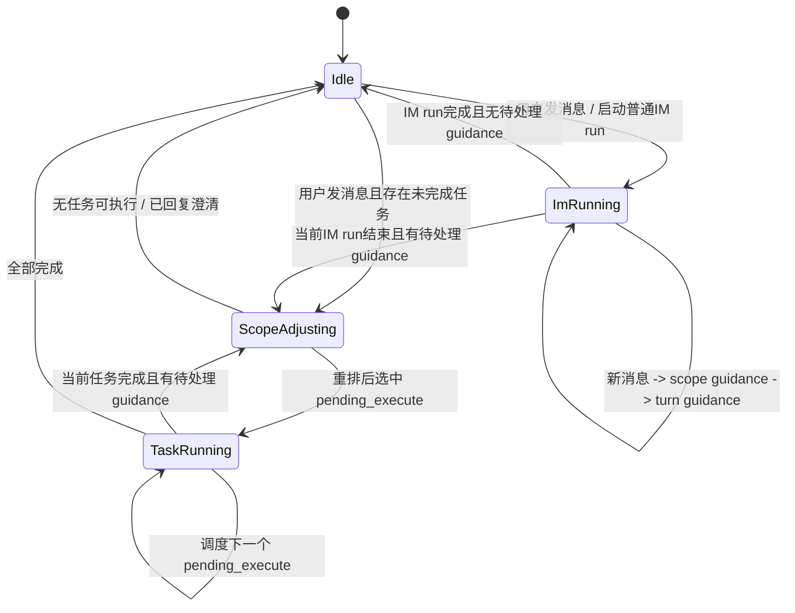
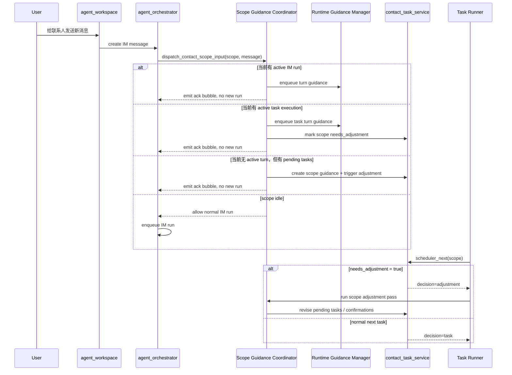

# 联系人执行期消息引导与任务重排方案

## 目标

当同一联系人已经处于“处理中”状态时，用户再次发送新消息，不再直接并发开启新的 IM run，也不简单拒绝。

新的目标行为是：

1. 同一联系人在同一 `scope(user_id + contact_agent_id + project_id)` 下始终单线程执行。
2. 用户新消息会被程序识别为“范围引导（scope guidance）”或“范围重排请求（scope adjustment）”。
3. 引导会结合当前 `running / pending_execute / pending_confirm` 的任务现状，对正在执行或后续待执行的任务做调整。
4. 对用户来说仍然是 IM 对话体验：
   - 用户消息正常发送成功
   - 联系人不再立刻并发跑第二条主流程
   - 系统给一个简短确认气泡
   - 等当前执行吸收完引导或完成重排后，再由联系人给用户最终反馈

这比“拒绝”更自然，也比“直接排第二个 run”更符合我们现在的任务体系。

---

## 当前问题

### 1. 同一联系人会并发跑多个主流程

当前 IM 新消息进入：

- 前端只阻止“当前前台发送还没结束”的重复提交
- 后端 `create_conversation_message -> enqueue_conversation_run`
- 每条用户消息都会新建一个 IM run

这意味着：

- 如果联系人已有 IM run 在跑，再发一条消息，会再起一个 IM run
- 如果后台任务正在执行，再发一条消息，也会再起一个 IM run
- 这些 run 最终共享同一个联系人 scope 和同一个 legacy session，上下文会互相污染

### 2. 现有 runtime guidance 能力只覆盖“当前运行 turn”

我们现在已经有 runtime guidance：

- 本质是往“正在运行的 turn”里注入高优先级补充指令
- 当前实现是 `session_id + turn_id + content`
- 只有 turn 处于 active 状态时才能 enqueue

这套机制很适合“用户中途补充一句话，让模型调整当前处理”，但它现在有两个限制：

1. 它只认识“turn”，不认识“联系人 scope”
2. 任务执行链路虽然也能接入引导，但当前没有统一暴露“这个 scope 现在活跃 turn 是谁”

### 3. 当前任务调度器只会做“拿下一个待执行任务”

`scheduler_next` 现在的语义是：

1. 如果有 `running_task_id`，直接 `pass`
2. 否则从 `pending_execute` 里拿一个变成 `running`
3. 如果都没了，决定是否发 `all_done`

它不会：

- 处理用户新增的“调整意图”
- 在任务执行前重新排序 / 合并 / 取消任务
- 把“当前运行任务 + 待执行任务 + 待确认任务 + 新消息”合在一起做一次协调

### 4. 当前并没有真正产品化的“停止任务 / 调整任务”工具

结合现有代码，当前任务工具现实情况是：

- 联系人聊天阶段只有：
  - `list_tasks`
  - `create_tasks`
  - `confirm_task`
  - `get_contact_builtin_mcp_grants`
  - `list_contact_runtime_assets`
- 任务执行阶段只有：
  - `list_tasks`
  - `create_tasks`
  - `get_contact_builtin_mcp_grants`
  - `list_contact_runtime_assets`
  - `get_current_task`
  - `complete_current_task`
  - `fail_current_task`

也就是说，现在没有真正对联系人开放的：

- `stop_current_task`
- `cancel_task`
- `adjust_tasks`
- `reprioritize_tasks`
- `revise_pending_tasks`

虽然任务服务底层 `update_task` 已经支持：

- 改标题 / 内容 / 优先级
- 改 `planned_builtin_mcp_ids / planned_context_assets`
- 改 `status=cancelled`

但这只是底层数据接口，不等于已经有了安全、清晰、可控的联系人工具。

尤其是当前 `running` 任务：

- 没有看到真正的执行中断联动
- 把任务状态直接改成 `cancelled`，并不代表执行现场已经停下

所以方案里必须明确区分：

1. 软调整
   - 主要改 `pending_confirm / pending_execute`
   - 不要求马上打断当前 running
2. 硬停止
   - 必须真正中断 active IM run 或 active task turn
   - 然后再把任务状态落成 `cancelled`

### 5. 当前异常处理有失败落库，但缺少完整的用户交互规范

现在任务执行失败时，系统已经会：

- 写 `failed`
- 保存 `last_error / result_summary`
- 推一条 `task_execution_notice`

但仍然缺少统一定义：

- 哪些异常应该自动降级成 adjustment
- 哪些异常应该马上告诉用户
- 哪些异常应该转成待确认
- 哪些异常应该让整个联系人 scope 暂停

所以这次方案必须把“异常状态矩阵”和“用户交互策略”一并纳入。

---

## 核心思路

把“用户在联系人执行期间发送的新消息”从“再起一个聊天 run”，改成“写入 scope guidance，并由 scope 协调器串行吸收”。

这里有两个层次：

### 第一层：运行时引导

如果 scope 当前有一个真正活跃的 AI turn：

- IM run 正在跑
- 或后台任务执行正在跑

那么新消息优先转成 **runtime guidance**

特点：

- 不新增主 run
- 不打断当前执行链路
- 由模型在当前执行循环中尽快吸收

### 第二层：范围重排

如果当前没有活跃 turn，但 scope 里还有未完成任务：

- 有 `pending_execute`
- 或有 `pending_confirm`

那么新消息转成 **scope adjustment**

由一个短生命周期的“范围协调 pass”来决定：

1. 是否调整待执行任务顺序
2. 是否合并/取消已有待执行任务
3. 是否修改待确认任务草案
4. 是否需要生成新的待确认任务
5. 是否需要向用户追问澄清

注意：这里仍然是单线程，没有并发第二个主流程，只是插入一个“协调步骤”。

---

## 新的领域对象

建议新增一个独立概念：`contact_scope_guidance`

建议存储维度：

- `id`
- `scope_key`
- `user_id`
- `contact_agent_id`
- `project_id`
- `source_im_conversation_id`
- `source_im_message_id`
- `source_session_id`
- `content`
- `kind`
  - `runtime_guidance`
  - `scope_adjustment`
- `status`
  - `queued`
  - `applied`
  - `dropped`
  - `superseded`
- `target_execution_kind`
  - `im_run`
  - `task_execution`
  - `scope_adjustment`
- `target_turn_id`
- `target_task_id`
- `created_at`
- `applied_at`

这个表的意义不是替代 IM message，而是做“联系人执行期的内部协调日志”。

IM 消息照常保存，`contact_scope_guidance` 负责协调和审计。

---

## 扩展 scope runtime

当前任务服务 runtime 只有：

- `running_task_id`
- `last_all_done_ack_at`

需要扩展为真正的 scope 执行运行态：

- `active_execution_kind`
  - `idle`
  - `im_run`
  - `task_execution`
  - `scope_adjustment`
- `active_im_run_id`
- `active_task_id`
- `active_session_id`
- `active_turn_id`
- `guidance_backlog_count`
- `last_guidance_at`
- `last_adjustment_at`

这样后端才能在“用户再发消息”时快速判断：

1. 当前 scope 是否忙
2. 忙的是 IM 还是任务执行
3. 有没有一个可注入 guidance 的活跃 turn

---

## 新的消息处理策略

### 情况 A：当前没有任何未完成执行

条件：

- 没有 active execution
- 没有 `pending_execute`
- 没有 `pending_confirm`

处理：

- 保持当前行为
- 创建 IM message
- enqueue IM run

### 情况 B：当前 IM run 正在执行

处理：

1. 正常保存用户 IM message
2. 不创建新的 IM run
3. 创建一条 `contact_scope_guidance`
4. 直接把内容 enqueue 到当前 active IM turn
5. 发一个联系人确认气泡

确认气泡建议文案：

- “收到，我会把这条补充合并进当前处理中内容。”

这条确认气泡应是非流式、短文本、稳定文案。

### 情况 C：当前后台任务正在执行

处理：

1. 正常保存用户 IM message
2. 不创建新的 IM run
3. 创建一条 `contact_scope_guidance`
4. 如果当前任务执行存在 active task turn：
   - 直接注入 runtime guidance
5. 同时把该 scope 标记为 `needs_adjustment=true`
6. 当前任务结束后，在调度下一个任务前先跑一次 `scope adjustment pass`

这里的原则是：

- 当前 running task 尽量通过 guidance 立即吸收新约束
- 对后续 `pending_execute / pending_confirm` 再做一次统一重排

### 情况 D：没有 running，但还有 `pending_execute` 或 `pending_confirm`

处理：

1. 正常保存用户 IM message
2. 不创建新的 IM run
3. 创建一条 `contact_scope_guidance`
4. 立即触发一次 `scope adjustment pass`

这个 pass 只做任务协调，不做普通联系人闲聊。

---

## scope adjustment pass 的职责

建议新增一个内部协调器，专门处理“联系人当前任务集合的再规划”。

输入：

- 最新用户消息
- 当前 `running` 任务摘要
- 所有 `pending_execute` 任务
- 所有 `pending_confirm` 任务
- 最近若干条任务执行结果摘要
- 当前 scope 的 project_root / remote_connection_id / 已授权 MCP / 已选 context assets

输出动作：

1. `keep_running_only`
   - 当前 running task 不动
   - 只更新后续任务顺序或说明

2. `revise_pending_execute`
   - 修改待执行任务内容 / 优先级 / 顺序

3. `revise_pending_confirm`
   - 修改待确认草案
   - 必要时追加新的待确认任务

4. `cancel_obsolete_tasks`
   - 取消明显过时的待执行 / 待确认任务

5. `need_user_confirmation`
   - 如果调整会实质改变任务目标，返回新的待确认任务集合给用户

6. `need_clarification`
   - 如果用户这条新消息不足以做安全重排，则回一个澄清问题

重点：这个协调 pass 不负责真正执行任务，只负责“重排和协调”。

---

## 先明确：当前“当前任务”到底是怎么选出来的

这一点需要先钉死，因为后面的暂停 / 继续 / 停止都建立在它之上。

基于当前代码，`contact_task_service/backend/src/repository.rs` 里的 `scheduler_next` 真实行为是：

1. 先读取当前 `scope runtime`
2. 如果 `runtime.running_task_id` 指向的任务仍然是 `running`
   - 直接返回 `decision=pass`
   - 不会再挑新的任务
3. 否则从同一 `scope(user_id + contact_agent_id + project_id)` 的 `pending_execute` 中挑一个
4. 当前挑选排序规则是：
   - `priority_rank ASC`
   - `created_at ASC`
   - `id ASC`
5. 选中后，任务会被原子地改成 `running`
6. 如果没有 `pending_execute`
   - 再看最近终态任务是否需要触发 `all_done`

这意味着当前系统里的“当前要执行的任务”并不是一个复杂协调结果，而是：

- 如果已经有 `running`，那它就是当前任务
- 如果没有 `running`，就从 `pending_execute` 里按 `priority_rank -> created_at -> id` 取第一条
- `pending_confirm` 根本不会进入执行候选
- 目前没有 `paused / pause_requested / resume / stop_requested` 的概念
- 目前也没有真正的“显式任务顺序字段”，本质上是拿 `created_at` 充当顺序

这也是为什么现在一旦想支持“暂停后继续”“重排后再跑”“保留原本顺序但插队”，现有规则就明显不够用了。

---

## 工具能力改造建议

这一部分建议明确区分“聊天阶段工具”和“任务执行阶段工具”。

### 一. 联系人聊天阶段的任务工具

聊天阶段的目标不应该只剩“创建任务”，而应该能围绕当前任务集合持续编排。

建议最终提供这组工具：

1. `list_tasks`
   - 查看当前 scope 的任务全貌

2. `create_tasks`
   - 创建新的待确认任务

3. `confirm_task`
   - 把待确认推进到待执行

4. `adjust_tasks`
   - 面向 `pending_confirm / pending_execute`
   - 支持改标题、内容、优先级、能力、上下文资产
   - 支持取消未开始任务

5. `request_stop_running_task`
   - 请求停止当前 running task
   - 这是语义化工具，不是裸 `update_task`

6. `request_pause_running_task`
   - 请求把当前 `running` 任务停在安全点
   - 输出暂停原因，进入 `paused`

7. `resume_task`
   - 把某个 `paused` 任务恢复回可执行队列
   - 必要时可同时改顺序

8. `get_contact_builtin_mcp_grants`

9. `list_contact_runtime_assets`

这里的关键点是：

- 不建议把底层 `update_task` 原样暴露给模型
- 应该给收窄后的高语义工具
- 模型更容易学会什么时候“调整”，什么时候“暂停”，什么时候“停止”

### 二. 任务执行阶段的任务工具

任务执行阶段建议保持最小闭环，但补一个停止/调整感知：

1. `get_current_task`
2. `list_tasks`
3. `create_tasks`
4. `complete_current_task`
5. `fail_current_task`
6. `check_scope_adjustments`
   - 查看当前 scope 是否有新的用户引导或停止请求
7. `ack_pause_request`
   - 当前任务在安全点确认暂停
   - 输出阶段性结果 / checkpoint
8. `ack_stop_request`
   - 当前任务在安全点确认停止，并返回部分结果 / 停止原因

这里不建议在执行阶段给任意改整个任务集合的能力。

原因：

- 执行阶段核心职责是完成或安全停止当前任务
- 对任务集合的重排应该交给 `scope adjustment pass`

### 三. 停止任务必须拆成两段

建议把“停止当前任务”定义成标准两段式：

1. 提出停止请求
   - 用户消息触发
   - 或联系人显式调用 `request_stop_running_task`
   - scope runtime 标记 `stop_requested=true`

2. 执行器在安全点响应
   - 如果当前 turn 支持 guidance，先注入：
     - “用户要求停止当前任务，尽快收尾，不再继续展开新步骤”
   - 执行器检测到 `stop_requested=true`
   - 收尾后返回部分结果
   - 任务最终进入 `cancelled`

这样可以避免粗暴 kill 带来的脏状态。

### 四. 暂停任务也必须拆成两段

建议把“暂停当前任务”也定义成两段式，而不是直接改状态：

1. 提出暂停请求
   - 用户新消息触发
   - 或联系人显式调用 `request_pause_running_task`
   - scope runtime 标记 `control_request=pause`

2. 执行器在安全点确认暂停
   - 停止继续展开新的工具调用
   - 保存阶段性 checkpoint / 已完成摘要
   - 任务最终进入 `paused`

暂停和停止的区别必须很清楚：

- `paused`
  - 任务还要继续
  - 需要保留恢复依据
- `cancelled`
  - 任务不再继续
  - 需要给出停止时的部分结果和原因

---

## 暂停 / 继续 / 停止的语义边界

这里建议把三种动作彻底分开，不要混在一起：

### 1. revise_running_task_goal

适用场景：

- 用户只是补充约束
- 当前任务方向没错，只是边界要调整
- 不值得停下来重新排整个队列

处理：

- 不暂停
- 不停止
- 直接走 `runtime_guidance`
- 如有必要，仅对后续 `pending_execute` 做轻量重排

### 2. pause_current_task

适用场景：

- 当前任务方向没错，但此刻不该继续往下做
- 用户插入了更高优先级事项
- 当前任务稍后还要继续
- 需要先把当前任务挂起，再做新的任务编排

处理：

- 当前任务接收 `pause request`
- 执行器在安全点停下
- 任务进入 `paused`
- 保存 checkpoint / 当前已完成到哪一步
- 后续由 `resume_task` 恢复

### 3. stop_current_task

适用场景：

- 当前任务方向已经错了
- 用户明确说“不做了”
- 当前任务继续执行已经没有意义

处理：

- 当前任务接收 `stop request`
- 执行器在安全点收尾
- 任务进入 `cancelled`
- 必须输出部分结果和停止原因

### 4. resume_task

适用场景：

- 某个 `paused` 任务需要继续
- 可以继续原顺序
- 也可以在 adjustment pass 中把它插回新的顺序

处理：

- 不直接从 `paused -> running`
- 先回到可调度状态，再由调度器串行挑中
- 这样可以保持“同一 scope 只由调度器决定谁先跑”

---

## 推荐任务状态与控制状态拆分

为了减少状态爆炸，建议把“任务可见状态”和“运行期控制请求”拆开。

### 一. 任务可见状态

建议任务状态最终收敛为：

- `pending_confirm`
- `pending_execute`
- `running`
- `paused`
- `completed`
- `failed`
- `cancelled`

这里我不建议把 `pause_requested / stop_requested / resume_requested` 都直接塞进任务状态枚举。

原因：

- 那些更像运行期控制信号
- 不一定需要长期保存在任务主状态里
- 放进任务状态会让列表、统计、筛选都变复杂

### 二. scope runtime 控制状态

建议把请求型状态放进 `scope runtime`：

- `active_execution_kind`
- `active_task_id`
- `needs_adjustment`
- `control_request`
  - `none`
  - `pause`
  - `stop`
- `control_requested_at`
- `control_requested_by_message_id`
- `control_reason`
- `resume_target_task_id`
- `last_checkpoint_task_id`
- `last_checkpoint_summary`

这样能表达：

- 当前有没有人在要求暂停 / 停止
- 这个请求是不是已经被执行器吸收
- 暂停后接下来是不是要继续这个任务

### 三. paused 任务建议补的字段

仅有 `status=paused` 还不够，至少需要：

- `paused_at`
- `pause_reason`
- `last_checkpoint_summary`
- `last_checkpoint_message_id`
- `resume_note`

否则“继续”时模型根本不知道自己要从哪里接着做。

---

## 与现有 runtime guidance 的关系

现有 runtime guidance 不应该废弃，而是升级成两层：

### 1. turn guidance

保留现有实现：

- 目标是某个正在运行的 turn
- 立即被模型吸收

### 2. scope guidance

新增：

- 目标是联系人 scope，而不是某个固定 turn
- 由协调器选择投递到哪里：
  - 当前 IM turn
  - 当前 task turn
  - 后续 adjustment pass

换句话说：

- `runtime guidance` 继续是执行引擎能力
- `scope guidance` 成为联系人任务体系的编排能力

### 3. stop guidance

本次建议额外引入一种特殊 guidance：

- `stop_guidance`

它的语义不是“补充要求”，而是：

- 尽快停止当前执行
- 不再展开新的工具调用
- 输出已完成部分和停止原因

它既可以投递给 IM run，也可以投递给 task execution turn。

所以实现上建议：

- `scope guidance` 进一步细分为：
  - `runtime_guidance`
  - `scope_adjustment`
  - `stop_guidance`
  - `pause_guidance`

---

## 对任务调度器的改造

当前 `scheduler_next` 只有“running 就 pass，没 running 就拿 pending_execute”。

建议改成：

1. 先读取 scope runtime
2. 如果 `active_execution_kind != idle`：
   - 返回 `pass`
   - 保证同一 scope 单线程
3. 如果存在 `control_request in {pause, stop}`：
   - 返回 `pass`
   - 等待当前执行器在安全点确认暂停 / 停止
   - 绝不能趁这个窗口去拿下一个任务
4. 如果存在 `needs_adjustment=true` 或未处理 guidance：
   - 先返回 `decision=adjustment`
5. 如果存在 `resume_target_task_id`：
   - 先恢复这个 `paused` 任务到可调度态
   - 返回 `decision=resume`
6. 否则从 `pending_execute` 选下一个：
   - 返回 `decision=task`
7. 如果没有 `pending_execute`，但还存在 `paused`：
   - 返回 `decision=await_resume`
   - 明确告诉系统“还有未完成任务，但当前不该自动继续”
8. 否则判断是否 `all_done`

也就是说，`adjustment` 成为新的优先级最高的调度动作。

更关键的是，这里要把“暂停中的任务”和“待执行任务”区分开：

- `paused` 不应该被调度器自动当成 `pending_execute`
- `pause_requested / stop_requested` 期间也不允许调度器继续拿新任务
- 是否继续某个 `paused` 任务，必须由：
  - 用户明确继续
  - 或 adjustment pass 做出恢复决定

否则“暂停”会失去意义，系统会在下一轮 tick 又把它跑起来。

### 必须写成硬约束的调度禁止规则

以下任一条件成立时，定时调度器都只能 `pass`，不能直接启动下一个任务：

1. 当前 scope 有 `running` 任务
2. 当前 scope `active_execution_kind != idle`
3. 当前 scope 存在 `control_request=pause`
4. 当前 scope 存在 `control_request=stop`
5. 当前 scope 仍有 `paused` 任务且尚未明确 `resume`
6. 当前 scope 存在未消费的 guidance / adjustment backlog

也就是说：

- 执行中：不能抢跑下一个
- 暂停请求中：不能抢跑下一个
- 停止请求中：不能抢跑下一个
- 已暂停未继续：不能抢跑下一个

只有当 scope 被重新整理回“明确可执行的单一下一步”时，调度器才允许继续。

---

## 多任务顺序：不能再只靠 created_at 了

你这次提的点很关键。

当一个联系人在同一个项目下有多个任务时，如果我们要认真支持：

- 暂停
- 继续
- 插入更高优先级的新任务
- 对既有任务重排
- 保留原本执行顺序

那就不能继续只用：

- `priority_rank`
- `created_at`
- `id`

来隐式决定顺序。

建议新增显式顺序字段，例如：

- `queue_position`

建议语义：

1. 同一 scope 下，每个 `pending_execute / paused` 任务都有自己的 `queue_position`
2. 新任务确认进入执行队列时，默认追加到末尾
3. adjustment pass 可以重写 `queue_position`
4. `paused` 任务暂停时保留原顺位
5. `resume_task` 时可以：
   - 原位恢复
   - 提前恢复
   - 延后恢复

建议新的候选排序规则是：

1. `queue_position ASC`
2. `priority_rank ASC`
3. `created_at ASC`
4. `id ASC`

这里的理解是：

- `queue_position` 决定显式顺序
- `priority_rank` 主要用来支持“插队时的建议默认值”
- 真正需要重排时，由 adjustment pass 改 `queue_position`

如果你不想同时保留两套概念，也可以进一步收敛成：

- `queue_position` 是主顺序
- `priority` 只作为任务属性给模型理解，不直接参与最终调度

这一点实现时可以二选一，但无论如何，都建议把“顺序”从 `created_at` 里拆出来。

---

## 有了暂停后，调度优先级建议改成这样

建议未来的 scope 调度优先级固定为：

1. `active_execution_kind != idle`
   - 当前有人在跑
   - 不开启第二个主执行

2. `control_request in {pause, stop}`
   - 当前正在等待执行器在安全点响应
   - 仍然不允许起新的任务

3. `needs_adjustment=true` 或 guidance backlog > 0
   - 先跑 adjustment pass

4. `resume_target_task_id` 存在
   - 说明已经明确决定继续某个 `paused` 任务

5. 选择下一个 `pending_execute`
   - 按 `queue_position`

6. 如果只剩 `paused`
   - 返回 `await_resume`
   - 不触发 `all_done`

7. 没有 `running / pending_execute / paused / pending_confirm`
   - 才允许 `all_done`

这条规则很重要，因为它直接定义了：

- `paused` 不是完成
- `paused` 也不是可自动继续的 `pending_execute`
- `pause_requested / stop_requested` 也不是“可以顺手跑别的任务”的空窗
- `all_done` 只能在 scope 真正没有未完成任务时才成立

---

## 用户新消息介入时，AI 该怎么决定“继续 / 暂停 / 停止 / 重排”

建议把联系人在执行中的新消息分成四类决策：

### A. 继续当前任务，只补充约束

适合：

- “顺便把 README 也看一下”
- “注意不要改数据库结构”
- “优先给我结论，不要展开太多”

动作：

- `runtime_guidance`
- 当前任务继续跑
- 必要时再轻调后续队列

### B. 暂停当前任务，先处理别的

适合：

- “先别继续部署，先帮我看线上报错”
- “这个先停一下，先处理联系人 B 的问题”
- “我刚补了关键信息，你先整理现有任务再继续”

动作：

- `request_pause_running_task`
- 当前任务到安全点变 `paused`
- adjustment pass 重新排后续任务

### C. 停止当前任务，不再继续

适合：

- “这个任务不要做了”
- “方向错了，先全部停掉”
- “这个项目先取消”

动作：

- `request_stop_running_task`
- 当前任务到安全点收尾
- 状态落到 `cancelled`
- 输出部分结果和停止原因

### D. 不动当前 running，只重排后续任务

适合：

- 当前 running 没问题
- 但 `pending_execute / pending_confirm` 要变

动作：

- 当前 running 不停
- scope 标记 `needs_adjustment=true`
- 当前任务结束后先做 adjustment，再决定下一个任务

---

## 这套逻辑下，“继续”应该怎么落地

我建议“继续”不要做成一个粗暴的“把 paused 直接改成 running”。

更合理的方式是：

1. 用户或联系人发起 `resume_task`
2. 系统把该任务设为本 scope 的 `resume_target_task_id`
3. 如有必要，adjustment pass 先重排
4. 调度器在下一轮优先恢复这个任务

这样可以保证：

- 仍然由调度器统一决定执行入口
- 不会绕过 scope 单线程约束
- 恢复前还能再吸收一次最新 guidance

---

## 对异常状态矩阵的补充：加入 pause / resume

### H. pause request 已发出，但执行器迟迟不确认

处理建议：

1. 联系人先回确认气泡：
   - “已收到暂停请求，我会在当前步骤完成后暂停。”
2. 如果超时未到安全点：
   - scope 标记 `stalled`
   - 联系人回异常气泡
3. 禁止调度器直接起下一个任务

### I. paused 任务恢复失败

场景：

- checkpoint 不完整
- 上下文恢复失败
- 所需资产已经失效

处理建议：

1. 不直接把任务改成 `failed`
2. 先进入 `scope_adjustment`
3. 由联系人决定：
   - 重新生成一个替代任务
   - 还是继续重试恢复

### J. paused 任务长期无人恢复

处理建议：

- 不触发 `all_done`
- 在前端明确显示为“已暂停，等待继续”
- 联系人后续收到新消息时，可以把它纳入 adjustment pass，一并决定是否恢复或取消

---

## IM 接口改造建议

当前 `/api/im/conversations/:conversation_id/messages` 对用户消息的处理是“存消息 + enqueue run”。

建议改成：

1. 先根据 `conversation -> contact -> project -> scope_key` 查询 scope runtime
2. 判断当前 scope 状态
3. 分支：
   - `idle`：正常 enqueue IM run
   - `im_run`：转 `scope_guidance`，不 enqueue 新 run
   - `task_execution`：转 `scope_guidance`，不 enqueue 新 run
   - `has_pending_tasks_without_active_turn`：触发 `scope adjustment pass`

因此这里不再是简单的 `enqueue_conversation_run()`，而是：

- `dispatch_contact_scope_input()`

这个命名会更准确。

此外建议接口返回明确的接收结果：

- `accepted_as_new_run`
- `accepted_as_runtime_guidance`
- `accepted_as_scope_adjustment`
- `accepted_as_stop_guidance`

这样前端和 IM 服务都能知道这条消息实际进入了哪条处理路径。

---

## 前端交互建议

用户层面的体验建议如下：

1. 用户发送消息后，消息状态仍然显示“已发送”
2. 如果该消息被转成 guidance，不要显示成失败，也不要提示“被拦截”
3. 联系人可以立刻回一个短确认气泡：
   - “收到，我会按你的新要求调整当前处理。”
4. 如果 adjustment pass 产出了新的待确认任务：
   - 仍然走现有任务确认卡片
5. 如果只是更新了后续执行计划：
   - 不强制打断用户
   - 等任务真正跑完后给结论
6. 如果用户表达的是“停止 / 取消 / 改一下”：
   - 联系人先回一个确认气泡，说明已接收为调整或停止请求
7. 如果当前出现异常：
   - 不要只留后台日志
   - 要给用户一条可理解的联系人气泡

这样用户感知会是：

- 我的话已经送达
- 联系人正在处理，不是没反应
- 系统没有开启两个脑子同时乱跑

建议统一几类确认气泡：

- 运行中补充：
  - “收到，我会把这条补充并入当前处理。”
- 任务重排：
  - “收到，我会先调整当前待办任务，再继续执行。”
- 停止请求：
  - “收到，我正在停止当前任务，并整理已完成结果。”
- 需要确认：
  - “这会改变现有任务安排，我先给你一个确认方案。”
- 需要澄清：
  - “我收到你的调整意图了，但还差一个关键信息。”

---

## 推荐状态机

---

## 异常状态与处理矩阵

这部分建议纳入正式设计，而不是运行时临时判断。

### A. guidance 投递失败

场景：

- scope 看起来忙，但 active turn 已经结束
- enqueue guidance 返回 `turn_not_running`

处理：

1. 不对前端报错
2. 自动降级为 `scope_adjustment`
3. 联系人回确认气泡：
   - “我已经收到你的补充，我会在当前步骤结束后重新调整任务安排。”

### B. adjustment pass 失败

场景：

- 协调模型调用失败
- 任务集合读取失败
- 重排结果落库失败

处理：

1. scope runtime 记录 `adjustment_failed`
2. 联系人回一条异常气泡
3. 保留当前 `running / pending_execute / pending_confirm` 不强制改坏
4. 用户可以继续补充，或稍后重试

建议用户气泡：

- “我收到了新的要求，但这次任务调整没有成功，现有任务我先保持不变。你可以稍后再试，或者让我重新整理一次。”

### C. 当前 running task 执行失败

这个场景现在已有基础实现，但需要升级交互定义。

处理：

1. 任务状态 -> `failed`
2. 保存 `result_summary / last_error`
3. 推送 `task_execution_notice`
4. 如果 scope 里还有未处理 guidance：
   - 先进入 `scope_adjustment`
   - 不直接继续跑下一个任务

联系人气泡建议：

- “当前任务执行失败了，我已经记录失败原因，并会结合你最新的要求重新调整后续任务。”

### D. 停止请求无法立即执行

场景：

- 当前任务正在关键步骤
- 当前 turn 一时不能安全中断

处理：

1. `stop_requested=true`
2. 联系人立即回确认气泡：
   - “已收到停止请求，我会在当前步骤收尾后停止。”
3. 到达安全点后：
   - 中断执行
   - 任务状态改 `cancelled`
   - 附带“停止时已完成到哪一步”的结果摘要

### E. 任务被取消，但执行器仍在跑

这是必须避免的脏状态。

方案里要明确：

- 不允许仅把 `running` 任务的数据状态改成 `cancelled` 就算完成
- 必须区分：
  - `cancel_requested`
  - `cancelled`

建议：

- `cancel_requested` 表示用户要求停止，但执行器还没收尾
- 只有执行器确认停止后，才进入 `cancelled`

### F. scope 长时间卡住

场景：

- `active_execution_kind != idle`
- 长时间没有新事件、没有任务状态更新

处理：

1. 引入 scope watchdog
2. 超时后把 scope 标成 `stalled`
3. 联系人给用户一条异常说明气泡
4. 后端允许人工或系统触发恢复 / 重试

联系人气泡建议：

- “我这边的执行似乎卡住了，我已经暂停继续推进。你可以让我重试，或者调整任务后再继续。”

### G. all_done 与新消息撞车

场景：

- 调度器正准备发 `all_done`
- 用户恰好发来新消息

处理：

- 新消息优先
- 取消本次 `all_done`
- 转入 `scope_adjustment` 或 `runtime_guidance`

不能让用户看到：

- 一边说“全部完成”
- 一边又立刻开始根据新要求调整

---

## 数据状态建议补充

为了把“停止中”和“异常中”表达清楚，建议 scope runtime 至少增加：

- `needs_adjustment`
- `stop_requested`
- `stop_requested_at`
- `adjustment_status`
  - `idle`
  - `queued`
  - `running`
  - `failed`
- `last_adjustment_error`
- `stalled_at`
- `last_execution_heartbeat_at`

如果任务表也要更细，可以考虑增加中间态：

- `cancelling`

但如果你不想扩任务状态枚举，也可以只放在 scope runtime，任务最终仍保持：

- `running`
- `cancelled`

---

## 对 adjustment pass 输出的扩充建议

原先只有“重排 / 取消 / 澄清”还不够，建议再补：

1. `request_stop_running_task`
   - 用户意图明确要求停当前任务

2. `defer_stop_until_safe_point`
   - 已接收停止，但当前先收尾

3. `revise_running_task_goal`
   - 不停止当前任务，只修改当前任务目标边界

4. `revise_pending_execute`
5. `revise_pending_confirm`
6. `cancel_obsolete_tasks`
7. `need_user_confirmation`
8. `need_clarification`

---

## 推荐链路图

---

## 实施步骤

### 第一阶段：把“并发新 run”改成“scope 分流”

1. 新增 `contact_scope_guidance` 存储
2. 扩展 scope runtime 字段
3. 把 IM 新消息入口从 `enqueue_conversation_run` 改成 `dispatch_contact_scope_input`
4. 跑通：
   - active IM run -> guidance
   - active task execution -> guidance
   - idle -> 正常 run

### 第二阶段：补齐任务工具语义

1. 新增 `adjust_tasks`
2. 新增 `request_stop_running_task`
3. 明确 `cancel_requested` 与 `cancelled` 的区别
4. 禁止模型直接拿裸 `update_task` 做无限制修改

### 第三阶段：接通任务执行期 guidance

1. 任务执行时注册 active turn
2. 暴露 `active_turn_id` 到 scope runtime
3. 让后台 task execution 也能接收 runtime guidance
4. 支持 `stop_guidance`

### 第四阶段：加入 adjustment 调度

1. `scheduler_next` 增加 `decision=adjustment`
2. 新增 adjustment pass
3. 支持改写：
   - pending_execute
   - pending_confirm
   - obsolete task cancel
   - stop request
   - running task goal revise

### 第五阶段：补全异常处理和前端反馈

1. 引导成功时显示联系人确认气泡
2. 在消息详情或调试面板里可看到：
   - 这条用户消息被当成 normal run / runtime guidance / scope adjustment
3. 异常时输出稳定联系人气泡，而不只是后台日志
4. 加 scope watchdog / stalled 提示

---

## 我建议的落地优先级

建议按下面顺序做，而不是一次性大改：

1. 先阻止“执行期间再起第二个 IM run”
2. 先补 `adjust_tasks` / `request_stop_running_task`
3. 先接 active IM run 的 guidance
4. 再接 active task execution 的 guidance
5. 最后补 adjustment pass、异常矩阵和 watchdog

原因：

- 第 1 步可以先止血，避免继续并发污染上下文
- 第 2 步先把产品语义补齐，避免后面只会“创建任务”
- 第 3、4 步复用现有 runtime guidance 机制，收益最大
- 第 5 步是完整产品化，需要更多任务服务改造

---

## 最终结论

我认同你的判断：这里不应该做成“忙就拒绝”，而应该做成“同一联系人单线程执行，但允许用户在执行期持续纠偏”。

最合理的模型不是“第二个 run 排队”，而是：

- **主执行链路始终单线程**
- **用户新增消息进入 scope guidance**
- **能即时注入当前 turn 的就即时注入**
- **不能即时注入的就进入 scope adjustment，在当前任务完成后统一重排**
- **停止任务必须区分 stop request 与真实 cancelled**
- **异常状态必须有稳定的用户交互，而不只是日志落地**

这样既不会并发乱跑，也不会让用户觉得“我说的话系统没收到”。
