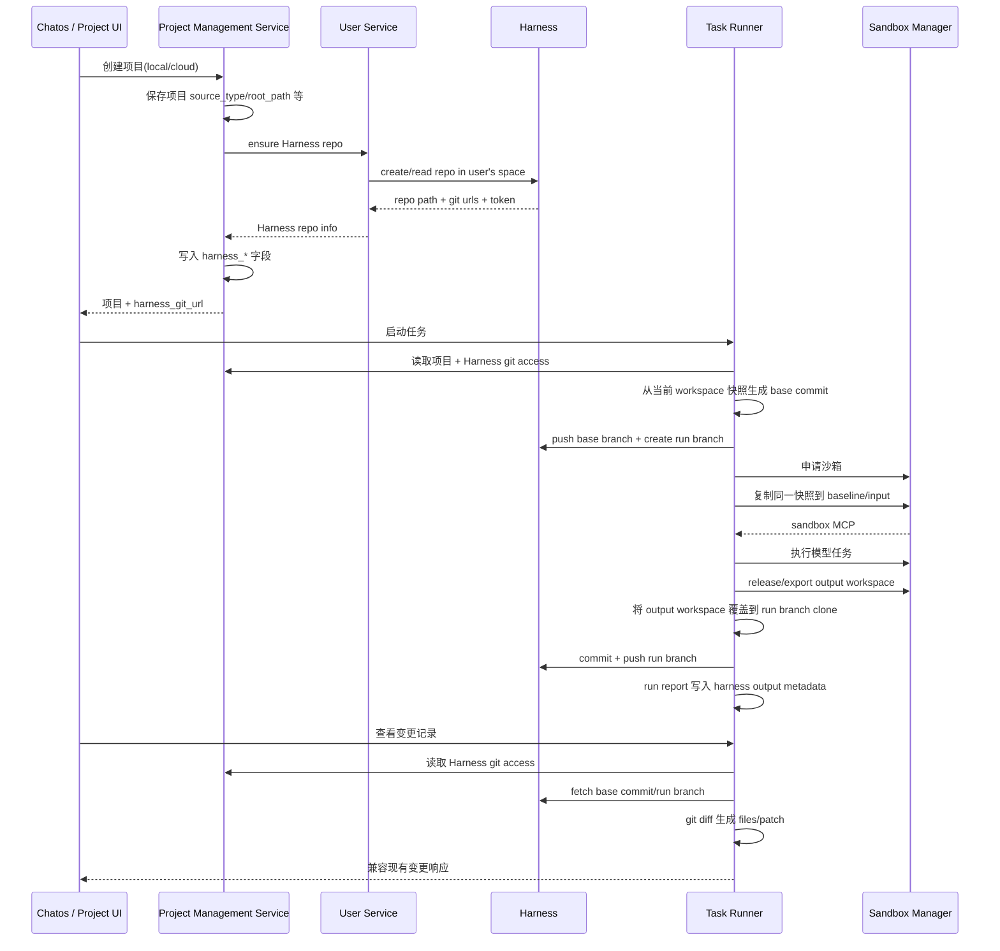

# Harness 沙箱分支与变更 Diff 实施方案

## 背景

现在 Task Runner 在沙箱模式下的代码执行链路是：

- `task_runner_service/backend/src/services/sandbox_runtime.rs` 在运行前申请沙箱。
- `sandbox_runtime/workspace.rs` 把 `effective_workspace_dir` 复制到沙箱的 `baseline/workspace` 和 `runs/{run}/input/workspace`。
- 模型通过沙箱 MCP 改沙箱内文件。
- `sandbox_manager_service/backend/src/service/output_manifest.rs` 在 release 时用 baseline 和 output 文件树生成 `change_manifest.json` 以及本地 diff 文件。
- 变更记录接口 `GET /api/runs/:id/output/changes`、`GET /api/runs/:id/output/diff` 目前从 run report 里的 `output.sandbox.change_manifest_path` 读取本地 manifest/diff。
- Chatos 前端的 `MessageTaskChangesModal` 消费的是兼容结构：`counts/files` 和单文件 `patch`。

这套机制还没有“把沙箱修改合并或提交到统一代码仓库”的能力。用户现在能看变更，但变更只存在于沙箱导出的本地 output 目录。

新需求是：

- 不管本地项目还是云端项目，创建项目时都在内部 Harness 里创建对应项目仓库，并把我们的 Harness Git 地址返回给业务层。
- 这个 Harness 仓库只服务后续执行、沙箱、diff、合并等内部业务，不把本地项目变成云端项目，不改变用户自己的 Git remote，也不扩散到其它产品语义。
- 云端项目默认使用沙箱。
- 本地项目才允许用户选择是否使用沙箱。
- 沙箱任务执行时，在内部 Harness 仓库中基于当前项目快照创建运行分支。
- 沙箱执行完成后，把沙箱产物提交到该运行分支。
- 变更记录页面改为从 Harness 分支拉取 diff，而不是读本地 manifest 文件。

## 当前代码基础

### Project Management Service

- 项目模型在 `project_management_service/backend/src/models/projects.rs`。
- `ProjectRecord` 已有 `source_type`、`cloud_import_source`、`import_status`、`source_git_url`、`harness_space_identifier`、`harness_repo_identifier`、`harness_repo_path`、`harness_git_url`、`harness_git_ssh_url`。
- 云端项目创建入口 `create_cloud_project` 已经会：
  - 创建项目记录。
  - 调用 `create_harness_repo_for_project`。
  - 按 Git/Zip/Empty 导入到 Harness。
  - 把 Harness repo 信息写回项目。
- 普通项目 `create_project` 目前只落库和创建 runtime environment，不创建 Harness repo。
- `cloud_import.rs` 已有可复用能力：
  - 调 user_service 创建 Harness repo。
  - 生成带认证的 Git URL。
  - 用 Git CLI mirror/import/push。
  - 对 Zip 做安全解包。

### User Service

- `user_service/backend/src/api/harness.rs` 提供内部接口：
  - `POST /api/internal/harness/repos`
  - `GET /api/internal/harness/users/:user_id/access`
- `user_service/backend/src/integrations/harness/repo.rs` 已经能：
  - 根据用户 Harness provisioning 记录创建用户空间下的 repo。
  - 返回 `git_url`、`git_ssh_url`、`default_branch`、`push_username`、`push_token`。
  - 返回用户 Harness API access token。
- 当前创建 repo 不是完整幂等语义，repo 已存在时需要补“读取已有 repo 并返回”的逻辑。

### Task Runner

- `TaskProjectRecord` 已经有 Harness 字段，但 SQLite 存储还没有这些列，`task_project_from_row` 当前把 Harness 字段全部读成 `None`。
- 当 Project Service 配置存在时，Task Runner 的项目读写走 `project_management_api_client` 透传 Project Service。
- `workspace_mcp.rs` 已经有 Harness 云端项目 MCP 路由：`harness_code`。
- `run_model_phase.rs` 在模型执行后调用 `release_sandbox`，随后 `finalize_model_phase` 把 `SandboxOutputReport` 写进 run report。
- 这是接入“沙箱产物提交 Harness 分支”的最佳位置。

### Sandbox Manager

- 沙箱 manager 只负责 lease、workspace、output export。
- 它不需要知道 Harness 仓库，也不应该负责 Git 分支提交。
- 保持 release 继续返回 output workspace/manifest，Task Runner 在 release 之后把 output workspace 提交到 Harness。

## 设计原则

1. Harness 是内部执行仓库，不改变项目来源。
   - 本地项目仍是本地项目，`source_type`、`root_path`、Local Connector 语义不变。
   - 云端项目仍走现有云端导入流程。
   - 用户自己的 Git 不被改 remote、不被自动 push。
   - 本地项目拥有 `harness_git_url` 只是“内部执行镜像仓库”能力，不代表项目被迁移成云端项目。

2. Harness repo 信息一等存储，业务使用 `harness_*` 字段。
   - 本地项目不要为了“返回我们的 Git 地址”强行覆盖用户原始 `git_url`。
   - 对本地项目优先返回 `harness_git_url` / `harness_git_ssh_url`。
   - 对云端项目保持现有兼容，但后续也应把“用户源 Git”和“Harness Git”区分清楚。

3. 沙箱 diff 的基线必须等于沙箱输入。
   - 当前沙箱输入是从 `effective_workspace_dir` 复制出来的快照，可能包含用户未提交文件。
   - 所以运行前要把同一个快照同步成 Harness base commit，再从这个 commit 创建 run branch。
   - 否则 diff 会混入用户运行前已有的未提交变更。

4. 变更记录接口保持响应结构兼容。
   - `RunOutputChangesResponse` 和 `RunOutputDiffResponse` 继续返回 `counts/files/patch`。
   - 新增 Harness 元数据字段可以是可选字段，前端先无感兼容。

5. Git 操作走服务端临时目录和内部凭据。
   - 不复用用户项目里的 `.git`。
   - 不依赖用户 remote。
   - 所有 token 输出必须 scrub。

## 本地项目与云端项目边界

这是本方案最重要的约束：给本地项目创建内部 Harness 仓库，只是为了后续沙箱执行、运行分支、diff、合并预留一个受控的内部 Git 承载面，绝不能让系统在任何后续链路里把本地项目当成云端项目。

必须保持以下边界：

- `source_type` 是项目来源事实，不能因为存在 `harness_git_url` 而从 `local` / `local_connector` 变成 `cloud`。
- 本地项目的文件访问、项目根路径、Local Connector 路由仍以 `root_path` / `local://connector/...` 为准；不能因为有 Harness repo 就改走云端 Harness 文件 MCP。
- 本地项目是否启用沙箱仍由用户选择；不能因为有 Harness repo 就默认强制沙箱。
- 云端项目才是默认沙箱，且云端项目的文件读写可以继续使用 Harness 云端仓库语义。
- Task Runner 在判断项目类型时必须优先看 `source_type` / runtime environment，而不是用 “是否有 `harness_repo_path`” 推断项目是云端项目。
- 内部 Harness run branch 只用于记录沙箱输入快照和执行产物，不是本地项目的 source of truth。
- 本地项目运行前同步到 Harness 的 base commit 只能代表“本次执行输入快照”，不能反向修改用户本地目录，也不能修改用户自己的 Git remote/branch。
- 后续如果做 merge，也只能先合并到内部 Harness 仓库或生成内部 PR；是否回写本地项目必须是另一条明确业务，并且需要用户显式确认。

实现上要避免一个危险简化：不要写 `project_has_harness_repo => cloud project` 这类判断。正确判断应是：

```text
项目来源: source_type / root_path / cloud_import_source
内部执行仓库: harness_* 字段
沙箱策略: 云端项目强制开启，本地项目读取用户配置
变更记录来源: 优先 Harness run branch，失败回退 sandbox manifest
```

也就是说，本地项目可以拥有内部 Harness 仓库，但它仍然是本地项目；Harness 在这里是执行基础设施，不是项目来源定义。

## 目标架构



## 数据模型调整

### Project Management Service

在 `ProjectRecord` 增加建议字段：

- `harness_default_branch: Option<String>`
- `harness_provision_status: Option<String>`，建议值：`pending` / `ready` / `failed`
- `harness_provision_error: Option<String>`
- `harness_provisioned_at: Option<String>`

原因：

- `import_status` 现在混合了云端导入状态，不适合表达“普通本地项目是否已经创建内部 Harness repo”。
- `harness_default_branch` 当前只从创建 repo 响应里拿到，没有持久化。
- 未来本地项目 repo 创建成功但源代码尚未同步，也需要能明确区分。

SQLite 需要补 migration；Mongo 可以直接兼容新字段。

### Task Runner

`TaskProjectRecord` 同步新增同名字段，并补齐 SQLite：

- migration 给 `task_projects` 增加 `source_type`、`cloud_import_source`、`import_status`、`source_git_url`、全部 `harness_*` 字段。
- 更新 `task_project_from_row` 和 `save_task_project`。

否则 Project Service 未启用的本地部署会丢 Harness 字段。

### Run Report

在 `run.report.output` 下新增 Harness 输出信息：

```json
{
  "output": {
    "sandbox": {
      "enabled": true,
      "sandbox_id": "...",
      "lease_id": "...",
      "output_workspace": "...",
      "change_manifest_path": "...",
      "file_change_counts": {}
    },
    "harness": {
      "enabled": true,
      "project_id": "...",
      "repo_path": "space/repo",
      "git_url": "https://...",
      "base_branch": "main",
      "run_branch": "chatos/runs/<run_id>",
      "base_commit": "...",
      "result_commit": "...",
      "status": "committed",
      "message": null
    }
  }
}
```

状态建议：

- `prepared`: run branch 已创建，任务还没结束。
- `committed`: 沙箱产物已提交。
- `no_changes`: 沙箱产物和 base commit 无差异。
- `failed`: 提交失败，保留 `message`。

## 项目创建链路

### 1. 抽出 Harness repo 保障服务

在 Project Management Service 新增服务模块，例如：

- `project_management_service/backend/src/services/harness_repo.rs`

职责：

- `ensure_harness_repo_for_project(state, user/access_token, project) -> HarnessProjectRepoResponse`
- 调用现有 `create_harness_repo_for_project`。
- 对 repo already exists 做幂等处理。
- 写回 `harness_*`、`harness_default_branch`、`harness_provision_status`。
- 不改变 `source_type`。

### 2. 修改普通项目创建

`project_management_service/backend/src/api/projects.rs:create_project` 当前流程：

1. `store.create_project`
2. `ensure_runtime_environment_for_project`
3. 返回项目

调整为：

1. 创建项目记录。
2. 创建 runtime environment：
   - 本地项目按用户传入 `sandbox_enabled`。
   - 云端项目始终 `sandbox_enabled = true`。
3. 调 `ensure_harness_repo_for_project`。
4. 保存 Harness repo 字段。
5. 返回项目。

本地项目注意：

- `root_path` 保持原值。
- `git_url` 如果是用户输入的源 Git，不要被 Harness URL 覆盖。
- 返回体中包含 `harness_git_url`，前端需要展示“内部执行仓库地址”时用这个字段。

### 3. 修改云端项目创建

`create_cloud_project` 已有 Harness repo 创建和导入逻辑，但建议改成复用同一个 `ensure_harness_repo_for_project`，避免两条创建语义分叉。

云端项目继续：

- `source_type = cloud`
- `sandbox_enabled = true`
- Git/Zip/Empty 导入到 Harness 默认分支。
- `import_status = ready/failed`

### 4. User Service repo 创建幂等化

`user_service/backend/src/integrations/harness/repo.rs:create_harness_project_repo` 需要处理：

- 如果 Harness `POST /api/v1/repos` 返回 conflict/already exists：
  - 使用确定性的 `repo_identifier` 和用户 `space_identifier` 调 Harness API 读取 repo。
  - 返回同样的 `HarnessProjectRepoResponse`。
- 如果 repo 存在但不属于当前用户空间，返回错误。

这样项目重复创建、重试、服务超时重放不会产生不可恢复状态。

## Harness Git Access 接口

Task Runner 不能直接拿 user_service 内部 secret，也不应该自己理解 Harness 用户 provisioning。

建议在 Project Management Service 增加内部同步接口：

- `GET /api/chatos-sync/projects/:project_id/harness/git-access`
- 鉴权：沿用 `PROJECT_SERVICE_SYNC_SECRET`
- 返回：

```json
{
  "project_id": "...",
  "repo_path": "...",
  "git_url": "...",
  "git_ssh_url": "...",
  "default_branch": "main",
  "space_identifier": "...",
  "access_username": "<harness_uid>",
  "access_token": "<PAT>"
}
```

Project Service 内部逻辑：

- 读取 project。
- 确认 `harness_repo_path` 存在。
- 从 user_service `GET /api/internal/harness/users/:owner_user_id/access` 获取 token。
- 校验 project 的 `harness_space_identifier` 和 token 所属 space 一致。
- 返回给 Task Runner。

Task Runner 新增 client 方法：

- `project_management_api_client::get_project_harness_git_access(config, project_id)`

所有日志和错误输出 scrub `access_token`。

## 沙箱执行链路

### 1. 解析项目沙箱策略

在 Task Runner 启动 run 时，目前 `sandbox_enabled` 主要来自任务配置或全局 runtime settings。

需要新增统一判断：

- 如果项目 `source_type == cloud`，强制沙箱启用。
- 如果项目是本地或 local_connector，按用户在项目 runtime environment 中保存的 `sandbox_enabled` 或任务配置决定。
- 如果无法读取 Project Service runtime environment，至少对 `source_type == cloud` 强制启用。

建议新增 helper：

- `RunService::effective_sandbox_policy_for_task(task) -> SandboxPolicy`

并让 `start_run` 的 `input_snapshot.sandbox_enabled` 和 `prepare_sandbox_if_needed` 使用同一套判断。

### 2. 准备 Harness run branch

新增 Task Runner 模块：

- `task_runner_service/backend/src/services/harness_run_git.rs`

运行前，在 `prepare_sandbox_if_needed` 申请沙箱前或申请后健康检查前执行：

1. 读取项目 Harness git access。
2. 判断 base branch：
   - 优先使用本地 workspace 当前 Git branch：`git rev-parse --abbrev-ref HEAD`。
   - 如果 detached、没有 `.git` 或云端项目没有显式分支，使用 project `harness_default_branch` 或 `main`。
3. 创建临时 Git worktree。
4. 用当前 `effective_workspace_dir` 的文件快照生成 base commit：
   - 跳过 `.git`、`.chatos`、`.task-runner`、`target` 等已有 skip 策略。
   - 不修改用户项目。
   - commit message：`Sync project snapshot before run <run_id>`。
5. push 到 Harness base branch。
6. 从 base commit 创建 run branch：
   - 分支名：`chatos/runs/<run_id>`。
   - push run branch。
7. 返回：
   - `repo_path`
   - `base_branch`
   - `run_branch`
   - `base_commit`

关键点：

- base commit 必须来自“沙箱输入同一份快照”，这样最终 diff 只表示任务执行产生的变化。
- 不要用用户仓库的 commit 作为唯一基线，因为本地 workspace 可能有未提交文件。
- 不要把用户 `.git` 复制进 Harness。

### 3. 沙箱复制保持现状

`sandbox_runtime/workspace.rs` 当前复制 baseline 和 run workspace 的机制可以保留。

优化点：

- 复用同一个 workspace skip 策略，避免 Harness base commit 和沙箱 baseline 不一致。
- 如果后续要做到严格一致，可以让 `harness_run_git` 产出一个 normalized snapshot directory，然后沙箱复制也从这个 snapshot directory 复制。

### 4. 提交沙箱产物到 run branch

在 `RunService::execute_run_model_phase` 中，当前顺序是：

1. 执行模型。
2. `release_sandbox(&run, context)`。
3. `finalize_model_phase(..., sandbox_output)`。

调整为：

1. 执行模型。
2. release 沙箱，拿到 `SandboxOutputReport.output_workspace`。
3. 如果有 Harness run context：
   - clone/fetch run branch 到临时目录。
   - 用 `output_workspace` 覆盖 worktree。
   - 删除 worktree 中 output 已删除的文件。
   - `git add -A`。
   - 如果无变化：标记 `no_changes`。
   - 如果有变化：commit `Apply sandbox output for run <run_id>`，push 到 run branch。
4. 把 `SandboxOutputReport` 和 `HarnessRunOutputReport` 一起写入 report。

失败策略：

- 沙箱任务成功但 Harness 提交失败时，不应把任务本身改成 failed。
- run event 记录 `harness_output_commit_failed`。
- report 中 `output.harness.status = failed`，保留错误。
- 变更记录接口 fallback 到旧 manifest，保证用户仍能看到本次变更。

## 变更记录 Diff

### 1. 读取优先级

`get_run_output_changes` / `get_run_output_diff` 调整为：

1. 如果 run report 有 `output.harness.status in ["committed", "no_changes"]`：
   - 从 Harness Git 拉取 `base_commit` 和 `run_branch`。
   - 用 Git CLI 生成变更文件列表和 patch。
2. 如果没有 Harness 元数据或 Harness diff 失败：
   - 兼容读取旧 `change_manifest.json`。

### 2. Git diff 实现

新增 `HarnessRunDiffReader`：

- clone/fetch Harness repo 到临时目录。
- `git diff --name-status --find-renames <base_commit>..<run_branch>`
- `git diff --numstat <base_commit>..<run_branch>`
- 单文件 patch：`git diff --binary --find-renames <base_commit>..<run_branch> -- <path>`

返回继续映射到：

- `RunOutputFileChange`
- `RunOutputChangesResponse`
- `RunOutputDiffResponse`

二进制文件：

- `git diff --numstat` 中 `- -` 视为 binary。
- `patch` 可为空，`diff_available=false`，message 沿用现有文案。

### 3. 前端改动

第一阶段可以不改 UI，因为响应结构兼容。

建议后续增强：

- `MessageTaskRunnerRunOutputChangesResponse` 增加可选 `source: "harness" | "sandbox_manifest"`。
- 增加可选 `harness` 元数据：
  - `run_branch`
  - `base_branch`
  - `result_commit`
  - `git_url`
- `MessageTaskChangesModal` 顶部展示“来自 Harness 分支: chatos/runs/xxx”。

## 合并能力预留

本次需求只做提交和 diff，不做合并。

但 run report 已经有：

- base branch
- run branch
- base commit
- result commit

后续合并可以新增：

- `POST /api/runs/:id/output/harness/merge`
- 或 Project Service 创建 Harness PR。

合并时应继续使用内部 Harness，不直接操作用户自己的 Git。

## 需要改的主要文件

### Project Management Service

- `project_management_service/backend/src/models/projects.rs`
- `project_management_service/backend/src/api/projects.rs`
- `project_management_service/backend/src/api/router.rs`
- `project_management_service/backend/src/services/cloud_import.rs`
- 新增 `project_management_service/backend/src/services/harness_repo.rs`
- 新增 `project_management_service/backend/src/api/harness_git_access.rs`
- `project_management_service/backend/src/store/sqlite/projects.rs`
- `project_management_service/backend/src/store/sqlite_rows.rs`
- `project_management_service/backend/migrations/0001_init.sql` 或新增后续 migration
- `project_management_service/backend/src/store/mongo/projects.rs`

### User Service

- `user_service/backend/src/integrations/harness/repo.rs`
- 必要时补 Harness repo read API model。

### Task Runner

- `task_runner_service/backend/src/models/project.rs`
- `task_runner_service/backend/src/models/run.rs`
- `task_runner_service/backend/src/services/project_management_api_client.rs`
- `task_runner_service/backend/src/services/sandbox_runtime.rs`
- `task_runner_service/backend/src/services/sandbox_runtime/output.rs`
- `task_runner_service/backend/src/services/run_model_phase.rs`
- `task_runner_service/backend/src/services/run_model_phase/completion.rs`
- 新增 `task_runner_service/backend/src/services/harness_run_git.rs`
- 新增 `task_runner_service/backend/src/services/harness_run_diff.rs`
- `task_runner_service/backend/src/store/sqlite_rows.rs`
- `task_runner_service/backend/src/store/sqlite/models/projects.rs`
- 新增 Task Runner migration

### Chatos

- 第一阶段可不改。
- 可选增强：
  - `chatos/frontend/src/lib/api/client/types/messageTaskRunner.ts`
  - `chatos/frontend/src/components/messageTasks/MessageTaskChangesModal.tsx`

## 分阶段实施

### Phase 1: Harness repo 创建一体化

- Project Service 普通项目创建时创建 Harness repo。
- 云端项目复用同一套 ensure repo 逻辑。
- user_service repo 创建幂等化。
- 项目返回 `harness_git_url`。
- SQLite/Mongo 字段补齐。

验收：

- 创建本地项目后，项目记录保留 `source_type=local/local_connector`，同时有 `harness_repo_path` 和 `harness_git_url`。
- 创建云端项目后，仍能导入 Git/Zip，`import_status=ready`。
- 重试创建/保存不会因 repo 已存在失败。

### Phase 2: Task Runner 获取 Harness Git access

- Project Service 增加 `/api/chatos-sync/projects/:project_id/harness/git-access`。
- Task Runner 增加 client。
- 日志 scrub token。

验收：

- Task Runner 可通过 sync secret 获取项目 Harness repo path 和临时 Git 凭据。
- 无权限、项目缺 Harness repo、space 不匹配时明确报错。

### Phase 3: 沙箱 run branch 准备和提交

- Task Runner 运行前同步 workspace 快照为 base commit。
- 创建 `chatos/runs/<run_id>` 分支。
- 沙箱结束后把 output workspace commit 到 run branch。
- run report 写入 `output.harness`。

验收：

- 本地项目开启沙箱后，Harness repo 出现 run branch。
- run branch 上有一次沙箱结果 commit。
- 本地用户项目 `.git` 和 remote 没有变化。
- 沙箱无变化时 report 标记 `no_changes`，不产生空 commit。

### Phase 4: Diff 从 Harness 分支读取

- `get_run_output_changes` / `get_run_output_diff` 优先读 Harness。
- 旧 manifest fallback 保留。
- ChatOS 前端不改也能显示 diff。

验收：

- 删除/新增/修改/二进制文件都能在变更弹窗中显示。
- 关闭或移除本地 `change_manifest.json` 后，已提交 Harness 的 run 仍能显示 diff。
- 旧历史 run 仍能用 manifest 显示。

### Phase 5: UI 元数据增强

- 变更弹窗显示 Harness 分支、commit。
- 项目详情展示“内部执行仓库地址”。
- 本地项目创建/设置页只暴露“是否使用沙箱”。
- 云端项目隐藏该开关或展示为固定开启。

## 测试计划

### 单元测试

- user_service：
  - repo exists 时 `create_harness_project_repo` 返回已有 repo。
  - URL rewrite 不泄漏 localhost。
- project_management_service：
  - 普通本地项目创建会写 `harness_*`，但不改变 `source_type`。
  - 云端项目仍强制 sandbox。
  - git-access 接口校验 sync secret、owner、space。
- task_runner_service：
  - SQLite 项目 Harness 字段读写不丢失。
  - workspace snapshot skip `.git/.chatos/.task-runner`。
  - run branch 名合法。
  - 无变更时不 commit。
  - Harness diff reader 能解析 added/modified/deleted/binary。

### 集成测试

- Docker stack 下：
  - 注册用户并完成 Harness provisioning。
  - 创建本地项目，确认 Harness repo 创建。
  - 开启沙箱运行任务，确认 run branch 和 commit。
  - 变更记录从 Harness diff 渲染。
- 云端项目：
  - Git import 项目默认启用沙箱。
  - Zip import 项目默认启用沙箱。
  - 运行后结果提交到 run branch。

### 回归测试

- 沙箱 manager 原有 manifest 生成不被破坏。
- 没有 Project Service 或 Harness 未配置时：
  - 本地非沙箱任务仍可运行。
  - 旧 manifest diff 仍可显示。
  - 需要 Harness branch 的沙箱提交明确降级并记录 warning。

## 风险与处理

- Harness repo 创建失败：
  - 项目可以先创建，但 `harness_provision_status=failed`。
  - UI 提示内部执行仓库初始化失败。
  - 后续运行如果需要沙箱分支，提前失败或降级 manifest。

- 本地项目很大：
  - snapshot/push 可能慢。
  - 需要 size/file count 限制，复用云端 Zip import 的限制配置或新增 Task Runner 限制。
  - 后续可优化为增量 sync。

- 未提交本地文件：
  - 设计上会进入 base commit，这样 diff 只显示任务产生的变化。
  - 这符合“不操作用户 git”的约束。

- 多个任务并发：
  - run branch 用 run_id 唯一，不冲突。
  - base branch 可能被多次同步覆盖；diff 用 base_commit 固定 SHA，不受后续 base branch 移动影响。

- token 泄漏：
  - 所有 Git 命令错误输出 scrub token。
  - run report 不写 token。
  - 临时 authenticated URL 不进入事件 payload。

## 推荐落地取舍

第一版不要改 Sandbox Manager，也不要引入 Harness PR/merge。

核心闭环先做到：

1. 项目都有内部 Harness repo。
2. 沙箱运行有唯一 run branch。
3. 沙箱产物提交到 run branch。
4. 变更记录从 run branch diff 读取。

这样既满足当前业务，又为后续合并/PR 留出清晰入口，同时不会把“本地项目”语义误扩散成“云端项目”。
