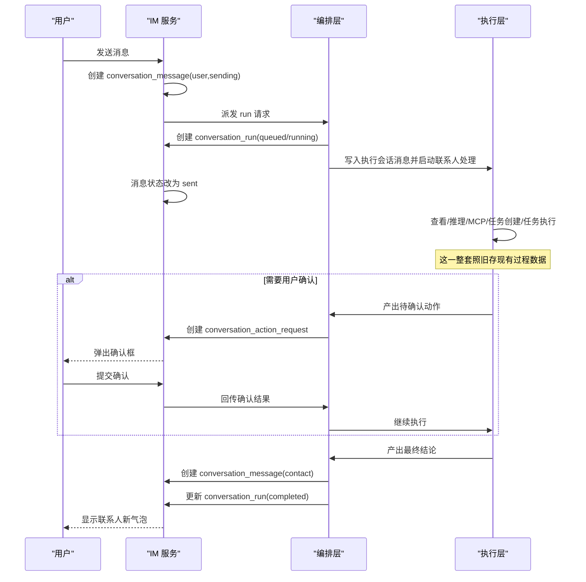
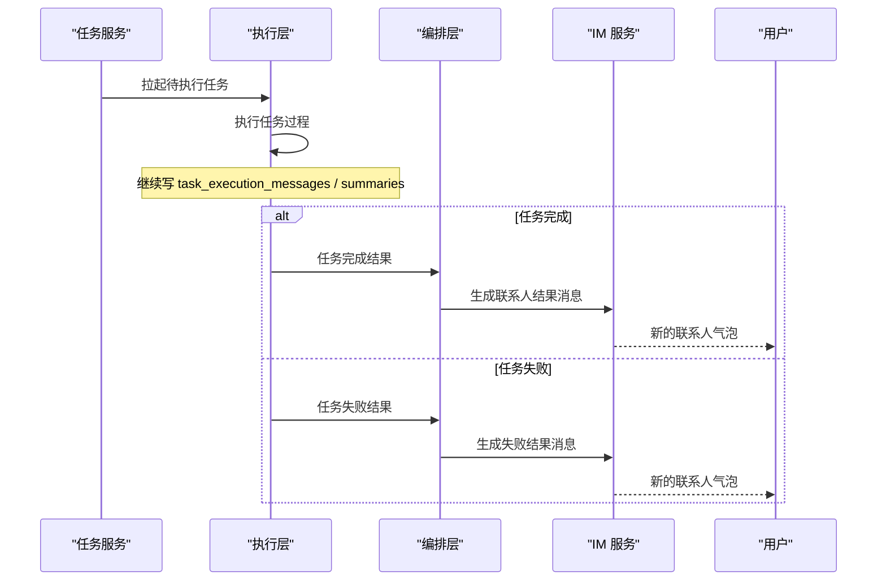

# IM 服务与执行层解耦改造方案

## 1. 这次要纠正的核心概念

这次不是把当前联系人处理过程“藏到后面”这么简单，而是要正式拆成两个世界：

1. `IM 世界`
   - 用户真正看到和感知到的聊天世界
   - 关注用户、联系人、会话、消息、送达状态、未读、确认弹窗、通知
2. `执行世界`
   - 联系人为得到结论而进行的后台处理世界
   - 包括查看、推理、MCP、任务创建、任务执行、总结、记忆

这两个世界都真实存在，只是职责不同。

所以：

- 现有执行链路不要删，不要弱化，不要改语义
- 新增 IM 体系，用来承载“用户和联系人正常聊天”这件事
- 以后前端联系人页主要读取 IM 体系
- 现有 `memory/task` 体系继续负责“联系人怎么得到答案”

## 2. 为什么之前的方案不够

之前的页面方案更多是在讨论：

- 主聊天区不要显示流式过程
- 任务确认改弹窗
- 结果再回成气泡

这个方向没有错，但还停留在“UI 收口”层面。

真正的问题是：现在“用户看到的聊天消息”和“联系人内部处理过程”被建模成了同一套消息体系。

从代码上看，当前普通聊天消息会进入：

- [`messages`](/Users/lilei/project/my_project/chatos_rs/memory_server/backend/src/models/messages.rs)

任务执行过程会进入：

- [`task_execution_messages`](/Users/lilei/project/my_project/chatos_rs/memory_server/backend/src/models/task_execution.rs)

而普通 `messages` 又会直接参与：

- 上下文拼装
- 总结任务
- 记忆抽取

相关入口：

- [`memory_server/backend/src/services/context.rs`](/Users/lilei/project/my_project/chatos_rs/memory_server/backend/src/services/context.rs)
- [`memory_server/backend/src/jobs/summary_generation.rs`](/Users/lilei/project/my_project/chatos_rs/memory_server/backend/src/jobs/summary_generation.rs)
- [`chat_app_server_rs/src/services/message_manager_common.rs`](/Users/lilei/project/my_project/chatos_rs/chat_app_server_rs/src/services/message_manager_common.rs)

这说明如果继续把 IM 消息和执行消息混着建模，后面问题会越来越多：

- 会污染总结
- 会污染记忆
- 会让前端会话页持续背着执行逻辑
- 会让“联系人聊天”和“后台执行”始终边界不清

## 3. 新的总体架构

建议把系统拆成两层半：

### 3.1 IM 服务

新增一个专门的 `im_service`，负责：

- 用户
- 联系人
- 联系人会话
- 联系人消息
- 消息状态
- 确认类交互
- 通知/未读

它代表“用户眼里”的聊天系统。

### 3.2 执行层

保留现有体系，继续负责：

- 联系人运行时上下文
- MCP/工具/技能/插件装配
- 联系人推理执行
- 任务创建
- 定时任务执行
- 执行过程记录
- 执行总结
- 记忆沉淀

这层主要仍由下面这些部分组成：

- `chat_app_server_rs`
- `memory_server`
- `contact_task_service`

### 3.3 桥接编排层

可以继续由 `chat_app_server_rs` 先承担，后续再独立：

- 接收 IM 发来的用户消息
- 找到对应联系人执行上下文
- 驱动执行链路
- 把最终结果回写成 IM 消息
- 把任务确认需求转换成 IM 侧交互请求

也就是说：

- `IM 服务` 负责“说了什么”
- `执行层` 负责“怎么做到”
- `编排层` 负责“两边对接”

## 4. 建议的职责边界

## 4.1 IM 服务负责什么

建议放进 `im_service` 的内容：

- 用户账号
- 登录态/用户基本资料
- 联系人列表
- 联系人会话列表
- 会话消息
- 会话中的待确认动作
- 消息送达状态
- 未读计数
- 会话归档/置顶/静音

也就是说，你提到的“之前 memory 里的用户”，我也建议迁到这里。

因为用户管理本质上更属于 IM 域，而不是记忆域。

## 4.2 memory 服务继续负责什么

`memory_server` 保留在执行域中，继续负责：

- agent 定义
- 联系人运行时资源上下文
- 技能/插件/commons/runtime commands
- agent recall
- project memory
- 聊天执行上下文总结
- 任务执行上下文总结
- task result brief
- turn runtime snapshot

也就是说，它更像“联系人的脑子和工作台”，不是“聊天产品本身”。

## 4.3 task 服务继续负责什么

`contact_task_service` 继续负责：

- 任务实体
- 任务状态
- 调度策略
- 定时拉起执行
- 执行完成/失败状态回写

## 4.4 认证与授权边界

这里需要再明确一个非常关键的边界：

- `IM 服务` 负责 Authentication
- `memory/task` 负责执行域资源 Authorization
- 服务间调用保留独立的 Internal Service Auth

### IM 服务负责的认证

后续应迁移到 IM 服务：

- 登录
- 登出
- `me`
- 用户表
- 用户角色
- 用户 token 签发
- 前端主站的身份识别

也就是说，之前由 `memory` 承担的：

- `auth_users`
- `/auth/login`
- `/auth/me`
- token 签发与校验

这些都应迁移为 IM 服务的职责。

### memory/task 保留的授权

`memory_server` 和 `contact_task_service` 不应该再作为“账号中心”，但仍然必须保留资源级授权判断，例如：

- 当前 `user_id` 能否访问这个 agent
- 当前 `user_id` 能否访问这个 contact
- 当前 `user_id` 能否访问这个执行会话
- 当前 `user_id` 能否读取这条 task result brief

也就是说：

- 它们不再决定“你是谁”
- 但继续决定“你能不能访问这份执行域资源”

### 服务间鉴权必须独立保留

除了用户认证，还必须保留服务间鉴权：

- IM -> 编排层
- 编排层 -> memory
- 编排层 -> task_service
- task_runner / scheduler -> IM

这层不要再复用用户 token 语义，建议继续使用单独的：

- service token
- internal service credential
- 内部签名头

一句话总结：

- `IM 服务` 解决“用户是谁”
- `memory/task` 解决“用户能访问什么执行资源”
- `internal auth` 解决“服务与服务之间是否可信”

## 5. 数据分层原则

后续所有数据都建议按下面三层理解：

### 5.1 IM 外显层

用户真正能看到的内容，例如：

- 用户发送了一条消息
- 联系人回了一条消息
- 任务完成后联系人回了一条消息
- 联系人需要你确认一个任务

这层的数据必须是产品消息，不是执行日志。

### 5.2 编排状态层

用于串联 IM 与执行链路，例如：

- 这条 IM 消息触发了哪一次后台 run
- 当前 run 是否等待确认
- 当前 run 是否处理完成
- 最终产出的 IM 回复消息是哪一条

这层是系统桥，不直接给模型做上下文。

### 5.3 执行事实层

联系人内部真实发生的处理过程，例如：

- 查了哪些内容
- 调了哪些工具
- thinking
- 创建了哪些任务
- 定时任务执行了什么
- 执行总结是什么

这层继续由当前 memory/task 体系承载。

## 6. 建议的新服务数据模型

以下是 `im_service` 的建议表设计。

## 6.1 users

负责 IM 用户。

建议字段：

- `id`
- `username`
- `display_name`
- `avatar_url`
- `status`
- `created_at`
- `updated_at`

说明：

- 这张表承接目前 `memory` 里偏账号管理的部分
- 后续统一由 IM 服务作为用户主数据来源

## 6.2 contacts

这里的联系人是“IM 里的联系人”，而不是执行域里的 agent 本体。

建议字段：

- `id`
- `owner_user_id`
- `agent_id`
- `display_name`
- `avatar_url`
- `status`
- `created_at`
- `updated_at`

说明：

- `agent_id` 指向执行域里的 agent
- 联系人是 IM 视角下的包装对象

## 6.3 conversations

代表用户和某个联系人的一条 IM 会话。

建议字段：

- `id`
- `owner_user_id`
- `contact_id`
- `project_id`
- `title`
- `status`
- `last_message_at`
- `last_message_preview`
- `unread_count`
- `created_at`
- `updated_at`

说明：

- 一个联系人在不同项目下可以有不同会话
- `project_id = null` 可表示外侧聊天

## 6.4 conversation_messages

这是 IM 最核心的一张表。

只存“用户看到的正常聊天消息”。

建议字段：

- `id`
- `conversation_id`
- `sender_type`
  - `user`
  - `contact`
  - `system`
- `sender_id`
- `message_type`
  - `text`
  - `task_result`
  - `task_failed`
  - `notice`
- `content`
- `delivery_status`
  - `sending`
  - `sent`
  - `failed`
- `client_message_id`
- `reply_to_message_id`
- `metadata`
- `created_at`
- `updated_at`

说明：

- 这里不存 tool timeline
- 不存 thinking
- 不存内部 MCP 流
- 这里只表示用户眼里的聊天结果

## 6.5 conversation_action_requests

这张表很重要，用于承接“联系人聊天过程中需要用户交互确认”的场景。

例如：

- 任务创建确认
- UI prompt
- 后续可能的授权确认

建议字段：

- `id`
- `conversation_id`
- `trigger_message_id`
- `run_id`
- `action_type`
  - `task_review`
  - `ui_prompt`
- `status`
  - `pending`
  - `submitted`
  - `cancelled`
  - `expired`
- `payload`
- `submitted_payload`
- `created_at`
- `updated_at`

说明：

- 前端联系人页的弹窗以后主要读这张表
- 不要再从工具流里临时拼 UI 状态

## 6.6 conversation_runs

这张表是 IM 和执行层之间的桥。

建议字段：

- `id`
- `conversation_id`
- `source_message_id`
- `contact_id`
- `agent_id`
- `project_id`
- `execution_session_id`
- `execution_turn_id`
- `execution_scope_key`
- `status`
  - `queued`
  - `running`
  - `waiting_action`
  - `completed`
  - `failed`
- `final_message_id`
- `error_message`
- `started_at`
- `finished_at`
- `created_at`
- `updated_at`

说明：

- 一条用户消息通常触发一条 run
- run 本身不是用户消息，而是后台处理单元
- 以后 IM 页如果要展示“处理中”，也是看这个状态，不是看工具流

## 6.7 可选：conversation_events

如果你希望 IM 服务里也能留一层轻量事件审计，可以再加：

- `conversation_events`

只存产品级事件，不存详细执行过程。

例如：

- 用户消息已受理
- 联系人发起任务确认
- 用户已确认任务
- 联系人已回复

这张表可选，不是第一优先级。

## 7. 现有执行层保留哪些表

这部分建议不动语义。

继续保留：

- [`messages`](/Users/lilei/project/my_project/chatos_rs/memory_server/backend/src/models/messages.rs)
- [`task_execution_messages`](/Users/lilei/project/my_project/chatos_rs/memory_server/backend/src/models/task_execution.rs)
- `session_summaries_v2`
- `task_execution_summaries`
- `task_result_briefs`
- `turn_runtime_snapshots`

但是要重新定义它们的身份：

### 7.1 messages

以后不再把它视为 IM 聊天消息主表。

它应该被重新定义成：

- 联系人执行会话的原始对话与过程消息
- 属于执行域上下文，不属于 IM 产品消息

### 7.2 task_execution_messages

继续是：

- 定时任务执行域的原始过程消息

### 7.3 各类 summary / memory / recall

继续只服务于执行域上下文构建。

## 8. 从 IM 到执行层的主流程

## 9. 定时任务完成后的回写流程

## 10. 用户管理迁移建议

你提到希望把之前 memory 里的用户也放到新服务里，这个方向我认同。

建议原则：

- `im_service.users` 作为用户主表
- `memory_server` 后续只保留 `user_id` 外键引用
- `memory_server` 不再承担账号主数据职能

当前 `memory_server` 里很多实体都带 `user_id`，例如：

- `sessions`
- `contacts`
- `memory_agents`
- `memory_projects`
- `task_result_briefs`
- job configs

这没有问题，后续仍然可以保留 `user_id` 作为作用域键。

但“用户本身是谁、昵称是什么、头像是什么、登录态是什么”这类数据，应该迁到 IM 服务。

## 11. 联系人归属建议

联系人建议也逐步迁到 IM 服务。

当前 memory 里的：

- [`Contact`](/Users/lilei/project/my_project/chatos_rs/memory_server/backend/src/models/sessions.rs)

更像是“用户的联系人关系”。

它不是 agent 定义本身，更接近 IM 域。

建议未来拆分为：

- `memory_agent`
  - 执行域里的智能体定义
- `im_contact`
  - IM 域里的联系人实例

两者通过 `agent_id` 关联。

## 12. 前端读取策略要怎么变

改造后，联系人页建议完全切换到 IM 视角：

### 12.1 主聊天区读 IM

主聊天页只读：

- `conversations`
- `conversation_messages`
- `conversation_action_requests`
- `conversation_runs` 的轻量状态

### 12.2 详情区读执行层

只有用户点“查看详情/调试”时，才去读：

- 执行会话消息
- task execution messages
- runtime snapshot
- summaries
- tool timeline

也就是：

- 主线程 = IM
- 详情区 = 执行层

## 13. 是否要立即拆独立服务

我的建议是：

### 阶段 1

先按独立服务边界设计数据模型和 API，但代码可以先放在当前仓库里作为新模块启动。

原因：

- 先把领域边界做对
- 不立即引入额外部署复杂度
- 可以更快验证前端与后端的新接口

### 阶段 2

当接口与模型稳定后，再把它真正拆成独立 `im_service`。

这样风险更低。

换句话说：

- 领域边界现在就要拆
- 物理部署可以分两步走

## 14. 推荐实施顺序

## 第一阶段：先立 IM 数据模型

先新增：

- `users`
- `contacts`
- `conversations`
- `conversation_messages`
- `conversation_action_requests`
- `conversation_runs`

这一步先把数据主干搭起来。

## 第二阶段：编排层桥接

在 `chat_app_server_rs` 里先新增 IM 编排能力：

- 用户消息进入 IM
- 启动执行 run
- 最终结果写回 IM
- 待确认动作写入 `conversation_action_requests`

## 第三阶段：前端联系人页改读 IM

让联系人聊天页改为：

- 主列表只显示 IM 消息
- 确认动作来自 IM action request
- 不再直接消费流式执行事件做主 UI

## 第四阶段：执行层只做后台事实

保留并继续增强：

- `messages`
- `task_execution_messages`
- summaries
- runtime snapshots

但它们退出主会话产品界面。

## 第五阶段：迁移用户与联系人主数据

把用户和联系人逐步迁到 IM 服务作为主来源，memory 变为引用方。

## 15. 需要特别注意的风险

## 15.1 不要把 IM 表做成执行镜像

新增 IM 表不是把现有过程表复制一份。

IM 表应该只存：

- 产品级聊天事实
- 产品级交互事实

而不是存全量执行过程。

## 15.2 不要破坏现有总结链路

当前总结链路已经围绕：

- `messages`
- `task_execution_messages`

构建完成。

所以新增 IM 体系时，不要把 IM 消息直接拿去替代它们。

## 15.3 不要让 IM 与执行层相互反向污染

建议规则：

- IM 可以引用执行 run id
- 执行层可以回写 IM message id
- 但两边不要混成一张表

## 15.4 任务确认不要再依赖工具流临时态

以后任务确认应该是正式的 IM action request。

这样才有：

- 状态持久化
- 可恢复
- 可重放
- 可审计

## 16. 最终结论

这次改造的正确方向不是“把联系人处理过程隐藏一下”，而是正式建立：

- 一个 `IM 服务`
- 一个继续存在的 `执行层`
- 一个负责桥接的 `编排层`

最终系统应当变成：

1. 用户在 IM 里和联系人聊天
2. IM 记录的是正常聊天事实
3. 联系人的后台处理继续走现有 memory/task 体系
4. 处理完成后，把结论回写成 IM 消息
5. 任务确认等交互，也由 IM 正式承接

一句话概括：

以后“聊天”是 IM 的事，“思考和干活”是执行层的事。
