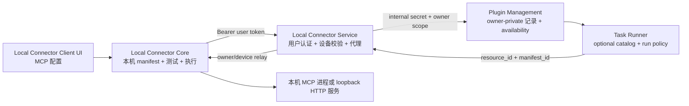
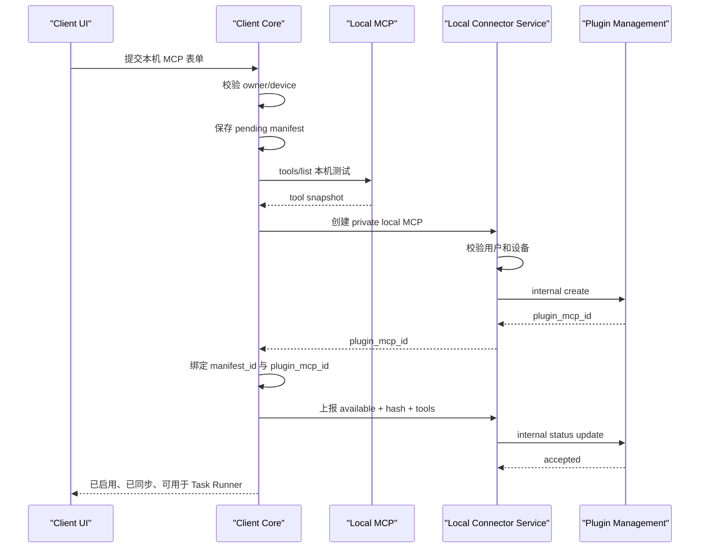

# Local Connector 用户 MCP 配置与本机执行实施方案

> 状态：代码落地完成，自动化验证通过  
> 编写日期：2026-07-10  
> 完成日期：2026-07-10  
> 当前分支：`2.0.4`  
> 本文范围：在 Local Connector Client 增加“MCP 配置”菜单，让用户创建、编辑、启停、测试和删除只能在本机执行的私有 MCP，并接入 Plugin Management 与 Task Runner 现有能力目录和运行链路。Skills 不在本次范围内。

## 0. 实施结果

本方案涉及的代码已完成落地：

- Plugin Management 已提供 Local Connector MCP 专用内部同步、更新、删除、状态和批量状态 API，并强制用户私有、owner 隔离和 manifest hash 校验。
- Local Connector Service 已提供用户认证代理，校验用户和设备归属；WebSocket 接收 Client 工具状态，设备断线时批量标记离线。
- Local Connector Client Core 已实现本机 manifest、secret 掩码、`0600` 状态文件权限、stdio/loopback HTTP 测试、本地 CRUD API、周期真实 `tools/list` 检查和 WebSocket 状态上报。
- 用户 MCP relay 已严格匹配 owner、device、Plugin Management resource id 和 manifest id，只转发 `tools/list`、`tools/call`，且始终在所属 Client 执行。
- Local Connector Client 前端已增加“`MCP 配置`”菜单、列表、启停、测试、同步、删除，以及 stdio/HTTP 字段化编辑表单；无需填写原始 JSON。
- Task Runner 已过滤缺少完整 Local Connector 引用的用户 MCP，并在执行构造阶段强制 stdio/HTTP 用户 MCP 必须携带 manifest id。
- 新建且测试失败的 enabled MCP 只保留为本机草稿，不创建云端 enabled 描述；已经同步过的 MCP 修改失败时会更新描述 hash，使旧 availability 立即失效。

已完成验证：

```text
cargo test -p chatos_plugin_management_sdk                 4 passed
cargo test -p plugin_management_service_backend           25 passed
cargo test -p local_connector_service_backend              0 failed
cargo test -p local_connector_client_core                 27 passed
cargo test -p task_runner_service_backend                175 passed
npm run type-check                                         passed
npm run build                                              passed
docker compose -f docker/compose.yml config --quiet        passed
```

浏览器已检查桌面和 `390x844` 窄屏布局，未发现横向溢出、控件重叠或控制台错误。为了不在当前用户真实账户中创建测试 MCP，本次没有写入一条演示资源做生产数据级端到端调用；部署环境仍应按第 16.7 节执行真实 stdio MCP 联调。

## 1. 结论先行

这次不能只增加一个表单并调用 Plugin Management 的 MCP CRUD API。完整闭环必须同时包含四部分：

1. Local Connector Client 管理本机 MCP manifest，完整命令、环境变量、HTTP header 等敏感运行参数只保存在本机。
2. Local Connector Service 作为用户认证、设备归属和 Plugin Management 写入代理，Client 不持有 Plugin Management 内部 secret。
3. Plugin Management 保存 owner-private 的 MCP 控制面记录和最新可用性检查结果，并自动把已启用、在线、检查成功的用户 MCP 作为 `task_runner_run_phase` 的 optional 能力返回。
4. Task Runner 继续按照现有插件策略选择 MCP；真正调用时通过 Local Connector Service relay 回到指定用户、指定设备上的 Local Connector Client 执行。

关键规则：

- 用户从 Local Connector Client 创建的 MCP 一律是 `private`，不能创建 `public` 或 `system_private`。
- 用户 A 的 MCP 在目录、更新、检查、Task Runner 选择和实际执行各层都不能被用户 B 看见或调用。
- 用户 MCP 默认 `enabled=true`。只有 Client 在线、本机测试成功且 availability 未过期时，才进入 Task Runner 的 optional 工具目录。
- 用户关闭 MCP 后立即从 Task Runner 可选目录消失，并且 Client 本机也拒绝继续执行。
- 所有这类 MCP 必须通过 Local Connector Client 执行，云端不得直接执行本机 command、读取本机 env，或绕过 device 校验。
- Client 本机保存完整 manifest；Plugin Management 只保存非敏感描述、稳定 manifest 引用和路由信息。
- 当前 Task Runner 已经具备“用户私有 MCP 自动作为 optional 能力”和“Local Connector relay 路由”的主体逻辑，本次主要补齐 Client CRUD、真实 manifest 执行、可信状态上报和安全校验。

## 2. 当前代码审计结论

### 2.1 Local Connector Client 前端

当前入口：

- `local_connector_client/frontend/src/main.tsx`
- `local_connector_client/frontend/src/api.ts`

现状：

- 左侧已有设备配对、开放目录、本机终端、模型配置、命令审批、运行配置和本地沙箱菜单。
- 前端通过 `127.0.0.1` 上的 Local Connector Core API 操作本地状态。
- 当前 UI 使用 React、Lucide 图标和项目自有 CSS，不使用 Ant Design。
- 当前没有 MCP 配置菜单、MCP 列表、表单或测试状态视图。

### 2.2 Local Connector Client Core

当前入口：

- `local_connector_client/core/src/state.rs`
- `local_connector_client/core/src/api.rs`
- `local_connector_client/core/src/api/handlers.rs`
- `local_connector_client/core/src/connector.rs`
- `local_connector_client/core/src/mcp/service.rs`
- `local_connector_client/core/src/mcp/provider.rs`

现状：

- `LocalState` 已保存登录态、设备、工作区、模型配置、审批配置和沙箱状态。
- Core API 已提供本地 CRUD 的成熟模式，可复用模型配置的 handler/service/state 组织方式。
- WebSocket relay 已能接收 `type=mcp` 的请求。
- 现有 MCP provider 只执行 Local Connector 内置的文件、终端和浏览器工具。
- Task Runner 已发送：
  - `x-plugin-management-resource-id`
  - `x-local-connector-mcp-manifest-id`
- Client 当前没有读取这两个 header，也没有按 manifest 启动用户自定义 stdio MCP 或代理本机 HTTP MCP。

### 2.3 Plugin Management

当前入口：

- `plugin_management_service/backend/src/api.rs`
- `plugin_management_service/backend/src/models.rs`
- `plugin_management_service/backend/src/store.rs`

现状：

- 已有 MCP list/create/get/update/delete API。
- 普通用户只能创建 `private` MCP。
- 普通用户列表只能看见自己的 private 和 admin public 资源。
- `task_runner_run_phase.include_user_resources=true`，因此已启用的用户私有 MCP 会被自动构造成 optional binding，不需要用户或管理员再创建 agent binding。
- 用户本机 MCP 使用 `device_id`、`manifest_id` 和 `requires_online` 引用字段；工作区只属于内置文件、终端等项目能力。
- 已有 `ResourceCheckRecord`，包含 status、tool snapshot 和 manifest hash。

当前缺口：

- Plugin Management 自己无法访问用户电脑，现有 `/check` 对 Local Connector MCP 只能写入 `unknown`。
- availability 没有可信的 Client 上报入口，也没有过期时间判断。
- 本机 MCP 的 command/env/headers 仍可直接写入云端模型，不符合敏感配置留在本机的目标。
- 当前 local connector runtime 校验仍要求云端 record 带 command 或 URL，应该改为以 manifest 引用为准。

### 2.4 Task Runner

当前入口：

- `task_runner_service/backend/src/api/mcp.rs`
- `task_runner_service/backend/src/services/plugin_management_policy.rs`
- `task_runner_service/backend/src/services/run_model_phase/setup/preparation/mcp_inputs.rs`

现状：

- `/api/tasks/capabilities/catalog` 只返回 available optional MCP。
- 用户私有 MCP 会通过 Plugin Management resolver 自动进入 optional 集合。
- 任务写入会校验用户选择是否合法。
- run phase 会重新解析策略，注入 required，并与已保存 optional 选择取交集。
- Local Connector MCP 已会路由到：

```text
/api/local-connectors/relay/{device_id}/mcp
```

- Task Runner 已传递 resource id 和 manifest id。

因此，本次不需要重写 Task Runner 工具选择机制，只需要补强 manifest 必填、路由一致性和端到端测试。

## 3. 本次目标与非目标

### 3.1 目标

1. 在 Local Connector Client 增加“MCP 配置”菜单。
2. 用户可以创建、查看、编辑、启用、停用、测试和删除自己的本机 MCP。
3. 第一版支持：
   - 本机 stdio MCP。
   - 本机 HTTP MCP。
4. 完整敏感运行配置只保存在本机。
5. Plugin Management 保存 owner-private 控制面记录。
6. 新增 MCP 默认成为 Task Runner available optional 能力。
7. Task Runner 选择后必须通过 Local Connector Service 和指定 Client 执行。
8. 建立在线状态、测试状态、manifest hash 和 tool snapshot 上报。
9. 建立严格的 owner、device、manifest、resource 四层匹配校验。
10. 支持断线、重连、配置修改、启停和删除后的状态收敛。

### 3.2 非目标

- 本次不实现 Skills。
- 不允许用户从 Client 创建 public MCP。
- 不允许云端直接启动用户配置的本机 command。
- 不支持任意远程 HTTP 地址作为“本机 HTTP MCP”；第一版只允许 loopback 地址。
- 不在 Client 中配置五个系统 Agent 的 required/optional 关系。
- 不重写 Task Runner 的任务模型或工具选择协议。
- 不把用户 MCP 的 env、token、HTTP secret header 上传到 Plugin Management。

## 4. 目标架构



### 4.1 控制面和执行面

控制面：

- Plugin Management 保存 MCP 是否启用、显示名称、所属用户、运行类型、设备、manifest id 和可用状态。
- Task Runner 只根据 Plugin Management 的 resolver 结果决定是否展示、允许选择和执行。

执行面：

- Client Core 保存 command、args、env、URL、headers 等本机运行配置。
- Client Core 接收 Task Runner relay 后，根据 manifest id 找到本机配置并执行。
- Local Connector Service 不持有用户 MCP secret，也不执行 MCP command。

## 5. 数据模型设计

### 5.1 Client 本机 manifest

在 `LocalState` 新增：

```rust
pub struct LocalMcpState {
    pub manifests: Vec<LocalMcpManifestRecord>,
}

pub struct LocalMcpManifestRecord {
    pub manifest_id: String,
    pub plugin_mcp_id: Option<String>,
    pub owner_user_id: String,
    pub device_id: String,
    pub internal_name: String,
    pub display_name: String,
    pub description: Option<String>,
    pub transport: LocalMcpTransport,
    pub stdio: Option<LocalMcpStdioConfig>,
    pub http: Option<LocalMcpHttpConfig>,
    pub enabled: bool,
    pub sync_status: LocalMcpSyncStatus,
    pub last_check_status: String,
    pub last_checked_at: Option<String>,
    pub last_error: Option<String>,
    pub tool_snapshot: Vec<Value>,
    pub manifest_hash: String,
    pub created_at: String,
    pub updated_at: String,
}
```

stdio 配置：

```rust
pub struct LocalMcpStdioConfig {
    pub command: String,
    pub args: Vec<String>,
    pub env: BTreeMap<String, String>,
}
```

HTTP 配置：

```rust
pub struct LocalMcpHttpConfig {
    pub url: String,
    pub headers: BTreeMap<String, String>,
    pub timeout_ms: u64,
}
```

约束：

- `manifest_id` 本机生成 UUID，创建后不可变。
- `plugin_mcp_id` 是 Plugin Management resource id，首次同步成功后写回。
- `internal_name` 创建后不可变，用于稳定工具前缀；修改显示名称不改变 AI 工具名。
- 完整 env 和 headers 只存在本机 manifest。
- API 返回给前端时 secret value 必须打码，只返回 `has_secret` 或 masked value。
- state 文件继续沿用现有存储机制，但需要补充文件权限：Unix `0600`，Windows 做最佳努力的当前用户权限限制。

### 5.2 Plugin Management MCP record

云端 record 示例：

```json
{
  "owner_user_id": "user-123",
  "visibility": "private",
  "source_kind": "local_connector_discovered",
  "name": "local_mcp_7a41c9",
  "display_name": "我的数据库 MCP",
  "description": "连接本机开发数据库",
  "enabled": true,
  "runtime": {
    "kind": "local_connector_stdio",
    "server_name": "user_mcp_7a41c9",
    "local_connector": {
      "device_id": "device-1",
      "manifest_id": "manifest-1",
      "requires_online": true
    }
  },
  "metadata": {
    "category": "user_local_mcp",
    "extra": {
      "managed_by": "local_connector_client"
    }
  }
}
```

云端不保存：

- stdio command 的敏感参数。
- env value。
- HTTP secret headers。

需要调整 Plugin Management runtime 校验：

- `local_connector_stdio` 有有效 `local_connector.manifest_id` 时，不要求云端提供 command。
- `local_connector_http` 有有效 `local_connector.manifest_id` 时，不要求云端提供 URL。
- local connector runtime 必须同时具有 device id、manifest id 和 `requires_online=true`。
- local connector runtime 必须是 `visibility=private`。

### 5.3 ResourceCheckRecord

复用现有结构：

```text
status = available | unavailable | offline | invalid | unknown
tool_snapshot = 本机 tools/list 的清理后结果
manifest_hash = Client 当前 manifest hash
last_checked_at = 服务端接收状态时间
last_error = 不含 secret 的错误摘要
```

新增规则：

- resolver 不能只检查 `status=available`，还要检查 `last_checked_at` 是否在 TTL 内。
- 建议 TTL 为 60 秒，可通过环境变量配置。
- 超过 TTL 后状态视为 `offline`，MCP 不进入 Task Runner optional 目录。
- tool snapshot 限制数量和总大小，避免任意本机服务向 MongoDB 写入超大数据。

## 6. API 设计

### 6.1 Client Core 本地 API

新增：

```text
GET    /api/local/mcp-configs
POST   /api/local/mcp-configs
GET    /api/local/mcp-configs/{manifest_id}
POST   /api/local/mcp-configs/{manifest_id}
DELETE /api/local/mcp-configs/{manifest_id}
POST   /api/local/mcp-configs/{manifest_id}/test
POST   /api/local/mcp-configs/{manifest_id}/enable
POST   /api/local/mcp-configs/{manifest_id}/disable
POST   /api/local/mcp-configs/{manifest_id}/sync
```

本地 API 职责：

- 校验表单。
- 保存本机 manifest。
- 调用本机 `tools/list` 测试。
- 计算 manifest hash。
- 调用 Local Connector Service 用户态 API 同步控制面记录。
- 合并本机状态和云端同步状态后返回前端。
- 永远不向前端返回未打码的已保存 secret。

### 6.2 Local Connector Service 用户态代理 API

新增：

```text
GET    /api/plugin-management/local-mcps?device_id={device_id}
POST   /api/plugin-management/local-mcps
PATCH  /api/plugin-management/local-mcps/{mcp_id}
DELETE /api/plugin-management/local-mcps/{mcp_id}
PUT    /api/plugin-management/local-mcps/{mcp_id}/status
PUT    /api/plugin-management/local-mcps/status/batch
```

全部使用现有 `require_auth`：

- 用户 Bearer token 决定 owner。
- body 中的 owner_user_id 不作为可信来源。
- service 校验 device 属于当前 owner。
- service 校验 device 属于当前 owner。
- service 校验 MCP record 的 owner、device 与当前请求一致。
- service 再使用 Plugin Management internal secret 调用内部 API。

### 6.3 Plugin Management 内部同步 API

新增专用接口：

```text
GET    /api/internal/local-connector/mcps
POST   /api/internal/local-connector/mcps
PATCH  /api/internal/local-connector/mcps/{mcp_id}
DELETE /api/internal/local-connector/mcps/{mcp_id}
PUT    /api/internal/local-connector/mcps/{mcp_id}/status
PUT    /api/internal/local-connector/mcps/status/batch
```

内部请求必须包含：

```text
X-Plugin-Management-Internal-Secret
X-Plugin-Management-Caller-Service: local-connector-service
```

并显式传入 owner、device。Plugin Management 再次校验：

- caller 必须是 `local-connector-service`。
- record 必须是 `private`。
- record source 必须是 `local_connector_discovered`。
- 更新和删除不能改变 owner。
- status 上报中的 resource、manifest、device 必须与 record 完全一致。

不建议让 Client 直接访问 Plugin Management：

- Client 当前 cloud URL 指向 Local Connector Service。
- 直接访问会让 Client 依赖内部服务地址。
- 设备归属校验属于 Local Connector Service。
- Client 不能持有 Plugin Management internal secret。

## 7. 创建与同步流程

### 7.1 创建并启用



失败处理：

- 本机测试失败：不创建 enabled 云端记录，manifest 保留为 `invalid` 草稿供用户修改。
- 云端创建失败：manifest 保留为 `sync_failed`，不允许执行，可手动重试同步。
- status 上报失败：云端 record 保持 unavailable，Task Runner 不展示；Client 显示“等待同步”。

### 7.2 创建但停用

- 可以保存但不要求本机进程持续可用。
- 云端 record `enabled=false`。
- 不进入 Task Runner optional 目录。
- 启用前必须重新测试并成功上报 available。

### 7.3 编辑

- 修改 command、args、env、URL 或 headers 时先在本机生成新 manifest hash。
- enabled MCP 必须重新执行 `tools/list`。
- 本机测试成功后更新云端描述和 status。
- 更新失败时 Client 本地标记 `sync_failed`，并拒绝使用未同步的新配置执行云端请求。
- 显示名称可修改，稳定 `internal_name/server_name` 不修改，避免 AI 工具前缀漂移。

### 7.4 停用

顺序：

1. Client 本机立即标记 disabled。
2. 立即拒绝新的 relay 请求。
3. 终止或失效对应 stdio session。
4. 云端 PATCH `enabled=false`。
5. Plugin Management resolver 不再返回该 MCP。

即使云端请求失败，本机仍保持 disabled，不能因为同步失败扩大权限。

### 7.5 启用

顺序：

1. 验证当前登录 owner、device。
2. 本机 `tools/list` 测试成功。
3. 同步 manifest descriptor。
4. 云端设置 enabled。
5. 上报 available。
6. 才把本机状态切换为 enabled/synced。

### 7.6 删除

- 先本机禁用并停止 session。
- 删除 Plugin Management record 和 check。
- 云端删除成功后删除本机 manifest。
- 云端删除失败时保留 disabled tombstone，可重试，防止云端残留记录重新变为可执行。

## 8. 本机测试与执行设计

### 8.1 复用现有 MCP runtime

Local Connector Client 已依赖 `chatos_mcp_runtime`，直接复用：

- `list_tools_stdio`
- `list_tools_http`
- `jsonrpc_stdio_call`
- `jsonrpc_http_call`
- `McpStdioServer`
- `McpHttpServer`

不重新手写 stdio JSON-RPC、进程池和 HTTP 限制。

需要给 `chatos_mcp_runtime` 补充公开的 stdio session invalidation 方法，供 MCP 更新、停用和删除时立即结束旧 session。

### 8.2 stdio 安全规则

- command 和 args 分开保存，不允许 shell 拼接字符串。
- 使用 `tokio::process::Command` 直接启动，不经过 `sh -c`、`cmd /C` 或 PowerShell。
- command、args、env 数量和长度设置上限。
- stderr 不进入模型结果；测试错误只保存清理后的摘要。
- env value 不写日志、不写云端、不进入 tool snapshot。
- 同一 manifest 的 stdio session 可以复用，但并发调用需要沿用 runtime 的串行 session 锁。

### 8.3 HTTP 安全规则

第一版只允许：

- `http://127.0.0.1`
- `http://localhost`
- `http://[::1]`

规则：

- 禁止公网、局域网和文件 URL。
- 禁止自动重定向。
- headers 只保存在本机。
- 设置连接、请求和响应体大小限制。
- 每次执行前仍由 Client 根据 manifest enabled 状态授权。

### 8.4 Relay 分流

修改 `handle_mcp_body`：

```text
存在 x-local-connector-mcp-manifest-id
  -> 用户 manifest MCP executor

不存在 manifest id
  -> 现有 builtin-compatible Local Connector provider
```

用户 manifest executor 必须校验：

1. relay owner 等于当前登录 owner。
2. relay device 等于当前 Client device。
3. `x-plugin-management-resource-id` 等于 manifest 的 plugin_mcp_id。
4. manifest id 存在、enabled、synced。

校验失败统一返回 JSON-RPC error，不回退到内置 provider，也不尝试按名称匹配其它 manifest。

### 8.5 JSON-RPC 转发

- 保留 Task Runner 原始 JSON-RPC id。
- 从请求读取 method 和 params。
- 调用本机 stdio 或 HTTP MCP。
- 将本机结果包装回标准 JSON-RPC response。
- `tools/list` 和 `tools/call` 都走同一个 manifest。
- 未支持的方法明确返回 method not supported，不执行任意控制方法。

## 9. 在线状态与 availability

### 9.1 状态上报

Client 在以下时机上报：

- 创建测试成功后。
- 编辑测试成功后。
- 启用后。
- WebSocket 重连成功后。
- 周期性状态刷新时。
- 本机 MCP 调用失败并确认进程不可启动时。

建议新增 WebSocket 控制消息：

```json
{
  "type": "mcp_manifest_status",
  "items": [
    {
      "plugin_mcp_id": "...",
      "manifest_id": "...",
      "status": "available",
      "manifest_hash": "...",
      "tool_snapshot": []
    }
  ]
}
```

Local Connector Service 从当前 WebSocket session 获取可信 owner 和 device，不接受 Client 自报 owner/device。

### 9.2 断线处理

- WebSocket session 关闭时，Local Connector Service 批量把该 owner/device 的 MCP 标记为 offline。
- 即使显式离线更新失败，Plugin Management 的 availability TTL 也会在最多 60 秒后把记录视为 offline。
- Task Runner catalog 和 run phase resolver 都会因此移除该 optional MCP。

## 10. 用户隔离设计

隔离必须在每层重复执行，不能只依赖某一层：

### 10.1 Client

- manifest 带 `owner_user_id`。
- UI 只列出当前登录 owner 的 manifest。
- 切换用户后旧用户 manifest 不显示、不测试、不执行。
- relay owner 不匹配时拒绝。
- manifest 查找使用 owner + device + manifest_id 复合条件。

### 10.2 Local Connector Service

- owner 只来自已验证 token 或内部服务认证上下文。
- device 必须属于 owner。
- WebSocket session 已绑定 owner 和 device。
- relay dispatch 已校验 session owner，本次继续保留并增加 manifest resource 校验。

### 10.3 Plugin Management

- local MCP 一律 `private`。
- owner 由内部同步 API 的可信 service 请求显式提供，并保留审计 caller。
- list/update/delete/status 都必须匹配 owner。
- 普通用户不能通过任何 payload 改 owner 或 visibility。
- 对不存在或不属于当前 owner 的资源统一返回 not found，避免探测其它用户资源 id。

### 10.4 Task Runner

- catalog 通过当前用户 owner resolver 获取。
- 任务写入只接受当前 owner 的 available optional resource id。
- run phase 再次解析，防止排队期间资源被禁用或设备离线。
- Local Connector relay 使用任务 owner，不使用 MCP record 的任意客户端自报 owner。

## 11. Local Connector Client UI

### 11.1 菜单

在左侧增加：

```text
MCP 配置
```

- 建议使用 Lucide `Plug` 图标。
- 位置放在“开放目录”之后、“本机终端”之前。
- 页面说明保持简短：`管理只能在这台设备上运行的 MCP。`

### 11.2 列表

列表展示：

- 显示名称。
- 运行方式：本机命令 / 本机 HTTP。
- 启用开关。
- 本机状态：可用、测试失败、离线、等待同步。
- 最近检查时间。
- 工具数量。
- 操作：测试、编辑、删除。

页面命令：

- 右上角“新增 MCP”。
- 刷新按钮使用图标。
- 空状态提供新增入口。

### 11.3 新增/编辑表单

表单必须保持简单，不向用户展示原始 JSON。

基础字段：

- 名称。
- 描述，可选。
- 运行方式，分段选择：
  - 本机命令。
  - 本机 HTTP。
- 是否启用。

本机命令字段：

- command。
- args，使用可增删的逐项输入，不使用 JSON 数组文本框。
- 环境变量，使用 key/value 行编辑器；value 可标记为敏感并默认遮挡。

本机 HTTP 字段：

- loopback URL。
- headers，使用 key/value 行编辑器；Authorization/Cookie 默认按敏感值处理。
- timeout。

底部按钮：

- 取消。
- 仅测试。
- 测试并保存。

enabled MCP 修改运行参数时必须执行“测试并保存”，不能跳过测试直接覆盖线上 manifest。

### 11.4 状态文案

- `可用于 Task Runner`：enabled、synced、available、未过 TTL。
- `已停用`：本机和云端 disabled。
- `等待同步`：本机有效但云端写入未完成。
- `测试失败`：本机 tools/list 失败。
- `设备离线`：Client 与 Service 断开。

## 12. Task Runner 可选目录行为

不新增用户 binding，也不把用户 MCP 配成 required。

现有逻辑继续生效：

```text
task_runner_run_phase.include_user_resources = true
```

Plugin Management 对用户 MCP 自动生成：

```text
binding.required = false
binding.scope = user_override
```

因此：

- 新增并启用且 available 的本机 MCP自动出现在 `selectable_external_mcps`。
- AI 只看到它是可选工具。
- 用户或 AI 选择后才写入任务的 `external_mcp_config_ids`。
- 未选择的 optional MCP 不会进入该次任务执行。
- disabled、offline、invalid、unknown 或 availability 过期的 MCP 不出现在目录。
- required 工具和 unavailable 工具仍不进入 AI 选择字段。

Task Runner 需要补强：

- local connector 用户 MCP 必须有 manifest id，否则 catalog 不返回或写入校验拒绝。
- 执行时确认 resource runtime 是 local connector 类型。
- relay header 必须同时传 resource id 和 manifest id。
- 不再允许 local connector 用户 MCP 回退到旧 external MCP 数据表或 cloud stdio 执行。

## 13. 安全限制

### 13.1 Secret

- env 和 HTTP secret header 不上传云端。
- Client API 不返回已保存 secret 明文。
- 日志只记录 manifest id、resource id、状态和错误码。
- 错误文本清理 command 参数、env value、header value 和本机绝对路径。

### 13.2 进程

- 不经过 shell。
- command/args 长度受限。
- stdio 响应行、总响应和执行时间复用现有 runtime 限制。
- 最大活动 session 数沿用 `chatos_mcp_runtime` 进程池限制。
- 禁用、删除和 manifest 更新时失效旧 session。

### 13.3 HTTP

- 第一版只允许 loopback。
- 禁止重定向。
- 不把本机 header 透传到其它 host。
- URL 修改后必须重新测试。

## 14. 分阶段实施顺序

### 阶段 A：协议和数据模型

1. 新增 Client `LocalMcpState` 和 manifest 类型。
2. 新增前端公开 DTO，secret 使用 masked 表达。
3. 调整 Plugin Management local connector runtime 校验。
4. 新增内部 local MCP sync/status DTO。
5. 给 ResourceCheck availability 增加 TTL。

完成条件：三端对 manifest id、resource id、状态和 hash 的含义一致。

### 阶段 B：Local Connector Service 代理

1. 新增用户态 local MCP CRUD/status API。
2. 校验 owner/device。
3. 新增 Plugin Management 专用内部同步 API。
4. 扩展内部 client。
5. WebSocket 断开时批量标记 offline。

完成条件：Client 不直连 Plugin Management，也不持有 internal secret。

### 阶段 C：Client Core CRUD 和本机测试

1. 新增 `mcp_configs` service/handler/types。
2. 实现 manifest 保存、编辑、启停、删除和 sync retry。
3. 复用 `chatos_mcp_runtime` 完成 stdio/HTTP tools/list。
4. 计算 hash、清理 tool snapshot、上报 availability。
5. 增加 state 文件权限和 secret redaction。

完成条件：用户可以在 Core API 层完整管理并测试 MCP。

### 阶段 D：真实 relay 执行

1. 根据 manifest header 分流 builtin 和 user MCP。
2. 校验 owner/device/resource/manifest。
3. 转发 tools/list 和 tools/call。
4. 实现 session invalidation。
5. 增加失败状态上报。

完成条件：Task Runner 选中的用户 MCP 确实在对应 Client 上执行。

### 阶段 E：Client UI

1. 增加“MCP 配置”菜单。
2. 增加列表、状态、启用开关。
3. 增加简化表单和 key/value 编辑器。
4. 增加测试、同步错误和删除确认。
5. 适配当前 light/dark 和响应式样式。

完成条件：用户不需要填写原始 JSON 即可完成配置。

### 阶段 F：Task Runner 与端到端收口

1. 强制 local connector resource 必须有 manifest id。
2. 验证 catalog 默认出现 enabled/available 用户 MCP。
3. 验证 disabled/offline 后目录和执行同时收紧。
4. 验证跨用户、跨设备全部拒绝。
5. 补充部署配置和运维文档。

## 15. 文件级改造清单

### Local Connector Client Frontend

- `local_connector_client/frontend/src/main.tsx`
- `local_connector_client/frontend/src/api.ts`
- 新增 `local_connector_client/frontend/src/components/McpConfigPanel.tsx`
- 新增 `local_connector_client/frontend/src/components/mcpConfig/*`
- 新增 `local_connector_client/frontend/src/styles-mcp-config.css`
- `local_connector_client/frontend/src/styles-responsive.css`

### Local Connector Client Core

- `local_connector_client/core/src/state.rs`
- `local_connector_client/core/src/api.rs`
- `local_connector_client/core/src/api/types.rs`
- `local_connector_client/core/src/api/handlers.rs`
- 新增 `local_connector_client/core/src/api/handlers/mcp_configs.rs`
- `local_connector_client/core/src/mcp/mod.rs`
- `local_connector_client/core/src/mcp/service.rs`
- 新增 `local_connector_client/core/src/mcp/manifest.rs`
- 新增 `local_connector_client/core/src/mcp/user_runtime.rs`
- `local_connector_client/core/src/connector.rs`
- `local_connector_client/core/src/runtime.rs`

### Shared MCP Runtime

- `crates/chatos_mcp_runtime/src/rpc.rs`
- `crates/chatos_mcp_runtime/src/rpc/stdio.rs`
- `crates/chatos_mcp_runtime/src/lib.rs`

### Local Connector Service

- `local_connector_service/backend/src/api/mod.rs`
- `local_connector_service/backend/src/api/router.rs`
- `local_connector_service/backend/src/api/devices.rs`
- 新增 `local_connector_service/backend/src/api/plugin_management_mcps.rs`
- `local_connector_service/backend/src/state.rs`

### Plugin Management

- `plugin_management_service/backend/src/api.rs`
- `plugin_management_service/backend/src/models.rs`
- `plugin_management_service/backend/src/store.rs`
- `plugin_management_service/backend/src/config.rs`

### Shared Plugin Management SDK

- `crates/chatos_plugin_management_sdk/src/dto.rs`
- `crates/chatos_plugin_management_sdk/src/client.rs`

### Task Runner

- `task_runner_service/backend/src/services/plugin_management_policy.rs`
- `task_runner_service/backend/src/services/run_model_phase/setup/preparation/mcp_inputs.rs`
- `task_runner_service/backend/src/api/mcp.rs`

### Deployment

- `docker/.env.example`
- `docker/compose.yml`
- `scripts/local-dev-stack.sh`

建议新增配置：

```text
PLUGIN_MANAGEMENT_LOCAL_CONNECTOR_CHECK_TTL_SECONDS=60
LOCAL_CONNECTOR_MCP_TEST_TIMEOUT_MS=15000
LOCAL_CONNECTOR_MCP_MAX_TOOL_SNAPSHOT_BYTES=524288
```

不新增 Client internal secret。

## 16. 测试矩阵

### 16.1 Client manifest

- 创建 stdio manifest。
- 创建 loopback HTTP manifest。
- 非 loopback URL 拒绝。
- secret 不出现在公开 DTO、日志和错误中。
- 切换用户后看不到旧 owner manifest。
- disabled manifest 拒绝 relay。

### 16.2 本机 MCP runtime

- tools/list 测试成功并保存 snapshot。
- tools/call 正确转发。
- 原始 JSON-RPC id 保持一致。
- stdio timeout、进程退出、超大响应正确失败。
- 更新、停用、删除会失效旧 stdio session。
- HTTP redirect 被拒绝。

### 16.3 Local Connector Service

- 用户不能指定另一个 owner。
- 用户不能使用别人的 device。
- WebSocket session owner 与 relay owner 不匹配时拒绝。
- 断线后状态批量变为 offline。

### 16.4 Plugin Management

- local connector 用户 MCP 强制 private。
- 普通用户不能读取、更新、删除另一用户 MCP。
- internal sync 只允许 local-connector-service caller。
- status 上报必须匹配 owner/device/manifest。
- available 但检查过期时 resolver 返回 unavailable/offline。
- enabled + fresh available 自动成为 Task Runner optional。
- disabled、invalid、offline 不进入 selectable 集合。

### 16.5 Task Runner

- 用户新增 MCP 出现在自己的 `selectable_external_mcps`。
- 用户 B 的 catalog 不出现用户 A 的 MCP。
- MCP 默认是 optional，不进入 required。
- AI 未选择时任务不装配该 MCP。
- AI 选择后通过 Local Connector relay 执行。
- manifest id 缺失时拒绝。
- 任务排队期间 MCP 被停用或 Client 离线，run phase 不再装配。

### 16.6 前端

- `npm run type-check`。
- `npm run build`。
- 新增、编辑、启停、测试、删除状态正确。
- secret 编辑保持 masked，不会因未修改而被清空。
- 窄屏和深浅色下不重叠、不溢出。

### 16.7 端到端

至少覆盖：

1. 用户 A 在 Client 创建一个 stdio MCP，测试成功后立即出现在用户 A 的 Task Runner 可选目录。
2. 用户 B 登录后看不到用户 A 的 MCP，也无法猜测 id 调用。
3. 用户 A 选择 MCP 创建任务，实际进程在用户 A 的指定 Client 上启动。
4. Client 离线后 MCP 从新 catalog 消失，已排队任务在 run phase 被过滤。
5. 用户关闭 MCP 后，本机和云端同时拒绝执行。
6. 用户修改 command 后旧 stdio session 被终止，新配置测试成功后才重新可用。
7. Plugin Management 或状态同步失败时不扩大权限，MCP 保持 unavailable。

## 17. 验收标准

- Local Connector Client 左侧存在“MCP 配置”菜单。
- 用户无需填写原始 JSON 即可创建 stdio 或 loopback HTTP MCP。
- 用户 MCP 完整运行配置和 secret 只保存在本机。
- Plugin Management 中存在对应 owner-private MCP record。
- 用户不能创建 public 本机 MCP。
- 用户之间在列表、更新、状态、Task Runner catalog 和实际 relay 各层完全隔离。
- 新 MCP 默认 enabled，并在本机测试成功、Client 在线后自动出现在 Task Runner optional 工具列表。
- disabled、offline、invalid 和过期状态 MCP 不出现在 AI 可选字段。
- 用户 MCP 永远通过 Local Connector Client 执行，云端不直接执行 command。
- Task Runner 选择的 resource id 与 Client manifest id 必须精确匹配，不做名称猜测或回退。
- Client 切换账号、设备断线、配置停用时均 fail closed。
- Client 不持有 Plugin Management internal secret。
- 主要 Rust 单测、前端 type-check/build、Compose 校验和端到端链路通过。

## 18. 实施决策摘要

- 使用 Local Connector Service 代理 Plugin Management，不让 Client 直连内部服务。
- 云端存控制面描述，本机存完整执行 manifest。
- 本机 MCP 强制 private。
- 第一版支持 stdio 和 loopback HTTP。
- 用户 MCP 是设备级配置，不依赖开放目录。
- 新增并启用的用户 MCP 自动成为 Task Runner optional，不创建额外 agent binding。
- availability 由 Client 测试结果和在线状态驱动，并设置 TTL。
- 实际执行严格匹配 owner、device、resource id 和 manifest id。
- 复用 `chatos_mcp_runtime`，不重新实现 MCP stdio/HTTP 协议。
- Skills 明确留到后续阶段。
