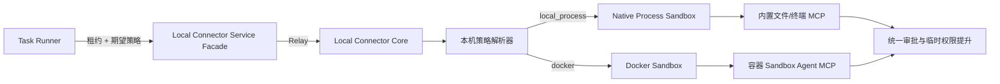

# Local Connector 本地进程沙箱、权限档位与审批机制实施方案

> 目标版本：2.0.6 起分阶段实施  
> 适用范围：Local Connector Client、Local Connector Service、Project Management Service、Task Runner、Sandbox Manager 及共享运行时组件  
> 文档日期：2026-07-14

## 0. 2026-07-15 当前实施状态

本轮已经落地“协议、策略传递、风险确认、UI 入口、Task Runner 路由与 effective policy 校验”的第一阶段，但尚未启用真正的 `local_process` 后端。

当前安全边界：

- `local_process` 只作为后端选项展示，readiness 为 `under_development`，`selectable=false`；任何 lease 或设置切换到该后端都会 fail closed，返回 `sandbox_backend_not_ready`。
- 兼容默认仍保持 `docker + workspace_write + on_request + user`，避免在未完成 OS 级隔离测试前把普通本机进程包装成“进程隔离”。
- Docker 后端只声明容器文件系统/进程边界，不再声明出站网络隔离；UI 和状态接口都明确显示 bridge 网络不提供 outbound network isolation。
- `full_access`、`approval_policy=never`、`approval_reviewer=auto_review` 都要求显式风险确认；“始终允许/记住允许”也要求显式风险确认。
- Docker sandbox 内的命令型 MCP 调用已接入统一 `CommandApprovalService`；AI 自动审批返回 `AskUser` 时转交用户，不再直接拒绝。
- Local Connector Core 创建 lease 时以本机 sandbox settings 作为最大权限上限；云端 pairing/task policy 只能收窄，不能把本机默认放宽为 `full_access`、`never` 或 `auto_review`，effective policy 的 revision 以本机为准。
- Local Connector Docker 后端的实际文件权限最多为 `workspace_write`：即使用户配置 `full_access`，Docker lease 也不会声称已获得主机 full access；请求或配置为 `read_only` 时 `/workspace` 以只读模式挂载。
- Cloud Sandbox Manager 不再声称支持未实现的审批或只读策略：其 effective policy 反映当前实际行为为 `docker + workspace_write + never + user`；如果任务显式要求 `read_only` 或 `on_request`，Task Runner 会因 effective policy 更宽而 fail closed。
- Task Runner 会把 task/pairing policy 传到 lease 请求，并在 lease 返回后校验 effective policy 不能比请求更宽；不满足则释放 lease 并失败。
- Local Connector Service 的 active sandbox pairing 只返回 online、enabled 且 readiness 为 `ready` 的记录；非 ready 本地 pairing 不参与任务路由。

仍未完成的部分：

- Linux/macOS/Windows 的真实 OS 原生进程隔离 launcher、readiness/setup、负向安全测试尚未实现。
- Project Environment 的 process-aware runtime 初始化、托管 runtime artifact、process app + service containers 混合拓扑尚未实现。
- 结构化的每条命令临时文件/网络权限提升还只是方案设计，尚未成为统一执行协议。
- Docker 默认出站网络仍受现有 MCP Agent bridge 约束，当前做法是“不声明网络隔离 + 限制危险 network mode”，不是完整 egress sandbox。

## 1. 目标

当前 Local Connector 的“本地沙箱”实际上只有 Docker 容器一种执行后端。本方案增加第二种执行后端：

- `local_process`：类似 Codex 的本机进程级隔离，新安装默认使用。
- `docker`：保留现有容器隔离，适合固定 Linux 环境、自定义镜像或服务容器。

同时把目前混在一起的概念拆为三个独立维度：

1. 执行后端：进程隔离还是 Docker。
2. 权限档位：只读、工作区可写、完全访问。
3. 审批方式：用户审批、AI 自动审查、从不询问。

推荐默认组合是：`local_process + workspace_write + on_request + user`。

用户也可以组合选择：

- 进程隔离 + 工作区可写 + AI 自动审查。
- 进程隔离 + 完全访问 + 用户按需审批。
- 进程隔离 + 完全访问 + 从不询问（最高风险，必须明确确认）。
- Docker + 容器工作区可写 + 用户按需审批。

## 2. Codex 对照结论与验证边界

### 2.1 本次实际核对到的行为

本次使用本机安装的官方 `codex-cli 0.130.0` 核对了以下行为：

- `codex sandbox macos` 使用 macOS Seatbelt。
- `codex sandbox linux` 使用 Linux sandbox，当前帮助信息说明默认使用 bubblewrap。
- `codex sandbox windows` 使用 Windows restricted token。
- Windows 实测命令身份为独立低权限账户 `CodexSandboxOffline`，并属于 `CodexSandboxUsers` 组，而不是直接以当前桌面用户运行。
- CLI 暴露三个传统沙箱档位：`read-only`、`workspace-write`、`danger-full-access`。
- CLI 暴露审批策略：`untrusted`、`on-failure`（已废弃）、`on-request`、`never`。
- `--dangerously-bypass-approvals-and-sandbox` 同时跳过审批和沙箱，并被明确标记为极度危险。

通过 `codex app-server generate-json-schema --experimental` 生成的官方协议 Schema，还能确认当前 Codex 正在从简单沙箱枚举演进到细粒度权限档案：

- `PermissionProfile.type`：`managed`、`disabled`、`external`。
- 文件系统权限：`restricted` 或 `unrestricted`。
- 文件项权限：`read`、`write`、`none`。
- 路径类型：绝对路径、glob、特殊路径。
- 网络权限与文件权限分开配置。
- 命令可以请求临时的附加文件系统或网络权限。
- 审批支持：仅本次通过、会话内通过、命令策略修订、网络策略修订、拒绝和取消。
- 审批审查者独立于审批策略：`user` 或 `auto_review`。
- Windows 沙箱存在 readiness 与 setup 流程，并区分 `elevated`、`unelevated` 初始化模式。

### 2.2 官方文档访问说明

本次按 OpenAI 官方文档流程尝试了 Codex manual、Developer Docs MCP、应用内浏览器和命令行访问。当前网络均被 `developers.openai.com` 返回 HTTP 403。Developer Docs MCP 已安装到本机 Codex 配置，但需要重启任务后才能加载。

因此本方案对 Codex 的具体断言只采用上述官方 CLI、官方生成 Schema 和本机沙箱实测结果，不对未能读取的网页内容作额外推断。

后续复核入口：

- <https://developers.openai.com/codex/security/>
- <https://developers.openai.com/codex/config-reference/>
- <https://developers.openai.com/codex/windows/>

### 2.3 借鉴原则

不把 Codex CLI 作为 ChatOS 的运行依赖，也不直接调用 `codex sandbox`。ChatOS 应实现同类安全边界：

- 每条命令由操作系统原生隔离器启动。
- 权限档案与审批策略分离。
- 权限提升必须精确、可审计、可撤销。
- 无法证明隔离有效时 fail closed，不静默退化为普通宿主机执行。

## 3. 当前项目现状与主要问题

### 3.1 已预留 `local_process`，但没有实现

`local_connector_service/backend/src/models.rs` 已定义：

- `SANDBOX_MODE_DOCKER = "docker"`
- `SANDBOX_MODE_LOCAL_PROCESS = "local_process"`

但实际链路仍全部使用 Docker：

- `local_connector_client/core/src/sandbox/pairing.rs` 固定上报 `sandbox_mode: "docker"`。
- `sandbox/lease/create.rs` 固定检查 Docker、选择镜像并启动容器。
- `sandbox/lease/status.rs` 固定检查 Docker 容器。
- `sandbox/lease/release.rs` 固定删除 Docker 容器。
- `sandbox/proxy.rs` 固定代理到容器内 HTTP Agent。
- `LOCAL_SANDBOX_BACKEND` 目前也是单一 Docker 语义。

结论：服务端字段只是预留，客户端没有 backend abstraction，不能通过简单增加一个下拉框完成。

### 3.2 Task Runner 租约协议缺少策略

`task_runner_service/backend/src/services/sandbox_runtime/manager_client.rs` 的租约请求当前只有 tenant/user/project/run、workspace、image、tools 和 TTL。

缺少：

- `sandbox_mode`；
- 权限档案；
- 网络策略；
- 附加可写目录；
- 审批策略和审查者；
- 策略版本；
- 资源限制。

Task Runner 还强制要求响应包含 `agent_endpoint`。进程后端如果由 Local Connector Core 内部直接提供 MCP，不应伪造容器 Agent 地址。

### 3.3 环境初始化与镜像强绑定

Project Management 的环境 Agent 当前无论执行后端是什么，都要求搜索或创建沙箱镜像：

- `environment_agent.rs` 的提示词固定要求镜像操作。
- `environment_agent/mcp_servers.rs` 固定要求 image search/create 工具。
- `ProjectRuntimeEnvironmentImageRecord` 只能表达镜像，不能表达宿主机运行时或托管工具链。
- Task Runner 只会从环境镜像选择 `image_id`。

进程隔离模式不应为了执行 Node、Rust、Java 项目而强制构建 Docker 镜像，而应使用宿主机已有或 Local Connector 托管安装的工具链。

### 3.4 当前“完全控制”不是“完全访问”

现有审批模式是 `request_approval`、`auto_approval`、`full_control`。其中 `full_control` 只是在 `CommandApprovalService` 中直接批准命令，并不改变文件系统、网络或进程权限，实际语义是“从不询问”。

还存在以下问题：

- 新状态默认值是 `FullControl`，安全默认值过宽。
- AI 返回 `AskUser` 时当前被当作拒绝，而不是转交用户。
- “始终允许”只有命令指纹，缺少权限范围和有效期。
- Docker Agent 内执行的终端命令经 `sandbox/proxy.rs` 直接转发，绕过本机 `CommandApprovalService`。
- 系统权限页面管理 TCC、ACL、桌面能力，不等于任务执行权限档案。

### 3.5 Docker 网络默认过宽

`LocalSandboxNetworkPolicy` 默认是 `bridge`，容器通常可以访问外网。推荐默认应是网络关闭或受限，外网访问按需提升。

## 4. 总体设计

### 4.1 三个正交配置轴

#### 执行后端 `SandboxBackend`

- `local_process`：默认，本机命令通过 OS 原生沙箱启动。
- `docker`：保留镜像构建和固定 Linux 用户态。
- `cloud_sandbox_manager` 继续是云端 provider，不与本机 backend 枚举混用。

#### 权限档案 `PermissionProfile`

- `read_only`
  - 工作区只读；
  - 禁止写入；
  - 默认禁用网络。
- `workspace_write`（推荐默认）
  - 系统、用户目录和工具链只读；
  - 当前 run workspace 可写；
  - 项目临时目录和缓存可写；
  - 默认禁用公网网络；
  - 额外目录必须显式授权。
- `full_access`
  - process 下不施加外层文件系统/网络沙箱，以当前 Local Connector 用户权限运行；
  - Docker 下仍保留容器边界；
  - 必须显示高风险确认和实际边界。

#### 审批配置

- `approval_policy`
  - `on_request`：允许命令或工具请求审批。
  - `never`：不弹审批；权限不足直接失败。
- `approval_reviewer`
  - `user`：用户审批。
  - `auto_review`：本机 AI 先审查，不确定时转用户。

持久化层必须保存两个独立字段，不能继续用一个 `ApprovalMode` 同时表达策略与审查者。

### 4.2 策略优先级

有效权限按以下顺序求交集，任何上游都不能扩大下游限制：

```text
管理员/受管策略
  ∩ 设备实际能力
  ∩ 用户全局最大权限
  ∩ 工作区/项目权限
  ∩ Task 配置（只能收紧）
  ∩ 当前命令临时授权
```

Task Runner 和云端服务只提交“期望策略”。Local Connector Core 是本机最终策略裁决者，不能信任云端请求直接开启 `full_access`。

### 4.3 目标调用链



### 4.4 后端抽象

在 Local Connector Core 增加统一 trait，替代 create/status/release/proxy 中的 Docker 硬编码：

```rust
trait LocalSandboxBackend {
    async fn readiness(&self) -> SandboxBackendReadiness;
    async fn create_lease(&self, input: EffectiveLeaseRequest) -> Result<BackendLease>;
    async fn health(&self, lease: &LocalSandboxLease) -> Result<SandboxHealth>;
    async fn call_mcp(&self, lease: &LocalSandboxLease, request: Value) -> Result<Value>;
    async fn release(&self, lease: &LocalSandboxLease) -> Result<()>;
}
```

建议目录：

```text
local_connector_client/core/src/sandbox/
  backend.rs
  backends/docker.rs
  backends/process.rs
  backends/process/linux.rs
  backends/process/macos.rs
  backends/process/windows.rs
  backends/process/launcher.rs
  backends/process/readiness.rs
  backends/process/sessions.rs
```

## 5. 各操作系统的进程隔离方案

### 5.1 Linux

推荐与当前 Codex CLI 对齐，使用 bubblewrap：

- 检查 `bwrap`、user namespace、mount namespace、network namespace。
- 根文件系统只读绑定。
- run workspace 和批准的附加目录可写绑定。
- `/tmp` 使用独立 tmpfs。
- 为项目准备独立 HOME、XDG cache/config/state。
- 默认通过独立 network namespace 禁用网络。
- 需要网络时仅在有效权限档案中开启。
- 使用 `--die-with-parent` 和独立 process group 回收进程树。
- 启动前后校验符号链接和 bind mount 目标，防止 TOCTOU。
- 资源限制通过 `setrlimit`，可用时叠加 cgroups v2 user scope。

不得在 bubblewrap 不可用时静默使用普通进程。可选动作只有修复 bubblewrap、切换 Docker，或由用户明确选择 `full_access`。

### 5.2 macOS

使用 Seatbelt profile：

- 基础策略 `deny default`。
- 允许必要的进程、系统库、工具链只读路径。
- `workspace_write` 仅允许写 run workspace、项目临时目录和批准的缓存。
- 默认拒绝网络，开启时增加精确 outbound 权限。
- Unix socket 单独列允许路径。
- debug 模式记录 Seatbelt denial，生产只保留去敏摘要。
- 使用 process group 和 rlimit 管理子进程。

需要验证 Electron hardened runtime、签名、notarization 与 `sandbox-exec` 子进程兼容性。Local Connector 主程序不启用 macOS App Sandbox；Seatbelt 只应用于任务命令子进程。

### 5.3 Windows

Windows 不能只靠普通 `CreateRestrictedToken` 就宣称“仅工作区可写”，因为当前用户 ACL 仍可能允许读取其他用户文件。建议采用 Codex 实测形态的“初始化 + 独立低权限身份”方案。

#### 一次性初始化

- 提供 readiness 页面。
- 默认先尝试 unelevated 检查。
- 需要创建账户/组、写 ACL 或防火墙规则时，通过签名的一次性 helper 触发 UAC。
- Core 和 Electron 平时始终非管理员运行。
- 创建专用组 `ChatOSSandboxUsers`。
- 创建专用账户 `ChatOSSandboxOffline`。
- 凭据使用 DPAPI 保护，不写普通 JSON。

#### 每次运行

- 为 run workspace 和托管 runtime 目录授予专用组 ACL。
- 使用专用账户 token，并移除不需要的 SID/privilege。
- 使用 `CreateProcessAsUserW` 启动命令。
- 使用 Job Object 设置 `KILL_ON_JOB_CLOSE`、进程数、内存和可实现的 CPU 限制。
- 拒绝 junction、reparse point、UNC 和设备路径逃逸。
- 网络关闭必须由可验证的 Windows Firewall/WFP 规则实现。
- 如果不能证明网络被阻止，readiness 报告 `network_isolation_unavailable`，不能显示为安全隔离。
- 释放租约时关闭 Job、回收进程并清理 ACL。

Windows 第一阶段可以提供“文件系统隔离 + Job Object”预览，但只有网络隔离测试通过后，才能作为 `workspace_write + network disabled` 的正式默认。

### 5.4 Readiness

新增统一能力响应：

```json
{
  "backend": "local_process",
  "status": "ready | setup_required | unsupported | degraded",
  "filesystem_isolation": true,
  "network_isolation": true,
  "process_tree_control": true,
  "resource_limits": {
    "cpu": true,
    "memory": true,
    "process_count": true,
    "disk": false
  },
  "setup_mode": "none | unelevated | elevated",
  "details": []
}
```

只有满足所选权限档案需要的能力，才允许把 process 保存为默认后端。

## 6. 本机进程 MCP 实现

### 6.1 推荐：Core 内部进程后端

进程后端直接在 Local Connector Core 内构建每个租约的 MCP service：

- 文件工具复用 `CodeMaintainerService`，根目录指向 run workspace。
- 终端工具复用 `TerminalControllerService` 的协议和输出结构。
- 新增 `ProcessSandboxTerminalControllerStore`，每次命令都通过 OS launcher 启动。
- 后台 session、stdin、poll、wait、kill 保存 sandbox id 和有效权限档案。
- `proxy_local_sandbox_mcp` 按 backend 分发：process 直接调用内存 MCP；Docker 继续 HTTP 转发。

这样无需给 Electron 包额外打包 `chatos_sandbox_mcp_server`，也避免其终端实现目前只支持 `/bin/bash` 的问题。

### 6.2 抽取共享终端运行时

建议把 Local Connector 与 `sandbox_mcp_server` 重复的 session 管理抽到：

```text
crates/chatos_terminal_runtime/
  session.rs
  logs.rs
  process.rs
  launcher.rs
```

launcher 作为 trait 注入：Docker Agent 使用普通容器 launcher；local process 使用 native launcher；非沙箱本地终端使用普通 launcher，但继续走审批。

## 7. 权限档案与提升流程

### 7.1 共享协议

新增 `crates/chatos_sandbox_contract`，统一 Task Runner、Local Connector 和 Sandbox Manager 重复定义的 DTO：

```rust
enum SandboxBackendKind { LocalProcess, Docker }
enum PermissionProfileId { ReadOnly, WorkspaceWrite, FullAccess }
enum ApprovalPolicy { OnRequest, Never }
enum ApprovalReviewer { User, AutoReview }
```

租约请求增加可选字段，保持旧服务兼容：

```json
{
  "sandbox_mode": "local_process",
  "permission_profile_id": "workspace_write",
  "network": {
    "egress": "disabled",
    "allow_loopback": false,
    "allowed_hosts": []
  },
  "additional_writable_roots": [],
  "approval_policy": "on_request",
  "approval_reviewer": "user",
  "policy_revision": "...",
  "resource_limits": {}
}
```

响应必须返回实际生效值，而不是只回显请求。

### 7.2 每条命令临时提升

命令需要超出当前档案的权限时，返回结构化请求，而不是改用普通宿主机重试：

```json
{
  "kind": "permission_required",
  "command": "...",
  "reason": "需要写入项目外的生成目录",
  "requested_permissions": {
    "filesystem": [{ "path": "...", "access": "write" }],
    "network": { "enabled": true, "hosts": ["registry.npmjs.org"] }
  }
}
```

审批页支持：

- 仅本次允许；
- 本次任务/会话允许；
- 当前项目始终允许精确规则；
- 拒绝；
- 拒绝并取消 run。

批准后使用“基础档案 + 临时 overlay”重新启动命令。不能在已受限的长驻子进程内直接放宽权限。

### 7.3 自动审批

- `Approved`：按精确请求启动。
- `Denied`：返回拒绝。
- `AskUser`：进入用户队列，不能再映射为拒绝。
- AI 不可用时 fail closed，并按 policy 转用户或拒绝。
- AI 只能判断已声明的权限，不能自行扩展路径或网络范围。
- 审批模型、理由、overlay 和最终结果全部写审计。

### 7.4 完全访问

`full_access` 与 `never` 必须独立：

- `full_access + on_request`：拥有当前用户权限，但仍可询问高风险命令。
- `workspace_write + never`：不询问，越权直接失败。
- `full_access + never`：最危险组合，UI 二次确认。

不提供由模型触发的通用 sudo/UAC。需要管理员权限的动作只能进入受控产品流程，例如 Windows sandbox setup helper。

## 8. Local Connector 状态与 UI

### 8.1 状态模型

扩展 `LocalSandboxState`：

```rust
struct LocalSandboxState {
    enabled: bool,
    default_backend: SandboxBackendKind,
    default_permission_profile_id: String,
    default_approval_policy: ApprovalPolicy,
    default_approval_reviewer: ApprovalReviewer,
    default_network_policy: SandboxNetworkPolicy,
    workspace_policies: Vec<WorkspaceSandboxPolicy>,
    selected_image_ref: Option<String>,
    images: Vec<LocalSandboxImageRecord>,
}
```

镜像字段继续属于 Docker 子配置，process 后端不伪造镜像。

### 8.2 本地沙箱页面

顶部增加“执行方式”：

- 本机进程隔离（推荐）
- Docker 容器

进程隔离页面展示：

- 当前 OS 隔离器；
- readiness；
- 文件系统、网络、进程树控制状态；
- Windows 初始化按钮；
- 宿主机/托管运行时；
- 默认权限和网络策略。

Docker 页面继续展示 Docker、镜像、重建、删除、容器网络和资源限制。

### 8.3 审批页面

把现有三个模式按钮拆为：

- 审批策略：按需审批 / 从不询问。
- 审批人：用户 / AI 自动审查。
- 快捷预设：安全模式 / 自动审查 / 无提示执行。

把 `full_control` 文案迁移为“从不询问”，避免与 `full_access` 混淆。

待审批项增加 backend、基础档案、附加路径、网络主机、命令来源、风险和授权范围。

### 8.4 系统权限页面

继续管理 macOS TCC、Windows ACL/UAC、辅助功能和屏幕录制，但明确说明：

- 系统权限决定 Local Connector 是否具备 OS 能力。
- 沙箱权限档位决定任务是否允许使用该能力。
- 审批决定越权请求由谁、何时批准。

## 9. Project Management 环境初始化

### 9.1 环境模型

在 `ProjectRuntimeEnvironmentRecord` 增加：

- `sandbox_mode`；
- `permission_profile_id`；
- `network_policy`；
- `approval_policy`；
- `approval_reviewer`；
- `policy_revision`；
- `runtime_strategy`：`host_existing | managed_runtime | container_image`。

建议把 ImageRecord 演进为通用 artifact，或增加并行表：

```rust
enum RuntimeArtifactKind {
    HostRuntime,
    ManagedRuntime,
    ContainerImage,
    ServiceContainer,
}
```

兼容期继续返回 `images`，但 process runtime 不得塞入伪造 `image_id`。

### 9.2 后端感知初始化

#### `local_process`

1. 读取 process readiness。
2. 检测宿主机 Java、Node、Python、Rust、Go 等运行时。
3. 优先复用已有版本。
4. 缺失时通过声明式 provisioner 安装到 Local Connector 托管目录。
5. 安装属于控制面操作，必须审批；不得执行模型生成的任意 root shell。
6. sandbox 对托管 runtime 只读，对项目 cache 可写。
7. 应用记录为 host/managed runtime，不创建应用镜像。
8. Redis、MySQL、Nacos 等依赖服务可继续使用 Docker sidecar，形成“应用进程 + 服务容器”混合拓扑。
9. Docker 不可用且项目需要服务容器时进入 `pending_configuration` 或选择云端，不把应用错误标记为不可运行。

#### `docker`

- 保留 image search/create。
- 自定义脚本只在镜像构建上下文执行。
- 任务容器默认网络改为 `none` 或受限网络。
- 项目服务使用专属内部网络，不默认开放公网 egress。

### 9.3 环境 Agent 工具

新增 backend-aware MCP：

- `sandbox_environments_get_capabilities`
- `sandbox_environments_resolve_runtime`
- `sandbox_environments_install_managed_runtime`
- `sandbox_environments_list_service_backends`

保留 Docker 专用 image search/create。`ensure_agent_required_tools_available` 和 Agent 提示词必须按 backend 分支，process 模式不再要求创建镜像。

### 9.4 重新初始化

重新初始化应：

- 重新检测技术栈和 readiness；
- 重新解析宿主机/托管 runtime；
- Docker 模式重新校验镜像；
- 不自动删除托管 runtime；
- 不自动扩大权限；
- backend 切换时废弃旧 backend artifact，但保留审计。

## 10. Task Runner 改造

### 10.1 Task 配置

在 `TaskMcpConfig` 增加可选的收紧型覆盖：

```rust
sandbox_mode: Option<SandboxBackendKind>,
permission_profile_id: Option<String>,
approval_policy: Option<ApprovalPolicy>,
approval_reviewer: Option<ApprovalReviewer>,
network_policy: Option<SandboxNetworkPolicy>,
additional_writable_roots: Vec<String>,
```

Task override 默认只能收紧项目策略。例如项目是 `workspace_write`，任务可改为 `read_only`，不能直接改为 `full_access`。

### 10.2 路由与租约

`SandboxTaskRoute` 增加 mode、permission profile、approval、network、policy revision、process runtime artifact 和 Docker image id。

`LocalConnectorSandboxPairing` 当前没有反序列化 `sandbox_mode`，需要补齐，并把 readiness 纳入路由判断。

租约响应返回 effective policy 后，Task Runner 必须：

- 保存 effective backend/profile；
- 记录 `sandbox_policy_resolved` event；
- 实际策略比任务要求更宽时拒绝运行；
- 实际策略更窄时允许运行并记录原因；
- 不把本机秘密写入 run snapshot。

### 10.3 Runtime Context

`SandboxRuntimeContext.agent_endpoint` 改为可选。Task Runner 工具调用始终走 manager facade 的 `mcp_url`，不直接连接本机 process service。

### 10.4 生命周期

两种后端统一保留：workspace snapshot、baseline、health、运行、change manifest、释放和清理。

严禁：

- process 失败后自动普通执行；
- Docker 不可用后自动 full access；
- 审批超时后自动批准。

## 11. Local Connector Service 改造

扩展 sandbox pairing：

- `sandbox_mode`；
- `permission_profile_id`；
- `approval_policy`；
- `approval_reviewer`；
- `readiness_status`；
- `capability_summary`；
- `policy_revision`。

Service 只保存路由和非秘密策略摘要，不保存 AI 审批模型 API key、Windows sandbox 账户凭据或本机 ACL 细节。

Facade 继续只做鉴权和 Relay，不能自行扩大或改写权限请求。

兼容策略：

- 老客户端只上报 `docker` 时继续工作。
- 新客户端缺省为 `local_process`。
- Service 对未知新字段保持向前兼容。
- Task Runner 只有在 pairing 明确 `ready` 时才选择 process backend。

## 12. API 建议

Local Connector Core 新增或扩展：

- `GET /api/local/sandbox/capabilities`
- `GET /api/local/sandbox/settings`
- `PUT /api/local/sandbox/settings`
- `GET /api/local/sandbox/process/readiness`
- `POST /api/local/sandbox/process/setup`
- `POST /api/local/sandbox/process/setup/repair`
- `POST /api/local/sandbox/permission-requests/{id}/approve`
- `POST /api/local/sandbox/permission-requests/{id}/deny`

现有审批 API 可以兼容扩展，但内部模型应从 `CommandApprovalRequest` 升级为通用 `ExecutionApprovalRequest`，支持 command、filesystem、network、skill 和 MCP 请求类型。

## 13. 数据迁移

### 13.1 新安装

默认值：

- `sandbox_mode = local_process`
- `permission_profile_id = workspace_write`
- `approval_policy = on_request`
- `approval_reviewer = user`
- 公网网络关闭

### 13.2 已有安装

- 已明确选择 Docker 的 pairing 保持 Docker，避免升级后改变环境。
- 缺少 mode 的旧记录只有在 process readiness 为 `ready` 时迁移到 process，否则保留 Docker 并提示。
- `request_approval` → `on_request + user`。
- `auto_approval` → `on_request + auto_review`。
- `full_control` → `never + user`，但不自动授予 `full_access`。
- 旧 `full_control` 用户首次打开新版时展示一次安全说明。
- 旧镜像记录保留，仅在 Docker 页面显示。

## 14. 审计与安全日志

新增事件：

- `sandbox_policy_resolved`
- `sandbox_backend_setup_required`
- `sandbox_permission_requested`
- `sandbox_permission_granted`
- `sandbox_permission_denied`
- `sandbox_permission_rule_created`
- `sandbox_process_started`
- `sandbox_process_exited`
- `sandbox_process_tree_killed`

日志包含：backend、effective profile、命令指纹、请求与批准权限差异、reviewer、scope、project/run/session、结果与原因。

日志不得包含：API key、access token、Windows sandbox 密码、未脱敏环境变量和命令输出中的疑似密钥全文。

## 15. 分阶段实施

### 阶段 A：共享协议和策略模型

- 新建 `chatos_sandbox_contract`。
- 拆分 backend、permission profile、approval policy、reviewer。
- 新字段全部可选，保持协议兼容。
- 修正新安装审批默认值。
- 修复 `AutoApprovalDecision::AskUser`。

验收：旧 Docker 客户端、旧 Task Runner 和云端 Sandbox Manager 回归通过。

### 阶段 B：Local Connector 后端抽象

- 提取 `LocalSandboxBackend`。
- Docker 逻辑迁移到 `DockerSandboxBackend`，行为保持不变。
- lease/status/proxy/release 不再引用 Docker 具体函数。
- Runtime Context 支持无 `agent_endpoint`。

验收：现有 Docker 本地沙箱全链路无回归。

### 阶段 C：Linux 与 macOS process backend

- 实现 bubblewrap launcher。
- 实现 Seatbelt launcher。
- 实现进程 session、process group、临时目录和权限档案。
- 实现内置 process MCP service。
- 实现 readiness 和负向安全测试。

验收：read-only/workspace-write/full-access、网络开关和进程树释放全部通过。

### 阶段 D：Windows process backend

- 实现 readiness/setup API。
- 实现签名 elevated helper。
- 创建专用账户/组与 ACL。
- 实现 restricted token、CreateProcessAsUser 和 Job Object。
- 实现并验证网络隔离。

验收：独立身份、目录逃逸、junction、网络和后台子进程测试全部通过。

### 阶段 E：环境初始化改造

- 项目环境模型加入 backend/profile/runtime artifacts。
- 新增 runtime capability/provisioner MCP。
- 环境 Agent 根据 backend 选择 process 或 image 流程。
- 支持 process app + Docker services 混合拓扑。
- 项目 UI 增加执行方式和权限设置。

验收：process 模式初始化 Node/Rust/Java 项目时不创建应用 Docker 镜像。

### 阶段 F：Task Runner 全链路

- Task 配置和租约请求加入策略。
- pairing 路由读取 mode/readiness。
- run snapshot/events 记录 effective policy。
- 权限请求和审批等待接入工具执行。
- output manifest 与释放流程覆盖 process backend。

验收：同一任务可选择 process 或 Docker，并产生一致的文件变更结果。

### 阶段 G：UI、迁移与灰度

- Local Sandbox 页面增加 backend selector。
- Approval 页面拆分策略和审查者。
- 增加 Windows 初始化体验。
- 增加旧状态迁移提示。
- 加入 feature flag、能力遥测和故障率观测。

## 16. 主要文件改造清单

### 16.1 Local Connector Client Core

- `core/src/sandbox/types.rs`
  - backend、permission profile、effective policy、process lease 状态。
- `core/src/sandbox/lease/create.rs`
  - 从 Docker 固定流程改为 backend dispatch。
- `core/src/sandbox/lease/status.rs`
  - backend-specific health。
- `core/src/sandbox/lease/release.rs`
  - 容器或进程树释放。
- `core/src/sandbox/proxy.rs`
  - process 内存 MCP 与 Docker HTTP MCP 双分支。
- `core/src/sandbox/pairing.rs`
  - 上报 mode、readiness、policy revision。
- `core/src/approval/types.rs`
  - 拆分 policy/reviewer，增加权限 overlay 和 scope。
- `core/src/approval/service.rs`
  - AskUser 转人工、会话缓存、结构化规则。
- `core/src/system_permissions.rs`
  - 增加 process backend readiness 和 Windows setup 状态，不混入任务权限策略。
- `core/src/api/handlers/sandbox.rs`
  - settings、capabilities、setup API。

### 16.2 Local Connector Frontend/Packaging

- `frontend/src/components/SandboxPanel.tsx`
  - backend selector、readiness、process runtime、Docker 条件区域。
- `frontend/src/components/ApprovalPanel.tsx`
  - 策略与 reviewer 分离、权限详情和授权范围。
- `frontend/src/components/RuntimeSettingsPanel.tsx`
  - Windows setup 与系统能力说明。
- `package-electron-windows-client.ps1`
  - 打包签名 Windows helper。
- `package-electron-macos-client.sh`
  - Seatbelt profile/launcher 资源和签名验证。
- 新增 Linux 打包链路；当前仓库有 Linux bundled tools，但没有完整 Local Connector Linux Electron 发布脚本。

### 16.3 Local Connector Service

- `backend/src/models.rs`
  - pairing 扩展字段和迁移默认值。
- `backend/src/api/sandbox_pairings.rs`
  - 更新请求、查询和验证。
- `backend/src/store/mongo.rs`
  - 新字段持久化和索引。
- facade Relay 保持透明，不执行权限裁决。

### 16.4 Project Management

- `backend/src/models/runtime_environment.rs`
  - backend/profile/runtime artifact。
- `backend/src/services/environment_agent.rs`
  - backend-aware prompt。
- `backend/src/services/environment_agent/routing.rs`
  - 读取 pairing mode/readiness。
- `backend/src/services/environment_agent/mcp_servers.rs`
  - process runtime MCP 与 Docker image MCP 条件装配。
- `backend/src/services/environment_agent/tool_provider.rs`
  - 保存通用 artifacts。
- `frontend/src/pages/projectDetail/RuntimeEnvironmentPanel.tsx`
  - backend、权限、运行时和服务容器展示。

### 16.5 Task Runner

- `backend/src/models/task/config.rs`
  - 可选收紧型策略覆盖。
- `backend/src/services/sandbox_runtime/manager_client.rs`
  - 使用共享 contract。
- `backend/src/services/sandbox_runtime/routing.rs`
  - pairing mode/readiness 和 backend-aware artifact。
- `backend/src/services/sandbox_runtime/run_service_policy.rs`
  - 解析 effective policy、事件和 fail-closed。
- `backend/src/services/sandbox_runtime.rs`
  - optional agent endpoint、effective policy metadata。
- Task 编辑/详情前端展示任务覆盖与最终生效策略。

## 17. 测试矩阵

### 17.1 通用安全测试

- 工作区内读写成功。
- 工作区外写入失败。
- read-only 下工作区写入失败。
- symlink、junction、reparse point 逃逸失败。
- `..`、绝对路径、UNC、设备路径逃逸失败。
- 默认网络请求失败。
- 临时网络授权只允许目标 host/scope。
- 租约释放后所有前台和后台子进程退出。
- 进程不能读取 Local Connector state、token、日志和浏览器 profile。
- 临时权限不跨 run 泄漏。

### 17.2 Linux

- bwrap readiness。
- user namespace 不可用时 fail closed。
- root read-only、workspace rw、tmpfs。
- network namespace。
- cgroup/rlimit capability 报告正确。

### 17.3 macOS

- Seatbelt profile 正确生成。
- 受保护目录访问拒绝。
- workspace write 与 Unix socket allowlist。
- network deny/allow。
- hardened runtime、签名和 notarization 包内测试。

### 17.4 Windows

- readiness：ready/not configured/update required。
- 命令身份不是当前桌面用户。
- workspace ACL 正确，其他用户目录受限。
- restricted token privilege 正确。
- Job Object 能终止孙进程。
- junction/UNC/device path 被拒绝。
- 防火墙网络隔离可验证。
- helper 只在 setup/repair 时请求 UAC。

### 17.5 审批

- 用户仅本次批准。
- 会话内批准缓存。
- 项目规则持久化。
- AI approve/deny/ask-user。
- `never` 下越权直接失败。
- `full_access` 与 `never` 独立组合。
- Docker Agent 命令同样进入审批和审计。

### 17.6 环境初始化与 Task Runner

- process 项目复用宿主机 runtime。
- managed runtime 安装需要审批。
- Docker 项目继续创建镜像。
- process + service containers 混合模式。
- Task Runner 不能扩大项目权限。
- Local Connector 返回更窄权限时正确记录。
- process backend 不要求 `agent_endpoint`。
- 两种 backend 输出 manifest 一致。

## 18. 发布门槛

`local_process` 成为新安装默认值前必须满足：

1. 目标 OS 的 filesystem isolation 自动化测试全部通过。
2. 默认网络关闭可以被自动化测试证明。
3. 完整进程树可以可靠回收。
4. readiness 失败不会退化为普通执行。
5. Task Runner、Project Environment 与 Local Connector 策略快照一致。
6. `full_access` 和 `never` 有独立明确的风险提示。
7. Docker 回归全部通过。

若某个平台尚未达到门槛：

- UI 显示 process 为“预览/需要初始化”；
- 不允许默认选择；
- 保持 Docker 为该平台安全默认；
- 不得用“进程隔离”包装普通宿主机执行。

## 19. 建议优先级

P0：

- 拆分权限档位和审批策略。
- 将新安装审批默认从 `FullControl` 改为安全默认。
- 修复 Docker Agent 命令绕过审批。
- 建立共享租约 contract 和 backend abstraction。

P1：

- Linux/macOS process backend。
- Task Runner effective policy 传递。
- Project Environment backend-aware 初始化。

P2：

- Windows 专用账户、ACL、Job Object 和网络隔离。
- 结构化临时权限提升和持久规则。
- process app + service containers 混合拓扑。

P3：

- 域名级网络策略。
- 用户自定义 permission profiles。
- 管理员下发受管策略。
- 更细粒度的 syscall、设备和 IPC 限制。

## 20. 最终验收场景

### 场景一：默认本地项目

- 默认显示“本机进程隔离 / 工作区可写 / 按需用户审批”。
- 环境初始化检测宿主机 Node，不创建应用镜像。
- Task Runner 申请 process lease。
- 命令可修改 run workspace，但不能修改用户 Documents 或 Connector state。
- 运行结束生成变更清单并回收所有子进程。

### 场景二：需要外网安装依赖

- 默认网络关闭，`npm install` 返回结构化网络权限请求。
- 用户仅允许本次访问 npm registry。
- 命令使用临时 overlay 重启。
- 下一个 run 不继承权限。

### 场景三：自动审批

- 用户选择 AI 自动审查。
- 低风险、精确范围请求由 AI 批准。
- 高风险或信息不足进入用户待审批，不直接拒绝，也不扩大权限。

### 场景四：Docker 项目

- 环境初始化创建运行时镜像。
- Task Runner 申请 Docker lease。
- 容器命令仍进入统一审批和审计。
- 容器默认无公网网络，项目服务走专属内部网络。

### 场景五：完全访问

- 用户选择 process + full access。
- UI 提示命令将拥有当前 Local Connector 用户可用的文件和网络权限。
- 用户仍可保留按需审批，或另行选择从不询问。
- 选择 full access 不会自动把审批切换为 never。
