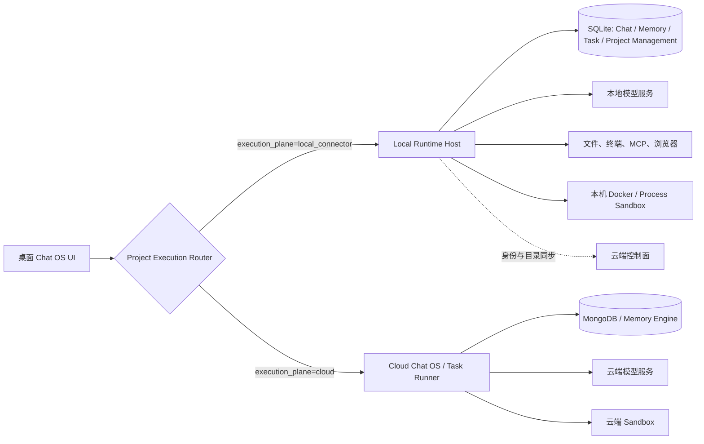

# 本地项目客户端编排与 SQLite 落地实施方案

## 1. 文档目的

本文档用于指导 Chat OS 将 Local Connector Project 的流程编排、模型调用、工具执行和运行状态从云端下沉到客户端，并使用 SQLite 作为本地业务数据库。

改造完成后形成两套明确隔离的执行平面：

- **Local Connector Project**：由 `local_connector_client` 在用户机器上完成编排、模型调用、工具调用、任务运行、项目管理、上下文处理和状态持久化。
- **Cloud Project**：继续由云端 Chat OS、Task Runner、Memory Engine、Project Management Service 和云端 Sandbox 完整处理。

本方案不迁移历史数据。切换到本地执行平面后，本地项目直接创建新的本地 Session、Message、Turn 和 Run；已有云端会话不导入 SQLite，也不进行云端与本地双写。

---

## 当前实施进度（2026-07-15）

已完成第一阶段可运行闭环：

- 项目增加 `execution_plane`，`cloud` 走云端，`local/local_connector` 走客户端。
- Chat OS 浏览器入口只返回和展示 Cloud Project，并隐藏全部项目创建入口；只有带本地 Runtime Bridge 的桌面客户端可以查看 Local Project，以及创建 Local Project 或 Cloud Project。
- Chat OS 浏览器纯云端入口不展示左侧“终端”和“远端连接”资源区，也不加载对应列表或订阅实时事件；这两个区块只在带本地 Runtime Bridge 的桌面客户端中启用。
- 项目类型缺失时统一按 Cloud Project 处理，不再使用“默认本地”或“优先本地”的兼容判断；只有显式 `execution_plane=local_connector`、本地 `source_type` 或有效 `local://connector/` 根路径才进入本地执行平面。
- 桌面客户端访问云端 API 时携带客户端 Surface 标识；云端项目创建和 Local Connector 项目管理接口会校验该标识，普通浏览器请求不能创建项目或访问 Local Connector 管理接口。
- 客户端建立 SQLite、migration、Local Project、Session、Runtime Settings、Turn、Message 表和拆分后的存储模块。
- SQLite 中所有“先读后写”的短事务统一使用 `BEGIN IMMEDIATE` 获取写锁，避免模型工具消息与后台 Runtime Event 并发时发生 `SQLITE_BUSY_SNAPSHOT` 或 message sequence 竞争；并发消息/事件写入已有专项回归测试。
- Chat OS 前端对本地项目/会话使用受限 Electron IPC，只允许访问 `/api/local/runtime/*`。
- 本地会话创建、列表、设置、历史消息和普通文本 Chat 已切换到客户端。
- 本地 Chat 使用客户端保存的模型配置和 `chatos_ai_runtime` 直接请求模型，Turn 与消息在 SQLite 原子落库，并支持幂等重放。
- 本地 Chat 已接入客户端内置 Code Maintainer、Terminal Controller、Browser Tools 和已启用的本地 stdio/loopback HTTP MCP；工具执行继续复用现有工作区边界、命令审批和命令历史实现。
- AI Runtime 的 assistant 工具调用消息、tool 结果及结构化结果已按顺序写入 SQLite，最终 assistant 消息仍由 Turn 完成事务统一写入，避免重复落库。
- 新增本地会话工具目录接口，Chat OS 前端不再为本地会话请求云端 `/agent/tools`，并可直接展示本轮工具调用过程。
- 本地 Turn 已增加客户端运行注册表和独立取消令牌；停止操作可中断正在等待的模型 HTTP 请求，并将 SQLite Turn 状态更新为 `cancelled`，不会调用云端停止接口。
- 本地运行中的文本 Guidance 已接入：引导消息先写入 SQLite，再由 AI Runtime 生命周期钩子在下一次模型迭代应用；若首轮已经产生最终回复但同时收到 Guidance，会继续一轮生成修正后的最终回复。
- 本地增量事件已接入 SQLite：模型正文分片、思考、工具开始/结果/结束、阶段变化和 Turn 终态按 `event_seq` 串行持久化，并提供按 Turn、`after` 游标增量查询接口。
- Chat OS 前端在本地 Turn 运行期间轮询本地事件接口，实时更新思考/工具阶段和正文预览；Turn 完成后仍以 SQLite 持久化消息为最终结果，不依赖事件流拼装最终历史。
- 客户端已增加本地 Memory Runtime：`memory_summaries` 通过独立 migration 落 SQLite，支持摘要列表、删除、清空、复盘状态和手动生成累计摘要。
- 本地“复盘”直接使用客户端保存的模型配置生成摘要，不请求云端 Memory Engine；Chat 后续上下文改为“最新累计摘要 + 摘要之后的本地消息”，避免摘要仅用于 UI 而不参与模型上下文。
- 本地累计摘要已增加后台阈值触发：待摘要记录达到 24 条或正文达到约 32,000 字符时，Turn 完成后自动启动客户端摘要任务；运行中的未完成 Turn 不进入摘要范围。
- 自动摘要策略已进入每个本地 Session 的 Runtime Settings：可单独关闭，并可配置消息记录阈值与字符阈值；设置通过 SQLite migration 持久化，异常输入会在客户端 API 边界限制到安全范围。
- 本地 Session 的记忆视图已增加自动摘要策略控件；云端 Session 不展示这些本地设置，也不会写入本地策略字段。
- Chat OS 对本地摘要任务使用本地状态轮询，任务完成后刷新 SQLite 摘要缓存，不依赖云端 Realtime 事件。
- 本地摘要完成后会派生 SQLite `subject_memories`：至少写入项目级 Recall，Session 绑定 Agent 时同时写入 Agent 级 Recall；同一来源摘要优先使用 Agent Recall，避免重复注入。
- 新建或后续本地 Session 会召回同项目、同 Agent 的其他 Session 记忆，并作为本地 system context 参与模型请求；当前 Session 自身摘要会被排除，防止重复上下文。
- 本地记忆视图已增加跨 Session Recall 读取和项目/Agent 来源标识，`lc_session_*` 只请求本地 Recall API。
- 每个本地 Session 的 Runtime Settings 已增加 Recall 上限，默认 8、允许 2～50；Chat 模型上下文和本地 Recall API 都按该设置截断，不再使用前端硬编码数量。
- 项目级或 Agent 级 Recall 超过上限后，客户端会使用当前本地模型把较老 Recall 合并为层级 Rollup；SQLite 事务只保留累计 Rollup 和近期原始 Recall，后续超限时继续在旧 Rollup 上累计压缩。
- Recall Rollup 的读取、模型生成、删除旧记录和写入新记录全部发生在客户端与本地 SQLite；失败只记录脱敏客户端日志，不会回退或请求云端 Memory Engine，也不会让已经成功的摘要任务回滚为失败。
- 本地记忆视图已支持手工“忘记”Recall：普通 Recall 会同时删除同一来源的 Project/Agent 重复记录，并写入不含正文的 SQLite forget marker，防止后续累计摘要把同一 Session Recall 自动生成回来；Rollup 可独立删除。
- 已重新审计项目管理边界：审计时客户端只有 `local_projects` 索引，原方案中“本地 Agent 调远端 Project Management MCP”的设计不满足本地项目要求，现已改为完整 SQLite 本地化目标。
- 本地项目管理 SQLite 数据面已完成基础读写闭环：新增 Project Profile、Requirement、Document、Work Item 和两类依赖表，并拆分 Project Management 模型、Repository、Dependency Graph、API 与 MCP Provider 模块。
- Local Runtime 已支持 Project Plan、Requirement/Work Item 列表与创建、更新和归档、Document 列表与版本化 Upsert、Requirement/Work Item 依赖替换；依赖写入会校验同项目归属并拒绝循环依赖。
- Chat OS 现有 Project Plan Pane、Requirement Work Items 和 Documents 会通过 `projectUsesLocalRuntime(projectId)` 读取客户端 API；Local Project 只读写 SQLite，Cloud Project 仍走原云端接口。
- 本地 Plan Mode 已接入进程内 Project Management Provider，直接复用 `chatos_mcp::project_management_contract` 的 16 个工具合同访问 SQLite；Plan Mode 只暴露 Project Management 工具，不加载用户配置的远端 MCP，也不会请求远端 Project Management Service `/mcp`。
- Project Management Provider 的访问范围固定为 `owner_user_id + project_id`；已增加从 MCP 创建/更新 Requirement、设置依赖、写 Document、创建 Work Item、读取 Dependency Graph 并核对 SQLite 落库的测试。
- 本地 Task Board 第一条闭环已完成：新增独立 SQLite `task_board_tasks` 数据面，普通本地 Chat 默认挂载进程内 `TaskManager`，支持 add/list/update/complete/delete，并将当前任务板作为后续本地模型请求的 system context。
- 本地 Task Manager 已接入本地 Ask User Provider；关闭自动创建任务时，任务确认、提交、取消和等待唤醒全部通过 SQLite 与客户端进程内 Registry 完成，不会请求云端确认。
- Chat OS 现有用户消息侧栏和 Message Task Graph Drawer 已按 `lc_session_*` 路由到本地 Task Board API；本地任务可按来源 Turn/用户消息展示任务、状态和前置依赖，Cloud Session 保持原 Task Runner API。
- 插件能力控制面第一阶段已完成：新增 SQLite `agent_capability_snapshots`，按 `owner_user_id + agent_key` 保存 Agent/Skill/MCP 策略快照；同步失败保留最近一次有效快照，不删除、不回退到云端执行。
- Local Connector Service 已增加受限的 Agent Capability 查询接口，只允许同步 Conversation、Planning、Requirement Planner、Task Runner 和 Project Environment 五类本地项目运行角色，并由服务端固定当前 owner，客户端不能替其他用户解析能力。
- 客户端启动、Skill Inventory/偏好变更和本地 MCP 配置变更后会执行独立控制面同步；单次本地 Chat 的 `LocalCapabilityResolver` 只读 SQLite、本机 Skill Inventory 和本机 MCP Manifest，不在解析或工具执行阶段请求 Plugin Management Service。
- `selected_skill_ids_json` 已在本地 Chat 生效：客户端校验 Skill ID、bundle/version/hash、设备安装状态和依赖状态，注入选中 Skill instructions，并直接注册进程内 Rust Skill Tool Provider；测试已验证选中 `visualize` Skill 后工具在授权 Workspace 内本地执行。
- 本地 Chat 的内置 MCP 和用户 MCP 会与 Task Runner 能力快照做交集；显式选择但本地快照或本机 Manifest 不允许的 MCP 会失败关闭。Provider Skills Prompt 只根据本轮实际加载的 MCP 生成。
- 桌面端只继续打包 Chat OS 主前端与 Connector 设置页；Project Management、Task Runner、Memory Engine 的独立前端不进入客户端，本地能力统一复用 Chat OS 已有项目、任务和记忆视图。
- Chat OS 的 Summary/Review Repair 统一 API 已按 Session 路由：`lc_session_*` 调客户端 Memory Runtime，云端 Session 保持调用云端 Memory Engine。
- Chat OS 输入区已恢复真实运行状态、停止按钮和运行中继续发送 Guidance 的能力；本地 Guidance 附件仍硬阻断，不会上传云端。
- 本地会话不再等待云端 Realtime；当前使用受限本地 IPC + SQLite 增量事件查询，最终同步结果直接回填前端消息和缓存。
- 本地 Ask User Prompt 已完成 SQLite 状态机、等待/唤醒 Registry、提交/取消 API 和 Chat OS 本地轮询展示。
- 本地 Task Runner 已完成 SQLite Queue、Run/Event/Output 数据面、单机 Worker、Lease/Heartbeat、取消、重试、重启恢复和模型执行结果回写。
- 本地 Runtime Environment 已完成 SQLite 环境记录、项目扫描、环境分析计划、进度和失败状态；本地 Project Environment Agent 只使用客户端模型与进程内 Project Management Provider。
- 尚未本地化的附件和多模态 Guidance 已在前端硬阻断，不允许静默调用云端。
- 云端 Chat、Task Runner、Project Environment Agent 会拒绝本地项目运行请求并返回 `local_runtime_required`。
- 云端 Task Runner 已删除 Local Connector MCP Relay、Local Connector Skill Relay 和本地终端生命周期；云端能力策略会剔除本地 MCP/Skill，历史或伪造的本地 MCP 配置在最终执行边界直接失败。
- Cloud Project 的 Project Environment Agent 固定使用 Harness MCP 和 Cloud Sandbox Manager，不再探测或优先选择本地 Sandbox；Cloud Project 的 Task Runner 同样只允许云端 MCP、Harness 和云端 Sandbox。
- Local Connector Service 和 Connector Client 均已禁止远程请求本地模型 API Key；公共的云端凭据回拉 helper 已移除。
- 云端 Chat 改为读取 User Service 中的云端加密凭据；Task Runner 和 Memory Engine 只接受自身持有的云端运行凭据。
- macOS/Windows 打包脚本已包含 Chat OS 前端、Core、SQLite migration、Sandbox MCP、工具和 Skill bundle。
- 生产 Electron 已改为从仅监听 `127.0.0.1` 随机端口的包内静态服务加载 Chat OS 前端；不再默认加载远程 Chat OS WebContents。Local Runtime IPC 同时校验 WebContents、主 Frame 和包内前端 Origin，远程页面及子 Frame 不能调用本地 Runtime API。
- Chat OS Backend 的固定 CORS 白名单现保留原有浏览器策略，并额外只对携带桌面 Surface 协议标识的 `http://127.0.0.1:<随机端口>` 请求放行；`X-Chatos-Client-Surface` 已加入预检允许头，普通未配置浏览器来源不会随桌面端放开。
- Chat OS 前端的普通 JSON API、云端 Chat 命令和文件下载三类 HTTP 传输已统一注入桌面 Surface 标识，避免流式命令或二进制接口绕过通用 `ApiClient` 后被动态回环 Origin 的 CORS 预检拦截；对象存储签名直传不会携带该内部标识。
- macOS 设备私钥写入 Keychain 时不再通过命令参数传递密钥，改为 stdin，并对 Keychain CLI 增加 15 秒超时，避免私钥出现在进程列表或首次启动无限阻塞。
- Electron 安装包已移除 Vite、TypeScript、React 等纯构建期 Node 依赖，`app.asar` 只保留编译产物和 Electron 入口；macOS 品牌图标由独立小脚本使用系统 `sips + iconutil` 离线生成，不依赖打包时下载图标工具。
- Electron 外层 Shell、设置页和 Chat OS 主视图均会同时拦截跨信任边界的直接导航与 HTTP 重定向；本地 IPC 除校验 WebContents 和主 Frame 外，还要求发送页面是安装包内指定 `index.html`。默认 Session 与 Chat OS Partition 的网页权限请求统一拒绝，外部打开只允许 HTTP/HTTPS。

下一阶段仍需完成：

- 工具执行中的长命令精细化中止；当前模型请求可立即取消，工具边界会检查取消，但复用终端中的长进程还需增加进程级终止。
- 补齐自定义 Plugin/Skill 包下载、签名/哈希校验、版本缓存和回收；当前只允许安装包内置且哈希固定的 Bundle。
- 附件本地存储、解析和多模态输入。
- 云端模型配置增加显式 `credential_residency=cloud`，本地配置增加 `credential_residency=local_device`，并在 UI 中分组限制选择。

Memory Engine 的落地边界：云端项目继续调用云端 Memory Engine；本地项目不得调用云端 Memory Engine。当前已经通过前端统一 Summary/Review API 路由到客户端实现，并以 SQLite 作为本地事实数据源；累计摘要、Subject/Agent Recall、自动阈值摘要和层级 Rollup 均已落在同一本地 `MemoryRuntime`，不存在本地到云端 Memory Engine 的请求或失败回退。

---

## 2. 改造前架构结论

改造前普通对话的完整执行链路实际发生在云端：

1. Chat OS Backend 接收 `/api/agent/chat/send`。
2. Chat OS Backend 通过 Local Connector Service 向 Connector Client 请求模型运行时。
3. Connector Client 返回本地保存的 API Key、Base URL、模型名和推理参数。
4. Chat OS Backend 使用这些运行时信息直接请求模型服务。
5. 模型产生工具调用后，云端再通过 MCP、Local Connector Service 或 Sandbox 执行工具。
6. Session、Message、Summary 和 Turn Snapshot 主要写入云端 Memory Engine。

关键代码位置：

- `README.md` 中的“交互式对话链路”。
- `chatos/backend/src/modules/conversation_runtime/chat_usecase.rs`：云端对话用例入口。
- `chatos/backend/src/modules/conversation_runtime/chat_runner.rs`：云端 Turn 生命周期和事件处理。
- `chatos/backend/src/modules/conversation_runtime/chat_execution.rs`：模型与工具执行配置。
- `chatos/backend/src/services/model_runtime_resolver.rs`：通过 Connector 获取本地模型运行时。
- `local_connector_client/core/src/connector.rs`：处理 `model_runtime_request`。
- `local_connector_client/core/src/model_configs/service.rs`：返回本地 API Key 和模型参数。

除 Chat OS 外，以下云端模块也会通过 Connector 获取模型运行时并在云端调用模型：

- `task_runner_service/backend/src/services/model_runtime_resolver.rs`
- `project_management_service/backend/src/user_model_runtime_client.rs`
- `memory_engine/backend/src/services/model_runtime_resolver.rs`

因此，只迁移 `/api/agent/chat/send` 不足以完成本地化。最终必须覆盖：

- 普通对话 Agent
- Plan Agent
- Task Runner 模型阶段
- Project Environment Agent
- Memory Summary/Repair
- Ask User Prompt 和 Task Board
- 本地工具与本地 Sandbox 生命周期

客户端已经具备本地编排的基础依赖：

- `chatos_agent`
- `chatos_ai_runtime`
- `chatos_mcp`
- `chatos_mcp_runtime`
- `chatos_mcp_service`

并且 `local_connector_client/core/src/approval/ai_agent.rs` 已经证明客户端能够直接运行 Agent、调用本地模型并执行工具。此次改造应复用这些公共运行时，而不是重新实现模型工具循环。

---

## 3. 改造原则

### 3.1 两套执行平面必须明确隔离

项目不能在运行时模糊地决定走云端还是本地。需要为项目增加明确的执行位置：

```text
execution_plane: cloud | local_connector
data_residency: cloud | local_device
runtime_device_id: string | null
runtime_schema_version: integer
```

建议保留现有 `source_type` 表示项目来源，同时新增 `execution_plane` 表示实际运行位置，避免继续使用一个字段承担多种语义。

临时兼容规则可以是：

```text
source_type == cloud            -> execution_plane = cloud
source_type == local_connector  -> execution_plane = local_connector
root_path 以 local://connector/ 开头 -> execution_plane = local_connector
```

完成迁移后，运行时只读取 `execution_plane`，不再依靠路径前缀猜测。

### 3.2 禁止静默回退

Local Connector Project 必须在绑定的本地设备上执行。

出现以下情况时应直接返回明确错误：

- Connector Client 未启动。
- 项目绑定的 `runtime_device_id` 不是当前设备。
- 本地数据库不可用。
- 本地模型配置不可用。
- 本地运行时版本低于项目要求。

不得因为本地失败而自动切换到云端，否则会导致：

- 本地数据意外上传云端。
- 同一个 Session 在两个数据库形成分叉。
- 工具权限和工作区边界变化。
- 用户无法判断模型究竟在哪里运行。

### 3.3 本地项目不进行云端与 SQLite 双写

本地项目切换后：

- Session、Message、Turn、Summary、Run、Tool Result 只写 SQLite。
- 云端不保存本地对话正文、模型上下文和工具结果。
- 云端可以保存项目索引、设备在线状态和非敏感运行统计。
- 不实现历史数据导入。
- 不实现会话级双向同步。

### 3.4 云端项目必须是真正的纯云端

Cloud Project 不应依赖 Connector Client 在线才能获取模型 API Key。

模型配置需要增加凭据归属：

```text
credential_residency: cloud | local_device
```

规则：

- Cloud Project 只能选择 `credential_residency=cloud` 的模型配置。
- Local Connector Project 默认只能选择 `credential_residency=local_device` 的模型配置。
- 云端模型密钥由 User Service 加密保存，并通过受限内部接口提供给云端运行时。
- 本地模型密钥只保存在客户端系统密钥库，不再通过 relay 返回云端。

---

## 4. 目标架构



### 4.1 Local Runtime Host 的职责

Local Connector Client 从“远程指令执行器”升级为“本地运行时宿主”，负责：

- 本地 API
- 项目执行平面校验
- Session 和 Message 管理
- Turn 编排
- 模型运行时解析
- Agent 能力解析
- MCP 和内置工具注册
- 本地任务队列
- 本地项目管理仓储、Project Plan 和依赖图
- 本地 Project Management MCP 与 Project Environment Agent
- 本地上下文和摘要
- 本地事件流
- 运行恢复和取消
- SQLite migration
- 系统密钥库访问

### 4.2 云端控制面的职责

云端继续负责：

- 登录和用户身份
- 项目最小索引和设备绑定
- Agent、Skill、Plugin、MCP 目录
- 全局策略和功能开关
- 客户端版本发布
- 云端项目完整运行
- Connector 在线状态

云端控制面不参与 Local Connector Project 的单次 Turn 执行，也不保存本地项目的 Requirement、Work Item、项目文档、依赖关系、运行环境分析正文或执行映射。

---

## 5. 共享编排内核拆分

### 5.1 新增公共 crate

建议新增：

```text
crates/chatos_runtime_contracts/
crates/chatos_orchestration/
```

#### `chatos_runtime_contracts`

只存放跨云端和客户端共享的数据结构：

- Session DTO
- Message DTO
- Chat Request/Response
- Turn Status
- Runtime Event Envelope
- Runtime Snapshot
- Task/Run DTO
- Ask User Prompt DTO
- Model Runtime Descriptor
- Project Execution Descriptor
- 错误代码

该 crate 不依赖 Axum、MongoDB、SQLite 或具体服务客户端。

#### `chatos_orchestration`

存放平台无关的编排逻辑：

- Chat Use Case
- Turn 生命周期
- Chat/Plan Agent 初始化
- 模型与工具循环
- Guidance/Cancel
- Tool Result 处理
- Runtime Snapshot 生成
- 上下文预算
- 事件生成
- 错误分类
- 幂等控制
- Turn 完成收尾

### 5.2 编排内核依赖的端口

编排内核不得直接依赖 Memory Engine、MongoDB、SQLite 或具体 HTTP 服务，应通过 trait 注入：

```rust
#[async_trait]
pub trait ConversationStore: Send + Sync {
    async fn get_session(&self, session_id: &str) -> Result<Option<Session>, RuntimeError>;
    async fn create_session(&self, input: CreateSessionInput) -> Result<Session, RuntimeError>;
    async fn save_message(&self, message: SaveMessageInput) -> Result<Message, RuntimeError>;
    async fn list_context_messages(&self, session_id: &str, limit: usize)
        -> Result<Vec<Message>, RuntimeError>;
    async fn update_turn(&self, input: UpdateTurnInput) -> Result<Turn, RuntimeError>;
}

#[async_trait]
pub trait ContextComposer: Send + Sync {
    async fn compose(&self, request: ComposeContextRequest)
        -> Result<ComposedContext, RuntimeError>;
}

#[async_trait]
pub trait ModelRuntimeResolver: Send + Sync {
    async fn resolve(&self, request: ResolveModelRuntimeRequest)
        -> Result<ModelRuntimeConfig, RuntimeError>;
}

#[async_trait]
pub trait CapabilityResolver: Send + Sync {
    async fn resolve(&self, request: ResolveCapabilitiesRequest)
        -> Result<ResolvedCapabilities, RuntimeError>;
}

#[async_trait]
pub trait ToolRuntimeFactory: Send + Sync {
    async fn build(&self, request: BuildToolRuntimeRequest)
        -> Result<Arc<dyn ToolExecutor>, RuntimeError>;
}

#[async_trait]
pub trait RuntimeEventSink: Send + Sync {
    async fn publish(&self, event: RuntimeEvent) -> Result<(), RuntimeError>;
}

#[async_trait]
pub trait TaskDispatcher: Send + Sync {
    async fn create_run(&self, input: CreateRunInput) -> Result<TaskRun, RuntimeError>;
    async fn cancel_run(&self, run_id: &str) -> Result<(), RuntimeError>;
}
```

还需要补充：

- `SummaryService`
- `AttachmentStore`
- `ProjectResolver`
- `RuntimeSettingsProvider`
- `AskUserPromptStore`
- `Clock`
- `IdGenerator`

### 5.3 云端和本地适配器

云端适配器放在现有服务中：

```text
chatos/backend/src/runtime_adapters/
task_runner_service/backend/src/runtime_adapters/
```

本地适配器放在：

```text
local_connector_client/core/src/local_runtime/adapters/
```

这样共享的是编排逻辑，不共享数据库和部署细节。

---

## 6. Local Connector Client 模块规划

建议新增目录：

```text
local_connector_client/core/src/local_runtime/
├── mod.rs
├── host.rs
├── api/
│   ├── mod.rs
│   ├── chat.rs
│   ├── sessions.rs
│   ├── messages.rs
│   ├── project_management.rs
│   ├── requirements.rs
│   ├── work_items.rs
│   ├── runs.rs
│   ├── realtime.rs
│   └── recovery.rs
├── persistence/
│   ├── mod.rs
│   ├── database.rs
│   ├── migrations.rs
│   ├── sessions.rs
│   ├── messages.rs
│   ├── turns.rs
│   ├── events.rs
│   ├── summaries.rs
│   └── runs.rs
├── orchestration/
│   ├── mod.rs
│   ├── runtime_host.rs
│   ├── model_resolver.rs
│   ├── capability_resolver.rs
│   ├── tool_runtime.rs
│   └── lifecycle.rs
├── memory/
│   ├── mod.rs
│   ├── composer.rs
│   ├── summarizer.rs
│   └── policy.rs
├── project_management/
│   ├── mod.rs
│   ├── repository.rs
│   ├── plan.rs
│   ├── dependency_graph.rs
│   ├── mcp_provider.rs
│   └── environment_agent.rs
├── task_worker/
│   ├── mod.rs
│   ├── queue.rs
│   ├── worker.rs
│   ├── lease.rs
│   └── recovery.rs
├── realtime/
│   ├── mod.rs
│   ├── hub.rs
│   ├── ticket.rs
│   └── subscription.rs
└── secrets/
    ├── mod.rs
    ├── macos.rs
    ├── windows.rs
    └── linux.rs
```

现有功能逐步接入该模块：

- `model_configs` 作为本地 `ModelRuntimeResolver`。
- `mcp` 和 `skills` 作为本地 `CapabilityResolver`/`ToolRuntimeFactory`。
- `terminal`、`workspace`、`sandbox` 作为本地工具执行后端。
- `approval` 保留并改用 SQLite Context/Record Store。
- `history` 从 `state.json` 数组迁移到 SQLite 表。

---

## 7. SQLite 设计

### 7.1 技术选择

建议客户端使用：

```toml
sqlx = {
  version = "0.8",
  features = ["runtime-tokio-rustls", "sqlite", "migrate", "chrono", "uuid", "json"]
}
```

数据库启动时执行：

```sql
PRAGMA journal_mode = WAL;
PRAGMA foreign_keys = ON;
PRAGMA busy_timeout = 5000;
PRAGMA synchronous = NORMAL;
PRAGMA temp_store = MEMORY;
```

数据库路径按云端账号隔离：

```text
~/.chatos/local_connector/accounts/{sha256(cloud_origin + user_id)}/runtime.db
```

不同云端环境和不同用户不能共享同一个数据库。

### 7.2 表结构

#### `local_projects`

```sql
CREATE TABLE local_projects (
    project_id TEXT PRIMARY KEY,
    owner_user_id TEXT NOT NULL,
    device_id TEXT NOT NULL,
    workspace_id TEXT NOT NULL,
    project_name TEXT NOT NULL,
    root_relative_path TEXT,
    execution_plane TEXT NOT NULL DEFAULT 'local_connector',
    runtime_schema_version INTEGER NOT NULL DEFAULT 1,
    remote_updated_at TEXT,
    created_at TEXT NOT NULL,
    updated_at TEXT NOT NULL
);
```

不在 SQLite 中保存云端不可见的绝对路径副本。绝对路径仍由 Workspace 授权映射解析。

本地项目管理还需要独立 migration 建立以下领域表；这些表只属于 `execution_plane=local_connector` 的项目：

```text
project_profiles
project_requirements
requirement_documents
requirement_dependencies
project_work_items
work_item_dependencies
work_item_task_links
project_runtime_environments
project_runtime_environment_images
project_runtime_environment_runs
```

约束：

- 所有表必须通过 `project_id` 关联 `local_projects` 并使用 `ON DELETE CASCADE`。
- Requirement、Work Item 和 Document 使用 `lc_requirement_*`、`lc_work_item_*`、`lc_document_*` ID，避免与云端资源混淆。
- 本地项目管理数据不双写、不上传，也不从云端 Project Management Service 读取失败回退。
- Project Plan 和 Dependency Graph 是 SQLite 领域数据的查询投影，不单独维护第二份事实数据。

#### `sessions`

```sql
CREATE TABLE sessions (
    id TEXT PRIMARY KEY,
    project_id TEXT NOT NULL,
    owner_user_id TEXT NOT NULL,
    title TEXT NOT NULL,
    description TEXT,
    selected_model_id TEXT,
    selected_agent_id TEXT,
    metadata_json TEXT,
    status TEXT NOT NULL DEFAULT 'active',
    message_count INTEGER NOT NULL DEFAULT 0,
    archived_at TEXT,
    created_at TEXT NOT NULL,
    updated_at TEXT NOT NULL,
    FOREIGN KEY(project_id) REFERENCES local_projects(project_id)
);

CREATE INDEX idx_sessions_project_updated
ON sessions(project_id, updated_at DESC);
```

本地 Session ID 建议使用 `lc_session_{uuid}`，避免前端无法判断资源归属。

#### `session_runtime_settings`

```sql
CREATE TABLE session_runtime_settings (
    session_id TEXT PRIMARY KEY,
    selected_model_id TEXT,
    selected_thinking_level TEXT,
    reasoning_enabled INTEGER NOT NULL DEFAULT 0,
    plan_mode_enabled INTEGER NOT NULL DEFAULT 0,
    mcp_enabled INTEGER NOT NULL DEFAULT 1,
    enabled_mcp_ids_json TEXT NOT NULL DEFAULT '[]',
    selected_skill_ids_json TEXT NOT NULL DEFAULT '[]',
    workspace_root TEXT,
    created_at TEXT NOT NULL,
    updated_at TEXT NOT NULL,
    FOREIGN KEY(session_id) REFERENCES sessions(id) ON DELETE CASCADE
);
```

#### `turns`

```sql
CREATE TABLE turns (
    id TEXT PRIMARY KEY,
    session_id TEXT NOT NULL,
    user_message_id TEXT,
    idempotency_key TEXT NOT NULL,
    status TEXT NOT NULL,
    model_config_id TEXT,
    agent_profile TEXT,
    cancel_requested INTEGER NOT NULL DEFAULT 0,
    attempt INTEGER NOT NULL DEFAULT 1,
    error_code TEXT,
    error_message TEXT,
    started_at TEXT,
    finished_at TEXT,
    created_at TEXT NOT NULL,
    updated_at TEXT NOT NULL,
    FOREIGN KEY(session_id) REFERENCES sessions(id) ON DELETE CASCADE,
    UNIQUE(session_id, idempotency_key)
);

CREATE INDEX idx_turns_session_created
ON turns(session_id, created_at DESC);
```

#### `messages`

```sql
CREATE TABLE messages (
    id TEXT PRIMARY KEY,
    session_id TEXT NOT NULL,
    turn_id TEXT,
    sequence_no INTEGER NOT NULL,
    role TEXT NOT NULL,
    content TEXT NOT NULL DEFAULT '',
    message_mode TEXT,
    message_source TEXT,
    reasoning TEXT,
    tool_calls_json TEXT,
    tool_call_id TEXT,
    structured_payload_json TEXT,
    metadata_json TEXT,
    summary_status TEXT NOT NULL DEFAULT 'pending',
    summary_id TEXT,
    summarized_at TEXT,
    created_at TEXT NOT NULL,
    FOREIGN KEY(session_id) REFERENCES sessions(id) ON DELETE CASCADE,
    FOREIGN KEY(turn_id) REFERENCES turns(id) ON DELETE SET NULL,
    UNIQUE(session_id, sequence_no)
);

CREATE INDEX idx_messages_session_sequence
ON messages(session_id, sequence_no);

CREATE INDEX idx_messages_turn
ON messages(turn_id, sequence_no);
```

#### `tool_executions`

```sql
CREATE TABLE tool_executions (
    id TEXT PRIMARY KEY,
    session_id TEXT NOT NULL,
    turn_id TEXT NOT NULL,
    tool_call_id TEXT NOT NULL,
    tool_name TEXT NOT NULL,
    arguments_json TEXT,
    result_json TEXT,
    status TEXT NOT NULL,
    approval_status TEXT,
    error_message TEXT,
    started_at TEXT,
    finished_at TEXT,
    created_at TEXT NOT NULL,
    updated_at TEXT NOT NULL,
    FOREIGN KEY(session_id) REFERENCES sessions(id) ON DELETE CASCADE,
    FOREIGN KEY(turn_id) REFERENCES turns(id) ON DELETE CASCADE,
    UNIQUE(turn_id, tool_call_id)
);
```

#### `runtime_events`

```sql
CREATE TABLE runtime_events (
    event_seq INTEGER PRIMARY KEY AUTOINCREMENT,
    event_id TEXT NOT NULL UNIQUE,
    owner_user_id TEXT NOT NULL,
    project_id TEXT,
    session_id TEXT,
    turn_id TEXT,
    event_name TEXT NOT NULL,
    stream_type TEXT,
    payload_json TEXT NOT NULL,
    created_at TEXT NOT NULL
);

CREATE INDEX idx_runtime_events_session_seq
ON runtime_events(session_id, event_seq);
```

`runtime_events` 用于：

- WebSocket 断线重连后的事件重放。
- 调试模型和工具执行过程。
- 客户端异常退出后的状态修复。

需要设置保留策略，例如每个 Session 最多保留最近 10,000 条事件，完成 Turn 的高频 token delta 可以压缩或过期删除。

#### `turn_snapshots`

```sql
CREATE TABLE turn_snapshots (
    id TEXT PRIMARY KEY,
    session_id TEXT NOT NULL,
    turn_id TEXT NOT NULL,
    snapshot_type TEXT NOT NULL,
    snapshot_version INTEGER NOT NULL,
    status TEXT,
    payload_json TEXT NOT NULL,
    captured_at TEXT NOT NULL,
    FOREIGN KEY(session_id) REFERENCES sessions(id) ON DELETE CASCADE,
    FOREIGN KEY(turn_id) REFERENCES turns(id) ON DELETE CASCADE,
    UNIQUE(turn_id, snapshot_type)
);
```

#### `summaries`

```sql
CREATE TABLE summaries (
    id TEXT PRIMARY KEY,
    session_id TEXT NOT NULL,
    summary_type TEXT NOT NULL,
    content TEXT NOT NULL,
    source_from_sequence INTEGER,
    source_to_sequence INTEGER,
    model_config_id TEXT,
    status TEXT NOT NULL,
    metadata_json TEXT,
    created_at TEXT NOT NULL,
    updated_at TEXT NOT NULL,
    FOREIGN KEY(session_id) REFERENCES sessions(id) ON DELETE CASCADE
);

CREATE INDEX idx_summaries_session_created
ON summaries(session_id, created_at DESC);
```

#### `task_runs`

```sql
CREATE TABLE task_runs (
    id TEXT PRIMARY KEY,
    project_id TEXT NOT NULL,
    session_id TEXT,
    source_turn_id TEXT,
    task_type TEXT NOT NULL,
    status TEXT NOT NULL,
    priority INTEGER NOT NULL DEFAULT 0,
    input_json TEXT NOT NULL,
    result_json TEXT,
    worker_id TEXT,
    lease_expires_at TEXT,
    heartbeat_at TEXT,
    cancel_requested INTEGER NOT NULL DEFAULT 0,
    attempt INTEGER NOT NULL DEFAULT 0,
    max_attempts INTEGER NOT NULL DEFAULT 3,
    error_code TEXT,
    error_message TEXT,
    created_at TEXT NOT NULL,
    updated_at TEXT NOT NULL,
    started_at TEXT,
    finished_at TEXT,
    FOREIGN KEY(project_id) REFERENCES local_projects(project_id),
    FOREIGN KEY(session_id) REFERENCES sessions(id) ON DELETE SET NULL
);

CREATE INDEX idx_task_runs_claim
ON task_runs(status, priority DESC, created_at);
```

#### `task_run_events`

```sql
CREATE TABLE task_run_events (
    event_seq INTEGER PRIMARY KEY AUTOINCREMENT,
    run_id TEXT NOT NULL,
    event_type TEXT NOT NULL,
    payload_json TEXT,
    created_at TEXT NOT NULL,
    FOREIGN KEY(run_id) REFERENCES task_runs(id) ON DELETE CASCADE
);
```

#### `attachments`

```sql
CREATE TABLE attachments (
    id TEXT PRIMARY KEY,
    session_id TEXT NOT NULL,
    turn_id TEXT,
    display_name TEXT NOT NULL,
    media_type TEXT,
    size_bytes INTEGER,
    local_path TEXT NOT NULL,
    sha256 TEXT,
    created_at TEXT NOT NULL,
    FOREIGN KEY(session_id) REFERENCES sessions(id) ON DELETE CASCADE
);
```

#### `control_plane_cache`

```sql
CREATE TABLE control_plane_cache (
    cache_key TEXT PRIMARY KEY,
    resource_type TEXT NOT NULL,
    etag TEXT,
    payload_json TEXT NOT NULL,
    expires_at TEXT,
    updated_at TEXT NOT NULL
);
```

用于缓存：

- Agent 定义
- Skill/Plugin/MCP 策略
- 系统 Prompt
- 功能开关
- 客户端兼容版本

#### `outbox`

```sql
CREATE TABLE outbox (
    id TEXT PRIMARY KEY,
    event_type TEXT NOT NULL,
    payload_json TEXT NOT NULL,
    status TEXT NOT NULL DEFAULT 'pending',
    attempt INTEGER NOT NULL DEFAULT 0,
    next_attempt_at TEXT,
    created_at TEXT NOT NULL,
    updated_at TEXT NOT NULL
);
```

Outbox 只允许同步非敏感控制面事件，例如：

- 项目最近使用时间
- 客户端运行时版本
- 设备健康状态
- 匿名化运行统计

禁止通过 Outbox 同步 Prompt、Message、Tool Result、Summary 或模型密钥。

---

## 8. 本地上下文与 Memory 设计

### 8.1 不在本地项目中调用云端 Memory Engine

Local Connector Project 的以下数据不得发送到云端 Memory Engine：

- 消息正文
- 工具输入和结果
- 模型推理内容
- Turn Snapshot
- Summary
- 项目绝对路径

客户端需要实现 `SqliteContextComposer`：

1. 读取最近未总结的消息。
2. 读取最新有效 Summary。
3. 读取当前 Turn 的工具结果。
4. 按模型 Context Window 和本地预算组装输入。
5. 超限时触发本地 Summary Job。

### 8.2 本地摘要策略

初始版本不需要复制完整 Memory Engine，可以采用：

- 最近消息窗口。
- 一个 Active Thread Summary。
- 按消息 `sequence_no` 标记摘要覆盖区间。
- 上下文溢出时使用本地 `memory_summary_model_config_id` 生成新摘要。
- 摘要成功后更新对应消息的 `summary_status`。

后续如需要本地搜索，可以启用 SQLite FTS5：

```sql
CREATE VIRTUAL TABLE message_fts USING fts5(
    message_id UNINDEXED,
    session_id UNINDEXED,
    content
);
```

第一阶段不引入本地向量数据库。

### 8.3 改造 `chatos_ai_runtime`

当前 `MemoryContextComposer` 直接持有 `MemoryEngineClient`，需要改造为接口驱动：

```rust
#[async_trait]
pub trait RuntimeContextComposer: Send + Sync {
    async fn compose_input_items(
        &self,
        scope: &MemoryScope,
        limits: Option<ToolResultModelBudgetLimits>,
    ) -> Result<Vec<Value>, String>;

    async fn recover_context_overflow(
        &self,
        scope: &MemoryScope,
        trigger_reason: Option<&str>,
    ) -> Result<(), String>;
}
```

提供：

- `MemoryEngineContextComposer`
- `SqliteContextComposer`

`MemoryRecordWriter` 已经是 trait，本地只需增加 `SqliteMemoryRecordWriter`。

---

## 9. 本地项目管理设计

### 9.1 数据归属与路由

项目管理必须和 Chat、Memory 使用同一执行平面规则：

```text
execution_plane = local_connector
  -> Project Profile / Requirement / Document / Work Item / Dependency / Runtime Environment 全部走客户端 SQLite

execution_plane = cloud
  -> 保持调用云端 Project Management Service
```

本地项目只允许云端保存最小项目索引、绑定设备和非敏感状态。项目背景、介绍、需求正文、验收条件、技术文档、任务正文、依赖关系、环境变量分析和 Agent 产物不得发送到云端。

Chat OS 前端已经具备 `projectExecutionPlanes` 注册表和 `projectUsesLocalRuntime(projectId)`，后续 Project API Facade 应统一在此处路由，不能让各页面自行判断路径前缀。

### 9.2 本地域模型

第一版保持与现有 Project Management Service API 合同兼容，客户端内部拆成小型仓储模块：

```text
project_management/
├── projects.rs
├── profiles.rs
├── requirements.rs
├── documents.rs
├── work_items.rs
├── dependencies.rs
├── plans.rs
├── task_links.rs
└── runtime_environment.rs
```

本地事实数据包括：

- Project Profile：背景、项目介绍和更新时间。
- Requirement：父子层级、类型、优先级、状态、业务价值、验收条件和负责人。
- Requirement Document：技术总览、实现方案、架构图、API 设计等 Markdown/文本内容。
- Work Item：所属 Requirement、规划任务标记、状态、优先级、执行信息和错误状态。
- Dependency：Requirement 与 Work Item 的前置依赖。
- Task Link：本地 Work Item 与本地 Task Run 的映射。
- Runtime Environment：分析状态、技术栈、服务、变量、生成文件、镜像和本地运行记录。

### 9.3 本地 Project Management MCP

Plan Mode、本地 Chat Agent、Task Worker 和 Project Environment Agent 不得调用远端 `/mcp`。客户端需要提供 in-process Project Management Tool Provider，复用统一 `chatos_mcp::project_management_contract` 的工具名称和输入输出合同，并直接访问 SQLite Repository。

工具至少覆盖：

- 查询/更新 Project Profile。
- 创建、更新、归档 Requirement。
- 创建、更新 Requirement Document。
- 创建、更新、归档 Work Item。
- 设置 Requirement/Work Item 依赖。
- 查询 Project Plan、Dependency Graph 和执行状态。
- 将 Work Item 关联到本地 Task Run。

本地工具执行必须校验 `owner_user_id + project_id + execution_plane`，禁止通过工具参数跨项目读取。

### 9.4 Project Environment Agent

Project Environment Agent 的模型、文件检查、工具调用、Memory 和结果存储全部在客户端：

- 直接读取已授权 Workspace。
- 使用客户端选择的本地 Project Management Agent 模型。
- 通过本地 Project Management MCP 写入 Runtime Environment、配置文件建议和镜像计划。
- 通过本地 Sandbox/Terminal 执行探测和启动。
- 分析进度写入 SQLite Event/Run 表，由前端轮询或本地事件流读取。

本地失败必须返回明确错误，不允许改为请求云端 Environment Agent。

### 9.5 UI 与打包

桌面客户端只打包现有 `chatos/frontend`，不打包 `project_management_service/frontend`、`task_runner_service/frontend` 或 Memory Engine 的独立前端。本地能力统一复用 Chat OS 已有展示入口：

- Chat OS Project Plan Pane：读取本地 Project Plan、Requirement、Work Item、Document 和 Dependency Graph。
- Chat OS 现有项目面板：本地创建和维护 Requirement、Document、Work Item、依赖与 Runtime Environment。
- Chat OS 现有 Task Board/任务抽屉：展示和控制本地 Task Run。
- Chat OS 现有 Memory 视图：展示和管理本地 Summary、Recall 和策略。
- Plan Mode：写入本地项目管理数据，不创建云端 Requirement 或 Work Item。

需要复用的是 API DTO、领域合同和必要的无 UI 工具函数，不复制或嵌入各微服务独立前端。Chat OS 的数据访问统一改为 Routing API；不得在桌面客户端中加载远端项目管理、Task Runner 或 Memory 页面来处理本地项目。

---

## 10. 本地 Task Runner 设计

### 10.1 复用公共 Task Runtime

继续使用：

- `chatos_ai_runtime::TaskRuntime`
- `TaskRunExecution`
- `TaskRunSpec`
- `TaskRuntimeConfig`

不复用云端 MongoDB Queue、云端 Worker Claim API 和云端 Callback。

### 10.2 本地 Worker

`LocalTaskWorker` 启动后循环：

1. 在 SQLite 事务中 Claim 一个 `queued` Run。
2. 写入 `worker_id`、`lease_expires_at`、`heartbeat_at`。
3. 构建本地 Model Runtime、MCP Runtime 和 Workspace Context。
4. 执行 `TaskRunExecution`。
5. 持久化 Run Event、工具记录和最终结果。
6. 发布本地 Realtime Event。
7. 完成或失败时清理 Sandbox Lease。

即使当前只有一个本地 Worker，也保留 Lease，原因是：

- 客户端可能异常退出。
- Electron 可能重复拉起 Core。
- 将来可能允许多个本地并发 Worker。

### 10.3 启动恢复

Core 启动时：

- 将 `lease_expires_at < now` 的 `running` Run 标记为 `interrupted`。
- 可重试的 Run 重新放回 `queued`。
- 不可重试的 Run 标记为 `failed`。
- 将未完成 Turn 标记为 `interrupted`，并发送恢复事件。
- 不自动重复已经成功完成的 Tool Call。

工具调用必须使用 `(turn_id, tool_call_id)` 唯一约束实现幂等。

---

## 11. 本地 Realtime 设计

当前普通 Chat 里程碑已先采用 SQLite 游标轮询：AI Runtime 同步回调进入单写入任务，按 `event_seq` 落库；前端通过
`GET /api/local/runtime/sessions/{session_id}/events?turn_id=...&after=...` 每约 180ms 增量读取。这样不新增本地 WebSocket 权限面，也能支持顺序、补读和最终排空。后续本地 Task Runner、Ask User Prompt 等需要服务端主动推送时，再在相同 `runtime_events` 和事件 DTO 上增加 `LocalRealtimeHub`，不改变 SQLite 事实来源。

### 11.1 事件协议

本地和云端使用同一套 `RealtimeEventEnvelope`：

```json
{
  "type": "event",
  "event": "chat.turn.delta",
  "user_id": "...",
  "conversation_id": "lc_session_...",
  "project_id": "...",
  "payload": {
    "kind": "chat_stream",
    "stream_type": "chunk",
    "raw": {}
  },
  "ts": "..."
}
```

本地事件由 `LocalRealtimeHub` 发布，并先写入 `runtime_events`，再发送给 WebSocket 订阅者。

### 11.2 连接方式

建议：

```text
POST /api/local/runtime/realtime-ticket
WS   /api/local/runtime/realtime/ws?ticket=...
```

Ticket 要求：

- 一次性使用。
- 30 秒内过期。
- 绑定 Electron Renderer/WebContents。
- 绑定当前登录用户。
- 不能由普通远程网页签发。

### 11.3 前端双事件源

前端新增 `MultiplexRealtimeClient`：

- 始终连接云端 Realtime，接收项目目录、联系人和云端项目事件。
- 桌面环境连接本地 Realtime。
- 本地 Session 只消费本地 Chat/Task 事件。
- 云端 Session 只消费云端 Chat/Task 事件。
- 相同 `event_id` 去重。

---

## 12. 桌面 UI 和 API 路由

### 12.1 打包 Chat OS Frontend

Electron 的 ChatOS View 已默认加载打进客户端的 `chatos/frontend` 生产构建产物。客户端通过仅监听 Loopback 随机端口的只读静态服务提供资源，云端 API 仍由构建时 `VITE_API_BASE_URL` 指向云服务；开发模式才允许加载显式的本地开发地址。

客户端前端产物只包含 Chat OS 主前端和 Connector 设置页；Task Runner、Project Management、Memory Engine 等微服务的独立前端继续只服务云端运维/独立访问场景，不进入桌面安装包。

建议构建结构：

```text
local_connector_client/frontend/dist-settings/
local_connector_client/frontend/dist-chatos/
```

或者合并为一个 Desktop Shell，由路由区分主界面和设置界面。

### 12.2 RoutingApiClient

新增：

```ts
class RoutingApiClient {
  constructor(
    private cloud: ApiClient,
    private local: LocalRuntimeApiClient,
    private origins: ResourceOriginRegistry,
  ) {}
}
```

路由依据：

- Project 请求读取 `project.execution_plane`。
- Session 请求读取 `session.runtime_origin`。
- `lc_session_`、`lc_run_` 可作为兜底识别，但不能作为唯一业务依据。
- 身份、插件目录、云端模型配置始终走云端。
- Local Project 的 Agent/Skill/MCP 目录只在显式控制面同步时走云端；每轮执行只读取客户端 SQLite 快照。
- 本地模型配置、Workspace、Local Runtime 状态始终走本地。

### 12.3 API 分类

#### 始终走云端

- 登录、注册、Token Refresh
- 用户信息
- 项目索引
- Agent/Skill/Plugin 目录
- 云端模型配置
- 云端项目 Session/Message/Chat
- 云端项目的 Project Profile、Requirement、Document、Work Item、Dependency 和 Runtime Environment
- 云端 Task Runner
- 云端 Sandbox

#### 始终走本地

- 本地模型配置和本地密钥
- 本机 Workspace 授权
- Local Connector Project Session/Message
- Local Connector Project Chat/Plan
- Local Connector Project Profile/Requirement/Document/Work Item/Dependency/Runtime Environment
- 本地 Project Management MCP 和 Project Environment Agent
- 本地 Task Run
- 本地 Memory/Summary
- 本地 Terminal/File/Git/Browser
- 本地 Sandbox

### 12.4 安全边界

禁止给远程 WebContents 暴露通用的：

- 任意本地 URL 请求
- 任意文件读取
- 任意命令执行
- 任意 IPC Channel

本地 Bridge 必须：

- 使用明确方法白名单。
- 限制 `/api/local/runtime/*` 路径。
- 校验 Renderer 来源。
- 限制请求体和响应体大小。
- 对高风险操作保留审批。

---

## 13. Local Connector Service 调整

Local Connector Project 完成本地化后，`local_connector_service` 不再参与单次 Turn。

保留职责：

- 设备注册
- Workspace Alias/Fingerprint
- 客户端在线状态
- 客户端版本和能力上报
- 项目与设备绑定
- 控制面配置同步
- 受限 Agent/Skill/MCP 能力快照发布；接口只返回当前登录 owner 的允许角色，不参与单次 Turn

逐步停用：

- Local Connector Project 的 `model_runtime_request`
- Local Connector Project 的远程 MCP 调用
- Local Connector Project 的远程 Terminal 控制
- Local Connector Project 的远程 Sandbox 请求

如果未来需要浏览器远程控制本机，应作为独立功能重新设计，不应复用默认编排链路。

---

## 14. Secret Store 改造

当前 `LocalState` 会把 Access Token 和模型 API Key 序列化到 `state.json`。引入 SQLite 时必须同时处理该问题。

### 14.1 新增通用接口

```rust
pub trait LocalSecretStore: Send + Sync {
    fn get(&self, key: &str) -> Result<Option<Vec<u8>>>;
    fn set(&self, key: &str, value: &[u8]) -> Result<()>;
    fn delete(&self, key: &str) -> Result<()>;
}
```

平台实现：

- macOS：Keychain
- Windows：DPAPI/Credential Manager
- Linux：Secret Service；不可用时使用权限为 `0600` 的加密文件作为受限降级方案

### 14.2 SQLite 中只保存引用

```text
secret_ref = local-model-config:{config_id}:api-key
secret_ref = auth:{cloud_origin}:{user_id}:access-token
```

SQLite 不保存：

- Access Token
- Refresh Token
- 模型 API Key
- Device Private Key
- Cloud Internal Secret

### 14.3 `state.json` 处理

不迁移历史业务数据，但需要迁移当前客户端配置：

- Workspace 授权映射迁入 SQLite 或新的轻量配置表。
- Access Token 和模型 API Key 移入 Secret Store。
- Sandbox、MCP、Skill 设置迁入 SQLite。
- 成功后把旧 `state.json` 重命名为 `state.json.migrated`。
- 新版本只读旧文件一次，不继续双写。

---

## 15. 分阶段实施计划

## Phase 0：执行平面合同与功能开关

目标：先建立本地和云端路由依据，不改变现有执行行为。

任务：

- Project Management Service 增加 `execution_plane` 等字段。
- Project DTO 和前端 Project 类型增加执行平面信息。
- 增加服务端校验，Cloud Project 与 Local Connector Project 不允许混用模型凭据。
- 增加功能开关：

```text
LOCAL_PROJECT_LOCAL_RUNTIME_ENABLED
LOCAL_PROJECT_LOCAL_CHAT_ENABLED
LOCAL_PROJECT_LOCAL_TASK_RUNNER_ENABLED
LOCAL_PROJECT_LOCAL_MEMORY_ENABLED
LOCAL_PROJECT_LOCAL_MANAGEMENT_ENABLED
```

- 增加本地 Runtime Version 和 Schema Version 协商。

验收：

- 所有项目都能稳定解析执行平面。
- 未开启本地功能时行为与当前一致。
- 旧 Local Connector Project 自动映射为 `local_connector`。

## Phase 1：抽取共享编排内核

目标：把 Chat OS Backend 的对话编排改为端口驱动，同时继续使用云端 Adapter。

任务：

- 新建 `chatos_runtime_contracts`。
- 新建 `chatos_orchestration`。
- 迁移 Chat Use Case、Turn 生命周期和事件合同。
- 为 Memory Engine、Plugin Service、Task Runner、Realtime Hub 实现云端 Adapter。
- 保持现有 HTTP API 和 Realtime Event 不变。
- 增加 fake store、fake model、fake tool 的编排测试。

验收：

- 云端行为没有变化。
- 相同请求产生相同事件序列。
- 原有 Chat OS 测试通过。
- 编排 crate 不依赖 MongoDB、SQLite、Axum 或云端服务 Config。

## Phase 2：SQLite、Secret Store 和本地 Runtime Host

目标：建立可靠的本地持久化和本地 API，但暂不向普通用户开放。

任务：

- 引入 SQLx SQLite。
- 建立 migration 目录。
- 实现 Session、Message、Turn、Event、Snapshot Store。
- 实现通用 Secret Store。
- 将 `state.json` 的配置数据迁移到 SQLite/Secret Store。
- 实现 Local Realtime Hub 和 Ticket。
- 实现启动恢复和数据库健康检查。
- 增加本地 Runtime 状态页面。

验收：

- SQLite migration 可重复执行。
- 多次启动不会重复迁移。
- Core 异常退出后数据库保持一致。
- API Key 和 Access Token 不出现在 SQLite 和新 `state.json` 中。

## Phase 3：本地普通对话垂直切片

目标：先打通一个完整的本地 Chat Turn。

链路：

```text
Desktop UI
→ Local Runtime API
→ SqliteConversationStore
→ LocalModelRuntimeResolver
→ chatos_orchestration
→ LocalToolRuntime
→ LocalRealtimeHub
→ SQLite
```

任务：

- 实现本地 Session CRUD。
- 实现本地 `/chat/send`、`/chat/stop`、`/chat/guidance`。
- 实现本地 Model Resolver。
- 接入本地 MCP、文件、终端和浏览器工具。
- 实现本地 Message/Tool Record Writer。
- 实现本地最近消息上下文。
- 实现前端 Project/Session 路由。
- 实现本地 Realtime 消费。

第一阶段限制：

- 只支持普通 Chat Agent。
- 暂不支持 Plan Mode。
- 暂不支持后台 Task Runner。
- 暂不支持复杂 Memory Repair。
- 允许本地项目新建全新的本地 Session。
- 不显示或导入原有云端 Session。

验收：

- 云端看不到本地 Prompt 和模型响应。
- 模型请求由客户端进程直接发出。
- 工具调用不经过 Local Connector Service relay。
- 停止、重试、断线重连有效。
- 客户端重启后可以读取本地 Session 和 Message。

## Phase 4：本地 Memory 和摘要

目标：本地项目不再依赖云端 Memory Engine。

任务：

- 实现 `SqliteContextComposer`。
- 实现 `SqliteMemoryRecordWriter`。
- 实现本地 Active Summary。
- 实现 Context Overflow Recovery。
- 实现 Summary 状态和覆盖区间。
- 改造本地命令审批 Agent，停止写云端 Memory Engine。
- 增加 Summary 失败重试和降级策略。

验收：

- 关闭云端 Memory Engine 后本地项目仍能对话。
- 长会话可以在上下文溢出前生成摘要。
- Summary 不会重复覆盖或遗漏消息区间。

## Phase 5：本地项目管理数据面

目标：本地项目的需求、项目任务、文档、依赖关系和运行环境记录不再依赖 Project Management Service。

任务：

- 建立本地项目管理 SQLite migration 和分模块 Repository。
- 实现 Project Profile、Requirement、Document、Work Item、Dependency、Task Link 和 Runtime Environment CRUD。
- 实现本地 Project Plan 与 Dependency Graph 查询投影。
- 扩展 Local Runtime API，保持与 Chat OS 所需 Project API DTO 兼容。
- 改造 `workspaceProjectFacade`，通过 `projectUsesLocalRuntime(projectId)` 路由本地或云端。
- 使用 Chat OS 现有项目计划/详情组件展示和编辑本地数据，不引入 Project Management 独立前端。
- 为本地 Project Management MCP 建立 in-process Provider，直接访问 SQLite。
- 云端接口拒绝对 Local Connector Project 写入 Requirement、Work Item、Document 和 Runtime Environment。

验收：

- Project Management Service 停止时，本地项目仍可查看和编辑完整项目计划。
- 本地 Requirement、Work Item、Document 和依赖数据只存在于 SQLite。
- Plan Mode 和本地 Agent 不请求远端 Project Management MCP。
- Cloud Project 的项目管理页面和 API 行为保持不变。

## Phase 6：本地 Plan Agent 和 Task Runner

目标：把本地项目的计划和长任务迁入客户端。

任务：

- 实现 SQLite Task Queue。
- 实现 Local Task Worker 和 Lease。
- 将 Task Runner MCP 合同映射到本地 in-process provider。
- 接入 `TaskRuntime`。
- 实现 Task Board 本地存储和 Realtime Event。
- 实现 Ask User Prompt 本地存储。
- 实现 Run Cancel、Retry、Recovery。
- 本地 Sandbox 直接由 Worker 调用，不经过云端 facade。

验收：

- Plan Mode 不创建云端 Task Runner Run。
- 客户端重启后未完成 Run 能明确恢复或失败。
- 同一个 Run 不会被重复消费。
- 云端 Task Runner 停止时本地项目仍可运行。

## Phase 7：Project Environment Agent 本地化

目标：Local Connector Project 的环境分析和模型编排不再发生在 Project Management Service。

任务：

- 将 Project Environment Agent 的纯编排部分抽入共享 crate。
- 本地实现文件检查和工具 Provider。
- 环境 Agent 改用本地 Project Management Repository 与 in-process MCP Provider。
- Runtime Environment、分析进度、生成配置和镜像计划写入 SQLite。
- 模型请求和工作区分析全部在客户端。

验收：

- 云端 Project Management Service 不再为 Local Connector Project 调用模型。
- 云端 Project Management Service 不保存或更新 Local Connector Project 的业务数据。
- 本地项目源码内容不进入 Project Management Service。
- 断开 Project Management Service 后本地环境分析仍可完成。
- Cloud Project 的环境分析仍由云端执行。

## Phase 8：云端项目纯云端化

目标：Cloud Project 完全移除对 Connector 模型运行时的依赖。

任务：

- 模型配置增加 `credential_residency`。
- User Service 内部运行时接口支持安全返回云端凭据。
- Chat OS、Task Runner、Memory Engine、Project Management Service 的 Cloud Project 路径改用云端凭据。
- Connector 模型运行时只允许客户端本地使用。
- Cloud Project 选择模型时过滤本地凭据配置。

验收：

- Connector Client 关闭后 Cloud Project 的 Chat、Task、Summary、Environment Agent 全部正常。
- 云端项目不会向 Local Connector Service 发送 `model_runtime_request`。

## Phase 9：停用本地项目远程编排链路

目标：完成正式切换和攻击面收缩。

任务：

- 禁止云端服务为 `execution_plane=local_connector` 创建 Turn 或 Run。
- 停止 Local Connector Project 的模型运行时 relay。
- 默认停止 Local Connector Project 的远程 MCP、Terminal、Sandbox relay。
- 删除已经无调用方的兼容代码。
- 保留必要的版本回滚开关，但不得允许本地数据自动上传云端。

验收：

- 本地项目的一次完整运行不经过云端编排服务。
- 云端日志中不存在本地 Prompt、工具结果和模型密钥。
- 云端和本地项目可以同时使用，互不干扰。

---

## 16. 测试计划

### 16.1 单元测试

- 项目执行平面解析。
- SQLite Repository CRUD。
- 本地 Requirement/Work Item/Document CRUD 和归档。
- Requirement/Work Item 依赖图与循环依赖拒绝。
- Project Plan 本地查询投影。
- Session 内 `sequence_no` 生成。
- Turn 幂等键。
- Tool Call 幂等。
- Context Composer 预算。
- Summary 覆盖区间。
- Task Claim 和 Lease 过期。
- Secret Store 引用。
- 本地/云端模型配置兼容校验。

### 16.2 合同测试

同一组测试同时运行云端和本地 Adapter：

- 创建 Session。
- 保存用户消息。
- 保存助手消息。
- 保存 Tool Message。
- 获取 Turn Process。
- Cancel Turn。
- Guidance。
- Runtime Event Envelope。
- Runtime Snapshot。
- Project Plan、Requirement、Work Item、Document 和 Dependency Graph DTO。

确保前端拿到的 DTO 和事件结构一致。

### 16.3 集成测试

- Fake Model 返回普通文本。
- Fake Model 返回单个 Tool Call。
- 多轮 Tool Call。
- Tool Call 失败。
- 模型流中断。
- 用户取消。
- Ask User Prompt。
- 客户端重启。
- SQLite 被占用。
- Project Management Service 不可用时本地项目管理仍正常。
- Local Project Management MCP 的所有请求都落 SQLite。
- Local Connector Service 不可用。
- 云端服务不可用但本地模型可用。

### 16.4 安全测试

- 远程 WebContents 无法调用本地 Runtime API。
- 无 Desktop Ticket 无法建立本地 Realtime。
- 不同用户数据库隔离。
- 错误设备无法执行项目。
- 路径逃逸测试。
- API Key 不出现在日志、SQLite、事件或错误响应中。
- 本地项目数据不进入云端 Outbox。

### 16.5 故障恢复测试

在以下时间点强制杀死 Core：

- 用户消息落库前。
- 用户消息落库后、模型请求前。
- 模型流式响应中。
- Tool Call 执行中。
- Tool Result 落库后。
- Summary 生成中。
- Task Run 持有 Lease 时。

重启后必须满足：

- 数据库可打开。
- 不产生重复用户消息。
- 不重复执行已经成功且不可逆的工具。
- Turn/Run 状态明确为恢复、失败或中断。
- UI 能收到恢复后的最终状态。

---

## 17. 监控与诊断

客户端增加本地诊断指标：

- SQLite schema version
- SQLite file size
- WAL file size
- 活跃 Session 数
- Running Turn 数
- Queued/Running Task Run 数
- 最后一次成功模型请求时间
- 最后一次 Summary 时间
- Realtime 订阅数
- 恢复的 Turn/Run 数
- 数据库错误计数

提供只读诊断 API：

```text
GET /api/local/runtime/health
GET /api/local/runtime/diagnostics
GET /api/local/runtime/recovery-status
```

日志中必须脱敏：

- Authorization
- API Key
- Prompt 正文
- Tool Result 正文
- 本地绝对路径

调试模式允许用户主动导出诊断包，但导出前应展示包含的文件和脱敏说明。

---

## 18. 主要风险与应对

### 风险 1：云端和本地编排逻辑分叉

应对：共享 `chatos_orchestration`，云端和本地只实现 Adapter。

### 风险 2：前端需要维护两套 API

应对：保持 DTO 一致，使用 `RoutingApiClient` 和 `runtime_origin`。

### 风险 3：SQLite 并发写冲突

应对：WAL、短事务、单独的写入服务、`busy_timeout`，避免持有事务执行模型或工具调用。

### 风险 4：客户端异常退出导致状态不完整

应对：Turn/Run 状态机、幂等键、Tool Call 唯一约束、启动恢复。

### 风险 5：本地密钥和数据库泄露

应对：系统 Secret Store、严格文件权限；如需要完整静态加密，再引入 SQLCipher。

### 风险 6：云端配置不可用导致本地项目不能运行

应对：缓存 Agent、Skill、Plugin 和策略目录；明确缓存有效期和离线降级规则。

### 风险 7：旧版本客户端仍走远程编排

应对：项目记录 `runtime_schema_version` 和最低客户端版本，云端拒绝不兼容客户端接管项目。

---

## 19. 明确不做的内容

本次方案不包含：

- 历史云端 Session/Message/Summary 导入 SQLite。
- 历史云端 Requirement、Work Item、Document 和依赖关系导入 SQLite。
- 云端与本地会话双向同步。
- 本地项目在多台设备之间自动同步。
- Local Connector Project 自动回退到云端执行。
- 第一阶段引入向量数据库。
- 第一阶段完全离线使用所有云端 Agent/Plugin 管理功能。
- 允许浏览器中的普通远程页面直接访问本机运行时。

切换策略是：

```text
旧云端会话保留在旧系统中，但不导入客户端。
本地执行功能开启后，为本地项目创建新的 lc_session_* 会话。
新会话只存在 SQLite。
```

---

## 20. 推荐首个里程碑

首个里程碑只实现一条最小但完整的本地链路：

1. 新增 `execution_plane`。
2. 抽取共享 Chat Turn 编排。
3. 建立 SQLite `local_projects/sessions/turns/messages/runtime_events`。
4. 建立 Secret Store。
5. 打包本地 Chat OS Frontend。
6. 实现 `RoutingApiClient`。
7. 实现 Local Chat API 和 Local Realtime。
8. 普通 Chat Agent 使用本地模型和本地工具。
9. 不启用 Plan、Task Runner 和复杂 Memory。

该里程碑完成后，可以验证最重要的架构假设：

- 共享编排是否足够干净。
- SQLite 状态机是否可靠。
- 前端双执行平面是否可维护。
- 本地模型和工具链是否能完全绕开云端 relay。

验证通过后，再进入 Memory、本地项目管理、Task Runner 和 Project Environment Agent 的本地化。

---

## 21. 工作量预估

| 工作项 | 预估工程量 |
| --- | --- |
| 执行平面字段、合同和功能开关 | 0.5–1 人周 |
| 共享编排内核抽取 | 2–3 人周 |
| SQLite Store、Migration、Secret Store | 1.5–2.5 人周 |
| Local Chat API、Realtime 和恢复 | 1.5–2 人周 |
| 桌面前端打包和 RoutingApiClient | 1–2 人周 |
| 本地 Memory 和 Summary | 1.5–2.5 人周 |
| 本地项目管理数据面、API、MCP 和桌面 UI | 2–4 人周 |
| 本地 Task Runner 和 Plan Agent | 2–3 人周 |
| Project Environment Agent 本地化 | 1–2 人周 |
| Cloud Project 纯云端模型凭据改造 | 1–2 人周 |
| 灰度、故障恢复、安全测试 | 1.5–2.5 人周 |

完整实施约为 12–20 工程人周。建议先用 4–6 工程人周完成首个本地普通对话里程碑，再按“Memory → 本地项目管理数据面 → Plan/Task Runner → Environment Agent”继续推进。
