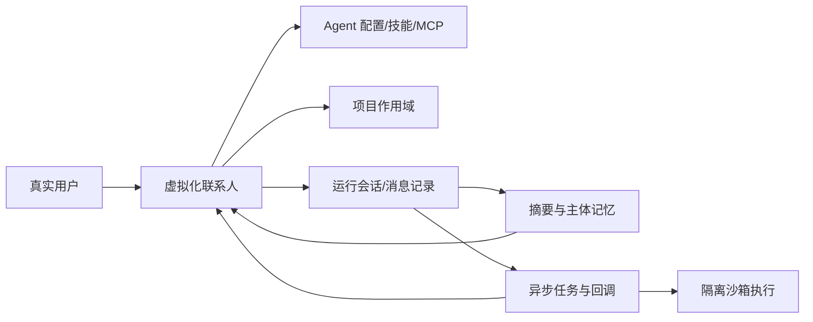

# Chatos RS 官网微服务实施方案

## 1. 本次目标

在当前仓库内新增一个独立官网微服务，用 Rust 后端承载静态资源与少量站点 API，用 React 前端完成官网展示。官网不是普通项目介绍页，而是要把 Chatos RS 的核心差异讲透：

- 不再以“单次会话”为产品中心，而是以“虚拟化联系人/智能体身份”为用户入口。
- 会话仍作为底层运行记录和历史载体存在，但用户心智转向“找某个联系人继续推进工作”。
- Memory Engine 负责跨会话沉淀，Task Runner 负责异步延续执行，User Service 负责真实用户与 agent 身份，Project/Sandbox 服务负责工程任务和隔离执行。
- 官网需要用真实本地系统截图作为素材，减少空泛营销感，突出系统已经具备完整工程链路。

当前实施状态：已落地第一版 `official_website_service/` 官网微服务，包括 Rust/Axum 后端、React/Vite 前端、真实本地截图素材、独立启动脚本、`Makefile` 入口和根级全栈脚本可选入口。

已提供的常用入口：

- `make restart-official-website`：默认 `OFFICIAL_WEBSITE_MODE=dev`，启动 Rust 后端和 Vite 前端。
- `OFFICIAL_WEBSITE_MODE=prod make restart-official-website`：只启动 Rust 后端，由后端托管 `frontend/dist`。
- `make restart-official-website-prod`：使用独立生产端口 `49250` 启动官网，避免和开发官网端口冲突。
- `make build-official-website`：构建官网前端和后端。
- `make smoke-official-website`：检查脚本语法、Rust backend、React type-check 和前端构建。
- `make smoke-official-website-live`：探测运行中的官网页面、健康接口、manifest、状态接口、robots 和 sitemap。
- `make docker-build-official-website`：以仓库根目录为上下文构建官网 Docker 镜像。
- `GET /api/site/status`：官网后端并发探测本机核心微服务健康检查端点，用于页面展示本地运行状态。
- `OFFICIAL_WEBSITE_ENABLE_LIVE_STATUS=false`：关闭状态探测，适合公开部署；Docker 镜像默认关闭该能力。
- `OFFICIAL_WEBSITE_STATUS_*_URL`：覆盖单个微服务健康检查地址，适合容器或内网部署。
- `GET /robots.txt` / `GET /sitemap.xml`：根据 `OFFICIAL_WEBSITE_PUBLIC_BASE_URL` 生成搜索引擎入口。

## 2. 文档整理状态

根目录历史方案类文档已归档到 `docs/plans/`。根目录保留 README、安装指南、SDK 使用说明、运行手册、内置 MCP Prompt 等仍可能作为入口或运行参考的文档。

后续约定：

- 新增方案类文档默认放入 `docs/plans/`。
- 本文件暂放根目录，作为官网微服务的实施记录；稳定后可归档到 `docs/plans/`。

## 3. 产品叙事主线

官网主标题建议围绕：

> 让 AI 不再被会话边界切断。

叙事顺序：

1. 传统聊天产品的问题：上下文被会话切断，角色能力散落，长期任务难以自然续接。
2. Chatos RS 的解法：用户面对的是稳定的虚拟联系人，底层自动映射会话、项目、工具、记忆和异步任务。
3. 为什么这更适合工程协作：工程工作不是一次问答，而是连续调查、执行、复核、修正和交付。
4. 微服务如何支撑这个体验：主聊天、记忆、任务、身份、项目、沙箱各自独立，又被统一编排。

关键表述要克制准确：

- 不说“完全没有会话”，而说“会话从用户入口退到运行记录层”。
- 不说“记忆永远正确”，而说“通过总结、主题记忆、上下文组装降低续接成本”。
- 不说“任务自动完成所有事”，而说“Task Runner 将后续执行变成可观察、可回调、可复核的异步链路”。

## 4. 核心优势提炼

### 4.1 虚拟化联系人，而不是会话列表

现有代码中，前端已经围绕联系人选择、智能体管理和项目作用域组织入口。联系人背后绑定 `contactId`、`contactAgentId`、项目作用域和最新匹配会话。官网应把这个能力讲成：

- 用户找的是“长期协作对象”，不是翻找某个历史会话。
- 同一个联系人可在不同项目下持续工作，底层自动选择或创建合适的运行会话。
- 历史会话、运行上下文、任务状态和记忆都服务于联系人连续性。

### 4.2 记忆从会话摘要升级为主体记忆

Memory Engine 的数据模型包含 thread、record、summary、subject memory、related subject，并支持上下文组装。官网应突出：

- 会话摘要保留阶段性事实和待办。
- Rollup 把多轮摘要压缩成项目级或长期知识。
- Subject Memory 让用户、联系人、agent、项目等主体形成可复用记忆。
- Context Compose 在下一次交互时按策略拉回最近记录、摘要和主体记忆。

### 4.3 Task Runner 让 AI 有后台执行链路

Task Runner 不是普通任务看板，而是主聊天的异步延伸。官网应突出：

- 复杂任务可以拆解、排队、运行、复核、回调。
- 执行过程有 run、status、日志、技能、MCP 能力边界。
- 主聊天可以接收任务结果，用户不必一直守在当前会话里等待。

### 4.4 多微服务协同，而不是单体聊天壳

官网要把工程可信度讲出来：

- `chat_app`：联系人驱动的主交互界面。
- `chat_app_server_rs`：Rust/Axum 主编排后端，负责消息、流式响应、工具路由、运行上下文。
- `memory_engine`：长期记忆、摘要、主题记忆和上下文组装。
- `task_runner_service`：异步任务、技能、MCP、运行记录、回调。
- `user_service`：真实用户、agent account、令牌交换、统一模型配置。
- `project_management_service`：需求、项目任务和工程计划管理。
- `sandbox_manager_service`：Docker/Kata 沙箱租约、镜像初始化、沙箱 MCP 代理。
- `crates/chatos_ai_runtime` 等共享 crate：模型请求、工具执行、任务运行时抽象。

## 5. 官网信息架构

建议做单页官网，导航锚点如下：

1. Hero：一句话定位 + 真实产品截图拼贴 + 本地体验入口。
2. Why：会话制 AI 的工程协作痛点。
3. Contact Model：虚拟化联系人工作模型。
4. System Flow：从用户消息到记忆、任务、沙箱和回调的链路。
5. Microservices：各微服务职责和协作方式。
6. Product Screens：真实界面截图分区展示。
7. Developer Stack：Rust + React + MCP + MongoDB/SQLite 的工程栈。
8. Local Run：本地启动命令和默认服务端口。
9. Roadmap：官网后续可补的在线 demo、文档站、部署页。

## 6. 页面内容草案

### 6.1 Hero

标题：

> Chatos RS
> 让 AI 成为可以长期协作的联系人。

副标题：

> 用虚拟化联系人承载长期关系，用 Memory Engine 跨会话沉淀上下文，用 Task Runner 把后续执行变成可观察的后台链路。

首屏视觉：

- 主聊天界面截图作为主视觉。
- 截图上叠加 3 个轻量标注：联系人、记忆、异步任务。
- 背景使用深色科技感，不使用夸张渐变球或纯装饰插画。

### 6.2 会话制的问题

对比式内容：

- 传统会话：每次新开窗口，AI 重新理解上下文。
- Chatos RS：联系人是稳定入口，会话是运行轨迹。
- 传统工具调用：结果散在当前对话。
- Chatos RS：任务、日志、上下文快照、记忆均可追踪。

### 6.3 虚拟化联系人模型

建议用一张流程图：



官网实现时可以用 React/CSS 画交互式流程，不一定直接渲染 Mermaid。

### 6.4 微服务架构区

每个服务用紧凑信息块展示：

- 服务名
- 端口/目录
- 负责的产品能力
- 官网里对应截图或演示点

默认端口可从根启动脚本和 `.env.example` 展示：

- 主前端 `8088`
- 主后端 `3997`
- Memory Engine `7081` / `4178`
- Task Runner `39090` / `39091`
- User Service `39190` / `39191`
- Project Management `39210` / `39211`
- Sandbox Manager `8095` / `8096`

## 7. 技术方案

### 7.1 新增目录

建议新增：

```text
official_website_service/
  README.md
  backend/
    Cargo.toml
    src/main.rs
    src/config.rs
    src/router.rs
    src/site_manifest.rs
  frontend/
    package.json
    vite.config.ts
    tsconfig.json
    index.html
    src/
      App.tsx
      main.tsx
      data/siteContent.ts
      components/
      styles.css
    public/
      showcase/
        README.md
```

命名理由：`official_website_service` 语义明确，不与主 `chat_app` 混淆，也符合仓库已有微服务目录风格。

### 7.2 Rust 后端

使用 Axum + Tokio，与现有 Rust 服务风格一致。

后端职责保持轻量：

- `GET /health`：健康检查。
- `GET /api/site/manifest`：返回官网展示元信息、默认端口、截图 manifest。
- `GET /api/site/services`：返回微服务列表，可先静态配置。
- `GET /api/site/status`：本地默认开启的 live status，用短超时探测核心微服务健康状态。
- `GET /robots.txt` / `GET /sitemap.xml`：根据公开 URL 动态生成搜索引擎入口。
- 静态资源托管：生产环境服务 `frontend/dist`。
- SPA fallback：未知路径回退到 `index.html`。

建议默认端口：

- `OFFICIAL_WEBSITE_PORT=39250`
- 前端开发端口 `39251`

本地开发默认开启 live status，方便官网展示当前微服务集群是否在线；公开部署和 Docker 镜像默认建议关闭或覆盖健康检查 URL，避免暴露内部拓扑。

### 7.3 React 前端

技术栈：

- React 18
- Vite
- TypeScript
- CSS Modules 或普通 CSS
- `lucide-react` 图标

不建议引入 Ant Design。官网应更像产品展示站，而不是后台管理台；可以复用颜色和交互气质，但 UI 自行实现更轻。

视觉原则：

- 简约、克制、有科技感。
- 深色为主，配合白色、青色、绿色和少量暖色强调，不做单一紫蓝渐变。
- 首屏必须出现真实产品或真实截图素材。
- 页面区块不要堆太多卡片，微服务区和截图区可以使用紧凑信息块。
- 移动端优先保证文字不挤压、不重叠。

### 7.4 素材采集

后续实现阶段从本地运行服务截取素材，建议保存到：

```text
official_website_service/frontend/public/showcase/
```

建议截图清单：

- `chat-contact-home.png`：主聊天 + 联系人侧边栏。
- `agent-manager.png`：智能体管理。
- `memory-view.png`：记忆视图或 Memory Engine 管理台。
- `task-runner-runs.png`：Task Runner 任务/运行状态。
- `project-management.png`：项目管理服务。
- `sandbox-manager.png`：沙箱池、租约或镜像管理。
- `runtime-context.png`：轮次运行上下文/工具列表。

采集方式：

- 使用本地已运行服务 URL。
- 优先使用 Playwright 或浏览器自动化统一截图尺寸。
- 截图前清理敏感 token、真实密钥、私有路径和无关用户信息。
- 为每张截图写来源说明和推荐裁剪区域。

### 7.5 启动脚本集成

确认官网方案后，再补：

- `official_website_service/restart_services.sh`
- 根 `.env.example` 增加官网端口变量
- 根 `restart_all_services.sh` 可选启动官网
- 根 `Makefile` 增加 `build-website` / `check-website`

是否纳入根 `./restart_services.sh` 默认启动，需要你确认。我的建议是先只纳入 `restart_all_services.sh` 或单独脚本，避免主开发流变慢。

## 8. 分阶段实施计划

### Phase 1：官网微服务骨架

产出：

- 新增 `official_website_service/backend`
- 新增 `official_website_service/frontend`
- 后端可服务前端构建产物
- 前端能启动空壳页面

验收：

- `cargo check -p official_website_service_backend`
- `npm run type-check`
- `npm run build`
- `GET /health` 返回成功

### Phase 2：首屏与核心叙事

产出：

- Hero
- 会话制痛点区
- 虚拟化联系人模型区
- 系统流程区

验收：

- 桌面和移动端首屏不重叠。
- 首屏能在 5 秒内说明 Chatos RS 与普通 Chat App 的区别。

### Phase 3：微服务与产品截图

产出：

- 微服务职责区
- 截图素材采集与压缩
- 截图展示组件

验收：

- 每个核心微服务至少有一处官网信息对应。
- 截图无敏感信息。
- 图片尺寸和格式适合网页加载。

### Phase 4：工程入口与本地体验

产出：

- Local Run 区块
- 默认端口表
- GitHub/README/安装指南入口
- 站点 manifest API 接入

验收：

- 新用户能从官网知道如何本地启动主系统。
- 官网不复制过多安装长文，只链接到现有文档。

### Phase 5：验证与抛光

产出：

- 响应式检查
- 可访问性基本检查
- 构建脚本和 README
- 截图回归记录

验收：

- 桌面宽屏、笔记本、移动端至少三档截图检查。
- 无明显文本溢出和遮挡。
- 官网后端启动后可直接访问生产构建页面。

## 9. 风险与取舍

- 官网如果做得过度炫，会削弱工程产品可信度。应把真实界面和真实架构放在视觉中心。
- 截图素材可能暴露本地用户信息、路径、token 或项目名，必须脱敏。
- 不建议在官网实时请求所有微服务健康状态作为默认能力，避免官网依赖整套系统都在线。
- “打破会话制”容易被误解为删除会话能力，文案必须强调会话仍是底层运行记录。
- 新增微服务会增加维护面，初版后端应尽量薄，主要负责静态托管和 manifest。

## 10. 我建议的下一步

你确认方案后，我会按以下顺序继续：

1. 创建 `official_website_service` 微服务骨架。
2. 接入 Rust 后端与 React 前端构建。
3. 先完成无截图版官网主页面。
4. 用本地运行服务采集截图并替换占位素材。
5. 做移动端和桌面端视觉验收。
