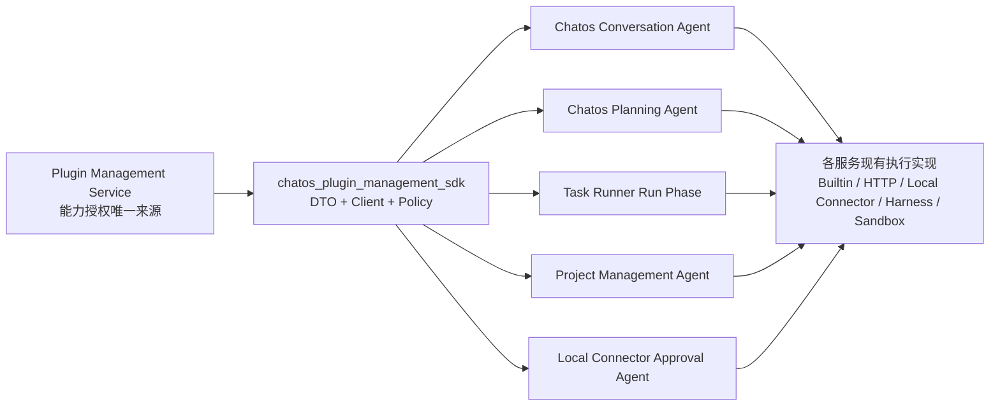

# 插件管理运行时统一接入实施方案

> 状态：第一阶段已实施，Skills 内容物化待后续阶段  
> 编写日期：2026-07-10  
> 当前分支：`2.0.4`  
> 本文范围：五个系统智能体与插件管理服务的运行时接入；当前已完成 MCP 授权接入、任务工具选择收敛和部署配置。

## 0. 实施进度

截至 2026-07-10，阶段 A 至 F 的第一版已经完成：

- 已新增共享 Rust SDK、用户态与内部态 resolver、owner 隔离、内部 secret 和 caller service 白名单。
- Chatos 普通对话与规划两个智能体都按各自 agent key 解析策略，并把 Task Runner MCP 作为必选能力。
- Task Runner 的 AI 可见工具选择只包含 available optional MCP；required 自动注入，unavailable 拒绝写入和执行。
- Task Runner 在任务写入和 run phase 开始时分别校验策略，运行时保留原有本地、云端、Harness、沙箱和 Local Connector provider 路由。
- Project Management Agent 和 Local Connector Command Approval Agent 已接入统一策略，策略失败时均在模型执行前收紧权限。
- Local Connector Client 通过 Local Connector Service 获取精简策略，不持有插件管理内部 secret。
- 当前五个运行时尚未实现 system skill 内容物化；optional skill 不暴露给 AI，required skill 会明确 fail closed，不会被静默忽略。

后续范围仍为阶段 G 的 Skills 内容物化，以及阶段 H 中旧授权数据和兼容路径的最终清理。

## 1. 结论先行

这次改造的核心不是把 MCP 的执行逻辑搬进插件管理服务，而是让插件管理服务成为五个系统智能体的唯一能力授权来源。

最终职责边界如下：

- 插件管理服务决定某个智能体在某个用户上下文中允许看见哪些 MCP 和 skills，以及它们是必需还是可选。
- 各业务服务保留现有 MCP 具体实现、项目类型判断、云端或本地路由、连接器转发等执行逻辑。
- 五个智能体不再各自维护一套静态允许列表。
- 新增一个共享 Rust crate，统一完成服务发现、鉴权、DTO、策略解析、错误分类和短时缓存。
- 能力解析发生在一次对话轮次、一次任务创建校验或一次智能体运行开始时，不在每一次工具调用时动态查询。
- AI 能看到和填写的任务工具选择字段只包含“可用且可选”的工具；必需工具由服务端自动注入，不可用工具完全不暴露给 AI。
- Task Runner 保存的用户工具选择必须经过插件管理策略过滤，选择字段本身只保存可选工具。
- 用户私有 MCP/skills 必须始终携带 `owner_user_id` 解析，不允许跨用户查询或执行。
- 插件管理服务不可用时不能悄悄恢复为旧的全量硬编码工具集。

## 2. 本次目标与非目标

### 2.1 目标

1. 建立统一的 Rust 插件管理 SDK，供 Chatos、Task Runner、Project Management Service 和 Local Connector Client 复用。
2. 让以下五个系统智能体在启动工具循环前请求插件管理运行时解析接口：
   - `chatos_conversation_agent`
   - `chatos_planning_agent`
   - `task_runner_run_phase`
   - `project_management_agent`
   - `local_connector_command_approval_agent`
3. 根据解析结果装配 MCP，严格执行必需、可选、禁用三种状态。
4. 让 Chatos 调用 Task Runner 创建任务时的工具列表、默认选择和服务端校验都来自同一份插件管理配置。
5. 保留现有运行提供方判断。例如读文件 MCP 仍由项目上下文判断使用本地目录、Local Connector、Harness 或云沙箱实现。
6. 为 skills 保留统一协议和策略入口，并按各运行时现有能力逐步接入实际内容加载。
7. 建立用户隔离、内部服务鉴权、失败策略、缓存、审计和测试基线。

### 2.2 非目标

- 不把 MCP 执行器迁移到插件管理服务。
- 不让插件管理服务直接操作项目文件、沙箱、终端或本机连接器。
- 不把 Chatos 用户创建的联系人登记为系统智能体。
- 不在每次工具调用时重新查询策略。
- 不在第一步重写 Task Runner 的完整任务数据模型。
- 不保留永久性的旧硬编码配置兜底。

## 3. 当前代码审计结论

### 3.1 已存在的插件管理能力

插件管理服务已经提供用户态解析接口：

```text
GET /api/runtime/agent-capabilities
```

当前查询参数：

- `agent_key`
- `owner_user_id`
- `include_unavailable`

当前响应已经包含：

- `mcps`
- `skills`
- `local_connector_requirements`
- 每个资源的 `resource`、`binding`、`availability`、`status` 和不可用原因

关键代码：

- `plugin_management_service/backend/src/api.rs`
- `plugin_management_service/backend/src/models.rs`
- `plugin_management_service/backend/src/seed.rs`

当前规则：

- 关闭的 binding 不出现在正常解析结果中。
- 必需或可选由 `binding.required` 表达。
- `include_user_resources=true` 时，会把当前 owner 的用户私有 MCP/skills 作为可选能力加入结果。
- 当前只有 `task_runner_run_phase` 默认包含用户资源。

### 3.2 五个智能体当前真实关系

| 智能体 | 当前运行入口 | 必需 MCP | 可选 MCP | 用户资源 |
| --- | --- | --- | --- | --- |
| `chatos_conversation_agent` | Chatos 普通对话运行时 | `task_runner_service` | 无 | 否 |
| `chatos_planning_agent` | Chatos `plan_mode` | `task_runner_service` | 无 | 否 |
| `task_runner_run_phase` | Task Runner 模型执行循环 | `TaskManager`、`AskUser` | 8 个已实现 builtin | 是 |
| `project_management_agent` | 项目运行环境初始化智能体 | `CodeMaintainerRead`、`project_environment`、`sandbox_images` | 无 | 否 |
| `local_connector_command_approval_agent` | Local Connector Client 命令审批 | `CodeMaintainerRead`、`local_connector_approval` | 无 | 否 |

Task Runner 当前八个可选 builtin 为：

- `CodeMaintainerRead`
- `CodeMaintainerWrite`
- `TerminalController`
- `ProjectManagement`
- `Notepad`
- `RemoteConnectionController`
- `WebTools`
- `BrowserTools`

这些关系已经 seed 到插件管理服务，但四个运行方尚未真正消费解析结果。

### 3.3 当前分散逻辑

#### Chatos

关键入口：

- `chatos/backend/src/modules/conversation_runtime/runtime_context.rs`

当前行为：

- 运行时直接构造 `task_runner_service` MCP。
- 当前代码中的普通对话允许 Task Runner 不可用，但这与目标能力关系不一致，需要在本次接入中修正为必需能力。
- 规划模式要求 Task Runner 可用并且必须有具体项目。
- Chatos 会通过 User Service 换取 Task Runner agent token，并在调用中携带用户 token。

问题：是否允许使用 `task_runner_service` 仍由 Chatos 本地逻辑决定，没有读取插件管理配置。

#### Task Runner

关键入口：

- `task_runner_service/backend/src/services/run_model_phase/setup/preparation.rs`
- `task_runner_service/backend/src/services/task_service/validation.rs`
- `task_runner_service/backend/src/mcp_server/support/schema/task.rs`
- `task_runner_service/backend/src/mcp_server/task_tools.rs`
- `task_runner_service/backend/src/services/mcp_resolution.rs`

当前任务选择字段：

- `enabled_builtin_kinds`
- `external_mcp_config_ids`

当前问题：

- 创建任务 schema 暴露的是 Task Runner 本地完整 builtin catalog。
- 外部 MCP 列表读取 Task Runner 自己的数据表。
- 创建和更新校验只检查本地存在性与 owner，没有校验插件管理策略。
- 真正执行时又独立组装 builtin 和外部 MCP，容易与页面选择、创建校验不一致。

#### Project Management Service

关键入口：

- `project_management_service/backend/src/api/runtime_environment.rs`
- `project_management_service/backend/src/services/environment_agent.rs`
- `project_management_service/backend/src/services/environment_agent/mcp_servers.rs`

当前执行器固定装配：

- 项目环境状态工具。
- 文件读取工具，并根据项目来源选择直接本地、Local Connector 或 Harness 实现。
- 沙箱镜像工具，并根据项目类型选择 Local Connector 或 Sandbox Manager 实现。

问题：具体实现路由是正确的，但是否允许智能体拥有这些逻辑能力仍是硬编码。

#### Local Connector Client

关键入口：

- `local_connector_client/core/src/approval/ai_agent.rs`
- `local_connector_client/core/src/approval/ai_agent/tool_executor.rs`
- `local_connector_client/core/src/state.rs`

当前审批智能体固定拥有：

- `CodeMaintainerRead` 的只读、列表、搜索子集。
- `approval_decision`，对应插件管理中的 `local_connector_approval`。

问题：客户端当前 `cloud_base_url` 指向 Local Connector Service，不是插件管理服务；需要明确策略获取路径和离线失败行为。

## 4. 目标架构



### 4.1 控制面和执行面

插件管理服务输出逻辑能力授权，例如：

```text
project_management_agent 可以使用 CodeMaintainerRead
project_management_agent 必须使用 sandbox_images
```

Project Management Service 再根据当前项目上下文选择具体实现：

```text
CodeMaintainerRead
  -> 本地项目：直接文件 provider 或 Local Connector provider
  -> Harness 云项目：Harness MCP provider

sandbox_images
  -> 本地项目：Local Connector sandbox provider
  -> 云项目：Sandbox Manager provider
```

插件管理服务不保存这类临时路由判断，也不要求管理员配置“运行提供方”。

### 4.2 解析时机

统一规则：每个业务边界解析一次，并把结果作为本次运行的不可变快照。

| 场景 | 解析时机 | 快照生命周期 |
| --- | --- | --- |
| Chatos 对话 | 每次用户消息进入模型运行前 | 当前对话轮次 |
| Chatos 规划 | 每次规划消息进入模型运行前 | 当前规划轮次 |
| Task Runner 工具目录 | 获取可选工具列表时 | 当前请求 |
| Task Runner 创建或更新任务 | 服务端校验时 | 当前写请求 |
| Task Runner 执行 | 每次 run phase 启动前 | 当前 run phase |
| Project Management Agent | 创建 agent executor 前 | 当前环境初始化运行 |
| Local Connector Approval | 每次审批模型启动前 | 当前审批请求 |

不在 MCP 的每个 tool call 前再次请求插件管理服务。

## 5. 共享 Rust crate 设计

新增 workspace crate：

```text
crates/chatos_plugin_management_sdk
```

建议模块：

```text
src/
  lib.rs
  client.rs
  config.rs
  auth.rs
  dto.rs
  policy.rs
  cache.rs
  error.rs
  diagnostics.rs
```

### 5.1 Protocol DTO

SDK 自己定义稳定 DTO，不让其他服务直接依赖 `plugin_management_service_backend`。

主要类型：

```rust
pub struct ResolveAgentCapabilitiesRequest {
    pub agent_key: SystemAgentKey,
    pub owner_user_id: String,
    pub include_unavailable: bool,
}

pub struct ResolvedAgentCapabilities {
    pub agent_key: SystemAgentKey,
    pub owner_user_id: String,
    pub policy_revision: String,
    pub generated_at: String,
    pub mcps: Vec<ResolvedMcpCapability>,
    pub skills: Vec<ResolvedSkillCapability>,
    pub local_connector_requirements: Vec<LocalConnectorRequirement>,
}

pub struct ResolvedMcpCapability {
    pub resource_id: String,
    pub name: String,
    pub runtime_kind: McpRuntimeKind,
    pub builtin_kind: Option<String>,
    pub server_name: Option<String>,
    pub required: bool,
    pub available: bool,
    pub unavailable_reason: Option<String>,
    pub owner_user_id: String,
    pub visibility: CapabilityVisibility,
}
```

具体字段以现有 resolver 返回值为基础，不复制插件管理后台的 MongoDB 持久化模型。

### 5.2 Client

统一客户端职责：

- 通过 `chatos_service_runtime` 发现 `plugin-management-service`。
- 构造用户态或内部态请求。
- 设置连接、请求和总超时。
- 解析非 2xx 响应并区分认证、权限、配置、网络和服务端错误。
- 记录安全的结构化诊断，不输出 token、secret、command 或私有配置内容。
- 支持注入 mock transport，便于各服务单测。

建议接口：

```rust
pub trait PluginManagementCapabilityResolver {
    async fn resolve_for_user(
        &self,
        request: ResolveAgentCapabilitiesRequest,
        bearer_token: &str,
    ) -> Result<ResolvedAgentCapabilities, ResolveError>;

    async fn resolve_for_service(
        &self,
        request: ResolveAgentCapabilitiesRequest,
    ) -> Result<ResolvedAgentCapabilities, ResolveError>;
}
```

### 5.3 Policy helper

共享策略层只做通用判断，不负责具体 MCP 构造：

- `required_available_mcps()`
- `optional_available_mcps()`
- `allowed_resource_ids()`
- `validate_selected_resource_ids()`
- `required_resource_ids()`
- `ensure_required_capabilities_available()`
- `intersect_selection_with_policy()`

统一语义：

- 必需且可用：自动注入。
- 必需但不可用：中止本次智能体运行并返回明确错误。
- 可选且可用：允许业务层选择或启用。
- 可选但不可用：跳过并记录结构化警告。
- 解析结果中不存在：视为禁用，不得构造和调用。

### 5.4 缓存

第一版只做进程内短 TTL 缓存，建议 5 到 15 秒：

```text
cache key = agent_key + owner_user_id + policy_revision/auth mode
```

要求：

- 单次运行始终复用已经取得的快照。
- 用户态和内部态缓存不能共用授权上下文。
- 管理员保存配置后可以通过较短 TTL 快速生效。
- 解析失败不能把旧快照无限延期。
- required 能力不能使用过期很久的 stale cache 继续运行。

## 6. 插件管理服务接口改造

### 6.1 保留用户态接口

保留现有接口：

```text
GET /api/runtime/agent-capabilities
Authorization: Bearer <user-token>
```

适用于请求仍持有用户 token 的同步调用，例如 Chatos 当前对话轮次。

服务端必须校验：

- 普通用户的 `owner_user_id` 必须等于 token 对应用户。
- `super_admin` 可按管理权限解析其他用户，但需要记录审计日志。
- `system_private` 资源只能通过系统智能体 resolver 返回，不能混入普通目录接口。

### 6.2 新增内部解析接口

Task Runner 是异步队列，worker 启动时原始用户 Bearer token 可能已经不在请求作用域中。因此必须新增 owner-scoped 内部接口：

```text
POST /api/internal/runtime/agent-capabilities/resolve
X-Plugin-Management-Internal-Secret: <secret>
Content-Type: application/json

{
  "agent_key": "task_runner_run_phase",
  "owner_user_id": "...",
  "include_unavailable": true
}
```

内部接口要求：

- `owner_user_id` 必填，不允许用空 owner 或管理员身份替代用户范围。
- 使用恒定时间比较内部 secret。
- 内部 secret 未配置时接口不注册或始终拒绝。
- 限定允许调用的服务来源，并记录 `caller_service`。
- 返回内容仍执行 owner 隔离，不因为是内部接口就返回其他用户私有资源。
- 后续如果仓库统一升级为 service JWT，可替换 header secret，SDK 上层接口不变。

建议新增环境变量：

```text
PLUGIN_MANAGEMENT_INTERNAL_API_SECRET
PLUGIN_MANAGEMENT_SERVICE_URL
```

消费方统一使用：

```text
PLUGIN_MANAGEMENT_INTERNAL_API_SECRET
```

生产部署中由 secret 管理系统注入，不写入镜像和仓库。

### 6.3 Resolver 响应增强

建议补充：

- `policy_revision`：由 agent、binding 和资源更新时间生成的稳定版本。
- `generated_at`：服务端生成快照时间。
- `agent_enabled`：智能体是否启用。
- `diagnostics`：仅包含可公开的不可用原因码。

不可用原因使用稳定枚举码，例如：

- `resource_disabled`
- `binding_disabled`
- `local_connector_offline`
- `local_device_mismatch`
- `runtime_not_supported`
- `missing_runtime_reference`

## 7. 五个智能体接入方案

### 7.1 Chatos Conversation Agent

接入位置：

- `chatos/backend/src/modules/conversation_runtime/runtime_context.rs`

流程：

1. 从当前请求取得已校验用户身份和 Bearer token。
2. 使用 `agent_key=chatos_conversation_agent`、当前 `owner_user_id` 解析能力。
3. 检查 required 集合中的 `task_runner_service` 是否可用。
4. 执行现有 agent token exchange 并构造 Task Runner MCP。
5. `task_runner_service` 缺失或不可用时，在模型调用前中止本轮普通对话并返回明确的能力配置错误。
6. 不再保留“普通对话没有 Task Runner MCP 也继续运行”的旧分支。

普通对话智能体必须装配 Task Runner MCP。普通模式和规划模式的区别是系统提示、任务 profile、规划约束和调用行为，不是普通模式可以缺少该 MCP。

联系人只提供用户选择的角色、提示和上下文，不注册为新的 system agent key。

### 7.2 Chatos Planning Agent

接入位置同普通对话，但根据 `plan_mode` 选择：

```text
agent_key=chatos_planning_agent
```

流程：

1. 在构建规划模式 runtime context 前解析策略。
2. `task_runner_service` 必须出现在 required 且 available 集合。
3. 继续保留“规划模式必须绑定具体项目”的业务校验。
4. 继续复用现有 User Service agent token exchange 和 `X-Chatos-User-Authorization` 转发。
5. 插件管理配置只决定能否拥有 Task Runner MCP，不替代 token exchange 和 Task Runner 自己的授权。

### 7.3 Task Runner Run Phase

接入位置：

- `task_runner_service/backend/src/services/run_model_phase/setup/preparation.rs`
- `task_runner_service/backend/src/services/mcp_resolution.rs`

流程：

1. run phase 启动时，根据任务 owner 调内部 resolver：

```text
agent_key=task_runner_run_phase
owner_user_id=task.owner_user_id
```

2. 在模型调用前校验所有 required MCP 均 available。
3. 自动注入 `TaskManager`、`AskUser` 等 required MCP，不依赖任务保存的用户选择。
4. 对任务保存的可选 builtin 和用户 MCP 选择与当前 allowed 集合取交集。
5. 已被管理员禁用、已删除、已转为不可用或不属于任务 owner 的能力不得运行。
6. 使用解析后的逻辑资源信息调用 Task Runner 现有 provider builder，不在 SDK 中构造工具。
7. 用户本机 MCP 由解析结果中的 local connector reference 进入现有 Local Connector 执行链。

这里必须在执行前重新解析一次。原因不是每次动态检查，而是任务可能排队较久，创建任务时允许的能力在真正执行前可能已经被管理员撤销。

### 7.4 Project Management Agent

接入位置：

- `project_management_service/backend/src/api/runtime_environment.rs`
- `project_management_service/backend/src/services/environment_agent.rs`
- `project_management_service/backend/src/services/environment_agent/mcp_servers.rs`

流程：

1. 在创建环境 agent executor 前解析 `project_management_agent`。
2. 校验 `CodeMaintainerRead`、`project_environment`、`sandbox_images` 等 required 能力。
3. 只为解析结果允许的逻辑能力调用现有 provider 构造函数。
4. 文件 provider 继续根据项目上下文选择本地、Local Connector 或 Harness。
5. 沙箱镜像 provider 继续根据项目上下文选择 Local Connector 或 Sandbox Manager。
6. required 能力不可用时，在模型执行前返回明确初始化错误，避免模型启动后才发现缺工具。

调用鉴权：

- 同步用户请求仍持有 Bearer token 时优先使用用户态 resolver。
- 后台自动初始化或没有用户 token 的内部流程使用内部 resolver，并强制传入项目 owner。

### 7.5 Local Connector Command Approval Agent

接入位置：

- `local_connector_client/core/src/approval/ai_agent.rs`
- `local_connector_client/core/src/approval/ai_agent/tool_executor.rs`
- `local_connector_client/core/src/state.rs`

推荐采用 Local Connector Service 代理方式：

```text
Local Connector Client
  -> Local Connector Service 已认证接口
  -> Plugin Management Service 内部 resolver
```

原因：

- 客户端现有 `cloud_base_url` 已指向 Local Connector Service。
- 不需要把插件管理内部 secret 下发到用户机器。
- Local Connector Service 可以从已认证连接中确认 owner 和 device，再请求 owner-scoped 策略。

需要新增 Local Connector Service 接口，例如：

```text
GET /api/plugin-management/agent-capabilities/local-command-approval
Authorization: Bearer <user-token>
```

返回值只包含当前用户、当前审批智能体需要的精简策略，不暴露其他系统内部配置。

审批智能体的失败策略必须 fail closed：

- 无法获得策略时，不得因为缺少判断依据而自动放行命令。
- required 能力缺失时，返回拒绝或要求人工确认。
- 任何错误路径都不能扩大工具权限。

## 8. Chatos 到 Task Runner 的工具选择改造

这是本次接入中最容易出现前后不一致的链路，必须同时改列表、schema、写入校验和运行时执行。

### 8.1 能力分类

对 `task_runner_run_phase` 的解析结果分为：

```text
required capabilities
  自动随任务携带，不允许用户取消，不出现在 AI schema、prompt 或可选列表

optional system capabilities
  管理员允许后，才出现在 Chatos/Task Runner 的任务工具选择中

optional user/public capabilities
  仅返回当前用户私有资源和 admin public 资源

disabled/unavailable capabilities
  不出现在 AI schema、prompt 或可选列表，不接受写入，不执行
```

这里需要严格区分两种数据：

- 服务端内部策略快照：包含 required、optional 和 unavailable，供校验、自动注入和诊断使用。
- AI 可见的工具选择字段：只包含当前 available 的 optional 能力。

required 和 unavailable 都不能为了“信息完整”而塞进 AI 可见字段。required 不需要 AI 做决定，unavailable 也不是 AI 可以选择的能力。这样可以缩小 schema，避免模型重复选择必需工具，或者尝试调用本来不可用的工具。

### 8.2 统一 catalog 接口

Task Runner 应提供 owner-scoped 的任务能力目录接口，供 Chatos 和 Task Runner 自己复用：

```text
GET /api/tasks/capabilities/catalog
Authorization: Bearer <user-token>
```

返回建议：

```json
{
  "policy_revision": "...",
  "selectable_builtin_mcps": [],
  "selectable_external_mcps": [],
  "selectable_skills": [],
  "default_selected_optional_resource_ids": []
}
```

该接口内部调用共享 SDK 解析 `task_runner_run_phase`，Chatos 不自行拼接一份 builtin 列表。接口返回的三个 `selectable_*` 集合都只能包含 available optional 资源，不返回 required 和 unavailable 资源。

Task Runner 服务端内部仍持有完整策略快照。`policy_revision` 只用于并发校验和诊断，不作为工具选项传进模型 prompt。

### 8.3 创建任务 schema

当前 MCP tool schema 中 builtin enum 不能继续直接使用完整 `BuiltinMcpKind` catalog。

改造方式：

- 构造 `Task` / `CreateTask` MCP schema 前先解析一次当前 owner 的 catalog。
- AI 可见的 enum 只包含插件管理允许且当前 available 的 optional builtin。
- required builtin 不出现在 enum、字段描述或候选值中，由服务端自动注入。
- unavailable builtin 不出现在 enum、字段描述或候选值中。
- 外部 MCP 和 skill 选择字段同样只暴露 available optional resource id。
- schema 生成和实际创建任务必须共享同一个策略快照，避免用户看见的 enum 与写入校验不同。

如果当前策略没有任何 available optional 工具，则 AI 侧应省略整个工具选择字段，或者提供不可见的空默认值；不要给 AI 一个只有空数组意义的决策项。

required 能力不可用时，由 Task Runner 在服务端返回明确的能力配置错误，不把 required 工具名称作为可选项交给 AI 处理。

如果现有 MCP schema 构造接口不方便传异步结果，则在请求入口提前解析并把 `TaskCapabilityCatalog` 注入 schema builder，不允许 schema builder 自己访问数据库。

### 8.4 服务端写入校验

无论任务来自 Chatos MCP、HTTP API 还是内部调用，都必须经过同一校验函数：

```text
validate_task_capability_selection(owner_user_id, submitted_selection, policy_snapshot)
```

校验要求：

- 所有选择必须属于当前 owner 可用的 optional 集合。
- 不接受其他用户的私有 MCP/skills id。
- 不接受 required id 伪装成用户可选项。
- 不接受 unavailable id，即使它曾经出现在旧 schema 或旧任务中。
- 不接受 resolver 结果中不存在的 id。
- 返回稳定错误码和具体被拒绝的 resource id。

### 8.5 执行时二次收敛

任务运行前重新解析当前策略：

```text
effective = required_now + intersection(saved_optional_selection, allowed_optional_now)
```

这样可以保证：

- 管理员在任务排队期间撤销的工具不会继续执行。
- 新增 required 工具会自动进入后续执行。
- 新增 optional 工具不会自动加入旧任务，除非任务选择或默认规则明确要求。
- 用户资源换 owner、被删除或本机不可用后不会绕过检查。

### 8.6 字段兼容策略

第一阶段保留现有 wire fields，降低改造范围：

- `enabled_builtin_kinds`
- `external_mcp_config_ids`

这两个字段的语义统一改为“AI 或用户选择的 optional 工具”，不得保存 required 或 unavailable 能力。

内部统一转换为：

```rust
pub struct TaskCapabilitySelection {
    pub builtin_resource_ids: Vec<String>,
    pub mcp_resource_ids: Vec<String>,
    pub skill_resource_ids: Vec<String>,
}
```

兼容规则：

- `enabled_builtin_kinds` 通过共享映射转换为插件管理 builtin resource id。
- `external_mcp_config_ids` 第一阶段解释为插件管理 MCP resource id。
- required resource id 永远不写入这些选择字段，只在运行时有效集合中由服务端合并。
- unavailable resource id 不进入新写入；读取旧任务时在执行前过滤。
- 如果现有数据仍引用 Task Runner 旧配置 id，提供一次性映射或迁移，不做模糊名称匹配。
- 新 API 推荐增加 `mcp_resource_ids`，旧字段保留一个兼容周期并标记 deprecated。
- 所有新写入保存规范化 resource id，避免后续再次迁移。

## 9. Skills 接入边界

插件管理 resolver 已经返回 skills，但五个运行时当前并不都有完整的 skill 执行或 prompt materialization 链路：

- Task Runner 尚没有完整统一的 skill package 执行路径。
- Project Management Agent 和 Local Connector Approval Agent 当前没有 skill 装配逻辑。
- Chatos 有联系人和 memory skill 相关逻辑，但 conversation runtime 当前并未把它作为系统智能体统一 skill 注入链路。

因此按两个连续子阶段实施：

### 9.1 第一子阶段：策略接入

- 共享 SDK 完整携带 `skills`。
- catalog、用户隔离、required/optional 校验和诊断支持 skills。
- Task Runner 数据模型预留 `skill_resource_ids`。
- 运行时没有 materializer 的 skill 标记为 `runtime_not_supported`，不能假装已经执行。

### 9.2 第二子阶段：内容物化

新增统一 `SkillMaterializer` 接口：

```rust
pub trait SkillMaterializer {
    async fn materialize(
        &self,
        skill: &ResolvedSkillCapability,
        context: &SkillRuntimeContext,
    ) -> Result<MaterializedSkill, SkillMaterializationError>;
}
```

按来源支持：

- admin public inline skill。
- 用户 private inline skill。
- 云端 package skill。
- Local Connector 本机文件或 package skill。

物化结果必须有大小、格式、超时和内容安全限制。各智能体只把自己明确支持的结果加入 prompt 或 runtime，不把任意本地路径直接传给云端服务。

## 10. 鉴权与用户隔离

### 10.1 身份传播

| 调用方 | 推荐鉴权 | owner 来源 |
| --- | --- | --- |
| Chatos 同步对话 | 用户 Bearer token | 已认证用户 |
| Task Runner HTTP catalog | 用户 Bearer token | 已认证用户 |
| Task Runner worker | 内部 secret | task.owner_user_id |
| Project Management 同步请求 | 用户 Bearer token | 项目 owner |
| Project Management 后台流程 | 内部 secret | project.owner_user_id |
| Local Connector Client | 用户 token 到 Local Connector Service | 已认证连接 owner |

### 10.2 强制规则

- 普通用户不能通过 query/body 指定另一个 `owner_user_id`。
- 内部调用必须显式提供 owner，不能使用“当前管理员”作为默认 owner。
- public 只允许 `super_admin` 创建。
- system_private 不出现在普通用户目录，只能在 system agent resolver 中按 binding 返回。
- Local Connector 资源必须同时匹配 owner，必要时还要匹配 device/workspace。
- Task Runner 保存和执行外部资源时都必须复核 owner。
- 日志中只记录 resource id、agent key、owner hash、revision 和错误码，不记录凭据和私有配置正文。

## 11. 失败、缓存与可观测性

### 11.1 失败策略

| 场景 | 行为 |
| --- | --- |
| resolver 认证失败 | 中止并返回权限错误 |
| resolver 网络或服务错误 | 中止 required 场景；可选能力不得扩大 |
| required MCP 不可用 | 模型调用前失败 |
| optional MCP 不可用 | 跳过并记录 warning |
| 已保存选择被撤销 | 执行时移除并记录 policy drift |
| Local Connector 审批无法解析 | 拒绝或人工确认，不自动放行 |
| skill runtime 尚不支持 | 标记 unavailable，不静默注入空内容 |

### 11.2 日志字段

统一结构化字段：

- `agent_key`
- `owner_user_id_hash`
- `policy_revision`
- `resolve_mode=user|internal|proxy`
- `required_count`
- `optional_count`
- `unavailable_count`
- `selected_count`
- `effective_count`
- `cache_hit`
- `latency_ms`
- `error_code`

### 11.3 指标

- `plugin_capability_resolve_total`
- `plugin_capability_resolve_latency_ms`
- `plugin_capability_resolve_error_total`
- `plugin_required_capability_unavailable_total`
- `plugin_selection_rejected_total`
- `plugin_policy_drift_total`
- `plugin_capability_cache_hit_total`

## 12. 分阶段实施顺序

### 阶段 A：协议和插件管理接口

1. 新建 `crates/chatos_plugin_management_sdk`。
2. 提取稳定 resolver DTO 和 agent key 枚举。
3. 给 resolver 增加 `policy_revision`、`generated_at` 和稳定错误码。
4. 把 `chatos_conversation_agent -> task_runner_service` 的 seed binding 从 optional 迁移为 required，并幂等迁移已经存在的旧 binding，不能因为资源已存在就跳过更新。
5. 新增 owner-scoped 内部解析接口和内部鉴权。
6. 增加 SDK mock transport、接口测试和用户隔离测试。

完成条件：四个 Rust 消费方可以用同一个 SDK 获取同结构的策略快照。

### 阶段 B：Chatos 两个智能体

1. 在 conversation runtime 注入 SDK client。
2. 根据 `plan_mode` 选择两个明确 agent key。
3. 普通和规划两种模式都校验并构造 required `task_runner_service`。
4. 保留现有 agent token exchange、项目校验和请求 header。
5. 增加普通模式和规划模式 required 能力的测试。

完成条件：两个 Chatos 智能体都始终装配 Task Runner MCP；binding 缺失或能力不可用时，都在模型调用前明确失败。

### 阶段 C：Task Runner catalog 和任务写入

1. 新增 owner-scoped capability catalog service/API。
2. 让 Chatos 工具选择读取该 catalog。
3. 动态过滤任务 schema 的 builtin enum，只向 AI 暴露 available optional 能力。
4. required 和 unavailable 能力都从 AI 的选择字段、schema 和 prompt 中移除，required 由服务端自动注入。
5. 外部 MCP 列表改为插件管理 resolver 结果。
6. 创建、更新、MCP tool 和内部入口共用统一校验。
7. 增加旧字段到规范化 resource id 的兼容层。

完成条件：页面展示、schema、写入校验使用同一份策略，不可通过直接 API 绕过。

### 阶段 D：Task Runner 执行

1. run phase 开始时通过内部 resolver 重新解析。
2. 计算 required 加已保存 optional 交集。
3. 用有效集合驱动现有 builtin 和外部 MCP provider builder。
4. 删除旧硬编码允许列表作为授权依据的逻辑。
5. 增加排队期间策略变更测试。

完成条件：实际模型工具集合与当前插件管理配置一致。

### 阶段 E：Project Management Agent

1. 在 executor 创建前解析策略。
2. 按逻辑能力过滤 provider 构造。
3. 保留本地、Local Connector、Harness、Sandbox Manager 路由。
4. required 缺失时在模型调用前失败。

完成条件：插件管理能真实控制项目环境智能体拥有的三类逻辑 MCP，不影响运行提供方自动选择。

### 阶段 F：Local Connector Approval Agent

1. 在 Local Connector Service 增加受认证的策略代理接口。
2. Client 审批前请求精简策略。
3. 按策略构造只读工具和最终决策工具。
4. 实现离线、超时和 required 缺失的 fail-closed 行为。

完成条件：本机审批智能体不再固定拥有工具，且策略服务失败时不会自动扩大权限。

### 阶段 G：Skills 物化

1. 增加 skill binding 管理和 resolver 测试。
2. 实现共享 `SkillMaterializer` 协议。
3. 先接入 Chatos 和 Task Runner，再评估环境智能体与审批智能体是否需要 skills。
4. 接入 Local Connector 本机 skill 内容读取与 owner/device 校验。

完成条件：配置为可用的 skill 能进入明确支持它的智能体运行上下文，不支持的运行时明确显示 unavailable。

### 阶段 H：移除旧授权来源

1. 删除或降级各服务本地静态允许列表，只保留 provider catalog 和 resource id 映射。
2. 停止 Task Runner 旧 external MCP 表作为授权来源。
3. 增加启动时配置检查和部署文档。
4. 完成 shadow 到 enforce 的发布切换。

完成条件：插件管理服务是唯一授权来源，旧逻辑不能绕过它。

## 13. 测试矩阵

### 13.1 SDK

- 用户态和内部态请求 header 正确。
- owner、agent key、URL 编码正确。
- 401、403、404、409、5xx、超时和无效 JSON 正确分类。
- required、optional、disabled、unavailable 策略函数正确。
- cache key 不会跨 owner、agent 或 auth mode 串数据。

### 13.2 插件管理服务

- 普通用户不能解析其他用户资源。
- admin public 对所有用户可见。
- system_private 只通过绑定的 system agent resolver 返回。
- `include_user_resources` 只带当前 owner 私有资源。
- 内部接口缺 secret、错 secret、缺 owner 全部拒绝。
- binding 或资源更新后 `policy_revision` 变化。

### 13.3 Chatos

- 普通模式始终装配 required Task Runner MCP。
- 普通模式 required Task Runner 缺失或不可用时在模型调用前失败。
- 规划模式 required unavailable 时模型调用前失败。
- 联系人选择不改变 system agent key。
- 两种模式都只在 required 能力校验通过后执行 token exchange。

### 13.4 Task Runner

- catalog 只返回允许的 optional builtin。
- AI 可见 schema 和 prompt 中不包含 `TaskManager`、`AskUser` 等 required 工具选项。
- AI 可见 schema 和 prompt 中不包含任何 unavailable 工具选项。
- `TaskManager`、`AskUser` 等 required 不可取消，并由服务端自动注入。
- 任务保存的选择字段只包含 optional resource id。
- 用户 A 看不到或选择不了用户 B 的 MCP/skills。
- 直接 HTTP/MCP 调用提交非法 id 会被服务端拒绝。
- 创建后管理员撤销 optional，执行时不再装配。
- 创建后管理员新增 required，执行时自动装配。
- Local Connector 离线时本机资源不进入有效集合。
- 旧任务字段能够稳定迁移到 resource id。

### 13.5 Project Management

- 三个 required 能力齐全时保持现有行为。
- 任一 required 能力缺失时不启动模型。
- 本地、Local Connector、Harness、云沙箱路由不因策略接入被破坏。
- owner 传播正确。

### 13.6 Local Connector Approval

- 策略允许时只装配审批所需只读工具和 decision 工具。
- 策略超时、服务离线、required 缺失时 fail closed。
- Client 不持有插件管理内部 secret。
- 用户和 device 不匹配时拒绝策略或本机资源。

### 13.7 端到端

至少覆盖：

1. `chatos_conversation_agent` 的 `task_runner_service` binding 缺失或不可用时，普通对话在模型调用前明确失败。
2. 管理员关闭规划模式 required MCP，规划请求在模型前得到明确错误。
3. 管理员调整 Task Runner optional builtin，Chatos 任务创建工具选择同步变化。
4. 用户添加本机 MCP 后，仅该用户 Task Runner 可选择；其他用户不可见。
5. 本机 MCP 选择后 connector 离线，任务执行不绕过 availability 检查。
6. 管理员关闭 `sandbox_images`，项目环境智能体在运行前失败而不是使用未授权实现。
7. 插件管理服务不可达时，本机命令审批不会自动批准。

## 14. 验收标准

- 五个系统智能体在模型工具循环开始前都通过共享 SDK 获得策略快照。
- 任何智能体都不能获得 resolver 未授权的 MCP。
- required、optional、disabled 三种状态在真实运行中生效。
- Chatos 普通和规划模式使用两个正确的 agent key。
- Chatos 普通和规划两个智能体都把 `task_runner_service` 作为 required MCP 装配。
- Chatos 创建任务时看到的工具与 Task Runner 服务端允许的工具一致。
- AI 的任务工具选择字段只包含 available optional 工具。
- required 工具不暴露给 AI，由服务端自动注入且用户不能取消。
- unavailable 工具不暴露给 AI，也不能通过 API 写入。
- Task Runner 创建、更新和执行三个阶段都不能绕过策略。
- 用户私有资源在 catalog、保存、执行和日志各层均保持 owner 隔离。
- Project Management 的运行提供方仍由程序根据项目上下文自动判断。
- Local Connector Client 不持有插件管理内部 secret，审批失败时默认收紧权限。
- 插件管理服务故障时不存在回退到全量硬编码工具集的路径。
- 旧任务数据在兼容期内可运行，所有新写入使用插件管理 resource id。
- 单元、集成和端到端测试覆盖本文测试矩阵的核心路径。

## 15. 文件级改造清单

### 新增

- `crates/chatos_plugin_management_sdk/Cargo.toml`
- `crates/chatos_plugin_management_sdk/src/lib.rs`
- `crates/chatos_plugin_management_sdk/src/client.rs`
- `crates/chatos_plugin_management_sdk/src/config.rs`
- `crates/chatos_plugin_management_sdk/src/auth.rs`
- `crates/chatos_plugin_management_sdk/src/dto.rs`
- `crates/chatos_plugin_management_sdk/src/policy.rs`
- `crates/chatos_plugin_management_sdk/src/cache.rs`
- `crates/chatos_plugin_management_sdk/src/error.rs`
- `crates/chatos_plugin_management_sdk/src/diagnostics.rs`

### Workspace 和部署

- `Cargo.toml`
- `Cargo.lock`
- `docker/.env.example`
- `docker/compose.yml`
- `docker/compose.build.yml`
- `.drone.yml`
- `.github/workflows/docker-images.yml`

### Plugin Management Service

- `plugin_management_service/backend/src/api.rs`
- `plugin_management_service/backend/src/models.rs`
- `plugin_management_service/backend/src/config.rs`
- `plugin_management_service/backend/src/store.rs` 及相关 Mongo store 文件
- `plugin_management_service/backend/src/seed.rs`

### Chatos

- `chatos/backend/Cargo.toml`
- `chatos/backend/src/config.rs` 或当前统一配置入口
- `chatos/backend/src/app_state.rs` 或当前依赖注入入口
- `chatos/backend/src/modules/conversation_runtime/runtime_context.rs`
- Chatos 调用 Task Runner 工具 catalog 的 API client 文件
- Chatos 前端任务工具选择相关组件和 API 类型

### Task Runner

- `task_runner_service/backend/Cargo.toml`
- `task_runner_service/backend/src/config.rs`
- `task_runner_service/backend/src/services.rs`
- `task_runner_service/backend/src/services/mcp_resolution.rs`
- `task_runner_service/backend/src/services/run_model_phase/setup/preparation.rs`
- `task_runner_service/backend/src/services/task_service/validation.rs`
- `task_runner_service/backend/src/mcp_server/support/schema/task.rs`
- `task_runner_service/backend/src/mcp_server/task_tools.rs`
- `task_runner_service/backend/src/api/router.rs`
- 新增 capability catalog service/API 和兼容迁移文件

### Project Management Service

- `project_management_service/backend/Cargo.toml`
- `project_management_service/backend/src/config.rs`
- `project_management_service/backend/src/api/runtime_environment.rs`
- `project_management_service/backend/src/services/environment_agent.rs`
- `project_management_service/backend/src/services/environment_agent/mcp_servers.rs`

### Local Connector Service 和 Client

- Local Connector Service 配置、认证路由和插件管理 proxy client 文件
- `local_connector_client/core/Cargo.toml`
- `local_connector_client/core/src/state.rs`
- `local_connector_client/core/src/approval/ai_agent.rs`
- `local_connector_client/core/src/approval/ai_agent/tool_executor.rs`

## 16. 风险与实施前确认项

### 16.1 已做出的方案决策

- 使用共享 workspace crate，不复制 HTTP client 和 DTO。
- 插件管理服务只做控制面，不接管具体执行器。
- 解析一次形成运行快照，不按 tool call 查询。
- Task Runner 在任务写入和实际执行时都校验，执行阶段以当前策略为准。
- required 工具自动注入，不让用户选择。
- Local Connector Client 通过 Local Connector Service 代理获取策略，不下发内部 secret。
- 第一阶段保留 Task Runner 旧字段，内部规范化为插件管理 resource id。
- skills 协议与策略同时接入，内容物化按运行时支持程度单独完成。

### 16.2 实施时需要用真实数据确认

- Task Runner 旧 `external_mcp_config_ids` 到插件管理 resource id 的可迁移对应关系。
- 各服务当前配置结构中最合适的 SDK client 注入位置。
- Chatos 前端具体哪一个工具选择组件仍在消费旧 Task Runner catalog。
- Local Connector Service 当前最适合复用的用户认证和 device 绑定中间件。
- skill package 的最终物化格式、大小限制和 prompt 注入位置。

这些确认不改变总体架构，只影响具体迁移脚本和落点。

## 17. 推荐的首个代码提交范围

第一个实施提交建议严格控制为基础设施，不同时改五个业务运行时：

1. 新增 `chatos_plugin_management_sdk`。
2. 完成用户态和内部态 resolver DTO/client。
3. 插件管理服务新增内部 resolver、revision 和测试。
4. 接入 workspace、Docker 环境变量和部署配置。
5. 暂不切换任何智能体到 enforce 模式。

第二个提交从 Chatos 两个智能体开始接入，随后是 Task Runner catalog、写入校验、执行阶段，最后接 Project Management 和 Local Connector Approval。这样每一步都能独立验证，出现问题时也能明确定位到协议层、授权层或具体 provider 装配层。
