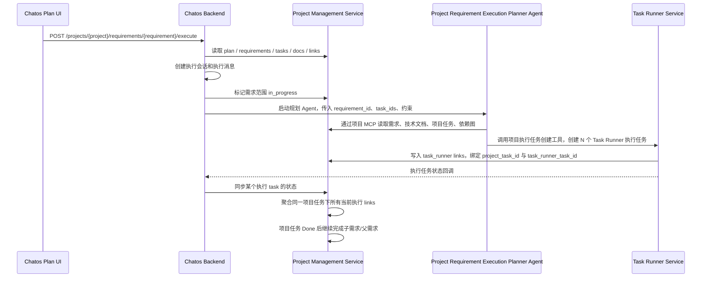

# 项目需求执行 Agent 改造实施方案

## 1. 背景与目标

当前在 Chatos 的项目 Plan 中点击“执行”某个需求时，后端会把需求范围内的每个项目任务直接转换成一个 Task Runner 任务。这导致两类问题：

- 项目任务与执行任务被固定成 1:1，不能让 AI 根据需求、技术文档和任务上下文拆成多个更具体的执行任务。
- 项目任务完成逻辑按单个 Task Runner 状态直接更新项目任务，无法表达“一个项目任务下多个执行任务全部成功后才算完成”。

目标改为两阶段：

1. 新增一个插件管理系统 Agent。点击执行时，由这个 Agent 使用项目自己的 MCP 和 Task Runner 提供给 Chatos 的工具，根据项目需求、技术文档、项目任务和依赖关系，在 Task Runner 中创建具体执行任务。一个项目任务可以拆成多个执行任务。
2. 执行任务完成后的状态回调仍然全部由程序处理，不引入 AI。程序根据执行任务链接聚合项目任务状态，进而自动完成项目任务、子需求、父需求。

## 2. 当前代码结论

### 2.1 Chatos 执行入口

- 入口：`chatos/backend/src/api/projects/requirement_execution_handlers.rs`
- 当前流程：
  - 读取项目 plan 快照。
  - 解析需求、项目任务、依赖图。
  - 选出需求范围内未完成项目任务。
  - 创建执行会话和执行消息。
  - 调用 `create_and_start_execution_tasks(...)`。
  - 把创建出的 Task Runner task links 写回消息 metadata。

核心问题在 `create_and_start_execution_tasks(...)`：它直接按项目任务循环创建 Task Runner 任务。

### 2.2 直接创建 Task Runner 任务的位置

- 文件：`chatos/backend/src/api/projects/requirement_execution/tasks.rs`
- 当前行为：
  - 按 `creation_order` 遍历 `WorkItemPlanItem`。
  - 每个项目任务生成一个 `CreateTaskRunnerTaskRequest`。
  - 调 `task_runner_api_client::create_task_runner_task(...)`。
  - 调 `project_management_api_client::link_work_item_task_runner_task(...)` 写项目任务链接。
  - 调 `sync_work_item_task_runner_status(...)` 把项目任务状态同步为 queued/in_progress。

这就是现在的一对一关系。

### 2.3 回调同步位置

- 文件：`chatos/backend/src/api/agent_chat/task_runner_callback.rs`
- 当前行为：
  - Task Runner 回调到 Chatos。
  - Chatos 用消息 metadata 里的 `project_requirement_execution.task_links` 根据 `task_runner_task_id` 找 `project_task_id`。
  - 再调用项目服务 `sync_work_item_task_runner_status(...)`。

这要求 Chatos 消息提前知道所有 task links。Agent 动态拆任务后，不能再只依赖这份静态 metadata。

### 2.4 项目服务状态同步

- 文件：`project_management_service/backend/src/services/execution_sync.rs`
- 当前行为：
  - 收到某个 Task Runner 状态。
  - upsert 一条 task runner link。
  - 直接把这个 Task Runner 状态映射成项目任务状态。
  - 项目任务 Done 后调用 `complete_related_requirements_if_work_items_done(...)`，自动完成需求和父需求。

问题：这里是单链接思路。多执行任务时，单个执行任务成功不能直接把项目任务改成 Done。

### 2.5 task runner link 存储目前限制为一对一

- SQLite：
  - `project_management_service/backend/src/store/sqlite.rs`
  - `project_management_service/backend/src/store/sqlite/work_item_links.rs`
  - 当前对 `project_work_item_task_runner_links(work_item_id)` 建唯一索引。
  - upsert 查询条件和冲突条件都是 `work_item_id`。
- Mongo：
  - `project_management_service/backend/src/store/mongo.rs`
  - `project_management_service/backend/src/store/mongo/work_items.rs`
  - 当前按 `work_item_id` 去重并建唯一索引。

要支持一个项目任务对应多个执行任务，必须先改这里。

### 2.6 插件管理系统 Agent 现状

- 文件：
  - `plugin_management_service/backend/src/seed.rs`
  - `crates/chatos_plugin_management_sdk/src/dto.rs`
- 当前系统 Agent 包括：
  - `chatos_conversation_agent`
  - `chatos_planning_agent`
  - `task_runner_run_phase`
  - `project_management_agent`
  - `local_connector_command_approval_agent`

目前没有“项目需求执行规划 Agent”。

### 2.7 Task Runner MCP 能力现状

- 文件：
  - `task_runner_service/backend/src/mcp_server/prerequisite_creation.rs`
  - `task_runner_service/backend/src/mcp_server/chatos_async_planner/access.rs`
- 已有 `create_tasks_with_prerequisites`，可以一次创建多个 Task Runner 任务并设置依赖。
- Chatos async planner profile 已允许这个工具。
- 但这个工具目前不知道项目任务 ID，也不会自动把创建出的多个执行任务绑定回项目任务。

## 3. 推荐总体设计



关键原则：

- AI 只参与“如何拆分和创建执行任务”。
- AI 不参与“执行任务完成后如何更新项目任务/需求状态”。
- Agent 不能只返回一段 JSON 让服务端盲插任务；它必须调用受约束的工具创建执行任务，并由工具保证链接写入。
- 程序侧要能从 `task_runner_task_id` 反查项目任务链接，不能只依赖 Chatos 消息 metadata。

## 4. 第一阶段：新增项目需求执行规划 Agent

### 4.1 新增系统 Agent

修改位置：

- `crates/chatos_plugin_management_sdk/src/dto.rs`
- `plugin_management_service/backend/src/seed.rs`

新增枚举：

```rust
ProjectRequirementExecutionPlannerAgent
```

建议 agent key：

```text
project_requirement_execution_planner_agent
```

Seed 规格：

- display name：`Project Requirement Execution Planner Agent`
- service name：`chatos`
- scope：`system_internal`
- managed_by：`system`
- include_user_resources：`true`

绑定能力：

- 必需：`system_mcp_chatos_task_runner`
- 必需：项目管理 MCP 能力，用于读取项目需求、技术文档、项目任务和依赖图。
- 可选：用户/项目自己的 MCP 资源。`include_user_resources=true` 后，Chatos runtime 需要按项目上下文加载可用资源。

### 4.2 Chatos 执行入口改造

修改位置：

- `chatos/backend/src/api/projects/requirement_execution_handlers.rs`
- `chatos/backend/src/api/projects/requirement_execution/context.rs`
- `chatos/backend/src/api/projects/requirement_execution/sync.rs`
- 新增建议文件：`chatos/backend/src/api/projects/requirement_execution/planner_agent.rs`

保留当前入口的前置校验：

- 项目访问权限。
- 需求存在。
- 需求依赖前置校验。
- 选中需求范围内未完成项目任务。
- 防止同一需求/项目任务已有 active 执行。
- 创建执行 session/message。
- 将涉及的需求状态同步为 `in_progress`。

删除或停止使用：

- 不再调用 `create_and_start_execution_tasks(...)` 直接创建一对一执行任务。
- `created_tasks` 不再作为点击执行接口的立即结果。

新增行为：

- 创建执行消息后，启动 `project_requirement_execution_planner_agent`。
- Agent 输入只给稳定、可审计的上下文：
  - `project_id`
  - `requirement_id`
  - `execution_group_id`，建议使用执行消息 `message.id`
  - `selected_project_task_ids`
  - `include_prerequisite_dependents`
  - 当前依赖图摘要
  - source session/message/turn id
- Agent 必须通过项目 MCP 读取完整需求、技术文档、项目任务详情，而不是依赖自然语言拼接的全部上下文。

接口响应建议改为：

```json
{
  "success": true,
  "status": "planning_started",
  "project_id": "...",
  "requirement_id": "...",
  "conversation_id": "...",
  "message_id": "...",
  "execution_group_id": "...",
  "planner_agent_key": "project_requirement_execution_planner_agent",
  "created_tasks": []
}
```

`created_tasks` 可以暂时保留为空数组，兼容前端类型，但语义变为“规划完成前不可知”。

### 4.3 Agent 提示词约束

Agent 的系统提示词需要明确：

- 你是项目需求执行规划 Agent。
- 你只负责把项目任务拆成 Task Runner 执行任务。
- 必须读取需求详情、技术文档、项目任务和依赖图。
- 每个选中的项目任务至少要创建一个执行任务，除非工具契约明确支持 `no_op` 并写明原因。
- 一个项目任务可以拆成多个执行任务。
- 创建的每个 Task Runner 执行任务必须带 `project_task_id`。
- 执行任务依赖应映射项目任务依赖，同时允许项目任务内部再拆分前后置执行步骤。
- 不要直接更新项目任务为 Done，不要直接完成需求。
- 最终只总结已创建的执行任务映射和未能创建的原因。

### 4.4 Task Runner MCP 工具改造

推荐新增专用工具，而不是让 Agent 先创建任务再单独绑定：

```text
create_project_execution_tasks
```

原因：如果创建 Task Runner 任务和写项目任务 link 分成两个工具调用，AI 可能漏掉绑定，回调链路就会失效。专用工具能把创建和绑定做成一个受控事务。

工具输入建议：

```json
{
  "project_id": "project-id",
  "requirement_id": "requirement-id",
  "execution_group_id": "source-user-message-id",
  "tasks": [
    {
      "client_ref": "task-a-1",
      "project_task_id": "project-task-id",
      "title": "具体执行任务标题",
      "description": "上下文和技术细节",
      "objective": "完成标准",
      "input_payload": {
        "source": "chatos_project_requirement_execution",
        "project_id": "project-id",
        "requirement_id": "requirement-id",
        "project_task_id": "project-task-id",
        "execution_group_id": "source-user-message-id"
      },
      "priority": 80,
      "default_model_config_id": "可选，默认项目任务配置",
      "enabled_builtin_kinds": ["可选"],
      "external_mcp_config_ids": ["可选"],
      "prerequisite_refs": ["task-a-0"],
      "prerequisite_task_ids": ["外部已存在前置 Task Runner 任务"]
    }
  ]
}
```

工具行为：

- 复用 `create_tasks_with_prerequisites` 的图校验、批量创建、依赖设置和自动启动逻辑。
- 校验每个 `project_task_id` 属于当前 `project_id` 和执行范围。
- 给每个 Task Runner 任务写入：
  - `source_session_id`
  - `source_user_message_id`
  - `source_turn_id`
  - `project_id`
  - `task_profile`
  - `input_payload.project_task_id`
  - `input_payload.execution_group_id`
- 创建成功后，使用项目服务 sync secret 或受控内部 API 写入项目任务执行 link。
- 返回 `created_tasks` 和 `task_links`。

兼容策略：

- 保留现有 `create_tasks_with_prerequisites`。
- `create_project_execution_tasks` 内部复用它的核心创建逻辑。
- Chatos 的项目执行 Agent 只暴露专用工具，避免误用普通创建工具。

### 4.5 Task Runner 工具 profile

修改位置：

- `task_runner_service/backend/src/mcp_server/context.rs`
- `task_runner_service/backend/src/mcp_server/support/access.rs`
- `task_runner_service/backend/src/mcp_server/chatos_async_planner/access.rs`
- `task_runner_service/backend/src/mcp_server/entrypoints/tool_definitions.rs`

推荐新增 tool profile：

```text
project_requirement_execution_planner
```

允许工具：

- `list_tasks`
- `get_task`
- `get_task_dependency_graph`
- `create_project_execution_tasks`
- 必要时允许 `cancel_task`

不要给这个 profile 暴露过宽的 Task Runner 管理工具，防止 Agent 修改不相关任务。

Chatos 调 Task Runner MCP 时需要带：

- `X-Task-Runner-Tool-Profile: project_requirement_execution_planner`
- `X-Chatos-Project-Id`
- `X-Chatos-Session-Id`
- `X-Chatos-Turn-Id`
- `X-Chatos-User-Message-Id`
- `X-Chatos-User-Authorization`
- `X-Task-Runner-Builtin-Prompt-Locale`

### 4.6 项目 MCP profile 支持

修改位置：

- `project_management_service/backend/src/api/router/mcp.rs`

当前项目服务 MCP 的 Task Runner 内部分支只允许：

```text
x-task-runner-task-profile = chatos_plan
```

新增规划 Agent 后有两个选择：

1. Chatos 直接用用户/agent token 调项目 MCP，不走 Task Runner 内部分支。
2. 如果通过 Task Runner 内部分支访问项目 MCP，则允许新的 profile，例如 `project_requirement_execution_planner`。

推荐优先使用方案 1：Chatos planner agent 直接挂载项目 MCP，并把 Task Runner MCP 作为另一个工具服务。这样职责更清楚，项目读取和执行任务创建分开。

## 5. 第二阶段：程序化状态聚合与需求完成

### 5.1 链接模型改造

当前链接表按 `work_item_id` 唯一，必须改为多链接。

建议字段：

- 保留：
  - `id`
  - `work_item_id`
  - `task_runner_task_id`
  - `task_runner_run_id`
  - `link_type`
  - `source_session_id`
  - `source_user_message_id`
  - `task_runner_status`
  - `last_callback_event`
  - `last_callback_at`
  - `last_error_message`
  - `created_at`
  - `updated_at`
- 新增：
  - `execution_group_id`：本次点击执行的分组 ID，建议等于 Chatos 执行消息 ID。
  - `is_current`：是否属于当前有效执行分组。
  - `superseded_at`：被新一轮执行替代的时间，可选。

索引建议：

- SQLite：
  - 删除 `idx_project_work_item_task_runner_links_work_item_unique`
  - 新增普通索引 `(work_item_id)`
  - 新增唯一索引 `(task_runner_task_id)`
  - 新增索引 `(work_item_id, execution_group_id, is_current)`
- Mongo：
  - 删除 `idx_project_work_item_task_runner_links_work_item_unique`
  - 新增普通索引 `{ work_item_id: 1 }`
  - 新增唯一索引 `{ task_runner_task_id: 1 }`
  - 新增索引 `{ work_item_id: 1, execution_group_id: 1, is_current: 1 }`

upsert 规则：

- 不再按 `work_item_id` upsert。
- 按 `task_runner_task_id` 或 `(work_item_id, task_runner_task_id)` upsert。
- 同一个 Task Runner task 只能归属一个项目任务执行 link。

### 5.2 新一轮执行的链接隔离

一个项目任务未来可能重复执行。不能让历史成功 link 参与新一轮聚合。

执行入口启动新规划前：

- 确认没有 active 执行 link。
- 将 selected work items 旧的 `is_current=true` links 标记为 `is_current=false` 和 `superseded_at=now`。
- 新创建的 links 使用新的 `execution_group_id`，并设置 `is_current=true`。

状态聚合只看：

```text
work_item_id = 当前项目任务
link_type = execution
is_current = true
execution_group_id = 当前执行分组
```

如果暂不新增 `is_current`，至少要用 `source_user_message_id/execution_group_id` 过滤，否则历史任务会污染新执行。

### 5.3 回调同步改造

修改位置：

- `chatos/backend/src/api/agent_chat/task_runner_callback.rs`
- `chatos/backend/src/services/project_management_api_client.rs`
- `project_management_service/backend/src/api/sync.rs`
- `project_management_service/backend/src/services/execution_sync.rs`

当前 Chatos 回调同步依赖消息 metadata 的 `task_links`。新方案改为：

1. Chatos 收到 Task Runner 回调。
2. 优先从消息 metadata 读取 work item link，兼容旧数据。
3. 如果 metadata 找不到，则调用项目服务新 sync endpoint，按 `task_runner_task_id` 反查 link。

建议新增项目服务接口：

```text
POST /api/chatos-sync/task-runner/tasks/{task_runner_task_id}/status
```

输入：

```json
{
  "task_runner_run_id": "...",
  "task_runner_status": "completed",
  "last_callback_event": "task.completed",
  "last_callback_at": "...",
  "last_error_message": null,
  "source_session_id": "...",
  "source_user_message_id": "..."
}
```

服务端行为：

- 根据 `task_runner_task_id` 找 link。
- 更新 link 状态。
- 找到对应 `work_item_id`。
- 聚合这个项目任务当前执行分组下所有 links。
- 根据聚合结果更新项目任务状态。
- 如果项目任务状态变为 Done/Failed/Blocked/Cancelled，再触发需求状态传播。

保留旧接口：

```text
POST /api/chatos-sync/work-items/{work_item_id}/task-runner-status
```

旧接口内部也要走同一套聚合逻辑，不能再直接按单个 Task Runner 状态更新项目任务。

### 5.4 项目任务状态聚合规则

聚合函数建议：

```text
aggregate_work_item_status(current_execution_links) -> ProjectWorkItemStatus
```

规则：

- 没有 current execution link：不改为 Done；保持 `in_progress` 或返回 `None`。
- 任一 link 为 `failed/error`：项目任务 `failed`。
- 任一 link 为 `blocked`：项目任务 `blocked`。
- 任一 link 为 `queued/running/processing/in_progress`：项目任务 `in_progress`。
- 所有 link 为 `succeeded/success/completed/done`：项目任务 `done`。
- 全部 link 为 `cancelled/canceled`：项目任务 `cancelled`。
- 成功和取消混合但没有 active/fail/block：建议项目任务 `cancelled`，除非产品上希望改为 `blocked`。

注意：单个执行任务成功时，只更新 link，不直接完成项目任务。

### 5.5 需求和父需求完成规则

当前 `complete_related_requirements_if_work_items_done(...)` 可以继续保留，因为它已经按需求子树检查所有非 archived 项目任务是否 Done。

需要确认和补测试：

- 项目任务 A 拆成 A1/A2 两个执行任务。
- A1 成功，A2 running：项目任务 A 仍然 `in_progress`。
- A1/A2 都成功：项目任务 A 才 `done`。
- 某需求下所有项目任务都 `done`：该需求 `done`。
- 子需求都 `done` 且父需求子树所有项目任务都 `done`：父需求 `done`。

这一步保持纯程序逻辑，不调用 AI。

## 6. Chatos 消息 metadata 调整

当前执行消息 metadata：

```json
{
  "project_requirement_execution": {
    "task_links": []
  },
  "task_runner_async": {
    "created_task_ids": [],
    "running_task_ids": [],
    "terminal_task_ids": []
  }
}
```

新方案建议：

- 执行消息先记录规划状态：

```json
{
  "project_requirement_execution": {
    "project_id": "...",
    "requirement_id": "...",
    "execution_group_id": "...",
    "planner_agent_key": "project_requirement_execution_planner_agent",
    "selected_project_task_ids": ["..."],
    "task_links": []
  },
  "task_runner_async": {
    "mode": "project_requirement_execution_planner",
    "overall_status": "planning",
    "source": "project_requirement_execute_button",
    "created_task_ids": [],
    "running_task_ids": [],
    "terminal_task_ids": []
  }
}
```

- Agent 创建任务后，可以由工具返回结果并更新消息 metadata。
- 但回调同步不能依赖 metadata，必须支持按 `task_runner_task_id` 查项目服务 link。

## 7. 前端改造

修改位置：

- `chatos/frontend/src/components/projectExplorer/ProjectPlanPane.tsx`
- `chatos/frontend/src/lib/api/client/types/project.ts`
- `chatos/frontend/src/lib/api/client/workspace/projects.ts`

当前前端立即读取：

```ts
const createdTasks = result.created_tasks || result.createdTasks || [];
```

并提示“已创建 N 个执行任务”。

新行为：

- 点击后提示“执行规划已启动”。
- 打开执行会话。
- 不再把接口返回的 `created_tasks.length` 当作最终执行任务数量。
- 后续通过会话消息、Task Runner 回调、项目 plan 刷新展示实际执行任务状态。

类型新增：

```ts
status?: 'planning_started' | 'planning_failed';
execution_group_id?: string;
executionGroupId?: string;
planner_agent_key?: string;
plannerAgentKey?: string;
```

停止执行：

- 需要取消当前 execution group 下的所有 active Task Runner links。
- 如果 planner agent 仍在运行，需要能标记规划中止或取消后台 agent turn。
- UI 文案从“取消 N 个任务”调整成“停止本次执行规划/执行任务”。

## 8. 兼容与迁移

### 8.1 旧数据兼容

旧数据只有一个 link，且没有 `execution_group_id/is_current`。

迁移策略：

- `execution_group_id` 用 `source_user_message_id` 回填。
- `is_current` 默认 `true`。
- 如果同一个 work item 历史上被去重后只剩一条 link，保持原样。
- 如果 Mongo 迁移前已经存在重复，按 `updated_at` 保留 current，其余设为 `is_current=false`。

### 8.2 旧回调兼容

旧 Chatos 消息中有 `task_links`：

- 回调先按 metadata 查找，保持旧路径可用。
- 同时项目服务按 task id 查 link 的新路径要支持旧 link。

### 8.3 回滚策略

建议使用 feature flag：

```text
PROJECT_REQUIREMENT_EXECUTION_AGENT_ENABLED
```

关闭时：

- 可以短期回退到旧的 `create_and_start_execution_tasks(...)`。
- 但数据库多链接迁移不可简单回退；旧逻辑 upsert 必须改成能处理多链接后的最新一条 current link。

## 9. 测试计划

### 9.1 插件管理

- `SystemAgentKey` 序列化和 `as_str()` 测试。
- seed 后存在 `project_requirement_execution_planner_agent`。
- 必需 MCP binding 正确。
- `include_user_resources=true` 被保留。

### 9.2 Task Runner MCP

- `create_project_execution_tasks` schema snapshot。
- 缺少 `project_task_id` 时拒绝。
- project task 不属于 project 时拒绝。
- 一次创建多个执行任务并设置依赖。
- 创建后写入项目服务 link。
- 同一 `task_runner_task_id` 重试时幂等更新 link。
- 新 profile 只暴露允许的工具。

### 9.3 项目服务存储

- SQLite 支持一个 `work_item_id` 多条 links。
- Mongo 支持一个 `work_item_id` 多条 links。
- upsert 按 `task_runner_task_id`，不会覆盖同一 work item 下其他 links。
- `list_task_runner_links` 返回多条。
- 按 `task_runner_task_id` 能反查 link。
- 新 execution group 会 supersede 旧 current links。

### 9.4 状态聚合

- 一个项目任务两个执行任务：一个 success、一个 running，项目任务仍 `in_progress`。
- 两个都 success，项目任务 `done`。
- 任一 failed，项目任务 `failed`，需求 `failed`。
- 任一 blocked，项目任务 `blocked`，需求 `blocked`。
- 全部 cancelled，项目任务 `cancelled`。
- 历史 success link 不参与新 execution group 聚合。

### 9.5 需求完成传播

- 子需求所有项目任务 done 后，子需求 done。
- 父需求子树所有项目任务 done 后，父需求 done。
- 父需求下仍有未完成项目任务时不完成。
- archived 项目任务不阻止完成。

### 9.6 Chatos 回调

- metadata 有 task link 时走旧路径成功。
- metadata 没有 task link 时按 `task_runner_task_id` 调项目服务新 sync endpoint。
- 回调重复到达时幂等。
- task cancelled 且在 stopped list 中时保持现有忽略逻辑。

### 9.7 前端

- execute 响应 `planning_started` 时展示“执行规划已启动”。
- 不再依赖 `created_tasks.length`。
- 能打开执行会话。
- 停止执行时刷新 plan 并展示取消结果。

## 10. 推荐实施顺序

1. 先做 Project Management 多链接模型和状态聚合。
   - 这是基础能力，且不依赖 AI。
   - 先保证一个项目任务多执行任务的完成规则正确。
2. 增加按 `task_runner_task_id` 同步状态的新接口。
   - 让回调不依赖 Chatos 消息 metadata。
3. 增加 Task Runner 专用 MCP 工具 `create_project_execution_tasks`。
   - 创建执行任务和写项目任务 link 一次完成。
4. 增加插件管理系统 Agent 和 SDK enum。
   - `project_requirement_execution_planner_agent`。
5. 改 Chatos execute endpoint。
   - 保留前置校验和执行消息创建。
   - 替换直接创建任务为启动 planner agent。
6. 改前端文案和响应类型。
7. 打开 feature flag，做端到端验证。
8. 清理旧的一对一创建路径。

## 11. 风险与待确认点

- 是否允许一个项目任务拆成 0 个执行任务。建议默认不允许，除非工具支持显式 `no_op` 并由程序确认。
- 执行任务部分成功、部分取消时，项目任务状态要定为 `cancelled` 还是 `blocked`。建议产品侧确认。
- Planner agent 失败但已经创建了部分执行任务时，需要明确策略：
  - 已创建任务继续跑，并按 link 聚合。
  - 未覆盖的项目任务保持 `in_progress` 或转 `blocked`。
  - 建议增加“规划完成校验”，发现 selected project task 没有 current link 时标记该项目任务 `blocked`，错误写入 link 或执行消息 metadata。
- 如果执行任务本身也需要项目 MCP，Agent 创建任务时必须把对应 builtin/external MCP 配置写进 Task Runner task 的 `mcp_config`。
- 如果未来需要显示“某个项目任务拆成了哪些执行任务”，项目服务需要提供按 requirement/project 聚合 links 的查询接口，避免前端逐个 work item 请求。

## 12. 关键文件清单

第一阶段主要涉及：

- `crates/chatos_plugin_management_sdk/src/dto.rs`
- `plugin_management_service/backend/src/seed.rs`
- `chatos/backend/src/api/projects/requirement_execution_handlers.rs`
- `chatos/backend/src/api/projects/requirement_execution/context.rs`
- `chatos/backend/src/api/projects/requirement_execution/sync.rs`
- `task_runner_service/backend/src/mcp_server/prerequisite_creation.rs`
- `task_runner_service/backend/src/mcp_server/chatos_async_planner/access.rs`
- `task_runner_service/backend/src/mcp_server/entrypoints/tool_definitions.rs`
- `project_management_service/backend/src/api/router/mcp.rs`

第二阶段主要涉及：

- `project_management_service/backend/src/services/execution_sync.rs`
- `project_management_service/backend/src/services/execution_sync/status_transition.rs`
- `project_management_service/backend/src/api/sync.rs`
- `project_management_service/backend/src/api/task_runner_links.rs`
- `project_management_service/backend/src/store/sqlite.rs`
- `project_management_service/backend/src/store/sqlite/work_item_links.rs`
- `project_management_service/backend/src/store/mongo.rs`
- `project_management_service/backend/src/store/mongo/work_items.rs`
- `chatos/backend/src/api/agent_chat/task_runner_callback.rs`
- `chatos/backend/src/services/project_management_api_client.rs`
- `chatos/frontend/src/components/projectExplorer/ProjectPlanPane.tsx`
- `chatos/frontend/src/lib/api/client/types/project.ts`
