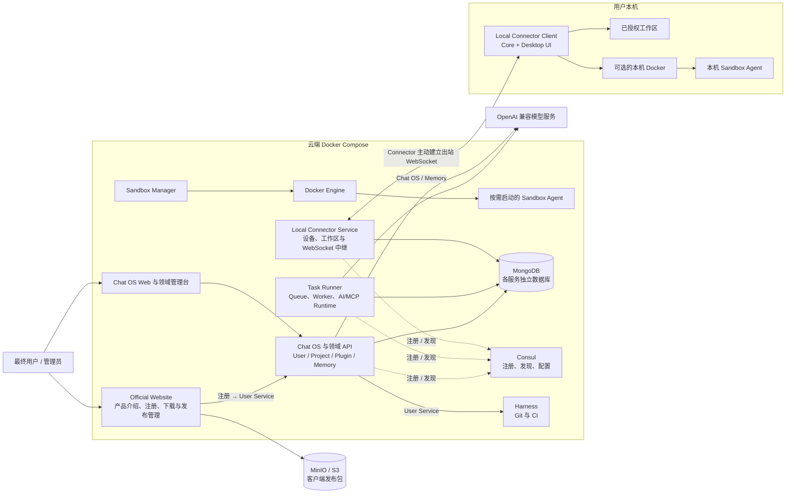
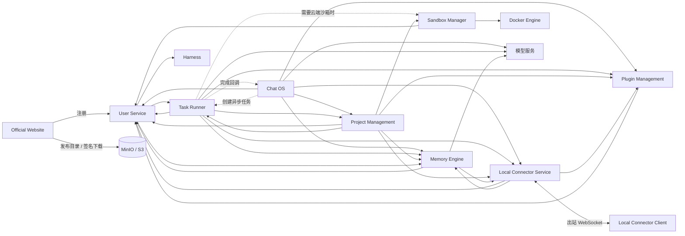
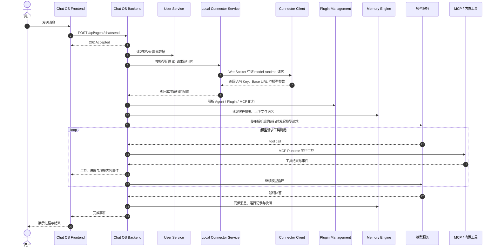
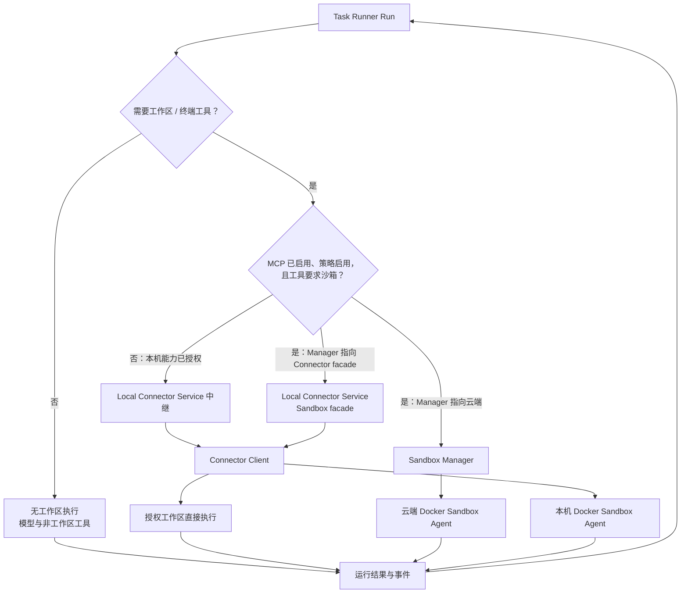
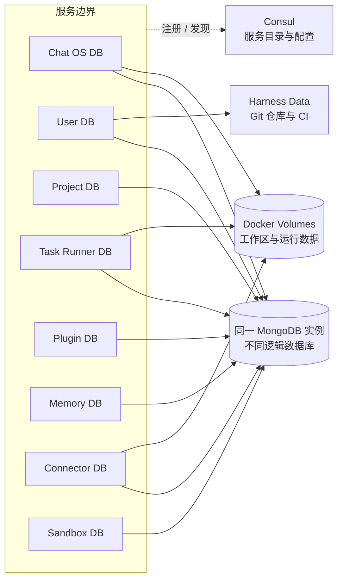
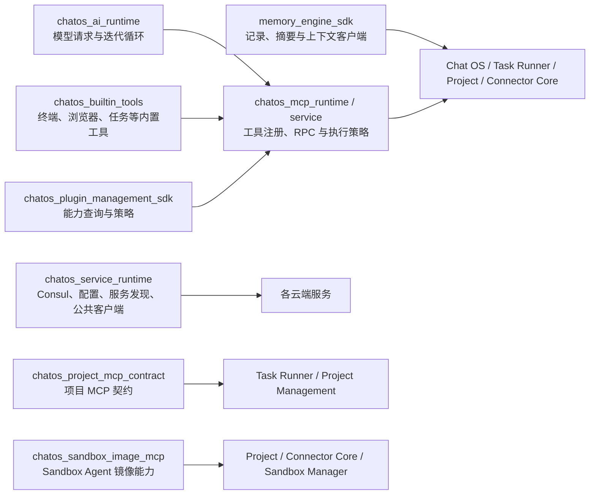

# Chat OS

Chat OS 是一个面向软件工程场景的 AI 协作与任务执行平台。它把对话式协作、项目管理、模型与插件配置、长期记忆、异步任务编排、云端沙箱和本机工作区连接整合在同一套系统中。

> 当前仓库采用“云端服务 Docker Compose 部署、本机 Connector 独立运行”的形态。主应用负责交互和编排，真正的工程任务可以按项目配置进入云端沙箱或用户本机执行。

[English README](./README.en.md) · [安装指南](./INSTALL_GUIDE.zh-CN.md) · [部署命令](./DEPLOY_COMMANDS.zh-CN.md)

## 项目解决什么问题

Chat OS 不只是聊天界面，而是一套围绕“理解需求、形成计划、调用工具、执行代码、沉淀上下文”构建的工程协作平台：

- 在 Chat OS 中进行普通对话、规划对话和工程任务协作。
- 将长耗时工作交给 Task Runner，通过事件流和回调持续同步结果。
- 用 Project Management Service 管理项目、需求、项目任务及其执行映射。
- 在云端 Docker 沙箱或用户本机工作区中运行终端、文件和 MCP 工具。
- 用 Memory Engine 统一保存线程记录、摘要、上下文和长期记忆。
- 用 Plugin Management Service 统一管理 MCP、Skill、Skill Package 和系统 Agent 能力。
- 用 User Service 统一处理用户、Agent 账号、模型配置、令牌交换与 Harness 账号资源。

## 总体架构

下面先画部署边界。它表达组件运行在哪里，不代表每个请求都会经过所有组件。



### 分层职责

| 层次 | 核心组件 | 主要职责 |
| --- | --- | --- |
| 产品接入 | Official Website、Chat OS Web、领域管理台、Connector Desktop UI | 产品介绍、注册下载、会话交互、管理配置、本机授权 |
| 业务控制 | Chat OS、User、Project、Plugin、Memory | 身份与模型元数据、会话编排、项目领域数据、能力策略、上下文治理 |
| 任务执行 | Task Runner、Sandbox Manager、Local Connector、Sandbox Agent | 队列与 Worker、模型工具循环、工作区访问、沙箱生命周期、结果回传 |
| 数据与基础设施 | MongoDB、Consul、Harness、MinIO/S3、Docker | 业务持久化、服务发现、代码托管、客户端分发、隔离运行环境 |

## 服务运行依赖

下图来自 `docker/compose.yml` 中的服务地址配置以及对应客户端代码。实线表示固定的 HTTP 或 WebSocket 依赖，虚线表示回调、同步或按配置启用的链路；它不是一次请求的调用顺序。



## 交互式对话链路

`/api/agent/chat/send` 接收请求后返回 `202 Accepted`，实际运行在后台继续。普通对话直接由 Chat OS 完成模型与工具循环；Task Runner 只是可选的异步能力，不是每轮对话的固定下一跳。



模型配置元数据由 User Service 管理；在启用 Local Connector 的正常链路中，实际 API Key 与 Base URL 由在线 Connector Client 在运行时返回。Chat OS 和 Task Runner 拿到临时运行时配置后直接请求模型服务，Local Connector 不代理模型响应流量。

## Task Runner 生命周期

Task Runner 的核心不是一个同步 API 调用，而是持久化 Run、Worker 抢占、心跳续约和完成收尾组成的生命周期。

```mermaid
flowchart LR
    create["创建 Run"] --> queued["保存为 Queued"]
    queued --> poll["Worker 轮询"]
    poll --> claim["Claim Run<br/>记录 worker、token、TTL"]
    claim --> heartbeat["Claim Heartbeat"]
    heartbeat --> load["加载 Task、模型配置、Plugin 策略、<br/>MCP 路由与前置任务"]
    load --> workspace["准备 Harness / 工作区"]
    workspace --> decision{"是否需要沙箱"}
    decision -->|"否"| runtime["组装 Memory Scope、MCP Executor、TaskRuntime"]
    decision -->|"是"| lease["创建或复用沙箱租约"]
    lease --> runtime
    runtime --> loop["模型推理与 MCP 工具循环"]
    loop --> finish["保存报告、状态与运行事件"]
    finish --> release["释放沙箱并收集输出"]
    release --> commit["按需提交 Harness 输出"]
    commit --> callback["回调 Chat OS / 同步 Project"]
    callback --> memory["按配置触发 Memory Summary"]
```



Run 执行期间 Worker 会维护 claim heartbeat，避免多个 Worker 重复消费；收尾阶段即使部分外部同步失败，也会把对应错误记录为运行事件，保留主 Run 的最终状态。

## 云端与本机执行环境

代码并不是简单地按 `cloud` / `local_connector` 二选一。只有 MCP 已启用、沙箱策略已启用，并且所选工具确实需要工作区隔离时，Run 才会申请沙箱。Cloud Project 默认启用沙箱；Local / Local Connector Project 会读取项目的 `sandbox_enabled`，并可由 Task MCP 配置或 Task Runner 全局配置补充。



本机模式的关键安全边界：

- 云端只保存设备、工作区别名和指纹，不保存用户本机绝对路径。
- Connector Client 主动建立出站连接，云端不会直接访问用户机器的 `localhost`。
- 所有命令和文件操作必须落在用户明确授权的工作区内。
- 本机 Docker 沙箱由 Connector Client 和它暴露的 Sandbox facade 管理，不经过云端 Sandbox Manager。

## 数据与状态边界



MongoDB 是主要业务存储，但各服务保持独立数据库边界，不共享业务表。跨服务状态通过 HTTP、内部鉴权回调、MCP JSON-RPC 和 WebSocket 同步；工作区、沙箱输出与 Harness 仓库属于独立的文件和 Git 数据边界。

## 服务清单

| 组件 | 默认地址 | 代码位置 | 职责 |
| --- | --- | --- | --- |
| Chat OS | Web `8088` / API `3997` | `chatos/` | 主应用、会话、Agent 编排、实时事件、项目入口 |
| User Service | Web `39191` / API `39190` | `user_service/` | 用户与 Agent 账号、认证、模型配置、令牌交换、Harness 资源 |
| Memory Engine | Web `4178` / API `7081` | `memory_engine/` | 线程记录、摘要、上下文组装、长期记忆、后台记忆任务 |
| Task Runner | Web `39091` / API `39090` | `task_runner_service/` | 任务、调度、Worker、AI/MCP 执行循环、运行事件 |
| Project Management | Web `39211` / API `39210` | `project_management_service/` | 项目、需求、项目任务、依赖关系、运行环境与执行映射 |
| Plugin Management | Web `39261` / API `39260` | `plugin_management_service/` | MCP、Skill、Skill Package、系统 Agent 与能力绑定 |
| Sandbox Manager | Web `8096` / API `8095` | `sandbox_manager_service/` | 云端沙箱、租约、池、镜像与 Sandbox Agent 代理 |
| Local Connector Service | API `39230` | `local_connector_service/` | 设备注册、工作区映射、云端到本机的中继 |
| Local Connector Client | Core `39232` / Dev UI `39233` | `local_connector_client/` | 本机授权、PTY、命令、文件、MCP 与本机 Docker 沙箱 |
| Official Website | Web `39251` / API `39250` | `official_website_service/` | 产品官网、注册代理、客户端版本目录、MinIO/S3 签名下载与 `/admin/releases` 发布管理 |
| Harness | HTTP `3000` / SSH `3022` | 外部镜像 / 独立源码 | Git 仓库、代码托管与 CI |
| Consul | `8500` | Docker Compose | 服务注册、发现和配置中心 |
| MongoDB | 宿主机 `27018` | Docker Compose | 各领域服务的业务持久化 |

## 共享 Rust 能力层

仓库根 `Cargo.toml` 维护主要 Rust workspace；`crates/` 承载跨服务复用的运行时、SDK 和协议。不同应用只引入自己需要的能力，并不存在“所有应用依赖全部共享 crate”的统一上层。

| 应用 / 服务 | AI Runtime | Builtin Tools | MCP Runtime / Service | Service Runtime | Plugin SDK | Memory SDK | Project Contract | Sandbox Image MCP |
| --- | :---: | :---: | :---: | :---: | :---: | :---: | :---: | :---: |
| Chat OS Backend | ✓ | ✓ | ✓ | ✓ | ✓ | ✓ |  |  |
| Task Runner | ✓ | ✓ | ✓ | ✓ | ✓ | ✓ | ✓ |  |
| Project Management | ✓ | ✓ | ✓ | ✓ | ✓ | ✓ | ✓ | ✓ |
| Local Connector Client Core | ✓ | ✓ | ✓ |  |  | ✓ |  | ✓ |
| Local Connector Service |  |  |  | ✓ | ✓ |  |  |  |
| Plugin Management |  |  | MCP Runtime | ✓ |  |  |  |  |
| Sandbox Manager |  |  |  | ✓ |  |  |  | ✓ |
| User Service |  |  |  | ✓ |  |  |  |  |



## 仓库结构

```text
chatos_rs/
├── chatos/                         # 主应用前后端
├── crates/                         # 跨服务共享 Rust runtime / SDK / contract
├── user_service/                   # 身份、模型配置与令牌
├── memory_engine/                  # 长期记忆与上下文引擎
├── task_runner_service/            # 异步任务与执行 Worker
├── project_management_service/     # 项目领域服务
├── plugin_management_service/      # MCP、Skill 与 Agent 能力管理
├── sandbox_manager_service/        # 云端沙箱管理与 Sandbox Agent
├── local_connector_service/        # 云端本机连接器中继
├── local_connector_client/         # 用户本机 Connector Core / UI / Electron
├── official_website_service/       # 最终用户官网、注册与客户端下载
├── docker/                         # Compose、镜像构建与部署脚本
├── scripts/                        # 本地开发、迁移、质量与契约治理脚本
└── docs/                           # 设计、计划、归档与维护文档
```

> `memory_engine/backend` 当前独立于根 Rust workspace 构建；`user_service/backend` 也保留独立构建入口。完整构建命令已经在根 `Makefile` 中统一编排。

## 快速启动

### 方式一：使用预构建镜像

适合首次体验和部署环境。默认从 GHCR 拉取镜像，不在本机编译源码。

```bash
cp docker/.env.example docker/.env
# 编辑 docker/.env，至少检查外部模型 API Key 和生产环境密钥
docker/deploy.sh up
```

也可以使用 Make：

```bash
make docker-up
```

启动后访问：

- 主应用：<http://localhost:8088>
- 最终用户官网：<http://localhost:39251>
- Consul：<http://localhost:8500>
- Harness：<http://localhost:3000>

### 方式二：从本地源码构建 Docker 镜像

```bash
docker/deploy.sh dev
# 或
make dev
```

只重建发生变化的服务：

```bash
docker/deploy.sh rebuild task-runner-backend
docker/deploy.sh rebuild chatos-backend chatos-frontend
docker/deploy.sh build-services
```

### 方式三：宿主机快速开发栈

该模式保留 MongoDB、Harness 等基础设施在 Docker 中运行，业务后端使用 `cargo run`，前端使用 Vite，适合频繁修改和调试。

```bash
make local-dev
make local-dev-status
make local-dev-logs SERVICE=chatos-backend
make local-dev-stop
```

## 启动本机 Connector

`local_connector_client/` 必须运行在用户机器上，因为它需要访问本机工作区、PTY 和可选的本机 Docker。云端 Compose 不会启动它。

```bash
make local-connector-client
make local-connector-client-status
make local-connector-client-stop
```

Windows Electron 打包方式见 [Local Connector Client README](./local_connector_client/README.md)。

## 常用运维命令

```bash
docker/deploy.sh ps
docker/deploy.sh logs
docker/deploy.sh restart
docker/deploy.sh fast
docker/deploy.sh clean-images
docker/deploy.sh down
docker/deploy.sh reset
```

- `up`：拉取预构建镜像并启动。
- `fast`：复用本地已有镜像，跳过拉取。
- `dev`：从当前源码构建镜像并启动。
- `rebuild`：只重建指定 Compose 服务。
- `reset`：停止服务并删除数据卷，会清除本地环境数据。

## 配置与安全边界

- Docker 云端配置：`docker/.env.example` → `docker/.env`。
- Local Connector 宿主机配置：根目录 `.env.example`。
- 内部服务 token 带有开发默认值，仅用于本地环境；生产部署必须替换。
- Sandbox Manager 挂载 `/var/run/docker.sock`，等价于拥有较高的宿主机 Docker 管理权限，应部署在受控节点。
- Harness 同样使用 Docker Socket 运行 CI，生产环境应评估独立 Runner、网络隔离和最小权限。
- 不要把模型 API Key、JWT Secret、内部 API Secret 或 Connector 凭据提交到仓库。

## 构建、测试与质量门禁

```bash
make build
make smoke
make test
```

- `make build`：构建 Rust 服务与所有前端。
- `make smoke`：执行 API surface、路径基线、热点文件、Compose 和大文件检查。
- `make test`：在 smoke 基础上运行 Chat OS 与 User Service 的重点测试、Lint 和类型检查。

仓库还维护 OpenAPI 契约装配、API 变更基线、依赖漂移、非测试 `unwrap/expect`、请求路径 panic 和代码体积检查，相关脚本位于 `scripts/`。

## CI 与镜像

GitHub Actions 和 Drone 配置用于构建、检查并推送服务镜像。默认镜像命名空间在 `docker/.env.example` 中配置：

```env
CHATOS_IMAGE_NAMESPACE=ghcr.io/leeoohoo
CHATOS_IMAGE_TAG=latest
```

部署固定提交时可使用 `sha-<commit>` 镜像标签。若镜像仓库非公开，请先在部署机执行 `docker login ghcr.io`。

## 文档维护约定

- 架构事实以 `docker/compose.yml`、各服务入口和根 `Cargo.toml` 为准。
- 新增服务时同步更新本 README 的架构图、服务表、端口和仓库结构。
- 改动跨服务调用时同步检查环境变量、服务发现名、回调和内部鉴权。
- 本地过程性梳理文档放在 `docs/paln/`，按仓库规则不进入版本管理；历史专项方案仍保留在 `docs/plan/` 与 `docs/plans/`。

## License

本项目使用 [PolyForm Noncommercial License 1.0.0](./LICENSE)。第三方组件说明见 [THIRD_PARTY_NOTICES.md](./THIRD_PARTY_NOTICES.md)。
