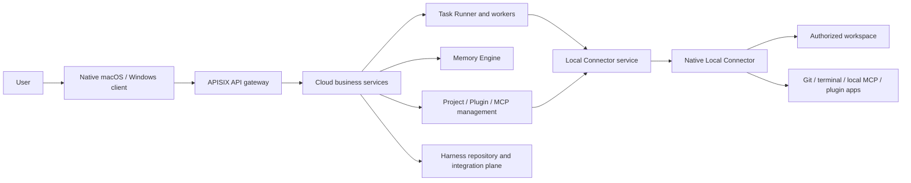

# Okra

English · [简体中文](./README.zh-CN.md)

> Bring AI into your project—and get things done.

Okra is the product built by this repository. The codebase and protocols still use the ChatOS name in many places.

Okra is a native desktop AI workspace for long-running project collaboration. It connects conversation, plans, background tasks, project memory, local files, Git, terminals, MCP tools, plugins, and human approvals in one reviewable workflow.

## What the project is today

- **Native desktop clients:** independent SwiftUI and WinUI applications for macOS and Windows. The retired Electron client is no longer the product runtime.
- **Cloud orchestration:** conversations, tasks, requirements, agents, configuration, plugin metadata, and memory are managed by server-side services.
- **Device-side execution:** every project binds an explicitly authorized local workspace. Files, Git, commands, local MCP servers, plugin applications, and device permissions execute through the Local Connector built into the native client.
- **Observable background work:** complex requests can become resumable tasks with progress, logs, tool calls, approvals, retries, and final results.
- **Long-term project context:** conversation summaries, project facts, and role-specific memory can be reused across sessions.
- **Extensible local capabilities:** the plugin platform supports MCP servers, skills, managed artifacts, and sandboxed local application surfaces.

Okra does not silently move a device-scoped operation to a server filesystem or another machine. If the bound Local Connector is offline, the operation waits or fails explicitly.

## Architecture


```mermaid
flowchart LR
    U[User] --> C[Native macOS / Windows client]
    C --> G[APISIX API gateway]
    G --> S[Cloud business services]
    S --> T[Task Runner and workers]
    S --> M[Memory Engine]
    S --> P[Project / Plugin / MCP management]
    T --> L[Local Connector service]
    P --> L
    L --> N[Native Local Connector]
    N --> W[Authorized workspace]
    N --> X[Git / terminal / local MCP / plugin apps]
    S --> H[Harness repository and integration plane]
```

The boundary is intentional:

- Cloud services are authoritative for account and project business data.
- The native client is authoritative for local credentials, workspace authorization, and device capabilities.
- Local Connector uses outbound connectivity and exposes only the workspace and capabilities the user authorized.
- Harness manages repositories, synchronization, CI, and integrations; it is not a fallback project filesystem or command executor.

## Product areas

### Conversation, planning, and tasks

Okra supports direct conversation and structured project work. Requirements can be refined into plans and dependency-aware tasks, then executed through a background task lifecycle. Users can inspect intermediate output, provide additional guidance, approve sensitive actions, stop work, and retry failures.

### Project workspace

The native clients provide project browsing, full-text search, file viewing and editing, Git state and diffs, terminals, run configurations, logs, and project-scoped resource creation. Workspace operations remain inside the authorized local boundary.

### Agents and memory

Projects can use different AI contacts with their own role, model, skills, and tool capabilities. The memory system maintains conversation summaries and reusable project context instead of relying on one unbounded chat transcript.

### Native desktop capabilities

The macOS client includes project workspaces, task views, plugin applications, a local connector control surface, an optional desktop pet, and local-only global utilities such as quick search, clipboard history, screenshots, long screenshots, and screen recording.

The Windows client follows the same product protocols and visual language with its own WinUI implementation, native Local Connector, packaging flow, and Network Guard. Platform-specific parity is tracked explicitly because the clients do not share UI source code.

See [clients/README.md](./clients/README.md), [clients/macos/README.md](./clients/macos/README.md), and [clients/windows/README.md](./clients/windows/README.md).

## First-party plugins

| Plugin | Purpose |
| --- | --- |
| [Browser](./plugins/browser/README.md) | CDP-based browser automation for managed Chromium or explicitly shared Chrome tabs. |
| [Computer Use](./plugins/computer-use/README.md) | Visual-first native computer control using real screenshots and platform input APIs. |
| [Document Tools](./plugins/document/README.md) | Workspace-bounded Word, Excel, PowerPoint, and PDF inspection, rendering, creation, and editing. |
| [Diagram Studio](./plugins/diagram-studio/README.md) | AI-editable visual diagrams with a local workbench and PlantUML interoperability. |

Plugins can combine MCP servers, skills, permission declarations, managed artifacts, and local application surfaces. Runtime data is isolated by user and project where the plugin contract requests it.

## Repository map

| Path | Responsibility |
| --- | --- |
| `clients/macos` | Swift 6.2 / SwiftUI native client and macOS Local Connector. |
| `clients/windows` | .NET 8 / WinUI 3 native client, Windows Local Connector, Network Guard, and installer. |
| `chatos/backend` | Main ChatOS API and conversation orchestration service. |
| `task_runner_service/backend` | Background task API, workers, scheduler, and tool runtime. |
| `project_management_service/backend` | Projects, requirements, plans, execution context, and Harness integration. |
| `memory_engine/backend` | Conversation summaries and layered project/subject memory. |
| `mcp_management_service/backend` | MCP capability materialization, routing, and runtime sessions. |
| `plugin_management_service/backend` | Plugin catalog, releases, packages, and runtime capability metadata. |
| `local_connector_service/backend` | Cloud routing and coordination for native Local Connectors. |
| `user_service/backend` | Accounts, authentication, model providers, and user settings. |
| `config_center_service/backend` | Dynamic service configuration and release publication. |
| `plugins` | First-party plugins and their packaging metadata. |
| `crates` | Shared Rust protocols, SDKs, runtimes, auth, sandbox, and observability libraries. |
| `admin_console` | React administration console. |
| `official_website_service` | Product website, registration, and client release distribution. |
| `docker` | Compose topology, deployment scripts, gateway, and observability configuration. |

The root Rust workspace is defined in [Cargo.toml](./Cargo.toml). Memory Engine remains a separate Rust workspace and is built explicitly by the Makefile.

## Run the cloud stack

### Prerequisites

- Docker Engine and Docker Compose v2
- Bash and OpenSSL
- `make` (recommended)

### Prebuilt images

```bash
cp docker/bootstrap.conf.example docker/bootstrap.conf
# Replace development credentials before using a shared or production environment.
make docker-up
```

The default deployment pulls prebuilt images. After startup:

- Product website: <http://localhost:39251>
- Unified API gateway: <http://localhost:9080>
- Harness: <http://localhost:3000>
- Grafana: <http://localhost:3001>

Useful operations:

```bash
make docker-ps
make docker-logs
make docker-fast
make docker-down
```

`make docker-reset` also removes Compose volumes, including persistent databases. Use it only when a full local reset is intended.

### Build the stack from source

```bash
make dev
```

To rebuild only selected Compose services:

```bash
make docker-rebuild SERVICES="chatos-backend task-runner-backend"
```

For faster host-side backend and administration frontend development:

```bash
make local-dev
make local-dev-status
make local-dev-logs SERVICE=chatos-backend
make local-dev-stop
```

Detailed deployment guidance is in [INSTALL_GUIDE.zh-CN.md](./INSTALL_GUIDE.zh-CN.md).

## Run native clients

### macOS

Requires macOS 14+ and Swift 6.2+:

```bash
swift run --package-path clients/macos ChatOSSwift
make test-macos-client
clients/macos/scripts/package-debug-app.sh
```

Source runs default to the local gateway at `http://127.0.0.1:9080/api/chatos`. Use `CHATOS_API_BASE_URL` and `CHATOS_LOCAL_CONNECTOR_CLOUD_BASE_URL` to target another environment.

### Windows

Requires Windows, .NET 8, and the Windows App SDK / WinUI workload for development:

```powershell
./clients/windows/build/bootstrap.ps1
./clients/windows/build/test.ps1
./clients/windows/build/build.ps1
```

To build the self-contained installer on Windows:

```powershell
./clients/windows/scripts/package-client.ps1
```

The packaging script can bootstrap missing local tooling and produces a self-contained installer under `clients/windows/BundleArtifacts/`.

## Build and verify

The repository pins Rust `1.94.0` with Clippy and rustfmt.

```bash
make build          # Rust services plus administration/website frontends
make smoke          # repository policies, scripts, and Compose validation
make verify-fast    # quality policies and Rust lint
make test           # smoke checks and core service tests
make verify         # full Rust and frontend verification
```

Native clients and plugins have platform-specific targets:

```bash
make test-macos-client
make test-browser-plugin
make test-document-plugin
npm --prefix plugins/diagram-studio test
```

`make test-plugins` runs the Browser, Computer Use, and Document plugin suites together. Diagram Studio has its own npm test target. Run only the targets supported by the current host; Windows client and Windows Computer Use validation must run on Windows.

## Configuration and security notes

- `docker/bootstrap.conf` contains only infrastructure bootstrap values needed before Configuration Center is available. Do not commit it.
- Business settings, model configuration, service policies, and releases are published through Configuration Center.
- The root [.env.example](./.env.example) is for host-side Local Connector settings, not cloud service configuration.
- Production deployments must replace all sample credentials and provision service-specific mTLS material outside Git.
- Project file, terminal, Git, plugin, and device operations are constrained by workspace authorization and permission policy.
- Content required for model inference may be sent to the model provider configured by the user or deployment.

## Current status

Okra is under active development. Keep these constraints in mind:

- A project workspace requires its bound native Local Connector to be online for local operations.
- macOS and Windows share protocols and product intent, but platform-specific features can land at different times.
- Existing-Chrome Browser Bridge distribution still depends on its published Chrome Web Store identity; managed-browser mode is independently usable.
- Historical data from the retired Electron client is not automatically treated as the authoritative state of the current cloud-native product.

## More documentation

- [Installation and deployment guide](./INSTALL_GUIDE.zh-CN.md)
- [Native client architecture and plans](./clients/macos/docs/README.md)
- [Windows client implementation and acceptance docs](./clients/windows/docs/01-windows-client-implementation-plan.md)
- [Plugin overview](./plugins/README.md)
- [SDK usage](./SDK_USAGE.md)
- [Third-party notices](./THIRD_PARTY_NOTICES.md)

## License

The main repository is licensed under the [PolyForm Noncommercial License 1.0.0](./LICENSE). Some first-party plugins and third-party components use their own licenses; see their directories and [THIRD_PARTY_NOTICES.md](./THIRD_PARTY_NOTICES.md).
