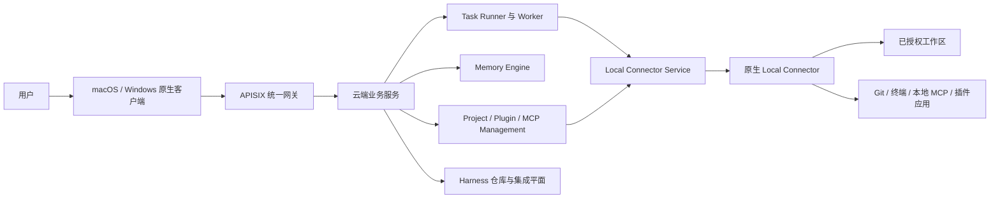

# Okra

[English](./README.md) · 简体中文

> 让 AI 进入项目，把事情做完。

Okra 是这个仓库正在构建的产品；代码、服务与协议中仍有许多地方沿用 ChatOS 名称。

Okra 是一套面向长期项目协作的原生桌面 AI 工作空间。它把对话、计划、后台任务、项目记忆、本机文件、Git、终端、MCP 工具、插件和人工审批连接成一条可以检查、干预和追踪的工作流。

## 现在的项目是什么

- **原生桌面客户端：** macOS 使用 SwiftUI，Windows 使用 WinUI，两端独立实现。已经退役的 Electron 客户端不再是产品运行时。
- **云端业务编排：** 对话、任务、需求、智能体、配置、插件元数据和记忆由服务端统一管理。
- **设备侧能力执行：** 每个项目绑定一个明确授权的本机工作区。文件、Git、命令、本地 MCP、插件应用和设备权限通过原生客户端内置的 Local Connector 执行。
- **可观察的后台任务：** 复杂需求可以进入可恢复的任务生命周期，持续保留进度、日志、工具调用、审批、重试和最终结果。
- **长期项目上下文：** 会话摘要、项目事实和角色记忆可以跨会话继续使用。
- **可扩展本机能力：** 插件平台支持 MCP Server、Skill、受管理产物以及沙箱化的本地应用界面。

Okra 不会把设备侧操作静默切换到服务端文件系统或另一台机器。绑定的 Local Connector 离线时，相关操作会明确等待或失败。

## 架构



这条边界是当前架构的核心：

- 云端服务是账号与项目业务数据的事实来源。
- 原生客户端负责本机凭据、工作区授权和设备能力。
- Local Connector 主动建立出站连接，只开放用户授权的工作区和能力。
- Harness 负责仓库、同步、CI 与集成，不是项目文件或命令执行的回退环境。

## 产品能力

### 对话、计划与任务

Okra 同时支持直接对话和结构化项目工作。需求可以逐步整理成计划与带依赖的任务，再进入后台任务生命周期。用户可以检查中间输出、发送补充引导、审批敏感操作、停止执行，并在失败后重试。

### 项目工作区

原生客户端提供项目文件浏览、全文搜索、查看与编辑、Git 状态与 Diff、终端、运行配置、实时日志和项目资源创建。所有工作区操作都保持在已授权的本机边界内。

### 智能体与记忆

不同项目可以选择不同的 AI 联系人，并分别配置角色、模型、Skill 和工具能力。记忆系统通过会话摘要与分层项目上下文支持长期协作，而不是无限堆积单个聊天记录。

### 原生桌面能力

macOS 客户端已经包含项目工作区、任务视图、插件应用、Local Connector 管理、可选桌面宠物，以及完全在本机运行的全局快速搜索、剪贴板历史、区域/长截图和录屏等效率工具。

Windows 客户端使用相同的产品协议与视觉语言，同时拥有独立的 WinUI 实现、原生 Local Connector、安装打包流程和 Network Guard。由于两端不共享 UI 源码，平台差异与能力同步会单独登记和验收。

详细说明见 [clients/README.md](./clients/README.md)、[clients/macos/README.md](./clients/macos/README.md) 和 [clients/windows/README.md](./clients/windows/README.md)。

## 第一方插件

| 插件 | 用途 |
| --- | --- |
| [Browser](./plugins/browser/README.md) | 基于 CDP 操作受管理 Chromium，或用户明确共享的 Chrome 标签页。 |
| [Computer Use](./plugins/computer-use/README.md) | 以真实截图为事实来源，通过平台原生输入能力执行可视化电脑操作。 |
| [Document Tools](./plugins/document/README.md) | 在工作区边界内检查、渲染、创建和编辑 Word、Excel、PowerPoint 与 PDF。 |
| [Diagram Studio](./plugins/diagram-studio/README.md) | 带本地可视化工作台、可由 AI 编辑并支持 PlantUML 互操作的图表工具。 |

插件可以同时声明 MCP Server、Skill、权限、受管理产物和本地应用界面。需要隔离运行数据的插件会按用户和项目建立独立数据目录。

## 仓库结构

| 路径 | 职责 |
| --- | --- |
| `clients/macos` | Swift 6.2 / SwiftUI 原生客户端与 macOS Local Connector。 |
| `clients/windows` | .NET 8 / WinUI 3 原生客户端、Windows Local Connector、Network Guard 与安装器。 |
| `chatos/backend` | ChatOS 主 API 与对话编排服务。 |
| `task_runner_service/backend` | 后台任务 API、Worker、Scheduler 与工具运行时。 |
| `project_management_service/backend` | 项目、需求、计划、执行上下文与 Harness 集成。 |
| `memory_engine/backend` | 会话摘要与分层项目/主题记忆。 |
| `mcp_management_service/backend` | MCP 能力物化、路由与运行会话。 |
| `plugin_management_service/backend` | 插件目录、版本、安装包与运行能力元数据。 |
| `local_connector_service/backend` | 原生 Local Connector 的云端路由与协调。 |
| `user_service/backend` | 账号、认证、模型供应商与用户设置。 |
| `config_center_service/backend` | 动态服务配置与版本发布。 |
| `plugins` | 第一方插件及其打包元数据。 |
| `crates` | Rust 共享协议、SDK、运行时、认证、沙箱与可观测性库。 |
| `admin_console` | React 管理控制台。 |
| `official_website_service` | 官网、注册和客户端版本分发。 |
| `docker` | Compose 拓扑、部署脚本、网关与可观测性配置。 |

根 Rust workspace 定义在 [Cargo.toml](./Cargo.toml)。Memory Engine 保持独立 Rust workspace，由 Makefile 显式构建和测试。

## 启动云端服务

### 前置依赖

- Docker Engine 与 Docker Compose v2
- Bash 与 OpenSSL
- `make`（推荐）

### 使用预构建镜像

```bash
cp docker/bootstrap.conf.example docker/bootstrap.conf
# 共享环境或生产环境必须先替换示例凭据。
make docker-up
```

默认部署会拉取预构建镜像。启动后常用入口：

- 产品官网：<http://localhost:39251>
- 统一 API 网关：<http://localhost:9080>
- Harness：<http://localhost:3000>
- Grafana：<http://localhost:3001>

常用运维命令：

```bash
make docker-ps
make docker-logs
make docker-fast
make docker-down
```

`make docker-reset` 还会删除 Compose volumes，包括持久化数据库；只有明确需要清空本机环境时才应使用。

### 从当前源码构建

```bash
make dev
```

只重建部分 Compose 服务：

```bash
make docker-rebuild SERVICES="chatos-backend task-runner-backend"
```

需要更快地调试后端与管理前端时，可以使用宿主机开发栈：

```bash
make local-dev
make local-dev-status
make local-dev-logs SERVICE=chatos-backend
make local-dev-stop
```

更完整的部署说明见 [INSTALL_GUIDE.zh-CN.md](./INSTALL_GUIDE.zh-CN.md)。

## 运行原生客户端

### macOS

要求 macOS 14+ 与 Swift 6.2+：

```bash
swift run --package-path clients/macos ChatOSSwift
make test-macos-client
clients/macos/scripts/package-debug-app.sh
```

源码运行默认连接 `http://127.0.0.1:9080/api/chatos`。可以通过 `CHATOS_API_BASE_URL` 和 `CHATOS_LOCAL_CONNECTOR_CLOUD_BASE_URL` 指向其他环境。

### Windows

开发环境需要 Windows、.NET 8，以及 Windows App SDK / WinUI 工作负载：

```powershell
./clients/windows/build/bootstrap.ps1
./clients/windows/build/test.ps1
./clients/windows/build/build.ps1
```

在 Windows 上生成自包含安装器：

```powershell
./clients/windows/scripts/package-client.ps1
```

打包脚本可以自动补齐缺少的本机工具，并在 `clients/windows/BundleArtifacts/` 下生成自包含安装包。

## 构建与验证

仓库固定使用 Rust `1.94.0`，并安装 Clippy 与 rustfmt。

```bash
make build          # Rust 服务及管理控制台/官网前端
make smoke          # 仓库规则、脚本与 Compose 配置检查
make verify-fast    # 质量规则与 Rust lint
make test           # smoke 与核心服务测试
make verify         # 完整 Rust 与前端验证
```

原生客户端与插件使用平台相关目标：

```bash
make test-macos-client
make test-browser-plugin
make test-document-plugin
npm --prefix plugins/diagram-studio test
```

`make test-plugins` 会一起运行 Browser、Computer Use 和 Document 三套插件测试；Diagram Studio 使用独立的 npm 测试目标。请只运行当前宿主机支持的目标，Windows 客户端与 Windows Computer Use 的验证必须在 Windows 上完成。

## 配置与安全边界

- `docker/bootstrap.conf` 只保存 Configuration Center 可用前所需的基础设施引导值，不得提交。
- 业务设置、模型配置、服务策略和版本发布统一通过 Configuration Center 管理。
- 根目录 [.env.example](./.env.example) 用于宿主机 Local Connector 设置，不是云端服务配置文件。
- 生产部署必须替换全部示例凭据，并在 Git 之外提供每个服务独立的 mTLS 材料。
- 项目文件、终端、Git、插件和设备操作同时受到工作区授权与权限策略约束。
- 模型推理所需内容仍可能发送给用户或部署方配置的模型供应商。

## 当前状态

Okra 仍在快速开发中，需要留意：

- 本机操作要求项目绑定的原生 Local Connector 在线。
- macOS 与 Windows 共享协议和产品目标，但平台专属能力可能不会在同一时间完成。
- Browser 的 Existing Chrome Bridge 正式分发仍依赖 Chrome Web Store 固定扩展 ID；受管理浏览器模式可以独立使用。
- 已退役 Electron 客户端的历史数据不会自动成为当前云原生产品的权威状态。

## 更多文档

- [安装与部署指南](./INSTALL_GUIDE.zh-CN.md)
- [macOS 客户端架构与实施文档](./clients/macos/docs/README.md)
- [Windows 客户端实施与验收文档](./clients/windows/docs/01-windows-client-implementation-plan.md)
- [插件总览](./plugins/README.md)
- [SDK 使用说明](./SDK_USAGE.md)
- [第三方组件说明](./THIRD_PARTY_NOTICES.md)

## License

主仓库使用 [PolyForm Noncommercial License 1.0.0](./LICENSE)。部分第一方插件和第三方组件使用各自的许可证，详见对应目录与 [THIRD_PARTY_NOTICES.md](./THIRD_PARTY_NOTICES.md)。
