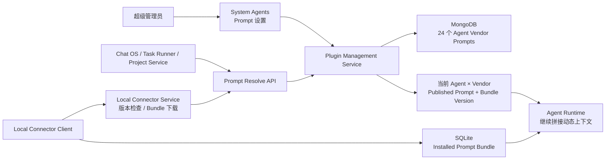

# 系统智能体按模型厂商统一管理 Prompt 实施方案

## 0. 实施状态（2026-07-16）

本方案的核心代码已经实施完成。目标 Agent 不会使用旧 Prompt 静默兜底：

- [x] 共享 SDK：固定四厂商、Agent Key、checksum、Resolve/Manifest/Bundle DTO 与 Client；
- [x] Plugin Management：24 份基线 Prompt、Draft/Publish、完整性、全局 Bundle Version、内部 Resolve/Manifest/Bundle API；
- [x] Local Connector Service：Manifest 与 Bundle 的受保护代理接口；
- [x] Local Connector Client：SQLite 表、事务安装、版本检测、手动更新设置页；
- [x] 本地 Chat、Plan、Task Runner、环境初始化、命令审批只读取已安装 SQLite Prompt；
- [x] 本地模型供应商支持 `prompt_vendor`；
- [x] User Service 完成供应商级 `prompt_vendor` 配置并向 ChatOS、Project Management、Task Runner 传播；
- [x] ChatOS、Project Management、Task Runner 云端运行时在每个 Run 前解析当前 Published Prompt；
- [x] 删除目标六类 Agent 的迁移期硬编码 Prompt 正文和 fallback；
- [x] Plugin Management 支持使用用户云端模型生成 Prompt 草稿，生成结果不会自动保存或发布；
- [x] 客户端启动、手动检查及每 15 分钟后台检查 Manifest，只提示可更新，不自动覆盖；
- [x] 完成后端测试、主要 Rust 工程编译检查及相关前端生产构建；
- [x] 完成 macOS arm64 客户端打包和 DMG 完整性校验。

客户端更新流程固定为：自动检查版本、用户手动确认、下载完整 Bundle、checksum/完整性校验、单事务替换 SQLite 当前版本。任何下载或安装失败都保留原安装版本。客户端运行 Agent 时不请求云端 Prompt。

当前实现边界：每个 `agent_key + vendor` 只保存当前 Published 版本；客户端不保存 Draft 和历史版本；本期不迁移历史数据。服务端 seed 不会覆盖已经存在的 Prompt 记录，已有开发数据库如需采用新的基线内容，应由管理员编辑并重新发布。

## 1. 最终需求定义

本方案的最终目标是：

> Plugin Management Service 成为所有系统 Agent 基础系统 Prompt 的唯一发布权威。云端运行时读取当前 Published Prompt；客户端把用户确认安装的 Published Prompt Bundle 保存到本地 SQLite，并仅从本地已安装版本执行。代码中不再保留 Agent Prompt 正文，也不使用硬编码 Prompt fallback。

每个系统 Agent 按四个固定模型厂商分别维护一份完整 Prompt：

- `glm`：GLM；
- `deepseek`：DeepSeek；
- `gpt`：GPT / OpenAI；
- `kimi`：Kimi / Moonshot。

同一个厂商下的所有模型共用同一份 Prompt，不细分到模型名称或模型版本。

初始化时，每个 Agent 先形成一份与当前代码行为一致的基线 Prompt，再把同一份基线内容同时发布为 `glm/deepseek/gpt/kimi` 四个厂商的默认 Prompt。管理员后续可以在页面中分别编辑，四个厂商版本从此独立演进。

用户描述中的 `gml` 按 `glm` 理解，`kmini` 按 `kimi` 理解。

## 2. “不再硬编码”的准确含义

### 2.1 必须从 Plugin Management 获取的内容

以下稳定的 Agent 指令内容必须迁移到 Plugin Management：

- Agent 身份和职责；
- Agent 工作范围；
- 禁止处理的业务范围；
- 工具使用策略；
- 执行步骤；
- 输出要求；
- 针对 GLM、DeepSeek、GPT、Kimi 的表达和工具调用适配；
- 当前硬编码在 Agent `system_prompt()`、Task Runner 通用规则、本地环境分析 Prompt 中的稳定自然语言指令。

最终运行时不得从 Rust、TypeScript、Markdown `include_str!` 或环境变量中获取这些 Agent Prompt 正文。

### 2.2 继续保留在代码中的内容

原有 Prompt 拼接机制继续存在，但代码只负责拼接和提供本轮动态数据：

- 当前用户的 System Context；
- Contact；
- Memory；
- Workspace；
- 本轮用户消息；
- 当前项目、任务、运行 ID、文件扫描结果；
- MCP / Skill 的动态可用性；
- Tool Schema 和实际注册工具；
- 结构化运行数据；
- Rust 层的权限校验、工作区边界、输入输出校验和安全阻断。

这些内容不是一个可以提前存入 Plugin Management 的固定 Agent Prompt。

代码可以继续把动态数据序列化成 JSON 或明确的上下文区块，但不应继续携带大段固定的 Agent 身份、流程和供应商适配说明。

### 2.3 最终拼接关系

最终运行时的拼接关系是：

```text
Plugin Management 返回的 Agent × 厂商完整基础 Prompt
+ 用户 System Context / Contact / Memory / Workspace
+ MCP Provider Skills / Local Skills
+ 本轮项目、任务、审批请求等动态上下文
```

原有各段动态上下文仍正常拼接，只是 Agent 基础 Prompt 的来源从代码改为 Plugin Management。

## 3. 不做的事情

本期不做：

- 不按具体模型区分 Prompt；
- 不按语言再拆 `zh-CN/en-US`；
- 不建设任意供应商目录；
- 不支持管理员自定义第五个 vendor；
- 不根据具体模型名选择 Prompt；
- 不新增独立 Prompt Gateway 微服务；
- 不让客户端直连 Plugin Management；
- 不允许运行时回退到代码硬编码 Prompt；
- 不把 API Key、模型凭据或用户数据存入 Prompt；
- 不用 Prompt 代替 Rust 层权限和安全校验。

## 4. 当前代码现状

### 4.1 当前存在硬编码 Agent Prompt

| 场景 | 当前代码 | 最终处理 |
| --- | --- | --- |
| Project Environment Agent 身份 Prompt | `agent/src/implementations/project_environment.rs` | 正文迁入 Plugin Management，删除 `system_prompt()` 硬编码 |
| Local Command Approval Agent Prompt | `agent/src/implementations/command_approval.rs` | 正文迁入 Plugin Management，删除硬编码；Rust 权限校验保留 |
| Cloud Project Environment 固定流程 | `project_management_service/backend/src/services/environment_agent.rs` | 稳定指令迁入 Prompt；代码只构造本轮项目数据 |
| Local Project Environment 固定说明 | `local_connector_client/core/src/local_runtime/environment/prompt.rs` | 稳定指令迁入 Prompt；代码只发送扫描证据和动态数据 |
| Task Runner 通用工程规则 | `task_runner_service/backend/src/services/prerequisite_context.rs` | 稳定规则迁入 `task_runner_run_phase` Prompt；代码只构造任务和前置结果 |
| Chat OS Conversation / Planning / Requirement Planner | `chatos/backend/src/modules/conversation_runtime/*` | 新增 Plugin Prompt 作为基础 Prompt，现有用户/Contact/Workspace/MCP 拼接不变 |
| Local Chat | `local_connector_client/core/src/local_runtime/chat/execution.rs` | 从本地 SQLite 读取用户已安装的 Plugin Prompt Bundle，再走现有拼接 |

### 4.2 当前系统 Agent 清单

权威清单在 `agent/src/catalog.rs`：

1. `chatos_conversation_agent`
2. `chatos_planning_agent`
3. `project_requirement_execution_planner_agent`
4. `task_runner_run_phase`
5. `project_management_agent`
6. `local_connector_command_approval_agent`

最终需要维护 `6 × 4 = 24` 个已发布 Prompt。

### 4.3 客户端通过现有服务检查并同步 Prompt Bundle

Local Connector Client 已经统一访问 `local_connector_service`，因此不需要再新建独立网关微服务，但需要在该服务增加版本检查与 Bundle 下载代理接口。

目标调用链：

```text
Local Connector Client
  -> GET Local Connector Service /api/plugin-management/agent-prompts/manifest
  -> 检测远端 bundle_version
  -> 用户在设置页点击更新
  -> GET Local Connector Service /api/plugin-management/agent-prompts/bundle
  -> Plugin Management Internal Prompt Bundle API
  -> 校验并事务写入客户端 SQLite
```

客户端只自动检查轻量版本信息，不自动覆盖本地 Prompt。用户确认更新后下载完整 Published Bundle。Agent Runtime 不在每次执行前请求云端，而是只读取 SQLite 中当前已安装版本。

相关网关代码落点：

- `local_connector_service/backend/src/api/router.rs`
- 新增 `local_connector_service/backend/src/api/plugin_management_prompts.rs`
- `local_connector_service/backend/src/state.rs`
- `crates/chatos_plugin_management_sdk/src/client.rs`

## 5. 目标架构



## 6. 固定模型厂商定义

### 6.1 共享枚举

在 `chatos_plugin_management_sdk` 增加：

```rust
#[derive(Debug, Clone, Copy, PartialEq, Eq, Hash, Serialize, Deserialize)]
#[serde(rename_all = "snake_case")]
pub enum AgentPromptVendor {
    Glm,
    Deepseek,
    Gpt,
    Kimi,
}
```

对外 key 固定为：

```text
glm
deepseek
gpt
kimi
```

Plugin Management Backend、Frontend、SDK 和所有消费者统一使用该枚举，不得复制字符串数组。

### 6.2 现有 provider 归一

共享 SDK 提供唯一归一方法：

```rust
pub fn normalize_agent_prompt_vendor(
    explicit_prompt_vendor: Option<&str>,
    model_provider: &str,
) -> Option<AgentPromptVendor>;
```

规则：

| 模型配置 provider / alias | Agent Prompt Vendor |
| --- | --- |
| `glm`、`zhipu`、`zai`、`chatglm` | `glm` |
| `deepseek` | `deepseek` |
| `gpt`、`openai` | `gpt` |
| `kimi`、`kimik2`、`moonshot` | `kimi` |
| 其他 | 无法识别 |

### 6.3 OpenAI-Compatible

`openai_compatible` 不能说明背后厂商，因此模型供应商配置需要增加：

```text
prompt_vendor: glm | deepseek | gpt | kimi | null
```

该字段归属于模型供应商，不归属于单个模型：

```text
Model Provider: 公司 GLM 网关
provider: openai_compatible
prompt_vendor: glm
models:
  - glm-4-plus
  - glm-4.5
  - glm-5
```

这些模型全部使用同一个 `glm` Agent Prompt。

选择优先级：

```text
显式 prompt_vendor
-> 根据 provider alias 归一
-> 无法识别，运行失败
```

不得根据具体模型名称选择 Prompt。

## 7. Plugin Management 数据模型

### 7.1 Collection

新增：

```text
plugin_agent_provider_prompts
```

建议 Record：

```rust
pub struct AgentProviderPromptRecord {
    pub id: String,
    pub agent_key: String,
    pub vendor: AgentPromptVendor,

    pub draft_content: Option<String>,
    pub published_content: Option<String>,
    pub published_revision: i64,
    pub published_checksum: Option<String>,

    pub enabled: bool,
    pub source_kind: String,
    pub generated_by_model_config_id: Option<String>,

    pub created_by: String,
    pub updated_by: String,
    pub published_by: Option<String>,
    pub created_at: String,
    pub updated_at: String,
    pub published_at: Option<String>,
}
```

稳定 ID：

```text
{agent_key}__prompt__{vendor}
```

例如：

```text
local_connector_command_approval_agent__prompt__glm
```

### 7.2 索引

- `id` 唯一；
- `(agent_key, vendor)` 唯一；
- `(agent_key, enabled)` 普通索引。

### 7.3 Draft 与 Published

云端运行时与客户端同步接口只读取：

```text
enabled = true
published_content 非空
published_revision > 0
```

管理员可以：

1. 编辑或 AI 生成到 `draft_content`；
2. 检查完整 Prompt；
3. 点击“发布生效”；
4. 发布时复制为 `published_content`，revision 加一并生成 checksum。

使用 Draft/Published 是必要的，因为 Plugin Management 是唯一发布权威，不能让半段编辑内容立即影响云端 Agent 或客户端可安装版本。

### 7.4 完整性要求

最终切换到无硬编码模式前，所有启用的系统 Agent 必须具备四个已发布 Prompt。

Plugin Management 提供完整性状态：

```rust
pub struct AgentPromptCompleteness {
    pub agent_key: String,
    pub required_vendors: Vec<AgentPromptVendor>,
    pub published_vendors: Vec<AgentPromptVendor>,
    pub missing_vendors: Vec<AgentPromptVendor>,
    pub ready: bool,
}
```

系统智能体列表可以展示：

```text
Prompt：4/4 已配置
Prompt：2/4 缺失
```

### 7.5 四厂商默认 Prompt 初始化

每个 Agent 准备一份“当前行为基线 Prompt”，Plugin Management 初始化时把它复制成四个相同的 Published 版本：

```text
agent baseline prompt
  -> glm published revision 1
  -> deepseek published revision 1
  -> gpt published revision 1
  -> kimi published revision 1
```

初始化完成后四条记录完全独立。管理员编辑 DeepSeek Prompt 不会影响 GPT、GLM 或 Kimi。

基线 Prompt 的来源：

- 有明确 `system_prompt()` 的 Agent：迁移当前完整正文；
- Task Runner：迁移当前稳定的工程执行和完成规则；
- Cloud / Local Project Environment：把当前两条执行路径中的稳定公共规则合并为一份基线，动态项目数据继续由代码提供；
- Chat OS 三类 Agent：根据当前 Agent profile、descriptor 和现有工具使用行为整理平台级基线，不复制用户 System Context、Contact 或 Memory。

初始化资源建议放在 Plugin Management 的数据目录，而不是 Agent Runtime 代码中：

```text
plugin_management_service/backend/seed_data/agent_prompts/
  chatos_conversation_agent.md
  chatos_planning_agent.md
  project_requirement_execution_planner_agent.md
  task_runner_run_phase.md
  project_management_agent.md
  local_connector_command_approval_agent.md
```

Plugin Management Seeder 首次启动时读取每个基线文件，为四个 vendor 建立 Published revision 1；如果数据库已有管理员维护记录，重启不得覆盖。

这些文件只用于 Plugin Management 初始化。云端 Agent 通过 Prompt Resolve API 读取 MongoDB；客户端通过 Bundle API 安装到 SQLite 后从本地读取。两者都不直接读取 Seed 文件，也不存在代码硬编码 fallback。

### 7.6 Published Bundle 版本

Plugin Management 维护全局单调递增的：

```text
agent_prompt_bundle_version
```

只有影响运行时内容的操作才递增：

- 发布新的 Prompt；
- 启用或禁用已发布 Prompt；
- 管理员执行明确的 Published 内容替换。

保存 Draft、AI 生成 Draft、修改未发布内容都不递增 Bundle Version。

Bundle Version 用于客户端低成本检测更新；单条 Prompt 仍使用 `published_revision + checksum` 做精确校验。客户端只保存当前安装 Bundle，不保存历史 Bundle 和 Draft。

## 8. Plugin Management 管理 API

全部要求 `super_admin`。

```text
GET  /api/system-agents/{agent_key}/provider-prompts
PUT  /api/system-agents/{agent_key}/provider-prompts/{vendor}/draft
POST /api/system-agents/{agent_key}/provider-prompts/{vendor}/publish
POST /api/system-agents/{agent_key}/provider-prompts/{vendor}/generate/stream
GET  /api/system-agents/prompt-completeness
```

Draft 请求：

```json
{
  "content": "完整系统 Prompt",
  "expected_updated_at": "2026-07-16T..."
}
```

Publish 请求：

```json
{
  "expected_draft_checksum": "sha256:..."
}
```

删除已发布 Prompt 不建议直接提供。需要撤销时先发布替代版本；如果确实禁用，会导致对应厂商 Agent 无法执行。

## 9. AI 生成 Prompt

### 9.1 复用现有能力

`plugin_management_service/backend/src/api/mcps.rs` 已具备：

- 从 User Service 获取管理员模型；
- 服务端读取模型 API Key；
- `ModelRuntimeConfig`；
- SSE `started/thinking/chunk/done/error`；
- 流式生成结果完整性检查。

应把通用模型运行和 SSE 逻辑抽为共享模块，供 MCP Skill 优化与 Agent Prompt 生成共同使用。

### 9.2 生成输入

生成请求：

```json
{
  "source_model_config_id": "model_xxx",
  "requirement": "生成适配 DeepSeek 的完整 Task Runner 系统 Prompt",
  "reference_vendor": "gpt"
}
```

生成器获得：

- Agent descriptor；
- 目标 vendor；
- 当前 draft / published Prompt；
- 可选的其他厂商 Prompt 作为参考；
- 管理员要求。

AI 必须输出“完整 Agent 系统 Prompt”，不是增量补丁。

生成结果进入 Draft 编辑器，不自动发布。

### 9.3 生成模型与目标厂商分离

可以使用 GPT 模型生成 DeepSeek Prompt，也可以使用 Kimi 模型生成 GLM Prompt。

界面要分别显示：

- 目标厂商；
- 执行生成的模型。

## 10. Plugin Management 前端

### 10.1 系统智能体列表

修改：

```text
plugin_management_service/frontend/src/pages/SystemAgentsPage.tsx
```

每行操作：

```text
[配置 MCP] [Prompt 设置]
```

增加 Prompt 完整性状态：

```text
Prompt 4/4
Prompt 3/4
```

### 10.2 Prompt 设置页面

使用宽 Drawer 或大 Modal，固定四个 Tab：

```text
[GLM] [DeepSeek] [GPT] [Kimi]
```

每个 Tab 展示：

- 当前发布 revision；
- Published checksum；
- Draft 是否有未发布修改；
- 完整 Prompt 编辑器；
- AI 生成；
- 保存草稿；
- 发布生效。

页面提示：

> 此处维护的是当前 Agent 在该模型厂商下使用的完整基础系统 Prompt。运行时不会回退到代码内置 Prompt。同一厂商的所有模型共用该 Prompt。

### 10.3 发布前校验

- 内容非空；
- 最大 64 KiB；
- 不含明显 API Key、Bearer Token、私钥；
- 展示字符数和 checksum；
- 当前 Agent + vendor 已有 Published 时展示 Diff；
- 确认后发布。

## 11. Runtime Prompt Resolve 与客户端同步 API

### 11.1 Plugin Management 内部解析接口

新增专用运行时接口：

```text
POST /api/internal/runtime/agent-prompts/resolve
```

请求：

```json
{
  "agent_key": "task_runner_run_phase",
  "vendor": "deepseek"
}
```

响应：

```json
{
  "agent_key": "task_runner_run_phase",
  "vendor": "deepseek",
  "content": "完整 Published Prompt",
  "revision": 7,
  "checksum": "sha256:...",
  "published_at": "2026-07-16T..."
}
```

接口只返回精确的 `agent_key × vendor` Published Prompt，不返回其他三个厂商，也不返回 Draft。

同时增加客户端同步所需的内部接口：

```text
GET /api/internal/runtime/agent-prompts/manifest
GET /api/internal/runtime/agent-prompts/bundle
```

Manifest 只返回轻量版本数据：

```json
{
  "bundle_version": 18,
  "updated_at": "2026-07-16T10:00:00Z",
  "required": false
}
```

Bundle 返回当前全部启用、已发布的 `Agent × Vendor` Prompt，并携带统一 `bundle_version`。不返回 Draft 或历史版本。

### 11.2 内部鉴权

复用现有 Plugin Management Internal Service Token：

- audience：`plugin-management-service`；
- scope：新增 `agent-prompts.resolve` 与 `agent-prompts.sync`；
- 校验 caller service；
- 支持 `chatos-backend`、`task-runner`、`project-service`、`local-connector-service`。

Local Connector Client 自身不持有 Plugin Management 内部密钥。

### 11.3 Local Connector Service 网关接口

新增客户端可访问的受限接口：

```text
GET /api/plugin-management/agent-prompts/manifest
GET /api/plugin-management/agent-prompts/bundle
```

Local Connector Service 负责：

1. 校验客户端 Bearer Token；
2. 使用内部服务 Token 调用 Plugin Management；
3. Manifest 只返回版本、更新时间和是否强制更新；
4. Bundle 只返回允许在客户端执行的系统 Agent 和四个固定 vendor；
5. 不返回 Draft、管理员信息或历史版本；
6. 对 Bundle 响应设置合理大小限制。

### 11.4 客户端版本检查与手动更新语义

客户端在启动、登录、网络恢复、打开设置页和固定周期执行轻量版本检查：

```text
读取 SQLite installed_bundle_version
-> 请求远端 manifest
-> 比较 bundle_version
-> 有更新时在设置页显示提示
```

客户端不得因为检测到更新而自动替换本地 Prompt。用户点击“更新”后：

```text
下载完整 Published Bundle
-> 校验 Bundle 完整性
-> 校验每条 revision/checksum/content
-> SQLite 事务整体替换
-> 更新 installed_bundle_version
```

Agent Runtime 不请求远端 Prompt，只读取 SQLite 当前安装版本。更新失败时事务回滚，继续保留原安装版本。

## 12. 共享 SDK

### 12.1 DTO

在 `crates/chatos_plugin_management_sdk/src/dto.rs` 增加：

```rust
pub struct ResolveAgentPromptRequest {
    pub agent_key: SystemAgentKey,
    pub vendor: AgentPromptVendor,
}

pub struct ResolvedAgentPrompt {
    pub agent_key: String,
    pub vendor: AgentPromptVendor,
    pub content: String,
    pub revision: i64,
    pub checksum: String,
    pub published_at: String,
}

pub struct AgentPromptBundleManifest {
    pub bundle_version: i64,
    pub updated_at: String,
    pub required: bool,
}

pub struct AgentPromptBundle {
    pub bundle_version: i64,
    pub updated_at: String,
    pub prompts: Vec<ResolvedAgentPrompt>,
}
```

### 12.2 Client 方法

在 `crates/chatos_plugin_management_sdk/src/client.rs` 增加：

```rust
pub async fn resolve_agent_prompt_for_service(
    &self,
    request: &ResolveAgentPromptRequest,
) -> Result<ResolvedAgentPrompt, PluginManagementClientError>;

pub async fn get_agent_prompt_bundle_manifest_for_service(
    &self,
) -> Result<AgentPromptBundleManifest, PluginManagementClientError>;

pub async fn get_agent_prompt_bundle_for_service(
    &self,
) -> Result<AgentPromptBundle, PluginManagementClientError>;
```

云端消费者使用 Resolve API；Local Connector Service 使用 Manifest/Bundle API。

### 12.3 Vendor Resolver

在新文件 `src/agent_prompts.rs` 提供：

```rust
pub fn required_agent_prompt_vendor(
    explicit_prompt_vendor: Option<&str>,
    model_provider: &str,
) -> Result<AgentPromptVendor, AgentPromptResolutionError>;
```

错误类型至少包括：

```text
unsupported_model_vendor
agent_prompt_not_configured
agent_prompt_disabled
agent_prompt_empty
agent_prompt_checksum_invalid
agent_prompt_gateway_unavailable
```

不提供硬编码 fallback。SQLite 存储与读取由 Local Connector Client 自己实现，共享 SDK 只负责 vendor、DTO、checksum 和远端协议。

## 13. 云端运行时接入

### 13.1 通用规则

云端 Agent 每次执行前主动调用 Plugin Management Prompt Resolve API。

运行顺序调整为：

1. 解析当前模型配置；
2. 根据 `prompt_vendor/provider` 得到固定 vendor；
3. 使用 `agent_key + vendor` 主动请求 Plugin Management；
4. 校验返回的 agent、vendor、revision、checksum 和 content；
5. 获取失败则本轮 Agent 明确失败；
6. 使用 Plugin Prompt 作为基础 system instructions；
7. 继续拼接原有动态上下文。

Plugin Management 不可用时，不允许回退到代码 Prompt，也不使用上一次 Run 的 Prompt。

### 13.2 Chat OS 三类 Agent

涉及：

- `chatos_conversation_agent`
- `chatos_planning_agent`
- `project_requirement_execution_planner_agent`

最终拼接：

```text
Plugin Management 的完整厂商 Agent Prompt
-> 用户 System Context
-> Contact Prompt
-> Workspace Prompt
-> Memory Context
-> MCP Provider Skills
-> 其他当前动态上下文
```

主要文件：

- `chatos/backend/src/services/plugin_management_capabilities.rs`
- `chatos/backend/src/modules/conversation_runtime/runtime_context.rs`
- `chatos/backend/src/modules/conversation_runtime/chat_execution.rs`

当前 `base_system_prompt` 不再承担系统 Agent 的平台基础 Prompt，只继续表示用户或请求提供的 System Context。

### 13.3 Task Runner

把以下稳定自然语言规则迁入四份 `task_runner_run_phase` Prompt：

- Agent 身份；
- 工程执行原则；
- 工具调用原则；
- 完成和验证要求；
- 各厂商适配表达。

`task_runner_service/backend/src/services/prerequisite_context.rs` 最终只负责动态内容：

- 当前任务标题和描述；
- Prompt override；
- 前置任务结果；
- 项目和运行上下文。

最终拼接：

```text
Plugin Management 的 Task Runner 厂商 Prompt
-> ModelConfig 中用户显式 instructions（如果产品仍允许）
-> External MCP / Provider Skills / 过程日志上下文
-> 当前任务动态 Prompt
```

主要文件：

- `task_runner_service/backend/src/services/plugin_management_policy.rs`
- `task_runner_service/backend/src/services/run_model_phase/setup/preparation.rs`
- `task_runner_service/backend/src/services/prerequisite_context.rs`
- `agent/src/implementations/task_runner.rs`

### 13.4 Cloud Project Environment Agent

迁移：

- `PROJECT_ENVIRONMENT_AGENT.system_prompt()` 正文；
- `build_project_environment_agent_prompt()` 中固定的角色、流程和约束说明。

代码只保留并发送本轮动态 JSON：

```json
{
  "run_id": "...",
  "project": {},
  "routing": {},
  "detected_stack": {},
  "required_services": [],
  "manifest_context": []
}
```

最终拼接：

```text
Plugin Management 的 project_management_agent 厂商 Prompt
-> MCP Provider Skills
-> 当前项目动态 JSON
```

主要文件：

- `agent/src/core/definition.rs`
- `agent/src/core/executor.rs`
- `agent/src/implementations/project_environment.rs`
- `project_management_service/backend/src/services/environment_agent.rs`

`ProjectEnvironmentAgent` 最终只保留 descriptor、message mode、source、overflow trigger 和默认模型参数，不再实现返回静态 Prompt 正文的方法。

## 14. Local Connector Client 接入

### 14.1 SQLite 当前安装 Bundle

新增客户端表：

```text
system_agent_prompts

agent_key
vendor
content
revision
checksum
bundle_version
published_at
synced_at

PRIMARY KEY (agent_key, vendor)
```

每个 `agent_key + vendor` 只保存当前安装的一条 Published Prompt，不保存 Draft 或历史版本。

新增同步状态表：

```text
system_agent_prompt_sync

installed_bundle_version
remote_bundle_version
update_available
last_checked_at
last_synced_at
source_instance_id
```

`source_instance_id` 用于避免客户端切换云端地址后误用其他控制面的 Prompt Bundle。

### 14.2 检查更新与手动安装

客户端自动执行轻量版本检查，但不自动更新正文：

```text
启动 / 登录 / 网络恢复 / 打开设置 / 固定周期
-> GET manifest
-> 比较 remote_bundle_version 与 installed_bundle_version
-> 设置 update_available
```

设置页展示：

```text
当前版本：17
最新版本：18
状态：发现新版本

[检查更新] [更新]
```

用户点击更新后下载完整 Bundle，完成条数、vendor、revision、checksum 和内容校验，再用单个 SQLite 事务整体替换。失败时回滚并继续保留原安装版本。

客户端首次没有 Prompt Bundle 时，设置页与 Agent Runtime 返回明确的 `agent_prompt_bundle_not_initialized`，引导用户完成一次初始化安装。

### 14.3 本地 Agent Runtime 读取

每次启动 Agent Run 时：

```text
读取当前模型 provider / prompt_vendor
-> 归一为 glm/deepseek/gpt/kimi
-> 从 SQLite 查询 agent_key + vendor
-> 校验 revision/checksum/content
-> 记录本轮 bundle_version/revision/checksum
-> 创建本轮 Agent Runtime
```

Agent Run 不请求远端 Prompt。代码中不保留 Prompt fallback；本地已安装 Bundle 就是客户端当前明确选择使用的版本。

### 14.4 Local Command Approval Agent

迁移 `COMMAND_APPROVAL_AGENT.system_prompt()` 全部自然语言内容到四份 Plugin Prompt。

每次审批 Agent 启动前，根据当前审批模型厂商从 SQLite 读取：

```text
local_connector_command_approval_agent × vendor
```

代码继续强制：

- 工具集合只有读取与 `approval_decision`；
- 不注册命令执行工具；
- 不注册写文件和网络工具；
- 对模型返回的 decision 做枚举校验；
- 工作区路径和请求权限由 Rust 校验。

最终拼接：

```text
SQLite 当前安装的 command approval 厂商 Prompt
-> MCP Provider Skills
-> 当前审批请求 JSON
```

主要文件：

- `local_connector_service/backend/src/api/mod.rs`
- `local_connector_service/backend/src/api/plugin_management_prompts.rs`
- `local_connector_client/core/src/approval/ai_agent.rs`
- `agent/src/implementations/command_approval.rs`

### 14.5 本地 Chat

Primary Agent 根据当前模式选择：

```text
普通对话 -> chatos_conversation_agent
Plan Mode -> chatos_planning_agent
需求执行规划 -> project_requirement_execution_planner_agent
```

最终拼接：

```text
SQLite 当前安装的完整厂商 Agent Prompt
-> request.system_prompt / 用户 System Context
-> Local Skills / MCP Capability Prompt
-> Memory / Task Board 等当前动态上下文
```

主要文件：

- `local_connector_client/core/src/local_runtime/capabilities/resolver.rs`
- `local_connector_client/core/src/local_runtime/capabilities/prompt.rs`
- `local_connector_client/core/src/local_runtime/chat/execution.rs`

### 14.6 本地 Project Environment

`environment_analysis_prompt()` 中稳定的身份、规则和输出要求迁入四份 `project_management_agent` Prompt。

代码只发送：

- project ID / name；
- 本机扫描证据；
- 当前运行状态；
- 需要模型处理的结构化数据。

每次环境分析 Run 前从 SQLite 读取：

```text
project_management_agent × vendor
```

主要文件：

- `local_connector_client/core/src/local_runtime/environment/runner.rs`
- `local_connector_client/core/src/local_runtime/environment/prompt.rs`
- `local_connector_client/core/src/local_runtime/model.rs`

### 14.7 本地 Task Runner

本地 `task_runner_run_phase` 每次 Run 前从 SQLite 读取厂商 Prompt，并记录本轮 bundle_version/revision/checksum。

不调用云端 Task Runner 服务获取 Prompt，不保留客户端内置 Task Runner Prompt。用户安装新 Bundle 前，所有新 Run 继续使用当前已安装版本。

## 15. Model Provider 的 prompt_vendor

### 15.1 字段归属

优先放在模型供应商记录上：

```rust
pub prompt_vendor: Option<AgentPromptVendor>
```

同一 Provider 下的所有模型继承该字段。

### 15.2 需要改造的模型配置面

- User Service Model Provider；
- Chat OS AI Model Manager；
- Task Runner 独立 ModelConfig；
- Local Connector Model Provider；
- Local Connector 前端模型配置页。

已知 provider 可以自动填充：

```text
gpt/openai -> gpt
deepseek -> deepseek
kimi/kimik2/moonshot -> kimi
glm/zhipu/zai -> glm
```

`openai_compatible` 必须由管理员选择其中一个，否则不能运行系统 Agent。

## 16. 迁移与切换方案

### 16.1 不能直接删除旧 Prompt

最终状态不保留硬编码，但迁移过程必须避免生产 Agent 突然没有 Prompt。

按以下顺序实施：

1. 先完成 Plugin Management 数据面和管理页面；
2. 从当前代码行为整理 6 份 Agent 基线 Prompt；
3. Plugin Management Seeder 把每份基线复制为四个厂商的 Published revision 1，共 24 条；
4. 管理员在页面检查默认内容，需要时先分别调整；
5. 完整性接口确认所有启用 Agent 都是 `4/4 ready`；
6. 云端消费者增加运行前 Resolve 能力，客户端增加 Bundle 同步、SQLite 存储和设置页更新能力；
7. 在预发布环境开启 `plugin_required` 模式；
8. 验证云端与客户端所有 Agent；
9. 生产切换到 Plugin Prompt；
10. 删除代码里的 Agent Prompt 正文和 legacy fallback 分支；
11. 删除临时迁移开关。

### 16.2 过渡模式

迁移期间可以临时存在：

```text
legacy_code
plugin_shadow
plugin_required
```

- `legacy_code`：当前生产行为；
- `plugin_shadow`：云端读取 Plugin Prompt，客户端下载但暂不安装，只记录 completeness/checksum；
- `plugin_required`：云端正式使用 Plugin Prompt，客户端正式使用 SQLite 已安装 Bundle，缺失即失败。

这些模式仅用于迁移。最终代码只能保留 `plugin_required`，不保留 `legacy_code` fallback。

### 16.3 无 Prompt 时的行为

最终生产规则：

| 情况 | 行为 |
| --- | --- |
| 模型厂商无法识别 | 失败：`unsupported_model_vendor` |
| 当前 Agent 对应厂商未发布 | 失败：`agent_prompt_not_configured` |
| Prompt 被禁用 | 失败：`agent_prompt_disabled` |
| checksum 不匹配 | 失败：`agent_prompt_checksum_invalid` |
| Plugin Management 请求失败 | 云端失败关闭 |
| 客户端未安装 Bundle | 失败：`agent_prompt_bundle_not_initialized` |
| 客户端已安装 Bundle 且暂时无法检查远端版本 | 继续使用当前安装版本，并显示版本检查失败 |
| Bundle 下载或校验失败 | 回滚更新，继续使用原安装版本 |

不允许自动使用 GPT Prompt 代替 GLM Prompt，也不允许使用代码硬编码内容。客户端只允许使用用户明确安装的当前 Bundle。

## 17. 主要文件改造清单

### 17.1 Plugin Management Backend

- `plugin_management_service/backend/src/models.rs`
- `plugin_management_service/backend/src/store.rs`
- `plugin_management_service/backend/src/store/indexes.rs`
- `plugin_management_service/backend/src/api.rs`
- `plugin_management_service/backend/src/api/agents.rs`
- 新增 `plugin_management_service/backend/src/api/agent_provider_prompts.rs`
- 新增 `plugin_management_service/backend/src/api/runtime_agent_prompts.rs`
- `plugin_management_service/backend/src/api/internal_auth.rs`
- 新增 `plugin_management_service/backend/seed_data/agent_prompts/*.md`
- `plugin_management_service/backend/src/seed.rs`
- 抽取 `plugin_management_service/backend/src/ai_generation/*`

### 17.2 Plugin Management Frontend

- `plugin_management_service/frontend/src/pages/SystemAgentsPage.tsx`
- 新增 `plugin_management_service/frontend/src/pages/agentPrompts/*`
- `plugin_management_service/frontend/src/api/client.ts`
- `plugin_management_service/frontend/src/types.ts`
- `plugin_management_service/frontend/src/i18n/messages.ts`
- `plugin_management_service/frontend/src/styles.css`

### 17.3 Shared SDK / Agent Runtime

- `crates/chatos_plugin_management_sdk/src/dto.rs`
- `crates/chatos_plugin_management_sdk/src/client.rs`
- `crates/chatos_plugin_management_sdk/src/lib.rs`
- 新增 `crates/chatos_plugin_management_sdk/src/agent_prompts.rs`
- `agent/src/core/definition.rs`
- `agent/src/core/executor.rs`
- `agent/src/implementations/project_environment.rs`
- `agent/src/implementations/command_approval.rs`
- `agent/src/implementations/task_runner.rs`

### 17.4 云端消费者

- 新增 `chatos/backend/src/services/plugin_management_prompts.rs`
- `chatos/backend/src/modules/conversation_runtime/runtime_context.rs`
- `chatos/backend/src/modules/conversation_runtime/chat_execution.rs`
- 新增 `task_runner_service/backend/src/services/plugin_management_prompts.rs`
- `task_runner_service/backend/src/services/run_model_phase/setup/preparation.rs`
- `task_runner_service/backend/src/services/prerequisite_context.rs`
- `project_management_service/backend/src/services/environment_agent.rs`

### 17.5 模型配置

- `user_service/backend/src/models.rs`
- `user_service/backend/src/api/models/*`
- `user_service/backend/src/store/model_configs.rs`
- User Service 模型 Provider 前端；
- `chatos/frontend/src/components/aiModelManager/*`
- `task_runner_service/backend/src/models/model_config.rs`
- `task_runner_service/frontend/src/pages/models/*`
- `local_connector_client/core/src/model_configs/*`
- `local_connector_client/frontend/src/components/ModelConfigPanel.tsx`

### 17.6 Local Connector

- 新增 `local_connector_service/backend/src/api/plugin_management_prompts.rs`
- `local_connector_service/backend/src/api/router.rs`
- `local_connector_service/backend/src/api/mod.rs`
- 新增 `local_connector_client/core/migrations/*_system_agent_prompts.sql`
- 新增 `local_connector_client/core/src/local_runtime/storage/agent_prompts/*`
- 新增 `local_connector_client/core/src/local_runtime/api/agent_prompts/*`
- 新增 `local_connector_client/core/src/plugin_management_prompts/*`
- `local_connector_client/core/src/local_runtime/chat/execution.rs`
- `local_connector_client/core/src/local_runtime/environment/runner.rs`
- `local_connector_client/core/src/local_runtime/environment/prompt.rs`
- `local_connector_client/core/src/approval/ai_agent.rs`
- 新增 `local_connector_client/frontend/src/components/AgentPromptUpdateSettings.tsx`
- `local_connector_client/frontend/src/main.tsx`

## 18. 测试方案

### 18.1 Plugin Management

- 只接受四个 vendor；
- 每个 Agent 固定显示四项；
- 首次初始化把同一 Agent 基线复制为四个内容相同的 Published revision 1；
- 管理员修改任一厂商后不影响另外三个，服务重启不覆盖；
- Runtime Resolve API 不返回 Draft；
- Manifest 只返回轻量版本信息；
- Published 内容变化会递增 bundle_version，Draft 变化不会递增；
- Bundle 只返回当前启用的 Published Prompt；
- Publish 后 revision/checksum 更新；
- 普通用户不能管理 Prompt；
- 完整性接口正确计算 0/4～4/4；
- AI 生成结果不会自动发布；
- Prompt 大小和 Secret Pattern 校验；
- Internal Resolve Scope 和 caller service 校验。

### 18.2 SDK

- provider alias 归一；
- 显式 `prompt_vendor` 优先；
- 不使用模型名；
- exact vendor 选择；
- 缺失时返回明确错误；
- 不存在代码 fallback API；
- checksum 校验；
- Manifest/Bundle DTO 和 Client 正确解析；
- Internal Prompt Resolve Client 正确处理 404/409/503。

### 18.3 Prompt 拼接

对每个 Agent 验证：

- 基础 Prompt 正文来自 Plugin Management；
- 代码中不存在原 Prompt 文本；
- 用户 System Context 仍正常拼接；
- Contact / Memory / Workspace 顺序不变；
- MCP Provider Skills / Local Skills 顺序不变；
- 动态项目、任务、审批 JSON 正常加入；
- 两个同厂商不同模型使用同 revision/checksum；
- 不同厂商使用各自 Prompt。

### 18.4 失败关闭

- Plugin Management 不可用时云端 Agent 不运行；
- vendor 不可识别时不运行；
- Prompt 缺失或禁用时不运行；
- checksum 错误时不运行；
- 不会回退到 legacy Prompt；
- 错误响应包含 agent_key、vendor 和可理解的错误码，但不包含 Prompt 正文。

### 18.5 Local Connector

- BFF 固定当前 owner；
- 客户端不直连 Plugin Management；
- 启动、登录、网络恢复、设置页和固定周期会检查远端版本；
- 检测到更新只提示，不自动安装；
- 用户点击更新后下载并事务安装完整 Bundle；
- 每个 `agent_key + vendor` 在 SQLite 只保留当前安装记录；
- 更新失败会回滚，不破坏原安装 Bundle；
- 每个新 Agent Run 只读取 SQLite，不请求远端 Prompt；
- 未初始化 Bundle 时返回明确错误并引导用户更新；
- 本地 Run 记录实际使用的 bundle_version/revision/checksum；
- 同一已安装 Bundle 内所有 Prompt 使用一致的 bundle_version。

## 19. 验收标准

实施完成必须满足：

- 系统智能体列表增加 `Prompt 设置`；
- 每个 Agent 固定维护 GLM、DeepSeek、GPT、Kimi 四份完整 Prompt；
- 同一厂商所有模型共用一份 Prompt；
- Prompt 支持 AI 生成、草稿和发布；
- 每个 Agent 的当前行为基线会同时初始化为四个厂商的 Published 默认 Prompt；
- 初始化后四个厂商版本可以分别编辑，互不影响；
- Plugin Management MongoDB 是 Agent Prompt 唯一发布权威；
- 运行时代码中不再存在 Agent Prompt 正文；
- 不存在硬编码 Prompt fallback；
- 云端每个 Agent Run 前通过 Internal Prompt Resolve API 主动获取 Published Prompt；
- Plugin Management 在 Published 内容变化时递增全局 bundle_version；
- 客户端可以自动检测新 Bundle 版本，但必须由用户点击更新；
- 客户端把完整 Published Bundle 事务写入 SQLite，每项只保留当前安装版本；
- 客户端每个 Agent Run 只读取 SQLite 已安装 Prompt，不远程拉取正文；
- 更新失败时保留原安装 Bundle；
- 客户端未初始化 Bundle 时明确提示用户完成初始化；
- Prompt 缺失、禁用、损坏或厂商无法识别时明确失败；
- 原有 System Context、Contact、Memory、Workspace、MCP、Skill 和动态任务上下文仍按当前方式拼接；
- Rust 权限、安全边界和工具注册继续独立生效；
- `openai_compatible` 通过供应商级 `prompt_vendor` 选择四类之一；
- 24 份 Prompt 未达到完整状态时不能切换到最终生产模式。

## 20. 最终建议

最终设计不是“硬编码 Prompt + 厂商补丁”，而是：

```text
Plugin Management 中的 Agent × Vendor 完整 Prompt
+ 当前运行时动态上下文
```

Plugin Management 是唯一发布权威；云端通过 Internal Prompt Resolve API 主动读取当前 Published Prompt，客户端通过 Local Connector Service 检查版本并由用户手动同步 Published Bundle 到 SQLite，Agent Run 只读取本地安装版本。

推荐先从当前代码行为整理 6 份基线 Prompt，并在 Plugin Management 中复制初始化为 24 份厂商默认 Prompt；确认全部发布完整后再切换运行时，最后删除 Agent Runtime 代码中的 Prompt 正文和所有 legacy fallback。后续管理员可以在页面里分别优化四个厂商版本。
