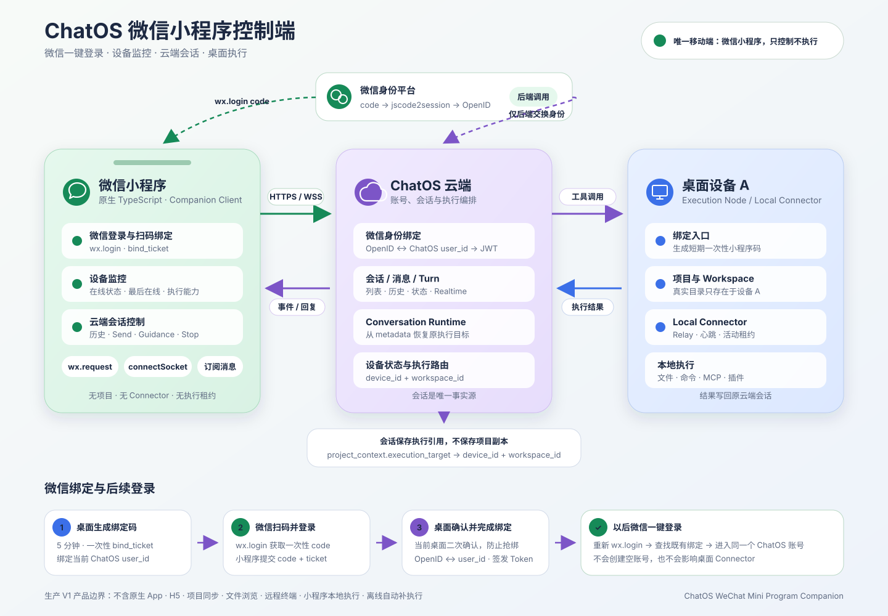

# ChatOS 微信小程序控制端实施方案

> 状态：生产产品实施基线<br>
> 唯一移动端交付物：微信小程序<br>
> 技术栈：原生微信小程序 + TypeScript<br>
> 产品范围：绑定 ChatOS 账号、监控桌面设备、查看桌面客户端侧边栏会话入口、向指定会话发送消息



界面视觉基线见 [Apple 风格微信小程序设计稿](./design/screens/wechat-mini-program-apple-ui.svg)。

## 1. 最终产品决定

ChatOS 不建设 iOS、Android 或 H5 移动客户端。移动入口统一为微信小程序。

小程序是 **Companion / Control Client（伴随控制端）**，不是执行设备：

- 使用微信身份进入已经存在的 ChatOS 账号。
- 查看同一账号下的桌面设备以及在线状态。
- 查看所选桌面客户端侧边栏中的联系人和项目入口，以及对应历史消息和当前运行状态。
- 查看用户消息关联任务的目标、状态、结果摘要和可公开执行过程。
- 向指定会话发送新消息。
- 对正在运行的 Turn 追加指导或停止执行。
- 回答或取消 Ask User，并处理原桌面设备当前等待中的本机操作审批。
- 接收执行完成、失败和等待用户输入等通知。

小程序永远不做：

- 项目创建、导入或同步。
- 文件树、终端、Git、插件和远程桌面。
- Local Connector、MCP 或 Agent Runtime 本地执行。
- 设备注册、Workspace 创建、Connector 心跳和活动租约获取。
- iOS、Android、PWA 或 H5 兼容层。

核心原则：**会话属于账号并保存在云端；项目与执行能力留在原桌面；微信小程序只控制会话。**

这是正式产品，不以“能够演示”为发布标准。工程阶段可以用垂直切片逐步集成，但只有账号恢复、安全防护、Realtime 对账、监控告警、隐私合规、灰度回滚和完整验收全部通过后，才允许对外发布生产 V1。

## 2. 为什么选原生微信小程序

当前移动需求只有三个主要页面和一条 Realtime 链路，原生小程序已经足够：

- `wx.login` 完成微信身份登录。
- `wx.request` 调用现有 REST API。
- `wx.connectSocket` 连接现有 WSS Realtime。
- 微信订阅消息承担有限的后台提醒。
- 无需维护 App Store、Android 商店、签名包和多套原生 UI。

推荐使用 TypeScript，而不是无类型 JavaScript；最终仍编译为微信小程序 JavaScript，但会话事件、消息 DTO 和 WebSocket Payload 可以获得编译期检查。

不引入 Taro、uni-app 或跨端框架。既然不计划其他移动端，原生小程序依赖更少、微信登录和 Socket 行为更直接。

## 3. 用户体验闭环

### 3.1 第一次绑定

推荐用桌面扫码绑定，不要求用户在小程序里再次输入 ChatOS 密码：

1. 用户已在桌面设备 A 登录 ChatOS。
2. 桌面客户端点击“绑定微信小程序”。
3. 服务端生成 2 分钟有效、一次性使用的 `bind_ticket`。
4. 桌面显示携带 `bind_ticket` scene 的小程序码。
5. 用户用微信扫码打开小程序。
6. 小程序调用 `wx.login()` 获取一次性 `code`。
7. 小程序把 `code + bind_ticket` 发给 ChatOS 后端。
8. 后端向微信 `jscode2session` 换取 `openid`，创建待确认的绑定申请。
9. 桌面端显示绑定申请并要求当前已登录用户确认，防止小程序码截图被他人抢绑。
10. 用户确认后，服务端原子绑定微信身份与当前 `user_id`。
11. ChatOS 返回自己的 Access Token，小程序进入设备与会话页面。

这里绑定的不是用户可见的“微信号”字符串。微信不会把该字段提供给小程序；身份主键应使用 `appid + openid`。如未来需要与公众号等微信应用互通，再保存可选的 `unionid`。

### 3.2 后续一键登录

1. 小程序启动并调用 `wx.login()`。
2. `POST /api/auth/wechat/mini-program/login` 提交一次性 `code`。
3. 后端通过微信换取 `openid`。
4. 查到已有绑定后，签发 ChatOS Access Token。
5. 小程序选择在线设备，并通过该设备实时加载桌面客户端侧边栏入口。

如果微信身份尚未绑定，接口只返回 `binding_required`，不能自动创建一套新的 ChatOS 账号，以免用户看到空会话。

### 3.3 会话控制

1. 小程序请求指定在线设备的 `/companion/devices/{device_id}/resources`，列表由桌面客户端当前侧边栏的联系人和项目直接生成。
2. 用户打开某个侧边栏入口；已有会话时直接使用其 conversation ID，尚未建立会话的项目由桌面客户端按现有逻辑创建后返回 ID。
3. 小程序请求 compact history 并订阅 conversation Realtime topic。
4. 当前没有活动 Turn 时发送新 Turn。
5. 当前 Turn 正在运行时发送 Guidance，也可 Stop。
6. 云端从会话 metadata 恢复 `project_context.execution_target`。
7. 本地工具调用被路由到原桌面设备 A。
8. 执行结果写回云端，小程序实时显示。

## 4. 目标架构

```text
微信小程序
├── wx.login
├── wx.request
├── wx.connectSocket
└── 微信订阅消息
        │
        │ HTTPS / WSS
        ▼
ChatOS API Gateway
├── User Service
│   ├── 微信 code 交换
│   ├── 微信身份绑定
│   └── ChatOS Token 签发
├── Conversation API
│   ├── 按已解析 conversation ID 读取历史
│   ├── Send / Guidance / Stop
│   └── Realtime
└── Local Connector Service
    ├── 设备状态
    └── 转发桌面客户端侧边栏入口
        │
        │ 按会话保存的执行目标路由
        ▼
桌面设备 A + Local Connector + 项目目录
```

微信 `AppSecret`、微信 `session_key` 和 Connector 凭据只保存在服务端或桌面端，绝不进入小程序存储。

## 5. 当前代码可复用能力

| 能力 | 当前实现 | 小程序处理 |
|---|---|---|
| ChatOS Token | User Service JWT | 微信身份确认后复用同一签发逻辑 |
| 客户端侧边栏 | `GET /api/local-connectors/companion/devices/{device_id}/resources` | 实时返回指定客户端当前联系人和项目入口，不读取 Memory Engine thread 目录 |
| 入口解析 | `POST /api/local-connectors/companion/devices/{device_id}/resources/resolve` | 将选中的客户端入口解析为已有或新建的 conversation ID |
| 会话历史 | `GET /api/companion/conversations/{id}/compact-history` | 分页加载；移除 metadata、reasoning 和工具记录 |
| 运行状态 | `GET /api/companion/conversations/{id}/state` | 只返回 Turn ID、状态和是否运行中 |
| 任务过程 | `GET /api/companion/messages/{message_id}/tasks` | 懒加载关联任务详情；只返回可展示过程与结果，不返回执行上下文 |
| Ask User | `GET/POST /api/companion/conversations/{id}/ask-user-prompts...` | 查看待回答请求并提交或取消；服务端校验会话归属 |
| 本机审批 | `GET/POST /api/local-connectors/companion/devices/{device_id}/approvals...` | 通过设备级签名 Relay 查看和处理桌面内存中的等待审批 |
| 新消息 | `POST /api/agent/chat/send` | 生成 UUID `turn_id` 后发送 |
| 追加指导 | `POST /api/agent/chat/guidance` | 活动 Turn 使用 |
| 停止执行 | `POST /api/agent/chat/stop` | 会话详情页提供 |
| Realtime | `POST /api/auth/ws-ticket` + `/api/realtime/ws` | 用一次性 Ticket 建立 `wx.connectSocket` |
| 设备状态 | `GET /api/local-connectors/companion/devices` | 只读脱敏展示 `status/last_seen_at` |
| 执行目标 | 会话 metadata 中的 `project_context.execution_target` | 仅服务端解析；小程序不会收到 metadata 或真实路径 |
| 本地工具路由 | 服务端从会话 metadata 恢复上下文 | 小程序不传设备、Workspace 或路径 |

初始代码缺口（身份、脱敏接口、小程序主体工程和 macOS 绑定入口现已完成；设备 Realtime 与订阅消息留在后续发布阶段）：

- User Service 只有用户名/密码认证，没有微信身份表和登录接口。
- 桌面客户端没有生成微信绑定小程序码的入口。
- 设备状态没有面向用户的 Realtime topic，只能先轮询。
- 客户端侧边栏 DTO 尚未直接提供活动 Turn 摘要。

## 6. 微信身份与账号绑定

### 6.1 数据模型

新增 `user_external_identities`：

```text
id
user_id
provider                 # wechat_mini_program
app_id
open_id_hash
union_id_hash            # nullable
created_at
updated_at
last_login_at
revoked_at               # nullable
```

索引与约束：

- 唯一索引：`provider + app_id + open_id_hash`。
- 生产 V1 一个微信身份只绑定一个 ChatOS 用户。
- 生产 V1 一个 ChatOS 用户只绑定一个该 AppID 下的微信身份。
- 禁止使用昵称、头像、手机号或用户输入的微信号作为身份主键。

新增 `wechat_bind_tickets`：

```text
id
ticket_hash
user_id
status                    # issued / claimed / confirmed / expired / consumed
claimed_open_id_hash      # nullable
expires_at
consumed_at
created_at
```

绑定票据必须短期、一次性、只保存 Hash，并绑定创建它的已认证 ChatOS 用户。扫码只能把票据推进到 `claimed`，不能直接完成绑定；必须由原桌面会话确认后才能进入 `confirmed/consumed`。

新增 `client_sessions`，用于把小程序登录从不可见 JWT 提升为可运营、可撤销的产品会话：

```text
id
user_id
client_type               # wechat_mini_program
external_identity_id
token_jti
created_at
last_seen_at
expires_at
revoked_at
revoked_by
```

桌面端必须能列出并撤销这些会话；Access Token 校验必须同时检查会话是否过期或被撤销。

### 6.2 接口

#### 后续登录

```http
POST /api/auth/wechat/mini-program/login
Content-Type: application/json

{"code":"wx.login 返回的一次性 code"}
```

已绑定：

```json
{
  "status": "authenticated",
  "token": "...",
  "user": {"id": "...", "display_name": "..."}
}
```

未绑定：

```json
{"status":"binding_required"}
```

#### 桌面创建绑定票据

```http
POST /api/auth/wechat/mini-program/bind-tickets
Authorization: Bearer <desktop-token>
```

返回短期 `bind_ticket`、scene 和服务端生成的 `qr_code_data_url`。User Service 使用缓存的微信接口 Access Token 调用 `getwxacodeunlimit`，Access Token 失效时清除缓存并重试一次；`env_version` 由配置中心设置为 `release`、`trial` 或 `develop`。桌面只解码并显示图片，AppSecret 和微信 Access Token 不进入桌面客户端。

#### 小程序认领绑定票据

```http
POST /api/auth/wechat/mini-program/bind-claims
Content-Type: application/json

{
  "code": "wx.login code",
  "bind_ticket": "桌面二维码携带的票据"
}
```

成功后返回 `status: claimed`、`claim_id`、仅本次小程序持有的 `claim_secret` 和过期时间，此时不得签发 ChatOS Token。

#### 桌面确认绑定

```http
POST /api/auth/wechat/mini-program/bind-tickets/{ticket_id}/confirm
Authorization: Bearer <desktop-token>
```

确认成功后原子写入外部身份、消费票据并建立可撤销的小程序登录会话。小程序使用 `claim_id` 查询绑定结果，成功后取得 ChatOS Token；查询接口必须限时、限频并绑定本次微信身份。

```http
POST /api/auth/wechat/mini-program/bind-claims/{claim_id}/result
Content-Type: application/json

{"claim_secret":"认领时返回的短期 secret"}
```

#### 登录会话管理

```http
GET /api/auth/client-sessions?client_type=wechat_mini_program
DELETE /api/auth/client-sessions/{session_id}
Authorization: Bearer <desktop-token>
```

这两个接口用于桌面查看微信小程序登录时间、最后活动和撤销状态，也是手机丢失后的正式恢复入口。

#### 解绑

```http
DELETE /api/auth/wechat/mini-program/binding
Authorization: Bearer <desktop-token>
```

解绑属于高风险操作，只允许桌面端确认；`wechat_companion` Token 被权限中间件拒绝调用此接口。解绑微信不能注销桌面 Connector。

### 6.3 微信 code 交换

- 仅后端调用微信 `jscode2session`。
- `code` 只能使用一次，失败不得降级为匿名账号。
- `AppSecret` 从 Secret/Config Center 注入，禁止进入仓库和日志。
- `session_key` 不返回客户端、不写普通业务日志。
- 对微信接口增加超时、有限重试、熔断和脱敏错误。
- 不把微信 Access Token 当成 ChatOS Token；最终仍签发并验证 ChatOS 自己的 Token。

## 7. 小程序工程结构

建议新增：

```text
clients/wechat-miniprogram/
├── project.config.json
├── project.private.config.json       # gitignore
├── miniprogram/
│   ├── app.ts
│   ├── app.json
│   ├── app.wxss
│   ├── pages/
│   │   ├── bind/
│   │   ├── devices/
│   │   ├── conversations/
│   │   ├── conversation-detail/
│   │   └── settings/
│   ├── services/
│   │   ├── auth-service.ts
│   │   ├── api-client.ts
│   │   ├── device-service.ts
│   │   ├── conversation-service.ts
│   │   └── realtime-client.ts
│   ├── models/
│   ├── stores/
│   ├── components/
│   └── utils/
├── tests/
├── typings/
├── package.json
└── tsconfig.json
```

只使用微信小程序原生页面与组件。网络层封装 `wx.request`，Realtime 层封装 `wx.connectSocket`，业务代码不得直接散落调用微信 API。

## 8. 页面与交互

### 8.1 绑定页

- 微信登录进度。
- 未绑定时提示“请在已登录的 ChatOS 桌面端生成绑定码”。
- 支持扫码 scene 自动完成绑定。
- 展示当前绑定的 ChatOS 昵称，但不显示 OpenID、Token 或微信 session_key。

### 8.2 设备页

字段：

- 设备名称。
- 操作系统和客户端版本。
- `online / offline / revoked`。
- 最后在线时间。
- “本地工具可用”或“执行设备离线”。

策略：

- 页面显示时立即刷新。
- 前台可见时每 15 秒刷新。
- 下拉手动刷新。
- `onHide` 停止轮询与 Socket，不能假设小程序后台常驻。
- 生产 V1 设备卡片只读，这是明确的产品权限边界；不提供连接、断开、撤销或切换活动设备。

### 8.3 会话页

- 先选择设备，再实时读取该桌面客户端当前侧边栏中的联系人和项目入口。
- 不读取 Memory Engine thread 目录，也不枚举账号下的全量云端 session。
- 顺序和可见范围以桌面客户端侧边栏模型为准；新增、删除或归档项目后下拉刷新即可对齐。
- 只显示标题、入口类型、更新时间和消息数；不返回 workspace、真实路径或会话 metadata。
- 打开入口后才使用该入口绑定的 conversation ID 读取历史、状态并发送消息。

### 8.4 会话详情页

- Compact History 分页。
- 以纯文本安全展示用户与 Assistant 正文；V1 不渲染任意 HTML、工具调用或推理过程。
- 输入框、发送、追加指导和停止。
- 网络恢复或重新进入页面后先拉历史，再恢复 Socket。
- 不显示文件树、终端、插件 UI 和桌面路径。
- 单条发送和 Guidance 在客户端与服务端均限制为 20,000 字；Ask User 请求体上限为 64 KiB。

### 8.5 任务过程、Ask User 与本机审批

- 每条用户消息下方提供“执行过程与详情”，点击后才加载关联 Task Runner 任务，避免长会话首屏放大。
- 任务面板展示标题、目标、描述、状态、结果摘要和 `process_log` 可见路标；不展示隐藏推理、工具原始输出、MCP 配置、输入载荷、内部租约或设备执行引用。
- Ask User 卡片属于当前 conversation，可处理文本、多行文本、单选和多选；提交与取消都使用服务端持久状态，并在 Realtime 事件后重新对账。
- 本机审批属于当前选中设备，不复制到云端数据库。Local Connector Service 通过已签名 Relay 向在线桌面客户端读取等待项，并将小程序决定送回原内存 continuation。
- 审批支持“仅本次允许”“本会话允许”和“拒绝”；只显示工作目录最后一级名称，不返回本机绝对路径。
- 会话详情在前台每 3 秒轮询等待审批，离开或进入后台立即停止。审批 ID 已处理或过期时返回 404，界面刷新为最新列表。

## 9. 会话与设备关联

设备和会话入口按以下规则关联：

- 用户先从同账号的设备列表选择一台在线客户端。
- Local Connector Service 只向这台设备发起签名 Relay 请求。
- 桌面客户端直接从当前 `AppModel.contacts` 和 `AppModel.projects` 生成入口列表，因此与侧边栏使用同一份状态。
- 小程序不能提交 workspace 或路径，只能提交服务端返回的不透明资源 ID。
- 打开资源时由同一台桌面客户端解析 conversation ID；服务端继续校验该 conversation 属于当前账号。

消息执行目标仍由服务端从受信的会话 metadata 恢复，忽略小程序发送的任何 `device_id/workspace_id/root_path`。

## 10. Realtime 与小程序生命周期

### 10.1 建立连接

1. 用 ChatOS Token 请求一次性 `/auth/ws-ticket`。
2. `wx.connectSocket` 连接 `wss://.../api/realtime/ws?ws_ticket=...`。
3. 订阅当前 conversation topic。Companion 不能订阅 user、sessions、project 或 terminal topic。
4. 收到 ACK 后进入实时状态。

一次性 WebSocket Ticket 会继承客户端 scope，不需要把长期 Token 放入 Socket URL。Companion 收到的事件仅作为带 conversation ID 的失效通知，不包含原始 payload、项目 ID、用户 ID 或 runtime metadata；收到后必须通过脱敏 REST 接口对账。

### 10.2 断线与恢复

- 采用 1、2、4、8、16、30 秒上限的指数退避。
- `onHide` 主动关闭或允许系统挂起 Socket。
- `onShow` 重新获取 Ticket 和历史，不复用旧 Ticket。
- 每次重新连接都执行 compact-history reconciliation，Realtime 事件不是永久消息源。
- 一个详情页只维持一个 conversation 订阅，离开页面立即取消。

### 10.3 发送幂等

- 每次新消息生成 UUID `turn_id`。
- 发送中禁止重复点击。
- 超时后先拉历史和活动 Turn 状态，再决定重试。
- 不得通过生成新 `turn_id` 盲目重试。
- 活动 Turn 已结束导致 Guidance 冲突时，明确提示并允许用户确认转成新消息。

## 11. 设备监控与微信通知

生产 V1 必须同时具备：

- 前台设备页轮询作为状态兜底。
- 会话详情使用 WebSocket。
- 小程序从后台恢复后重新鉴权、拉取历史并重建 Socket。
- owner-scope 设备状态 Realtime topic。
- 在微信规则允许范围内提供关键事件订阅消息。

小程序退到后台后不承诺 Socket 常驻，产品正确性依赖云端持久状态和恢复对账，不能依赖后台连接碰巧存活。

设备状态 topic：

```json
{"scope":"user-devices"}
```

事件只携带：

```json
{
  "type": "device.presence.changed",
  "device_id": "...",
  "status": "online",
  "last_seen_at": "..."
}
```

后台通知使用微信订阅消息，适用场景：

- Turn 完成或失败。
- 等待 Ask User。
- 原执行设备离线。

微信订阅消息需要模板和用户授权，不能设计成无限制后台推送。通知只携带 conversation ID、状态和脱敏摘要，点击后进入对应会话并重新鉴权、拉取历史。

## 12. 设备在线与离线语义

| 原执行设备 | 查看历史 | 发送普通消息 | 本地工具 | 小程序行为 |
|---|---|---|---|---|
| 在线 | 可以 | 可以 | 路由到原设备 | 实时显示结果 |
| 离线 | 可以 | 云端能力可用 | 不可用 | 发送前提示，工具失败需明确 |
| 已撤销 | 可以 | 视会话能力而定 | 禁止 | 显示原设备不可用 |

“离线排队，设备上线后自动执行”不属于生产 V1 产品范围。真正实现需要服务端持久队列、TTL、取消、幂等和上线触发器，不能用小程序后台重试代替。

## 13. 安全边界

- 所有设备、会话和历史接口保持 owner-scope 鉴权。
- 小程序不注册 Local Connector，不调用设备 connect/heartbeat/disconnect。
- 微信 OpenID 只用于定位 ChatOS 用户，不能绕过 ChatOS Token。
- Access Token 不进入 URL、埋点、错误上报或页面 data dump。
- 必须为小程序签发短期可撤销会话 Token；退出登录时服务端撤销，而不只是清理本地缓存。
- WebSocket 使用 45 秒左右、一次性 Ticket。
- 绑定票据短期、一次性、Hash 存储并防重放；扫码后仍需要原桌面确认。
- 用户侧设备摘要 DTO 不应返回 `public_key` 等无关字段。
- 日志禁止记录微信 `code/session_key`、ChatOS Token、项目路径和工具敏感输出。
- Companion 任务详情必须采用字段白名单；`input_payload`、`mcp_config`、`execution_client_ref`、内部 lease 和隐藏推理不得下发。
- 本机审批只接受 `accept`、`acceptForSession`、`decline` 三个精确决定值，并同时校验该等待项实际提供的决定集合。
- 审批 Relay 必须同时验证平台签名、时间戳、nonce、owner user、device ID、设备在线状态和审批存在性；不得仅凭审批 ID 调用桌面客户端。
- 小程序隐私说明需明确账号绑定、设备状态和会话消息用途。
- 微信登录、绑定申请、Token 签发、解绑和敏感失败必须进入脱敏审计日志。
- 用户必须能在桌面端查看并撤销全部小程序登录会话，丢失手机时不依赖原微信设备退出。

## 14. 微信平台与部署准备

- 注册并认证微信小程序，取得生产 `AppID/AppSecret`。
- 准备独立开发和生产 AppID，禁止共用身份数据命名空间。
- 配置 HTTPS `request` 合法域名。
- 配置 WSS `socket` 合法域名。
- 域名必须使用有效公网证书；生产环境不能使用 IP 或本地域名。
- 后端允许访问微信登录与小程序码接口。
- 在 Config Center/Secret Store 配置 AppSecret，不写入代码仓库。
- 体验版联调设置 `USER_SERVICE_WECHAT_MINI_PROGRAM_ENV_VERSION=trial`，生产使用 `release`。
- 配置隐私保护指引、用户协议、类目和备案要求。
- 申请并配置所需订阅消息模板。

## 15. 分阶段实施

### Phase 0：账号与协议冻结

工作项：

- 固定“小程序永不成为 Connector”的架构约束。
- 注册开发小程序并配置开发域名。
- 固定微信登录、绑定票据和解绑接口。
- 保存会话、历史、发送、Realtime、设备列表的脱敏 fixture。
- 验证同一账号桌面 Token 与小程序 Token 能同时有效。

退出标准：微信 code 可以在测试环境换取稳定的 OpenID，且不会创建错误的新用户。

### Phase 1：微信绑定与登录

工作项：

- 新增外部身份和绑定票据集合、唯一索引。
- 新增可查看、可撤销的 `client_sessions`。
- 实现 `jscode2session` 服务端客户端。
- 实现 login、bind-ticket、claim、desktop-confirm、claim-result、unbind 和 session revoke。
- 桌面端增加“绑定微信小程序”、绑定二次确认和小程序会话管理。
- 小程序建立项目骨架、绑定页和 Token 会话。

退出标准：桌面扫码一次绑定，关闭并重新打开小程序后可以微信一键进入同一 ChatOS 账号。

### Phase 2：设备与会话功能切片（仅内部集成）

工作项：

- 设备列表与前台轮询。
- 指定设备的客户端侧边栏 Relay 列表和资源解析。
- Compact History 分页。
- Send / Guidance / Stop。
- WSS Ticket、conversation 订阅、断线恢复和历史对账。
- 消息关联任务详情与可见执行过程。
- Ask User 回答/取消，以及设备级本机审批 Relay。
- 在线、离线、冲突和网络错误提示。

退出标准：设备 A 在线时，小程序显示与 A 当前侧边栏一致的联系人和项目入口，可以打开其绑定会话、发送消息，并实时看到包含本地工具执行结果的回复。

本阶段退出只表示核心链路贯通，不代表达到对外发布标准。

### Phase 3：监控与通知

工作项：

- 用户级设备状态 Realtime topic。
- 客户端侧边栏入口补充 active Turn 和最后消息摘要。
- 微信订阅消息、模板授权和会话深链。
- 运行完成、失败、等待输入和设备离线通知。
- 未读 revision 与角标。

退出标准：小程序不在前台时，用户能在微信规则允许的范围内收到关键状态提醒并直达会话。

### Phase 4：可靠性与发布

工作项：

- 多端同时发送、重复点击、断网恢复和 Token 撤销测试。
- 长会话、超长代码块和大量工具事件性能测试。
- 微信开发者工具、真机、弱网和后台恢复测试。
- 生产监控、告警、审计查询、客服诊断编号和应急预案。
- API 向后兼容检查、数据库迁移演练、灰度开关和一键回滚演练。
- 隐私审核、体验版、灰度与正式发布。

退出标准：第 18 节生产发布门禁全部通过；没有重复 Turn、跨账号数据、微信身份串绑、项目路径泄漏或 Connector lease 竞争。

## 16. 必须通过的验收用例

1. A 登录桌面后生成小程序码，微信扫码绑定成功。
2. 再次打开小程序无需 ChatOS 密码即可进入原账号。
3. 未绑定微信不会自动创建空 ChatOS 账号。
4. 小程序没有任何项目，仍能看到并打开项目会话。
5. 小程序发送消息后，本地工具调用准确路由到 A。
6. A 与小程序同时打开会话，双方看到相同消息与 Turn 状态。
7. A 离线时历史可读，本地执行不可用状态明确。
8. 小程序登录、刷新或重连不会获取 Connector lease，也不会把 A 挤下线。
9. 小程序从后台返回后能恢复历史和 Realtime，无重复消息。
10. 账号甲的微信身份不能查看账号乙的设备和会话。
11. 绑定票据过期、重复使用或绑定到其他用户时必须失败。
12. 解绑微信不影响桌面设备注册和会话数据。
13. 用户消息关联的任务面板能显示真实 `process_log`、状态和结果，且响应中不含执行路径、MCP 配置或内部租约。
14. 桌面产生等待审批后，小程序在所选设备上可仅本次允许、本会话允许或拒绝；重复处理返回已失效且不会重复恢复 continuation。
15. Ask User 的文本、单选和多选可在小程序提交，允许取消的请求可以取消，并与桌面端看到同一最终状态。

## 17. 第一条内部工程垂直切片

第一条工程链路只实现：

```text
桌面生成绑定票据
→ 微信扫码并 wx.login
→ 绑定现有 ChatOS 用户
→ 加载一页会话
→ 打开一个会话历史
→ 发送一条消息
→ WebSocket 收到最终回复
```

该切片只用于尽早暴露协议和路由问题，仅限内部工程集成，不能直接上线。完成后继续建设设备 Realtime、订阅通知、会话恢复、安全审计、账号撤销、可观测性和生产发布门禁。

## 18. 生产 V1 发布门禁

以下条件是正式发布的必要条件，不得以“后续迭代”为由跳过。

### 18.1 功能完整性

- 微信扫码绑定、桌面二次确认、一键登录、退出和解绑闭环。
- 桌面可查看并撤销小程序登录会话。
- 设备列表、在线状态、最后在线和状态恢复。
- 客户端侧边栏入口列表与解析、分页历史、Realtime、Send、Guidance、Stop。
- 任务过程与详情、Ask User 回答/取消、本机审批三种决定完整闭环。
- 设备离线、会话冲突、Token 过期、微信服务异常和网络恢复均有明确界面。
- 后台恢复后以云端历史对账，不依赖内存事件补齐。

### 18.2 安全与账号恢复

- OpenID 唯一索引和绑定事务通过并发测试，任何时刻不能一号多绑或串绑。
- 绑定码截图攻击、重放、过期、越权确认和暴力请求测试全部失败关闭。
- Access Token、WebSocket Ticket、微信 code 和绑定票据不进入日志、URL 分析参数或崩溃上报。
- 丢失手机后用户可以从桌面撤销小程序会话，撤销即时阻断 REST 和新 WebSocket Ticket。
- 服务端忽略客户端提交的执行设备、Workspace 和路径，只信任会话保存的上下文。
- 完成依赖和供应链扫描，高危漏洞清零。

### 18.3 可靠性与性能

- 所有发送请求具备幂等键和服务端重复提交保护，验收环境重复 Turn 数为零。
- 网络切换、微信退后台、进程回收、Socket 断线和服务滚动发布后可以自动恢复。
- 客户端侧边栏入口 Relay 和历史接口在约定生产负载下达到 p95 小于 800ms；发送受理 ACK p95 小于 1s，不包含模型执行时间。
- 网络稳定后 Realtime 重建与历史对账在 10 秒内完成。
- 前台设备状态变化在 30 秒内可见。
- 长会话、超长代码块和高频过程事件不导致页面白屏或不可恢复卡死。

### 18.4 可观测性与运维

- 监控微信 code 交换成功率、绑定成功率、登录失败原因、API p95、WebSocket 在线数、重连率和发送冲突率。
- REST、Realtime、任务执行与 Connector Relay 使用同一 request/trace ID 串联。
- 告警覆盖微信依赖异常、登录错误突增、Realtime 断连突增、消息受理失败和设备状态延迟。
- 生产日志脱敏，客服只能通过诊断编号定位请求，不能查看 Token、OpenID 明文或项目路径。
- 数据库迁移可回滚，绑定功能有独立 Feature Flag 和紧急熔断开关。

### 18.5 发布与合规

- 开发、体验、预发布和生产环境隔离，AppID、Secret、数据库和合法域名不混用。
- 完成微信平台类目、备案、隐私保护指引、用户协议和订阅消息模板审核。
- 明确会话数据、设备状态、微信身份的用途、保存期限、解绑和删除路径。
- 体验版完成真实设备灰度，生产发布支持按用户比例放量和快速回滚。
- 上线前完成值班负责人、故障降级方式、客服话术和账号恢复手册。

### 18.6 建议生产目标

- 月度核心 API 可用性目标：99.9%。
- 小程序无致命错误会话比例：不低于 99.5%。
- 微信身份误绑、跨账号数据暴露、重复本地执行：目标为零。
- 指标连续达到目标并完成灰度观察后，才能扩大正式用户范围。
