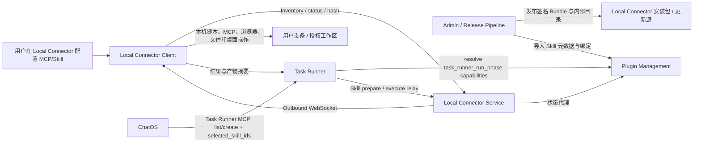

# Local Connector Codex Skills / Plugin 管理集成实施方案

> 状态：实施中（控制面、单客户端租约、客户端设置、Task Runner 动态工具执行链、运行结束清理、开发者模式和前 12 个 adapter-ready Bundle 已完成）  
> 创建日期：2026-07-13  
> 适用范围：Plugin Management Service、Local Connector Client、Local Connector Service、Task Runner、ChatOS  
> 说明：本方案取代 `docs/plans/TASK_RUNNER_SKILLS_MANAGEMENT_PLAN.zh-CN.md` 中“在 Task Runner 云端保存和执行 Skill 内容”的方向；旧文档保留作历史参考。

## 1. 结论先行

本次需求不能通过“把 Codex 的 `SKILL.md` 复制到 Plugin Management，然后在 Task Runner prompt 中直接注入”完成。当前代码缺少完整的本机 Skill 安装、验签、库存上报、可用性解析和执行协议，而且部分 Codex Plugin 依赖 Codex 专有 MCP、桌面 UI 或受限许可，不能原样再分发。

建议采用以下目标架构：

1. Plugin Management 只做控制面：保存 Skill/MCP 元数据、版本、绑定策略和用户可见性，不在云端保存密钥，也不执行 Skill。
2. 当前阶段所有 Skill 都来自 Local Connector 安装包原生内置的不可变签名 Bundle，并在 Local Connector 上安装、验签和执行；未来开放用户安装 Skill 时也必须沿用同一 Bundle 和本机执行协议。
3. 用户创建的所有 MCP 只允许 `local_connector_stdio` 或 `local_connector_http`，禁止回退到云端 stdio/http。
4. Admin 创建的 MCP 必须是系统内部资源，必须关联仓库内组件或明确的内部服务标识；不允许把任意第三方 URL/command 当成 Admin 内部 MCP。
5. Codex 当前 27 个 Skills 全部进入“内部 Skill 能力目录”，但分为：可直接依法迁移、需要本机依赖适配、需要外部 OAuth/MCP 适配、必须原生重写四类。未完成适配或许可确认的条目可以登记，但必须显示为 `unavailable`，不得被 Task Runner 选择。
6. ChatOS 调用 Task Runner 创建任务时，通过动态工具 schema 和 `list_available_skills` 选择 `selected_skill_ids`；Task Runner 创建任务时校验选择，启动运行时固定 bundle 版本和哈希，并通过 Local Connector Relay 执行。
7. Local Connector 离线、bundle 缺失、哈希不匹配、权限不足或依赖不满足时统一 fail closed，绝不改走云端执行。
8. Admin 内部 Skill 默认对所有用户展示，但默认不启用；用户必须在 Local Connector 设置的独立 Skills 页面主动启用后，才进入 Task Runner 的可选集合。
9. 当前每个用户只允许一个 Local Connector Client 处于有效登录/在线状态，必须通过服务端原子租约实现互斥；多客户端和 master/managed client 暂不实现。

### 1.1 当前实施快照（2026-07-13）

已完成：

- Plugin Management、Local Connector Service、Local Connector Client、Task Runner 之间的 Skill catalog、用户启用、设备 inventory、bundle version/hash 和 availability 闭环。
- Local Connector 设置页独立 Skills 面板；Admin 内部 Skill 对所有用户展示，但仍需用户逐项启用。
- 同一用户单一 active client lease；Relay、inventory 和设置操作均校验当前有效设备。
- Task Runner REST/Web/MCP 任务入口保存 `selected_skill_ids`，能力目录和动态创建 schema 返回真实可选 Skill。
- Local Connector `prepare/execute/cancel` adapter session；操作、workspace、bundle snapshot 不匹配时 fail closed。
- Task Runner 动态注册 Local Skill tools，模型工具调用始终 Relay 回同一台 Local Connector。
- 部分 prepare 失败时回收已创建 session；运行成功、失败、超时或用户取消导致模型循环结束后统一调用 `/skills/cancel`。
- 27 个目录项现在都具有实体 `skill.json` 与 `instructions.md`；macOS/Windows 打包脚本逐项校验并把完整 `skill_bundles` 放入 Electron resources。未完成 adapter 的 Bundle 仍上报 `unsupported`，不会进入运行时选择。
- 客户端开发者模式：ChatOS 使用 `http://127.0.0.1:8088`、Local Connector Service 使用 `http://127.0.0.1:39230`、User Service 使用 `http://127.0.0.1:39190`；开发/生产页面使用独立 Cookie partition，切换时断开旧 Connector 长连接并重建主页面。
- 设置中心不再创建第二个独立 `BrowserWindow`，改为主窗口内部的全尺寸 `WebContentsView`。macOS 切换 Space 时按当前设置/主页面状态恢复可见 View、重新布局并触发重绘；ChatOS renderer 异常退出时自动重建，避免返回主页面后黑屏。
- 系统权限目录已按签名 Bundle 清单动态建立 Skill 映射：开放目录、终端/进程、浏览器运行时、HTTPS 网络、macOS 辅助功能、屏幕录制和 Office 自动化。Skill 页面展示关联能力；启用前发现未就绪权限时会 fail closed 并跳转到“运行与权限”页面。macOS 安装包同时声明 Apple Events 自动化及用户目录/卷访问用途；Office 自动化在首次实际调用目标应用时按需申请，不会永久阻止 Skill 启用。
- 本地开发栈默认继续使用线上 MinIO S3 API `https://oss.jgoool.com`，访问凭证只从本地环境变量读取，不写入客户端或仓库。

当前 12 个已实现 Adapter Bundle（Browser 仍受本机依赖门禁）：

| Skill | Adapter 状态 | 当前能力边界 |
| --- | --- | --- |
| Plugin Creator | ready / native | 校验和创建 ChatOS Plugin manifest |
| Skill Creator | ready / native | 校验和创建 ChatOS Skill Bundle |
| Skill Installer | ready / prompt-only | 受信任签名安装流程指导，尚未开放用户安装入口 |
| OpenAI Docs | ready / native | 本机检索官方文档，仅允许提取 `openai.com` HTTPS 域名 |
| Local Browser Control | ready / MCP bridge | 复用本机 BrowserTools；只有真实 `agent-browser` 可执行文件存在时才上报 available，明确拒绝把 `npx` 当作已安装依赖 |
| Remotion Best Practices | ready / prompt-only | 本机项目工作方法指导 |
| Visualize | ready / native | 写入带严格 CSP、禁止联网的本地 HTML 可视化 |
| Documents | ready / native | 创建基础 Unicode DOCX，检查 DOCX 结构与文本 |
| PDF | ready / native | 检查 PDF、提取可搜索文本；OCR/渲染/编辑/生成仍未开放 |
| Presentations | ready / native | 创建基础可编辑文字 PPTX，检查 PPTX slide package |
| Spreadsheets | ready / native | 创建 CSV/单 sheet XLSX，检查 CSV/XLSX 基本结构 |
| Template Creator | ready / composite | 封装、SHA-256 校验并实例化 DOCX/PDF/PPTX/XLSX/CSV 模板 |

其余 15 个目录项仍为 `planned/unavailable`，不会进入 Task Runner 选择器，也不会被云端替代执行。未安装 `agent-browser` 时，Browser Bundle 也会以 `missing_dependency` 保持不可选。

## 2. 已澄清的产品和架构原则

### 2.1 Admin MCP / Skill 的含义

- Admin 创建的资源是系统内部提供的能力，不是普通用户上传资源的另一个入口。
- Admin MCP 应对应仓库内 builtin/provider、内部服务路由或经过审核的内部适配器。
- Admin Skill 应对应仓库内维护的 Skill Bundle/Adapter，而不是服务器上的任意 Markdown、Git 仓库或 shell 命令。
- 建议继续使用 `source_kind=admin_created` 表达 Admin 创建，同时增加可审计的 `internal_component_ref` 或 `bundle_id`，证明它确实来自系统内部实现。

### 2.2 Skill 的“本机执行”边界

本方案默认采用以下边界：

- Skill 的文件读取、脚本、二进制、MCP 调用、浏览器/桌面操作、工作区访问、产物生成全部发生在 Local Connector Client。
- Plugin Management 和 Task Runner 不从云端文件系统加载或执行 Skill 包。
- Task Runner 的模型循环仍可以消费 Local Connector 返回的已验签 Skill 指令片段，并负责总体编排；这不等于在云端执行 Skill 代码。
- 如果产品要求连模型推理循环也必须在用户机器运行，则需要单独建设“Local Skill Agent Runtime”，这超出本方案范围，不能仅靠当前 Relay 协议实现。

### 2.3 用户 MCP 的边界

- 普通用户不能在 Plugin Management 云端直接创建 `http`、`stdio_cloud` 或统一的 `system` MCP。
- 用户 MCP 的 command、args、env、headers、token、cwd 只保存在 Local Connector 本地状态中。
- 云端只保存 `owner_user_id + device_id + manifest_id + runtime_kind + manifest_hash + tool snapshot`。

### 2.4 Admin Skill 的用户启用规则

- 27 个安装包内置 Skills 都作为 Admin 内部 Skill，默认对所有用户可见。
- “全局可见”不等于“默认启用”；新用户的所有 optional Skill 默认 `enabled=false`。
- 用户必须在 Local Connector 设置中的独立 Skills 页面逐项启用。
- Plugin Management capability resolution 只把“Admin 全局启用 + 用户已启用 + 当前客户端安装可用”的 Skill 放进 `selectable_skills()`。
- 用户关闭 Skill 后，新任务不能再选择；已经创建的任务在启动新 Run 时重新校验，不能静默继续使用已关闭 Skill。
- 当前阶段不实现用户从 Git、ZIP、市场或本地目录安装新 Skill；页面和数据模型只预留未来入口。

### 2.5 单用户单客户端互斥

- 当前一个 `owner_user_id` 同一时间只能有一个有效 Local Connector session。
- 第二个客户端在已有活跃 session 时登录/注册/连接必须返回明确的 `409 connector_already_active`，不能同时在线。
- 当前客户端主动退出或 WebSocket 正常断开时释放 session lease；异常掉线由 heartbeat TTL 自动回收。
- 设备历史记录可以保留，但只有持有当前 lease 的设备能够上报 inventory、接收 Relay 或影响 Skill/MCP availability。
- 本阶段不实现多客户端列表、master 选举、从 master 管理其他客户端或跨设备执行。

## 3. 当前代码现状与主要差距

| 领域 | 当前事实 | 与目标的差距 |
| --- | --- | --- |
| Plugin Management README | 明确写着服务自身管理闭环已完成，但尚未接入 ChatOS、Task Runner、Local Connector 执行链路 | 文档与部分新代码已不完全一致，需要以真实调用链更新 README |
| MCP 模型 | 系统 MCP 已统一为 `system + system_key`，历史 `builtin`/路由记录由统一 Catalog 兼容解析并在种子阶段迁移；用户 MCP 保留 HTTP/stdio 与 Local Connector runtime | Admin 任意 HTTP/stdio 仍需继续加强“系统内部组件证明” |
| Skill 模型 | `SkillContent` 允许 `inline_content`、`cloud_package`、`git_package`、`local_connector_file/package` | 与“所有 Skill 都在 Local Connector 执行”冲突；云端内容类型必须退役 |
| Skill availability | 已按 owner/device 保存 bundle id、version、hash、platform、status 和 dependency status，并与 Admin seed snapshot 比对 | 完整的逐依赖探测、签名链和升级回滚策略仍需继续实现 |
| Local Connector Client | 已有 27 项实体 Bundle、12 个 adapter-ready bundle、真实依赖门禁、inventory、用户启用页面和 prepare/execute/cancel runtime | 用户安装入口、Ed25519 release 签名和剩余 15 个 adapter 尚未完成 |
| Local Connector Service | 已有 Skill catalog/status 代理、`relay.skill` 内部鉴权和 prepare/execute/cancel Relay | 仍需补充更细粒度的持久审计与运行指标 |
| Connector 会话 | 已实现 owner 级唯一 active lease，第二客户端冲突、heartbeat 续租和 Relay lease 校验 | 多客户端/master 模式按产品决定明确不在本阶段实现 |
| 用户 Skill 设置 | 已有独立 Skills 页面，Admin 内部 Skill 默认展示、用户默认关闭并逐项启用 | 用户从 Git/ZIP/本地目录安装 Skill 仍只预留产品入口 |
| Plugin Management SDK | 已有 Skill bundle/install/inventory/preference DTO、客户端 API 和运行时 policy | 后续需随签名/升级模型扩展 release channel 字段 |
| Task Runner 能力目录 | `/api/tasks/capabilities/catalog` 返回真实 `selectable_skills` 和 policy 信息 | 只会显示用户已启用、当前设备已上报 available 的条目，这是预期 fail-closed 行为 |
| Task Runner Policy | 已解析 Plugin Management Skill policy，校验选择并固定本次运行 bundle/device/workspace snapshot | 复杂 adapter 的依赖和高风险权限审批仍需逐 Skill 扩展 |
| Task 数据模型 | REST/MCP/Web UI 已保存和展示 `selected_skill_ids`，Run 启动时固化 exact installation snapshot | 长期定时任务的版本约束和升级提示仍需补充 |
| Task Runner 执行 | 已在模型执行前按任务快照调用 Local Connector Skill prepare，并在客户端离线或 Bundle 不匹配时 fail closed | 复杂 native/mcp_bridge Skill 的 execute adapter 仍需逐项实现 |
| Task Runner Web UI | 创建/编辑任务已读取 `/api/tasks/capabilities/catalog`，可保存 `selected_skill_ids` 并在详情页展示 | 当前只展示真实 selectable Skills；未适配 Skill 不会出现在选择器中 |
| Task Runner MCP tools | `create_task`、批量/规划入口支持 `selected_skill_ids`，动态 schema 和 `list_available_skills` 返回当前用户可选项 | 仍需继续补齐更多 ChatOS 场景回归测试和展示摘要 |
| ChatOS | 通过 Task Runner MCP 动态工具 schema 能创建带 `selected_skill_ids` 的任务 | 独立 Skill 标签、预览和错误提示 UI 仍可继续优化 |
| ChatOS legacy Skills | `chatos_skills*` 会在 ChatOS 服务器缓存 Git/plugin 内容并读取 `SKILL.md` | 与“Skill 不在云端执行/加载”冲突，后续必须迁移或退役 |
| Task Runner legacy Skills | 数据库仍存在 `0022_skills.sql`、`0023_skill_packages.sql`，但业务代码已基本移除 | 属于孤立旧 schema，不应重新启用为云端 Skill 存储 |

## 4. 目标总体架构



控制面和执行面必须严格分开：

- Plugin Management：谁可以看见、选择什么能力。
- Task Runner：任务编排、模型循环、选择校验、运行快照。
- Local Connector Service：鉴权、设备路由、请求/响应转发。
- Local Connector Client：bundle 安装、验签、依赖检查和真正执行。

## 5. Skill Bundle 规范

### 5.1 仓库布局

禁止从开发者机器的 `~/.codex` 或 plugin cache 直接构建正式安装包。正式资源必须进入仓库并接受代码审查：

```text
local_connector_client/
  skill_bundles/
    internal/
      remotion-best-practices/
      chatos-skill-creator/
      chatos-pdf/
      ...
    schemas/
      skill-bundle.schema.json
    catalog/
      internal-skill-catalog.json
      internal-skill-catalog.lock.json
  core/src/skills/
    manifest.rs
    inventory.rs
    installer.rs
    verifier.rs
    permissions.rs
    executor.rs
    relay.rs
```

对于不能直接复制的 Codex Skill，在这里提交的是 ChatOS 原生实现和自有说明，不是从 Codex cache 提取的原文或二进制。

### 5.2 Bundle 目录

```text
<bundle-id>/<version>/
  skill.json
  instructions.md
  scripts/
  adapters/
    macos-arm64/
    macos-x64/
    windows-x64/
    windows-arm64/
  assets/
  licenses/
  sbom.spdx.json
  checksums.json
  signature.ed25519
```

### 5.3 `skill.json` 建议字段

```json
{
  "schema_version": 1,
  "bundle_id": "chatos.internal.pdf",
  "skill_id": "internal_skill_pdf",
  "name": "pdf",
  "display_name": "PDF",
  "version": "1.0.0",
  "publisher": "chatos",
  "source_kind": "admin_created",
  "license": {
    "spdx": "MIT",
    "redistribution_reviewed": true
  },
  "entrypoint": {
    "kind": "native_adapter",
    "adapter": "pdf"
  },
  "instructions_path": "instructions.md",
  "requires_workspace": true,
  "permissions": ["workspace.read", "workspace.write", "process.spawn"],
  "dependencies": {
    "commands": ["python", "pdftoppm"],
    "python_packages": ["pypdf", "pdfplumber", "reportlab"]
  },
  "platforms": ["macos-arm64", "macos-x64", "windows-x64"],
  "content_sha256": "...",
  "signing_key_id": "chatos-release-2026"
}
```

### 5.4 Entry point 类型

| 类型 | 用途 | 执行方式 |
| --- | --- | --- |
| `prompt_only` | 纯工作方法/最佳实践，如 Remotion 指导 | Local Connector 验签并返回指令片段；Task Runner 不从云端存储读取 |
| `native_adapter` | PDF、文档、表格、可视化等 | Local Connector Rust/Node/Python adapter 执行 |
| `process` | 受控脚本入口 | 只能执行 manifest 声明且签名覆盖的命令，禁止任意 shell |
| `mcp_bridge` | Figma、浏览器等工具型能力 | Local Connector 在本机启动/连接 MCP，再通过 Skill Relay 暴露 tools/list、tools/call |
| `composite` | 由多个子 Skill/MCP 组成 | Local Connector 根据固定依赖图装配，Task Runner 只看到一个 Skill |

### 5.5 完整性与签名

- Release Pipeline 为每个 bundle 计算逐文件 SHA-256。
- `checksums.json`、manifest 和目录索引一起使用 Ed25519 签名。
- Local Connector 内置受信任公钥，只安装签名有效且 publisher 允许的 bundle。
- 开发模式可允许本地 unsigned bundle，但必须由显式环境变量开启，并且不能上报为 production available。
- bundle 版本不可原地修改；相同 `bundle_id + version` 的哈希发生变化时直接拒绝。

## 6. Codex 27 个 Skills 的迁移清单

### 6.1 分类定义

- A：许可和依赖允许直接整理为仓库内 Bundle。
- B：可实现，但需要 Local Connector 本机依赖或 ChatOS 原生 Adapter。
- C：依赖外部 MCP、OAuth、桌面 App 或 Codex 专有工具协议，需要单独集成。
- D：不能原样再分发，必须根据功能目标自行重写；不得复制受限内容或二进制。

### 6.2 清单

| # | Codex Skill | 来源/许可现状 | 分类 | ChatOS 目标实现 |
| --- | --- | --- | --- | --- |
| 1 | `imagegen` | System Skill，Apache-2.0；依赖 Codex `image_gen` | B | 改为 Local Connector 图片生成 Adapter，调用用户配置的图像模型/API；保留本机后处理脚本 |
| 2 | `openai-docs` | System Skill，Apache-2.0；依赖 OpenAI Docs MCP、Codex manual、浏览器 | B/C | 改为官方文档检索 Skill，使用受控 HTTP/MCP；不依赖 Codex app manual helper |
| 3 | `plugin-creator` | System Skill，当前目录未发现明确 license 文件；目标格式是 Codex plugin | B/D | 先做许可确认，再重写为 ChatOS Plugin/Bundle Creator，生成本系统 manifest |
| 4 | `skill-creator` | System Skill，Apache-2.0 | A | 适配为 ChatOS Skill Bundle Creator，输出 `skill.json` 并调用本机校验器 |
| 5 | `skill-installer` | System Skill，Apache-2.0 | A/B | 改为签名 registry 安装器；默认禁止直接执行任意 GitHub 内容 |
| 6 | `figma-code-connect` | Figma Developer Terms；依赖 Figma | C | Local Connector Figma MCP/OAuth Adapter；许可审查通过后才启用 |
| 7 | `figma-create-new-file` | Figma Developer Terms；依赖 `create_new_file` | C | 映射到 Figma MCP 创建文件工具 |
| 8 | `figma-design-to-code` | Figma Developer Terms；依赖 `get_design_context` | C | 映射到 Figma MCP read context + 本地代码工作区 |
| 9 | `figma-generate-design` | Figma Developer Terms；依赖 `use_figma` | C | Figma 写入 Adapter，OAuth 和文件权限保留在本机 |
| 10 | `figma-generate-diagram` | Figma Developer Terms；依赖 diagram/use_figma | C | Figma/FigJam diagram Adapter |
| 11 | `figma-generate-library` | Figma Developer Terms；含多份 JS helper | C | 许可确认后迁移 helper，或按功能原生重写 design-system adapter |
| 12 | `figma-implement-motion` | Figma Developer Terms；依赖 motion context | C | Figma motion read + 本地代码生成 Adapter |
| 13 | `figma-swiftui` | Figma Developer Terms；依赖 Figma/SwiftUI 工作区 | C | Figma MCP + 本地 Xcode/Swift 工作区 Adapter |
| 14 | `figma-use` | Figma Developer Terms；强依赖 Codex `use_figma` 调用约束 | C | 改写为 ChatOS Figma MCP 调用规范，不复制 Codex 专有 tool wrapper |
| 15 | `figma-use-figjam` | Figma Developer Terms | C | FigJam 专用上下文 Adapter |
| 16 | `figma-use-motion` | Figma Developer Terms；还可能依赖 ffmpeg | C | Figma motion write Adapter + 本机 ffmpeg 检查 |
| 17 | `figma-use-slides` | Figma Developer Terms | C | Figma Slides Adapter |
| 18 | `remotion-best-practices` | Remotion Plugin，MIT | A | 作为 `prompt_only` Bundle；Remotion/Node/ffmpeg 依赖由本机 inventory 检查 |
| 19 | `control-in-app-browser` | OpenAI Proprietary；依赖 Codex in-app Browser | D | 不复制；原生实现 Playwright/Chromium Local Browser Skill |
| 20 | `computer-use` | OpenAI Proprietary；包含约 60MB Codex/macOS 专有客户端 | D | 不打包原二进制；实现自有 macOS Accessibility/Windows UI Automation Adapter |
| 21 | `visualize` | OpenAI Proprietary；依赖 Codex 可视化承载面 | D | 原生实现本地 HTML/Canvas/Plotly artifact renderer 和预览服务 |
| 22 | `documents` | Skill 内 license 明确限制提取、复制和分发 | D | 严禁复制；用 python-docx/LibreOffice 等开源组件重新实现 ChatOS Documents Skill |
| 23 | `pdf` | Plugin manifest 标记 MIT；依赖 Poppler/Python | B | 原生 PDF Adapter，使用 pypdf/pdfplumber/reportlab/Poppler |
| 24 | `Presentations` | Plugin manifest 标记 MIT；依赖 `artifact_tool`、imagegen、workspace runtime | B | 自有 PPTX Adapter，使用 PptxGenJS/LibreOffice，替换 Codex artifact 工具 |
| 25 | `Spreadsheets` | Plugin manifest 标记 MIT；依赖 `artifact_tool` 和 workspace runtime | B | 自有 XLSX/CSV Adapter，使用 SheetJS/ExcelJS/openpyxl，全部本机执行 |
| 26 | `excel-live-control` | 依赖 ChatGPT Excel add-in/connected app | C/D | 只有在自有 Excel add-in 或本机 Office Automation 完成后启用 |
| 27 | `template-creator` | OpenAI Proprietary | D | 不复制；基于自有 Documents/Presentations/Spreadsheets Adapter 重写模板提取能力 |

### 6.3 发布策略

- 27 个条目都随 Local Connector 安装包进入原生 Bundle Catalog，并同步进入 Admin 内部目录；尚未完成适配的条目保留清晰的 `migration_status`。
- 只有 A 类和已经完成 Adapter/许可审查的 B/C/D 类可以上报 `available=true`。
- UI 必须区分：`已安装可用`、`缺少依赖`、`等待 OAuth`、`当前平台不支持`、`许可待确认`、`尚未适配`。
- Task Runner 的 `selectable_skills()` 只能包含真实 available 的条目；不能为了“列表完整”而让不可执行 Skill 可选。

## 7. Plugin Management 数据模型改造

### 7.1 Skill 模型

废弃将可执行内容直接放在 `SkillContent.inline/repository/source_path` 的做法。建议新增：

```rust
pub struct SkillBundleRef {
    pub bundle_id: String,
    pub version_constraint: String,
    pub publisher: String,
    pub signing_key_id: String,
}

pub struct SkillExecutionPolicy {
    pub runtime_kind: String, // 固定 local_connector_bundle
    pub requires_online: bool,
    pub requires_workspace: bool,
    pub permissions: Vec<String>,
    pub supported_platforms: Vec<String>,
}
```

`SkillRecord` 继续保存展示和策略字段，同时增加：

- `bundle: SkillBundleRef`
- `execution: SkillExecutionPolicy`
- `internal_component_ref`
- `license_status`
- `migration_status`
- `catalog_revision`

所有新建 Skill 的 `content.kind` 统一为 `local_connector_bundle`。旧类型只保留读取和迁移，不再允许创建。

### 7.2 Skill 安装/库存模型

不要继续用单个 `ResourceCheckRecord(resource_kind, resource_id)` 表示所有用户和设备。新增独立集合：

```rust
pub struct SkillInstallationRecord {
    pub owner_user_id: String,
    pub device_id: String,
    pub skill_id: String,
    pub bundle_id: String,
    pub version: String,
    pub bundle_hash: String,
    pub platform: String,
    pub status: String,
    pub dependency_status: String,
    pub last_error: Option<String>,
    pub last_checked_at: String,
}
```

唯一键建议为：

```text
(owner_user_id, device_id, bundle_id, version)
```

Plugin Management 解析某用户的能力时，只从该用户当前唯一 active device 的 installation inventory 计算 Skill availability，而不是把 Admin Skill 永久绑定到历史 device 记录。

### 7.3 用户 Skill 启用偏好

新增独立记录，不把用户开关写回全局 `SkillRecord.enabled`：

```rust
pub struct UserSkillPreferenceRecord {
    pub owner_user_id: String,
    pub skill_id: String,
    pub enabled: bool,
    pub enabled_at: Option<String>,
    pub updated_at: String,
}
```

唯一键：

```text
(owner_user_id, skill_id)
```

规则：

- 没有 preference 记录等价于 `enabled=false`。
- `SkillRecord.enabled=false` 是 Admin 全局下线，优先级高于用户偏好。
- Settings Catalog API 返回全部 Admin 内部 Skill，包括未启用和不可用条目。
- Runtime Capabilities API 只返回用户已启用的 Skill；其中只有 inventory available 的 optional Skill 可选择。
- 用户偏好属于 Plugin Management 控制面数据，Local Connector Client 通过 Local Connector Service 代理读写。

### 7.4 Admin 内部 MCP 约束

为 Admin MCP 增加：

- `internal_component_ref`：例如 Rust provider、内部 service route、仓库路径或构建组件 ID。
- `runtime_trust=internal`。
- 对 `http` runtime 使用内部域名/service allowlist。
- 对 `stdio_cloud` runtime 只允许服务器构建产物中已登记的 command ID，不接受自由文本 command。

普通用户继续只允许 Local Connector runtime。

### 7.5 Agent Binding

- 将 27 个内部 Skill 以 optional binding 绑定到 `task_runner_run_phase`。
- 这些 binding 对所有用户可见，但必须叠加 `UserSkillPreferenceRecord.enabled=true` 才能成为用户能力。
- 不再依赖 `include_user_resources=true` 自动把所有用户 Skill/MCP 塞进任务。
- 未来开放用户安装 Skill 后，用户资源也只能在用户主动启用后进入“可选集合”，并且必须由任务显式选择；当前阶段不创建用户 Skill 资源。
- required Skill 只有在 Task Runner 已支持对应 bundle 协议后才允许配置；否则 SDK 继续 fail closed。

## 8. Admin 导入和 Seed 流程

### 8.1 单一权威目录

Release Pipeline 生成两个来自同一源的产物：

1. `internal-skill-catalog.lock.json`：随 Local Connector 安装包发布。
2. `plugin-management-skill-seed.json`：由 Plugin Management seed/import 使用。

二者必须共享：

- skill ID
- bundle ID
- 版本约束
- publisher
- license 状态
- catalog revision

### 8.2 建议脚本

后续实施时新增：

```text
scripts/skills/audit_codex_skill_inventory.sh
scripts/skills/build_internal_skill_bundles.py
scripts/skills/generate_plugin_management_skill_seed.py
scripts/skills/verify_skill_catalog_consistency.py
```

职责：

- `audit_codex_skill_inventory.sh` 只用于盘点本机 Codex 安装，不直接复制到发行目录。
- builder 校验 schema、license、平台资产、路径穿越、文件大小、依赖和签名。
- seed generator 只输出控制面元数据。
- consistency verifier 保证安装包 catalog 与 Plugin Management seed 不漂移。

### 8.3 Admin UI

Skill 创建页应改为：

- 从“已审核内部 Bundle Catalog”选择 bundle。
- 允许编辑展示名称、描述、标签、启用状态和 Agent binding。
- 不再提供 inline Markdown、Git repository、server source path 自由输入。
- 展示 bundle version、hash、license、支持平台、依赖和 rollout 状态。

Skill Package 页建议改造为 Bundle Release/Collection 管理；现有 `git`、`inline_bundle`、`installed` 语义不能继续代表云端安装。

Admin 启用一个内部 Skill 后，它应立即出现在所有用户的 Skills 设置目录中，但用户侧开关仍保持默认关闭。

## 9. Local Connector Client 改造

### 9.1 本地状态

在 `LocalState` 增加：

- `skill_inventory`
- `skill_installations`
- `skill_dependency_checks`
- `skill_permission_grants`
- `trusted_skill_publishers`
- `active_connector_session_id`

敏感配置仍只存本地，文件权限保持 0600/用户可读。

### 9.2 独立 Skills 设置页面

Local Connector 设置新增一级页面/导航项“Skills”，当前阶段只展示安装包内置 Skills：

- 名称、描述、分类、版本和 Bundle ID。
- Admin 是否全局启用。
- 当前平台是否支持、依赖是否齐全、Bundle 是否验签通过。
- 用户启用开关；默认关闭。
- 所需权限和最近一次检查错误。
- 搜索、分类筛选和“仅看已启用”。

当前阶段不显示可执行的“从市场安装”“从 Git 安装”“上传 ZIP”按钮。可以保留禁用的未来入口或产品说明，但后端不接受用户安装请求。

用户点击启用时：

1. Client 先确认 bundle 已安装、签名有效、依赖可满足。
2. 需要敏感权限时在本机展示授权确认。
3. 通过 Local Connector Service 写入 Plugin Management 的用户 preference。
4. 刷新 capability catalog，成功后 Task Runner 才能选择。

### 9.3 安装与升级

启动流程：

1. 读取随应用发布的 bundled catalog。
2. 验证 catalog 和各 bundle 签名。
3. 将 bundle 安装到应用数据目录的版本化只读目录。
4. 检查平台、命令、Python/Node runtime、浏览器、Office、Docker 等依赖。
5. 生成 inventory 并通过 WebSocket 心跳上报。
6. 升级时先安装新版本，验证成功后原子切换 active version；保留上一版本用于回滚。

### 9.4 Skill Relay 协议

建议新增独立协议，不复用用户 MCP manifest header：

```text
skill_inventory_status
skill_inventory_status_ack
skill_prepare_request
skill_prepare_response
skill_execute_request
skill_execute_response
skill_cancel_request
skill_cancel_response
```

`skill_prepare_request` 输入至少包含：

- owner/device/workspace
- task_id/run_id
- skill_id/bundle_id/version/hash
- requested permissions
- locale

返回：

- 已验签指令片段
- 可用 tool descriptors
- dependency/permission 状态
- adapter session ID

`skill_execute_request` 只能调用 prepare 阶段公布的 tool/operation，不能接受任意 command。

### 9.5 权限

权限建议最少包含：

```text
workspace.read
workspace.write
process.spawn
network.http
browser.control
desktop.control
office.control
docker.control
credential.use:<provider>
```

- Bundle 只能声明最大权限。
- 用户在 Local Connector 授权的是实际权限。
- Task Runner 请求权限必须是两者交集。
- 写文件、桌面控制、安装依赖、访问凭据等高风险操作继续走本机 Approval 流程。

## 10. Local Connector Service 改造

新增 API：

```text
GET  /api/plugin-management/local-skills?device_id=...
PUT  /api/plugin-management/local-skills/status
GET  /api/plugin-management/user-skills/catalog
PUT  /api/plugin-management/user-skills/:skill_id/preference
POST /api/local-connectors/relay/:device_id/skills/prepare
POST /api/local-connectors/relay/:device_id/skills/execute
POST /api/local-connectors/relay/:device_id/skills/cancel
```

新增内部 scope：

```text
relay.skill
```

第一阶段只允许 `task-runner` caller 使用。请求必须同时绑定：

- caller service
- owner user
- device
- task/run
- bundle snapshot
- workspace（Skill 需要工作区时）

设备断开时，服务要像 MCP 一样批量把该设备的 Skill installations 标记 offline。

### 10.1 单客户端 Session Lease

新增 `ActiveConnectorSessionLease`：

```rust
pub struct ActiveConnectorSessionLease {
    pub owner_user_id: String,
    pub device_id: String,
    pub session_id: String,
    pub acquired_at: String,
    pub heartbeat_at: String,
    pub expires_at: String,
}
```

实现要求：

- 对 `owner_user_id` 建唯一索引，session acquire 必须是数据库原子操作。
- Local Connector 完成用户认证后、注册设备或建立 WebSocket 前先 acquire lease。
- 活跃 lease 属于其他 device/session 时返回 `409 connector_already_active`。
- heartbeat 同时续租；正常 logout/disconnect 仅允许当前 session 释放自己的 lease。
- 服务启动和定时任务清理过期 lease，并将对应设备、MCP、Skill inventory 标记 offline。
- Relay 除校验 owner/device 外，还必须校验 device 持有当前 active lease。
- 不增加 master、managed client、跨设备命令或远程管理 API。

## 11. Task Runner 改造

### 11.1 任务模型

新增：

```rust
pub struct TaskSkillConfig {
    pub selected_skill_ids: Vec<String>,
}

pub struct TaskSkillSnapshotItem {
    pub skill_id: String,
    pub bundle_id: String,
    pub version: String,
    pub bundle_hash: String,
    pub device_id: String,
    pub workspace_id: Option<String>,
    pub permissions: Vec<String>,
}
```

建议存储策略：

- Task 记录保存用户请求的 `selected_skill_ids` 和创建时 `policy_revision`。
- 因当前每个用户只允许一个有效客户端，Task 不提供设备选择字段；运行时使用 owner 当前唯一 active device。
- 每次 Start Run 时重新检查可用性，但只允许解析到任务已接受的兼容版本范围。
- Run 的 `input_snapshot` 固化 exact version/hash/device/workspace/permissions，保证该次执行可审计和可重放。
- 若业务要求任务从创建开始绝对不升级，可在 Task 记录同时保存 exact snapshot；默认建议在 Run 启动时固定，更适合长期定时任务和安全补丁升级。

### 11.2 Capability Policy

`TaskRunnerCapabilityPolicy` 增加：

- `selectable_skill_views()`
- `selectable_skill_ids()`
- `validate_skill_selection()`
- `effective_skills()`
- `resolve_skill_snapshots()`

构造 policy 时不再传空 supported Skill 集合，而是传 Local Connector Skill Runtime 支持的 bundle/adapter ID。

### 11.3 能力目录 API

修复 `/api/tasks/capabilities/catalog`：

- 返回真实 `selectable_skills`。
- 只返回用户已在设置页面启用的 Skill；未启用条目只能出现在 Settings Catalog，不能出现在任务选择器。
- 每项包含 availability、device/platform、version、missing dependency、permissions。
- 返回 `policy_revision` 和 `catalog_revision`。

Task Runner Web UI 改为读取这个接口，而不是分别读取 builtin catalog 和 legacy external MCP configs。

### 11.4 创建任务 API/MCP tools

以下入口都增加 `selected_skill_ids`：

- REST `CreateTaskRequest` / `UpdateTaskRequest`
- MCP `create_task`
- MCP `create_tasks_with_prerequisites`
- MCP `create_project_execution_tasks`
- Task Runner Web UI 创建/编辑任务

新增 MCP tool：

```text
list_available_skills
```

Task Runner 在 `list_tools_for_user` 动态把 selectable Skill IDs 写入 create tool schema enum，并在 description 中写明名称、用途、依赖和可用状态。ChatOS 模型因此能先列出 Skills，再把选中的 ID 放进任务创建请求。

### 11.5 运行阶段

`prepare_model_execution` 前增加 Skill preparation：

1. 解析并固定 Skill snapshots。
2. 调用 Local Connector `/skills/prepare`。
3. 将返回的 prompt fragments 作为 prefixed input items 注入。
4. 将 Skill tools 注册为独立的 Local Skill MCP facade/provider。
5. 所有 tools/call 通过 `/skills/execute` 回到同一设备。
6. Run 结束、取消或超时后调用 `/skills/cancel`/cleanup。

任何 prepare 失败都应在模型执行前终止，不允许删掉 Skill 后继续运行。

## 12. ChatOS 改造

ChatOS 本身不需要复制 Skill 内容。主要改动是确保 Task Runner MCP 的新选择能力能被正确使用和展示：

1. ChatOS 从 Task Runner `tools/list` 得到带 Skill enum 的动态 schema。
2. 对话/规划 prompt 增加规则：任务需要专门能力时先调用 `list_available_skills`，再创建任务。
3. Task Runner 创建结果返回 `selected_skills` 摘要，ChatOS 消息卡片可展示 Skill 标签。
4. 如果存在人工任务确认/预览流程，预览中显示所选 Skill、目标设备和离线风险。
5. 不再从 ChatOS 服务器的 `chatos_skills*` cache 为 Task Runner 任务注入可执行 Skill。

ChatOS 现有 Agent/联系人 Skill 系统与本方案不是同一个运行链路。迁移时应：

- 先让 Task Runner Skill 全部走 Plugin Management + Local Connector。
- 再把联系人/Agent 的 `skill_ids` 解析改到 Plugin Management。
- 最后停用 ChatOS 的 Git clone、server cache 和 `SKILL.md` 直接加载逻辑。

## 13. 打包与发布脚本改造

### 13.1 macOS

修改：

- `local_connector_client/package-electron-macos-client.sh`
- `local_connector_client/electron-builder-macos.yml`

构建顺序增加：

1. 构建/校验内部 Skill bundles。
2. 生成 catalog lock、checksums、SBOM、签名。
3. 把 bundles staging 到 `.package/macos/skill-bundles`。
4. 通过 `extraResources` 放入 `resources/skill-bundles`。
5. 安装包验证时同时校验 bundle index。

### 13.2 Windows

修改 `package-electron-windows-client.ps1`：

- 将 `skill-bundles` 复制到 Electron resources。
- 根据 Windows 架构过滤 platform assets。
- ZIP 前运行 catalog consistency 和签名验证。

### 13.3 Electron/Core 启动

Electron 启动 Core 时增加：

```text
CHATOS_BUNDLED_SKILLS_DIR=<resources>/skill-bundles
```

Core 启动失败策略：

- catalog 损坏：客户端可以启动管理 UI，但 Skill Runtime 进入 blocked 状态。
- 单个 bundle 损坏：只隔离该 bundle，并上报 unavailable。
- 绝不忽略签名错误继续执行。

## 14. 迁移策略

### 14.1 Plugin Management legacy Skill

| 旧类型 | 迁移方式 |
| --- | --- |
| `inline_content` | 导出为本地 bundle；未迁移前 disabled |
| `cloud_package` | 重新打包为签名 bundle；禁止云端执行 |
| `git_package` | 由受信任构建流程拉取、审计、签名；客户端不直接执行未审核 Git 内容 |
| `local_connector_file` | 生成 bundle manifest、版本和签名后迁移 |
| `local_connector_package` | 转换为 `local_connector_bundle` |

### 14.2 Task Runner legacy schema

- 不复活 `0022_skills.sql` / `0023_skill_packages.sql` 作为云端执行存储。
- 新增独立 migration，例如 `0028_task_skill_selection.sql`，只保存任务选择和快照字段。
- 旧 External MCP Config API/页面进入 deprecated；用户 MCP 以 Plugin Management resource ID 为准。

### 14.3 ChatOS legacy cache

- 在迁移窗口保留只读展示能力。
- 禁止新安装写入 server-side plugin cache。
- 提供一次性导出工具，把可合法迁移的用户 Skill 送到 Local Connector 重新打包和签名。
- 全部消费者切换后删除 Git clone/cache/runtime injection 路径。

## 15. 分阶段实施

### 阶段 0：边界、许可和目录冻结

- 确认“本机执行”不包含整个模型循环本地化。
- 完成 27 个 Skills 的 license/redistribution 审核。
- 冻结 Skill Bundle schema、permission taxonomy、publisher key 管理方式。
- 在仓库建立内部 bundle source 目录，禁止从用户 home/cache 直接打包。

验收：每个 Skill 都有 owner、分类、许可结论、目标 Adapter 和 rollout 状态。

### 阶段 1：控制面合同

- 修改 Plugin Management models/policy/API/SDK。
- 增加 skill installation inventory 数据模型和索引。
- 增加用户 Skill preference，默认关闭。
- Admin Skill 只能引用内部 bundle。
- Admin MCP 增加内部组件约束；用户 MCP 强制 Local Connector。

验收：Plugin Management 能返回真实但尚可 unavailable 的 `ResolvedSkill`，用户开关相互隔离，未启用 Skill 不进入 runtime capabilities。

### 阶段 2：Local Connector Skill Runtime 基础

- 实现 bundle verifier、installer、inventory、dependency checker、permission grants。
- 实现 prompt-only 和 native adapter 两个最小 entrypoint。
- 实现 inventory heartbeat 和 offline 标记。
- 实现 Local Connector 独立 Skills 设置页面和用户启用开关。
- 实现 owner 级 active session lease，第二个客户端在线时返回 409。
- 修改 macOS/Windows 打包脚本。

验收：Remotion/Skill Creator 等首批 bundle 能随客户端安装并上报 available；用户默认未启用，主动启用后才进入 Task Runner 能力；第二客户端不能同时连接。

### 阶段 3：Skill Relay

- Local Connector Service 增加 `relay.skill`。
- Client 增加 prepare/execute/cancel handler。
- 加入 task/run/device/workspace/snapshot 绑定和审计日志。

验收：集成测试证明实际脚本 PID、文件路径和网络请求均发生在用户设备。

### 阶段 4：Task Runner 选择与执行

- 增加 task skill config/snapshot。
- 修复 capability catalog。
- REST、MCP、批量创建和 Web UI 支持选择 Skill。
- 运行前 prepare，工具调用走 Local Connector。

验收：Task Runner 选择 Skill 后可执行；客户端离线时创建/启动按策略失败，绝不云端回退。

### 阶段 5：ChatOS 接入

- 增加 `list_available_skills` 使用规则。
- 动态 create schema 支持 `selected_skill_ids`。
- 任务卡片/预览展示 Skill。
- 补齐普通对话、规划、需求执行规划三种 Task Runner tool profile 测试。

验收：用户从 ChatOS 发起任务，模型能够选择并创建带 Skill 的 Task Runner 任务。

### 阶段 6：27 个 Codex 能力分批落地

建议批次：

1. A 类：Remotion、Skill Creator、Skill Installer。
2. 文件类 B/D 原生实现：PDF、Documents、Spreadsheets、Presentations、Template Creator。
3. 本机工具类：Imagegen、Browser、Visualize。
4. 外部集成类：OpenAI Docs、Figma 12 项。
5. 桌面控制类：Computer Use、Excel Live Control。

验收：目录中的 27 个条目均有真实 Adapter 或明确的平台/许可阻断原因；已标记 available 的项目全部通过端到端测试。

### 阶段 7：遗留链路清理

- 禁止新建云端 Skill content/package。
- 停用 Task Runner legacy external MCP 选择入口。
- 迁移并删除 ChatOS server-side Skill Git/cache 执行链路。
- 更新所有 README、部署配置和运维手册。

## 16. 文件级改动清单

### Plugin Management Service

- `plugin_management_service/backend/src/models.rs`
- `plugin_management_service/backend/src/api/resource_policy.rs`
- `plugin_management_service/backend/src/api/availability.rs`
- `plugin_management_service/backend/src/api/capabilities.rs`
- `plugin_management_service/backend/src/api/skills.rs`
- `plugin_management_service/backend/src/api/skill_packages.rs`
- 新增 `plugin_management_service/backend/src/api/local_connector_skills.rs`
- 新增用户 Skill catalog/preference API 和存储实现
- `plugin_management_service/backend/src/seed.rs`
- `plugin_management_service/frontend/src/pages/SkillCatalogPage.tsx`
- `plugin_management_service/frontend/src/pages/SkillPackagesPage.tsx`
- `plugin_management_service/frontend/src/pages/RuntimePreviewPage.tsx`
- `plugin_management_service/README.md`

### SDK

- `crates/chatos_plugin_management_sdk/src/dto.rs`
- `crates/chatos_plugin_management_sdk/src/client.rs`
- `crates/chatos_plugin_management_sdk/src/policy.rs`

### Local Connector Client

- 新增 `local_connector_client/core/src/skills/*`
- `local_connector_client/core/src/lib.rs`
- `local_connector_client/core/src/runtime.rs`
- `local_connector_client/core/src/connector.rs`
- `local_connector_client/core/src/relay/messages.rs`
- `local_connector_client/core/src/api/handlers.rs`
- 新增 Local Connector 前端 Skill/依赖/权限管理页面
- 建议新增 `local_connector_client/frontend/src/components/SkillSettingsPanel.tsx`
- `local_connector_client/frontend/electron/main.cjs`
- `local_connector_client/electron-builder-macos.yml`
- `local_connector_client/package-electron-macos-client.sh`
- `local_connector_client/package-electron-windows-client.ps1`
- `local_connector_client/README.md`

### Local Connector Service

- `local_connector_service/backend/src/api/router.rs`
- `local_connector_service/backend/src/api/internal_auth.rs`
- `local_connector_service/backend/src/api/devices.rs`
- 新增 `local_connector_service/backend/src/api/plugin_management_skills.rs`
- 新增 `local_connector_service/backend/src/api/skill_relay.rs`
- 新增 active connector session lease 模型、存储、唯一索引和 acquire/release API
- `local_connector_service/backend/src/relay.rs`

### Task Runner

- `task_runner_service/backend/src/models/task/config.rs`
- `task_runner_service/backend/src/models/task/record.rs`
- `task_runner_service/backend/src/models/task/requests.rs`
- `task_runner_service/backend/src/models/run.rs`
- `task_runner_service/backend/src/services/plugin_management_policy.rs`
- `task_runner_service/backend/src/services/task_service/validation.rs`
- `task_runner_service/backend/src/services/run_control/start.rs`
- `task_runner_service/backend/src/services/run_control/execution.rs`
- `task_runner_service/backend/src/services/run_model_phase/setup/preparation.rs`
- 新增 `task_runner_service/backend/src/services/run_model_phase/setup/preparation/skills.rs`
- `task_runner_service/backend/src/api/mcp.rs`
- `task_runner_service/backend/src/mcp_server/types/task.rs`
- `task_runner_service/backend/src/mcp_server/support/schema/task.rs`
- `task_runner_service/backend/src/mcp_server/entrypoints/tool_definitions.rs`
- `task_runner_service/backend/src/mcp_server/entrypoints/tool_definitions/tasks.rs`
- `task_runner_service/backend/src/mcp_server/task_tools.rs`
- `task_runner_service/backend/src/mcp_server/prerequisite_creation.rs`
- Task Runner sqlite/mongo/in-memory store 和新 migration
- `task_runner_service/frontend/src/types/tasks.ts`
- `task_runner_service/frontend/src/api/client.ts`
- `task_runner_service/frontend/src/pages/tasks/TaskEditorDrawer.tsx`
- `task_runner_service/frontend/src/pages/tasks/taskPageUtils.tsx`
- `task_runner_service/frontend/src/pages/tasks/useTasksPageData.ts`
- `task_runner_service/frontend/src/pages/tasks/TaskDetailDrawer.tsx`

### ChatOS

- `chatos/backend/src/modules/conversation_runtime/runtime_context.rs`
- Task Runner tool profile/prompt 相关代码
- 任务结果 DTO 和消息展示组件
- 后续迁移：`chatos/backend/src/services/chatos_skills*.rs`
- 后续迁移：`chatos/backend/src/services/chatos_agents/runtime.rs`

## 17. 测试矩阵

### 单元测试

- Bundle schema、hash、签名、版本不可变性。
- 路径穿越、符号链接逃逸、超大文件、非法 entrypoint。
- 权限交集和高风险 approval。
- Admin MCP 内部组件约束。
- 用户 MCP runtime kind 强制。
- Skill policy required/optional/unavailable。
- 多用户 inventory 隔离，以及同一用户只有 active device inventory 生效。
- 用户 Skill preference 默认关闭、逐用户隔离、Admin 全局关闭优先。
- active session lease 原子互斥、过期回收和非持有者禁止释放。

### 集成测试

- Client 安装 bundle -> 上报 inventory -> Plugin Management available。
- Admin Skill 对所有用户可见，但新用户默认未启用。
- 用户在 Local Connector Skills 设置页启用后才进入 Task Runner selectable catalog。
- 用户关闭 Skill 后新 Run fail closed。
- 同一用户第二个 Local Connector 登录/连接返回 409；旧 session 过期后才允许新 session 获取 lease。
- Client 离线 -> Skill offline -> Task Runner fail closed。
- Plugin Management metadata 版本与 Client hash 不一致 -> 不可选择。
- ChatOS `tools/list` 得到动态 Skill enum。
- ChatOS 创建带 `selected_skill_ids` 的任务。
- Task Run input snapshot 包含 exact bundle version/hash/device。
- Skill prepare、execute、cancel 都路由到同一设备。
- 文件写入只发生在授权 workspace。
- 用户 MCP 无法通过 cloud stdio/http 执行。
- Admin 任意第三方 URL/command 被拒绝。

### 打包测试

- macOS arm64/x64、Windows x64/arm64 catalog 一致性。
- DMG/ZIP 内 bundle 文件、签名、公钥、SBOM 完整。
- 升级和回滚不破坏旧任务快照。
- 缺依赖时客户端仍可启动，但对应 Skill unavailable。

### 安全测试

- 重放旧 Skill Relay 请求。
- 篡改 bundle/hash/version。
- 跨 owner/device/workspace 调用。
- 未声明的 network/process/file 权限。
- 恶意 prompt 或 Skill 试图调用未发布工具。
- Local Connector 断线中途不允许云端接管执行。

## 18. 最终验收标准

1. Admin 新建 Skill 只能选择系统内部签名 bundle，不能保存云端可执行内容。
2. 当前安装包原生内置 27 个 Skills；未来用户安装 Skill 时也只能通过 Local Connector 安装和执行。用户 MCP 只能通过 Local Connector 创建和执行。
3. Plugin Management 能按用户、设备、版本和依赖返回真实 Skill availability。
4. Task Runner capability catalog 不再返回空 `selectable_skills`。
5. Task Runner Web UI 和 MCP create tools 都能选择 Skill。
6. ChatOS 能通过 Task Runner MCP 创建带 Skill 的任务。
7. 每次 Run 固化 policy revision、bundle version/hash、device/workspace 和权限。
8. Local Connector 离线或 bundle 异常时没有任何云端 fallback。
9. 27 个 Codex Skills 全部在内部目录有迁移记录；所有 `available` 条目都有真实本机 Adapter 和端到端测试。
10. 不把受限 Codex cache、专有二进制或禁止分发的 Skill 内容打进安装包。
11. Admin Skill 对所有用户展示，但用户默认未启用；只有用户在 Local Connector Skills 设置页主动启用后才能被任务选择。
12. 同一用户任意时刻只有一个 Local Connector active session；第二客户端不能同时登录或接收 Relay。
13. 当前版本没有用户 Skill 安装入口，也没有 master/managed 多客户端管理能力。

## 19. 已确认决定与剩余边界

已确认：

1. 27 个 Codex Skills 作为 Local Connector 安装包原生内置 Skills。
2. Admin Skill 默认对所有用户展示，但用户默认不启用，必须在 Local Connector 独立 Skills 设置页主动启用。
3. 当前阶段不实现用户自行安装 Skill，只预留未来扩展。
4. 当前一个用户只允许一个 Local Connector Client 有效登录/在线，通过 owner 级 session lease 互斥。
5. 当前不实现多客户端、master 设备、从 master 管理其他客户端或跨设备执行。

剩余需要在编码前最终确认的边界只有：“Skill 本机执行”是否允许 Task Runner 云端模型消费本机返回的 Skill 指令片段。本方案默认允许，但代码、工具、文件、网络、浏览器和桌面操作必须在 Local Connector 本机执行。
