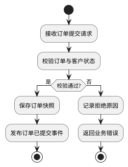

# Flowchart examples

## Positive: one order-submission outcome

Why it works: one trigger, one decision, two explicit terminal outcomes, and no unrelated fulfillment or payment flow.

## Negative: entire business lifecycle

Bad: one chart starts at registration and continues through login, ordering, payment, procurement, production, delivery, refund, reporting, and administration.

Why it fails: readers cannot identify one trigger or outcome. Repair it with separate registration, order submission, payment, fulfillment, and refund diagrams.

## Negative: unlabeled diamond maze

Bad: several diamonds named “判断” with unlabeled arrows and backward edges. Repair by phrasing each decision as a question, labeling every outcome, keeping the happy path vertical, and extracting repeated retry/error handling.
