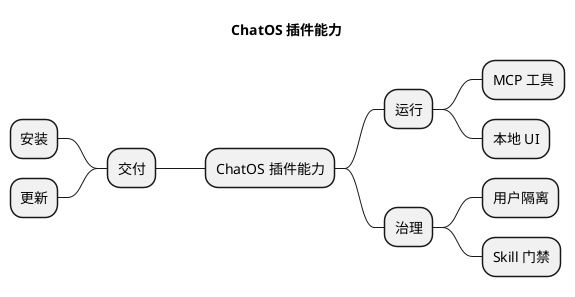

# Diagram Studio mind-map guide

Use this Skill only after the Diagram Studio router selects `kind: mindmap`. A mind map organizes one question or subject into a tree of progressively more specific topics. It is not a flowchart, dependency graph, task board, or a container for every fact found in a project.

## Choose the purpose and mode

- `brainstorm`: explore alternatives, ideas, risks, or questions without pretending they form a process.
- `knowledge-map`: explain the parts of one concept and how the concepts are grouped.
- `project-breakdown`: decompose one outcome into workstreams, deliverables, and bounded next-level tasks. Do not encode schedule dependencies as branches.

If the user asks how events happen in order, use a flowchart or sequence diagram. If the user asks what services depend on each other, use an architecture diagram. A mind map answers “what belongs under this subject?”

## Required structure

1. Create exactly one central topic. Its label states the map's single subject, not a generic title such as “系统” or “全部内容”.
2. Give every non-root topic exactly one parent. Branches form a tree: no cycles, cross-links, duplicate parentage, or disconnected semantic topics.
3. Make first-level branches mutually distinct. Prefer dimensions such as users, capabilities, risks, decisions, evidence, or phases only when they genuinely partition the subject.
4. Use short noun phrases or action phrases. A topic is a label, not a paragraph, file dump, or explanatory note.
5. Keep ordinary depth between two and four levels. Prefer two to six children per topic; regroup a topic before it exceeds eight direct children.
6. Keep one meaning per branch. When two branches repeat the same concepts under different wording, merge or sharpen their boundaries.
7. Split unrelated subjects into separate diagrams. A project may and usually should have several mind maps.

## Evidence and claims

For code-derived maps, create only topics supported by inspected code or supplied requirements. Map stable generated topic identifiers such as `mindmap-1`, `mindmap-2`, and so on to source references through `nodeEvidence`. Put evidence paths in metadata, never in visible topic labels. Mark uncertain product or organizational assumptions outside the diagram rather than presenting them as facts.

## PlantUML mindmap source

Generate native PlantUML mindmap syntax:

- Use one `*` for the root and add one star per level.
- Emit right-side primary branches first. Use `left side` once before left-side primary branches.
- Keep source order stable because it determines sibling order.
- Do not simulate a mind map with `component`, arrows, packages, or activity syntax.
- Do not add relationship labels or arrowheads. The branch itself means parent-child membership.

## Planning and generation protocol

Read [positive and negative examples](references/examples.md) before preparing the plan.

Call `diagram_prepare_generation` with:

- `kind: mindmap`;
- one mode from this guide;
- a stable `artifactKey` for this logical map;
- `structure` listing the intended first-level branches;
- item and edge estimates where a valid tree has `estimatedEdgeCount = estimatedPrimaryItemCount - 1`;
- every checklist ID from `contract.json`.

Then call `diagram_commit_generation` with native `@startmindmap` source. Validate the result and do not report completion unless it is `ready: true`.

## Split rules

Create another mind map when:

- the center would need “以及”, “和所有”, or several unrelated nouns;
- the map needs more than four useful levels;
- one first-level branch dominates most of the canvas;
- the same topic must appear below several parents;
- process order, runtime calls, deployment placement, or logical dependencies become the main question;
- labels must be shrunk or converted into paragraphs to fit.

Do not solve overload by widening the canvas, shrinking text, or adding cross-links. Split the subject and give each new map a precise title and artifact key.
