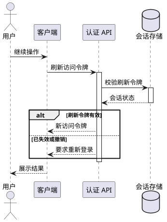

# Sequence examples

## Positive: one token-refresh scenario

Why it works: one trigger, four distinct roles, causal ordering, bounded nested activations, and a compact alternative outcome.

## Positive: asynchronous task dispatch

Show API → queue as asynchronous publish, queue → worker as delivery, and worker → result store as the later write. Do not draw an immediate worker response to the API unless the implementation actually has a callback or polling interaction.

## Negative: product lifetime sequence

Bad: one diagram contains registration, login, browsing, ordering, payment, production, delivery, refund, and reporting among more than a dozen participants.

Why it fails: the vertical order falsely implies one runtime transaction and the diagram becomes too tall to read. Repair it with separate diagrams such as 登录刷新、订单提交、支付回调、履约启动、退款处理.

## Negative: activation bar for every arrow

Bad: every incoming message creates a new overlapping activation and no activation ends.

Repair: reuse the receiver's current activation when it already covers the message, create nested activation only for actual nested work, and deactivate after the response or scenario work ends.

## Negative: fragment used as an opaque mask

Bad: a large loop rectangle is placed above messages and activation bars, making their labels faint or hidden.

Repair: size the fragment around only its operands, keep the frame behind content, reserve header padding, and split the repeated subscenario when the frame occupies most of the diagram.
