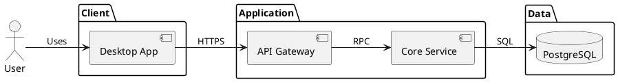

# Diagram Studio workflow

Use Diagram Studio when a user asks to visualize a software architecture, process, responsibility flow, infrastructure topology, dependency map, or interaction sequence.

## Rules

1. Read the relevant project files before claiming that a component or connection exists.
2. Use stable, descriptive node IDs such as `api-gateway`, `project-service`, or `postgres-primary`.
3. Put source paths or concise evidence into each node's `data.sourceReferences` when the diagram is based on code.
4. Read the current document and revision before editing it.
5. Treat the ChatOS runtime scope as authoritative. Never accept or invent a ChatOS project ID in tool arguments; the host injects it outside the model-controlled MCP schema.
6. List or create a Diagram Studio project before creating a diagram. Pass its `projectId` to document creation and PlantUML import tools.
7. Prefer `diagram_apply_patch` over complete replacement so unrelated user edits are preserved.
8. If a revision conflict occurs, read the document again and rebase the intended change.
9. Run `diagram_auto_layout` after adding or removing several nodes.
10. Run `diagram_validate` before reporting that a project-derived diagram is complete.
11. Use edge labels for protocols or semantics such as `HTTPS`, `MCP`, `SQL`, `Publish`, `Consume`, or `depends_on`.
12. Do not invent code relationships. If a relationship is inferred rather than verified, state that in the node or edge description.
13. For diagrams supplied as PlantUML, use `diagram_import_plantuml` so the visual editor and source share the same semantic model. Pass `kind` when the source is ambiguous.
14. Preserve user-authored canvas layout and styling. Use focused document patches for visual changes; do not replace an existing diagram from generated PlantUML unless the user asks to apply source changes.
15. Every mutating AI call must include an `idempotencyKey` that is stable for that single intended tool action. Reuse it only when the same call is retried; generate a new one for an intentional second diagram.
16. For an AI-maintained deliverable, also use a stable `artifactKey` (for example `system-architecture-main` or `checkout-sequence-v2`) with `mode: "upsert"`. This identifies one diagram instance, not a diagram category. Multiple architecture diagrams are valid when they have different artifact keys or use `create_new`.
17. Do not use a diagram title as identity. Titles may be renamed or translated; `artifactKey` is the logical instance identity inside a Diagram Studio project.

## Plan a diagram set before drawing

A Diagram Studio project is a container for related diagrams, not a requirement to place the whole system on one canvas. When the requested scope covers several business capabilities, user journeys, or technical levels, plan a small diagram set and create multiple focused diagrams unless the user explicitly asks for one consolidated view.

- Each diagram must answer one clear question and have a title that states that subject. If a proposed title needs “and”, “与”, or “以及” to join unrelated goals, split it.
- Do not combine independent business processes merely because they belong to the same software project. Registration, order fulfillment, refunds, approvals, scheduled jobs, and administration are normally separate flowcharts or swimlanes.
- Use an overview diagram only to show the relationships among major capabilities. Do not duplicate every step, exception, API call, and data object inside that overview.
- Create detail diagrams for the important capabilities or scenarios. Reusing the same diagram type several times in one project is expected and is not duplication when each diagram has a distinct scope and `artifactKey`.
- Treat more than about 15 meaningful process nodes, more than 3 major independent branches, several unrelated start/end events, or labels that are unreadable at fit-to-view as strong signals to split the diagram. These are decision signals, not targets to fill.
- Do not solve crowding by shrinking nodes, reducing text below a comfortable reading size, or expanding the canvas indefinitely. Split by business outcome, actor collaboration, bounded context, runtime environment, or level of detail.
- Keep closely related error handling, retries, and alternatives with their primary scenario when they help explain that scenario. Move reusable subprocesses or unrelated exception families into their own diagrams.

For a whole-system request, a useful default deliverable is:

1. One concise system or business-capability overview.
2. Separate flowcharts or swimlanes for each major business outcome.
3. Separate sequence diagrams for the most important runtime interactions.
4. Architecture or topology detail diagrams only where the overview cannot communicate the required technical structure.

Before creating documents, identify this diagram set, give every item a stable title and `artifactKey`, and avoid creating two diagrams that communicate substantially the same scope.

## Diagram choice

- Architecture: services, modules, storage, APIs, queues, and external systems.
- Flowchart: one business outcome or focused subprocess with its sequential steps, decisions, retries, and terminal states.
- Swimlane: one collaboration scenario across teams or systems with clear ownership boundaries.
- Topology: hosts, zones, networks, gateways, clusters, replicas, and observability.
- Sequence: one use case or runtime scenario with its participants, synchronous calls, return messages, activation intervals, and closely related combined fragments.

## Typical sequence

1. Inspect the project or process description and decide whether it needs one diagram or a focused diagram set.
2. Call `diagram_list_projects` in the current isolated runtime scope.
3. Reuse the intended Diagram Studio project or call `diagram_create_project`.
4. For each planned diagram, choose a distinct stable `artifactKey` and an `idempotencyKey` for that tool action. Call `diagram_create_document` or `diagram_import_plantuml` with that `projectId`, both keys, and `mode: "upsert"`.
5. Read the created document.
6. Patch nodes and edges with verified names and evidence.
7. Auto-layout.
8. Validate.
9. Export JSON, SVG, or PlantUML as requested.

## Architecture diagram standard

An architecture diagram is not a flat dependency graph. It must communicate system boundaries, layers, ownership, and one primary reading direction.

- Start with a system-context or container-level view. Default to 4–7 top-level domains such as External, Client, Edge/API, Application/Domain, Data, and Infrastructure.
- Use PlantUML `package`, `frame`, or other grouped structural blocks for real visual boundaries. Put components inside their owning boundary; never represent a package as a peer component.
- Keep one clear direction, normally left-to-right: users/external systems → clients → entry points → domain services → data/infrastructure.
- Show only verified, architecturally important dependencies. Prefer one labeled edge for a meaningful protocol or responsibility; omit incidental imports and utility calls.
- Limit each boundary to roughly 3–6 core components. If the whole view exceeds about 20 components, create a high-level overview and separate detail diagrams instead of shrinking everything into one canvas.
- Avoid edges that span the whole canvas, duplicated bidirectional edges, crossing lines, floating nodes, and unrelated implementation details.
- Use readable labels: a short component name plus an optional concise responsibility. Do not place file paths, environment variables, long class lists, or source excerpts in the visible label; keep evidence in `sourceReferences`.
- Use a consistent visual hierarchy: boundaries are subdued dashed containers, components are transparent with visible borders, and external actors/data stores use appropriate icons.
- Before completion, verify that every top-level boundary has a purpose, the primary request/data path can be followed without guessing, labels remain readable at fit-to-view, and unused whitespace is not caused by an outlier node or long edge.

For project-derived architecture, prefer `diagram_import_plantuml` with stable aliases and grouped Component Diagram source. Example structure:

## PlantUML workflow

- Sequence supports participant, actor, boundary, control, entity, database, queue, messages, activate/deactivate, and alt/opt/loop-style fragments.
- In sequence diagrams, give every participant that performs synchronous work an activation interval. Start it when a synchronous call transfers control and normally end it at the matching return. Keep explicit `activate`/`deactivate` statements for intentional or nested intervals; asynchronous notifications (`->>`/`-->>`) must not create long inferred activations.
- Combined fragments such as `alt`, `opt`, and `loop` are structural boundaries, not content masks. Keep messages and activation bars readable inside them and avoid overlapping fragment labels with the first message.
- Flowchart supports Activity Diagram `start`, activities, `if/else/endif`, and `stop` semantics.
- Swimlane supports the same Activity semantics plus `partition` and `|Lane|` lane switches.
- Architecture supports Component Diagram actors, components, interfaces, databases, queues, and labeled or dashed dependencies.
- Topology supports Deployment Diagram nodes, clouds, databases, storage, artifacts, and labeled or dashed infrastructure links.
- Diagram Studio layout comments are valid PlantUML comments. Keep them intact when exact canvas round-tripping matters.
- Unknown PlantUML statements are preserved as opaque source blocks but may not have visual editing controls.
