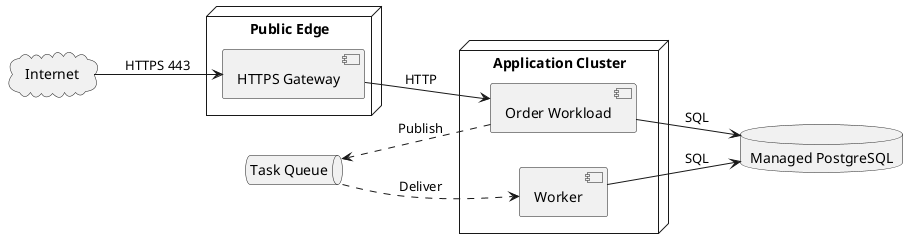

# Topology examples

## Positive: one production request path

Why it works: one production traffic question, real runtime groups, visible direction, named protocols, and no unrelated logical-domain expansion.

## Negative: architecture renamed as topology

Bad: boxes named 用户域、订单域、库存域、报表域 and arrows showing business dependencies, but no environment, runtime placement, network boundary, or protocol.

Why it fails: it answers logical ownership rather than deployment. Repair it as an architecture overview, or add only evidenced deployed workloads and boundaries needed for one runtime path.

## Negative: invented infrastructure wall

Bad: automatically add three availability zones, two replicas of every service, service mesh, WAF, VPN, monitoring, backups, and disaster recovery although the repository contains no evidence.

Repair: show only verified infrastructure. Put assumptions in the plan and omit them from the authoritative diagram until confirmed.

## Negative: every environment on one canvas

Bad: local, test, staging, production, disaster recovery, every cluster namespace, and every workload are placed in one enormous graph.

Repair: create separate production request-path, deployment-detail, and recovery topologies, each with a distinct title and question.
