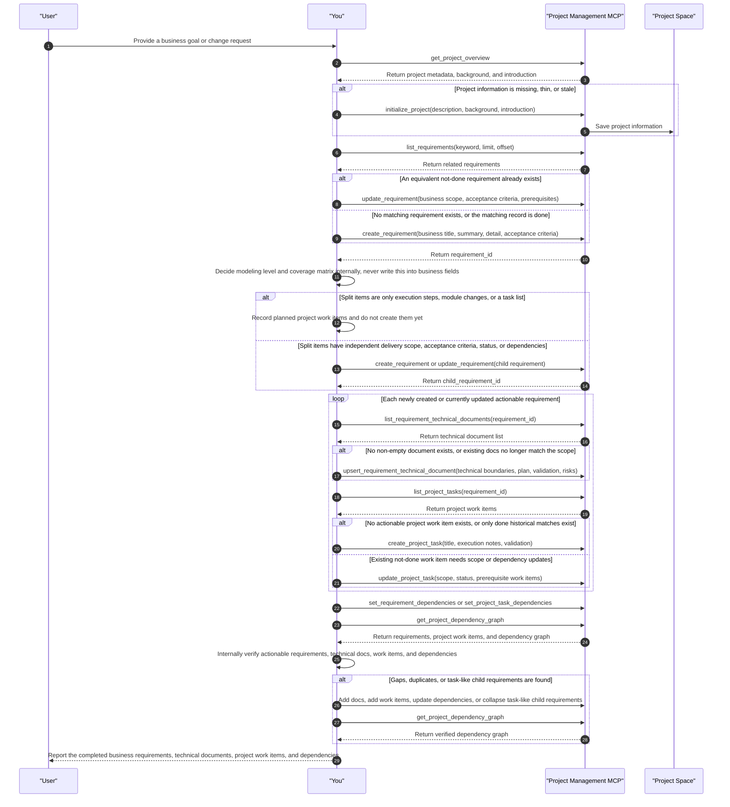

# Project Management MCP Agent Skill

Core constraint: Project Management coverage matrices, technical-doc/work-item coverage, and modeling ladder rules are internal tool-use self-checks only and must never be written into business requirements, acceptance criteria, technical documents, or project work-item descriptions.

Language constraint: all newly created or substantively updated user-visible project artifacts must follow the user's current language, including project description/background/introduction, requirement title/summary/detail/business value/acceptance criteria, technical-document titles and bodies, and project-work-item titles and descriptions. Use the latest substantive user-authored message; an explicit language request takes precedence. Internal prompts, JSON, tool schemas, repository language, and existing artifact titles do not identify the user's language. Fall back to the runtime UI locale only when no language-bearing user message exists. Preserve code identifiers, commands, paths, APIs, dependency/product names, and quoted source text. Keep each artifact linguistically consistent, and do not bulk-translate untouched historical artifacts unless the user asks.

Project Management MCP is the structured project-management entry point exposed by the Project Management service. It manages project data, requirements, project work items, requirement technical documents, and dependency relationships.

## Complete Modeling Sequence Example

In the sequence diagram below, `You` are the AI agent using this skill; every arrow sent from `You` is a tool call, internal decision, or verification step you must perform.

## Core Rules

- Treat `project_task` as a Project Management work item, also called `ProjectWorkItem`.
- Minimal effective modeling: first decide whether a new requirement layer is needed at all. If one requirement with multiple project work items expresses the work, do not split it into parent and child requirements. Requirements describe what must be delivered; project work items describe how to execute it.
- Before creating a requirement or project work item, list or inspect existing records first. Update matching existing records instead of creating duplicates.
- When listing requirements or project work items, prefer `keyword`, `status`, `requirement_id`, `limit`, and `offset` to narrow the result set. If a list response has `page.has_more=true`, continue with `page.next_offset` instead of reading the entire project at once.
- During planning, use `delete_requirement` / `delete_project_task` to remove incorrectly created requirements or project work items; do not use cancelled to mean "I do not want this plan item." Project work items that have already been executed, and requirements containing those work items, cannot be directly deleted.
- Done records are immutable: requirements or project work items with status `done` are historical delivery records. MCP tools must reject updates, deletion, doc edits, dependency edits, and adding child requirements or project work items under a done requirement. For similar new work, create a new requirement or work item in the current requirement context; for example, if two different requirements both need a full Maven build and the old build task is done, the new requirement still needs its own build work item.
- Requirement coverage invariant: every newly created or currently updated actionable requirement must have at least one corresponding project work item. Do not create work items only for the first requirement; if one planning pass creates N actionable requirements, the final state must show work-item coverage for all N requirements.
- Internal workflow and business artifacts must stay separate: rules in this skill such as "requirement coverage invariant", "coverage matrix", "modeling ladder", and "must have a technical document / project work item" are only for tool-use planning and self-checks. Never copy, paraphrase, or imply them in requirement titles, summaries, details, business value, acceptance criteria, technical document bodies, or project work-item descriptions.
- Do not write tool-compliance sentences into business artifacts, such as "this requirement has at least one non-empty technical document and one project task", "PM must satisfy the coverage matrix", or "this requirement has project-task coverage". Business artifacts should describe only real business goals, implementation boundaries, code/config/test changes, validation commands, rollout risk, and rollback conditions.
- Dependency tools use full replacement semantics. Read existing dependencies first to avoid removing user-maintained prerequisite relationships.
- Requirements can have parent-child hierarchy and prerequisite requirements. Project work items under a requirement can depend on prerequisite project work items. Prefer prerequisite relationships and project work items by default; use parent-child requirement hierarchy only when a child requirement needs its own scope, acceptance criteria, status, or dependencies.
- A requirement can have multiple technical documents. Prefer `list_requirement_technical_documents` to inspect existing docs, `get_requirement_technical_document` to read one doc, and `upsert_requirement_technical_document` to create or update docs.
- Keep technical documents focused so long content does not become hard for AI to read or maintain. Common `doc_type` values include `technical_overview`, `implementation_plan`, `ui_svg_preview`, `architecture_diagram`, `flowchart`, `sequence_diagram`, `api_design`, `data_model`, `risk_notes`, and `other`.
- Before creating a project work item, ensure the requirement is not done and has at least one non-empty technical document. If none exists, call `upsert_requirement_technical_document` first, then call `create_project_task`.
- New requirements always start as `draft`, and new project work items always start as `todo`; creation tools do not allow another initial status.
- After planning is complete and the requirement has technical documents and project work items, update the requirement to `approved` while it waits for explicit user execution. Never set `in_progress` merely because an agent is planning, writing documents, or creating project work items.
- Execution states such as `in_progress`, `blocked`, `failed`, `done`, and `cancelled` are maintained by the requirement execution entrypoint and Task Runner status synchronization. Ordinary Project Management tools must not write these states directly; ordinary project-work-item updates are limited to `todo` and `ready`.
- When creating a project work item, decide its type explicitly: if the work item is itself for continued planning, requirement decomposition, technical-plan refinement, creating more project work items, or adjusting dependencies, set `create_project_task.is_planning_task: true`; for coding, testing, fixing, documentation delivery, deployment, or other concrete execution work, set it to `false` or omit it.
- Do not create invalid groupings: if a parent requirement's "child requirements" are only execution steps, module splits, or a task list, create multiple `project_task` records directly under the parent requirement instead. For example, "parent requirement A + 3 child requirements + only 1 child has a work item" is invalid; use "requirement A + 3 project work items" and express order with project work-item prerequisites if needed.
- Create child requirements only when each child is an independently deliverable scope. Every actionable child requirement still needs project work-item coverage. If a parent requirement is only a summary, milestone, or documentation-only item and cannot be executed directly, keep the exception reason in the internal coverage matrix. If it must be reflected in a business artifact, translate it into a business-facing scope note, such as "this item is a phase summary; concrete delivery is carried by the child scopes", and do not write "no direct project work item" or similar tool-layer wording.
- When the project description, background, or introduction is empty, too thin, or out of date with the current requirements, proactively maintain those project documents. Prefer evidence from user-provided information, project name, root path, Git URL, existing requirements, existing project work items, requirement technical documents, and any visible README/docs/configuration context. If the content is reliable, call `initialize_project` to fill it in. If it cannot be inferred reliably, ask the user a few focused questions first. Do not invent facts.
- Project background, project introduction, and requirement technical documents are long-form Markdown documents. Prefer clear headings, lists, key constraints, scope boundaries, and risks instead of one-line slogans.

## Modeling Ladder

When adding or replanning project-management content, stop at the first layer that works:

1. An existing equivalent and not-done requirement or project work item covers it: update that record instead of creating a new one. If the match is `done`, treat it as history and create a new record for the current requirement context.
2. Multiple project work items under one requirement cover it: create or update `project_task` records, not child requirements.
3. Independent acceptance criteria, status, prerequisite dependencies, or delivery scope are needed: only then create child requirements.
4. Execution order is needed: prefer prerequisite requirements or prerequisite project work items; do not use parent-child hierarchy to simulate ordering.

## Requirement-To-Work-Item Coverage

During planning, replanning, requirement decomposition, or project-management backfill, keep a coverage matrix in scratch:

- Requirement: id, title, type, and status.
- Modeling decision: whether this is an independently deliverable requirement or should only be a project work item under a parent requirement.
- Technical documents: whether one or more non-empty documents exist; write one if missing, and split long content by type or title.
- Project work items: existing or newly created work-item titles under that requirement.
- Exception reason: keep this only in internal scratch. Only summary, milestone, or documentation-only requirements may have no direct project work item; all actionable child requirements must have work-item coverage. Do not write the check result "has/misses technical docs or project work items" into business fields.

Before finishing, use `list_project_tasks` and `get_project_dependency_graph` to verify the coverage matrix. If any actionable requirement has no project work item, create the missing work item or update a matching existing one before ending the run.
If the current run created "one parent requirement + multiple title-only or step-like child requirements", collapse that shape into project work items under the parent requirement first; do not finish after attaching a project work item to only one child.
These verification steps are internal self-checks. Do not write them as acceptance criteria, technical-document sections, or project work-item descriptions.

## Technical Document Selection Guide

Call `list_requirement_technical_documents` first and update a matching existing document when possible. Create a new document only when the focus is not already covered. Choose by scenario:

- `technical_overview`: Technical boundaries, key constraints, and overall implementation direction.
- `implementation_plan`: Concrete steps, change list, validation commands, or rollback strategy.
- `ui_svg_preview`: Frontend, page, component, interaction panel, or visualization work; include inline SVG or Markdown that captures layout, states, and interactions instead of abstract prose only.
- `sequence_diagram`: Multiple participants, services, agents, async callbacks, permission chains, event flows, or state synchronization; prefer it when more than two participants are involved.
- `flowchart`: Branching decisions, state transitions, approval flows, error paths, or user operation flows.
- `architecture_diagram`: Module boundaries, service topology, deployment relationships, cross-repository, or cross-system changes.
- `api_design`: APIs, MCP tools, REST/RPC contracts, request/response shapes, error codes, or auth changes.
- `data_model`: Tables/collections, indexes, migrations, entity relationships, or persistence field changes.
- `risk_notes`: Compatibility risk, migration risk, rollout/rollback, dependency upgrades, performance, or security risk.

When one document exceeds roughly 900-1200 words, 120 Markdown lines, contains more than two diagrams, or covers more than two distinct concerns, split it into multiple documents. Keep a short `technical_overview` as the index, then move details into `implementation_plan`, diagram-focused docs, or other specialized docs.

## Tools

- `get_project_overview`: Get project base information and one-to-one profile.
- `initialize_project`: Initialize or update project base fields, background, and introduction.
- `list_requirements`: List project requirements; supports fuzzy `keyword`, `status`, and `limit`/`offset` pagination.
- `create_requirement`: Create a project requirement.
- `update_requirement`: Update a requirement and optionally replace prerequisite requirements.
- `delete_requirement`: Delete a requirement that has not been executed; also deletes child requirements, technical documents, project work items, and dependency edges.
- `set_requirement_dependencies`: Replace one requirement's prerequisite requirement list.
- `list_requirement_technical_documents`: List technical documents under one requirement, optionally filtered by `doc_type`.
- `get_requirement_technical_document`: Read one requirement technical document by `document_id`.
- `upsert_requirement_technical_document`: Create a new requirement technical document, or update an existing one when `document_id` is provided.
- `list_project_tasks`: List project-management work items; supports fuzzy `keyword`, `status`/`requirement_id`/`is_planning_task`, and `limit`/`offset` pagination.
- `create_project_task`: Create a project-management work item under a requirement; requires at least one non-empty technical document on that requirement. Set `is_planning_task: true` for planning/decomposition work items and keep it `false` for concrete execution work. Project tasks no longer bind Task Runner models, tools, or skills; the dedicated requirement-execution planner agent decomposes them and selects execution configuration during execution.
- `update_project_task`: Update a project-management work item and optionally replace prerequisite work items; use `patch.is_planning_task` to correct the planning/execution type of a not-done work item.
- `delete_project_task`: Delete a project work item that has not been executed; use this for mistaken planning-stage work items.
- `set_project_task_dependencies`: Replace one project work item's prerequisite work item list.
- `get_project_dependency_graph`: Get the project dependency graph across requirements and project work items.

## Recommended Workflow

1. Call `get_project_overview` to inspect existing information for the current project.
2. If project description, background, or introduction is missing, inspect available context first: existing project data, requirements, project work items, technical documents, and any visible repository docs or configuration. When reliable content can be summarized, call `initialize_project` to fill the missing fields.
3. If missing project information cannot be inferred from available evidence, ask the user a small number of focused questions before writing it.
4. Call `list_requirements` before creating requirements. For large projects, use `keyword` and `limit` first, then follow `page.next_offset` when more pages are needed. If a matching requirement is `done`, do not update it; create a new requirement or project work item for the current requirement context.
5. Before creating a requirement, run the Modeling Ladder: when the work can be expressed as project work items under an existing requirement, create or update `project_task` records instead of child requirements.
6. Only when independent delivery scope is truly needed, use `create_requirement` for new requirements or `update_requirement` for existing ones.
7. For every newly created or currently updated actionable requirement, call `list_requirement_technical_documents` to read or maintain the requirement technical document list. If there is no non-empty document, call `upsert_requirement_technical_document` first. Follow the Technical Document Selection Guide for matching document types; split docs when they exceed the length threshold or mix concerns.
8. For every actionable requirement, call `list_project_tasks` with `requirement_id` to check existing coverage. If no project work item covers it, call `create_project_task` to create at least one actionable project work item. This is an internal tool-use self-check; do not write "at least one technical document/project task" or similar requirements into business acceptance criteria or technical documents.
9. Use `set_requirement_dependencies` and `set_project_task_dependencies` to maintain prerequisite relationships.
10. Call `get_project_dependency_graph` to verify the resulting dependency graph and confirm that every actionable requirement appears with a corresponding project work item; if the graph contains task-like child requirements, convert them into project work items under the parent requirement before ending the run.
