# Project Management MCP Agent Skill

核心约束：Project Management 的覆盖矩阵、技术文档/项目任务覆盖、建模阶梯等规则只用于内部工具调用自检，绝不能写进业务需求、验收标准、技术文档正文或项目任务描述。

Project Management MCP 是项目管理微服务对外提供的项目结构化管理入口。它管理的是项目资料、需求、项目任务、需求技术文档和依赖关系。

## 完整建模时序示例

在下面的时序图中，`你` 就是正在使用本 Skill 的 AI agent；所有从 `你` 发出的箭头，都是你需要执行的工具调用、内部判断或复核动作。

```mermaid
sequenceDiagram
    autonumber
    participant U as "用户"
    participant A as "你"
    participant PM as "Project Management MCP"
    participant S as "项目空间"

    U->>A: 提出业务目标或改造意图
    A->>PM: get_project_overview
    PM-->>A: 返回项目资料、背景和介绍
    alt 项目资料缺失、过薄或过期
        A->>PM: initialize_project(补充项目描述、背景、介绍)
        PM->>S: 保存项目资料
    end

    A->>PM: list_requirements(keyword, limit, offset)
    PM-->>A: 返回相关需求
    alt 已有同义且未完成的需求
        A->>PM: update_requirement(业务范围、验收标准、前置需求)
    else 没有匹配需求，或匹配项已完成
        A->>PM: create_requirement(业务标题、summary、detail、acceptance criteria)
    end
    PM-->>A: 返回 requirement_id

    A->>A: 内部判断建模层级和覆盖矩阵，禁止写入业务字段
    alt 拆分项只是执行步骤、模块改动或任务清单
        A->>A: 记录为待创建或待更新的项目任务，先不创建任务
    else 拆分项有独立交付范围、验收标准、状态或依赖
        A->>PM: create_requirement 或 update_requirement(子需求)
        PM-->>A: 返回 child_requirement_id
    end

    loop 每个新建或本轮更新的可执行需求
        A->>PM: list_requirement_technical_documents(requirement_id)
        PM-->>A: 返回技术文档列表
        alt 无非空技术文档，或现有文档不匹配当前范围
            A->>PM: upsert_requirement_technical_document(技术边界、实现计划、验证与风险)
        end
        A->>PM: list_project_tasks(requirement_id)
        PM-->>A: 返回项目任务列表
        alt 缺少可执行项目任务，或只有已完成的相似历史任务
            A->>PM: create_project_task(任务标题、执行说明、验证方式)
        else 已有未完成项目任务但范围或依赖需要调整
            A->>PM: update_project_task(任务范围、状态、前置任务)
        end
    end

    A->>PM: set_requirement_dependencies 或 set_project_task_dependencies
    A->>PM: get_project_dependency_graph
    PM-->>A: 返回需求、项目任务和依赖图
    A->>A: 内部复核可执行需求、技术文档、项目任务和依赖完整性
    alt 发现缺口、重复项或任务式子需求
        A->>PM: 补文档、补任务、更新依赖或合并任务式子需求
        A->>PM: get_project_dependency_graph
        PM-->>A: 返回复核后的依赖图
    end
    A-->>U: 汇报已完善的业务需求、技术文档、项目任务和依赖关系
```

## 核心规则

- 把 `project_task` 理解为项目管理里的任务/工作项，也就是 `ProjectWorkItem`。
- 最小有效建模：先判断是否真的需要新需求层级。能用一个需求加多个项目任务表达的，就不要拆成父需求/子需求。需求描述“要交付什么”，项目任务描述“怎么执行”。
- 创建新需求或项目任务前，优先使用列表/概览工具检查是否已经存在同义内容，能更新就不要重复创建。
- 查询需求或项目任务时，优先使用 `keyword`、`status`、`requirement_id`、`limit` 和 `offset` 缩小范围；列表返回 `page.has_more=true` 时，用 `page.next_offset` 继续翻页，不要一次性全量读取完整项目。
- 规划阶段创建错的需求或项目任务，使用 `delete_requirement` / `delete_project_task` 直接删除；不要用 cancelled 表达“我不想要这个计划项”。已经被执行的项目任务，以及包含这类项目任务的需求，不能直接删除，应保留执行链路并更新状态。
- 已完成记录不可变：状态为 `done` 的需求或项目任务是历史交付记录，MCP 工具必须拒绝修改、删除、补文档、改依赖，或向已完成需求下追加子需求/项目任务。遇到相似的新工作时，新建属于当前需求语境的需求或项目任务；例如两个不同需求都需要全量 Maven build，即使旧需求里的 build 任务已完成，新需求仍要新建自己的 build 项目任务。
- 需求覆盖不变量：每个新建或本轮更新的可执行需求，必须至少有一个对应的项目任务/工作项。不要只给第一个需求建任务；如果一次规划创建了 N 个可执行需求，收尾时必须能看到 N 个需求都被项目任务覆盖。
- 内部流程与业务产物必须隔离：本 Skill 中的“需求覆盖不变量”“覆盖矩阵”“建模阶梯”“必须有技术文档/项目任务”等规则，只用于指导工具调用和自检，绝不能复制、转述或暗示到需求标题、summary、detail、business value、acceptance criteria、技术文档正文或项目任务描述里。
- 禁止在业务产物中写入工具层合规句子，例如“本 requirement 至少具备 1 个非空 technical document 与 1 个 project task”“PM 中需要满足覆盖矩阵”“本需求已有项目任务覆盖”等。业务产物只描述真实业务目标、实现边界、代码/配置/测试改动、验证命令、上线风险和回滚条件。
- 依赖工具使用“完整替换列表”语义。调用前先确认现有依赖，避免误删用户已维护的前置关系。
- 需求之间可以有父子层级，也可以有前置需求；同一个需求下面的项目任务之间也可以有前置项目任务。默认优先使用前置关系和项目任务，只有子需求需要独立范围、验收标准、状态或依赖时才使用父子层级。
- 一个需求可以维护多份技术文档。优先使用 `list_requirement_technical_documents` 查看现有文档，再用 `get_requirement_technical_document` 读取指定文档，用 `upsert_requirement_technical_document` 创建或更新文档。
- 技术文档应按关注点拆分，避免单篇过长影响 AI 读取和维护。常用 `doc_type` 包括 `technical_overview`、`implementation_plan`、`ui_svg_preview`、`architecture_diagram`、`flowchart`、`sequence_diagram`、`api_design`、`data_model`、`risk_notes`、`other`。
- 创建项目任务前，必须确保该需求尚未完成，并且至少有一份非空技术文档；如果文档为空，先调用 `upsert_requirement_technical_document` 补齐，再调用 `create_project_task`。
- 创建项目任务时必须判断任务类型：如果该项目任务的目标是继续规划、继续拆解需求、补充技术方案、创建更多项目任务或调整依赖，调用 `create_project_task` 时设置 `is_planning_task: true`；如果任务目标是编码、测试、修复、文档落地、部署或其他具体执行工作，设置为 `false` 或省略。
- 不要创建无效分组：如果一个父需求下面的“子需求”只是执行步骤、模块拆分或任务清单，直接在父需求下创建多个 `project_task`。例如“父需求 A + 3 个子需求 + 只有 1 个子需求有任务”是无效结构；应改为“需求 A + 3 个项目任务”，必要时用项目任务前置关系表达顺序。
- 只有当子需求本身是独立可交付范围时才创建子需求；每个可执行子需求仍然必须有项目任务覆盖。如果某个父需求只是汇总、里程碑或纯资料整理，不能直接执行，例外理由只用于内部覆盖矩阵；如必须写入业务文档，只能转译成业务范围说明，例如“本项为阶段汇总，实际落地由下列子范围承载”，不要写“无直接项目任务”或类似工具层表述。
- 当项目描述、项目背景或项目介绍为空、明显过短或已经落后于当前需求时，要主动维护这些项目资料。优先基于用户已提供的信息、项目名、根目录、Git 地址、已有需求、已有项目任务、需求技术文档以及当前上下文中可见的 README/docs/配置文件等线索整理；能确认的内容直接调用 `initialize_project` 补充，不能确认时先向用户提出关键问题，不要编造。
- 项目背景、项目介绍和需求技术文档都按 Markdown 长文档维护。优先使用清晰的小标题、列表、关键约束、范围边界和风险说明，避免只写一句口号式描述。

## 建模阶梯

新增或重规划项目管理内容时，按这个顺序停止在第一个可行层级：

1. 已有同义且未完成的需求或项目任务能覆盖：更新已有记录，不新建；如果匹配项已 `done`，只作为历史参考，新建当前需求语境下的记录。
2. 一个需求下多个项目任务能覆盖：创建或更新 `project_task`，不要创建子需求。
3. 需要独立验收、状态、前置依赖或单独交付范围：才创建子需求。
4. 需要表达先后顺序：优先使用前置需求/前置项目任务，不要用父子层级模拟顺序。

## 需求到任务覆盖

在规划、重规划、拆需求或补写项目管理内容时，先在草稿中维护一张覆盖矩阵：

- 需求：需求 id/标题/类型/状态。
- 建模判断：这是独立可交付需求，还是应该只是父需求下的项目任务。
- 技术文档：是否已有一份或多份非空文档；没有就补写，过长就按类型或标题拆分。
- 项目任务：该需求下已有或本轮创建的项目任务标题。
- 例外理由：只在内部草稿中记录。只有汇总、里程碑或纯资料需求才允许没有直接项目任务；其所有可执行子需求必须有任务覆盖。不要把“缺少/已有技术文档或项目任务”的检查结果写入业务字段。

收尾前使用 `list_project_tasks` 和 `get_project_dependency_graph` 复核覆盖矩阵。发现某个可执行需求没有项目任务时，继续创建缺失任务或更新已有任务，不要直接结束。
如果发现本轮创建了“父需求 + 多个只有标题/步骤性质的子需求”，先合并为父需求下的项目任务；不要把项目任务只挂到其中一个子需求后就结束。
这些复核动作是内部自检，不得作为验收标准、技术文档章节或项目任务描述写入业务内容。

## 技术文档选择指南

先用 `list_requirement_technical_documents` 查看已有文档，优先更新匹配文档；没有匹配关注点时再创建新文档。按场景选择：

- `technical_overview`: 需求的技术边界、关键约束、整体实现方向。
- `implementation_plan`: 需要明确落地步骤、改动清单、验证命令或回滚策略。
- `ui_svg_preview`: 前端、页面、组件、交互面板、可视化工具等 UI 需求；用内联 SVG 或 Markdown 说明关键布局、状态和交互，不要只写抽象描述。
- `sequence_diagram`: 多参与方、多服务、多代理、异步回调、权限链路、事件流或状态同步；参与方超过 2 个时优先补时序图。
- `flowchart`: 有分支判断、状态流转、审批流、错误处理路径或用户操作流程。
- `architecture_diagram`: 模块边界、服务拓扑、部署关系、跨仓库或跨系统改造。
- `api_design`: 接口、MCP tool、REST/RPC contract、请求响应、错误码或鉴权变化。
- `data_model`: 数据库表/集合、索引、迁移、实体关系或持久化字段变化。
- `risk_notes`: 兼容风险、迁移风险、灰度/回滚、依赖升级、性能或安全风险。

单份文档超过约 1500 个中文字符、120 行 Markdown、包含 2 个以上图表，或同时覆盖 2 个以上关注点时，优先拆成多份文档。拆分时保留一份短 `technical_overview` 做索引，再把细节放到 `implementation_plan`、图表类或专项文档里。

## 工具清单

- `get_project_overview`: 查询项目基础信息和一对一 profile。
- `initialize_project`: 初始化或增量更新项目基础资料、背景和介绍。
- `list_requirements`: 查询项目需求；支持 `keyword` 模糊匹配、`status` 过滤、`limit`/`offset` 分页。
- `create_requirement`: 创建项目需求。
- `update_requirement`: 更新需求，并可同时替换前置需求。
- `delete_requirement`: 删除尚未被执行的需求；会同时删除其子需求、技术文档、项目任务和依赖边。
- `set_requirement_dependencies`: 替换某个需求的前置需求列表。
- `list_requirement_technical_documents`: 查询某个需求下的技术文档列表，可按 `doc_type` 过滤。
- `get_requirement_technical_document`: 按 `document_id` 读取某个需求下的一份技术文档。
- `upsert_requirement_technical_document`: 创建一份新的需求技术文档；传入 `document_id` 时更新已有文档。
- `list_project_tasks`: 查询项目管理任务/工作项；支持 `keyword` 模糊匹配、`status`/`requirement_id`/`is_planning_task` 过滤、`limit`/`offset` 分页。
- `create_project_task`: 在某个需求下创建项目管理任务/工作项；要求该需求至少已有一份非空技术文档。规划型项目任务必须传 `is_planning_task: true`，普通执行任务保持 `false`。项目任务不再绑定 Task Runner 模型、工具或 skill；执行阶段由专门的需求执行规划 Agent 拆分并选择执行配置。
- `update_project_task`: 更新项目管理任务/工作项，并可同时替换前置项目任务；可用 `patch.is_planning_task` 修正尚未完成项目任务的规划/执行类型。
- `delete_project_task`: 删除尚未被执行的项目任务；规划阶段删除误建任务时使用。
- `set_project_task_dependencies`: 替换某个项目任务的前置项目任务列表。
- `get_project_dependency_graph`: 查询项目级需求、项目任务和依赖图。

## 推荐工作流

1. 调用 `get_project_overview`，了解当前项目已有资料。
2. 如果项目描述、背景或介绍缺失，先主动探测可用上下文：已有项目资料、需求、项目任务、技术文档，以及当前上下文中可见的仓库说明或配置。能归纳出可靠内容时，用 `initialize_project` 增量补齐。
3. 如果缺失资料无法从现有线索可靠推断，向用户询问少量关键问题，再写入项目资料。
4. 调用 `list_requirements` 检查已有需求，避免重复创建；大项目先用 `keyword` 和 `limit` 查相关页，必要时用 `page.next_offset` 翻页。匹配到 `done` 需求时不要更新它，改为新建当前需求语境下的需求或项目任务。
5. 创建需求前先过“建模阶梯”：能作为已有需求下的项目任务表达时，直接创建/更新 `project_task`，不要创建子需求。
6. 只有确实需要独立交付范围时，才使用 `create_requirement` 创建新需求，或用 `update_requirement` 调整已有需求。
7. 对每个新建或本轮更新的可执行需求，调用 `list_requirement_technical_documents` 读取或维护该需求的技术文档列表；没有非空文档时，先调用 `upsert_requirement_technical_document`。按“技术文档选择指南”补齐匹配类型；文档超过长度阈值或关注点混杂时，拆成多份文档。
8. 对每个可执行需求调用 `list_project_tasks` 并传 `requirement_id` 检查已有覆盖；缺少项目任务时，用 `create_project_task` 至少创建一个可执行项目任务。这一步是内部工具自检，不得把“至少一个技术文档/项目任务”等要求写入业务验收标准或技术文档。
9. 使用 `set_requirement_dependencies` 和 `set_project_task_dependencies` 建立前置关系。
10. 调用 `get_project_dependency_graph` 复核依赖图是否符合用户意图，并确认每个可执行需求都能在图中看到对应项目任务；如果图里出现任务式子需求，先改成父需求下的项目任务，再结束。
